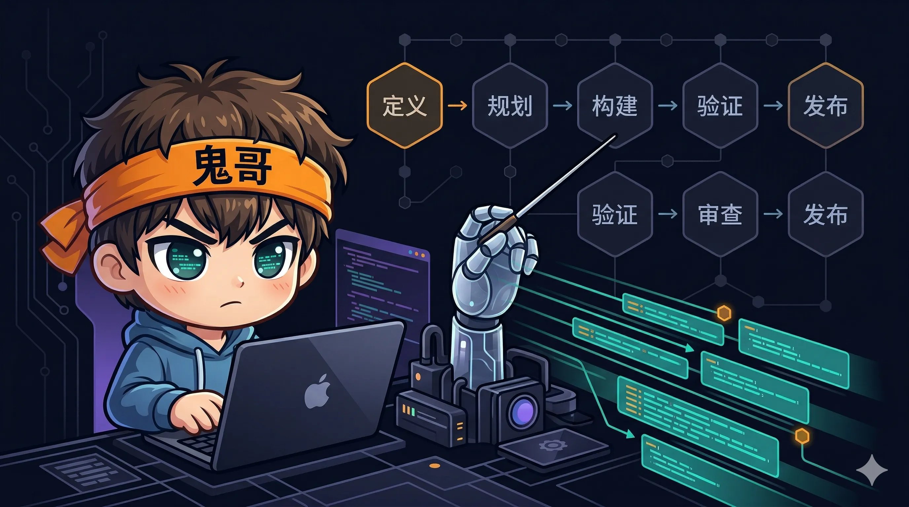
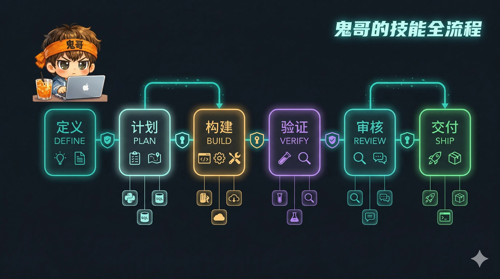
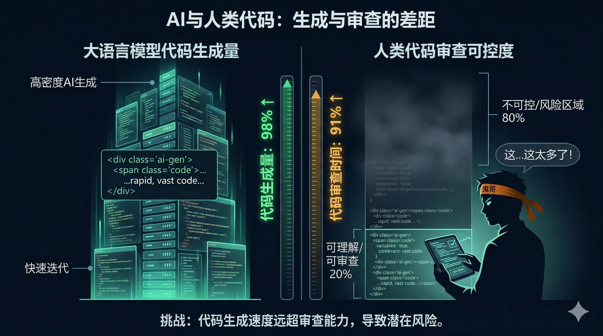
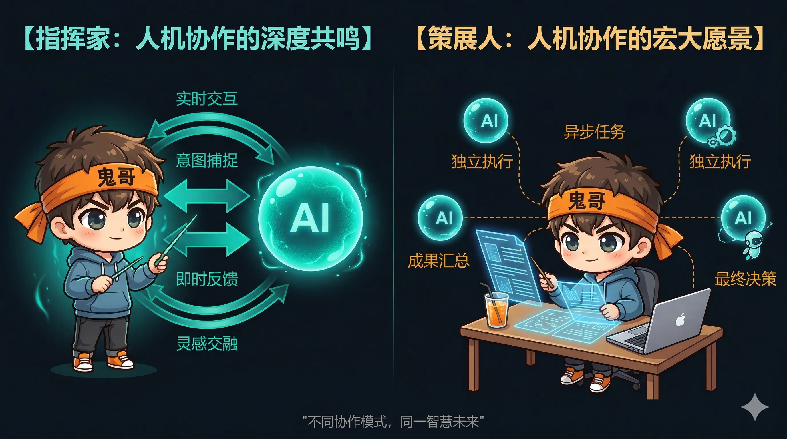
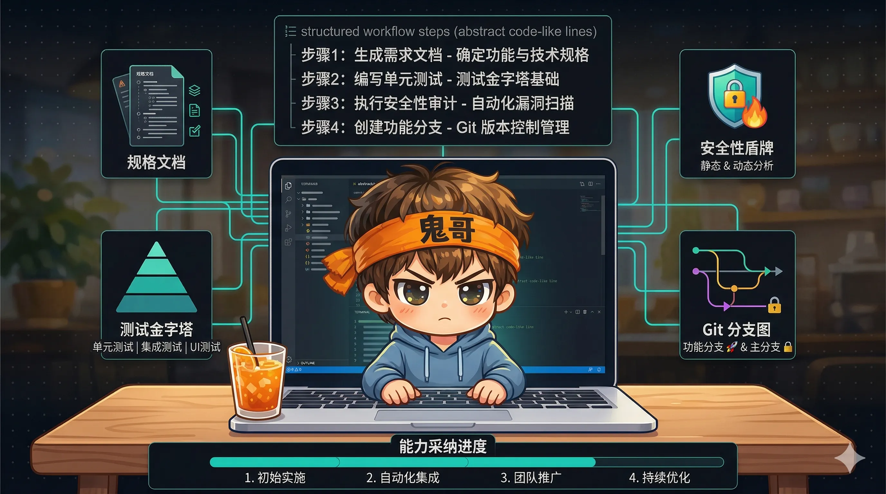

> "AI coding agents default to the shortest path — which often means skipping specs, tests, security reviews, and the practices that make software reliable."
>
> — Addy Osmani

你有没有这种体验：让 AI 写一个功能，它唰唰唰生成了 500 行代码，看起来能跑，但你心里隐约不安——**没有测试、没有规范、没有安全审查，甚至你自己都不完全理解它写了什么**。

你不是一个人。这正是 Addy Osmani 在 GitHub 上开源 [agent-skills](https://github.com/addyosmani/agent-skills) 的原因。这个项目在两个月内斩获 **7900+ stars**，核心主张简单而有力：

**AI 编程代理需要纪律，而不仅仅是能力。**

本文将深度拆解这个项目的设计哲学、19 个技能的全景图、最核心的"反合理化"创新，以及——最重要的——**如何在你的日常开发中真正落地这套体系**。



---

## 一、Addy Osmani 其人：从 Chrome DevTools 到 AI Agent 纪律

在聊 agent-skills 之前，有必要了解它的作者。

**Addy Osmani** 不是一个纯理论派。他在 Google Chrome 团队工作了近 **14 年**，担任过 **Chrome 开发者体验负责人（Head of Chrome Developer Experience）**，直接负责过 Chrome DevTools、Lighthouse、Core Web Vitals 这些被数百万开发者每天使用的工具。他的工作为 Google 创造了 **3.5 亿美元** 的利润和成本节省。

他也是 O'Reilly 出版的《Learning JavaScript Design Patterns》和《Leading Effective Engineering Teams》的作者，早年还在 jQuery 核心团队工作过。

2025 年末，他转任 **Google Cloud AI Director**，专注 Gemini、Vertex AI 和 Agent Development Kit（ADK）。这个职业转型的时间点非常关键——他是在**充分理解大规模工程团队如何运作**之后，才开始思考 AI Agent 该如何工作的。

这就是 agent-skills 的底色：**不是一个 prompt engineering 技巧集合，而是 Google 工程文化的 AI 翻译版**。

他在项目中明确引用了 [Software Engineering at Google](https://abseil.io/resources/swe-book) 和 Google 的 [engineering practices guide](https://google.github.io/eng-practices/)。换句话说，这套技能体系的每一条规则，都在世界上最大的代码库之一（Google 的 monorepo，20 亿行代码）中被验证过。

---

## 二、为什么 AI 编程代理需要"技能"？

### 2.1 AI 的默认行为：走最短路径

让我们面对现实。当你对 AI Agent 说"实现一个用户注册功能"时，它的默认行为是：

1. 直接开始写代码（跳过规范）
2. 一次性生成完整实现（跳过增量验证）
3. 可能补几个测试（如果你提醒了的话）
4. 不做安全审查
5. 不考虑 API 契约、错误处理边界、性能影响

这不是因为 AI 不会做这些事——而是因为 **没人告诉它应该做**，或者更准确地说，没人用结构化的方式告诉它 **必须做**。

### 2.2 从"能写代码"到"会做工程"

Osmani 做了一个关键区分：**Vibe Coding vs Agentic Engineering**。

| | Vibe Coding | Agentic Engineering |
|---|---|---|
| **模式** | "帮我写个 XX" | "按照 spec 实现 XX" |
| **质量控制** | 人工事后审查 | 内置验证门 |
| **适用场景** | 原型、黑客松 | 生产代码 |
| **风险** | 理解债务累积 | 前期投入大但可控 |
| **核心哲学** | AI 驱动，人类跟随 | 人类拥有架构，AI 执行 |

**Vibe Coding 没有错**——在原型阶段它效率惊人。但如果你的代码要上生产、要被团队维护、要承受真实用户的流量，你需要的是 Agentic Engineering。

### 2.3 技能（Skill）的本质：可执行的工作流

agent-skills 中的每个"技能"不是文档，不是参考手册，而是一个 **结构化的可执行工作流**。每个 SKILL.md 文件包含：

- **分步工作流程**：不是"你应该做 XX"，而是"第 1 步做 XX，第 2 步做 YY，做完后检查 ZZ"
- **验证门（Verification Gates）**：每个阶段必须通过的检查点，"看起来对"不算完成
- **反合理化表（Anti-rationalization Tables）**：AI 常用借口及预设反驳（后面详细讲）
- **红旗信号（Red Flags）**：识别技能被错误应用的迹象



---

## 三、19 个技能全景：DEFINE → PLAN → BUILD → VERIFY → REVIEW → SHIP

整个 agent-skills 体系覆盖软件开发的完整生命周期，组织为 **6 个阶段、19 个技能**：

```
DEFINE → PLAN → BUILD → VERIFY → REVIEW → SHIP
/spec    /plan   /build  /test    /review  /ship
                                  /code-simplify
```

### 3.1 Define 阶段：先想清楚再动手

| 技能 | 核心能力 |
|------|---------|
| **idea-refine** | 结构化发散/收敛思维：理解与扩展 → 评估与收敛 → 打磨输出 |
| **spec-driven-development** | 先写规范再写代码，四阶段门控：Specify → Plan → Tasks → Implement |

**spec-driven-development** 是整个体系的基石。它要求每个 spec 覆盖六大核心领域：**目标、命令、项目结构、代码风格、测试策略、边界**。

边界定义尤其精彩，采用三级体系：

- **Always**：永远做的事（如：每次改动必须有测试）
- **Ask First**：需要确认才做的事（如：修改公共 API）
- **Never**：绝不能做的事（如：直接操作生产数据库）

还有一个"假设显性化"机制：

```
ASSUMPTIONS I'M MAKING:
1. This is a web application (not native mobile)
2. Authentication uses session-based cookies (not JWT)
→ Correct me now or I'll proceed with these.
```

这比"你有什么需求？"高效一百倍——**AI 先给出假设让你纠正，而不是等你把所有需求想清楚**。

### 3.2 Plan 阶段：把大象切成薄片

| 技能 | 核心能力 |
|------|---------|
| **planning-and-task-breakdown** | 将 spec 分解为小型、可验证的任务，每个任务有明确验收标准 |

### 3.3 Build 阶段：写代码的核心战场

| 技能 | 核心能力 |
|------|---------|
| **incremental-implementation** | 薄垂直切片：实现 → 测试 → 验证 → 提交 → 下一片 |
| **test-driven-development** | Red-Green-Refactor + Prove-It Pattern + 测试金字塔 80/15/5 |
| **context-engineering** | 五层上下文管理：Rules → Spec → 源码 → 错误 → 对话 |
| **frontend-ui-engineering** | 组件架构、设计系统、WCAG 2.1 AA 无障碍 |
| **api-and-interface-design** | 契约优先、Hyrum's Law、错误语义 |

**incremental-implementation** 的核心理念：**如果你写了 1000 行但 100 行就够，你就失败了。** 它定义了三种切片策略：

- **垂直切片（首选）**：一次实现一个完整的端到端功能切面
- **契约优先切片**：先定义接口/类型，再填充实现
- **风险优先切片**：先验证最不确定的部分

**context-engineering** 是容易被忽视但极其重要的技能。它定义了五层上下文层级和三种打包策略：

- **Brain Dump**：把所有相关信息一次性灌入（小任务适用）
- **Selective Include**：精选最相关的文件和片段（中等任务）
- **Hierarchical Summary**：先给摘要，按需展开细节（大型任务）

### 3.4 Verify 阶段：证明它是对的

| 技能 | 核心能力 |
|------|---------|
| **browser-testing-with-devtools** | 通过 Chrome DevTools MCP 获取 DOM、console、network、performance 实时数据 |
| **debugging-and-error-recovery** | 五步分诊：复现 → 定位 → 简化 → 修复 → 防护 |

### 3.5 Review 阶段：质量把关

| 技能 | 核心能力 |
|------|---------|
| **code-review-and-quality** | 五轴审查 + 评论分级（Critical/Important/Nit/Optional/FYI） |
| **code-simplification** | Chesterton's Fence：删代码前先理解它存在的原因 |
| **security-and-hardening** | OWASP Top 10 预防 + 三级边界系统 |
| **performance-optimization** | 度量优先 + Core Web Vitals 目标 |

**code-review-and-quality** 的审批标准直接来自 Google："**当变更确实改善了整体代码健康度时就批准，即使它不完美。**"这是一种务实的工程文化——追求进步而非完美。

### 3.6 Ship 阶段：安全交付

| 技能 | 核心能力 |
|------|---------|
| **git-workflow-and-versioning** | 基于主干开发、原子提交 |
| **ci-cd-and-automation** | Shift Left、特性开关、质量门管道 |
| **deprecation-and-migration** | "代码即负债"、僵尸代码清理 |
| **documentation-and-adrs** | ADR 架构决策记录、文档化"为什么" |
| **shipping-and-launch** | 发布前检查清单 + 分阶段发布 + 回滚方案 |

---

## 四、核心创新：反合理化（Anti-rationalization）

如果让我从 agent-skills 中只挑一个最重要的设计模式，毫无疑问是 **反合理化表（Anti-rationalization Tables）**。

### 4.1 问题：AI 特别擅长给自己找借口

当你要求 AI Agent 遵循某个流程时，它有一种令人印象深刻的能力——**用看起来完全合理的理由解释为什么可以跳过某个步骤**。

比如：

- "这个改动很简单，不需要写 spec"
- "这个函数逻辑很清晰，不需要测试"
- "这只是内部 API，不需要安全审查"
- "代码已经很清晰了，不需要文档"

每一条听起来都很合理，对吧？**这正是问题所在。**

### 4.2 解法：预设借口 + 预设反驳

agent-skills 的做法是在每个技能文件中内置一张 **反合理化表**，预先列出 AI 可能给出的所有借口，并提供反驳：

| AI 可能说的借口 | 预设反驳 |
|----------------|---------|
| "这很简单，不需要 spec" | 简单任务不需要长 spec，但仍然需要验收标准。两行 spec 也是 spec。 |
| "重构不需要新测试" | 重构必须保持行为不变，而证明行为不变的唯一方式就是测试。 |
| "这只是内部使用" | 内部 API 也会被依赖——Hyrum's Law 不区分内外。 |
| "加测试会拖慢进度" | 不加测试会在未来拖慢进度十倍。 |
| "错误处理可以后面再加" | "后面"是"永远不会"的委婉说法。 |


### 4.3 为什么这是最重要的创新？

因为它解决的不是能力问题，而是 **意愿问题**。

当前的 LLM 在技术上完全有能力写测试、写 spec、做安全审查。它们不做，是因为：

1. **用户没有明确要求**——LLM 默认满足显式需求
2. **最短路径偏好**——生成更少 token 通常被视为更高效
3. **合理化能力太强**——LLM 可以为任何跳过步骤的行为编造看似合理的理由

反合理化表本质上是一种 **预编译的规则引擎**：不是在运行时让 AI 判断"这个步骤重不重要"，而是在设计时就把所有可能的逃逸路径堵死。

这个思路对任何在 CLAUDE.md 或 .cursorrules 中写规则的人都有启发：**不要只写"你应该做什么"，还要写"当你想跳过时，为什么不能跳过"。**

---

## 五、80% 问题与理解债务（Comprehension Debt）

### 5.1 新瓶装新酒的技术债务

Osmani 在他的 Substack 文章中提出了一个犀利的观察：

> AI 可以生成 80%+ 的代码，但问题转移到了 **理解债务（comprehension debt）**——开发者审查和合并他们无法独立编写的代码。

他引用的数据令人警醒：**高 AI 采用团队的 PR 合并量增加了 98%，但审查时间也增加了 91%。**

这意味着什么？AI 让你写代码更快了，但它同时制造了一种新的债务——**你的代码库里有越来越多你不完全理解的代码**。



### 5.2 理解债务的三个症状

1. **"它能跑就行"综合症**：代码通过了测试但没人能解释它的设计决策
2. **脆弱修改**：改一个地方崩三个地方，因为没人理解隐含的依赖关系
3. **知识孤岛**：只有 AI 的对话记录知道为什么代码长这样，而对话记录不会被版本控制

### 5.3 agent-skills 的解法

agent-skills 通过几个技能协同解决这个问题：

- **spec-driven-development**：先有人类可读的规范，代码是规范的实现，而不是反过来
- **documentation-and-adrs**：记录"为什么"而非"是什么"——ADR（架构决策记录）让未来的维护者理解当时的选择
- **incremental-implementation**：每次只提交一小片，每片都有清晰的意图
- **code-review-and-quality**：强制五轴审查，确保不是"AI 写了什么就合并什么"

核心哲学：**AI 生成的代码量不是 KPI，人类理解的代码量才是。**

---

## 六、Conductor vs Orchestrator：两种 AI 协作范式

Osmani 提出了两种与 AI Agent 协作的模型，代表了从个人到团队的演进：

### 6.1 Conductor（指挥家）模式

```
人类 ←→ 单个 AI Agent（实时对话）
```

- **交互方式**：紧密反馈循环，每一步都有人类参与
- **适用场景**：复杂的架构决策、敏感的生产变更、学习新领域
- **典型工具**：Claude Code 交互模式、Cursor 对话

就像交响乐指挥——你挥棒，乐手演奏，每个乐句你都在控制。

### 6.2 Orchestrator（编排者）模式

```
人类 → Spec → [Agent A] [Agent B] [Agent C] → 人类审查
```

- **交互方式**：异步，前端投入规范，后端审查输出
- **适用场景**：可并行的独立任务、批量代码迁移、标准化变更
- **典型工具**：Claude Code Agent 模式、GitHub Copilot Workspace

就像导演——你给剧本（spec），演员们各自准备，你最后审片。

### 6.3 什么时候用哪个？

| 信号 | 用 Conductor | 用 Orchestrator |
|------|-------------|----------------|
| 任务间有强依赖 | ✓ | |
| 需要实时判断 | ✓ | |
| 任务可独立并行 | | ✓ |
| 有清晰的验收标准 | | ✓ |
| 涉及架构决策 | ✓ | |
| 批量重复性工作 | | ✓ |

Osmani 的关键洞察：**随着 spec 质量的提高，你可以把越来越多的工作从 Conductor 模式迁移到 Orchestrator 模式**。这就是 spec-driven-development 被放在第一位的原因——好的 spec 是 Orchestrator 模式的前提。



---

## 七、社区争论：Skills vs AGENTS.md

agent-skills 发布后，社区出现了一个有趣的争论：**按需加载的 Skills 文件 vs 全量常驻的 AGENTS.md，哪个更好？**

### 7.1 两种流派

**Skills 流派**（agent-skills 的方式）：
- 每个技能独立一个文件
- 通过元技能（using-agent-skills）按需发现和加载
- 优点：节省 token，适合大型技能库
- 缺点：AI 需要"决定"是否加载某个技能，这个决策本身可能出错

**AGENTS.md 流派**：
- 所有规则压缩到一个文件
- 每次对话都全量加载
- 优点：没有决策点，100% 确保规则被读取
- 缺点：token 消耗大，规则多了之后上下文窗口拥挤

### 7.2 Vercel 的实测数据

Vercel 团队做了对比测试，发现将压缩文档直接放入 AGENTS.md 的任务成功率约 **100%**，而 Skills 按需加载方式约 **79%**。

原因很直接：使用 AGENTS.md 时，**Agent 不需要做"我是否应该查找这个技能？"的决策**——规则已经在上下文里了。

### 7.3 合理的答案：两者兼用

Osmani 自己也承认这个问题，并在项目中加入了 session hook 机制——每个新会话启动时自动注入元技能，降低发现成本。

实际上，最佳实践是 **分层使用**：

| 层级 | 载体 | 内容 |
|------|------|------|
| **永久基线** | CLAUDE.md / AGENTS.md | 代码风格、架构约束、绝不能做的事 |
| **按需加载** | Skills 文件 | 特定阶段的详细工作流（如 TDD 流程、安全审查清单） |
| **会话级别** | 对话中的指令 | 当前任务的具体上下文 |

---

## 八、实战指南：如何在你的项目中落地 Agent Skills

理论讲完了，下面是 **可以直接复制粘贴的落地指南**。

### 8.1 在 Claude Code 中使用（推荐）

Claude Code 对 agent-skills 有最完整的原生支持。

#### 方式一：通过插件安装（最简单）

```bash
# 安装 agent-skills 插件
claude plugin add addyosmani/agent-skills
```

安装后，你可以直接在 Claude Code 中使用斜杠命令：

```
/spec    — 进入规范驱动开发流程
/plan    — 将 spec 分解为任务
/build   — 增量实现
/test    — TDD 流程
/review  — 代码审查
/ship    — 发布检查
/code-simplify — 代码简化
```

#### 方式二：本地目录安装（更灵活）

```bash
# 1. 克隆仓库
git clone https://github.com/addyosmani/agent-skills.git ~/.claude/agent-skills

# 2. 在你的项目 CLAUDE.md 中引用
cat >> /your/project/CLAUDE.md << 'EOF'

## Agent Skills

当执行以下任务时，加载对应的技能文件：
- 写规范时：读取 ~/.claude/agent-skills/skills/spec-driven-development/SKILL.md
- 写代码时：读取 ~/.claude/agent-skills/skills/incremental-implementation/SKILL.md
- 写测试时：读取 ~/.claude/agent-skills/skills/test-driven-development/SKILL.md
- 代码审查时：读取 ~/.claude/agent-skills/skills/code-review-and-quality/SKILL.md
- 安全审查时：读取 ~/.claude/agent-skills/skills/security-and-hardening/SKILL.md
EOF
```

#### 方式三：配置 Session Hook（自动注入）

在项目根目录创建 `.claude/hooks.json`：

```json
{
  "hooks": [
    {
      "event": "SessionStart",
      "command": "cat ~/.claude/agent-skills/skills/using-agent-skills/SKILL.md"
    }
  ]
}
```

这样每次开启新对话，Claude Code 会自动知道有哪些技能可用，并根据任务类型按需加载。

### 8.2 在 Cursor 中使用

```bash
# 1. 克隆仓库到项目根目录
git clone https://github.com/addyosmani/agent-skills.git .cursor/agent-skills

# 2. 将需要的技能复制为 Cursor rules
cp .cursor/agent-skills/skills/spec-driven-development/SKILL.md \
   .cursor/rules/spec-driven-development.md

cp .cursor/agent-skills/skills/test-driven-development/SKILL.md \
   .cursor/rules/test-driven-development.md

cp .cursor/agent-skills/skills/code-review-and-quality/SKILL.md \
   .cursor/rules/code-review-and-quality.md
```

**Cursor 的限制**：不支持按需加载，放入 `.cursor/rules/` 的文件每次都会被加载。建议只放 3-5 个最常用的技能，避免 token 浪费。

**进阶技巧**：在 `.cursorrules` 中添加元指令：

```markdown
## 工作流程

1. 收到新需求时，先按 spec-driven-development 规则写 spec
2. Spec 确认后，按 incremental-implementation 规则分片实现
3. 每个切片完成后，按 test-driven-development 规则补测试
4. 全部完成后，按 code-review-and-quality 规则自审
```

### 8.3 在 Gemini CLI 中使用

```bash
# 原生安装命令
gemini skills install addyosmani/agent-skills
```

Gemini CLI 对 agent-skills 有原生支持，安装后技能自动可用。

### 8.4 在 GitHub Copilot 中使用

```bash
# 1. 将 agents/ 目录下的角色文件作为 personas
cp -r agent-skills/agents/ .github/copilot-agents/

# 2. 将核心规则写入 copilot 指令文件
cat agent-skills/skills/spec-driven-development/SKILL.md \
    agent-skills/skills/incremental-implementation/SKILL.md \
    agent-skills/skills/code-review-and-quality/SKILL.md \
    > .github/copilot-instructions.md
```

### 8.5 不用任何工具：手动提取核心规则

如果你不想安装整个项目，可以只提取最有价值的部分，写入你项目的 CLAUDE.md 或 .cursorrules：

```markdown
## 开发流程

### 规范优先
- 任何超过 20 行的改动，先写 spec 再写代码
- Spec 必须包含：目标、验收标准、假设列表
- 不接受"这很简单不需要 spec"——两行 spec 也是 spec

### 增量实现
- 每次只实现一个薄垂直切片
- 每个切片必须：能编译、有测试、可独立提交
- 单次提交不超过 ~100 行变更

### 反合理化规则
- 当你想跳过测试时：不加测试会在未来拖慢进度十倍
- 当你想跳过安全审查时：内部 API 也会被依赖（Hyrum's Law）
- 当你想说"后面再加"时："后面"是"永远不会"的委婉说法
- 当你想一次性提交大量代码时：大 PR 隐藏 bug，小 PR 暴露 bug

### 验证门
- "它能跑"不等于"它是对的"
- 每个阶段必须有可验证的证据，不接受"我确认过了"
- 修 bug 必须先写复现测试（Prove-It Pattern）
```

### 8.6 团队落地建议：渐进式采用路径

不要试图一次性采用全部 19 个技能。推荐的渐进路径：

**第一周：只用 3 个核心技能**

```
spec-driven-development → incremental-implementation → code-review-and-quality
```

这三个技能覆盖了最关键的问题：先想后做、小步快跑、质量把关。

**第二周：加入测试和安全**

```
+ test-driven-development
+ security-and-hardening
```

**第三周：加入上下文和文档**

```
+ context-engineering
+ documentation-and-adrs
```

**第四周以后：按需加入其他技能**

```
+ performance-optimization（性能敏感项目）
+ frontend-ui-engineering（前端项目）
+ api-and-interface-design（API 项目）
+ shipping-and-launch（频繁发布的项目）
```

### 8.7 自定义你自己的反合理化表

agent-skills 最大的价值不是直接用它的 19 个技能，而是学会它的 **设计模式**，然后写你自己的。

以下是一个模板：

```markdown
## [你的技能名称]

### 工作流程
1. 第一步...
2. 第二步...
3. 第三步...

### 验证门
- [ ] 检查项 1
- [ ] 检查项 2

### 反合理化表
| 你可能想说的借口 | 为什么不能接受 |
|----------------|--------------|
| "这种情况不会发生" | 如果不会发生，加个断言不会有任何成本 |
| "文档以后再写" | 以后的你不会记得现在的上下文 |
| "这只是临时方案" | 没有比临时方案更永久的东西了 |

### 红旗信号
- 如果你发现自己在 [某种情况]，说明这个技能被错误应用了
```



---

## 九、"你的 AI 编程代理需要一个经理"

最后分享 Osmani 的一个深刻洞察：

> AI 协作本质上是 **管理问题**，而非 prompting 问题。

他发现，与 AI Agent 高效协作所需的技能，和管理人类团队的技能惊人地相似：

| 管理技能 | 在 AI Agent 中的对应 |
|---------|-------------------|
| **清晰的任务界定** | 写好 spec，而非模糊指令 |
| **审慎委托** | 判断哪些任务可以完全交给 AI，哪些需要检查点 |
| **验证循环** | 不是"做完了吗？"而是"给我看证据" |
| **异步检查** | Orchestrator 模式下的批量审查 |

委托的三个层次：

1. **完全委托**：明确的、低风险的任务（如格式化、简单重构）
2. **带检查点委托**：中等复杂度，关键节点需要人工确认
3. **保留人工**：架构决策、安全关键路径、性能关键路径

**如果你曾经是一个好的技术负责人，你已经具备了与 AI Agent 高效协作的核心能力。** 不同的是，你的"下属"现在每秒能输出 100 行代码——这让你的管理质量变得前所未有地重要。

---

## 总结

agent-skills 不仅是一个工具集——它是对 **AI 编程时代工程文化**的一次系统性思考。

几个关键 takeaway：

1. **AI 编程代理的问题不是能力不够，而是纪律不够**。agent-skills 通过结构化的工作流和反合理化机制解决这个问题。
2. **反合理化表是最值得学习的设计模式**。不要只告诉 AI "应该做什么"，还要预设它"想跳过时的借口"并提供反驳。
3. **理解债务是新的技术债务**。AI 让代码增长更快，但如果人类理解跟不上，代码库会变成黑箱。
4. **从 Conductor 到 Orchestrator 的演进是必然的**，而好的 spec 是这个演进的前提。
5. **渐进式采用**：先用 3 个核心技能（spec + incremental + review），再逐步扩展。

最后用 Osmani 自己的话收尾：

> "Agentic Engineering is not about AI writing all the code. It's about humans owning the architecture, quality, and correctness — while AI executes under human guidance."

**人类拥有架构、质量和正确性，AI 在人类的指导下执行。**

这大概是 2026 年最值得内化的一句话。

---

## 参考资料

- [agent-skills GitHub 仓库](https://github.com/addyosmani/agent-skills)
- [Agentic Engineering — Addy Osmani](https://addyosmani.com/blog/agentic-engineering/)
- [The 80% Problem in Agentic Coding](https://addyo.substack.com/p/the-80-problem-in-agentic-coding)
- [Your AI coding agents need a manager](https://addyosmani.com/blog/coding-agents-manager/)
- [How to write a good spec for AI agents](https://addyosmani.com/blog/good-spec/)
- [The future of agentic coding](https://addyosmani.com/blog/future-agentic-coding/)
- [Self-Improving Coding Agents](https://addyosmani.com/blog/self-improving-agents/)
- [Software Engineering at Google](https://abseil.io/resources/swe-book)
