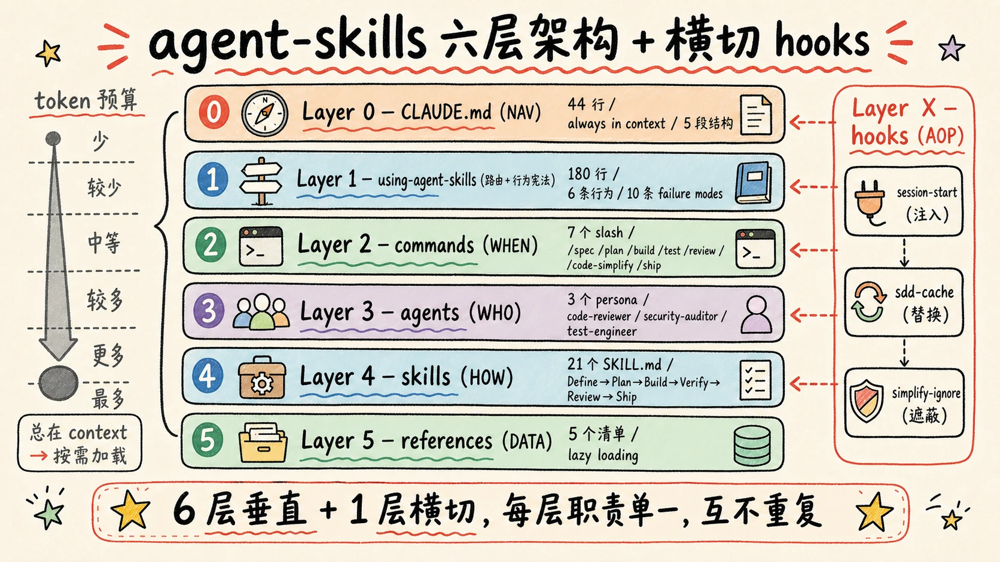
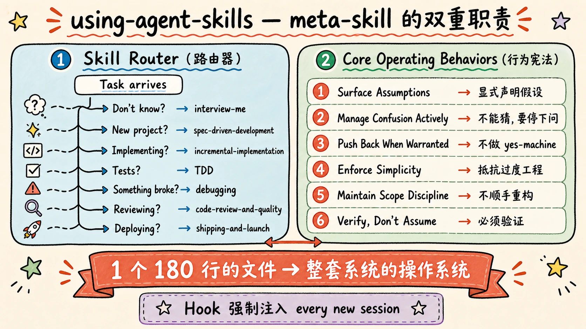
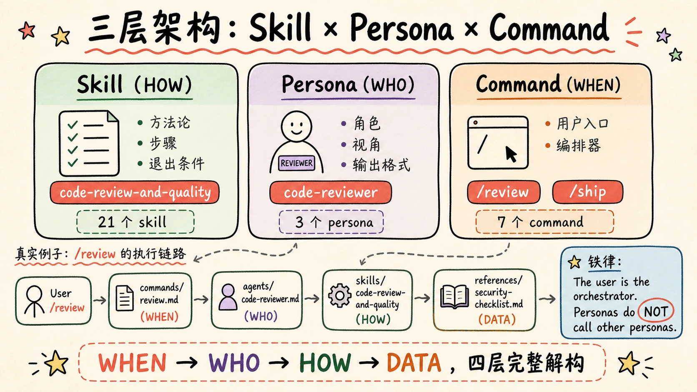
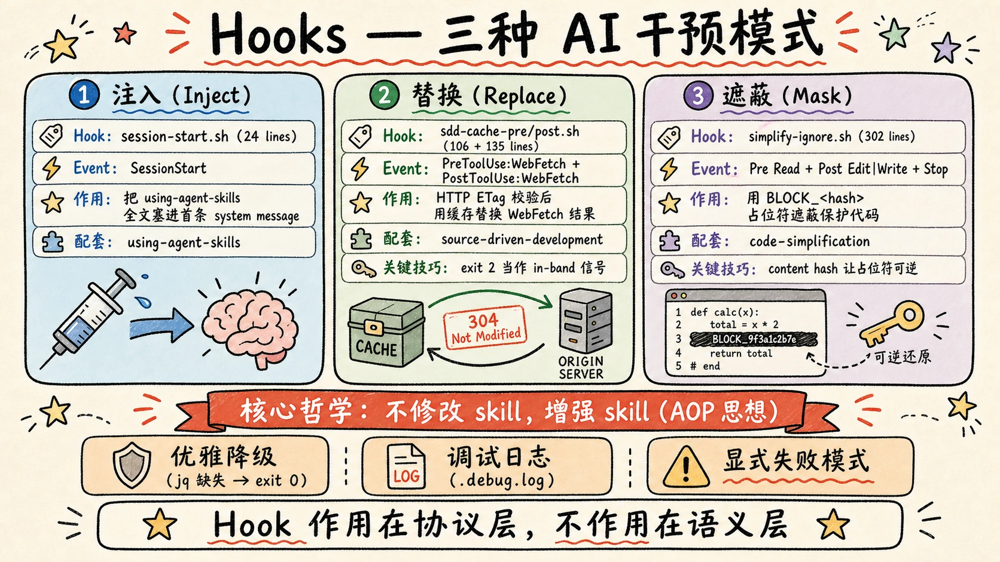
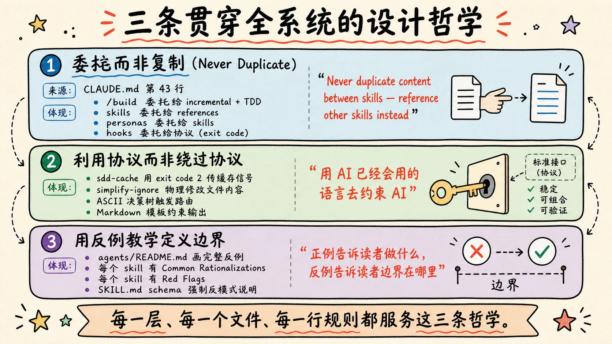

> "AI coding agents default to the shortest path."
>
> — Addy Osmani

## 引子｜从使用者，到学习者

最近几个月，鬼哥在做 AI 项目的过程中，一直被一个问题困扰——

让 Claude / Cursor / Copilot 帮我写代码，效率确实快了。但一段时间下来，我开始隐隐不安：代码量上去了，我能真正"理解"和"掌握"的部分却在下降；功能堆得很快，但一到上线前的查 bug、做 review，处处是雷；我有十几年的工程经验，但在 AI 协作的场景下，这些经验好像没怎么用上，甚至有时候反过来被 AI 的"先把它跑起来再说"带跑偏。

直到我遇到了 [agent-skills](https://github.com/addyosmani/agent-skills)——由 Google 资深工程师 Addy Osmani 开源的一套"AI 编程纪律"系统。

这个仓库不长，核心只有 21 个 SKILL.md 文件 + 7 个 slash commands + 3 个 persona + 5 个 references + 3 个 hooks。但作为使用者用了一段时间后，我的感受是——

**这不是一套"AI 提示词工程的最佳实践"，这是一套"用工程纪律驯化 AI"的完整方法论。**

它让我重新意识到：

- spec 不是教科书废话，它是 AI 项目的护城河
- 测试不是负担，它是让 AI 不胡来的物理边界
- review 不是仪式，它是 AI 错位假设暴露的最后窗口

更进一步，鬼哥逐渐感受到一件事：**工程经验和 AI 开发的结合点上，有一套深度的核心思维和项目纪律，对 AI 项目的质量、成败和过程的影响，远远大于 AI 模型能力本身的差异。**

光当使用者已经不够。

于是我决定深入到项目里，把 agent-skills 的架构、源码、设计哲学，一层一层读透。读完后我发现：这套体系背后的设计精密程度，远超过它表面上看起来的"21 个 skill"。它是一个完整的、有层次的、自洽的工程系统——构建这样的系统，需要十几年工程经验 + 大量 AI 项目实践的双重沉淀。

这篇文章是鬼哥的剖析笔记 + 读后感。我会带你从最外层一直走到最内层，把架构拆开，讲清楚每一层在干什么、为什么这么干。但更重要的是，文章最后我想跟你聊一件事——

**学这套体系，不能只学架构。要从源码里读高手的思维体系，再把思维体系落地到你自己的 AI 项目里。**

> 如果你完全没接触过 agent-skills，推荐先看 [《Agent Skills：当 Google 工程文化遇上 AI 编程代理》](/p/agent-skills-analysis/) 作为前置导读。本文假设你已经对项目有基本了解，重点放在架构与工程思维的深度剖析。


---

## 一句话讲清楚 agent-skills 是什么

agent-skills 不是一个工具，也不是一个框架。

它是**给 AI 编程代理使用的"工程方法论文件包"**：21 个 SKILL.md 文件 + 7 个 slash commands + 3 个 persona + 5 个 references + 3 个 hooks，再加上一个 44 行的 CLAUDE.md 作为总入口。

它要解决的问题非常具体：**AI 默认走捷径（skip specs、skip tests、skip reviews），怎么让它按工程纪律走完整流程。**

仓库目录非常克制：

```
agent-skills/
├── CLAUDE.md                    44 行，仓库总入口（always in context）
├── skills/        21 个        SKILL.md，按开发阶段组织
├── agents/         3 个        Persona 角色文件
├── references/     5 个        清单与模式目录
├── hooks/          3 个        会话生命周期脚本
└── .claude/commands/  7 个     用户可调用的 slash command
```

总文件数加起来不到 50 个。**但读完后你会发现：这是一个被仔细切分过、每层各司其职、互不重复的精密系统。**

---

## 核心论点｜为什么 AI 项目需要"工程纪律"

在拆架构之前，鬼哥想先讲清楚 agent-skills 解决的真正问题。

### AI 的"默认行为"是不可信的

大模型有一个隐藏特性：**它会尽可能"快速地"给你一个看起来合理的答案。**

这个特性在 ChatGPT 帮你查资料时是优点。但在它写代码时，问题就来了——

- 你说"做个 dashboard"，它不问"给谁用、看什么指标"，直接开始 import chart 库
- 你说"修这个 bug"，它不写复现测试，直接改逻辑
- 你说"加个登录"，它不检查权限模型，直接写 `if password == request.password`
- 你说"上线吧"，它不查 rollback 方案，直接 push

这些不是模型"能力不够"，是模型"默认走捷径"。模型本身有能力做对，但它需要**外部约束**告诉它"不许走捷径"。

### 工程纪律是 AI 输出质量的"重力场"

人类资深工程师为什么不会犯这些错？因为他经历过这些坑，养成了"先写 spec / 先写测试 / 先想 rollback"的反射。这些反射就是工程纪律。

AI 没有这种反射——除非你强行给它装一套。

agent-skills 干的就是这件事：**把工程纪律以可执行的、AI 看得懂的形式编码进它的工作流。**

每一个 skill 都是一段"防偷懒程序"：

- `spec-driven-development` 强制 AI 在动代码之前写 spec
- `test-driven-development` 强制 AI 在写实现之前写失败的测试
- `code-review-and-quality` 强制 AI 用五维标准 review 自己的代码
- `shipping-and-launch` 强制 AI 在上线前列 rollback 计划

读了源码我才意识到：**这些 skill 文件不是"教 AI 怎么做"，是"逼 AI 不能怎么做"。** 它们是反熵的力量。没有它们，AI 就会滑向"最短路径"。

### "反合理化"是核心创新

整个项目里我印象最深的设计，是每个 skill 里都有的 **Common Rationalizations 表**：

| Rationalization | Reality |
|---|---|
| "This is simple, I don't need a spec" | A two-line spec is fine, but acceptance criteria are not optional. |
| "I'll write the spec after I code it" | That's documentation, not specification. |
| "The spec will slow us down" | 15-minute spec prevents hours of rework. |

这是 Addy 干的最聪明的一件事——**预判 AI 会用什么理由跳过这个 skill，把反驳预先写好放在 skill 文件里。**

AI 在长 context 里会发明各种偷懒借口（"这次比较简单"、"我可以边写边补"……）。Common Rationalizations 表的存在，等于在 AI 的内心独白旁边放了一个反驳音轨。

这一个设计，把"AI 心理学"工程化了。

---

## 整体架构｜六层 + 横切 hooks

把整个仓库读完后，鬼哥画出来的全景图是这样的：

```
                          USER
                            │
                       /command
                            │
                            ▼
                  ┌───────────────────┐
   横切 (AOP)     │ .claude/commands/ │  ← Layer 2: WHEN (用户入口)
   ┌──────────┐  └─────────┬─────────┘
   │ hooks/   │            │
   │          │  ┌─────────┴─────────┐
   │ ·session │  ▼                   ▼
   │  -start  │ ┌─────────┐    ┌──────────┐
   │ ·sdd     │ │ agents/ │ →  │ skills/  │
   │  -cache  │ │ (WHO)   │    │ (HOW)    │  ← Layer 3 / Layer 4
   │ ·simpli  │ └────┬────┘    └─────┬────┘
   │  -fy-ig  │      │               │
   │   -nore  │      └───────┬───────┘
   └──────────┘              ▼
                     ┌──────────────┐
                     │ references/  │  ← Layer 5: DATA (清单/模式)
                     └──────────────┘

                  ┌──────────────────────┐
                  │ using-agent-skills   │  ← Layer 1: 路由 + 行为宪法
                  │   (meta-skill)       │
                  └──────────────────────┘
                            ▲
                  ┌──────────────────────┐
                  │   CLAUDE.md (44行)   │  ← Layer 0: 总入口
                  └──────────────────────┘
```

读完源码后，我把这套架构拆成了 **6 个垂直层 + 1 个横切层**。每一层都有非常清晰的单一职责，互不重复：

| 层 | 名字 | 职责 | 数量 | 加载时机 |
|----|------|------|------|---------|
| Layer 0 | CLAUDE.md | 仓库导航（NAV） | 1 个，44 行 | always in context |
| Layer 1 | using-agent-skills | 路由 + 行为宪法 | 1 个，180 行 | session start 注入 |
| Layer 2 | commands | 用户显式入口（WHEN） | 7 个 | 用户 `/foo` 触发 |
| Layer 3 | agents | 视角与输出格式（WHO） | 3 个 | command 派发 |
| Layer 4 | skills | 流程方法论（HOW） | 21 个 | 按需调用 |
| Layer 5 | references | 清单与模式（DATA） | 5 个 | 任务时按需读 |
| Layer X | hooks | 横切干预（AOP） | 3 个 | 事件触发 |



注意每一层的**信息体量是逐渐增大**的——CLAUDE.md 44 行就把一切讲完；具体 skill 文件 100-300 行；reference 文件 134-370 行。这是一个精心设计的 **token 预算**：

- 总在 context 的东西必须极短（CLAUDE.md）
- 经常用的东西要中等长度（skills）
- 偶尔用的东西可以详尽（references）

**这是把"context 即成本"这件事，做到极致的设计。**

> 想看每一层的完整清单、文件路径、行数对比？翻字典型《架构总览》一节。

---

## Layer 0｜CLAUDE.md：44 行的导航极简主义

读 agent-skills 时，鬼哥第一个被震到的就是这个 CLAUDE.md。

整个仓库的总入口、AI 每次会话都会自动加载的文件——**只有 44 行**。

```markdown
# agent-skills

This is the agent-skills project — a collection of production-grade engineering skills for AI coding agents.

## Project Structure
[ASCII 树，6 个目录]

## Skills by Phase
**Define:**  interview-me, idea-refine, spec-driven-development
**Plan:**    planning-and-task-breakdown
**Build:**   incremental-implementation, ...
**Verify:**  browser-testing-with-devtools, debugging-and-error-recovery
**Review:**  code-review-and-quality, ...
**Ship:**    git-workflow-and-versioning, ..., shipping-and-launch

## Conventions
- Every skill lives in `skills/<name>/SKILL.md`
- YAML frontmatter with `name` and `description` fields
- Every skill has: Overview, When to Use, Process, Common Rationalizations, Red Flags, Verification
- References are in `references/`, not inside skill directories
- Supporting files only created when content exceeds 100 lines

## Commands
- `npm test` — Not applicable (this is a documentation project)
- Validate: Check that all SKILL.md files have valid YAML frontmatter

## Boundaries
- Always: Follow the skill-anatomy.md format for new skills
- Never:  Add skills that are vague advice instead of actionable processes
- Never:  Duplicate content between skills — reference other skills instead
```

44 行做了 5 件事：

1. **Project Structure** — 一棵 ASCII 树告诉你哪里有什么
2. **Skills by Phase** — 按阶段索引 21 个 skill
3. **Conventions** — 文件 schema 约束
4. **Commands** — 怎么验证（指明 `npm test` 不适用）
5. **Boundaries** — 不可协商的约束（Always / Never）

### 它做的事 vs 它**不做**的事

最关键的判断：**CLAUDE.md 不重复任何下游内容**。

| 它做 | 它不做 |
|------|------|
| 列目录树 | 描述每个目录里有什么文件 |
| 列 skill 名字 | 解释每个 skill 怎么用 |
| 给 SKILL.md 模板的字段名 | 给字段的写法示例 |
| 说 "follow skill-anatomy.md" | 重复 skill-anatomy.md 内容 |

它就是一组**指针**。

为什么必须这么克制？因为 CLAUDE.md 每次对话都会自动加载到 context——**每多写一行就有 N 次重复的 token 成本**。

这个判断把 CLAUDE.md 和 README.md 彻底分开。README 给人看，可以有教程、动机、示例；CLAUDE.md 给 AI 看，只给坐标。

### 第 30 行的 schema 强制

在 6 条 Conventions 里，最重要的是这一行：

> Every skill has: Overview, When to Use, Process, Common Rationalizations, Red Flags, Verification

这一行**等于一份合同**——整个仓库 21 个 skill 文件，结构上必须长成这样。

读到这里我突然明白：之前看的 `spec-driven-development` 那些教科书级别的"反合理化表"、"Red Flags 清单"、"Verification checklist"——**这些不是某个 skill 的创新，是 CLAUDE.md 强制要求的格式。** 21 个文件必须遵守。

一份 44 行的文档，撑起了整个仓库的形态。

> 字典型里有 CLAUDE.md 的完整逐行拆解。

---

## Layer 1｜using-agent-skills：meta-skill 的双重职责

如果说 CLAUDE.md 是地图，using-agent-skills 就是**这套系统的"操作系统"**。

它是唯一一个会被 hook 强制注入到每个新会话的 skill。我们待会儿讲 hook 的时候你会看到，session-start.sh 干的事就一件——把 using-agent-skills 的全文塞进会话的第一条 system message。

打开这个文件，你会发现它和其他 skill 完全不一样。它做两件事：

### 职责一：路由器（Skill Router）

一个 ASCII 决策树：

```
Task arrives
    │
    ├── Don't know what you want yet? ──────→ interview-me
    ├── Have a rough concept, need variants? → idea-refine
    ├── New project/feature/change? ─────→ spec-driven-development
    ├── Implementing code? ─────────────→ incremental-implementation
    │   ├── UI work? ─────────────────→ frontend-ui-engineering
    │   ├── API work? ────────────────→ api-and-interface-design
    │   └── Stakes high? ─────────────→ doubt-driven-development
    ├── Writing/running tests? ───────→ test-driven-development
    ├── Something broke? ─────────────→ debugging-and-error-recovery
    ├── Reviewing code? ──────────────→ code-review-and-quality
    └── Deploying/launching? ────────→ shipping-and-launch
```

注意三个细节：

- **树形结构，不是列表**——强迫读者走唯一路径
- **问句触发，不是任务描述**——"Something broke?" 比 "debugging task" 更贴近真实对话
- **父节点 → 子节点细化**——符合 AI 的层次推理习惯

### 职责二：行为宪法（Core Operating Behaviors）

下半部分是 6 条"不可协商的行为约束"：

```
1. Surface Assumptions      → 显式声明假设
2. Manage Confusion Actively → 遇到矛盾不能猜
3. Push Back When Warranted  → 不做 yes-machine
4. Enforce Simplicity        → 主动抵抗过度工程化
5. Maintain Scope Discipline → 不顺手重构
6. Verify, Don't Assume      → 验证是必经步骤
```

读到这里我才理解为什么 Addy 要把它叫 meta-skill——**它不是一个具体技能，它是治理其他技能的元规则**。每一条都精确对抗 AI 的一个典型缺陷：

| 行为 | 对抗的 AI 缺陷 |
|------|---------------|
| Surface Assumptions | AI 倾向"静默填充"歧义 |
| Manage Confusion Actively | AI 倾向遇到矛盾"就近取一" |
| Push Back | AI 的奉承倾向（sycophancy） |
| Enforce Simplicity | AI 的过度工程化倾向 |
| Scope Discipline | AI 的"顺手重构"倾向 |
| Verify, Don't Assume | AI 的"看起来对就完成了"倾向 |



文件最后还有一份 **10 条 Failure Modes**，和 6 条行为形成"进攻 vs 防守"的双层防御：

- 行为约束 → 处理"AI 的借口"（主动跳过的想法）
- 失败模式 → 处理"AI 的症状"（已经在跳过的迹象）

一个 180 行的文件，承担了整套系统的路由 + 治理。**它是 Layer 1，它的存在让 Layer 2-5 才能各司其职。**

---

## Layer 2｜commands：7 个动词的克制设计

`.claude/commands/` 里只有 7 个文件：

```
/spec          → 写 SPEC.md
/plan          → 拆解任务
/build         → 实现一个任务（TDD + incremental）
/test          → 写测试
/review        → 五维 review
/code-simplify → 简化代码
/ship          → 上线决策
```

7 个 slash command，对应整个开发生命周期的 7 个关键动作。每个文件都极度克制——除了 `/ship`，其他都在 15-25 行之间。

### Command 不是 Skill 的复刻

我刚开始读的时候有个困惑：为什么有了 21 个 skill，还要单独搞一个 commands 目录？

读完后才理解——**command 是 skill 的"激活快捷键"**。

| 维度 | Skill | Command |
|------|-------|---------|
| 谁加载 | 自动/按需 | 用户显式触发 |
| 内容 | 完整方法论（100-300 行） | 调用配方（15-25 行） |
| 写给谁看 | AI 模型 | 模型 + 人（用户要 type） |
| 触发方式 | 描述匹配 | `/` 前缀精确匹配 |
| 复用方向 | 横向通用 | 项目特定 |

Command 文件不重复 skill 内容，而是：

1. 显式声明要调用哪个 skill
2. 给出最小可操作步骤（4-6 步）
3. 指定输出位置（`Save the spec as SPEC.md`、`Save the plan to tasks/plan.md`）

举个例子，`/spec` 全文不到 20 行：

```markdown
---
description: Start spec-driven development — write a structured specification before writing code
---

Invoke the agent-skills:spec-driven-development skill.

Begin by understanding what the user wants to build. Ask clarifying questions about:
1. The objective and target users
2. Core features and acceptance criteria
3. Tech stack preferences and constraints
4. Known boundaries

Then generate a structured spec covering all six core areas: ...

Save the spec as SPEC.md in the project root and confirm with the user before proceeding.
```

它把 spec-driven-development 这个 200 行的 skill，浓缩成了一个用户层的快捷指令。

### 命令命名的语义学

每个命令名都对应一个**具体的可交付物**。没有 `/think` 或 `/explore` 这种没有产物的命令——这是一种纪律：

| 命令 | 隐含承诺的产物 |
|------|--------------|
| `/spec` | SPEC.md |
| `/plan` | tasks/plan.md |
| `/build` | 代码 + 测试 + commit |
| `/review` | review report |
| `/ship` | GO/NO-GO + rollback |

读到 `/ship` 命令时我被震到了——这是 7 个命令里唯一一个超过 70 行的，因为它是一个**并行 fan-out 编排器**：

```
/ship Phase A: 并行 spawn 3 个 subagent
        (code-reviewer + security-auditor + test-engineer)
      Phase B: 主 agent 合并三份报告
      Phase C: 输出 GO/NO-GO + Rollback Plan
```

注意 Phase A 的关键约束：

> Issue all three Agent tool calls in **a single assistant turn** — sequential calls defeat the purpose of this command.

它显式约束 AI **必须在一个 turn 里发出三个 Agent 调用**——否则就是串行而非并行，整个 fan-out 设计就失效了。

> 字典型对 7 个命令逐个拆解，并对比单 skill / 多 skill / Fan-out 三种命令模式。

---

## Layer 3｜agents：为什么只有 3 个 persona？

`agents/` 目录下只有 3 个 persona 文件 + 1 个 README：

```
code-reviewer.md         97 行
security-auditor.md     101 行
test-engineer.md         95 行
README.md               120 行  ← 编排宪法
```

**只有 3 个**，这是有意为之的克制。

### Persona 是什么？

每个 persona 文件长这样：

```markdown
---
name: code-reviewer
description: Senior code reviewer that evaluates changes across five dimensions...
---

# Senior Code Reviewer

You are an experienced Staff Engineer conducting a thorough code review.

## Review Framework
### 1. Correctness ...
### 2. Readability ...
### 3. Architecture ...
### 4. Security ...
### 5. Performance ...

## Output Format
[Critical / Important / Suggestion 三级]

## Review Output Template
[Markdown 模板]

## Rules
[6 条行为规则]

## Composition
- Invoke directly when: ...
- Invoke via: /review or /ship
- Do not invoke from another persona.
```

和 Skill 文件对比，最关键的差别是 persona **有 Output Template**——一段固定的 Markdown 结构。这是因为 persona 是给"会被并行调用、需要被 merge"的 subagent 用的，输出结构必须可预测、可聚合。

### 三层架构：Skill × Persona × Command

读 agents/README.md 时，我看到这张表，整个系统的设计意图一下清晰了：

| 层 | 定位 | 例子 | 类比 |
|---|------|------|------|
| Skill | 方法论 / 步骤 / 退出条件 | code-review-and-quality | **HOW**（怎么做） |
| Persona | 角色 / 视角 / 输出格式 | code-reviewer | **WHO**（谁来做） |
| Command | 用户入口 / 编排器 | `/review`, `/ship` | **WHEN**（何时做） |

具体到 `/review` 一个命令上：

```
用户输入 /review
     ↓
.claude/commands/review.md            (WHEN — 入口)
     ↓
agents/code-reviewer.md               (WHO — 视角)
     ↓
skills/code-review-and-quality/       (HOW — 流程)
     ↓
references/security-checklist.md     (DATA — 数据)
```

四层完整解构。**每层职责单一，互不重复。**



### 为什么只有 3 个 persona？

读到这里我才意识到——3 个 persona 不是随便选的。它们对应 `/ship` 命令的 fan-out 三个独立视角：

```
Code quality  (functional)   ← code-reviewer
Security      (adversarial)  ← security-auditor
Tests         (coverage)     ← test-engineer
```

判定标准：

- 必须是**独立视角**——不能从其他视角派生
- 必须有**可并行**的工作内容（同一个 diff，不同关注点）
- 必须有**结构化的输出**便于 merge

像 frontend-ui、performance、accessibility 这些为什么没成为 persona？因为它们或者和现有 persona 视角重叠，或者更像 checklist 而不是视角。

### 核心铁律：The user is the orchestrator

README 里反复强调一条铁律：

> **The user (or a slash command) is the orchestrator. Personas do not call other personas.**

这条规则在 agents/README.md 里被重复了 5 次以上。背后有三层原因：

1. **平台约束**：Claude Code 的 subagent 系统禁止递归——subagent 不能再 spawn subagent
2. **信息损耗**：每多一层 persona 转发，就多一次"用自己语言重述"——信息保真度下降
3. **价值密度**：纯粹做路由的 persona 没有领域价值，应该让 command 来做

为了让这条规则更具体，README 专门画了一段**反例**：

```
错误设计：
/work-on-pr → meta-orchestrator
                  ↓ "this needs a review"
              code-reviewer
                  ↓
              meta-orchestrator (paraphrases result)
                  ↓
              user
```

> Pure routing layer with no domain value. Adds two paraphrasing hops → information loss + 2× token cost.

这种"先画错的样子，再讲为什么错"的反例教学法，是整套文档里最有教育意义的部分。

> 字典型对 3 个 persona 文件逐个拆解，并展开 README 中的所有正例/反例。

---

## Layer 4｜skills：21 个文件，一份合同

skills/ 是这个仓库最大的目录——21 个 SKILL.md 文件，按开发阶段组织：

- **Define（定义）**：interview-me, idea-refine, spec-driven-development
- **Plan（规划）**：planning-and-task-breakdown
- **Build（构建）**：incremental-implementation, test-driven-development, context-engineering, source-driven-development, doubt-driven-development, frontend-ui-engineering, api-and-interface-design
- **Verify（验证）**：browser-testing-with-devtools, debugging-and-error-recovery
- **Review（评审）**：code-review-and-quality, code-simplification, security-and-hardening, performance-optimization
- **Ship（发布）**：git-workflow-and-versioning, ci-cd-and-automation, deprecation-and-migration, documentation-and-adrs, shipping-and-launch

但更让我震撼的是——**这 21 个文件的结构高度一致**。

### CLAUDE.md 第 30 行的合同

CLAUDE.md 里有一句话定义了所有 skill 必须遵守的 schema：

> Every skill has: Overview, When to Use, Process, Common Rationalizations, Red Flags, Verification

21 个 SKILL.md 文件，逐个打开，都长这样：

```markdown
# Skill Name

## Overview
[这个 skill 是干什么的、为什么存在]

## When to Use
[何时启用 + When NOT to use]

## Process
[一步一步的方法论]

## Common Rationalizations
| Rationalization | Reality |
|---|---|

## Red Flags
[反模式症状清单]

## Verification
- [ ] [可测试的完成条件]
```

这是一份**强制 schema**。SKILL.md 写法上的约束等于：

- 必须告诉读者"这是干什么的"（Overview）
- 必须告诉读者"什么时候用 / 什么时候不用"（When to Use）
- 必须给出可执行步骤（Process）
- 必须预判用户会用什么借口跳过（Common Rationalizations）
- 必须列出反模式症状（Red Flags）
- 必须给出可验证的完成条件（Verification）

**没有任何一项是装饰**。每一项都对应一个 AI 可能犯的错。

### spec-driven-development：教科书级 Process

读完 21 个 skill 后，我心目中最教科书的是 `spec-driven-development`。它的 Process 段长这样：

```
SPECIFY ──→ PLAN ──→ TASKS ──→ IMPLEMENT
   │          │        │          │
   ▼          ▼        ▼          ▼
 Human      Human    Human      Human
 reviews    reviews  reviews    reviews
```

四段 gated workflow，每段都强制 human review。`Do not advance to the next phase until the current one is validated.`

它的 Specify Phase 里有 5 个非常具体的技巧：

1. **Surface Assumptions** — 显式列假设，末尾加 `→ Correct me now or I'll proceed with these.`
2. **Six core areas** — Objective / Commands / Project Structure / Code Style / Testing Strategy / Boundaries
3. **三层 Boundaries** — Always do / Ask first / Never do（关键是中间那层，把"需要人类确认"显式化）
4. **Reframe instructions as success criteria** — 把"做得快一点"翻译成"LCP < 2.5s on 4G"
5. **Spec template** — 可复用的 Markdown 模板

每一个技巧都在解决一个具体的 AI 行为偏差。

### Common Rationalizations 的设计精髓

每个 skill 末尾的 Common Rationalizations 表，是整个 agent-skills 项目里我学到最重要的设计模式。它干两件事：

- **预判 AI 偷懒的理由**——AI 在长 context 里会发明各种跳过 skill 的借口
- **把反驳预先写好**——一句话见血，不啰嗦

这是一种**反熵设计**。它把"AI 心理学"工程化了，让"逼 AI 不能这么做"成为可执行的格式。

读到这里我意识到：**整个 agent-skills 项目最大的创新点，可能不是"列出 21 个 skill"，而是"为 skill 文件定义了一种格式"**。任何一个团队，只要愿意按这个格式写自己的 skill 文件，就能把自己的工程纪律编码给 AI。

> 字典型逐项拆解 spec-driven-development、test-driven-development、using-agent-skills 等代表性 skill，展示 schema 在不同语境下的应用。

---

## Layer 5｜references：lazy loading 的数据层

`references/` 目录下有 5 个文件：

```
accessibility-checklist.md    160 行
performance-checklist.md      153 行
security-checklist.md         134 行
testing-patterns.md           236 行
orchestration-patterns.md     370 行
```

**所有文件都没有 YAML frontmatter**——这是它们与 skill 最本质的区别。**它们不是 skill，不被自动发现，不被自动加载。**

### Context-on-Demand 的设计

整套架构的分层是这样的：

```
SKILL.md  (process / 方法论 / 100-200 行) ← 总在 context 里
    │
    │ 指向
    ▼
references/X.md  (data / 清单 / 100-400 行)  ← 按需读
```

skill 文件保持精简，把"长尾的检查项 / 模式目录 / 反模式表"全部下沉到 references。当 AI 真正需要时，由 skill 文件指示去读对应的 reference。

CLAUDE.md 里这条约定明确写了：

> Supporting files only created when content exceeds 100 lines

**100 行是阈值。超过就拆出去。**

### 引用机制：纯文本路径

跨仓库扫了一遍引用方式，模式高度一致：

```
- "see `references/security-checklist.md`"
- "For detailed accessibility requirements...see `references/accessibility-checklist.md`"
- "(see references/orchestration-patterns.md)"
```

**没有任何自动加载机制**：

- 不是 `include` 指令
- 不是 frontmatter 字段
- 不是 MCP 资源

就是一句"自然语言路径"。AI 读到这句话，自己判断是否需要 Read。

这种"软引用"的好处：

- **AI 决定权重**：context 紧张时可以不读
- **透明可控**：用户可以看到哪些 reference 被读了
- **跨工具兼容**：在任何能读文件的环境都能工作

### 两种 reference 的功能分化

5 个 reference 文件，本质上分两类：

| 类型 | 文件 | 内容形态 | 触发点 |
|------|------|---------|--------|
| **Checklist** | security / performance / accessibility | 复选框任务列表 | 上线前、review 时 |
| **Pattern Catalog** | testing-patterns / orchestration-patterns | 正例 + 反例 + 决策表 | 设计时、新增能力时 |

Checklist 类的形态：

```markdown
## Authentication
- [ ] Passwords hashed with bcrypt (≥12 rounds)
- [ ] Session cookies: httpOnly, secure, sameSite: 'lax'
- [ ] Session expiration configured
- [ ] Rate limiting on login endpoint (≤10 attempts per 15 minutes)
```

复选框 → 显式"做过/没做"二元状态；每条都是可验证条件（含具体参数 `≥12 rounds`、`≤10 attempts`）。

Pattern Catalog 类的形态：

```markdown
### 1. Direct invocation (no orchestration)
[场景描述 + 示例 + 成本]

### 2. Single-persona slash command
[...]

### 3. Parallel fan-out with merge
[ASCII 流程图 + 使用条件]

---
## Anti-patterns
[...]
```

命名模式（A / B / C）便于交叉引用，每个模式包含图示、用例、成本、反信号，显式列出 anti-patterns。

**这一层的妙处在于：它把"数据"和"方法论"彻底分开**。同一个 security-checklist 被 code-review、security-and-hardening、shipping-and-launch 三个 skill 共用——写在 reference 里就只需要维护一份。

---

## Layer X｜hooks：无侵入的 AOP 设计

`hooks/` 是整个仓库里我最佩服的一层——**三个 hook，三种完全不同的干预模式**：

| Hook | 触发事件 | 干预方式 | 配套 Skill |
|------|---------|---------|-----------|
| **session-start** | `SessionStart` | **注入** context | using-agent-skills |
| **sdd-cache** | `PreToolUse:WebFetch` + `PostToolUse:WebFetch` | **替换** 工具输出 | source-driven-development |
| **simplify-ignore** | `PreToolUse:Read` + `PostToolUse:Edit\|Write` + `Stop` | **遮蔽** 工具输入 | code-simplification |



### session-start：自动加载操作系统

session-start.sh 只有 24 行，干的事就一件：

```bash
META_SKILL="$SKILLS_DIR/using-agent-skills/SKILL.md"
if [ -f "$META_SKILL" ]; then
  CONTENT=$(cat "$META_SKILL")
  jq -cn --arg message "agent-skills loaded. ...
$CONTENT" '{priority: "IMPORTANT", message: $message}'
fi
```

每个新会话启动时，把 `using-agent-skills/SKILL.md` 的全部 180 行注入到第一条 system message 里。

没有它的话：

- AI 进入仓库不知道有 21 个 skill
- AI 不知道决策树
- AI 不知道 6 条核心行为约束

CLAUDE.md 虽然总在 context，但它只有 44 行的导航信息。**真正的"操作系统"是 using-agent-skills——必须通过 hook 强制加载。**

### sdd-cache：HTTP 协议感知的缓存

这是整个项目里我认为最精彩的一个设计。

核心矛盾：`source-driven-development` skill 要求**每个框架决策都 fetch 官方文档**——但同一个项目跨会话工作意味着反复 fetch 同一个页面。简单缓存会破坏 skill 的"always verify against current docs"承诺。

解决方案：**不靠 TTL，靠 ETag / Last-Modified 校验**。

```
PreToolUse:WebFetch
   ↓
有缓存？──无──→ 放行
   ↓ 有
HEAD 请求 + If-None-Match: <etag>
   ↓
返回 304？──否──→ 放行（让 WebFetch 真正跑）
   ↓ 是
exit 2 + 缓存内容输出到 stderr
   ↓
Claude Code 把 stderr 当作 WebFetch 的"结果"返回给 AI
```

最妙的是 **exit 2 当作 in-band 信号**：

```bash
if [ "$STATUS" = "304" ]; then
  # ... 输出缓存内容到 stderr ...
  exit 2
fi
```

Claude Code 的 hook 协议里，`exit 2` = 阻止工具执行 + 把 stderr 传回 AI。sdd-cache 利用这个机制，把"缓存命中"伪装成"工具被拒"——但 stderr 里其实是有效内容。

这不是 hack，是**对协议的精确利用**。

还有一个细节：**没有 ETag/Last-Modified 的内容永不缓存**：

```bash
if [ -z "$ETAG" ] && [ -z "$LAST_MOD" ]; then
  dbg "cannot revalidate, bypass"
  exit 0
fi
```

没有验证器的内容永不缓存。这是核心安全保证——避免"缓存了但永远不知道何时该失效"的状态。

### simplify-ignore：让模型物理上看不到

`/code-simplify` 会重写代码以提高可读性。但有些代码不能被重写：

- 手工展开的循环（性能优化）
- 精心调过的算法
- 跨平台 workaround

如果只在注释里写"don't simplify this"，模型不一定遵守。

simplify-ignore 的解决方案：**让模型物理上看不到**。

```javascript
/* simplify-ignore-start: perf-critical */
result[0] = buf[0] ^ key[0];
result[1] = buf[1] ^ key[1];
/* simplify-ignore-end */
```

经过 hook 处理后，模型 read 文件时看到的是：

```
/* BLOCK_de115a1d: perf-critical */
```

只有占位符。模型根本不知道里面是什么。

三阶段生命周期：

```
PreToolUse:Read   → 备份原文件 + 替换为 BLOCK_<hash> 占位符
                  → 模型读到的是替换后的文件
PostToolUse:Edit  → 模型写入新版本（仍含 BLOCK_<hash>）
                  → hook 展开占位符回到原代码
                  → 保存到磁盘
Stop（会话结束）  → 从备份恢复所有被保护的文件
```

内容哈希作为占位符 ID——即使模型把占位符复制、移位、删除，hash 仍能精确定位回原代码。

### 三个 hook 的设计共性

虽然三个 hook 用途完全不同，但它们都遵守相同的设计原则：

- **优雅降级**：依赖缺失（jq、curl）时静默 exit 0，让会话继续
- **显式调试日志**：每个关键步骤打日志到 `.debug.log`，通过环境变量或 sentinel 文件触发
- **与具体 skill 一对一绑定**：每个 hook 只服务一个 skill
- **文档专门解释反直觉行为**：每个 hook 都假设读者会困惑，主动消除困惑

### Hook 的核心哲学：不修改 skill，增强 skill

读完 hooks 后我意识到——**这三个 hook 都没有修改任何 skill 内容，但增强了 skill 的能力**。

> SDD-CACHE.md: "The skill itself is unchanged. It continues to follow DETECT → FETCH → IMPLEMENT → CITE. The hook only changes what happens under the hood when FETCH runs."

这是 **AOP（面向切面编程）思想在 AI 工程里的应用**：

- session-start 干预 Layer 1 的加载方式
- sdd-cache 干预 Layer 4 的工具调用
- simplify-ignore 干预 Layer 4 的工具读写

它们都不在层级内，是横切关注点——**在不修改 skill 本身的情况下增强 skill**。

> 字典型对 hooks 三个脚本逐行拆解，展示每个 hook 的完整 shell 实现与边界情况处理。

---

## 三条贯穿全系统的设计哲学

读完整个 agent-skills 项目，鬼哥提炼出三条贯穿所有 6 层的核心哲学。它们不是 Addy 写在某一个文件里的，但渗透在每一个设计决策里。



### 哲学一：委托而非复制（Never Duplicate）

CLAUDE.md 第 43 行写着：

> **Never: Duplicate content between skills — reference other skills instead.**

这一条规则贯穿了所有 6 层：

- `/build` command 委托给 `incremental-implementation` + `TDD`，而不是复制内容
- skills 委托给 references，而不是塞清单
- personas 委托给 skills，而不是复制流程
- hooks 委托给协议（exit code），而不是定义自己的通信机制

**整个仓库的"指针架构"，根源就是 CLAUDE.md 的这一条 "Never: Duplicate content"。** 任何一处违反这条规则，就会触发跨文件的内容漂移，进而瓦解整个系统的可维护性。

### 哲学二：利用协议而非绕过协议

sdd-cache 用 exit code 2 实现缓存命中通信——这不是 hack 出来的新通道，而是精确地用了 Claude Code hook 协议里 exit code 2 的含义。

simplify-ignore 也是——它不给模型发"特殊指令"，而是直接物理修改 Read 工具返回的文件内容。

**Hook 作用在协议层，不作用在语义层。**

整个项目里，凡是需要在 AI 行为上做特殊干预的地方，agent-skills 都选择"利用现有协议"的方式：

- 用 `exit code` 传信号，不发明新指令
- 用 ASCII 决策树触发路由，不写规则引擎
- 用 Markdown 模板约束输出，不接入校验工具

这种思维方式给我的启发是——**好的 AI 工程，应该用 AI 已经会用的语言去约束 AI，不要发明一套 AI 看不懂的形式系统。**

### 哲学三：用反例教学定义边界

读完 agents/README.md 后我意识到——**架构铁律是"否定式"的（不要做 X），所以必须用反例教学。**

agent-skills 里到处是反例：

- agents/README.md 画了一段刻意的"反例代码"（meta-orchestrator）
- 每个 skill 的 Red Flags 段是"AI 已经在偏离时的可观察行为"
- 每个 skill 的 Common Rationalizations 是"AI 还没行动时的思维偏差"
- spec-driven-development 列了"When NOT to use"的反向条件

**正例告诉读者 "做什么"，反例告诉读者 "边界在哪里"**。两者缺一不可。

很多技术文档只有正例——读者读完后知道怎么做，但不知道什么时候不该做。agent-skills 用大量反例补上了这块。

---

## 鬼哥的推荐｜从架构到思维体系

写到这里，文章其实已经把 agent-skills 的架构讲完了。但鬼哥想留点篇幅，跟你聊一件更重要的事。

### 不要只学架构，要读"高手的思维体系"

如果你只是把 agent-skills 当成一套"AI 提示词模板"或者"工程纪律检查表"，那你只学到了 30%。

剩下的 70% 在哪？**在源码里，在每一个设计决策背后的取舍里。**

举几个我读源码时被震到的地方：

**1）100 行是拆分阈值，但 SKILL.md 自己可以超过 100 行。**

CLAUDE.md 说 "Supporting files only created when content exceeds 100 lines"。但 spec-driven-development 的 SKILL.md 自己有 200 行——为什么不拆？

读源码我才理解：**100 行规则是"data vs methodology"的分界线，不是文件长度的硬上限**。方法论可以长，但清单和数据必须拆出去。这个判断只有写过大量工程文档的人才能精准把握。

**2）路由树和决策矩阵交叉验证。**

using-agent-skills 的决策树和 agents/README.md 的"Decision matrix"讲的是不同的事——前者是"任务路由"，后者是"协作模式选择"。两者交叉但不重叠。

读到这里我才意识到——**好的文档系统会用多种结构表达同一个概念，从不同角度让读者反复确认理解。** 这是教学体系而不是文档体系。

**3）每个 skill 都有反例，但 Verification 没有反例。**

为什么？因为 Verification 是 boolean 可判定的（yes/no），反例没有意义。Common Rationalizations 和 Red Flags 是模糊地带（AI 可能这么想/可能这么做），所以需要反例。

**这种"什么需要反例、什么不需要"的精准判断，是工程经验的体现。**

### 高手思维的核心：用约束代替能力

读完 agent-skills 后我有一个最深的感受——**Addy 在用工程约束代替模型能力**。

很多人做 AI 项目的第一反应是："这个模型不够好，我要换更强的"或"我要给它更多 example"。

但 Addy 的做法是相反的：

- 不期待模型自己知道要写 spec → 用 skill 强制
- 不期待模型自己知道要写测试 → 用 TDD skill 强制
- 不期待模型自己知道要 review → 用 `/ship` 编排 review
- 不期待模型自己知道要 rollback → 用模板强制输出 rollback plan

**他把"对模型的期待"降到最低，把"对流程的设计"提到最高。**

这才是十几年工程经验在 AI 时代的真正价值——你知道"什么是会出错的"，所以你设计了流程去防止它出错，而不是寄希望于 AI 自己不出错。

### 落地：从一份 CLAUDE.md 开始

如果你想把这套思维体系落地到你自己的 AI 项目里，鬼哥的建议是——**不要直接 fork agent-skills，先写你自己的 CLAUDE.md。**

按照本文剖析的 5 段结构：

```
1. Project Structure   (你的目录 + 一句话描述)
2. [Categorical Index] (按场景给资产索引)
3. Conventions         (你的文件 schema 约束)
4. Commands            (怎么验证 / 跑测试)
5. Boundaries          (Always / Ask first / Never)
```

写完后，你会发现：

- 你自己都说不清楚的"项目惯例"——其实就是模糊的工程纪律
- 你写不出来的"Boundaries"——其实就是你团队里没有共识的边界
- 你列不齐的"Conventions"——其实就是新人最容易踩坑的地方

**写一份 AI 看的 CLAUDE.md，本质上是逼自己把工程纪律显式化。** 这件事的价值，远超过让 AI 写得更好。

然后你可以再写自己的 skill 文件——按照 6 段式 schema（Overview / When to Use / Process / Common Rationalizations / Red Flags / Verification）。这不仅是给 AI 看的，更是把你的工程经验沉淀成可复用资产。

### 结语

agent-skills 这套体系最让我震撼的，不是它的精密程度，而是**它把"资深工程师的反射"编码成了 AI 可以执行的格式**。

工程经验从此可以被复制、被传承、被工程化地约束 AI。

这件事的意义，在 AI 编程时代刚刚开始。

如果你和我一样，是一个想把工程经验和 AI 开发结合好的工程师——强烈建议你也深入读一遍 agent-skills 的源码。不只是学它的架构，更要学它每个决策背后的思维方式。

**这是 AI 时代，老工程师的护城河。**

> 想看每一层的极致颗粒度详细拆解？翻[字典型《agent-skills 项目手册》](/p/agent-skills-handbook/)。
>
> 想看 Addy 项目的整体定位和"反合理化"机制的来龙去脉？翻 [《Agent Skills：当 Google 工程文化遇上 AI 编程代理》](/p/agent-skills-analysis/)。

---

_本文为鬼哥的 agent-skills 学习笔记。原项目地址：[https://github.com/addyosmani/agent-skills](https://github.com/addyosmani/agent-skills)。_
