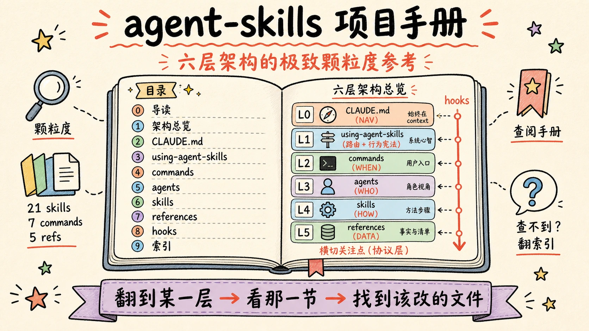
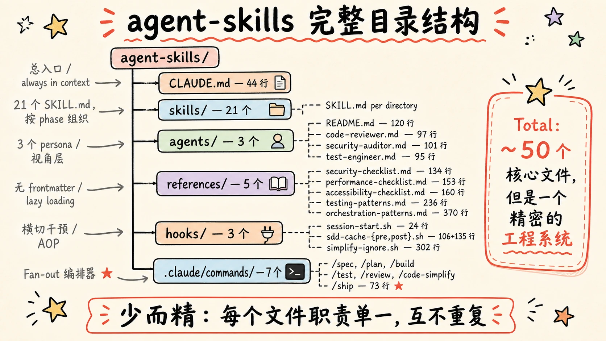
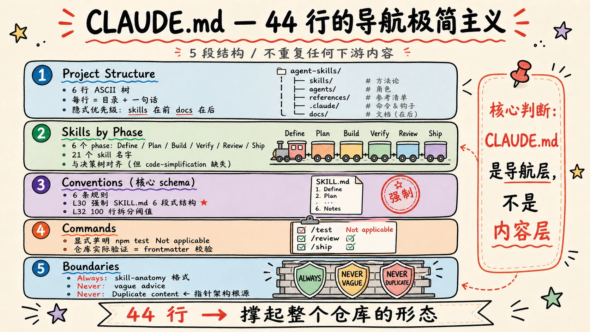
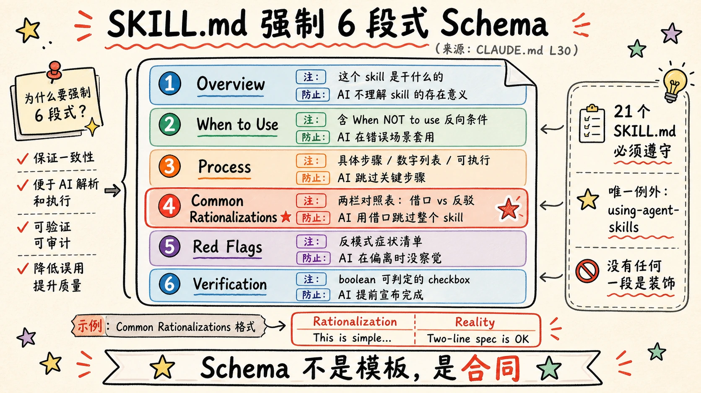
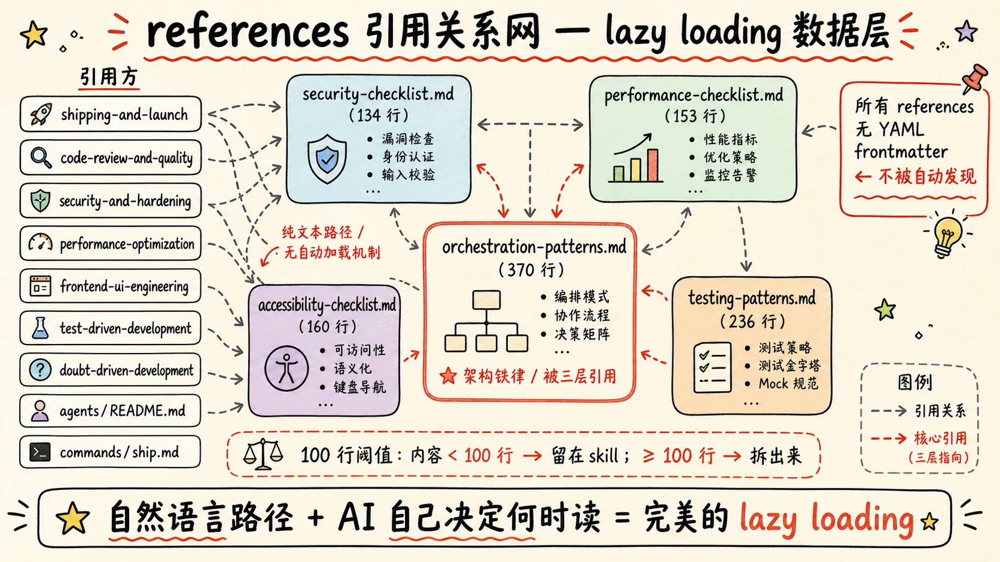
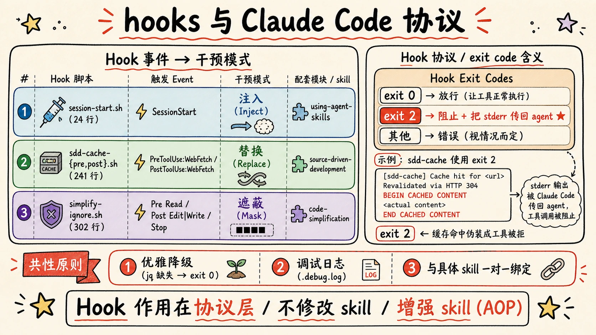

> 本手册是 [《从使用者到学习者：agent-skills 架构深度剖析与高手思维体系》](/p/agent-skills-architecture/) 的配套参考。文章型负责讲清楚"为什么"，本手册负责讲清楚"是什么、在哪里、如何展开"。
>
> 适用场景：回顾某一层的具体设计、查阅某个文件的角色、在自己的项目里复刻某一层时作为模板。



## 导读｜如何使用本手册

本手册按 agent-skills 的层级组织，每节自包含。建议查阅方式：

- 想了解整体结构 → 第 1 节《架构总览》
- 想查某一层 → 直接跳对应层级
- 想找设计模式 → 翻每节末尾的"经验与可复用模板"

每一节的固定结构：

1. **定位与体量** — 该层在系统中的角色、文件数、行数
2. **完整结构** — 目录树、文件清单
3. **核心机制** — 关键文件逐项拆解
4. **设计取舍** — 为什么这么设计
5. **注意事项** — 容易踩的坑
6. **经验与可复用模板**

> 本手册的写法是客观第三人称。文章型《从使用者到学习者》是鬼哥的笔记体；如果你想读叙事版本，请翻 [文章型](/p/agent-skills-architecture/)。

---

## 1. 架构总览

### 1.1 项目定位

agent-skills 是一个**给 AI 编程代理使用的工程方法论文件包**，由 Google 资深工程师 Addy Osmani 开源在 [github.com/addyosmani/agent-skills](https://github.com/addyosmani/agent-skills)。它不是工具、不是框架、不是 SDK——它是一组结构化的 Markdown 文件 + 少量 Bash hook 脚本，靠 Claude Code 这类 AI agent runtime 的"skill 自动加载"+"slash command"+"hook"机制生效。

### 1.2 完整目录树

```
agent-skills/
├── CLAUDE.md                              44 行
├── README.md                              （项目说明，本手册不展开）
│
├── skills/                                21 个 SKILL.md
│   ├── using-agent-skills/SKILL.md        180+ 行（meta-skill）
│   ├── spec-driven-development/SKILL.md   201 行
│   ├── interview-me/SKILL.md
│   ├── idea-refine/SKILL.md
│   ├── planning-and-task-breakdown/SKILL.md
│   ├── incremental-implementation/SKILL.md
│   ├── test-driven-development/SKILL.md
│   ├── context-engineering/SKILL.md
│   ├── source-driven-development/SKILL.md
│   ├── doubt-driven-development/SKILL.md
│   ├── frontend-ui-engineering/SKILL.md
│   ├── api-and-interface-design/SKILL.md
│   ├── browser-testing-with-devtools/SKILL.md
│   ├── debugging-and-error-recovery/SKILL.md
│   ├── code-review-and-quality/SKILL.md
│   ├── code-simplification/SKILL.md
│   ├── security-and-hardening/SKILL.md
│   ├── performance-optimization/SKILL.md
│   ├── git-workflow-and-versioning/SKILL.md
│   ├── ci-cd-and-automation/SKILL.md
│   ├── deprecation-and-migration/SKILL.md
│   ├── documentation-and-adrs/SKILL.md
│   └── shipping-and-launch/SKILL.md
│
├── agents/                                3 个 persona + 1 README
│   ├── README.md                          120 行（编排宪法）
│   ├── code-reviewer.md                    97 行
│   ├── security-auditor.md                101 行
│   └── test-engineer.md                    95 行
│
├── references/                            5 个支撑文件（无 frontmatter）
│   ├── accessibility-checklist.md         160 行
│   ├── performance-checklist.md           153 行
│   ├── security-checklist.md              134 行
│   ├── testing-patterns.md                236 行
│   └── orchestration-patterns.md          370 行
│
├── hooks/                                 3 个 hook + 文档 + 测试
│   ├── hooks.json                          14 行（插件级注册）
│   ├── session-start.sh                    24 行
│   ├── session-start-test.sh               46 行
│   ├── sdd-cache-pre.sh                   106 行
│   ├── sdd-cache-post.sh                  135 行
│   ├── SDD-CACHE.md                       167 行（文档）
│   ├── simplify-ignore.sh                 302 行
│   ├── simplify-ignore-test.sh            247 行
│   └── SIMPLIFY-IGNORE.md                  90 行（文档）
│
├── .claude/commands/                      7 个 slash command
│   ├── spec.md                             17 行
│   ├── plan.md                             16 行
│   ├── build.md                            19 行
│   ├── test.md                             20 行
│   ├── review.md                           17 行
│   ├── code-simplify.md                    23 行
│   └── ship.md                             73 行（fan-out 编排器）
│
└── docs/                                  （配置指南，本手册不展开）
```



### 1.3 六层架构 + 横切 hooks

| 层 | 名称 | 职责 | 加载时机 | 数量 | 约定体量 |
|----|------|------|---------|------|---------|
| Layer 0 | CLAUDE.md | 仓库总入口（NAV） | always in context | 1 | 44 行 |
| Layer 1 | using-agent-skills | 路由 + 行为宪法 | session start hook 注入 | 1 | ~180 行 |
| Layer 2 | .claude/commands/ | 用户显式入口（WHEN） | 用户 `/` 触发 | 7 | 15-75 行 |
| Layer 3 | agents/ | 视角与输出格式（WHO） | command 派发或显式调用 | 3 | ~100 行 |
| Layer 4 | skills/ | 流程方法论（HOW） | 描述匹配或显式调用 | 21 | 100-300 行 |
| Layer 5 | references/ | 清单与模式（DATA） | skill 文件指向后按需 Read | 5 | 134-370 行 |
| Layer X | hooks/ | 横切干预（AOP） | 事件触发 | 3 | 24-302 行 |

### 1.4 跨层引用关系网

| 出方 | 入方 | 引用方式 |
|------|------|---------|
| CLAUDE.md | skills/* | 列名 + schema 强制 |
| using-agent-skills | skills/* | 决策树 + 名称 |
| commands/* | skills/* | `Invoke the agent-skills:X skill` |
| commands/ship.md | agents/* | `subagent_type: code-reviewer` |
| agents/* | skills/* | 通过 README 中的 Composition 块 |
| agents/* | references/orchestration-patterns.md | 文本路径 |
| skills/test-driven-development | references/testing-patterns.md | 文本路径 |
| skills/shipping-and-launch | references/{security,performance,accessibility}-checklist.md | 文本路径 |
| skills/frontend-ui-engineering | references/accessibility-checklist.md | 文本路径 |
| skills/code-review-and-quality | references/{security,performance}-checklist.md | 文本路径 |
| skills/security-and-hardening | references/security-checklist.md | 文本路径 |
| skills/performance-optimization | references/performance-checklist.md | 文本路径 |
| skills/doubt-driven-development | references/orchestration-patterns.md | 文本路径（×2） |
| hooks/session-start.sh | skills/using-agent-skills | 运行时 cat 注入 |
| hooks/sdd-cache-*.sh | skills/source-driven-development | 拦截 WebFetch |
| hooks/simplify-ignore.sh | skills/code-simplification | 拦截 Read/Edit/Write |

### 1.5 token 加载预算

| 加载阶段 | 内容 | 体量 |
|---------|------|------|
| Session 启动后立刻 | CLAUDE.md | 44 行 |
| Session 启动 hook 注入 | using-agent-skills | ~180 行 |
| 用户触发 `/command` | 对应命令 + 关联 skill | 15-75 + 100-300 行 |
| AI 决策时按需读取 | 具体 skill | 100-300 行 |
| AI 执行 skill 时按需读取 | 关联 reference | 134-370 行 |

整套设计的核心：**总在 context 的东西必须极短，越深的层加载得越少。**

---

## 2. Layer 0｜CLAUDE.md

### 2.1 定位与体量

- **文件路径**：仓库根目录 `CLAUDE.md`
- **行数**：44 行
- **加载时机**：所有 Claude Code session always in context
- **角色**：仓库的"总入口 / 物理导航 / schema 强制者"
- **不做的事**：不重复任何下游内容、不教学、不解释动机

### 2.2 完整结构（5 段）

```markdown
# agent-skills

This is the agent-skills project — a collection of production-grade engineering skills for AI coding agents.

## Project Structure
[ASCII 目录树，6 行]

## Skills by Phase
[6 个阶段 + 21 个 skill 名]

## Conventions
[6 条 schema 约束]

## Commands
[2 条：npm test 不适用 + Validate 方式]

## Boundaries
[3 条：1 Always + 2 Never]
```

### 2.3 五段逐节拆解

#### 2.3.1 Section 1: Project Structure

```
skills/       → Core skills (SKILL.md per directory)
agents/       → Reusable agent personas (code-reviewer, test-engineer, security-auditor)
hooks/        → Session lifecycle hooks
.claude/commands/ → Slash commands (/spec, /plan, /build, /test, /review, /code-simplify, /ship)
references/   → Supplementary checklists (testing, performance, security, accessibility)
docs/         → Setup guides for different tools
```

**设计细节：**

- **每行右侧括号里直接列名**：`agents/` 后面列出三个 persona 名，`commands/` 直接列出 7 个命令——AI 不需要再 `ls` 一次目录
- **隐式优先级**：skills/ 排第一，docs/ 排最后——AI 会先把注意力放到上面
- **`.claude/commands/` 用全路径**：因为它不在仓库根目录的一级——避免 AI 找错路径

#### 2.3.2 Section 2: Skills by Phase

```
Define:  interview-me, idea-refine, spec-driven-development
Plan:    planning-and-task-breakdown
Build:   incremental-implementation, test-driven-development, ..., api-and-interface-design
Verify:  browser-testing-with-devtools, debugging-and-error-recovery
Review:  code-review-and-quality, code-simplification, ..., performance-optimization
Ship:    git-workflow-and-versioning, ..., shipping-and-launch
```

**对齐关系：** 这一段与 `using-agent-skills/SKILL.md` 的路由树**完全对齐**——都是 6 个阶段、同样的命名、同样的归属。

**已知不一致**：`code-simplification` 出现在本节的 Review 阶段，但 `using-agent-skills` 决策树里没有出现。这是仓库中存在的真实不一致点。

#### 2.3.3 Section 3: Conventions（核心 schema）

```
- Every skill lives in `skills/<name>/SKILL.md`
- YAML frontmatter with `name` and `description` fields
- Description starts with what the skill does (third person), followed by trigger conditions ("Use when...")
- Every skill has: Overview, When to Use, Process, Common Rationalizations, Red Flags, Verification
- References are in `references/`, not inside skill directories
- Supporting files only created when content exceeds 100 lines
```

6 条规则可以拆为三类：

| 类型 | 规则 | 作用 |
|------|------|------|
| 文件位置 | "Every skill lives in skills/<name>/SKILL.md" | 物理约束 |
| 文件头部 | "YAML frontmatter with name and description" | frontmatter 约束 |
| 文件头部 | "Description starts with..." | 描述写法 |
| **文件结构** | "Every skill has: Overview, When to Use, Process, Common Rationalizations, Red Flags, Verification" | **核心 schema** |
| 跨文件 | "References are in references/, not inside skill directories" | 分层约束 |
| 跨文件 | "Supporting files only created when content exceeds 100 lines" | 拆分阈值 |

第 4 条是真正的核心——它定义了 SKILL.md 的 6 段式结构，整个仓库 21 个 skill 必须都长这样。

> 例外：`using-agent-skills/SKILL.md` 本身不遵守这个 schema，它有自己的特殊段（Skill Discovery、Core Operating Behaviors、Failure Modes、Lifecycle Sequence），见 [Layer 1](#3-layer-1using-agent-skills)。



#### 2.3.4 Section 4: Commands

```
- `npm test` — Not applicable (this is a documentation project)
- Validate: Check that all SKILL.md files have valid YAML frontmatter with name and description
```

只有 2 行，设计意图：

- **显式声明 "Not applicable"**：很多模板会留空，导致 AI 浪费时间猜测；这里直接告诉 AI "别想跑 npm test"
- **替代验证方式**：给出仓库实际的"测试"是 frontmatter 校验——这是文档型仓库的特殊做法

#### 2.3.5 Section 5: Boundaries

```
- Always: Follow the skill-anatomy.md format for new skills
- Never: Add skills that are vague advice instead of actionable processes
- Never: Duplicate content between skills — reference other skills instead
```

3 条规则，其中：

| 规则 | 防止什么 |
|------|---------|
| Always: skill-anatomy 格式 | 防止贡献者发明新结构 |
| Never: vague advice | 防止 skill 变成空话 |
| Never: duplicate content | 防止跨 skill 内容漂移 |

**第 3 条 "Never: Duplicate content" 是整个仓库的"指针架构"根源**——它直接驱动了：

- commands 委托给 skills（不复制方法论）
- skills 委托给 references（不内嵌清单）
- personas 委托给 skills（不复制流程）
- hooks 委托给协议（不发明新通信机制）

### 2.4 设计取舍

#### 取舍 1: CLAUDE.md 是"导航层"，不是"内容层"

最关键的设计判断：**CLAUDE.md 不重复任何下游内容**。

CLAUDE.md 每次对话都会自动加载到 context——**每多写一行就有 N 次重复的 token 成本**。所以它必须极致克制。

#### 取舍 2: 三段式 Boundary 而非四段式

`spec-driven-development` 自身倡导**三层 boundary**（Always / Ask first / Never），但 CLAUDE.md 只用了**两层**（Always / Never），省掉了 Ask first。

可能的解释：CLAUDE.md 定义的是"贡献新 skill 时不可协商的约束"，没有"协商空间"；"Ask first" 适合**业务边界**，不适合**结构约束**。

### 2.5 注意事项

- **Conventions 第 4 条的 schema 不允许例外**——但 `using-agent-skills` 自己破坏了它。这种"meta-skill 的例外"没有在 CLAUDE.md 明确声明，是隐性约定
- **"skill-anatomy.md" 引用没给出路径**——AI 找它需要靠 grep
- **Skills by Phase 与决策树不一致**（`code-simplification` 缺失）——维护时需要双地更新

### 2.6 经验与可复用模板

#### 可复用的 CLAUDE.md 模板

```markdown
# [Project Name]

[一句话定位，不超过 30 字]

## Project Structure
[ASCII 树，每行一个目录 + 一句话描述，最多 8 行]

## [Categorical Index]
[按场景/阶段/类型给关键资产的索引，列表形式]

## Conventions
- [文件位置约束]
- [文件头部约束]
- [文件内容约束]
- [跨文件约束]

## Commands
- [跑测试的命令]（或显式声明 "Not applicable"）
- [仓库特有的验证方式]

## Boundaries
- Always: [硬规则]
- Ask first: [软规则]  ← 可选
- Never: [禁止]
```

**核心原则：**
- 总长度 < 60 行
- 只放"AI 入仓必须知道"的信息
- 不放教程、不放示例、不放动机说明
- 任何超过一行的内容都应该拆到下游文件

---

## 3. Layer 1｜using-agent-skills

### 3.1 定位与体量

- **文件路径**：`skills/using-agent-skills/SKILL.md`
- **行数**：~180 行
- **加载时机**：每个新会话由 `hooks/session-start.sh` 强制注入
- **角色**：路由器 + 行为宪法（meta-skill）
- **特殊性**：它是唯一一个不遵守 CLAUDE.md 6 段式 schema 的 skill

### 3.2 双重职责

#### 3.2.1 职责一：Skill Router（路由器）

完整决策树（位于 SKILL.md 第 14-39 行）：

```
Task arrives
    │
    ├── Don't know what you want yet? ──────→ interview-me
    ├── Have a rough concept, need variants? → idea-refine
    ├── New project/feature/change? ──→ spec-driven-development
    ├── Have a spec, need tasks? ──────→ planning-and-task-breakdown
    ├── Implementing code? ────────────→ incremental-implementation
    │   ├── UI work? ─────────────────→ frontend-ui-engineering
    │   ├── API work? ────────────────→ api-and-interface-design
    │   ├── Need better context? ─────→ context-engineering
    │   ├── Need doc-verified code? ───→ source-driven-development
    │   └── Stakes high / unfamiliar code? ──→ doubt-driven-development
    ├── Writing/running tests? ────────→ test-driven-development
    │   └── Browser-based? ───────────→ browser-testing-with-devtools
    ├── Something broke? ──────────────→ debugging-and-error-recovery
    ├── Reviewing code? ───────────────→ code-review-and-quality
    │   ├── Security concerns? ───────→ security-and-hardening
    │   └── Performance concerns? ────→ performance-optimization
    ├── Committing/branching? ─────────→ git-workflow-and-versioning
    ├── CI/CD pipeline work? ──────────→ ci-cd-and-automation
    ├── Writing docs/ADRs? ───────────→ documentation-and-adrs
    └── Deploying/launching? ─────────→ shipping-and-launch
```

**设计细节：**

| 选择 | 理由 |
|------|------|
| 树形结构而非列表 | 强迫读者走唯一路径，列表会让人想选多个 |
| 父节点 → 子节点细化 | `实现代码` 下嵌套 UI/API/Context，符合 AI 的层次推理习惯 |
| 问句触发而非任务描述 | "Something broke?" 比 "debugging task" 更贴近真实对话 |

**已知盲区：**
- `code-simplification` 没有出现在树里（只在 Quick Reference 表里）
- `deprecation-and-migration` 没有出现在树里

#### 3.2.2 职责二：Core Operating Behaviors（行为宪法）

6 条不可协商的行为约束：

```markdown
### 1. Surface Assumptions
[要求 AI 在实施前显式列假设]

### 2. Manage Confusion Actively
[遇到矛盾必须停下问，不能猜]

### 3. Push Back When Warranted
[拒绝奉承，发现问题直接说出来]

### 4. Enforce Simplicity
[主动抵抗过度工程化]

### 5. Maintain Scope Discipline
[只动被要求改的代码]

### 6. Verify, Don't Assume
[必须有可验证证据]
```

每一条都精确对抗一个 AI 缺陷：

| 行为 | 对抗的 AI 缺陷 |
|------|---------------|
| 1. Surface Assumptions | "静默填充"歧义 |
| 2. Manage Confusion Actively | 矛盾时"就近取一" |
| 3. Push Back | 奉承倾向（sycophancy） |
| 4. Enforce Simplicity | 过度工程化倾向 |
| 5. Scope Discipline | "顺手重构"倾向 |
| 6. Verify, Don't Assume | "看起来对就完成了"倾向 |

每一条都有：**正例/反例对比 + 具体的判断触发词**（如 "quantify when possible"、"Would a staff engineer say..."）。这是让约束真正可执行的关键。

### 3.3 Failure Modes（10 条失败模式）

文件末尾还有一份 10 条 Failure Modes（位于 SKILL.md 第 110-123 行），与 6 条行为形成镜像：

```
1. Making wrong assumptions without checking
2. Not managing your own confusion — plowing ahead when lost
3. Not surfacing inconsistencies you notice
4. Not presenting tradeoffs on non-obvious decisions
5. Being sycophantic ("Of course!") to approaches with clear problems
6. Overcomplicating code and APIs
7. Modifying code or comments orthogonal to the task
8. Removing things you don't fully understand
9. Building without a spec because "it's obvious"
10. Skipping verification because "it looks right"
```

**镜像关系：**

- 行为 1（Surface Assumptions）→ 失败 1+3
- 行为 3（Push Back）→ 失败 5
- 行为 5（Scope Discipline）→ 失败 7+8+9
- **失败 4（不呈现 tradeoff）没有对应的正面行为** ← 这是一个缺口

**分工：**

- Common Rationalizations → 处理"AI 的借口"（主动跳过的想法）
- 10 条失败模式 → 处理"AI 的症状"（已经在跳过的迹象）

### 3.4 Skill Rules（4 条）

```markdown
1. **Check for an applicable skill before starting work.**
2. **Skills are workflows, not suggestions.**
3. **Multiple skills can apply.**
4. **When in doubt, start with a spec.**
```

### 3.5 Lifecycle Sequence

文件提供了一份"完整功能"的典型 skill 调用序列（位于 SKILL.md 第 137-153 行）：

```
1.  interview-me                → Extract what the user actually wants
2.  idea-refine                 → Refine vague ideas
3.  spec-driven-development     → Define what we're building
4.  planning-and-task-breakdown → Break into verifiable chunks
5.  context-engineering         → Load the right context
6.  source-driven-development   → Verify against official docs
7.  incremental-implementation  → Build slice by slice
8.  doubt-driven-development    → Cross-examine non-trivial decisions
9.  test-driven-development     → Prove each slice works
10. code-review-and-quality     → Review before merge
11. git-workflow-and-versioning → Clean commit history
12. documentation-and-adrs      → Document decisions
13. shipping-and-launch         → Deploy safely
```

**关键注释**："Not every task needs every skill. A bug fix might only need: `debugging-and-error-recovery` → `test-driven-development` → `code-review-and-quality`."

这一行避免了 AI 死板地套流程。

### 3.6 Quick Reference 表

文件最后是一份 Quick Reference 表（位于 SKILL.md 第 159-180 行），列出全部 21 个 skill 的 phase + name + 一句话总结。**这是仓库中唯一一份完整覆盖所有 skill 的速查表**。

### 3.7 设计取舍

#### 取舍 1: 不遵守自己倡导的 schema

`using-agent-skills` 本身不遵守 CLAUDE.md 第 30 行的 6 段式 schema。它有：
- Overview
- Skill Discovery（独有）
- Core Operating Behaviors（独有）
- Failure Modes to Avoid（独有）
- Skill Rules（独有）
- Lifecycle Sequence（独有）
- Quick Reference（独有）

理由：meta-skill 是元层，不是被治理对象，可以例外。但这一例外没在 CLAUDE.md 显式声明。

#### 取舍 2: 路由 + 治理放一起

为什么不拆成两个 skill？因为它们的服务对象重叠——都是为了让 AI 在每个任务的开始就做对决策。拆开后 AI 需要同时加载两份。

### 3.8 注意事项

- **决策树缺失 `code-simplification` 和 `deprecation-and-migration`**——AI 走树时这两个 skill 可能被忽略
- **6 条行为是"硬约束"**，但文件没有声明优先级冲突时怎么办（例如"Push Back" vs "Scope Discipline"——发现 scope 外问题该不该指出？）
- **Lifecycle Sequence 容易被 AI 当成必走流程**，但作者明确写了"Not every task needs every skill"

### 3.9 经验与可复用模板

#### Meta-skill 应该包含的元素

```
✓ 路由机制（让 AI 知道"去哪里"）
✓ 全局约束（让 AI 知道"怎么做"）
✓ 失效模式（让 AI 知道"避什么"）
✓ 场景化示例（防止过度/不足应用）

✗ 不要包含具体的实现步骤（那是子 skill 的职责）
✗ 不要包含特定技术的建议（会过时）
✗ 不要包含跨越多个 skill 的冗余内容（维护负担）
```

---

## 4. Layer 2｜.claude/commands/

### 4.1 定位与体量

- **目录路径**：`.claude/commands/`
- **文件数**：7 个 `.md` 文件
- **行数范围**：15-75 行（除 ship 外均极度克制）
- **加载时机**：用户输入 `/<name>` 时触发
- **角色**：用户显式入口 + skill 激活快捷键

### 4.2 完整命令清单

| 命令 | 行数 | 主调 skill | 模式 |
|------|------|-----------|------|
| `/spec` | 17 | spec-driven-development | 单 skill 包装 |
| `/plan` | 16 | planning-and-task-breakdown | 单 skill 包装 |
| `/build` | 19 | incremental-implementation + TDD | 双 skill 并联 |
| `/test` | 20 | TDD（+ browser-testing 条件） | 主 skill + 兜底 |
| `/review` | 17 | code-review-and-quality | 单 skill 包装 |
| `/code-simplify` | 23 | code-simplification | 单 skill 包装 |
| `/ship` | 73 | shipping-and-launch + 3 personas | Fan-out 编排器 |

### 4.3 命令文件结构

所有 7 个命令文件遵循同一模板：

```markdown
---
description: <动词短语 + 核心交付物，一句话不超过 80 字符>
---

Invoke the agent-skills:<skill-name> skill[, alongside agent-skills:<secondary>].

[一段说明：这个命令做什么，为什么用这个 skill]

[步骤列表，4-8 步]

[Save the output to <path>.]
```

**Frontmatter 的极简主义：** 7 个命令的 frontmatter 都**只有一个字段** `description`。对比 Claude Code 支持的完整字段（`allowed-tools`、`argument-hint`、`model`、`disable-model-invocation`），这里**全部省略**。

### 4.4 四种命令模式

#### 4.4.1 模式 1：单 skill 包装（5 个）

`/spec`、`/plan`、`/review`、`/code-simplify` 都是这种形态。例：`spec.md` 完整内容（17 行）：

```markdown
---
description: Start spec-driven development — write a structured specification before writing code
---

Invoke the agent-skills:spec-driven-development skill.

Begin by understanding what the user wants to build. Ask clarifying questions about:
1. The objective and target users
2. Core features and acceptance criteria
3. Tech stack preferences and constraints
4. Known boundaries (what to always do, ask first about, and never do)

Then generate a structured spec covering all six core areas: objective, commands, project structure, code style, testing strategy, and boundaries.

Save the spec as SPEC.md in the project root and confirm with the user before proceeding.
```

#### 4.4.2 模式 2：双 skill 并联（/build）

```markdown
Invoke the agent-skills:incremental-implementation skill alongside agent-skills:test-driven-development.

Pick the next pending task from the plan. For each task:

1. Read the task's acceptance criteria
2. Load relevant context (existing code, patterns, types)
3. Write a failing test for the expected behavior (RED)
4. Implement the minimum code to pass the test (GREEN)
5. Run the full test suite to check for regressions
6. Run the build to verify compilation
7. Commit with a descriptive message
8. Mark the task complete and move to the next one

If any step fails, follow the agent-skills:debugging-and-error-recovery skill.
```

**关键设计**：`/build` 把"实现"和"测试"绑成一个动作，强制 RED-GREEN-REFACTOR 循环。单独跑实现不写测试是常见反模式，命令层在源头阻止它。

#### 4.4.3 模式 3：主 skill + 条件兜底（/test）

```markdown
Invoke the agent-skills:test-driven-development skill.

For new features:
1. Write tests that describe the expected behavior (they should FAIL)
2. Implement the code to make them pass
3. Refactor while keeping tests green

For bug fixes (Prove-It pattern):
1. Write a test that reproduces the bug (must FAIL)
2. Confirm the test fails
3. Implement the fix
4. Confirm the test passes
5. Run the full test suite for regressions

For browser-related issues, also invoke agent-skills:browser-testing-with-devtools to verify with Chrome DevTools MCP.
```

最后一句是条件式 escalation——"如果是浏览器问题，再加挂这个 skill"。

#### 4.4.4 模式 4：Fan-out 编排器（/ship）

这是 7 个命令里唯一超过 70 行的，因为它做的事在 skill 里做不优雅：**并行调度 3 个 subagent**。

**完整 Phase A 引文：**

> Spawn three subagents concurrently using the Agent tool. **Issue all three Agent tool calls in a single assistant turn so they execute in parallel** — sequential calls defeat the purpose of this command.

**3 个 subagent：**

1. `code-reviewer` — 五维 review（correctness / readability / architecture / security / performance）
2. `security-auditor` — OWASP Top 10 + secrets + auth/authz + CVEs
3. `test-engineer` — 测试覆盖分析

**关键约束：**

- 三个 Agent 调用必须在一个 assistant turn 里发出（否则失去并行性）
- Subagents cannot spawn other subagents（平台约束）
- 三个 subagent 各自返回 report，主 agent 在 Phase B 合并

**Persona 优先级：** "If you've defined your own `code-reviewer`, `security-auditor`, or `test-engineer` in `.claude/agents/` or `~/.claude/agents/`, those take precedence over this plugin's versions."

**Phase B 合并维度（6 项）：**

1. Code Quality
2. Security
3. Performance
4. Accessibility（不由 personas 覆盖，主 agent 直接处理）
5. Infrastructure
6. Documentation

**Phase C 输出模板：**

```markdown
## Ship Decision: GO | NO-GO

### Blockers (must fix before ship)
- [Source persona: Critical finding + file:line]

### Recommended fixes (should fix before ship)
- [Source persona: Important finding + file:line]

### Acknowledged risks (shipping anyway)
- [Risk + mitigation]

### Rollback plan
- Trigger conditions: ...
- Rollback procedure: ...
- Recovery time objective: ...

### Specialist reports (full)
- [code-reviewer report]
- [security-auditor report]
- [test-engineer report]
```

**5 条强制规则：**

1. Phase A 三个 persona 并行运行，绝不串行
2. Persona 不能互相调用
3. Rollback plan 在 GO 决策前是必须的
4. 任何 Critical finding 默认 NO-GO，除非用户显式接受风险
5. **Skip fan-out 的条件**（必须同时满足）：改动 ≤ 2 个文件、diff < 50 行、不涉及 auth/payments/data access/config/env

### 4.5 Command vs Skill 的本质区别

| 维度 | Skill | Command |
|------|-------|---------|
| 谁加载 | 自动/按需 | 用户显式触发 |
| 内容 | 完整方法论（100-300 行） | 调用配方（15-25 行） |
| 写给谁看 | AI 模型 | 模型 + 人（用户要 type） |
| 触发方式 | 描述匹配 | `/` 前缀精确匹配 |
| 复用方向 | 横向通用 | 项目特定 |

### 4.6 命令覆盖图

**有命令的 7 个 skill：**

```
spec-driven-development → /spec
planning-and-task-breakdown → /plan
incremental-implementation → /build (与 TDD 联调)
test-driven-development → /test
code-review-and-quality → /review
code-simplification → /code-simplify
shipping-and-launch → /ship (并联 3 personas)
```

**没有命令的 15 个 skill：**

```
interview-me               idea-refine
context-engineering        source-driven-development
doubt-driven-development   frontend-ui-engineering
api-and-interface-design   browser-testing-with-devtools
debugging-and-error-recovery  security-and-hardening
performance-optimization   git-workflow-and-versioning
ci-cd-and-automation       deprecation-and-migration
documentation-and-adrs
```

**判定逻辑：**

- 有命令 = 用户高频显式触发 + 是多 skill 组合的入口
- 无命令 = 自动激活更合适 / 是子能力 / 是兜底能力

### 4.7 命令命名的语义学

每个命令名都对应一个**具体的可交付物**：

| 命令 | 隐含承诺产物 |
|------|-------------|
| `/spec` | SPEC.md |
| `/plan` | tasks/plan.md + tasks/todo.md |
| `/build` | 代码 + 测试 + commit |
| `/test` | passing tests |
| `/review` | review report |
| `/code-simplify` | simplified diff |
| `/ship` | GO/NO-GO + rollback plan |

没有 `/think`、`/explore` 这种没有产物的命令——这是一种纪律。

### 4.8 注意事项

- **`/test` 与 `/build` 内部都调用 TDD**——存在重叠。连续跑 `/build` 时 TDD skill 会被重复激活
- **`/ship` 的 skip-fan-out 条件可能弱化纪律**——任何上线都应该跑完整 checklist，但这个 "skip" 选项允许小改动跳过
- **没有 `/debug` 命令**——`debugging-and-error-recovery` 只能在 `/build` 失败时被调用，用户独立遇到 bug 想触发 prove-it 流程时没有专用命令
- **没有 `/docs` 命令**——`documentation-and-adrs` 没有显式入口，文档容易被遗忘

### 4.9 可复用 Command 模板

```markdown
---
description: <动词短语 + 核心交付物，一句话不超过 80 字符>
---

Invoke the agent-skills:<skill-name> skill[, alongside agent-skills:<secondary>].

<一段说明：这个命令做什么，为什么用这个 skill>

[For <case-A>:]
1. <step>
2. <step>

[For <case-B>:]
1. <step>
2. <step>

[If <condition> fails, follow agent-skills:<fallback-skill> skill.]

Save the output to <path>.
```

---

## 5. Layer 3｜agents/

### 5.1 定位与体量

- **目录路径**：`agents/`
- **文件数**：3 个 persona + 1 个 README
- **总行数**：413 行
- **加载时机**：作为 subagent system prompt（被 command 或用户调用时）
- **角色**：定义"WHO"——视角与输出格式

### 5.2 完整文件清单

| 文件 | 行数 | 角色 |
|------|------|------|
| README.md | 120 | 编排宪法 / 决策矩阵 / 反例 |
| code-reviewer.md | 97 | 资深 Staff Engineer 视角 |
| security-auditor.md | 101 | 安全工程师视角 |
| test-engineer.md | 95 | QA 工程师视角 |

### 5.3 Persona 文件的 7 段固定结构

```markdown
---
name: <persona-name>
description: <一句话角色描述>
---

# <Title>

You are an experienced <Role>...                ← (1) 角色设定（第一人称）

## <Framework Name>                              ← (2) 评审维度
### 1. <Dimension 1> ...
### 2. <Dimension 2> ...

## Output Format                                 ← (3) 输出分级
[Critical / Important / Suggestion 三级]

## <Report> Output Template                      ← (4) 输出模板
[Markdown 结构]

## Rules                                         ← (5) 行为规则
[6-7 条 numbered list]

## Composition                                   ← (6) 接线说明
- Invoke directly when: ...
- Invoke via: ...
- Do not invoke from another persona.
```

### 5.4 三个 Persona 详解

#### 5.4.1 code-reviewer.md

**五维评审框架**：

```
### 1. Correctness
- Does the code do what the spec/task says?
- Are edge cases handled (null, empty, boundary, error)?
- Do tests actually verify the behavior?
- Race conditions, off-by-one, state inconsistencies?

### 2. Readability
- Can another engineer understand without explanation?
- Names descriptive and consistent?
- Control flow straightforward (no deep nesting)?
- Well-organized (related code grouped)?

### 3. Architecture
- Follows existing patterns or introduces new ones?
- Module boundaries maintained?
- Abstraction level appropriate?
- Dependencies flowing in the right direction?

### 4. Security
- Input validated and sanitized at boundaries?
- Secrets kept out of code, logs, version control?
- Auth/authz checked where needed?
- Queries parameterized?

### 5. Performance
- N+1 query patterns?
- Unbounded loops or fetching?
- Sync operations that should be async?
- Missing pagination?
```

**输出分级（三档）：**

- **Critical** — 必须 fix（安全漏洞、数据丢失、坏功能）
- **Important** — 应该 fix（缺测试、错抽象、差错误处理）
- **Suggestion** — 考虑改进（命名、风格、可选优化）

**Review Output Template：**

```markdown
## Review Summary

**Verdict:** APPROVE | REQUEST CHANGES

**Overview:** [1-2 sentences]

### Critical Issues
- [File:line] [Description and recommended fix]

### Important Issues
- [File:line] [Description and recommended fix]

### Suggestions
- [File:line] [Description]

### What's Done Well
- [Positive observation — always include at least one]

### Verification Story
- Tests reviewed: [yes/no]
- Build verified: [yes/no]
- Security checked: [yes/no]
```

**6 条 Rules：**

1. Review the tests first
2. Read the spec or task description before reviewing code
3. Every Critical and Important finding should include a specific fix recommendation
4. Don't approve code with Critical issues
5. Acknowledge what's done well
6. If uncertain, say so

#### 5.4.2 security-auditor.md

**职责**：OWASP Top 10 + 漏洞检测 + 威胁建模。

**7 条 Rules：**

```
1. Focus on exploitable vulnerabilities, not theoretical risks
2. Every finding must include a specific, actionable recommendation
3. Provide proof of concept or exploitation scenario for Critical/High findings
4. Acknowledge good security practices
5. Check the OWASP Top 10 as a minimum baseline
6. Review dependencies for known CVEs
7. Never suggest disabling security controls as a "fix"
```

**Composition：**

- Invoke directly when: 用户想要安全焦点的审查
- Invoke via: `/ship`（fan-out 并联）或未来的 `/audit`
- Do not invoke from another persona

#### 5.4.3 test-engineer.md

**职责**：测试策略 + 覆盖分析 + Prove-It 模式。

**典型用例：** 测试漏洞分析（happy path / edge cases / error paths / concurrency）。

### 5.5 Composition 块——每个 Persona 的"接线说明"

每个 persona 末尾的固定段：

```markdown
## Composition

- **Invoke directly when:** <用户什么时候直接调我>
- **Invoke via:** <哪些 command 包裹我>
- **Do not invoke from another persona.** <显式宣告"我不能被别的 persona 调">
```

**好处：**

- 自文档化，新人读 persona 文件就知道它在系统中的位置
- 防止架构腐烂——加新 persona 时必须思考接线方式
- 减少误用——把"不能被 persona 调"显式写出

### 5.6 README.md 的编排宪法

#### 5.6.1 三层定义

```
Skill   = HOW    (workflow with steps and exit criteria)
Persona = WHO    (role with perspective and output format)
Command = WHEN   (user-facing entry point)
```

#### 5.6.2 决策矩阵

```
Is the work a single perspective on a single artifact?
├── Yes → Direct persona invocation
└── No  → Are the sub-tasks independent?
         ├── Yes → Slash command with parallel fan-out (e.g. /ship)
         └── No  → Sequential slash commands (/spec → /plan → /build → /test → /review)
```

#### 5.6.3 核心铁律

> **The user (or a slash command) is the orchestrator. Personas do not call other personas.**

这条规则在 README 中被重复 5 次以上，背后三层原因：

1. **平台约束**：Claude Code 的 subagent 系统禁止递归（subagent 不能 spawn subagent）
2. **信息损耗**：每多一层 persona 转发就多一次"用自己语言重述"
3. **价值密度**：纯路由层无领域价值，应该让 command 来做

#### 5.6.4 反例教学

README 专门画了一段刻意的反例：

```
/work-on-pr → meta-orchestrator
                  ↓ "this needs a review"
              code-reviewer
                  ↓
              meta-orchestrator (paraphrases result)
                  ↓
              user
```

**Why this fails:**

1. Pure routing layer with no domain value
2. Adds two paraphrasing hops → information loss + 2× token cost
3. The user already knows they want a review; let them call `/review` directly
4. Replicates work that slash commands and `AGENTS.md` intent-mapping already do

#### 5.6.5 Subagents vs Agent Teams

| 模式 | 触发 | 互相通信 | 用途 |
|------|------|---------|------|
| Subagents（默认） | `subagent_type: code-reviewer` | 不能 | 各自跑 → 返回 report |
| Agent Teams（实验） | `CLAUDE_CODE_EXPERIMENTAL_AGENT_TEAMS=1` | 可以 | competing-hypothesis 调试 |

**关键设计**：同一个 persona 文件无需修改即可工作在两种模式下。

#### 5.6.6 Plugin 限制

> Plugin agents do not support `hooks`, `mcpServers`, or `permissionMode` frontmatter — those fields are silently ignored.

### 5.7 Persona vs Skill 的本质差异

| 维度 | Skill | Persona |
|------|-------|---------|
| Frontmatter | `name` + `description` | 完全相同 |
| 语气 | 命令式（"Do X"） | 第一人称（"You are X"） |
| 用途 | AI 执行任务的方法论 | 作为 subagent 的 system prompt |
| 关注点 | 过程（process） | 视角 + 输出格式 |
| 长度 | 100-300 行 | 90-100 行 |
| 是否有 Output Template | 一般没有 | **必须有** |

### 5.8 为什么只有 3 个 persona？

3 个 persona 对应 `/ship` 的 fan-out 三个独立视角：

```
Code quality  (functional)   ← code-reviewer
Security      (adversarial)  ← security-auditor
Tests         (coverage)     ← test-engineer
```

**判定标准：**

1. 必须是独立视角（不能从其他视角派生）
2. 必须有可并行的工作内容
3. 必须有结构化的输出便于 merge

frontend-ui、performance、accessibility 没成为 persona 的原因：

- performance：和 code-reviewer 的 #5 dimension 重叠
- accessibility：在 frontend-ui skill 里覆盖，更像 checklist 而不是视角
- frontend-ui-engineer：是技术领域，不是"评审视角"

### 5.9 注意事项

- **Output Template 是为 fan-out 编排服务的**——如果让随机的 AI prompt 生成 review，输出格式不固定，merge 就变成解析地狱
- **Persona 与 Skill 共用相同的 frontmatter 字段**——但生效语义不同，容易混淆
- **Plugin 模式不支持 hooks / mcpServers / permissionMode**——这些字段会被静默忽略

### 5.10 经验与可复用模板

#### 新 Persona 判定标准

```
判定要不要新建 persona：
  ✓ 是一个独立视角（不能从其他视角派生）
  ✓ 有可结构化的输出（可被 merge）
  ✓ 至少被一个 command 复用（否则用户直接调 skill）
  ✓ 不是"路由器"或"meta"层

Persona 文件必须包含：
  ✓ name + description frontmatter
  ✓ 第一人称角色设定
  ✓ Framework / 评估维度
  ✓ Output Template（结构化的）
  ✓ Rules（行为规则）
  ✓ Composition 块（接线说明）

Persona 文件不应包含：
  ✗ 调用其他 persona 的逻辑
  ✗ 大段流程步骤（应该写到 skill 里）
  ✗ 大段数据/清单（应该写到 references 里）
```

---

## 6. Layer 4｜skills/

### 6.1 定位与体量

- **目录路径**：`skills/<name>/SKILL.md`
- **文件数**：21 个
- **总体量**：每个 SKILL.md 100-300 行
- **加载时机**：描述匹配（自动）或显式调用
- **角色**：流程方法论（HOW）

### 6.2 完整 Skill 清单（按 phase 分类）

#### Define（定义阶段）

| Skill | 角色 |
|-------|------|
| interview-me | 在写任何 plan/spec/code 前先提取用户真实意图 |
| idea-refine | 用结构化的发散/收敛思维精化想法 |
| spec-driven-development | 写结构化 spec 后再写代码 |

#### Plan（规划阶段）

| Skill | 角色 |
|-------|------|
| planning-and-task-breakdown | 把 spec 拆成小而可验证的任务 |

#### Build（构建阶段）

| Skill | 角色 |
|-------|------|
| incremental-implementation | 薄垂直切片，每片测试后再扩展 |
| test-driven-development | 先写失败测试，再写实现 |
| context-engineering | 在正确时机加载正确 context |
| source-driven-development | 实现前对照官方文档验证 |
| doubt-driven-development | 对每个非平凡决策做"对抗式 fresh-context review" |
| frontend-ui-engineering | 含 accessibility 的生产级 UI |
| api-and-interface-design | 带清晰契约的稳定接口 |

#### Verify（验证阶段）

| Skill | 角色 |
|-------|------|
| browser-testing-with-devtools | 用 Chrome DevTools MCP 做运行时验证 |
| debugging-and-error-recovery | Reproduce → localize → fix → guard |

#### Review（评审阶段）

| Skill | 角色 |
|-------|------|
| code-review-and-quality | 五维 review + 质量门 |
| code-simplification | 不改变行为前提下降低复杂度 |
| security-and-hardening | OWASP 防御、输入验证、最小权限 |
| performance-optimization | 先测量，只优化重要的 |

#### Ship（发布阶段）

| Skill | 角色 |
|-------|------|
| git-workflow-and-versioning | 原子 commit、整洁历史 |
| ci-cd-and-automation | 每次变更上自动质量门 |
| deprecation-and-migration | 安全废弃旧接口 |
| documentation-and-adrs | 文档化"为什么"而不只是"什么" |
| shipping-and-launch | 上线前 checklist + 监控 + rollback |

### 6.3 SKILL.md 强制 6 段式 schema

CLAUDE.md 第 30 行强制约定：

> Every skill has: Overview, When to Use, Process, Common Rationalizations, Red Flags, Verification

每个 SKILL.md 必须按这 6 段组织：

```markdown
---
name: <skill-name>
description: <动词短语 + 触发条件>
---

# <Skill Name>

## Overview
<这个 skill 是干什么的、为什么存在>

## When to Use
- <列出使用场景>

**When NOT to use:**
- <列出不使用场景>

## Process
<具体步骤，可含子段>

## Common Rationalizations
| Rationalization | Reality |
|---|---|
| <借口> | <反驳> |

## Red Flags
- <反模式症状>

## Verification
- [ ] <可测试的完成条件>
```



每一段对应一个 AI 可能犯的错：

| 段 | 防止什么 |
|----|---------|
| Overview | AI 不理解 skill 的存在意义 |
| When to Use | AI 在错误场景套用 |
| Process | AI 跳过关键步骤 |
| Common Rationalizations | AI 用借口跳过整个 skill |
| Red Flags | AI 在偏离时没察觉 |
| Verification | AI 提前宣布完成 |

### 6.4 代表性 Skill 逐项拆解

#### 6.4.1 spec-driven-development（教科书级 Process）

**Process 段的 gated workflow：**

```
SPECIFY ──→ PLAN ──→ TASKS ──→ IMPLEMENT
   │          │        │          │
   ▼          ▼        ▼          ▼
 Human      Human    Human      Human
 reviews    reviews  reviews    reviews
```

**关键约束**：`Do not advance to the next phase until the current one is validated.`

**Phase 1 (Specify) 的 5 个技巧：**

1. **Surface Assumptions** — 显式列假设，末尾加 `→ Correct me now or I'll proceed with these.`
2. **Six core areas** — Objective / Commands / Project Structure / Code Style / Testing Strategy / Boundaries
3. **三层 Boundaries** — Always do / Ask first / Never do
4. **Reframe instructions as success criteria** — "Make it faster" → "LCP < 2.5s on 4G"
5. **Spec template** — 可复用 Markdown 模板

**Spec template：**

```markdown
# Spec: [Project/Feature Name]

## Objective
[What we're building and why. User stories or acceptance criteria.]

## Tech Stack
[Framework, language, key dependencies with versions]

## Commands
[Build, test, lint, dev — full commands]

## Project Structure
[Directory layout with descriptions]

## Code Style
[Example snippet + key conventions]

## Testing Strategy
[Framework, test locations, coverage requirements, test levels]

## Boundaries
- Always: [...]
- Ask first: [...]
- Never: [...]

## Success Criteria
[How we'll know this is done — specific, testable conditions]

## Open Questions
[Anything unresolved that needs human input]
```

**Common Rationalizations 表的设计模式：**

| Rationalization | Reality |
|---|---|
| "This is simple, I don't need a spec" | Simple tasks need acceptance criteria, just shorter spec. |
| "I'll write the spec after I code it" | That's documentation, not specification. |
| "The spec will slow us down" | 15-minute spec prevents hours of rework. |
| "Requirements will change anyway" | That's why the spec is a living document. |
| "The user knows what they want" | Even clear requests have implicit assumptions. |

**这是整个仓库里 Common Rationalizations 的范本**——预判 AI 会用什么理由跳过 skill，每条反驳一句话见血。

**Verification checklist：**

```
- [ ] The spec covers all six core areas
- [ ] The human has reviewed and approved the spec
- [ ] Success criteria are specific and testable
- [ ] Boundaries (Always/Ask First/Never) are defined
- [ ] The spec is saved to a file in the repository
```

**关键设计**：每一条都是 **boolean 可判定**（yes/no），没有"足够好"这种模糊词。最后一条 `saved to a file` 把 spec 从"对话产物"提升为"仓库产物"。

#### 6.4.2 using-agent-skills（schema 例外）

这是唯一不遵守 6 段式 schema 的 skill，详见 [Layer 1](#3-layer-1using-agent-skills) 节。

#### 6.4.3 code-simplification（为 hook 服务的 skill）

这是少数有专门 hook 配套的 skill 之一（hooks/simplify-ignore.sh），它有特殊约束——保护代码块不能被简化。

`/code-simplify` 命令的步骤序列（来自 `.claude/commands/code-simplify.md`）：

```
1. Read CLAUDE.md and study project conventions
2. Identify the target code — recent changes unless a broader scope is specified
3. Understand the code's purpose, callers, edge cases, and test coverage before touching it
4. Scan for simplification opportunities:
   - Deep nesting → guard clauses or extracted helpers
   - Long functions → split by responsibility
   - Nested ternaries → if/else or switch
   - Generic names → descriptive names
   - Duplicated logic → shared functions
   - Dead code → remove after confirming
5. Apply each simplification incrementally — run tests after each change
6. Verify all tests pass, the build succeeds, and the diff is clean
```

### 6.5 Common Rationalizations 表的设计精髓

每个 skill 末尾的 Common Rationalizations 表是 agent-skills 最具识别度的设计模式。它的设计要点：

1. **预判 AI 偷懒的理由**——AI 在长 context 里会发明各种跳过 skill 的借口
2. **每条反驳很短**——一句话见血，不啰嗦
3. **两栏对照格式**——把"AI 的内心独白"和"事实"并置，制造认知摩擦

```markdown
| Rationalization | Reality |
|---|---|
| "<AI 心里的借口>" | <一句话反驳> |
```

### 6.6 Red Flags vs Common Rationalizations 的分工

```
Common Rationalizations → 处理"AI 的借口"（主动跳过的想法 - 思维层）
Red Flags              → 处理"AI 的症状"（已经在跳过的迹象 - 行为层）
```

举例：

- Rationalization: "I'll write the spec after I code it"
- Red Flag: "Starting to write code without any written requirements"

两者本质相同，但作用时机不同：

- Rationalization 在 AI 即将偷懒时拦截"念头"
- Red Flag 在 AI 已经偷懒时识别"症状"

### 6.7 Verification checklist 的可判定原则

每个 skill 的 Verification 段都是 **boolean 可判定**的 checkbox：

- ✓ "The spec covers all six core areas" — yes/no
- ✓ "The human has reviewed and approved" — yes/no
- ✗ "The spec is good enough" — 不可接受（模糊）
- ✗ "The reviewer is satisfied" — 不可接受（模糊）

### 6.8 100 行拆分阈值的应用

CLAUDE.md 规定 "Supporting files only created when content exceeds 100 lines"。这一规则的应用边界：

| 场景 | 是否拆出去 |
|------|----------|
| spec-driven-development 的 Process 段 200 行 | **不拆** — 是方法论而非数据 |
| security checklist 134 行 | **拆** — 是清单数据 |
| orchestration patterns 370 行 | **拆** — 是模式目录 |
| 单个 skill 的几十行 Process | **不拆** — 维持自包含 |

**关键判断**：100 行是 "data vs methodology" 的分界线，不是文件长度的硬上限。

### 6.9 注意事项

- **`using-agent-skills` 不遵守 schema 但没有显式声明例外**——这是仓库的隐性约定
- **Skill 之间通过 description 匹配自动激活**——所以 description 写法很重要（"动词短语 + 触发条件"）
- **Skill 不能直接调用其他 skill**——必须通过 command 或用户来编排
- **每个 skill 是自包含的**——但可以指向 reference 和其他 skill

### 6.10 经验与可复用模板

#### 写 Skill 的检查清单

```
Frontmatter:
  ✓ name 字段（与目录名一致）
  ✓ description 字段（动词短语 + 触发条件 "Use when..."）
  ✓ description 第三人称

Body 6 段：
  ✓ Overview - 这个 skill 是干什么的
  ✓ When to Use - 含 "When NOT to use" 反向条件
  ✓ Process - 具体步骤（数字列表）
  ✓ Common Rationalizations - 两栏对照表，预判 AI 借口
  ✓ Red Flags - 反模式症状清单
  ✓ Verification - boolean 可判定的 checkbox

Process 段的关键技巧：
  ✓ Surface Assumptions 模板
  ✓ Reframe 模糊需求为可量化条件
  ✓ 三层 Boundaries（Always / Ask first / Never）
  ✓ 完整产物模板

不要做：
  ✗ 写成 "vague advice"（CLAUDE.md Boundary 禁止）
  ✗ 复制其他 skill 的内容（用引用代替）
  ✗ 把超过 100 行的数据/清单写在 skill 里（拆到 references）
  ✗ 模糊 Verification（必须 boolean）
```

---

## 7. Layer 5｜references/

### 7.1 定位与体量

- **目录路径**：`references/`
- **文件数**：5 个 `.md` 文件
- **行数范围**：134-370 行
- **加载时机**：被 skill 文件以"自然语言路径"指向后，由 AI 按需 Read
- **角色**：数据层 / 清单 / 模式目录
- **关键特性**：所有文件**没有 YAML frontmatter**——不被自动发现，不被自动加载

### 7.2 完整文件清单

| 文件 | 行数 | 类型 | 被谁引用 |
|------|------|------|---------|
| accessibility-checklist.md | 160 | Checklist | frontend-ui-engineering, shipping-and-launch |
| performance-checklist.md | 153 | Checklist | performance-optimization, code-review-and-quality, shipping-and-launch |
| security-checklist.md | 134 | Checklist | security-and-hardening, code-review-and-quality, shipping-and-launch |
| testing-patterns.md | 236 | Pattern Catalog | test-driven-development |
| orchestration-patterns.md | 370 | Pattern Catalog | doubt-driven-development（×2）, agents/README.md（×3）, commands/ship.md |



### 7.3 两种 Reference 的功能分化

#### 7.3.1 Checklist 类（security / performance / accessibility）

**形态：** 复选框任务列表，按主题分组。

**例：security-checklist.md 节选：**

```markdown
## Pre-Commit Checks
- [ ] No secrets in code (`git diff --cached | grep -i "password\|secret\|api_key\|token"`)
- [ ] `.gitignore` covers: `.env`, `.env.local`, `*.pem`, `*.key`
- [ ] `.env.example` uses placeholder values (not real secrets)

## Authentication
- [ ] Passwords hashed with bcrypt (≥12 rounds), scrypt, or argon2
- [ ] Session cookies: `httpOnly`, `secure`, `sameSite: 'lax'`
- [ ] Session expiration configured (reasonable max-age)
- [ ] Rate limiting on login endpoint (≤10 attempts per 15 minutes)
- [ ] Password reset tokens: time-limited (≤1 hour), single-use

## Authorization
- [ ] Every protected endpoint checks authentication
- [ ] Every resource access checks ownership/role (prevents IDOR)
- [ ] Admin endpoints require admin role verification
- [ ] API keys scoped to minimum necessary permissions
```

**特点：**

- 复选框 → 显式 "做过/没做" 二元状态
- 每条都是可验证条件（含具体参数：`≥12 rounds`、`≤10 attempts per 15 minutes`）
- 按主题分组（Auth / Authz / Input Validation / Headers...）
- 末尾常带工具命令（`git diff --cached | grep -i "password..."`）

**触发点：** 上线前、review 时。

#### 7.3.2 Pattern Catalog 类（testing-patterns / orchestration-patterns）

**形态：** 正例 + 反例 + 决策表。

**例：orchestration-patterns.md 节选：**

```markdown
### 1. Direct invocation (no orchestration)

Single persona, single perspective, single artifact.

user → code-reviewer → report → user

Use when: one perspective on one artifact, describable in one sentence.

Examples:
- "Review this PR" → code-reviewer
- "Find security issues in auth.ts" → security-auditor
- "What tests are missing for the checkout flow?" → test-engineer

Cost: one round trip. The baseline you should always compare orchestrated patterns against.

---

### 2. Single-persona slash command

A slash command that wraps one persona with the project's skills.

/review → code-reviewer (with code-review-and-quality skill) → report

Use when: the same single-persona invocation happens repeatedly with the same setup.

Examples in this repo: /review, /test, /code-simplify.

Cost: same as direct invocation. The slash command is just a saved prompt.

Anti-signal: if the slash command's body is mostly "decide which persona to call," delete it.

---

### 3. Parallel fan-out with merge

                    ┌─→ code-reviewer    ─┐
/ship → fan out  ───┼─→ security-auditor ─┤→ merge → go/no-go + rollback
                    └─→ test-engineer    ─┘

Use when:
- The sub-tasks are genuinely independent
- Each sub-agent benefits from its own context window
```

**特点：**

- 命名模式（A / B / C），便于交叉引用
- 每个模式包含：图示、用例、成本、反信号
- 显式列出 anti-patterns
- 偏架构 / 战略，而非战术

### 7.4 引用机制：纯文本路径

跨仓库的引用模式高度一致：

```
- "see `references/security-checklist.md`"
- "For detailed accessibility requirements...see `references/accessibility-checklist.md`"
- "(see references/orchestration-patterns.md)"
- "this skill orchestrates from the main session... references/orchestration-patterns.md"
```

**没有任何自动加载机制**：

- 不是 `include` 指令
- 不是 frontmatter 字段
- 不是 MCP 资源
- 不是 Skill 自动激活

**就是一句"自然语言路径"**。AI 读到这句话，自己判断是否需要 Read。

#### 这种"软引用"的好处

- **AI 决定权重**：context 紧张时可以不读
- **透明可控**：用户可以看到哪些 reference 被读了
- **跨工具兼容**：在任何能读文件的环境都能工作

### 7.5 orchestration-patterns.md 的特殊地位

这是 5 个 reference 里**最特殊**的一个：

- **行数最多**：370 行（比其他 reference 多 2-3 倍）
- **被引用最多**：被 commands、agents、skills 三层都引用
- **职责不同**：其他 reference 是"任务时查"，这个是"架构演化时查"

它的核心一句话被整个仓库反复引用：

> **The user (or a slash command) is the orchestrator. Personas do not invoke other personas.**

### 7.6 设计取舍

#### 取舍 1: 为什么不把 references 写进 skill？

如果把 134-370 行的清单全塞进 skill：

| 坏处 | 说明 |
|------|------|
| context 浪费 | 每次激活 skill 都加载几百行清单 |
| 概念混杂 | 方法论（process）和数据（checklist）写在一起 |
| 复用困难 | security checklist 要被 3 个 skill 共用，写在 skill 里就得复制三份 |
| 更新成本 | 清单变了要改三个 skill |

所以拆出去的真正动机是：**复用 + 按需加载 + 关注点分离**。

#### 取舍 2: 100 行阈值

CLAUDE.md 规定：

> Supporting files only created when content exceeds 100 lines

5 个 reference 的最小行数是 134（security-checklist），刚刚超过阈值。这说明阈值是有意控制的——不超过 100 行的内容应该直接写在 skill 里。

### 7.7 注意事项

- **没有 frontmatter**：不能被 Skill 系统自动检索；只能靠 skill 里硬编码路径
- **没有 README/index**：5 个文件没有总目录，AI 不易"发现"未引用的 reference
- **没有版本号**：security checklist 的 `bcrypt ≥12 rounds` 这类参数会过时，但没有 last-updated 日期
- **没有交叉引用**：security 和 performance 之间偶尔有重叠（如 dependency security），但没互链

### 7.8 经验与可复用模板

#### 何时建一个 reference 文件

```
判定要不要建：
  ✓ 内容 ≥ 100 行
  ✓ 被 2+ skill 引用
  ✓ 内容偏数据/清单/模式，而非方法论
  ✓ 任务时才需要，不是总要看

判定放进哪类 reference：
  - 复选项条目 → checklist 类
  - 模式 / 反模式 → pattern catalog 类
  - 仅 1 个 skill 用 + 简短 → 留在 SKILL.md 里
```

#### Checklist 类 Reference 模板

```markdown
# <Topic> Checklist

Quick reference for <topic>. Use alongside the <skill-name> skill.

## Table of Contents
- [Section 1](#section-1)
- [Section 2](#section-2)
- ...

## <Section 1>
- [ ] <具体可验证条件 + 参数>
- [ ] <具体可验证条件 + 参数>
...

## <Section 2>
...
```

#### Pattern Catalog 类 Reference 模板

```markdown
# <Domain> Patterns

<一句话描述>

The governing rule: **<铁律>**

---

## Endorsed patterns

### 1. <Pattern Name 1>
[描述 + ASCII 图示]

**Use when:** ...

**Examples:** ...

**Cost:** ...

### 2. <Pattern Name 2>
...

---

## Anti-patterns

### A. <Anti-pattern 1>
[反例图示]

**Why this fails:**
- ...
- ...
```

---

## 8. Layer X｜hooks/

### 8.1 定位与体量

- **目录路径**：`hooks/`
- **文件数**：3 个 hook 脚本 + 2 个文档 + 2 个测试 + 1 个配置
- **总行数**：1052 行
- **加载时机**：由 Claude Code 在特定事件触发
- **角色**：横切关注点（AOP）——在不修改 skill 的前提下增强 skill

### 8.2 完整文件清单

| 文件 | 行数 | 角色 |
|------|------|------|
| hooks.json | 14 | 插件级注册（仅 session-start） |
| session-start.sh | 24 | Hook 1: 会话启动 |
| session-start-test.sh | 46 | 测试 |
| sdd-cache-pre.sh | 106 | Hook 2: WebFetch 前 |
| sdd-cache-post.sh | 135 | Hook 2: WebFetch 后 |
| SDD-CACHE.md | 167 | 文档 |
| simplify-ignore.sh | 302 | Hook 3: 代码屏蔽 |
| simplify-ignore-test.sh | 247 | 测试 |
| SIMPLIFY-IGNORE.md | 90 | 文档 |

### 8.3 三种干预模式

| Hook | 触发事件 | 干预方式 | 配套 Skill |
|------|---------|---------|-----------|
| session-start | `SessionStart` | **注入** context | using-agent-skills |
| sdd-cache | `PreToolUse:WebFetch` + `PostToolUse:WebFetch` | **替换** 工具输出 | source-driven-development |
| simplify-ignore | `PreToolUse:Read` + `PostToolUse:Edit\|Write` + `Stop` | **遮蔽** 工具输入 | code-simplification |



### 8.4 Hook 1: session-start

#### 8.4.1 注册（hooks.json）

```json
{
  "hooks": {
    "SessionStart": [
      {
        "hooks": [
          {
            "type": "command",
            "command": "bash ${CLAUDE_PLUGIN_ROOT}/hooks/session-start.sh"
          }
        ]
      }
    ]
  }
}
```

#### 8.4.2 完整脚本（session-start.sh，24 行）

```bash
#!/bin/bash
# agent-skills session start hook
# Injects the using-agent-skills meta-skill into every new session

SCRIPT_DIR="$(cd "$(dirname "$0")" && pwd)"
SKILLS_DIR="$(dirname "$SCRIPT_DIR")/skills"
META_SKILL="$SKILLS_DIR/using-agent-skills/SKILL.md"

if ! command -v jq >/dev/null 2>&1; then
  echo '{"priority": "INFO", "message": "agent-skills: jq is required for the session-start hook but was not found on PATH. Install jq (e.g. `brew install jq` or `apt-get install jq`) to enable meta-skill injection. Skills remain available individually."}'
  exit 0
fi

if [ -f "$META_SKILL" ]; then
  CONTENT=$(cat "$META_SKILL")
  jq -cn \
    --arg message "agent-skills loaded. Use the skill discovery flowchart to find the right skill for your task.

$CONTENT" \
    '{priority: "IMPORTANT", message: $message}'
else
  echo '{"priority": "INFO", "message": "agent-skills: using-agent-skills meta-skill not found. Skills may still be available individually."}'
fi
```

#### 8.4.3 作用

每个新会话启动时，把 `using-agent-skills/SKILL.md` 的全部 180 行注入到第一条 system message 里。

#### 8.4.4 优雅降级

```bash
if ! command -v jq >/dev/null 2>&1; then
  echo '{"priority": "INFO", "message": "agent-skills: jq is required..."}'
  exit 0
fi
```

jq 缺失时输出友好提示，不报错退出。会话仍能继续，只是 meta-skill 不被注入。

### 8.5 Hook 2: sdd-cache

#### 8.5.1 注册（用户级 `.claude/settings.json`）

```json
{
  "hooks": {
    "PreToolUse": [
      {
        "matcher": "WebFetch",
        "hooks": [
          {
            "type": "command",
            "command": "bash ${CLAUDE_PROJECT_DIR}/hooks/sdd-cache-pre.sh",
            "timeout": 10
          }
        ]
      }
    ],
    "PostToolUse": [
      {
        "matcher": "WebFetch",
        "hooks": [
          {
            "type": "command",
            "command": "bash ${CLAUDE_PROJECT_DIR}/hooks/sdd-cache-post.sh",
            "async": true,
            "timeout": 10
          }
        ]
      }
    ]
  }
}
```

#### 8.5.2 核心矛盾

- `source-driven-development` skill 要求每个框架决策都 fetch 官方文档
- 同一个项目跨会话工作意味着反复 fetch 同一个页面
- 简单缓存会破坏 skill 的"always verify against current docs"承诺

#### 8.5.3 解决方案：HTTP 协议感知的缓存

```
PreToolUse:WebFetch
   ↓
有缓存？──无──→ 放行
   ↓ 有
HEAD 请求 + If-None-Match: <etag>
   ↓
返回 304？──否──→ 放行（让 WebFetch 真正跑）
   ↓ 是
exit 2 + 缓存内容输出到 stderr
   ↓
Claude Code 把 stderr 当作 WebFetch 的"错误"返回给 AI
   ↓
AI 拿到缓存内容（标记为"已通过 304 验证"）
```

#### 8.5.4 关键代码片段（sdd-cache-pre.sh）

**1）依赖检查 + 优雅降级（第 21-23 行）：**

```bash
command -v jq   >/dev/null 2>&1 || exit 0
command -v curl >/dev/null 2>&1 || exit 0
command -v shasum >/dev/null 2>&1 || command -v sha256sum >/dev/null 2>&1 || exit 0
```

**2）没有验证器就不缓存（第 62-65 行）：**

```bash
if [ -z "$ETAG" ] && [ -z "$LAST_MOD" ]; then
  dbg "cached entry has no etag/last-modified, cannot revalidate, bypass"
  exit 0
fi
```

**3）HEAD 重验证（第 71-74 行）：**

```bash
STATUS=$(curl -sI -o /dev/null -w "%{http_code}" \
  --max-time 5 -L \
  "${HEADERS[@]}" \
  "$URL" 2>/dev/null || echo "000")
```

**4）exit 2 当作 in-band 信号（第 94-106 行）：**

```bash
{
  printf '[sdd-cache] Cache hit for %s\n\n' "$URL"
  printf 'Revalidated via HTTP 304; unchanged since %s. Use the cached\n' "$VERIFIED_AT_ISO"
  printf 'content below as if WebFetch had just returned it.\n\n'
  if [ -n "$ORIGINAL_PROMPT" ]; then
    printf 'Original WebFetch prompt: "%s". If your angle differs, judge\n' "$ORIGINAL_PROMPT"
    printf 'whether this reading still covers it.\n\n'
  fi
  printf -- '----- BEGIN CACHED CONTENT -----\n'
  printf '%s\n' "$CONTENT"
  printf -- '----- END CACHED CONTENT -----\n'
} >&2
exit 2
```

#### 8.5.5 三个绝妙的设计

**1）exit 2 当作 in-band 信号**

Claude Code 的 hook 协议里，`exit 2` = 阻止工具执行 + 把 stderr 传回 AI。sdd-cache 利用这个机制，把"缓存命中"伪装成"工具被拒"——但 stderr 里其实是有效内容。

**2）没有 ETag/Last-Modified 就拒绝缓存**

没有验证器的内容永不缓存。避免"缓存了但永远不知道何时该失效"的状态。

**3）缓存原始 prompt**

`WebFetch` 不返回原始 HTML，返回的是经过模型按 prompt 处理过的内容。缓存命中时把**原始 prompt** 也返回给 AI——让 AI 自己判断"上次的提问角度对当前任务够不够"。

#### 8.5.6 缓存条目结构

```json
{
  "url": "https://react.dev/reference/react/useActionState",
  "prompt": "extract the signature",
  "etag": "W/\"abc123\"",
  "last_modified": "Mon, 27 May 2026 12:00:00 GMT",
  "content": "useActionState(action, initialState) returns ...",
  "fetched_at": 1716816000
}
```

存放在 `.claude/sdd-cache/<sha256(url)>.json`。

#### 8.5.7 已知限制

- **Body is prompt-shaped**：缓存的不是原始 HTML，是上次 prompt 处理过的内容
- **Every cache write costs an extra HEAD**：post hook 需要再发一次 HEAD 取 ETag
- **Servers without ETag or Last-Modified are never cached**：没有验证器的站点永远不被缓存
- **A misbehaving server can serve a wrong 304**：服务器 bug 会导致缓存陈旧

### 8.6 Hook 3: simplify-ignore

#### 8.6.1 注册（用户级 `.claude/settings.json`）

```json
{
  "hooks": {
    "PreToolUse": [
      {
        "matcher": "Read",
        "hooks": [{ "type": "command", "command": "bash ${CLAUDE_PROJECT_DIR}/hooks/simplify-ignore.sh" }]
      }
    ],
    "PostToolUse": [
      {
        "matcher": "Edit|Write",
        "hooks": [{ "type": "command", "command": "bash ${CLAUDE_PROJECT_DIR}/hooks/simplify-ignore.sh" }]
      }
    ],
    "Stop": [
      {
        "hooks": [{ "type": "command", "command": "bash ${CLAUDE_PROJECT_DIR}/hooks/simplify-ignore.sh" }]
      }
    ]
  }
}
```

#### 8.6.2 注解语法

```javascript
/* simplify-ignore-start: perf-critical */
result[0] = buf[0] ^ key[0];
result[1] = buf[1] ^ key[1];
/* simplify-ignore-end */
```

经过 hook 处理后，模型 read 到的是：

```
/* BLOCK_de115a1d: perf-critical */
```

#### 8.6.3 三阶段生命周期

| Event | Action |
|-------|--------|
| `PreToolUse Read` | 备份原文件 + 替换为 `BLOCK_<hash>` 占位符 |
| `PostToolUse Edit\|Write` | 展开占位符回到真实代码 + 保存模型修改 |
| `Stop`（会话结束） | 从备份恢复所有被保护的文件 |

#### 8.6.4 内容哈希作为占位符 ID

```
BLOCK_de115a1d  ← sha1(原始代码块) 的前 8 字符
```

即使模型把占位符复制、移位、删除，hash 仍能精确定位回原代码。

#### 8.6.5 渐进式回填

> Fallback expansion is progressive: full placeholder → prefix+hash+suffix → hash-only.

模型如果修改了占位符格式（比如改了 reason 文本），hook 会用越来越宽松的匹配模式尝试还原。

#### 8.6.6 崩溃恢复

```bash
# 如果 Claude Code 崩溃没触发 Stop hook
echo '{}' | bash hooks/simplify-ignore.sh
```

#### 8.6.7 已知限制

- **Single-line blocks hide the entire line**：单行注解会隐藏整行
- **Comment suffix detection only covers `*/` and `-->`**：模板引擎（ERB、Blade）可能不工作
- **Fallback is progressive, not exact**：模型修改占位符格式时可能留下美容性残留
- **File renaming leaves placeholders**：模型用 shell rename 文件，新文件会保留占位符

### 8.7 三个 Hook 的共性设计

#### 共性 1: 优雅降级

```bash
command -v jq >/dev/null 2>&1 || exit 0
command -v curl >/dev/null 2>&1 || exit 0
```

任何 hook 都不应该让 session 卡死。依赖缺失时静默退出 0。

#### 共性 2: 显式调试日志

```bash
dbg() {
  local dir="${CLAUDE_PROJECT_DIR:-$PWD}/.claude/sdd-cache"
  [ "${SDD_CACHE_DEBUG:-0}" = "1" ] || [ -f "$dir/.debug" ] || return 0
  mkdir -p "$dir"
  printf '%s [pre]  %s\n' "$(date -u +%FT%TZ)" "$*" >> "$dir/.debug.log"
}
dbg "fired"
```

通过环境变量或 sentinel 文件触发日志——hook 是黑盒，必须留可观察性。

#### 共性 3: 与具体 skill 一对一绑定

| Hook | 配套 Skill | 失败影响 |
|------|-----------|---------|
| session-start | using-agent-skills | skill 系统不可用 |
| sdd-cache | source-driven-development | 重复 fetch（仅性能损失） |
| simplify-ignore | code-simplification | 保护代码被改（数据损失风险） |

#### 共性 4: 文档专门解释"反直觉"行为

- sdd-cache："exit 2 不是故障，是缓存命中"
- simplify-ignore："模型看到 BLOCK 占位符是正确行为"
- session-start："jq 缺失时 skills 仍可用"

每个 hook 都假设读者会困惑，主动消除困惑。

### 8.8 注册的两层架构

#### 插件层（hooks.json）

```json
{
  "hooks": {
    "SessionStart": [...]
  }
}
```

只注册了 session-start。这是仓库默认的、所有用户都需要的 hook。

#### 项目层（`.claude/settings.json`）

```json
{
  "hooks": {
    "PreToolUse": [
      { "matcher": "WebFetch", ... },
      { "matcher": "Read", ... }
    ],
    "PostToolUse": [...],
    "Stop": [...]
  }
}
```

sdd-cache 和 simplify-ignore 必须由用户手动注册。

#### 设计逻辑

| Hook | 默认启用 | 理由 |
|------|---------|------|
| session-start | ✓ | 整个 skill 系统的"启动器"——不启用整个仓库无意义 |
| sdd-cache | ✗ | 性能优化，有 disk I/O + 网络 HEAD 开销，opt-in |
| simplify-ignore | ✗ | 改变模型可见性，有数据风险，opt-in |

**原则：默认开启的 hook 必须是"无副作用 + 无 opt-out 成本"的。**

### 8.9 Hook 的核心哲学

#### 哲学 1: 不修改 skill，增强 skill

SDD-CACHE.md 引文：

> The skill itself is unchanged. It continues to follow `DETECT → FETCH → IMPLEMENT → CITE`. The hook only changes what happens under the hood when `FETCH` runs.

这是"hook 作为运行时优化器"的范式——比修改 skill 本身可维护性高得多。

#### 哲学 2: 利用协议而非绕过

sdd-cache 没有 hack 出新的通信渠道，而是精确地用了 Claude Code hook 协议里 exit code 2 的含义。

**Hook 应该作用在协议层，不应该作用在语义层。**

#### 哲学 3: 失败模式必须显式

每个 hook 都有：

- 依赖缺失的降级策略
- 调试日志
- 崩溃恢复路径
- "看似异常但其实正常"的解释

Hook 是 invisible infrastructure——所以必须留观察接口。

### 8.10 注意事项

- **没有 hook 失败的告警机制**：sdd-cache 静默 exit 0 时，用户无从知道缓存功能没生效
- **simplify-ignore 没覆盖 MultiEdit**：matcher 只匹配 `Edit|Write`，但 Claude Code 还有 MultiEdit 工具
- **没有 hook 之间的依赖声明**：如果 simplify-ignore 和某个未来 hook 同时操作 Read，行为是未定义的
- **session-start 强制注入 180 行**：每个会话首条 message 都吃 ~2K token

### 8.11 经验与可复用 Hook 模板

```bash
#!/bin/bash
# <hook-name>.sh — <event> hook for <purpose>.
#
# What it does: <one paragraph>
# What it does NOT do: <one line>
# Failure mode: <how it degrades>

set -euo pipefail

# 1. 依赖检查 + 优雅降级
command -v <dep> >/dev/null 2>&1 || exit 0

# 2. 读取 hook payload
if [ -t 0 ]; then INPUT="{}"; else INPUT=$(cat); fi

# 3. 调试日志（按 env var 或 sentinel 文件触发）
dbg() {
  local dir="${CLAUDE_PROJECT_DIR:-$PWD}/.claude/<hook-name>"
  [ "${HOOK_DEBUG:-0}" = "1" ] || [ -f "$dir/.debug" ] || return 0
  mkdir -p "$dir"
  printf '%s %s\n' "$(date -u +%FT%TZ)" "$*" >> "$dir/.debug.log"
}
dbg "fired"

# 4. 业务逻辑
# ...

# 5. 通过 exit code 给 Claude Code 信号
# 0 = 放行
# 2 = 阻止 + stderr 内容传回 agent
exit 0
```

---

## 9. 索引与速查

### 9.1 跨层级关键文件速查

| 我想知道 | 看哪个文件 |
|---------|----------|
| 仓库整体定位 | `CLAUDE.md` |
| 所有 skill 的清单 | `CLAUDE.md` § Skills by Phase / `skills/using-agent-skills/SKILL.md` § Quick Reference |
| 任务路由决策树 | `skills/using-agent-skills/SKILL.md` § Skill Discovery |
| AI 不该做什么 | `skills/using-agent-skills/SKILL.md` § Failure Modes |
| 上线前完整 checklist | `skills/shipping-and-launch/SKILL.md` |
| 安全检查清单 | `references/security-checklist.md` |
| 性能检查清单 | `references/performance-checklist.md` |
| 多 agent 编排模式 | `references/orchestration-patterns.md` |
| Persona 设计规则 | `agents/README.md` |
| Hook 协议（exit code 含义） | `hooks/SDD-CACHE.md` |
| Spec 写作模板 | `skills/spec-driven-development/SKILL.md` |
| Common Rationalizations 表设计 | 任一 skill 的对应段（参考 spec-driven-development） |

### 9.2 设计哲学速查

| 哲学 | 来源 | 体现 |
|------|------|------|
| Never Duplicate | CLAUDE.md L43 | 整个仓库的"指针架构" |
| 利用协议而非绕过 | hooks 设计 | exit code 2、ASCII 决策树、Markdown 模板 |
| 反例教学 | agents/README.md | meta-orchestrator 反例、每个 skill 的 Red Flags |
| 100 行拆分阈值 | CLAUDE.md L32 | references 拆出 skill |
| 总在 context 必须极短 | CLAUDE.md 自身 44 行 | 按需加载架构 |
| 用约束代替能力 | 整个项目 | 用 skill 强制纪律，不期待模型自觉 |
| User is the orchestrator | agents/README.md（重复 5+ 次） | personas 不互调 |

### 9.3 "我想做 X，该看哪里" 反向索引

| 想做的事 | 该查的层 / 文件 |
|---------|---------------|
| 给我的项目写一份 CLAUDE.md | Layer 0 § 2.6 模板 |
| 给我的团队定义工程纪律的 skill | Layer 4 § 6.10 模板 |
| 加一个我的项目专用的 slash command | Layer 2 § 4.9 模板 |
| 加一个 specialist persona | Layer 3 § 5.10 模板 |
| 拆数据到 reference 文件 | Layer 5 § 7.8 模板 |
| 加自定义 hook | Layer X § 8.11 模板 |
| 决定要不要新建 persona | Layer 3 § 5.10 判定标准 |
| 决定要不要新建 reference | Layer 5 § 7.8 判定标准 |
| 设计一个 fan-out 命令 | `.claude/commands/ship.md` 模式 |
| 把模糊需求翻译成可验证条件 | `skills/spec-driven-development/SKILL.md` § "Reframe instructions" |
| 写 AI 看的"反合理化"表 | `skills/spec-driven-development/SKILL.md` § Common Rationalizations |

### 9.4 各层文件数量与体量对比

```
文件数：    21 (skills)
           > 7 (commands)
           > 5 (references)
           > 3 (agents)  = 3 (hooks)
           > 1 (CLAUDE.md)  = 1 (meta-skill)

总行数：    skills > references > hooks > commands > agents > CLAUDE.md

加载频次：  CLAUDE.md > meta-skill > commands > skills > agents > references > hooks
```

### 9.5 隐藏的"对齐 bug"

仓库中存在一些有意识的或可能的设计不一致：

| 不一致点 | 描述 |
|---------|------|
| `code-simplification` 缺失 | 出现在 CLAUDE.md Skills by Phase 中，但 using-agent-skills 决策树没有 |
| `deprecation-and-migration` 缺失 | 类似情况 |
| using-agent-skills 不遵守 schema | 没有在 CLAUDE.md 显式声明此例外 |
| skill-anatomy.md 路径未给 | CLAUDE.md Boundary 引用了它但没说在哪里 |
| simplify-ignore 不覆盖 MultiEdit | matcher 只配置了 `Edit\|Write` |

### 9.6 阅读 agent-skills 的建议路径

#### 路径 A：从外向内（推荐）

```
1. CLAUDE.md（44 行）
2. agents/README.md（120 行）
3. skills/using-agent-skills/SKILL.md（~180 行）
4. .claude/commands/ship.md（73 行）
5. skills/spec-driven-development/SKILL.md（201 行）— 教科书级 skill
6. references/orchestration-patterns.md（370 行）— 架构铁律
7. hooks/SDD-CACHE.md + sdd-cache-pre.sh — 最精彩的 hook
```

#### 路径 B：从某个具体场景反向追

```
"我有一个上线决策的需求"
  ↓
.claude/commands/ship.md
  ↓
agents/code-reviewer.md + security-auditor.md + test-engineer.md
  ↓
skills/code-review-and-quality + security-and-hardening + ...
  ↓
references/security-checklist.md + performance-checklist.md
```

---

## 附录 A：术语表

| 术语 | 含义 |
|------|------|
| **Skill** | 一个 SKILL.md 文件，定义某个工程任务的方法论 |
| **Persona** | 一个 `.md` 文件，定义一个 subagent 的角色与输出格式 |
| **Command** | 一个 slash command 文件，定义用户显式触发的入口 |
| **Reference** | 不带 frontmatter 的支撑文档，通常是清单或模式目录 |
| **Hook** | Bash 脚本，在 Claude Code 的特定事件触发 |
| **meta-skill** | `using-agent-skills`，治理其他 skill 的元规则 |
| **fan-out** | 并行 spawn 多个 subagent，各自独立工作 |
| **Common Rationalizations** | skill 中的"AI 借口反驳表" |
| **Red Flags** | skill 中的"AI 偏离症状清单" |
| **Verification** | skill 中的 boolean 可判定完成条件 |
| **schema** | CLAUDE.md L30 强制的 SKILL.md 6 段结构 |
| **lazy loading** | references 的"软引用"加载方式 |

## 附录 B：仓库地址与版本

- **GitHub**: [https://github.com/addyosmani/agent-skills](https://github.com/addyosmani/agent-skills)
- **作者**: Addy Osmani (Google)
- **本手册基于的代码状态**: main branch（2026 年 5 月）

> 如果你想看叙事版本和鬼哥的学习思考，翻 [文章型《从使用者到学习者》](/p/agent-skills-architecture/)。
>
> 如果你想看 Addy 项目的整体定位和反合理化机制，翻 [《Agent Skills：当 Google 工程文化遇上 AI 编程代理》](/p/agent-skills-analysis/)。
