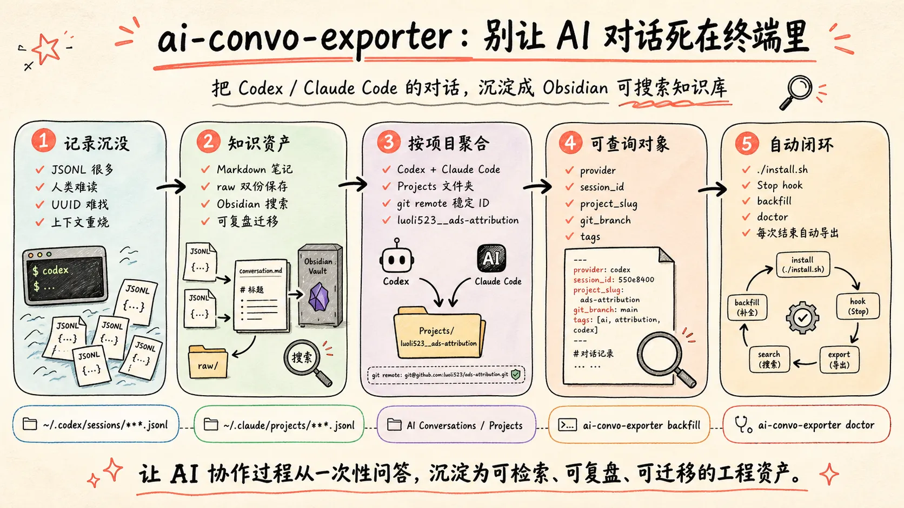
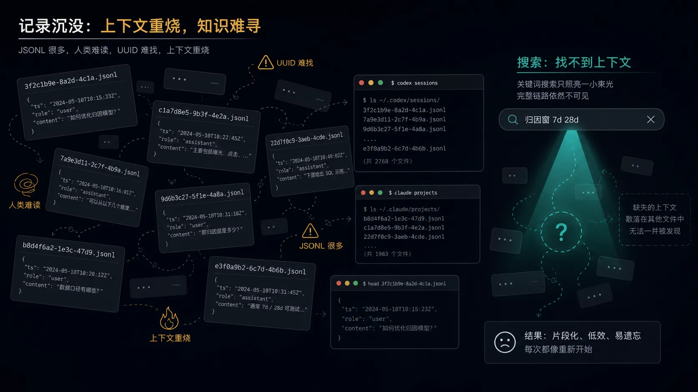
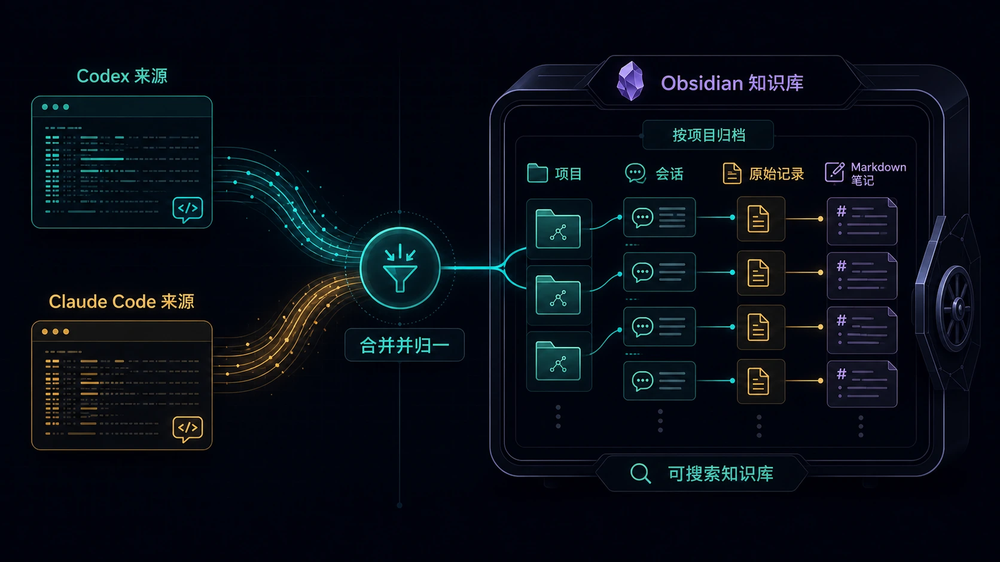
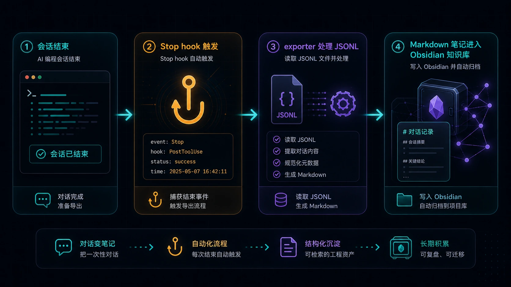
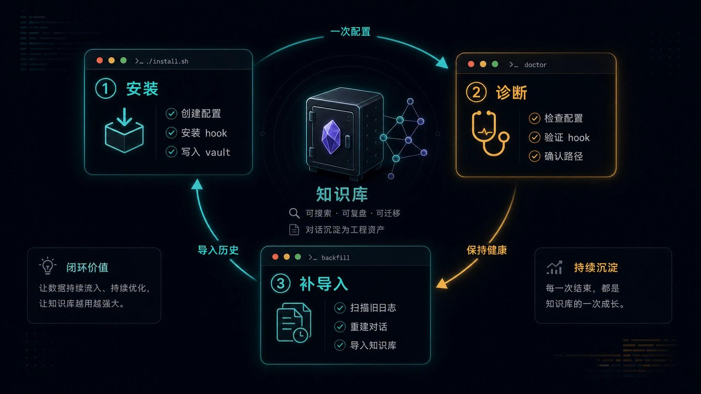

你每天和 AI 讨论架构、修 bug、拆任务，最后这些高价值判断都去哪了？

大概率是：**死在终端日志里。**

这有点荒谬。我们愿意把代码提交到 Git，把笔记放进 Obsidian，把文档同步到云端，却经常把最密集的工程思考过程留在 `~/.codex` 和 `~/.claude` 这种“存在但不会再看”的角落里。

所以我做了一个小工具：**ai-convo-exporter**。



---

## 问题不是“没有记录”，而是“记录不可用”

Codex 和 Claude Code 其实都会保存对话。

Claude Code 的记录大致在：

```text
~/.claude/projects/**/*.jsonl
```

Codex 的记录大致在：

```text
~/.codex/sessions/**/*.jsonl
~/.codex/archived_sessions/*.jsonl
```

问题是，**保存了不等于可复用**。

这些 JSONL 原始 transcript 对机器友好，对人不友好。你想找“上次那个 ads-attribution 项目里，我和 Codex 讨论 Diana UI 怎么启动来着”，通常不会去翻一堆 UUID 文件。更现实的情况是：重新问一遍 AI，重新烧一遍上下文，重新踩一遍坑。



我想要的是另一种形态：

| 需求 | 直接翻原始日志 | 导出到 Obsidian |
|---|---|---|
| 按项目查找 | 很难，要理解工具内部目录规则 | 直接按 project 文件夹 |
| 全文搜索 | 可以 grep，但体验粗糙 | Obsidian 原生搜索 |
| 跨机器复用 | 路径不同，容易散 | vault 同步即可 |
| 保留原始记录 | 有，但不适合阅读 | Markdown + raw JSONL 双份保存 |
| 后续再加工 | 成本高 | frontmatter + tags + Dataview |

这就是 ai-convo-exporter 的核心目标：**把 AI 对话从“工具内部状态”变成“个人知识资产”。**

---

## 它怎么组织你的对话？

工具的设计原则很简单：**按项目，而不是按 AI 工具。**

因为你真正关心的不是“这条对话来自 Codex 还是 Claude Code”，而是“它属于哪个项目”。同一个项目里，今天可能用 Codex 查代码，明天用 Claude Code 写实现。最后应该沉淀到同一个知识空间里。

导出后的目录长这样：

```text
Obsidian Vault/
  AI Conversations/
    Projects/
      luoli523__ads-attribution/
        _index.md
        sessions/
          2026-05-08 0947 codex 019e0544 保存对话.md
          2026-04-27 1621 claude fd7d3855 实现 FxRate.md
        raw/
          codex/
            019e0544-7beb-7983-a458-de94206793f8.jsonl
          claude/
            fd7d3855-0b5d-482d-a008-0827ab6cd875.jsonl
```

这里有一个小细节：项目文件夹不是直接用本机绝对路径。

如果一个项目有 git remote，工具会优先用 remote path 做稳定 ID，比如：

```text
git@github.com:luoli523/ads_attribution.git
```

会被转换成：

```text
luoli523__ads-attribution
```

这样换一台机器，即使 checkout 路径从 `/Users/li.luo/dev/git/...` 变成 `/Users/foo/code/...`，同一个项目仍然会进入同一个 Obsidian 文件夹。



---

## 每篇笔记都不是纯文本，而是可查询对象

每段对话会生成一篇 Markdown，开头带 frontmatter：

```yaml
---
type: ai-conversation
provider: codex
session_id: 019e0544-7beb-7983-a458-de94206793f8
project: luoli523/ads_attribution
project_slug: luoli523__ads-attribution
created: 2026-05-08T09:47:14+08:00
cwd: /Users/li.luo/dev/git/ads_attribution
git_repo: https://github.com/luoli523/ads_attribution
git_branch: main
machine: macbook
raw_transcript: ../raw/codex/019e0544-7beb-7983-a458-de94206793f8.jsonl
tags:
  - ai/conversation
  - provider/codex
  - project/luoli523__ads-attribution
---
```

这让它不只是“看起来像笔记”，而是能被 Obsidian、Dataview、搜索和标签系统继续使用。

比如你可以查：

- 最近一周我在哪些项目里大量使用了 Codex？
- 某个项目里 Claude Code 和 Codex 分别处理过哪些任务？
- 哪些对话发生在某台机器上？
- 哪些讨论和某个 git repo 或 branch 有关？

**AI 对话一旦结构化，就不只是聊天记录，而是工程过程的审计日志。**

---

## 安装方式：checkout 后一条命令生效

我不想为这个工具引入复杂依赖，所以它只使用 Python 标准库。

安装方式：

```bash
git clone https://github.com/luoli523/ai-convo-exporter
cd ai-convo-exporter
./install.sh --vault "$HOME/Documents/Obsidian Vault"
```

安装脚本会做几件事：

| 动作 | 文件 |
|---|---|
| 写本地配置 | `~/.config/ai-convo-exporter/config.json` |
| 安装命令包装器 | `~/.local/bin/ai-convo-exporter` |
| 添加 Claude Code Stop hook | `~/.claude/settings.json` |
| 添加 Codex Stop hook | `~/.codex/hooks.json` |
| 启用 Codex hooks | `~/.codex/config.toml` |

后续每次 Codex 或 Claude Code 对话结束，`Stop` hook 会自动调用：

```bash
ai-convo-exporter hook --provider codex
ai-convo-exporter hook --provider claude
```



安装是幂等的。重复执行 `./install.sh` 不会不断追加重复 hook，这一点很重要。配置工具最怕“装一次能用，装三次变成玄学现场”。

---

## 历史记录也能补导入

如果你已经用了很久 Codex 或 Claude Code，可以执行：

```bash
ai-convo-exporter backfill
```

它会扫描默认位置：

```text
~/.claude/projects/**/*.jsonl
~/.codex/sessions/**/*.jsonl
~/.codex/archived_sessions/*.jsonl
```

然后批量导入到 Obsidian。

如果你想先看看当前配置是否正确：

```bash
ai-convo-exporter doctor
```

典型输出类似：

```text
Config: /Users/li.luo/.config/ai-convo-exporter/config.json
Vault: /Users/li.luo/Documents/Obsidian Vault
Conversations dir: AI Conversations
Timezone: Asia/Singapore
Claude settings: /Users/li.luo/.claude/settings.json
Codex hooks: /Users/li.luo/.codex/hooks.json
Codex config: /Users/li.luo/.codex/config.toml
```



---

## 我真正想保留下来的不是“答案”

很多人把 AI 对话当成一次性问答：问完、复制、结束。

但在编程场景里，真正有价值的往往不是最终答案，而是中间过程：

- 这个方案为什么被放弃？
- 当时为什么选这个目录结构？
- 某个 bug 的根因是怎么定位出来的？
- 哪个测试失败暴露了真实问题？
- 我是怎么让 Agent 从错误方向回来的？

这些内容如果不沉淀，会变成一种很可惜的损耗：**你花钱、花 token、花时间训练出来的上下文，只活了一次。**

ai-convo-exporter 解决的不是“备份聊天记录”这么小的事情。它更像是在给个人开发工作流补一个缺口：让 AI 协作过程变成可检索、可复盘、可迁移的工程资产。

---

## 适合谁用？

如果你只是偶尔问 AI 一个命令怎么写，这个工具可能没那么必要。

但如果你有下面这些习惯，它会很有用：

- 用 Codex 或 Claude Code 深度探索项目
- 让 AI 帮你做架构决策和代码审查
- 经常跨多个项目切换
- 多台机器同时开发
- 已经在用 Obsidian 管理长期知识
- 想复盘自己和 AI 协作的工作方式

一句话：**当你的 AI 对话已经有复用价值，就值得被当成知识来管理。**

---

## Takeaway：把 AI 对话纳入你的知识系统

如果你想试用，只需要三步：

1. clone 仓库：`git clone https://github.com/luoli523/ai-convo-exporter`
2. 安装 hook：`./install.sh --vault "$HOME/Documents/Obsidian Vault"`
3. 可选补导入：`ai-convo-exporter backfill`

以后每次 Codex 或 Claude Code 对话结束，它都会自动进入 Obsidian。

这件事的收益不是第一天就爆炸，而是一个月后你搜索某个项目时，突然发现：**原来那些曾经散落在终端里的判断、踩坑和上下文，现在都回来了。**

---

## 参考资料

- GitHub 仓库：[luoli523/ai-convo-exporter](https://github.com/luoli523/ai-convo-exporter)
- Codex Hooks 文档：[OpenAI Codex Hooks](https://developers.openai.com/codex/hooks)
- Claude Code Hooks 文档：[Claude Code Hooks](https://code.claude.com/docs/en/hooks)
- Obsidian Dataview：[Dataview Plugin](https://blacksmithgu.github.io/obsidian-dataview/)
