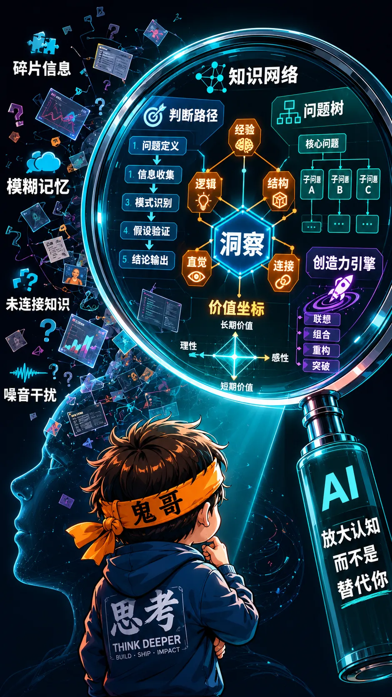
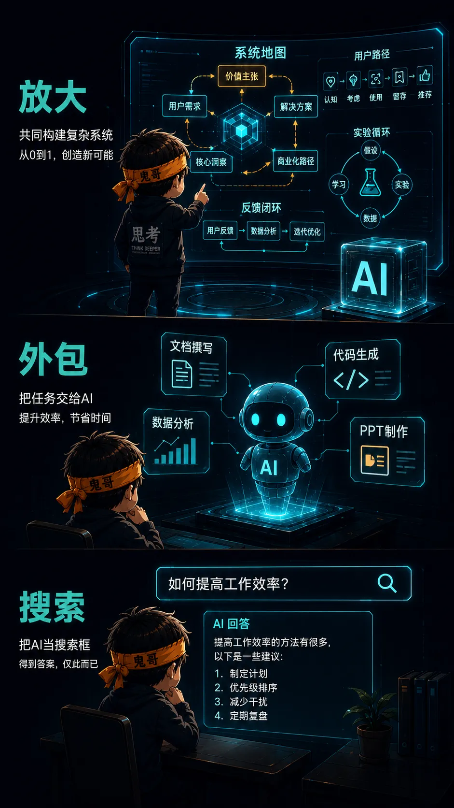
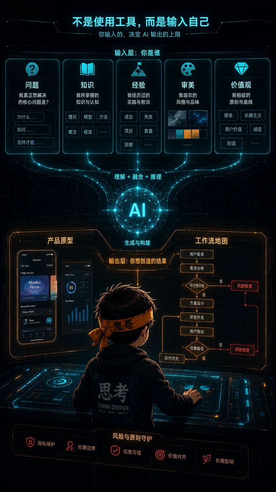

最近这两年，经常有团队里一些年轻同事，或者鬼哥的一些晚辈来问我：

**AI 那么强大，我们以后会不会被 AI 取代？**

说实话，两年前我也没有一个足够笃定的答案。那时候我也在一边兴奋，一边焦虑：模型能力涨得太快，很多过去觉得“人很厉害”的事情，突然变成了一个输入框就能完成。

随着年龄增长，鬼哥虽然一直还在不断学习，而且越学越觉得自己懂得太少，但很尴尬的是，我现在真的已经是很多人眼中的“前辈”了。😓

既然被问得多了，也就不能一直只回答“再看看”。

这几年自己用 AI、做产品、带团队、看年轻人成长，也看很多人从兴奋到迷茫，再从迷茫里慢慢找到自己的位置以后，我逐渐有了一个自己的答案。

今天就借“拿大炮打苍蝇”“杀鸡用牛刀”这两个老说法，和大家聊聊这件事。

人人都有一门大炮之后，真正的问题就不是“谁有大炮”了。

而是：**你看见的是一只苍蝇，还是一整片战场？**


---

## 重新理解“拿大炮打苍蝇”

过去我们说“拿大炮打苍蝇”“杀鸡用牛刀”，通常是在批评一个人 **资源错配**：目标很小，工具太重，成本太高。

这个理解当然没错。

但到了 AI 时代，这两句话可以换一个方向来理解。

今天，强大的 AI 模型已经不再是少数实验室、少数大公司的专属武器。写代码、做图、翻译、查资料、分析数据、生成方案，很多事情只要打开浏览器就能开始。换句话说，**“大炮”已经摆到了每个人面前**。

可结果并没有变成“人人都做出伟大的产品”。

有人用 AI 做出了让人兴奋的新应用、新工作流、新内容形态；也有人每天只是问它：

```text
帮我总结一下。
帮我写一段周报。
这个问题怎么解决？
```

这就像两个人站在同一门大炮旁边。一个人在研究地形、目标、风向、战术和后果；另一个人只是在问：“这个按钮怎么按？”

**AI 的能力很强，但它不会替你决定什么值得做。**

---

## AI 普惠之后，人反而更重要

ChatGPT 的普及已经说明一个事实：AI 不再是少数人的特权。公开报道中，OpenAI CEO Sam Altman 曾提到 ChatGPT 已达到约 8 亿周活用户。也就是说，AI 的入口已经非常普遍。

但这恰恰带来一个反直觉的结论：

**当工具变得普惠，人的差异会变得更明显。**

因为 AI 降低的是“执行”的门槛，不是“判断”的门槛。

| 能力 | AI 正在降低门槛 | 仍然依赖人 |
|---|---|---|
| 写作 | 起草、改写、总结、翻译 | 观点、取舍、语气、洞察 |
| 编程 | 样板代码、测试、重构建议 | 架构、边界、质量、责任 |
| 设计 | 生成草图、配色、视觉变体 | 审美、场景、体验判断 |
| 产品 | 原型、文档、用户故事 | 问题定义、用户理解、商业判断 |
| 学习 | 解释概念、生成练习 | 学习路线、真实反馈、长期内化 |

AI 可以很快给你一个答案。

但这个答案是不是肤浅？是不是跑偏？是不是遗漏了关键约束？是不是看起来很完整，其实不能落地？

这些都要靠人判断。

所以，AI 时代的核心竞争力不是“会不会问 prompt”。prompt 当然有用，但它只是表层。更底层的是：**你能不能提出好问题，给出好上下文，识别好答案，并把答案变成真实结果。**



---

## 同样的 AI，为什么产出完全不同？

我更愿意把 AI 看成一面镜子，也是一台放大器。

你输入的是碎片，它就放大碎片。

你输入的是套路，它就放大套路。

你输入的是深刻的问题、真实的经验、清晰的价值判断，它才可能帮你长出更有生命力的东西。

很多人担心：“AI 这么强，以后我们的工作会不会都被替代？”

这个问题要拆开看。

有些工作当然会被替代，尤其是那些长期停留在 **等待任务、执行指令、交付平均答案** 的工作。

但 AI 很难替代这样的人：

- 能发现别人没发现的问题；
- 能把模糊需求变成清晰定义；
- 能判断一个方案在现实里会不会失败；
- 能理解人，而不是只理解流程；
- 能把技术、商业、审美和价值观放在一起权衡；
- 能对结果负责，而不是只把答案丢出去。

AI 不是让人无所事事。

AI 是在逼我们回答一个更难的问题：

**如果执行本身越来越便宜，你身上还有什么不可替代？**

---

## 三种 AI 使用者

我观察下来，AI 使用者大概可以分成三类。

### 第一类：把 AI 当搜索引擎

他们主要问事实，拿答案。

这当然有价值。AI 比传统搜索更顺滑，也更会组织语言。但如果停在这里，AI 只是一个更会聊天的搜索框。

这类人的典型问题是：

```text
XX 是什么？
帮我总结一下这篇文章。
给我几个方案。
```

他们得到的是信息，但很少得到真正的认知增量。

### 第二类：把 AI 当外包员工

他们开始把任务交给 AI：写文案、写代码、做 PPT、生成图片、整理会议纪要。

这一步已经能显著提升效率。但问题是，如果你只是“分配任务”，你的上限仍然取决于你能不能定义任务。

任务定义得浅，AI 就会交付一个漂亮但浅的结果。

任务定义得乱，AI 就会高效率地产生一堆看似完整的混乱。

### 第三类：把 AI 当认知放大器

这类人不只是问答案，而是和 AI 一起拆问题、建模型、做实验、验证假设、迭代作品。

他们会这样使用 AI：

```text
这是我的行业背景、用户画像、约束条件和已有方案。
请先指出我的问题定义哪里不清楚。
再给出三个互相冲突的假设。
然后帮我设计一个最小实验来验证。
最后用产品、工程、商业三个角度批判这个方案。
```

你会发现，第三类人和前两类人的差异，不是“prompt 写得更花哨”。

而是他脑子里本来就有结构。

AI 只是把这个结构变得更快、更宽、更可见。



---

## 案例一：披头士的最后一首歌，不是 AI 写出来的

The Beatles 在 2023 年发布了《Now and Then》。这首歌使用机器学习技术，从 John Lennon 旧录音里分离出人声，让 Paul McCartney 和 Ringo Starr 得以完成这首“最后的披头士歌曲”。它后来在 2025 年获得格莱美最佳摇滚表演奖。

如果只从技术角度看，这件事很简单：AI 帮他们把 Lennon 的声音从一段老旧、模糊、混在钢琴声里的 demo 里分离出来。

但如果你真的去听这首歌，尤其是看它的 MV，你会发现它根本不是一个“AI 生成音乐”的故事。

它更像是几个老人，终于等到技术足够成熟，可以和年轻时的朋友再唱完一首歌。

John Lennon 的声音来自很久以前的一盘旧录音。George Harrison 在 1995 年留下过吉他部分。Paul McCartney 和 Ringo Starr 在几十年之后，重新把低音、鼓、弦乐和和声补上。那些已经离开的人、还在的人、年轻时的影像、年老后的背影，被 Peter Jackson 的影像重新放在同一首歌里。

你会很清楚地意识到：AI 不是主角。

AI 只是把一扇原本关上的门，轻轻推开了一条缝。

真正穿过那扇门的，是一生的友谊，是半个世纪的音乐记忆，是创作者对“什么可以做、什么不该过度打扰”的分寸感。

如果换一群人，拿到同样的分离技术，可能只会做出一段“复古风 AI 音乐”。但 Beatles 做出来的是《Now and Then》：一首关于时间、告别、重逢和迟到的歌。

这就是我想说的关键。

**AI 可以帮你清理噪音，但它不能替你拥有一生的积累。**

它可以把 Lennon 的声音从噪声里救出来，但它不能创造 Beatles 的历史；它可以让一段旧录音重新可用，但它不能替 Paul 和 Ringo 决定该怎样温柔地完成它。

你可以在这里听这首歌：

[The Beatles - Now And Then 官方 MV（B站）](https://www.bilibili.com/video/BV14H4y167ca)

---

## 案例二：AI 编程让门槛降低，但没有消灭工程判断

GitHub Copilot、Cursor、Lovable 这类工具，正在把软件开发的入口变得越来越低。自然语言可以生成代码，非专业开发者也能更快做出原型。

这当然是革命性的。

但真实项目里，AI 编程工具并没有让工程判断消失。研究和实践都显示，AI 很擅长处理样板代码、文档、单元测试、重复逻辑，但在复杂系统、跨文件上下文、架构边界、安全性和长期维护上，仍然需要人做判断。

这和“杀鸡用牛刀”的新解释是一致的。

如果你只想做一个玩具 demo，AI 可以很快给你一个看起来能跑的版本。

但如果你想做一个真正有人用、能迭代、能扩展、能出问题后查得清楚的产品，就必须有人回答这些问题：

- 数据边界在哪里？
- 用户真正的主流程是什么？
- 失败状态怎么处理？
- 安全风险在哪里？
- 未来三个月会不会把自己锁死？
- 这个功能到底该不该做？

这些不是 AI 自动替你负责的。

**AI 能写代码，但产品和系统的责任仍然在人身上。**

---

## 年轻人在 AI 时代到底该怎么办？

我给年轻人的建议，不是“赶紧学 100 个 AI 工具”。

工具当然要学，但工具会变。今天流行这个，明天流行那个。真正值得长期投入的是更底层的能力。

### 1. 训练问题意识

不要只问“怎么做”，要先问：

```text
这个问题真的存在吗？
谁会为它痛苦？
现在的解决方案为什么不够好？
如果解决了，世界会有什么变化？
```

AI 最怕的不是你不会提问，而是你根本没有真正的问题。

### 2. 建立知识结构

碎片知识喂给 AI，只会得到碎片答案。

你要有自己的知识地图：行业如何运转，用户如何决策，技术边界在哪里，商业模式靠什么成立。

有结构的人，用 AI 是扩展结构。

没结构的人，用 AI 是制造更多碎片。

### 3. 提高审美和标准

AI 很容易生成“差不多”的东西。

差不多的文章，差不多的设计，差不多的方案，差不多的代码。

但真正优秀的作品，往往死磕在那些“不差不多”的地方：一个标题、一个交互、一个边界条件、一句文案、一个节奏。

AI 时代，审美不是装饰品。**审美是你识别平庸的能力。**

### 4. 把答案变成结果

不要满足于“AI 给了我一个方案”。

真正的工作从这里才开始：

```text
能不能验证？
能不能上线？
能不能被用户使用？
能不能持续迭代？
出了问题谁负责？
```

AI 生成答案很快，但现实世界不认“看起来不错”。现实世界只认结果。



---

## 最后：你是什么，你的 AI 就是什么

AI 时代最残酷也最公平的地方在于：它把很多人的执行差距抹平了，却把认知差距放大了。

以前，一个想法可能因为不会写代码、不会设计、不会表达而死掉。

现在，很多门槛被 AI 降低了。你有想法，可以更快做原型；你有判断，可以更快验证；你有审美，可以更快打磨；你有经验，可以更快形成系统。

但如果你没有问题，没有判断，没有审美，没有对世界的真实理解，AI 也不会凭空替你长出来。

所以，我想把这句话送给所有担心被 AI 替代的年轻人：

**不要只问 AI 会什么。先问你自己是谁。**

你的学识、认知、经历、价值观、审美、人生观，你看待事物的方式，你和世界交互的方式，都会变成你使用 AI 的方式。

最终，AI 不只是工具。

它会成为你的镜子。

**你是什么，你的 AI 就是什么。**

---

## 参考资料

- [Sam Altman touts ChatGPT's 800 million weekly users, Business Insider](https://www.businessinsider.com/chatgpt-users-openai-sam-altman-devday-llm-artificial-intelligence-2025-10)
- [The Beatles' final song, restored using AI, is up for a Grammy, The Verge](https://www.theverge.com/2024/11/8/24291691/the-beatles-ai-now-and-then-song-grammy-nomination)
- [Transforming Software Development: Evaluating the Efficiency and Challenges of GitHub Copilot in Real-World Projects, arXiv](https://arxiv.org/abs/2406.17910)
- [Developer Productivity With and Without GitHub Copilot: A Longitudinal Mixed-Methods Case Study, arXiv](https://arxiv.org/abs/2509.20353)
