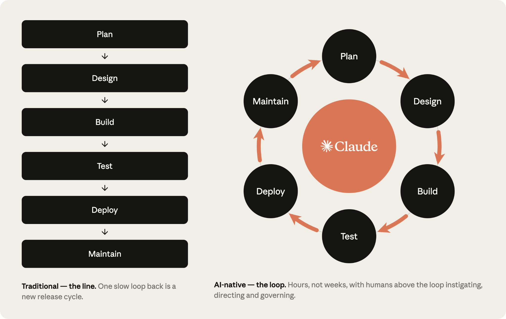
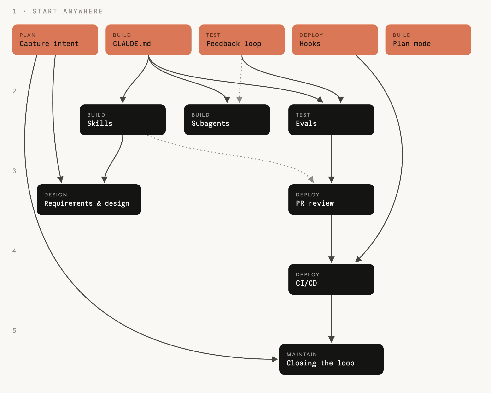

# AI Native 软件开发生命周期实战手册

> 如何逐阶段用 AI 改造软件开发生命周期。

## 导读

本文为 Anthropic 文章《[The AI-Native SDLC playbook](https://claude.com/blog/the-ai-native-sdlc-playbook)》的中文翻译，供个人学习与笔记使用。

当 AI 已能在数小时内产出过去需要数周完成的代码时，真正拖慢交付的往往不再是编程本身，而是前后的 Plan、评审、Test 与 Deploy 环节。本文的重点并不是让智能体取代工程团队，而是在保留既有问责、审批与审计目标的前提下，用版本化产物、自动化评测和确定性 hooks 重构流程闭环。

阅读时可以重点关注三件事：每个阶段交接给下游的产物是什么；哪些判断仍必须由人作出；以及如何用可观测、可审计的治理措施，让 AI 的速度不会突破组织的风险边界。对正在把 Claude Code 或其他编程智能体引入团队的工程负责人、平台团队和技术管理者而言，这是一份从局部提效走向完整软件开发生命周期改造的操作手册。

## 代码已不再是瓶颈

很多团队已经开始以一年前难以想象的速度用 AI 写代码，但围绕代码的流程并没有同步改变。许多工程团队仍沿用同样的审批关卡、评审、交接和政策；这些环节正在抵消 Claude Code 等智能体编程工具带来的生产力收益。

软件开发生命周期（SDLC）把软件从想法带到生产环境。多数组织都包含 Plan、Design、Building、Test、Deploy 和 Maintain 六个阶段，传统上每个阶段由不同角色负责：产品经理撰写需求，架构师制定设计，工程师实现，QA 验证，发布团队上线，运维团队监控。工作通过文档、工单和签字在阶段间流转。

传统 SDLC 流程繁重，目的是在每一步确保问责与控制；它诞生于「编写并实现代码」最耗时、最昂贵的年代。PRD、估算流程和产品安全审查，都用于在可能持续数周、数月乃至数季度的开发中强制达成一致。它还默认每一步都由人执行。

最能创造价值的组织正在围绕智能体 AI 重建流程，同时让人始终处于回路中。当代码不再是瓶颈、构建速度超过传统 SDLC 所允许的速度时，会出现三件事：

1. 瓶颈移到 Building 前后，主要是 Plan、评审/Test 和 Deploy；它们仍按人的速度运行。
2. 控制措施与现实脱节且难以执行。逐行人工审查在人写代码时合理；当智能体写出大部分 diff 时就无法跟上。
3. 例外仍需经由每周或每月才开一次的会议和委员会处理，治理成本上升。

以安全为例：安全团队的人员配置原本是按照人工代码产量设计的。当智能体显著放大代码产出时，要么审查队列不断堆积，要么代码在审查不足的情况下上线；受监管组织两种结果都无法接受。因此，安全与政策检查必须跟上智能体的速度。要真正获得智能体 AI 的生产力收益并保证安全，传统 SDLC 的其余部分也必须经历与实现阶段同等级别的改造。

## 什么是 AI Native SDLC？

AI Native SDLC 是对既有流程的重新设计：它保留旧流程的控制目标，却采用新的执行机制。流程不再线性流动，而成为循环；AI 被嵌入每一个节点。AI 自动完成交接并触发后续实践单元，从而解决传统 SDLC 阶段交接依赖手工操作、笨重低效的问题。

| 阶段 | 传统 SDLC | AI Native SDLC |
| --- | --- | --- |
| Plan | 委员会收集需求，经研讨会和签字后人工写成文档 | Claude 直接综合一手痛点，写入人可读、机器可执行的 `intent.md` |
| Design | 分析师写规格，设计师再解析 | 与智能体在一次工作会话中完成需求和设计，受 Git 版本化 skills 中的标准约束 |
| Building | 人工编写测试和代码，开发完成后再补文档 | AI 生成测试和代码；组织知识保存在版本化、机器可读的 `CLAUDE.md` 与 skills 中 |
| Test | 在阶段边界设置 QA 关卡 | 持续评测贯穿实现过程 |
| Deploy | 人审每一行代码；治理在周期性评审中进行且常不一致 | 多层智能体审查；人工仅审受监管与关键代码。AI 行动时即实施治理，钩子充当审批关卡 |
| Maintain | 人监控生产故障 | 智能体监控线上部署；任何控制带被突破，都会诊断并作为新的 `intent.md` 写回循环 |

右列贯穿始终的是「已提交的产物」。每个阶段结束时都向版本控制系统提交一个产物，下一阶段从该产物开始：`intent.md`、`spec.md`、`plan.md`、包含测试的 diff、附有审查结论的 PR，以及事故记录。早期主要用 Markdown，因为产品负责人和智能体都能读懂并据此行动；从 Building 开始，产物转为代码及其记录。提交链本身就是审计轨迹：谁提出什么、智能体产生什么、谁批准了什么。所有需要判断的决定仍由人负责。

## 实践单元（Plays）

这些实践单元分布在 Plan、Design、Building、Test、Deploy、Maintain 六个非线性阶段，覆盖完整生命周期。每个单元都说明：改变了什么、如何开始、具体执行步骤、治理考虑和成功度量。组织可按自身需要优先改造不同阶段；每个单元在「前置条件」中列出依赖。

每个阶段都以提交产物结束，而这次提交会启动下一阶段：被接受的 `intent.md` 触发需求与设计；获批的 `spec.md` 触发计划模式；合并的 PR 触发流水线；生产环境的控制带一旦被突破，便会生成下一份 `intent.md`。起初可手工提示每一步；最终目标是每个被接受的产物触发下一个关卡，人把注意力集中在关卡处，审阅智能体标记的内容，而不是从头启动每一阶段。

## 阶段 1：Plan

想法不必再等别人把它写成文档。提出者可以用自己的语言一次性记录意图，并将其作为受版本控制的产物交给下一阶段直接使用。

### 用 `intent.md` 捕获意图

`intent.md` 是开发流程的起点，可以来自人的想法、工单，或维护阶段的告警。提出者先与 Claude 头脑风暴，产出 Markdown 原型规格；传统流程里，同一个人还要说服产品团队成员与其共同写成正式需求。AI 生成的原型规格人可读、受版本控制、下一阶段立即可用，因此保存为 `intent.md`。无论意图由事件还是智能体产生，产品负责人都应在提交前审阅并修正它。

传统方式中，一个想法要经过待办项、用户故事、故事点和梳理会议，责任在多次交接中转移；工程团队拿到的内容已经与最初意图相隔很远。AI Native 方式中，提出者与 Claude 讨论并将结果写入 `intent.md`，其中说明想要什么、为何需要、有哪些约束；可重复流程编码为 skills。

**基础设施：**为非工程人员提供 Claude 访问；约定 `intent.md` 模板；建立产品负责人会关注的、受版本控制的共享意图库。单一产品最简单的选择是在产品仓库中建立 `intent/` 目录；只有跨许多仓库时才值得单独建意图库。无 Git 经验的贡献者可借助连接器，让 Claude 代表他们提交 Markdown。

**执行方式：**

1. 提出者用自己的话描述问题：当前做不到什么、谁受影响、什么算更好、哪些不在范围内。
2. 与 Claude 讨论到想法具体为止；Claude 会追问范围、用户、约束和成功标准。
3. 要求 Claude 使用组织模板写出 `intent.md`；模板可由技术团队配置成 skill，并经负责人批准。
4. 提出者修正 Claude 的误解。
5. 将文件提交到共享位置；作者和时间戳进入记录，产品负责人从此接手。

示例应包含问题、预期结果、受影响的用户/系统、约束和开放问题。治理证据是已提交的 `intent.md` 及其完整 Git 修订史；产品负责人以合并或关闭评审记录接受/拒绝，接受后进入设计。

**衡量：**领先指标是从第一次交谈到提交 `intent.md` 的时间，应从多周的调研与梳理周期降到数小时。滞后指标是存活率（被产品负责人接受而非关闭的比例），以及同一变更第一次提交 `spec.md` 后仍修改 `intent.md` 的次数。

## 阶段 2：Design

需求与设计压缩到同一会话中。政策在写规格时就被应用，而不是数周后在评审中才发现。

产品负责人批准 `intent.md` 后，Claude 基于组织的品牌、安全、合规和 UX skills 生成需求与设计规格。产品负责人审阅该规格而不是亲自起草；目标是形成工程团队可据以规划、且明确标记关注事项的 `spec.md`。前端是最直观的例子：接受意图后，产品负责人可据此在 Claude Design 中制作并迭代原型，再导出到 Claude Code 实现。

传统方式中，分析师与设计师分开完成两个阶段，虽方便问责却缓慢且信息有损；AI Native 方式中，Claude 在单一会话内把 `intent.md` 转为受组织 skills 约束的需求/设计规格，并标出疑点。

**执行方式：**产品负责人打开可用组织 skills 的会话并附上 `intent.md`；提示词应点明约束并要求标记关注事项。先手工运行，随后将其固化成组织级 slash command；再让意图库的合并触发非交互式任务，加载 skills 后提交 `spec.md` 的 PR。产品负责人审查规格是否解决问题、开放问题是否回答或延续，优先处理标记的疑点，并与对应政策负责人解决；最后将 `spec.md` 与 `intent.md` 一同提交。人类产品负责人决定是否进入构建，高风险事项咨询技术负责人。

治理的关键是：实时政策在写规格时即被读取和应用；产生规格的提示词、有效的 skill 版本和规格都进入版本控制。领先指标是 `intent.md` 到 `spec.md` 的耗时；滞后指标是开始构建后才发生的需求返工次数。

## 阶段 3：Building

没有获批准的计划，就不实施任何变更。组织知识沉淀为智能体可读的文件；护栏以代码形式执行，而不再依赖个人习惯。

### 默认从 Claude Code 计划模式开始

工程师在计划模式启动 Claude Code，提供已批准的 `spec.md`，让 Claude 通过提问迭代出计划。传统方式中，工程师读完设计就开始编码，变更的文件、顺序和测试只存在脑中或工单评论里；评审者第一次看见的是完成后的 diff。AI Native 方式中，Claude 在不改文件的计划模式下写出计划，工程师在代码产生前修正它，再将获批版本提交为 `plan.md`，供后续阶段核对。

**执行方式：**启动计划模式；提供 `intent.md` 和 `spec.md`，要求计划列出修改文件、工作顺序和证明正确性的测试；追问可能破坏什么、最危险的步骤是什么、放弃了哪些替代方案；迭代到从未参与会话的工程师也能仅凭计划实施；提交 `plan.md`；接受计划后再让 Claude 实现。实现偏离计划时，在同一次提交中更新 `plan.md`，可用钩子强制同步。

在代码生成前进行设计审查，此时改变方向仍只需改文档。常规变更由工程师批准，高风险变更交给技术负责人或架构师。领先指标是首次实现即合并的比例，以及计划批准到 PR 合并的时间；滞后指标是每项变更的返工周期和合并 diff 与 `plan.md` 的一致性。

### 自动模式、遗留系统与 `CLAUDE.md`

自动模式中，工程师批准并迭代计划后，Claude 无需每次编辑提示即可应用变更。随着 `CLAUDE.md`、编码政策的 skills、阻止不安全行为的 hooks 和可执行的测试套件逐渐成熟，在规格明确、影响范围小、已有测试覆盖的例行工作中，自动接受会成为默认。人从盯着每次编辑，转向在更长的自主会话后审查产物；结合 worktree，自动接受也支持个人和团队并行。

迁移时，为每种产物指定一个事实来源：仓库为权威记录，遗留系统仅引用提交内文件；或 Jira/ServiceNow 等遗留系统为权威记录，Markdown 仅作工作副本，由 Claude 通过 MCP 读写；最低要求是双方互相记录 ID 和 commit SHA。两种系统可以并存，但必须有链接或明确唯一事实来源。

`CLAUDE.md` 提供新人会需要的上下文：约定、命令、架构和团队常犯错误。原来留在脑中或 Wiki 的知识，成为 Claude 每次会话开头要读的文件。可用 `/init` 生成初稿，再删到只保留构建/测试/lint 命令、重要约定和 Claude 反复犯错之处；把它放在仓库根目录并接受代码式审查。一个实用规则是：Claude 同一类错误犯第二次，就把纠正写进 `CLAUDE.md`。文件应不超过一页，以免过期内容占据上下文。它的版本历史让指令可审查、可审计。

### Skills、hooks、并行会话与子智能体

skills 将制度知识变为可操作的内容：显式、受版本控制、广泛适用，政策变化时集中更新。经验法则是：必须一致应用的制度知识写成 skill；属于项目上下文的内容放 `CLAUDE.md`，一次性内容放提示词。将 skill 放在 `.claude/skills/<name>/` 或以组织插件分发；测试它在不同表述下都能触发，政策变化时由政策负责人批准更新。注意：skill 是建议性控制；绝不能违反的政策还需确定性层（阻止动作的 hook 或 PR 再审查）。skill 让违规罕见，hook 让违规近乎不可能。

构建阶段 hooks 可阻止修改受保护路径、在编辑后运行格式化与 lint、避免凭据进入 diff。应为每项不可例外的 skill 政策配备 hook；构建钩子必须快速并仅作用于变更文件，完整测试等重检查应放在提交或 PR。需要人工批准的 hook 应留到部署关卡，避免把人重新放回所有并行会话的关键路径。

并行会话是不同 worktree 中、处理独立任务的完整 Claude Code 实例；子智能体则在同一会话内充当有独立上下文窗口和工具限制的辅助者，适合「验证应用是否正常」等重复工作。拆分不触碰同一文件的任务；共享文件的任务留在一个会话里顺序运行。先从两三个会话开始，只有评审仍跟得上时才增加。将 verifier、研究者、简化器等子智能体定义提交到 `.claude/agents/`。更多会话意味着更多产出，所以控制应来自仓库配置并适用于所有会话。领先指标是保持评审质量前提下每工程师的并发会话数与引导工作占比；滞后指标是每周合并变更数及返工率。

## 阶段 4：Test

每个会话在交给人之前检查自己的工作；引导智能体的配置也像它写出的代码一样接受回归测试。

### 给 Claude 一个反馈回路

总要让 Claude 能验证自己的工作：测试、构建或截图差异皆可。会话自行检查并修复错误后才让工程师看到。它不同于构建阶段的 verifier 子智能体：反馈回路贯穿任务并重复运行；verifier 是主会话认为完成后，以全新上下文执行一次最终检查，避免判决受最初假设影响。

把当前需要多个命令和环境知识的检查包装成单一命令，例如 `make test` 或 `npm test`，失败时返回非零；在 `CLAUDE.md` 的 Commands 节中列出命令和健康输出；给出可量化目标。修 bug 时先写会失败的测试并确认它因预期原因失败，提交这个测试，再要求 Claude 不修改测试而使其通过；钩子可禁止修复任务编辑测试文件。UI 工作应给 Claude 浏览器或截图工具、mock，并允许「实现—截图—比较—调整」两三轮。把验证写入「完成」定义：报告完成前运行构建、测试、lint 并展示输出；若测试失败，修代码而非测试。

治理证据是工具链的实际输出（`make test`、构建日志或截图 diff），记录于会话转录和 PR check run；代码所有者因已有机械证据，能专注意图与风险。领先指标是智能体代码的 CI 首次通过率；滞后指标是每个 PR 的审查时间和变更失败率。

### CI 中的持续评测

评测是 AI Native 的阶段关卡 QA：智能体配置变化时运行的测试套件。模型替换或提示词重写后，它判断智能体是否仍按同样标准完成工作。评测集是活的：模型变强后旧用例可能失去区分力，监控中出现的新问题应不断补进来。

平台工程师应收集 20–50 个近期真实任务及其预期或已验收的结果；每项写为「提示词 + 可接受性检查」（测试通过、lint 干净、行为未变、政策遵守）。在 CI 中按计划及每次 `CLAUDE.md`、skills 或 hooks 的变更非交互运行；配置同样决定智能体的行为，因此也值得接受回归测试。用评测结果作为合并门槛；每个生产事故都由负责团队写成评测并保留为回归测试。领先指标是评测通过率和事故转为永久评测的耗时；滞后指标是 CI 捕获的回归与生产发现的回归之比。

## 阶段 5：Deploy

审查双向运行，治理在智能体行动时实施。智能体可以做生产关卡之前的一切，但不能越过关卡。

### AI 进入 PR 审查循环

Claude 既给出审查，也接收审查：它按组织政策审查入站 PR，并处理自己 PR 的评论。工程师可将注意力集中在行为、意图和风险上。传统方式中，审查能力按人工产出规划，PR 等人通读，质量随负载波动；AI Native 方式中，所有 PR 获得同一组审查 passes，发现按严重性排序，人审升级为「是否符合计划、风险是否可接受」。

技术负责人应在仓库根目录写 `REVIEW.md`，说明 bugs、security、compliance（对照 `spec.md`、`plan.md` 和设计原则）等审查 passes，定义 Important 与 Nit，并排除生成文件及 CI 已保证的事项。设置人类阈值：发现本身不能批准或阻塞 PR，分支保护仍要求代码所有者批准；若要按发现数量阻止合并，可读取 check run 的机器可读严重性统计。`@claude` 评论可让 Claude 修复并推送；可用自定义命令持续处理未解决评论和失败检查，直到 PR 只等待 code owner 批准。第二次出现的审查错误写进 `CLAUDE.md`；每月为发现评级、限制 nit 数量并调优。

职责分离依旧存在：写代码的智能体无权批准。`REVIEW.md` 对全部 PR 生效，发现、修复、评级和批准均记录在 PR 历史中。领先指标是首次审查时间（应降至分钟）和无需人工触碰分支即解决的评论比例；滞后指标是合并前发现的缺陷/漏洞相对逃逸到生产的比例。

### 用 hooks 充当审批关卡

构建阶段的 hook 是无需人工的护栏；hook 也可询问，在指定人员批准前暂停动作，这正适合发布关卡。工程领导、变更管理和合规部门先列出必须保留的人工关卡，如变更签字、发布授权、受保护路径编辑；平台工程师把每项表示为 Claude 行动前可 allow/ask/block 的脚本。团队 hooks 置于 Git 中的 `.claude/settings.json`，不可协商的 hooks 置于平台/IT 管理的 settings，个人无法关闭。block 必须说明原因和取得批准的路径。

在受监管企业中，受管设置应：拒绝读取 `.env`/secrets 和任意网络出口；预批准安全的构建、测试、lint 内循环；禁止用户、项目或 CLI 扩大规则；启用失败即拒绝的 OS 级 sandbox 与网络白名单；禁止沙箱读取 SSH、云凭据及环境密钥；仅允许受管 hooks、MCP 服务器和批准市场的插件；并强制经评估的最低版本。它只是按数据分级调整的起点，每一条 deny 都会损失某些能力。衡量 hooks 的领先指标是每个审批关卡的等待时间，滞后指标是 hooks 前后进入生产的关卡违规数。

### CI/CD 集成与部署

在 CI/CD 中非交互运行 Claude Code；对长时智能体进行 sandbox；通过 MCP 暴露部署工具；并在真正需要前演练回滚。传统流水线运行确定性脚本，需判断的事情等人处理；AI Native 方式让 Claude 在受作用域凭据的 sandbox 中处理判断任务，MCP 将部署、状态和回滚变为按环境限制的工具。

从只读判断任务开始，例如用 `claude -p` 分诊失败构建、总结 flaky 测试或起草变更日志。再把修复 lint、更新生成文档、回应审查评论等写操作置于现有关卡后；智能体写出的任何内容都经分支保护作为 PR 到达，不能直推 main。智能体任务应在带短期 scope token 的容器与网络策略中运行，默认没有生产凭据。按环境划分自主性：开发环境可自由部署，生产环境由智能体准备发布、发布经理授权，hook 强制生产关卡；预发布环境介于两者之间。回滚必须是最经常演练的单命令路径，定期在 staging 试验。

治理原则是：智能体可行动至生产关卡，不能跨越。分支保护将产出变成 PR；生产部署 hook 在具名发布经理授权前阻止发布；每次非交互运行使用智能体身份，使流水线日志能区分智能体与触发它的工程师；环境权限层级限制其到达关卡前的能力。领先指标是无需呼叫人工即可分诊的流水线失败比例；滞后指标是 DORA 指标。

## 阶段 6：Maintain

循环闭合：触发器在没有人参与启动路径的情况下调用 Claude，其发现以 `intent.md` 重新进入流水线。此前各阶段虽用了 Claude，却都需要人发起；维护阶段转向自主运行。持续监控智能体可因 bug 工单创建 `intent.md`，再经过需求、计划、构建、测试和审查。阶段间的独立置信关卡（确定性检查或对抗性审查智能体）决定上一步输出是继续还是升级给人。

传统 Maintain 是被动的：工单和事故等人处理，凌晨告警可能遗漏，工单可长期躺在 backlog，复盘行动可能永远到不了代码库。AI Native 方式中，控制带突破、工单、频道消息或计划任务会直接调用 Claude；它诊断、仅走受关卡保护的路径行动、把发现写为 `intent.md`，人负责分诊和审查而不再必须从零开始。

### 闭合循环

确定性脚本监控生产环境，控制带被突破时才调用 Claude。服务负责人先选择一个滚动基线稳定的指标，如 CI 测试失败率、部署后 5xx 比例或 PR 周期时间；再写受版本控制并有单元测试的检测脚本，通常使用滚动窗口的均值、标准差和 Western Electric 等规则，以捕捉缓慢漂移和尖峰，检测过程完全不使用模型。

在 `bands.yaml` 等版本控制配置中定义响应层级：1σ 仅记录；2σ 以只读方式调用 Claude 诊断；3σ 才允许行动，但仅能开 PR 进入评审关卡或触发预先批准的 runbook。触发层可为 GitHub/GitLab 定时工作流、现有监控栈 webhook 或网络内 Cron Job。Claude 以无状态方式在 CI runner 非交互运行，或作为 sandbox 容器中的 Agent SDK 服务，因此循环无需任何人启动也能开始和结束。智能体按阶段 1 格式写出 `intent.md`，包括异常及证据、预期结果、受影响系统和开放问题；服务负责人或 on-call 工程师分诊：立即修复、排期或忽略。忽略结果可调节控制带、降低噪声；修复上线后为该事故加入评测。

例如，CI 失败率达 3σ 时，智能体隔离 flaky 测试或开回滚 PR，评审关卡决定；部署窗口内 5xx 达 3σ 时，智能体触发既有回滚流水线；PR 周期时间触发漂移规则时，智能体给工程领导写报告。检测仍保持确定性：只有带被突破才调用 Claude，层级决定它能做什么。

Claude Tag 还可处理 Slack、Teams 等协作渠道中的事故。它作为频道成员以自身身份响应，使每起事件有第一响应者；对话及制度知识留在频道中，团队成员可共同检验假设和调查，频道历史增强可审计性。通过 MCP，Claude 验证指标是否回到基线并在话题中确认，把复盘写入受版本控制的 lessons 文件供未来调查使用。范围小、边界清晰的修复经审查关卡变成 PR；较大事项写为 `intent.md`，循环由此自我供给。

领先指标是从控制带突破到分诊队列出现 `intent.md` 的时间；滞后指标是最终成为已合并修复的发现比例，以及同类重复事故数——随着修复把案例加入评测集，它应下降。

## 结语

模型和运行支架越来越成熟，组织得以改变的不只是代码产出方式，而是整个软件开发生命周期。这个转型让人类判断始终居于中心，同时顾及大型企业的治理和监管要求。循环持续运行；人类判断始终位于循环之上。

原文建议平台团队按大致部署顺序参考：组织级 Claude Code 设置、settings 与受管 settings、权限与 sandbox、hooks、skills 与私有市场、受管 MCP、企业部署和网络配置、OpenTelemetry 监控/分析、合规 API，以及安全模型文档。
