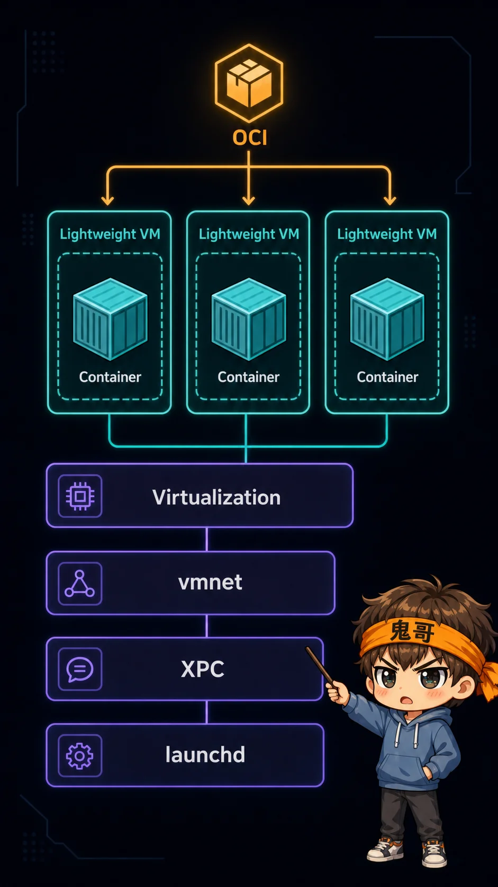
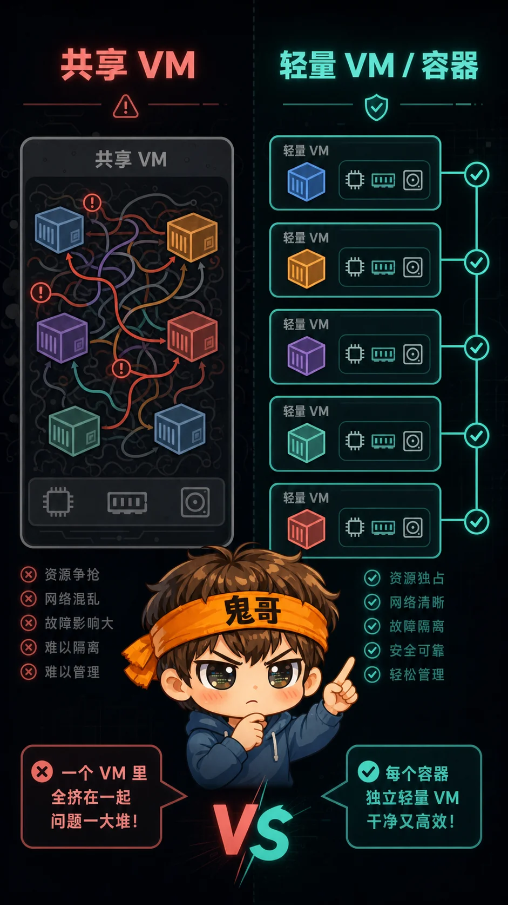
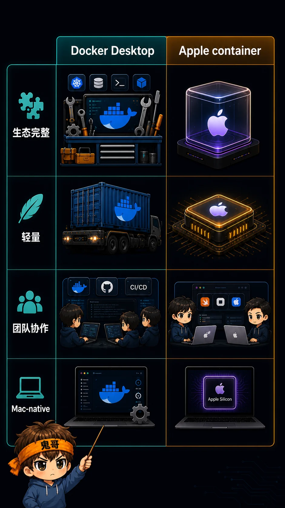

天下苦 Docker Desktop 久已。

启动慢、资源吃得多、风扇一转就像在提醒你“容器不是免费的”。更微妙的是，哪怕 Apple Silicon 已经强到离谱，很多本地容器体验依然像是从 Intel Mac 时代一路拖过来的包袱。

Colima、OrbStack、Rancher Desktop 这些方案当然缓解了不少问题。但苹果这次亲自下场，意义不一样：**它不是又做了一个 Docker Desktop 平替，而是针对 Apple Silicon 和 macOS 虚拟化能力，重新算了一遍 Mac 本地容器的账本。**

---

## 这件事为什么突然重要

AI Coding 火了以后，Mac 上的本地开发方式变了。

以前很多人开一个前端、一个后端、一个数据库，Docker Desktop 重一点也能忍；忍不了的人，就换 Colima 这类更轻的方案。现在不一样了：

| 过去的本地开发 | AI Coding 之后的本地开发 |
|---|---|
| 跑 2-3 个服务 | 跑 Agent 后端、向量库、沙箱、队列、评测服务 |
| 偶尔 rebuild | 频繁试错、频繁启动、频繁清理 |
| 人盯着终端 | Agent 在后台连续跑任务 |
| 卡一下就喝口水 | 卡一下就是自动化链路断掉 |

所以大家对 Docker Desktop 的抱怨，不只是“它占内存”。

真正的问题是：**当容器变成本地 AI 工作流的基础设施，容器工具本身就不能再像一个沉重的桌面 App，更不能长期停留在“能跑就行”的通用适配层。**

原推文里提到 `apple/container` 上线后热度很高。这个判断没错。截至 2026-06-30，GitHub API 显示它已经有 **45,143 Star**，最新 release 是 **1.0.0**。

但更值得看的不是 Star，而是它的路线。


---

## 它不是“苹果牌 Docker Desktop”

苹果官方 README 对 `container` 的定位很直白：这是一个在 Mac 上创建和运行 Linux 容器的工具，使用轻量虚拟机，Swift 编写，并针对 Apple Silicon 优化。

听起来像 Docker Desktop？

表面像，底层思路不一样。

传统 Mac 容器方案大多是：**先启动一个 Linux VM，再把多个容器塞进去**。这很好理解，因为 Linux 容器终究需要 Linux 内核。

苹果这套更激进一点：**每个容器一个轻量 VM**。

这句话很关键。

它意味着苹果没有试图把 macOS 伪装成 Linux，也没有简单给 Docker Desktop 换个壳。它是在用 macOS 自己的 Virtualization、vmnet、XPC、launchd、Keychain、统一日志这些系统能力，重新搭一层容器运行环境。

一个粗略对比：

| 维度 | Docker Desktop 常见体验 | Apple container 路线 |
|---|---|---|
| 架构核心 | 一个共享 Linux VM 承载多个容器 | 每个容器一个轻量 VM |
| 系统集成 | 跨平台桌面产品 | 深度绑定 macOS 能力 |
| 目标硬件 | 多平台 | Apple Silicon 优先 |
| 镜像兼容 | OCI/Docker 生态 | OCI 兼容镜像 |
| 体验目标 | 通用、成熟、生态完整 | 轻、更系统化、更 Mac-native |

这也是为什么它对 Mac 用户有吸引力：**苹果不需要赢下所有平台，它只需要把 Mac 这台开发机上的容器体验做得足够顺。**



---

## 真正的增量：不是命令兼容，而是资源边界更清楚

很多人第一反应会问：

```bash
docker run hello-world
container run hello-world
```

命令像不像？

当然重要，但这不是重点。

真正有意思的是，苹果把“容器隔离”重新拉回到 VM 级别，同时又尽量让它不像传统 VM 那么笨重。

官方技术概览里提到三个方向：

| 方向 | 它解决什么问题 |
|---|---|
| Security | 每个容器拥有接近完整 VM 的隔离属性 |
| Privacy | 只把必要的 host 数据挂载进对应 VM |
| Performance | 比完整 VM 更轻，启动时间接近共享 VM 中的容器 |

这对 AI Coding 很现实。

Agent 会更频繁地拉依赖、跑脚本、启动服务、读写本地文件。你让它在一个又大又混的共享环境里跑，调试时经常会出现一种痛苦：**到底是这个容器的问题，还是那个容器污染了环境？**

每个容器一个轻量 VM，至少在设计上给了更干净的边界。

这不是免费午餐，但它是一个更适合自动化开发的方向。



---

## 但先别急着卸载 Docker Desktop

热度越高，越要泼一点冷水。

`apple/container` 目前更像是一个值得认真试用的系统级新工具，而不是你今天就能无脑迁移全部工作流的终局答案。

几个边界要看清楚：

| 问题 | 现实情况 |
|---|---|
| 系统要求 | 官方 README 写明需要 Apple Silicon，主要支持 macOS 26 |
| 安装方式 | 官方推荐从 GitHub release 下载签名 installer pkg，并启动 `container system start` |
| 生态成熟度 | Docker Desktop 仍有更完整的 GUI、Compose 生态、团队管理和跨平台一致性 |
| 迁移成本 | 复杂项目不只是 `run`，还有网络、卷、构建、CI、调试工具链 |
| 版本变化 | 1.0.0 已发布，但 release 里仍有不少 breaking CLI/API change 记录 |

也就是说，原推文里那种“苹果亲自把 Docker Desktop 饭碗砸了”的说法，很适合传播，但技术上要改一句：

**苹果砸的不是 Docker Desktop 的饭碗，而是 Docker Desktop 在 Mac 上“理所当然必须常驻”的心理垄断。**

这差别很大。

如果你是重度 Kubernetes、Compose、多团队协作用户，Docker Desktop 仍然很可能是更省事的选择。

如果你是本地 AI Agent、单机开发、轻量微服务、临时沙箱用户，`container` 值得试。



---

## 我会怎么试

我的建议不是“立刻迁移”，而是把它当成第二套本地容器运行环境来压测。

可以按这个顺序来：

```bash
# 1. 从 GitHub release 安装签名 pkg 后启动系统服务
container system start

# 2. 跑一个最小镜像，确认基础链路
container run hello-world

# 3. 跑一个你最常用的开发镜像
container run --rm -it ubuntu:latest bash

# 4. 再测试真实项目里最容易出问题的三件事
# - 端口映射
# - volume 挂载
# - 私有 registry 登录
```

不要一开始就拿最复杂的项目开刀。

先拿一个你每天都会用、但出了问题不会影响工作的服务试。比如：

| 场景 | 适合程度 |
|---|---|
| 临时 Linux shell | 很适合 |
| 单个 API 服务 | 适合 |
| 本地跑 AI Agent 后端 | 值得试 |
| 多服务 Compose 项目 | 先观望或小规模验证 |
| 团队标准化开发环境 | 等工具链更稳再说 |

如果它能让你的 Mac 少转几次风扇，少卡几次终端，少等几次 VM 启动，那它就已经有价值。

---

## Takeaway

这件事的重点不是“苹果终于做 Docker 了”。

重点是：**AI Coding 正在把本地开发机变成一台小型自动化服务器，而苹果开始给这台服务器补基础设施。**

你可以这样判断要不要试：

1. 你用 Apple Silicon Mac。
2. 你经常本地跑容器。
3. 你讨厌 Docker Desktop 常驻但暂时离不开容器。
4. 你的工作流不是高度依赖 Docker Desktop GUI 和 Compose 生态。

满足三条，就值得花半小时测一下。

不满足，也不用焦虑。Docker Desktop 不是明天就没用，但它在 Mac 上的默认地位，确实第一次被苹果官方认真挑战了。

---

## 参考资料

- Apple container GitHub 仓库：<https://github.com/apple/container>
- Apple container 技术概览：<https://github.com/apple/container/blob/main/docs/technical-overview.md>
- Apple container 1.0.0 release：<https://github.com/apple/container/releases/tag/1.0.0>
