最近我一直在观察一件事：**模型越来越强，但 Agent 的账单却越来越贵**。

这听起来像个悖论。按理说模型更聪明了，应该一步到位，少走弯路，反而更省 token 才对。但现实里，我自己跑 Claude Code 也好，同事跑 Cursor Agent 也罢，同一个任务，换了更强的模型之后 token 账单反而涨了一截。

前两天刷到 Avi Chawla 写的这篇 [How to cut Claude Code costs by 3x](https://x.com/_avichawla/status/2046500537584218438)，一下子把我憋了好久的一个直觉讲清楚了——**问题不在模型，在后端。**

更具体点：问题在后端是怎么把自己的状态"交代"给 Agent 的。这件事 Karpathy 在讲上下文工程（context engineering）的时候其实提过，但大部分人只把它当成一个"写 prompt 的技巧"，没意识到后端本身就是上下文的一部分。

## 一个反直觉的数字

先看一张图，这是 MCPMark V2 跑的基准测试，21 个数据库任务，Supabase 的 MCP server 被调用产生的后端 token 消耗：

- **Sonnet 4.5：11.6M tokens**
- **Sonnet 4.6：17.9M tokens**

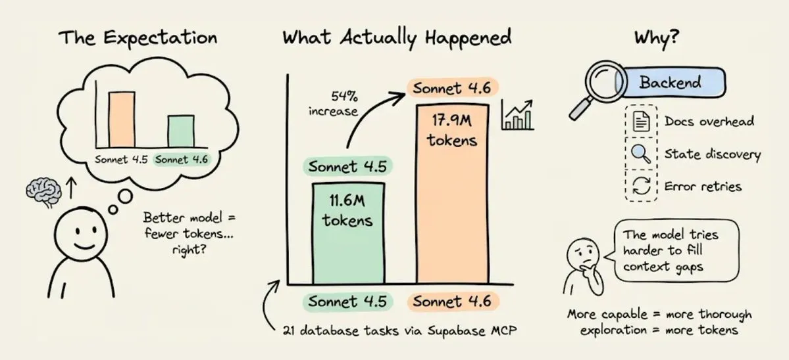

模型变聪明了，消耗反而多了 50%。

这个结果第一次看到我是懵的，但仔细想一下其实合理：**当后端给出的信息不完整时，更聪明的模型不会"跳过空白"，它会花更多 token 去推理那个空白**——多跑几次发现式查询，多重试几次，多尝试几种 workaround。

换句话说，"缺失的上下文"不会因为你换了更好的模型就消失，它只会变得更贵。

## 为什么 Supabase 的 MCP 是个 token 黑洞

Supabase 本身是个好产品，但它**不是为 AI Agent 设计的**——MCP server 是后来贴上去的，继承了所有面向人类开发者的设计假设。三个机制直接导致 token 爆炸：

### 1）文档检索：给一勺米，端来一锅饭

当 Claude Code 要在 Supabase 上配 Google OAuth，它会去调用 `search_docs` 这个 MCP tool。Supabase 的实现是——**每次调用都返回整块 GraphQL schema metadata**，token 量是 Agent 实际需要的 5-10 倍。

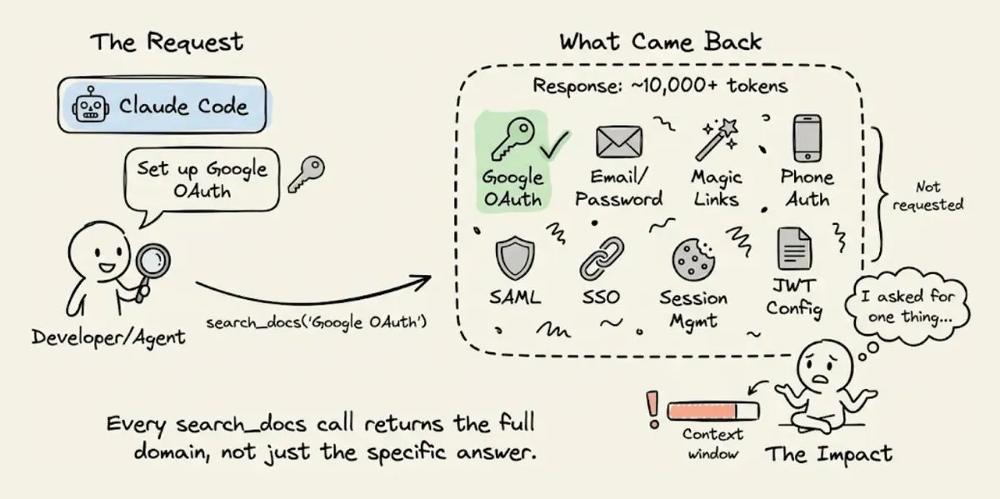

你问 OAuth 怎么配，它把 email/password、magic link、phone auth、SAML、SSO 全给你一遍。

这个模式发生在每一次 `search_docs` 调用上——查数据库、查 storage 配置、查 edge function 部署……每次都是一整片 domain 的 metadata dump 下来。一个 session 里光这部分的"文档 overhead"就能消耗掉几千 token，而这些 token 里真正被用上的不到两成。

### 2）后端状态：Agent 看不到仪表盘

当你作为人类开发者用 Supabase 时，你打开 dashboard，一眼扫过去就知道：启用了哪些 auth provider，有哪些表，RLS 策略是什么，storage bucket 怎么配的，edge function 部署到哪一步了……

**Agent 看不到 dashboard。**

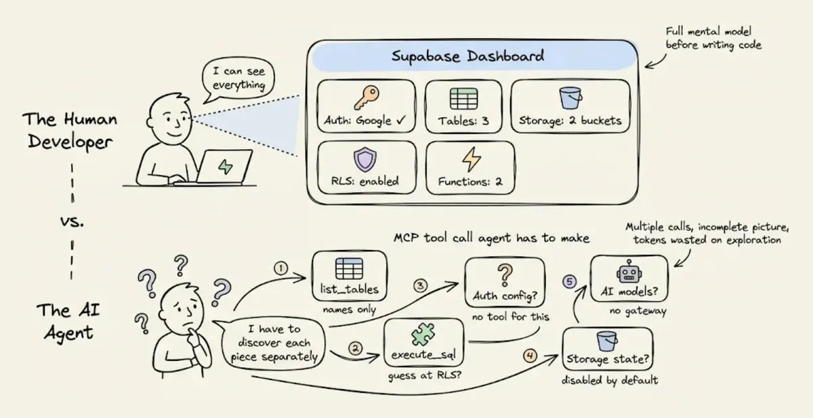

Supabase 的 MCP 确实暴露了一些状态查询接口——`list_tables`、`execute_sql` 之类——但**没有一个接口能回答"我这个后端整体长什么样"**。Agent 只能一个个工具串着调，每次拿回来一小块，部分信息（比如哪些 auth provider 启用了）甚至根本不在 MCP 里。

这个"拼图式"的状态发现过程本身就烧 token，而且经常拼不完整，要回头补查。

### 3）错误信息：只告诉你 401，不告诉你为什么 401

出错是必然的，因为 Agent 在猜。而 Supabase 返回的错误是**原始错误信息**：RLS 拒绝了个 403，edge function 配错了给你 500，就这些。

人类开发者看到错误，会去翻 dashboard、交叉比对日志、查 Supabase 的状态面板，最后定位问题。Agent 没有这个路径，它只能**根据错误信息的字面意思去猜可能的原因，改一遍代码，再试一次**。

猜错了，再来一轮。**每一轮重试都会把之前整个对话历史重新发一遍**，token 成本像滚雪球一样涨。

这三个机制一叠加，Sonnet 4.6 这种"推理更深入"的模型反而会把 token gap 拉得更大——因为它每一步探索都更细、更花 token。

## 上下文工程在后端长什么样

**修复方案不是换模型，而是给 Agent 一个结构化的后端上下文**，让它不用探索、不用猜。

这正是 Karpathy 说的那句话：

> Context engineering: the delicate art and science of filling the context window with just the right information for the next step.

Karpathy 明确把**工具和状态**列入了 context 的一部分。大部分人把这个概念用在 prompt 和 RAG 检索上，但**后端也是上下文窗口的一部分**——而且是目前几乎没人在优化的那部分。

[InsForge](https://github.com/InsForge/InsForge)（开源，8k star）就是冲这个问题去设计的。

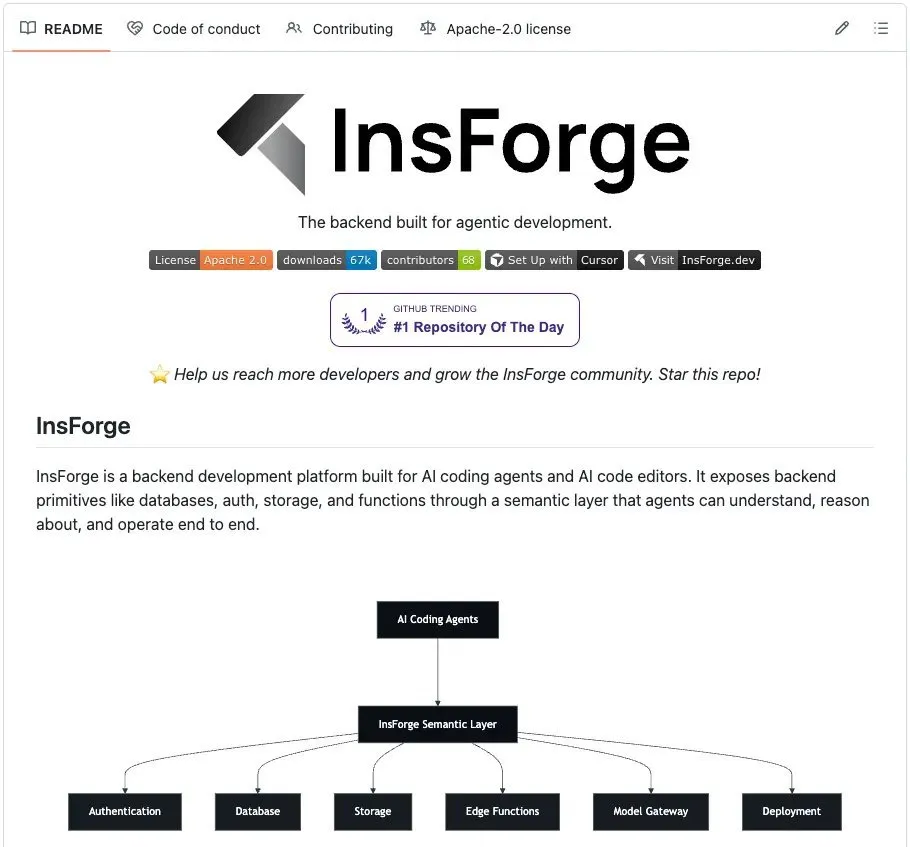

它提供和 Supabase 类似的原语——Postgres + pgvector、auth、storage、edge functions、realtime——但**信息层是按"Agent 消费效率"来组织的**。

核心架构是三层协作：

- **Skills** 承载静态知识
- **CLI** 负责直接执行后端操作
- **MCP** 只用来做实时状态查询

每一层解决一个具体问题，为不同原因省 token。

### 1）Skills：静态知识零往返

InsForge 选择用 Agent Skills 作为主要的知识承载方式——**在 session 启动时就直接加载进 Agent context**，SDK 用法、代码示例、各种边界情况都不用走 tool call 就能拿到。

而且 Skills 用的是**渐进式披露**：初始只加载元信息（name、description，大概 70-150 token/skill），只有当 Agent 判断当前任务匹配才加载完整内容。这意味着你可以装上百个 Skills 也不会把 context 撑爆——这是 MCP 的"要么全加载要么不加载"做不到的。

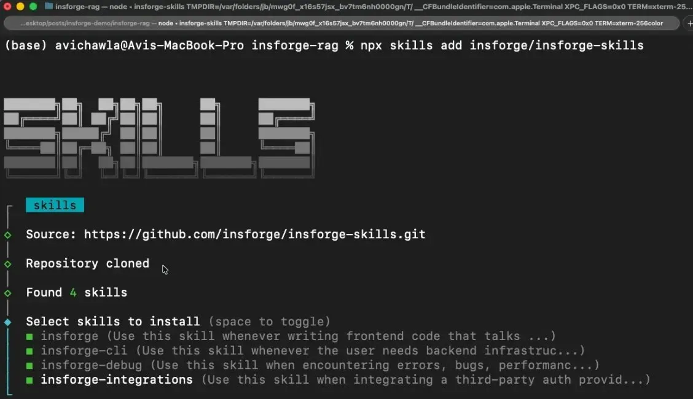

四个 Skill 覆盖全栈，每个都有明确的边界：

| Skill | 职责 |
|---|---|
| `insforge` | 前端代码怎么和后端对话 |
| `insforge-cli` | 后端基础设施管理 |
| `insforge-debug` | 结构化错误诊断（auth 错、慢查询、edge function 失败、RLS 拒绝等） |
| `insforge-integrations` | 第三方 auth provider（Clerk、Auth0、WorkOS、Kinde、Stytch） |

一行命令全装：

```bash
npx skills add insforge/insforge-skills
```

### 2）CLI：给 Agent 的"命令行手柄"

真正执行后端操作——建表、跑 SQL、部署 function、管理 secret——InsForge 把 **CLI 作为主要入口**，而不是 MCP。

每个命令都支持 `--json` 输出结构化结果，`-y` 跳过确认，返回**语义化的 exit code**，让 Agent 能直接通过返回码判断是 auth 失败、项目不存在还是权限问题。

这个设计的好处是 Claude Code 可以把 CLI 输出接到 `jq`、`grep`、`awk` 管道里，这是同样功能要用 MCP 实现时得连续调用好几次的事情。

Scalekit 跑的对比基准显示：**CLI+Skills 在单用户 workflow 里的 token 效率比等价 MCP 方案高 10-35 倍**，成功率接近 100%。

一些典型的 Agent 实际执行的命令长这样：

```bash
# 后端状态探查（Agent 第一件事就干这个）
npx @insforge/cli metadata --json

# 数据库操作
npx @insforge/cli db query "CREATE TABLE posts (...)" --json
npx @insforge/cli db policies

# Edge functions
npx @insforge/cli functions deploy my-handler
npx @insforge/cli functions invoke my-handler --data '{"action":"test"}' --json

# Storage
npx @insforge/cli storage create-bucket documents --json
npx @insforge/cli storage upload ./file.pdf --bucket documents

# 诊断
npx @insforge/cli diagnose db --check connections,locks,slow-queries
```

Agent 直接 parse JSON，然后根据 exit code 处理错误——干净、确定、可脚本化。

### 3）MCP：只用来看"活的状态"

MCP 这个路径也保留了，但**用途变得很窄**——只用来查后端当前的实时状态。

InsForge 的 MCP server 只暴露了一个轻量的 `get_backend_metadata` 工具，一次调用返回整个后端的拓扑：

```json
{
  "auth": {
    "providers": ["google", "github"],
    "jwt_secret": "configured"
  },
  "tables": [
    {"name": "users", "columns": ["id", "email", "created_at"], "rls": "enabled"},
    {"name": "posts", "columns": ["id", "title", "body", "author_id"], "rls": "enabled"}
  ],
  "storage": { "buckets": ["avatars", "documents"] },
  "ai": { "models": [{"id": "gpt-4o", "capabilities": ["chat", "vision"]}] },
  "hints": ["Use RPC for batch operations", "Storage accepts files up to 50MB"]
}
```

**一次调用、大约 500 token，Agent 就掌握了整个后端拓扑**。其中 `hints` 字段是 Agent 专用的使用提示，能直接减少 API 误用。

关键的设计选择是：**MCP 只做"会变化的状态查询"，不做"静态文档检索"**——这和业界默认的用法正好反过来，也是 InsForge 比 Supabase 省 token 的根本原因。

## 实战对比：用 Claude Code 造同一个 RAG 应用

作者选了一个应用叫 DocuRAG：

- Google OAuth 登录
- 上传 PDF
- 自动 chunk + embed（`text-embedding-3-small`，1536 维）
- 向量存进 pgvector
- 用户问问题，系统 embed 查询、检索相关 chunk、GPT-4o 生成回答
- RLS 隔离不同用户的文档

一次覆盖：**auth、storage、documents 表、vector embedding、embedding 生成、chat completion、retrieval edge function、RLS**——几乎所有后端原语都碰上了。

同一份 prompt，唯一的差别是 Supabase 版本要声明"LLMs/embedding models via the OpenAI API"（两套系统要接），InsForge 版本只需要"also for the model gateway"（一套系统）。

作者把两次完整的 Claude Code session 录下来了：

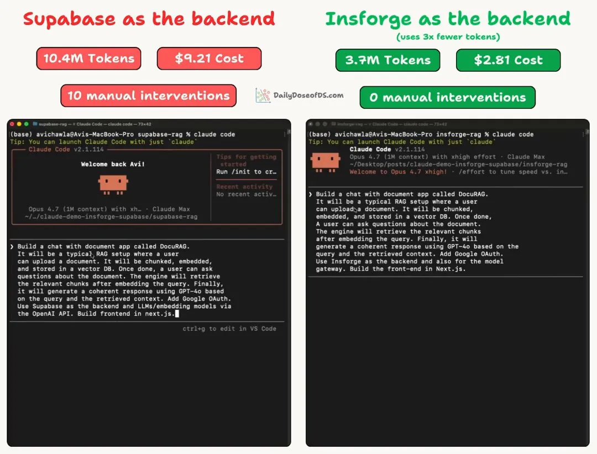

<video controls style="max-width:100%;height:auto;">
  <source src="video-001.mp4" type="video/mp4">
</video>

**顺便提一句录像里没捕捉到的细节**：Supabase 那次，Google OAuth 需要手动在 Google Cloud Console 里建 OAuth 2.0 Client ID、配 consent screen、加测试用户、复制 Client ID 和 Secret 粘回 Supabase dashboard——这些都不在 Claude Code 的控制范围内。InsForge 则完全不用这一步。

先看最后的账单：

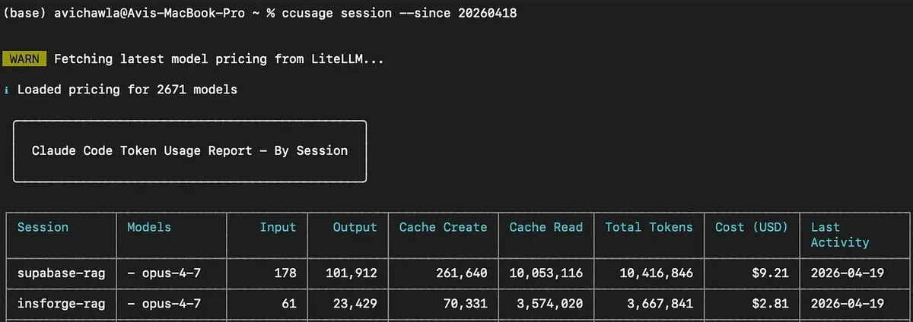

| 后端 | Token | 成本 | 用户消息 | 错误报告 |
|---|---|---|---|---|
| Supabase | 10.4M | $9.21 | 12 条 | 10 条 |
| InsForge | 3.7M | $2.81 | 1 条 | 0 条 |

**3x 的差距**。现在我们看看两次 session 具体发生了什么。

## Supabase：10.4M token 的大部分都花在调错上

初始构建其实很顺。

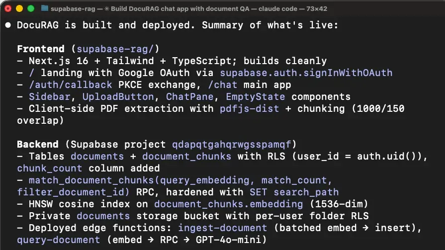

Agent 加载了 `supabase` skill，用 MCP 的 `list_tables`、`list_extensions`、`execute_sql` 把后端状态摸了一遍，scaffold 了 Next.js 项目，建了库表，写了两个 edge function（`ingest-document` 和 `query-document`），部署完成，build 通过。

然后开始翻车。

### 第一个坑：登录直接不工作

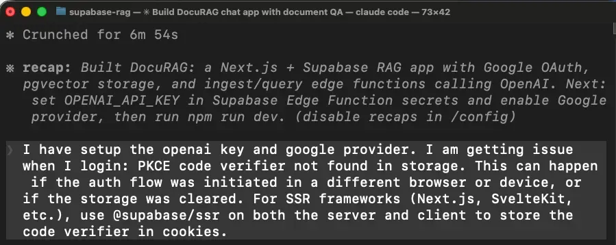


问题在于 Next.js 下 OAuth 回调跑在 server 端，但 Agent 给你装的是**客户端 Supabase 库**，把 session 存在浏览器里——server 端拿不到，登录整个崩了。

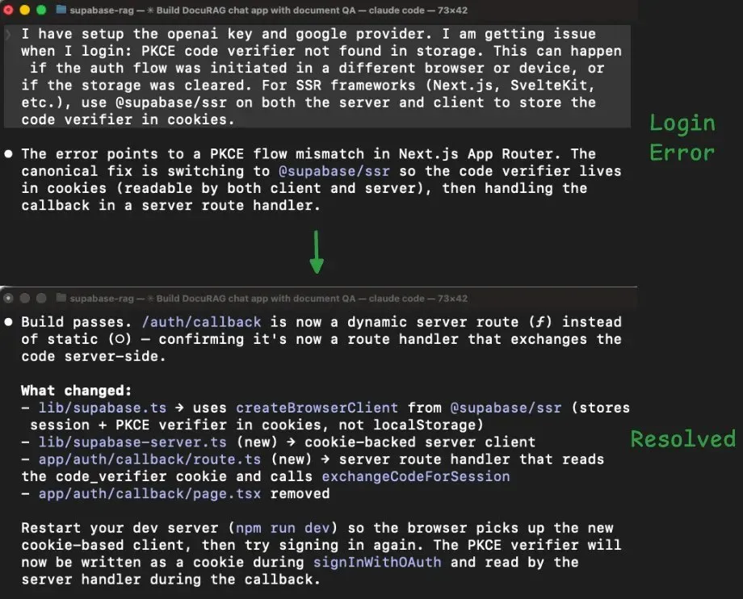

Agent 切到 `@supabase/ssr`，重写了 session 处理，重新构建——算是过了。

### 第二个坑：上传文档，连续 8 轮失败

登录修好之后试上传，edge function 报错。我报错 → Agent 改 → 失败 → 再报错 → 再改 → 同一个错。**这个循环跑了 8 次**：

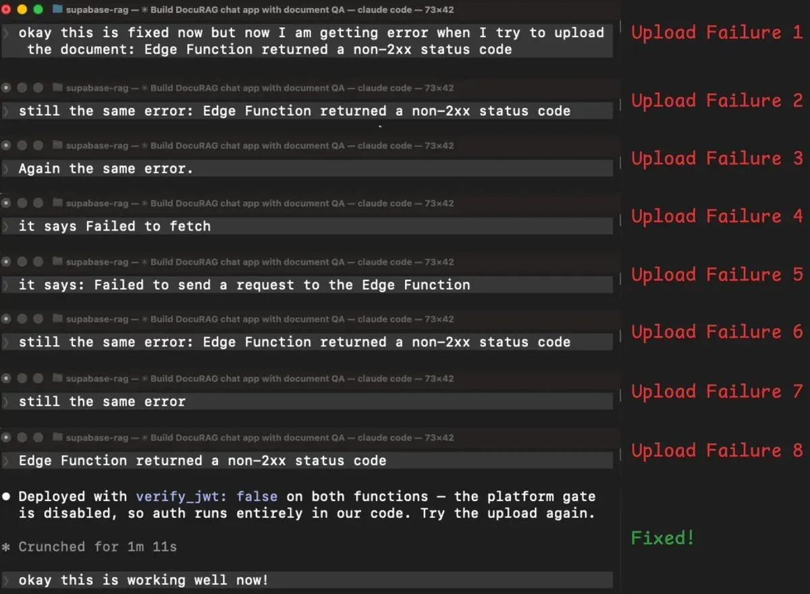

- 加 auth header → 同样错误
- 加日志重新部署 → 同样错误
- 打印真实错误信息 → 变成 CORS 错误
- 修 CORS → 回到原来的错误
- 换一种读取用户 token 的方法 → 同样错误
- 换另一种鉴权方式 → 同样错误

8 轮之后，Agent 终于说了句：

> "The 401s may be happening at the platform's verify_jwt gate before our code even runs."

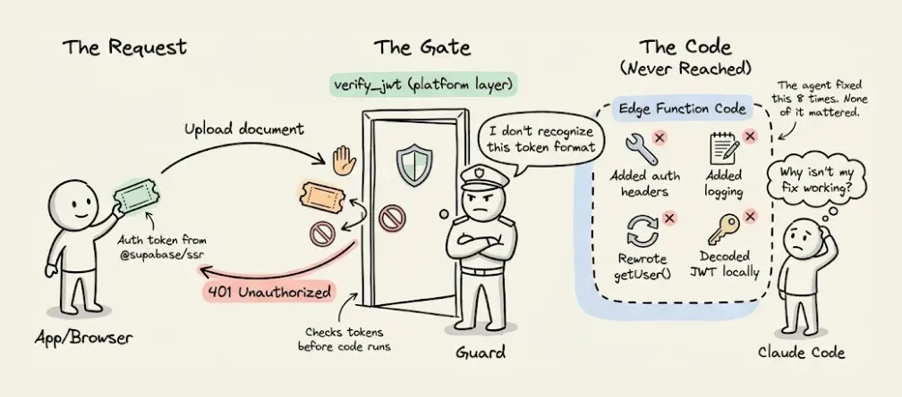

翻译一下：**Supabase 在平台层有个自动 token 检查，发生在你的 edge function 代码执行之前**。前面换 `@supabase/ssr` 的时候，新库发送的 token 格式平台层不认，所有请求在"门口"就被拒了，function 代码根本没跑起来——所以 8 轮代码级别的修复全都不对。

解法很简单：**关掉平台的自动 token 检查，在 function 内部自己做鉴权**。

但这 8 轮里 edge function 被重新部署了 8 次（加上最初的 2 次就是 10 次），每一次重新部署、每一次看日志、每一次重试，**都会把越来越长的对话历史重新塞进 context**——token 就是这么滚起来的。

Supabase 的最终统计：

- 12 条用户消息（其中 10 条是报错）
- 135 次 tool call
- 30+ 次 MCP 调用
- 10.4M token
- $9.21

## InsForge：3.7M token，零错误干预

InsForge 这边，**全程没有一次需要我介入的错误**。

Agent 第一件事是 `npx @insforge/cli metadata --json`：

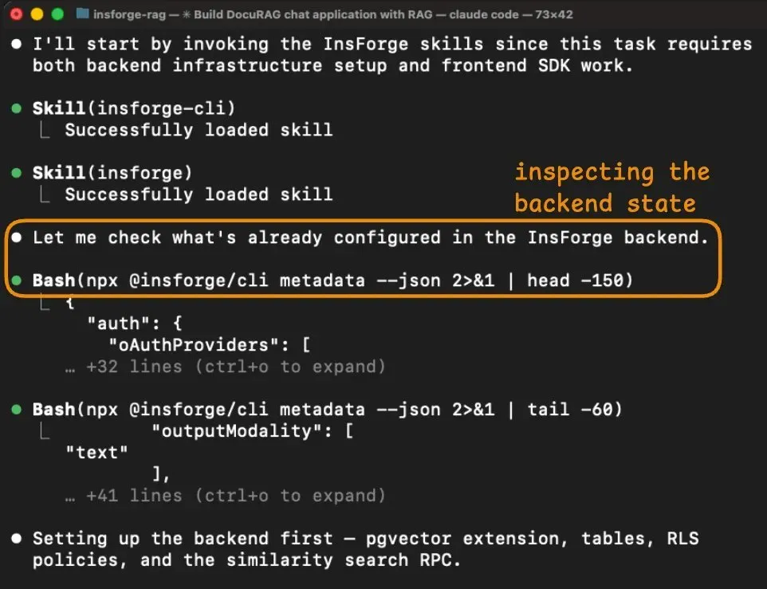

一次返回：auth provider、现有表、storage bucket、可用 AI 模型、realtime channel。**Agent 在写任何代码之前就已经对这个后端有了完整认知**。

对比 Supabase 那次要调多个 MCP tool 才能拼出类似认知，而且还漏掉了 `verify_jwt` 这种关键细节——差距在这里就已经拉开了。

Schema 建立跑了 6 条 CLI 命令，全部成功：

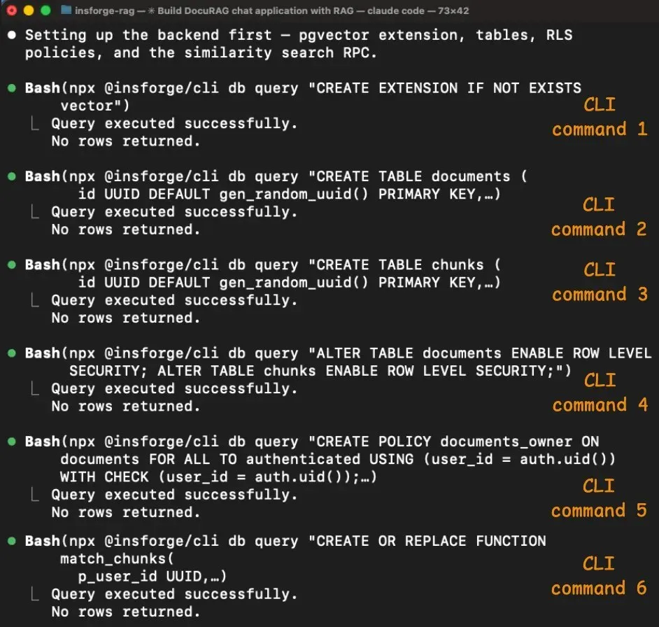

启用 pgvector、建 `documents` 和 `chunks` 表（带 `vector(1536)` 列）、在两张表上开 RLS、创建访问策略、建 `match_chunks` 相似度搜索函数。每一条都返回结构化输出确认执行了什么，Agent 逐步验证。

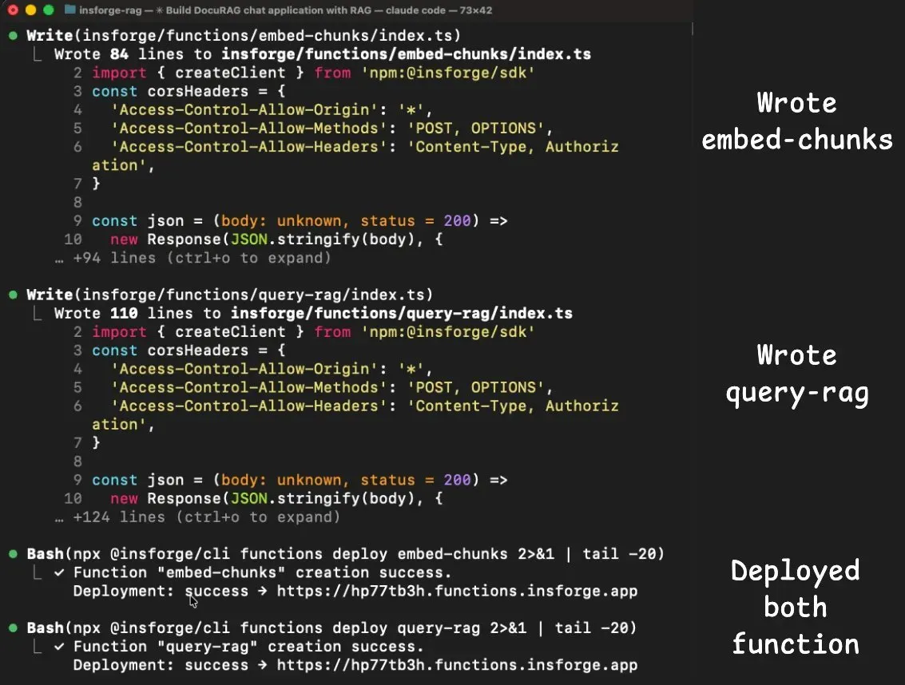

Supabase 那边的 auth 和 edge function 坑——这边一个都没撞上：

- `insforge` skill 自带了 Next.js 下正确的客户端库用法，Agent 一次写对
- 两个 edge function（`embed-chunks` 和 `query-rag`）因为 **embedding 和 chat completion 都在同一个 model gateway 里**，直接调就行，不用单独接 OpenAI、不用管第二套 API key、不用处理跨服务鉴权
- metadata 里已经列出了 `text-embedding-3-small` 和 `gpt-4o`，Agent 通过 InsForge SDK 直接调用

最终：

- **1 条用户消息**
- 77 次 tool call
- **0 次 MCP 调用**
- 3.7M token
- $2.81

作者让 Claude 生成的对照表：

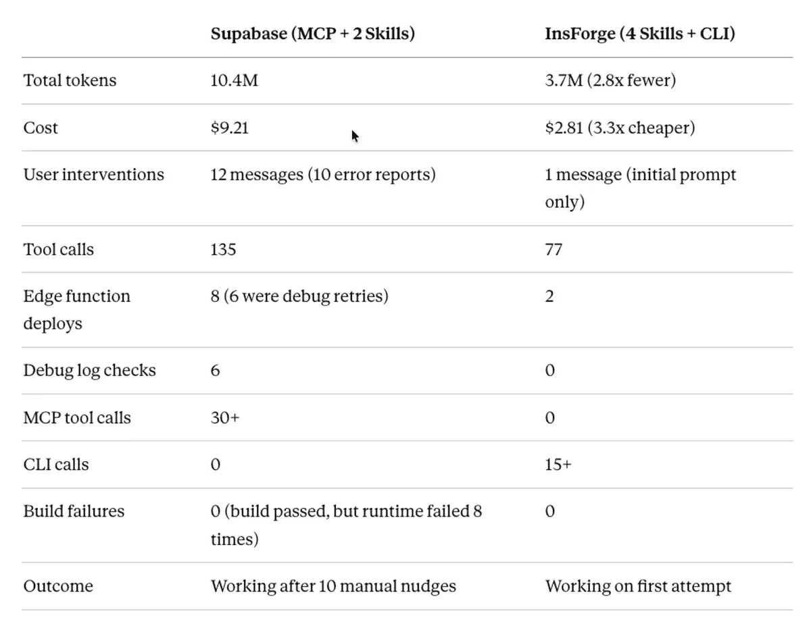

## 我自己的体感

看完这个对比，我最大的感慨不是"InsForge 比 Supabase 强"——**这不是产品优劣的问题，是架构假设的问题**。


我过去几个月用 Claude Code 跑全栈任务，有个特别直观的感受：**Agent 花在"搞清楚现在是什么状态"上的 token，常常比"写代码"还多**。你看它在那里 `ls` 来 `ls` 去，`grep` 来 `grep` 去，尝试各种命令去探测配置……每一步都是 token。

Supabase 这类后端本来就是给人类开发者设计的：人类可以看 dashboard、可以翻多个 tab 对比、可以凭经验"感觉到"问题大概在哪一层。Agent 一样都做不到——**它只能从你返回给它的字节里推理**。

如果后端返回的字节里不包含"verify_jwt 把请求在门口挡掉了"这个信号，它就永远不知道问题在上游，只会在代码层打转。

这件事反过来对我写代码也有启发：**当你给 Agent 提供接口或工具的时候，得用"Agent 视角"重新设计一遍返回值**——错误信息要结构化、状态查询要原子化、成功失败要有明确的语义码、文档要按任务切片而不是按资源切片。

这不是 nice-to-have，是 cost driver。

## Takeaway

如果要我用一句话总结这篇文章的价值：

> **修的不是模型，也不是 context window，是后端怎么把自己交代给 Agent 这件事本身。**

几个可以直接拿走的判断：

1. **Token 账单涨了不一定是模型的锅**。先去看看 tool call 的 input/output 形状——尤其是那些每次 dump 一大坨 metadata 的"便利接口"。
2. **MCP 不该用来查文档**。静态知识走 Skills（进 context 一次就够），MCP 只留给"活的状态"。这和业界默认用法是反的。
3. **CLI 是被低估的 Agent 接口**。`--json` 输出 + 语义化 exit code + 标准 Unix 管道，在大多数场景比 MCP 工具链更省 token、更易验证。
4. **错误信号的结构，比错误信息的文字更重要**。如果你的平台只告诉 Agent "401"，它会花 8 轮去猜 401 是谁发的。
5. **设计后端接口的时候，问自己一个问题**：一个刚接入的 Agent，看完我的 metadata/docs/error，能不能一次就知道"下一步该干什么"？如果不能，你的 token 账单就在这里。

InsForge 本身只是这个思路的一个落地，但**这个思路是通用的**——无论你用什么后端、什么 Agent 框架，"把上下文主动喂过去"永远比"让 Agent 探索式发现"便宜一个量级。

Karpathy 说得对：

> 填满 context window 的"正确信息"，是做 Agent 最核心的技能。

**而后端基础设施，是这些"正确信息"最大的一块来源——而这恰恰是大多数人都还没开始做的地方。**

## 参考资料

- 原推文：[Avi Chawla — How to cut Claude Code costs by 3x](https://x.com/_avichawla/status/2046500537584218438)
- InsForge 开源仓库：[github.com/InsForge/InsForge](https://github.com/InsForge/InsForge)
- Karpathy 的 Context Engineering 原贴（作者引用的出处）
