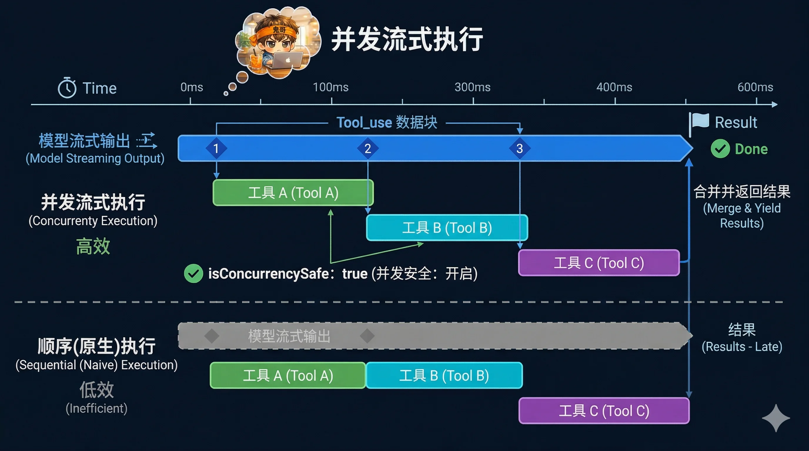
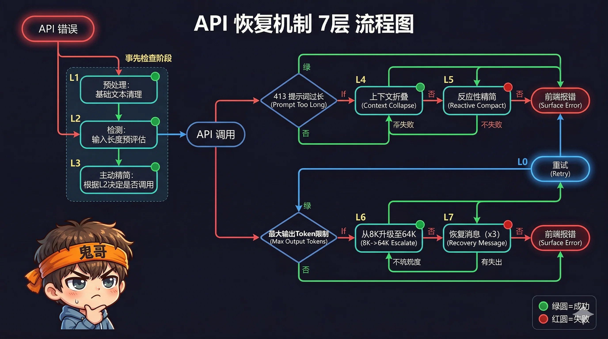

> 一个 AI Agent 的核心竞争力不在于它调用了多好的模型，而在于它的主循环有多健壮。Claude Code 的心脏是 `query.ts` 中一个 1,700 行的 `while(true)` 循环——本篇逐阶段拆解它。

---

## 问题

当你在 Claude Code 里输入"帮我重构这个函数"，系统不是简单地调一次 API 然后返回结果。它可能需要：

1. 先搜索代码找到函数位置
2. 读取相关文件理解上下文
3. 生成修改方案
4. 执行文件编辑
5. 运行测试确认没有 break

每一步都是一次"模型思考 → 工具执行"的循环。如果中途上下文溢出了怎么办？输出被截断了怎么办？API 过载了怎么办？网络断了怎么办？

Claude Code 的回答是：**一个能自我修复的 ReAct 循环**。

---

## 在整体架构中的位置

```
用户输入 → QueryEngine.submitMessage()
                    ↓
            ┌──────────────────┐
            │  query.ts        │  ← 本篇聚焦
            │  while(true) {   │
            │    ...1,700 行... │
            │  }               │
            └──────────────────┘
                    ↓
            Ink 渲染引擎 → 终端
```

`QueryEngine` 是入口，但真正的循环逻辑在 `query.ts` 的 `queryLoop()` 函数中。`QueryEngine.submitMessage()` 做的是消息规范化、系统提示组装，然后把控制权交给 `query()` 异步生成器。

---

## 循环状态：一个 Agent 需要记住什么

在进入循环之前，先看循环维护的状态。这个状态对象定义了一个 ReAct Agent 需要跨轮次追踪的所有信息：

```typescript
type State = {
  messages: Message[]                         // 对话历史（持续增长）
  toolUseContext: ToolUseContext               // 工具执行上下文
  autoCompactTracking: AutoCompactTrackingState  // 压缩状态追踪
  maxOutputTokensRecoveryCount: number        // 输出截断恢复次数（上限 3）
  hasAttemptedReactiveCompact: boolean        // 是否已尝试紧急压缩
  maxOutputTokensOverride: number | undefined // Token 上限覆盖（8K→64K）
  pendingToolUseSummary: Promise<...>         // 上一轮的工具摘要（异步）
  stopHookActive: boolean                     // Stop Hook 是否激活
  turnCount: number                           // 当前轮次
  transition: Continue | undefined            // 上一次继续的原因
}
```

**两个关键设计**：

1. **恢复计数器在每轮重置**：`maxOutputTokensRecoveryCount` 在正常轮次结束时归零——每轮都有 3 次恢复机会，而不是全局 3 次。这意味着一个跨 20 轮的长任务，每轮都能独立恢复。

2. **Transition 追踪**：`transition.reason` 记录上一次循环为什么继续，而不是结束。这不是给用户看的——是给调试和测试用的。可能的值包括 `'next_turn'`（正常）、`'reactive_compact_retry'`（紧急压缩后重试）、`'max_output_tokens_escalate'`（Token 升级）等。

---

## 五个阶段


### 阶段一：上下文准备 — 在调 API 之前先"瘦身"

每轮 API 调用之前，系统会运行一条**压缩管线**，确保消息历史不会超出上下文窗口：

```
Tool Result Budget (单消息上限)
       ↓
    Snip (历史裁剪)
       ↓
    Microcompact (工具结果压缩)
       ↓
    Context Collapse (选择性归档)
       ↓
    Autocompact (AI 全量摘要)
```

每级压缩**逐层递进**，前一级减少不够才进下一级：

**Tool Result Budget**：给单条工具结果设置上限。过长的搜索结果、文件内容会被截断。这一步在 Microcompact 之前运行，因为它的截断对缓存是不可见的。

**Snip**：轻量裁剪，直接移除旧消息。保留最近的上下文不动。释放的 Token 数 `snipTokensFreed` 会传给后续阶段，影响 Autocompact 的触发阈值。

**Microcompact**：按 `tool_use_id` 压缩工具结果。关键技术：它操作的是**缓存索引**而非消息内容本身，对 API 的 Prompt Cache 不可见。这意味着压缩不会打破缓存。支持的工具包括 FileRead、Shell、Grep、Glob、WebSearch、WebFetch、FileEdit、FileWrite。

**Context Collapse**：选择性归档。不是摘要所有内容，而是保留细粒度上下文、只归档确定不再需要的部分。

**Autocompact**：AI 全量摘要。当 Token 数超过 `上下文窗口 - 13,000` 时触发。使用专门的 Prompt 让模型生成 9 个分区的结构化摘要（请求意图、技术概念、文件代码、错误修复、问题解决、用户消息、待办任务、当前工作、下一步建议）。

有一个**熔断器**：如果 Autocompact 连续失败 3 次（`MAX_CONSECUTIVE_AUTOCOMPACT_FAILURES = 3`），就停止尝试，避免无限循环。

---

### 阶段二：模型流式调用

准备好上下文后，调用 Anthropic API：

```typescript
for await (const message of deps.callModel({
  messages: prependUserContext(messagesForQuery, userContext),
  systemPrompt: fullSystemPrompt,
  tools: toolUseContext.options.tools,
  signal: toolUseContext.abortController.signal,
  options: {
    model: currentModel,
    fallbackModel,
    maxOutputTokensOverride,   // 可能已从 8K 升至 64K
    fastMode: appState.fastMode,
    taskBudget: { total, remaining },
    queryTracking: { chainId, depth },
    // ...
  }
})) {
  // 流式处理每个消息块
}
```

**流式处理的核心**：模型的输出不是一次性返回的，而是逐块到达——文本块、工具调用块、思考块。系统在流式接收过程中做了三件关键的事：

**1. 错误拦截与暂扣**

并非所有错误都立即暴露给调用方。三类错误会被**暂扣**（withheld），等待后续恢复：

| 错误类型 | 暂扣条件 | 恢复手段 |
|---------|---------|---------|
| 413 Prompt Too Long | Context Collapse 或 Reactive Compact 可用 | 压缩后重试 |
| Max Output Tokens | 总是暂扣 | Token 升级或多轮恢复 |
| Media Size Error | Reactive Compact 可用 | 剥离图片/PDF 后重试 |

暂扣的消息仍然会推入 `assistantMessages`，但不会 `yield` 给调用方。只有恢复失败后才会浮出。

**2. 工具调用块收集**

```typescript
if (msgToolUseBlocks.length > 0) {
  toolUseBlocks.push(...msgToolUseBlocks)
  needsFollowUp = true   // 标记：本轮需要继续循环
}
```

**3. 流式工具执行（如果启用）**

这是最精巧的部分——下一节详述。

---

### 阶段三：工具执行 — 流水线并行



Claude Code 有两种工具执行模式：

#### 模式 A：流式执行器（StreamingToolExecutor）

当特性门控 `tengu_streaming_tool_execution2` 开启时，工具**在模型还在输出时就开始执行**。

工作原理：

1. 模型流式输出 `tool_use` 块 → `streamingToolExecutor.addTool(block)` 立即入队
2. 执行器检查并发安全性 → 满足条件立即开始执行
3. 模型继续输出 → 新工具继续入队和执行
4. 模型输出完毕 → `getRemainingResults()` 等待剩余工具完成

**并发安全规则**：

```typescript
canExecuteTool(isConcurrencySafe: boolean): boolean {
  const executing = this.tools.filter(t => t.status === 'executing')
  return (
    executing.length === 0 ||
    (isConcurrencySafe && executing.every(t => t.isConcurrencySafe))
  )
}
```

翻译成人话：
- 如果没有工具在执行 → 直接执行
- 如果当前工具和所有正在执行的工具都是并发安全的 → 并行执行
- 否则 → 等待

**哪些工具是并发安全的？** 读操作通常是安全的（`FileRead`、`Grep`、`Glob`）。写操作通常不安全（`Bash`、`FileEdit`）。但 `Bash` 工具有特殊逻辑：某些只读命令（`git status`、`ls`）也可以并发。

**Bash 错误的传播**：如果一个 Bash 工具报错，它会通过 `siblingAbortController.abort('sibling_error')` 取消所有兄弟工具。这是因为 Bash 错误通常意味着环境出了问题，继续执行其他工具没有意义。

**工具状态机**：

```
queued → executing → completed → yielded
```

#### 模式 B：批量执行器（toolOrchestration.ts）

如果流式执行未启用，工具在模型输出完毕后**批量执行**：

```typescript
partitionToolCalls(toolUseBlocks)
  → 并发安全工具分到同一批（并行，最多 10 个）
  → 非安全工具各自一批（串行）
```

两种模式的接口是统一的——都产出 `{ message, newContext }` 的异步迭代器——循环体不需要知道用的是哪种模式。

---

### 阶段四：附件收集

工具执行完成后，系统收集一系列"附件"为下一轮做准备：

1. **排队命令**：用户在工具执行期间输入的命令
2. **Skill 发现**：后台预取的新 Skill
3. **记忆预取**：后台发现的相关长期记忆
4. **工具摘要**：用 Haiku 模型异步生成的工具使用摘要（fire-and-forget，不阻塞下一轮）

```typescript
// 工具摘要是异步的——这一轮生成，下一轮才消费
nextPendingToolUseSummary = generateToolUseSummary({
  tools: toolInfoForSummary,
  signal: toolUseContext.abortController.signal,
}).catch(() => null)  // 失败也不阻塞
```

---

### 阶段五：终止或继续？

这是每轮的最终决策点：

```
模型调用了工具？
  ├─ 是 → needsFollowUp = true → 继续循环
  └─ 否 → 进入终止检查

终止检查链：
  1. API 错误？→ 执行失败 Hook，返回 'completed'
  2. Stop Hook 阻止？→ 返回 'stop_hook_prevented'
  3. Stop Hook 报错？→ 注入错误消息，继续循环（reason: 'stop_hook_blocking'）
  4. Token Budget 未用完？→ 注入 nudge 消息，继续循环
  5. 超过 maxTurns？→ 返回 'max_turns'
  6. 以上都不是 → 返回 'completed'
```

**Stop Hook** 是一个有趣的机制：用户可以在设置中定义 Shell 命令，在模型每次完成回复后执行。Hook 可以检查模型的输出，决定是否允许继续。如果 Hook 返回错误，错误会被注入到消息历史中，模型会在下一轮看到这些错误并尝试修正。

**Token Budget** 是另一个控制点：当启用时，系统会检查本轮已消耗的 Token 是否达到预算的 90%。如果没有，注入一条 nudge 消息（"已用 X%，继续工作，不要总结"）让模型继续工作。还有**衰减检测**：如果连续 3+ 轮且每轮新增 < 500 Token，判定为"衰减"并停止——模型可能在兜圈子。

---

## 七层恢复机制



恢复机制是这个循环最精妙的部分。不是简单的 try-catch 重试，而是**分层的、有针对性的自我修复**。

### 前三层：预防性（在 API 调用前）

| 层 | 名称 | 触发 | 做什么 |
|----|------|------|--------|
| L1 | Autocompact | Token > 上下文窗口 - 13K | AI 生成 9 段结构化摘要 |
| L2 | Snip | 历史消息过长 | 裁剪旧消息 |
| L3 | Microcompact | 工具结果冗余 | 按 tool_use_id 压缩 |

这三层**在 API 调用前运行**，目的是把上下文控制在安全范围内，避免触发 413 错误。

### 第四层：Context Collapse（413 第一道防线）

当 API 返回 413 错误后，系统首先尝试 Context Collapse——选择性归档消息。

```typescript
if (state.transition?.reason !== 'collapse_drain_retry') {
  // 只尝试一次，避免双重 drain
  const drained = contextCollapse.recoverFromOverflow(messagesForQuery)
  if (drained.committed > 0) {
    continue  // reason: 'collapse_drain_retry'
  }
}
```

**关键细节**：通过 `transition.reason` 检查避免重复 drain——如果上一轮已经是 `collapse_drain_retry`，就不再尝试，直接进入下一层。

### 第五层：Reactive Compact（413 最后手段）

如果 Context Collapse 也不够，触发紧急全量压缩：

```typescript
if (!hasAttemptedReactiveCompact) {
  const result = reactiveCompact.tryReactiveCompact({...})
  if (result) {
    continue  // reason: 'reactive_compact_retry'
  }
}
```

Reactive Compact 会：
1. 计算需要清理的 Token 差距（`actualTokens - limitTokens`）
2. 对整个对话生成紧凑摘要
3. **智能恢复**：压缩后自动恢复最重要的信息（最近读取的文件、当前 PR 文件等，最多 5 个文件，预算 50K Token）
4. 对于 Media Size Error，可以剥离图片/PDF 后重试

**死亡螺旋防护**：413 恢复路径显式跳过 Stop Hook——因为模型从未产生有效输出，Hook 没有东西可评估。如果在这里运行 Hook，会产生"错误 → Hook 阻塞 → 重试 → 错误"的死亡螺旋。

```typescript
// 代码注释原文：
// Do NOT fall through to stop hooks: the model never produced a valid response,
// so hooks have nothing meaningful to evaluate. Running stop hooks on
// prompt-too-long creates a death spiral: error → hook blocking → retry → error → …
```

### 第六层：Token 上限升级（8K → 64K）

当模型输出被截断（`max_output_tokens` 错误），系统的第一反应不是重试，而是**升级限制**：

```typescript
if (capEnabled && maxOutputTokensOverride === undefined) {
  // 从默认的 8K 升级到 64K——单次升级，同一请求内立即重试
  maxOutputTokensOverride = 64_000  // ESCALATED_MAX_TOKENS
  continue  // reason: 'max_output_tokens_escalate'
}
```

**为什么默认只给 8K？** 这是一个成本优化。大多数回复在 8K 以内就能完成。只在真正需要时才升级到 64K，避免不必要的 Token 消耗。

### 第七层：多轮恢复（最多 3 次）

如果 64K 也不够，系统会注入恢复指令让模型从断点继续：

```typescript
if (maxOutputTokensRecoveryCount < 3) {  // MAX_OUTPUT_TOKENS_RECOVERY_LIMIT
  const recoveryMessage = createUserMessage({
    content: 'Output token limit hit. Resume directly — no apology, no recap...',
    isMeta: true,  // 对 UI 不可见
  })
  maxOutputTokensRecoveryCount++
  continue  // reason: 'max_output_tokens_recovery'
}
```

注意恢复指令的措辞："Resume directly — no apology, no recap"——告诉模型直接从断点继续，不要浪费 Token 道歉或重复已输出的内容。

3 次恢复后如果仍然被截断，才浮出错误给用户。

---

## 循环的 10 种终止方式

| 终止原因 | 含义 |
|---------|------|
| `completed` | 正常完成：模型没有调用工具 |
| `aborted_streaming` | 用户中断（Ctrl+C），模型还在输出 |
| `aborted_tools` | 用户中断，工具还在执行 |
| `hook_stopped` | Hook 发出了停止信号 |
| `stop_hook_prevented` | Stop Hook 显式阻止继续 |
| `prompt_too_long` | 413 错误，所有恢复手段用尽 |
| `image_error` | 图片处理错误 |
| `blocking_limit` | Token 超过手动压缩阈值 |
| `model_error` | 未处理的模型调用异常 |
| `max_turns` | 超过最大轮次限制 |

**6 种继续循环的原因**：

| Transition Reason | 含义 |
|------------------|------|
| `next_turn` | 正常：模型调用了工具，需要继续 |
| `collapse_drain_retry` | Context Collapse 释放了空间，重试 |
| `reactive_compact_retry` | 紧急压缩成功，重试 |
| `max_output_tokens_escalate` | Token 上限从 8K 升到 64K |
| `max_output_tokens_recovery` | 注入恢复指令，继续输出 |
| `stop_hook_blocking` | Hook 报错，注入错误让模型修正 |
| `token_budget_continuation` | Token 预算未用完，注入 nudge |

---

## 一个完整的循环实例

把所有部分串起来，看一个"重构函数"任务的完整循环轨迹：

```
Turn 1: 用户输入 "帮我重构 parseConfig 函数"
  Phase 1: 无需压缩（对话刚开始）
  Phase 2: 模型调用 GrepTool 搜索 "parseConfig"
  Phase 3: GrepTool 并发执行（read-only，并发安全）
  Phase 4: 收集搜索结果
  Phase 5: needsFollowUp=true → continue (reason: 'next_turn')

Turn 2:
  Phase 1: 无需压缩
  Phase 2: 模型调用 FileReadTool 读取文件 + GlobTool 查找相关文件
  Phase 3: 两个工具并行执行（都是只读）
  Phase 4: 收集文件内容
  Phase 5: needsFollowUp=true → continue

Turn 3:
  Phase 1: 无需压缩
  Phase 2: 模型调用 FileEditTool 修改代码
  Phase 3: FileEditTool 串行执行（写操作，非并发安全）
  Phase 4: 记录文件变更
  Phase 5: needsFollowUp=true → continue

Turn 4:
  Phase 1: 无需压缩
  Phase 2: 模型调用 BashTool 运行测试
  Phase 3: BashTool 串行执行
  Phase 4: 收集测试结果
  Phase 5: needsFollowUp=true → continue

Turn 5:
  Phase 1: 无需压缩
  Phase 2: 模型输出最终回复（无工具调用）
  Phase 3: 跳过
  Phase 4: 后台生成工具摘要、提取记忆
  Phase 5: needsFollowUp=false → Stop Hook 通过 → 返回 'completed'
```

5 轮循环，4 次工具调用，零错误——最简单的路径。

但如果 Turn 3 的编辑触发了上下文溢出：

```
Turn 3 (异常路径):
  Phase 2: API 返回 413 → 暂扣错误
  Recovery L4: Context Collapse → 释放了 20K Token → continue (reason: 'collapse_drain_retry')
  
Turn 3 (重试):
  Phase 1: 上下文已缩小
  Phase 2: API 调用成功，模型继续编辑
  → 恢复正常流程
```

用户**完全无感**——系统自动压缩、重试，编辑继续。

---

## 可借鉴的模式

从这个循环中可以提取三个通用模式：

### 1. 分层恢复，而非统一重试

不同类型的错误需要不同的恢复策略。413 和 `max_output_tokens` 是完全不同的问题——前者需要压缩输入，后者需要扩展输出。用一个通用的 `retry(n)` 处理所有错误是不够的。

### 2. 暂扣错误，给恢复留窗口

不是"收到错误 → 立即报告"，而是"收到错误 → 先暂扣 → 尝试恢复 → 恢复失败才报告"。这个模式适用于所有有恢复能力的系统。

### 3. 状态重置的粒度

`maxOutputTokensRecoveryCount` **每轮重置**，`hasAttemptedReactiveCompact` **每轮重置**（除非是 Stop Hook 阻塞的重试）。恢复预算是按轮次而非全局分配的——长任务不会因为早期的错误耗尽后期的恢复能力。

---

## 下一篇预告

ReAct 循环的阶段一（上下文准备）提到了四级压缩和 Prompt Cache 分割——这是控制 Token 成本的核心。下一篇，我们将深入拆解：**静态/动态 Prompt 分割如何最大化缓存命中率**，以及**四级压缩体系如何在保留关键信息的同时将 Token 消耗降到最低**。

---

## 系列导航

| 篇 | 标题 | 核心问题 |
|----|------|---------|
| [01](/p/cc-anatomy-01/) | 512K 行代码，一个终端里的 Agent Runtime | 全景认知 |
| **02** | **ReAct 循环：while(true) 里的五个阶段与七层恢复**（本篇） | 系统心脏怎么跳 |
| 03 | Prompt 缓存分割与四级上下文压缩 | 长对话怎么省钱 |
| 04 | 50 个工具的统一契约：Tool System 设计 | Agent 能力怎么扩展 |
| 05 | 五层记忆体系：从短期到持久化 | Agent 怎么记住事情 |
| 06 | 纵深防御：23 项安全检查与"不信任任何输入" | 怎么让 Agent 安全 |
| 07 | 投机执行与自研状态管理：隐藏延迟的两个利器 | 怎么让用户感觉快 |
| 08 | 多 Agent 编排：三种执行模型与 Coordinator 模式 | 多个 Agent 怎么协作 |
| 09 | 在终端里造一个浏览器：自定义 Ink 渲染引擎 | 终端 UI 怎么做到 60fps |
| 10 | Bridge 与协议层：让 VS Code、Web、Mobile 共享一个 Claude | CLI 怎么变成平台 |
| 11 | Skill、Plugin、Hook：三层扩展的设计谱系 | 怎么不改源码就扩展 |
| 12 | 回顾：从 Claude Code 中提炼的 10 个 Agent 工程模式 | 带走什么 |
