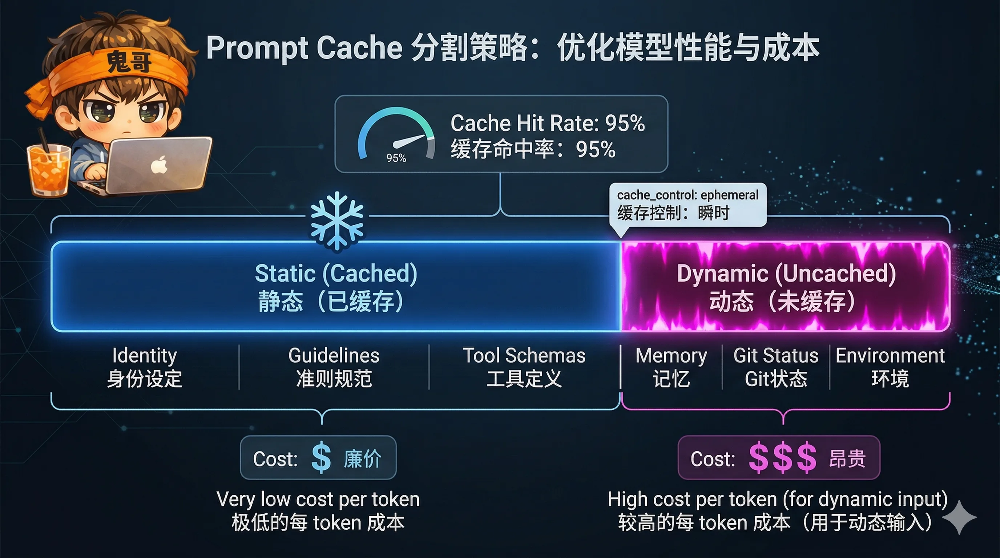

> 一个 AI Agent 的核心竞争力不在于它调用了多好的模型，而在于它的主循环有多健壮。Claude Code 的心脏是 `query.ts` 中一个 1,700 行的 `while(true)` 循环——本篇逐阶段拆解它。

> 本文为「解剖 Claude Code」系列第三篇。前篇：[解剖 Claude Code（二）：ReAct 循环](/p/cc-anatomy-02/)

---

## 问题

一个典型的 Claude Code 会话可能持续几十轮。每一轮都要把完整的系统提示、对话历史、工具定义发给 API。如果不做优化：

- **系统提示**：~10K Token，每轮都重复发送
- **工具定义**：50 个工具的 Schema，~15K Token
- **对话历史**：逐轮增长，最终撑爆上下文窗口（200K Token）

不做缓存 = 每轮重复支付这些 Token 的输入费用。不做压缩 = 对话最终无法继续。

Claude Code 的解法是两套机制联合工作：

1. **Prompt 缓存分割**：把不变的部分标记为全局可缓存，只为变化的部分付费
2. **四级上下文压缩**：当对话增长时，逐级压缩保留核心信息

---

## 在整体架构中的位置

```
ReAct 循环的每一轮：
  Phase 1: 上下文准备 ← 四级压缩在这里运行
  Phase 2: 模型调用   ← 缓存分割在这里生效
```

---

## Part 1：Prompt 缓存分割

### 核心思想：静态 vs 动态

Claude Code 将系统提示在物理上分为两部分，用一个边界标记隔开：

```
┌─────────────────────────────────────────────────┐
│  STATIC（全局缓存，scope: 'global'）              │
│                                                  │
│  · 身份声明（"You are an interactive agent..."）  │
│  · 系统指南（工具使用、权限、压缩规则）            │
│  · 任务执行指南                                   │
│  · 操作安全指南（可逆性、爆炸半径）                │
│  · 工具使用规范（Bash vs 专用工具）                │
│  · 语气风格（无 emoji、简洁）                      │
│  · 输出效率指南                                   │
│                                                  │
├──── SYSTEM_PROMPT_DYNAMIC_BOUNDARY ──────────────┤
│                                                  │
│  DYNAMIC（不缓存，每轮重新计算）                   │
│                                                  │
│  · 会话引导（Agent 类型相关指令）                  │
│  · 记忆内容（loadMemoryPrompt()）                 │
│  · 环境信息（模型 ID、平台、Shell、OS）            │
│  · MCP 服务器指令（服务器随时连接/断开）           │
│  · Scratchpad 目录                                │
│  · 语言偏好                                       │
│  · 输出风格                                       │
│                                                  │
└─────────────────────────────────────────────────┘
```



**边界标记**是一个常量字符串：

```typescript
export const SYSTEM_PROMPT_DYNAMIC_BOUNDARY = '__SYSTEM_PROMPT_DYNAMIC_BOUNDARY__'
```

### 三种缓存范围

系统提示被分割成最多 4 个 `TextBlockParam`，每个有不同的 `cache_control`：

| 块 | 内容 | cache_control.scope | 含义 |
|----|------|-------------------|------|
| 1 | 归属头（Attribution） | `null` | 不缓存，每请求元数据 |
| 2 | CLI 前缀 | `null` | 不缓存 |
| 3 | 静态内容（边界前） | `'global'` | **跨组织缓存**，所有用户共享 |
| 4 | 动态内容（边界后） | `null` | 不缓存，用户/会话特定 |

**为什么分 `global` 和 `org`？**

- `global` 缓存：所有 Anthropic 1P 用户共享。当你发送和另一个用户完全相同的静态系统提示时，直接命中缓存——零写入成本
- `org` 缓存：组织内共享（Bedrock/Vertex 3P 用户的默认）
- 无 scope（`ephemeral`）：仅当前请求链，5 分钟 TTL

**cache_control 的返回结构**：

```typescript
{
  type: 'ephemeral',
  ttl?: '1h',        // 符合条件时升级到 1 小时
  scope?: 'global',  // 1P 用户的静态内容
}
```

### TTL 升级：从 5 分钟到 1 小时

默认 TTL 是 5 分钟（ephemeral）。对于付费订阅用户，可以升级到 **1 小时**：

**升级条件**（三项都要满足）：
1. 内部用户 或 Claude AI 订阅者（非超额使用）
2. 查询来源在 GrowthBook 白名单内（`repl_main_thread*`, `agent:*` 等）
3. Bedrock 3P 用户需显式 opt-in

**为什么 TTL 决策要"锁存"（latch）？** 如果用户在会话中途切换了订阅状态（如用量超额），TTL 可能从 1h 变回 5m，导致 ~20K Token 的缓存前缀失效。锁存确保 TTL 在整个会话中保持稳定。

### Section 缓存机制

动态部分内部也有缓存优化。每个 prompt section 分为两类：

```typescript
// 缓存 section：会话级别复用，/clear 或 /compact 时失效
systemPromptSection('env_info', async () => {
  return `Model: ${modelId}, Platform: ${platform}...`
})

// 非缓存 section（危险！每轮重算）
DANGEROUS_uncachedSystemPromptSection('mcp_instructions', async () => {
  return buildMcpInstructions(mcpClients)
}, 'MCP servers connect/disconnect mid-session')
```

**为什么 MCP 指令不能缓存？** 因为 MCP 服务器可能在会话中途连接或断开。如果缓存了旧的服务器列表，模型会尝试调用不存在的工具。

`DANGEROUS_` 前缀是刻意的命名——它强制开发者思考"为什么这个 section 不能缓存"，并通过第二个参数写下原因。

### 工具 Schema 的缓存稳定性

第 02 篇提到，工具注册表按名称排序以保护 Prompt Cache。这里看看具体怎么做的：

- 工具 Schema 通过 `getToolSchemaCache()` 会话级缓存
- 缓存 key 是 `${tool.name}:${jsonStringify(schema)}`
- 每次请求只叠加 `defer_loading`、`cache_control`、`eager_input_streaming` 等运行时属性
- 如果工具列表稳定（名称和 Schema 不变），缓存前缀不受影响

**缓存断裂检测**：系统还有一个 `promptCacheBreakDetection.ts` 模块，监控 `cache_read_input_tokens` 的变化。如果缓存读取 Token 骤降 > 2,000 且 < 上次的 95%，说明缓存被打破了——系统会记录事件用于诊断。

---

## Part 2：四级上下文压缩

当对话持续增长，四级压缩体系逐级介入：


### 触发阈值

```
上下文窗口 = 200,000 Token（默认）
摘要预留 = 20,000 Token（给压缩模型留空间）
有效窗口 = 200,000 - 20,000 = 180,000 Token
自动压缩阈值 = 180,000 - 13,000 = 167,000 Token
```

| 阈值 | 值 | 含义 |
|------|-----|------|
| `AUTOCOMPACT_BUFFER_TOKENS` | 13,000 | 自动压缩的缓冲区 |
| `WARNING_THRESHOLD_BUFFER_TOKENS` | 20,000 | UI 警告阈值 |
| `ERROR_THRESHOLD_BUFFER_TOKENS` | 20,000 | UI 错误阈值 |
| `MANUAL_COMPACT_BUFFER_TOKENS` | 3,000 | 手动压缩的阻塞阈值 |
| `MAX_CONSECUTIVE_AUTOCOMPACT_FAILURES` | 3 | 熔断器上限 |

### 第一级：Snip（轻量裁剪）

**特性门控**：`HISTORY_SNIP`

最轻量的压缩——直接移除旧消息。不做摘要，不做总结，就是删除。

- 保留最近的消息不动
- 释放的 Token 数（`snipTokensFreed`）传给后续阶段，影响 Autocompact 的触发判断
- 如果 Snip 已经释放了足够空间，Autocompact 就不需要触发

**为什么最先运行？** 因为它最快（零 API 调用），且对缓存无影响。

### 第二级：Microcompact（缓存感知压缩）

**核心创新**：在不打破 Prompt Cache 的前提下压缩工具结果。

**可压缩的工具**：FileRead、FileWrite、FileEdit、Bash、Grep、Glob、WebSearch、WebFetch

**两种模式**：

**时间触发压缩**：如果距离上次 API 调用超过缓存 TTL，服务器缓存已过期。此时全量重写前缀不会有额外成本——因此可以直接清理旧工具结果。

**缓存编辑压缩**（Cache Editing，仅内部用户）：利用 API 的 `cache_edits` 功能，在不失效缓存的情况下删除工具结果：

```typescript
// 不是替换缓存内容，而是发送编辑指令
{
  type: 'cache_edits',
  edits: [{
    type: 'delete',
    cache_reference: 'tool_use_abc123'  // 要删除的工具结果 ID
  }]
}
```

这意味着：缓存前缀完全保持不变，只通过 `cache_reference` 标记哪些工具结果已经不需要了。API 服务器会在应用缓存时跳过被删除的部分。

**为什么这很重要？** 传统做法是修改消息内容来"清空"工具结果——但这会改变消息的 hash，导致整个缓存失效。Cache Editing 绕过了这个问题。

### 第三级：Autocompact（AI 全量摘要）

当 Token 超过阈值（默认 ~167K），触发 AI 全量摘要。

**触发条件**：
```typescript
tokenCount > getAutoCompactThreshold(model)
// 其中 threshold = effectiveWindow - AUTOCOMPACT_BUFFER_TOKENS
// = (contextWindow - 20K) - 13K
```

**排除场景**：
- 当前查询本身就是压缩查询（防止递归）
- Session memory 查询
- Context agent（`marble_origami`）查询

**摘要模板**（9 个分区）：

```xml
<analysis>
[模型的思考过程——最终会被剥离]
</analysis>

<summary>
1. Primary Request and Intent — 用户的所有显式请求
2. Key Technical Concepts — 讨论过的技术和框架
3. Files and Code Sections — 查看/修改的文件（含代码片段）
4. Errors and Fixes — 遇到的错误及修复方式
5. Problem Solving — 已解决和进行中的问题
6. All User Messages — 所有非工具结果的用户消息
7. Pending Tasks — 明确的待办任务
8. Current Work — 压缩前正在做什么
9. Optional Next Step — 下一步建议（仅当与最近请求一致时）
</summary>
```

**强制文本输出**：摘要 Prompt 开头有一段"反工具声明"：

```
CRITICAL: Respond with TEXT ONLY. Do NOT call any tools.
Tool calls will be REJECTED and will waste your only turn — you will fail the task.
```

末尾还有 REMINDER 重复一次——双重保险。因为压缩调用本身也消耗 Token 和时间，如果模型在这里"开小差"调工具，代价极高。

**摘要后的智能恢复**：

压缩完成后，系统不是简单地用摘要替换历史。它会**恢复最重要的信息**：

| 恢复项 | 上限 |
|--------|------|
| 最近读取的文件 | 最多 5 个文件 |
| 文件恢复总预算 | 50,000 Token |
| 单文件预算 | 5,000 Token |
| Skill 恢复预算 | 25,000 Token |
| 单 Skill 预算 | 5,000 Token |

**熔断器**：如果 Autocompact 连续失败 3 次（`MAX_CONSECUTIVE_AUTOCOMPACT_FAILURES`），停止尝试。防止"压缩失败 → 重试 → 又失败"的无限循环。

### 第四级：Reactive Compact（紧急 413 压缩）

当 API 返回 413 Prompt Too Long 错误后触发——这是最后手段。

**与 Autocompact 的区别**：

| | Autocompact | Reactive Compact |
|---|---|---|
| 触发时机 | API 调用前（预防性） | API 返回 413 后（响应性） |
| 触发条件 | Token > 阈值 | API 报错 |
| 可用次数 | 多次 | 每轮一次（`hasAttemptedReactiveCompact`） |
| 图片处理 | 不处理 | 可剥离图片/PDF |
| Token 差距计算 | 不需要 | 从 413 错误信息解析 |

**Token 差距计算**：

```typescript
getPromptTooLongTokenGap(errorMessage)
// 从 "prompt is too long: 137500 tokens > 135000 maximum"
// 提取出 gap = 137500 - 135000 = 2500
```

利用这个 gap，系统可以精确计算需要删除多少消息组，而不是盲目地一组一组删除。如果 gap 无法解析（Bedrock/Vertex 的错误格式不同），回退到"删除 20% 的消息组"策略。

**图片/PDF 剥离**：对于 Media Size Error，直接将图片块替换为 `[image]`、文档块替换为 `[document]` 文本标记。这不是压缩——是放弃媒体内容以换取请求可以通过。

---

## Token 成本的数学

来算一笔账。以 Sonnet 4.6 为例：

| Token 类型 | 价格（$/百万） | 相对比 |
|-----------|-------------|--------|
| 输入 | $3.00 | 基准 |
| 输出 | $15.00 | 5× |
| 缓存写入 | $3.75 | 1.25× |
| 缓存读取 | $0.30 | **0.1×** |
| Web 搜索 | $0.01/次 | — |

**缓存回本点**：写入成本 $3.75 / 读取成本 $0.30 ≈ **12.5 次读取回本**。

对于一个持续 30 轮的会话，系统提示（~10K Token）的成本对比：

```
无缓存：30 轮 × 10K Token × $3/Mtok = $0.90
有缓存：1 次写入 $0.0375 + 29 次读取 × $0.003 = $0.12

节省：$0.90 - $0.12 = $0.78（节省 87%）
```

如果是全局缓存命中（`scope: 'global'`），连写入费用都省了——第一个用户写入后，所有用户都只付读取费用。

### 输出 Token 的优化：8K 默认 + 按需升级

第 02 篇提到的 Token 上限升级机制，也是一个成本优化：

```
默认 max_tokens = 8,000 (CAPPED_DEFAULT_MAX_TOKENS)
按需升级到 = 64,000 (ESCALATED_MAX_TOKENS)
```

**为什么默认只给 8K？** 数据显示 p99 的输出 Token 才 4,911——绝大多数请求在 8K 以内就能完成。默认 64K 意味着 API 需要为每个请求预留 8 倍的计算资源，但 99% 的时候这些资源是浪费的。

8K 默认 + 按需升级 = 资源利用率大幅提升，< 1% 的请求需要重试。

---

## 6 级 Prompt 优先级

系统提示不是一个简单的字符串——它有 6 级优先级，决定最终发给 API 的内容：

```
优先级 0: Override（覆盖一切）
优先级 1: Coordinator 模式
优先级 2: Agent 系统提示
优先级 3: 自定义提示（--system-prompt）
优先级 4: 默认提示
优先级 5: Appendive（总是追加）
```

**关键设计**：Agent 在 Proactive 模式下是**追加**到默认提示（不是替换）。因为 Proactive 模式的默认提示已经很精简（自主 Agent 身份 + 记忆 + 环境），Agent 在此基础上添加领域指令，就像队友在共享基础上各自添加专长。

而在非 Proactive 模式下，Agent 是**替换**默认提示——因为默认提示太长，全部保留会浪费缓存前缀空间。

**Appendive** 级别的提示总是追加（除非 Override 激活）——用于注入临时上下文，如用户的 `--append-system-prompt` 参数。

---

## 可借鉴的模式

### 1. 静态/动态分割是缓存优化的第一步

任何 LLM 应用都可以做这个优化：把系统提示中不会变化的部分放前面，标记为可缓存。改动频繁的部分（用户上下文、环境信息）放后面，不缓存。

**关键洞察**：顺序很重要。Prompt Cache 是前缀匹配——只要前缀相同就命中。动态内容放后面意味着它的变化不影响前缀的缓存命中。

### 2. 分级压缩优于一刀切

不要在上下文快满时直接"砍掉一半历史"。分级压缩的好处是：
- 轻量操作（Snip）先跑，可能就够了
- 避免不必要的 API 调用（AI 摘要很贵）
- 每一级都保留尽可能多的信息

### 3. 缓存编辑是一个值得关注的 API 特性

Cache Editing（通过 `cache_reference` + `cache_edits` 修改缓存内容而不失效）是一个强大的优化手段。虽然目前只有 Anthropic API 支持，但它展示了一个方向：**缓存不需要是全有全无的**——可以细粒度地增删。

---

## 下一篇预告

缓存分割和压缩保证了"对话能继续"。但 Agent 的能力边界取决于**工具**——50 个工具如何做到自包含又统一？`Tool<Input, Output, Progress>` 类型契约是怎么设计的？`buildTool()` 的 fail-closed 默认值意味着什么？下一篇，我们拆解 Tool System。

---

| 篇 | 标题 | 状态 |
|----|------|------|
| [01](/p/cc-anatomy-01/) | 512K 行代码，一个终端里的 Agent Runtime | ✅ |
| [02](/p/cc-anatomy-02/) | ReAct 循环：`while(true)` 里的五个阶段与七层恢复 | ✅ |
| **03** | **Prompt 缓存分割与四级上下文压缩**（本篇） | ✅ |
| 04 | 50 个工具的统一契约：Tool System 设计 | 🔄 下一篇 |
| 05 | 五层记忆体系：从短期到持久化 | ⬚ |
| 06 | 纵深防御：23 项安全检查与"不信任任何输入" | ⬚ |
| 07 | 投机执行与自研状态管理：隐藏延迟的两个利器 | ⬚ |
| 08 | 多 Agent 编排：三种执行模型与 Coordinator 模式 | ⬚ |
| 09 | 在终端里造一个浏览器：自定义 Ink 渲染引擎 | ⬚ |
| 10 | Bridge 与协议层：让 VS Code、Web、Mobile 共享一个 Claude | ⬚ |
| 11 | Skill、Plugin、Hook：三层扩展的设计谱系 | ⬚ |
| 12 | 回顾：从 Claude Code 中提炼的 10 个 Agent 工程模式 | ⬚ |
