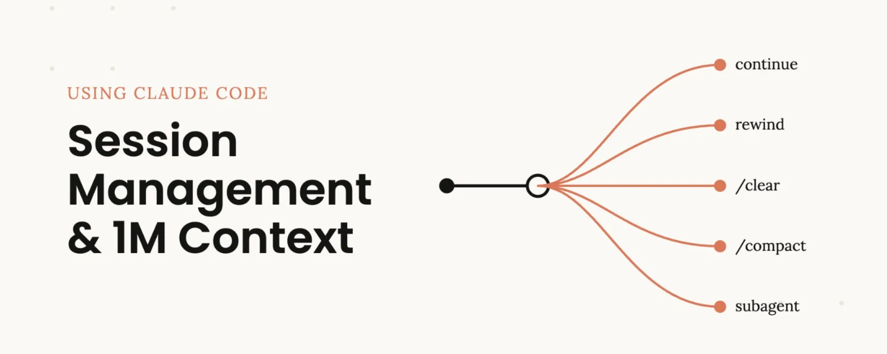
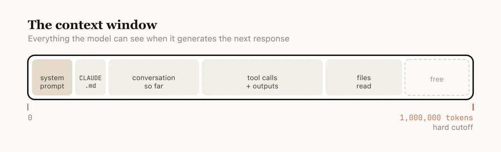
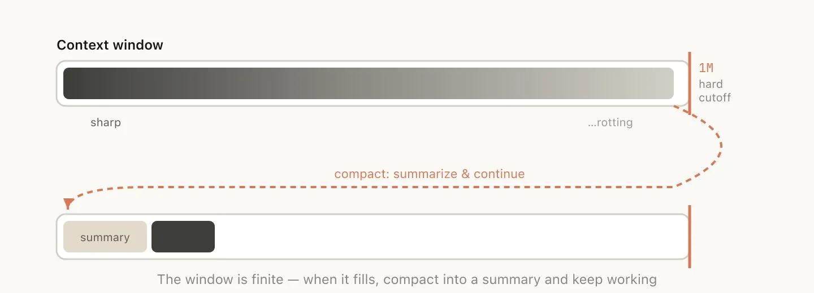
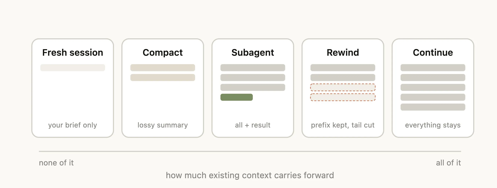
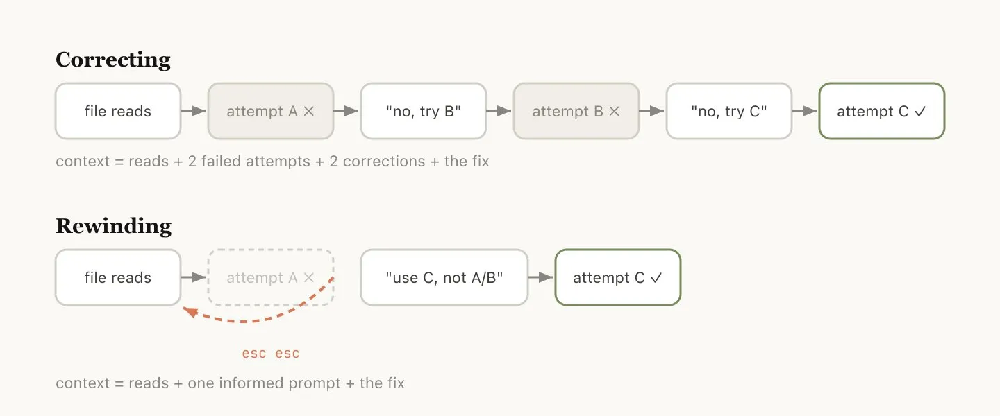
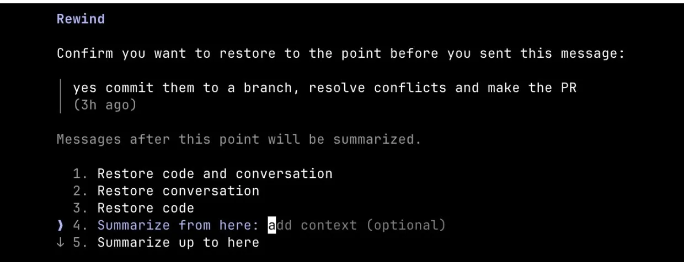
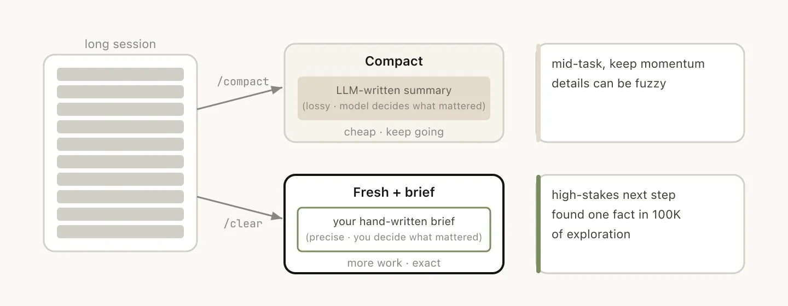
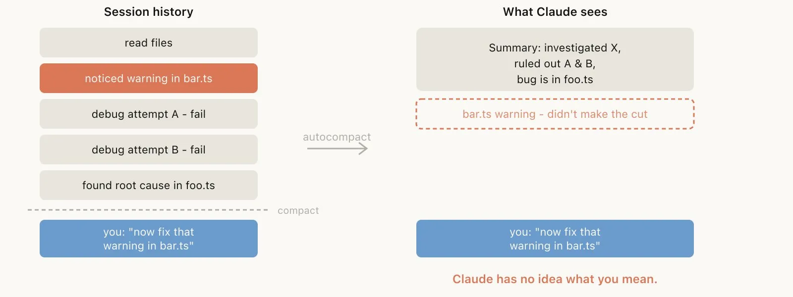
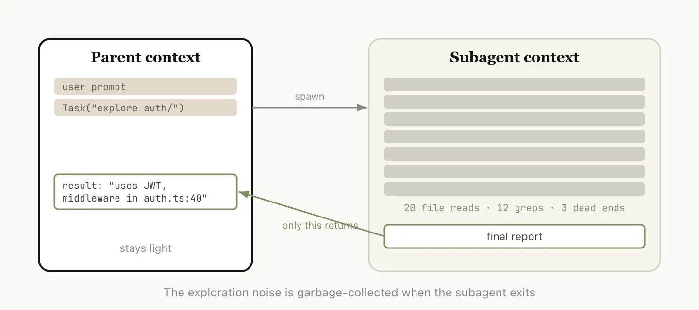
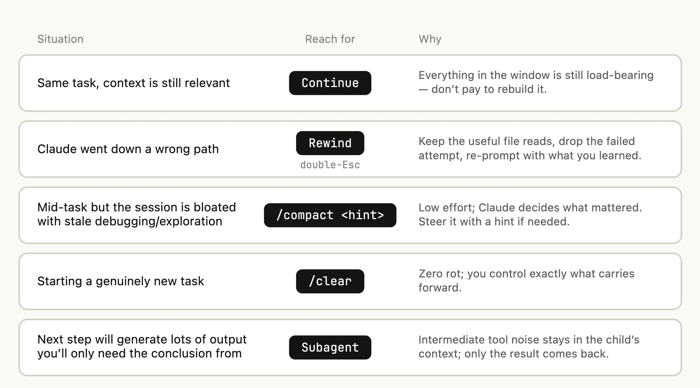

你用 Claude Code 的时候，是不是就一个终端窗口，一路发消息到底？

我之前也是这样。直到最近读到 Anthropic 的 Thariq 写的一篇关于 Session Management 的帖子，才意识到自己一直在用最笨的方式——**把 100 万 token 的上下文窗口当成一个无限垃圾桶。**

Thariq 说他最近跟很多 Claude Code 重度用户聊过，发现一个反复出现的主题：**1M token 的上下文窗口是把双刃剑。** 它让 Claude Code 能自主运行更久、处理更复杂的任务，但同时也打开了 context pollution（上下文污染）的大门——如果你不刻意管理 Session，模型的表现反而会越来越差。

Session 管理变得比以往更重要。要不要开两个终端？每次发 prompt 都新开一个 Session？什么时候该用 compact、rewind、还是 subagent？

这篇文章把这些问题讲清楚了。

---

## Context、Compaction 和 Context Rot

先把基础概念对齐。

**Context Window（上下文窗口）** 是模型在生成下一条回复时能「看到」的全部内容——包括系统提示词、整段对话历史、每次工具调用的输入和输出、以及读过的每一个文件。Claude Code 的上下文窗口是 **100 万 token**。

但使用上下文是有代价的，这个代价叫 **Context Rot（上下文衰退）**。

Context Rot 指的是：随着上下文越来越长，模型性能会下降。因为注意力机制会被分散到更多的 token 上，老旧的、不相关的内容开始干扰当前任务。Anthropic 观察到的规律是，**大约在 300-400k token 的时候，Context Rot 开始出现**——但这高度依赖任务本身，不是一条硬规则。

上下文窗口是一个硬性截断。当你快用完的时候，需要把当前的工作总结成更精简的描述，在新的上下文窗口中继续——这个操作叫 **Compaction（压缩）**。你也可以手动触发它。

---

## 每一轮对话结束后，都是一个分叉点

假设你刚让 Claude 做完了一件事，上下文里现在有了一些东西（工具调用、输出结果、你的指令），接下来你有 **5 个选项**——但大多数人只用了第一个：

- **Continue** —— 继续在同一个 Session 中发消息
- **`/rewind`**（双击 Esc）—— 跳回到之前某条消息，从那里重新开始
- **`/clear`** —— 新开一个 Session，通常带着你从上一轮蒸馏出来的 brief
- **`/compact`** —— 压缩当前 Session 的历史，在摘要的基础上继续
- **Subagent** —— 把接下来的工作委托给一个拥有独立干净上下文的子代理，只拿结果回来

最自然的反应当然是继续发消息。但另外四个选项的存在，就是为了帮你管理上下文。

---

## 什么时候该开新 Session？

1M 的上下文意味着你现在可以更可靠地完成更长的任务——比如让 Claude 从零搭建一个全栈应用。但 **上下文没用完，不代表你不该开新 Session。**

Anthropic 的经验法则：**当你开始一个新任务时，也应该开始一个新 Session。**

灰色地带在于：你可能想做一些相关的任务，上下文中的一部分内容仍然有用，但不是全部。

比如，你刚实现了一个功能，接下来要写它的文档。虽然可以新开 Session，但 Claude 得重新读一遍你刚实现的那些文件，更慢也更贵。写文档不是一个对「智能强度」要求特别高的任务，多余的上下文带来的效率增益可能值得保留。

**我自己的判断方式**：下一个任务要是做错了会不会很麻烦？如果答案是"会"（比如重构核心逻辑），果断新开。如果答案是"还好"（比如写文档、加注释），继续旧 Session 省事。

---

## 最值得养成的习惯：用 Rewind 代替纠正

如果只能推荐一个习惯，Thariq 说他会选 **rewind**。

在 Claude Code 里，双击 Esc（或者运行 `/rewind`）可以跳回到之前任意一条消息，从那个点重新给 prompt。那条消息之后的所有内容会被从上下文中丢弃。

**Rewind 往往比纠正更好。** 举个例子：Claude 读了 5 个文件，尝试了一个方案，没成功。你的本能反应可能是说"那个不行，试试 X 方案吧"。但更好的做法是：**rewind 到刚读完文件的那个点，然后带着你学到的信息重新给指令。**

"别用方案 A，foo 模块没有暴露那个接口——直接走方案 B。"

你还可以用"summarize from here"让 Claude 总结它的发现，生成一份交接消息——有点像未来的 Claude 给过去的自己写了一封信：这条路走不通，原因是什么。

这件事我自己踩过很多坑。之前遇到 Claude 写的代码不对，我都是直接在下面追"不对，换个方式"、"还是不行，试试另一个"——结果上下文里全是失败的尝试，越到后面 Claude 表现越差。后来开始用 rewind，明显感觉"一次做对"的概率高了很多。

---

## Compact vs 新开 Session

一旦 Session 变长，你有两种减重方式：`/compact` 或者 `/clear`（新开）。它们感觉很像，但行为完全不同。

**`/compact`**：让模型总结对话历史，用摘要替换完整记录。这是有损的——你在信任 Claude 来决定什么是重要的。好处是你不需要自己写任何东西，而且 Claude 可能在包含重要细节和文件方面比你更全面。你也可以引导它：`/compact 聚焦 auth 重构部分，丢掉测试调试内容`。

**`/clear`**：你自己写下重要的内容——"我们正在重构 auth 中间件，约束是 X，关键文件是 A 和 B，已经排除了方案 Y"——然后清空重开。工作量更大，但最终的上下文完全是你认为相关的内容。

简单说：**`/compact` 是让 Claude 帮你做摘要，`/clear` 是你自己做摘要。** 前者省事但有损，后者费力但精确。

---

## 什么导致了一次「坏 Compact」？

如果你经常跑长 Session，可能遇到过 compact 之后 Claude 突然变蠢的情况。

Anthropic 发现，**坏 compact 通常发生在模型无法预测你接下来要做什么的时候。**

举个例子：autocompact 在一段漫长的 debugging session 之后触发，它把调查过程总结了一遍。然后你的下一条消息是"现在去修 bar.ts 里那个 warning。"

但因为 Session 的主题一直是 debugging，那个 warning 可能已经被当作不重要的内容从摘要中丢掉了。

更麻烦的是：**由于 Context Rot，模型在触发 compaction 的那个时刻恰恰处于最不聪明的状态。** 它用最差的自己去总结整段历史，结果可想而知。

**解法**：利用 1M 上下文给你的时间余量，**在 Context Rot 出现之前主动执行 `/compact`**，并且告诉它你接下来打算做什么，作为总结的方向引导。

---

## Subagent：独立上下文的子任务

Subagent 本质上是一种上下文管理手段。当你提前知道一块工作会产生大量中间输出、但你不再需要那些中间内容时，它特别有用。

当 Claude 通过 Agent 工具生成一个 subagent，这个 subagent 会获得**自己独立的全新上下文窗口**。它可以做任意多的工作，然后合成结果，只把最终报告返回给父 agent。

**Anthropic 的心理测试**：我还会需要这些工具输出吗？还是只需要结论？

虽然 Claude Code 会自动调用 subagent，但你也可以显式指定：

- "启动一个 subagent，根据这个 spec 文件验证我刚才的实现是否正确"
- "启动一个 subagent，读完另一个代码库，总结它的 auth 流程是怎么实现的，然后你自己按同样方式来"
- "启动一个 subagent，根据 git 变更记录给这个功能写文档"

这个功能我现在用得越来越多。特别是让 subagent 去读别的项目的源码然后回来总结，效果非常好——因为读源码的过程会产生海量 token，留在主上下文里是纯粹的浪费。

---

## 最后

Session 管理这件事，说到底就一句话：**每次 Claude 结束一轮工作、你准备发下一条消息的时候，那是一个决策点。**

不要无脑继续。停下来想一想：上下文还干净吗？方向对吗？接下来的任务真的需要之前的全部内容吗？

Anthropic 说他们预计未来 Claude 会学会自己处理这些。但就现阶段而言，主动管理 Session 是你能做的、对 Claude Code 使用体验影响最大的一件事。

---

## 参考资料

- 原推文：[Thariq (@trq212) on X](https://x.com/trq212/status/2044548257058328723)
- [Claude 官方博客原文](https://www.anthropic.com/engineering/claude-code-best-practices)
