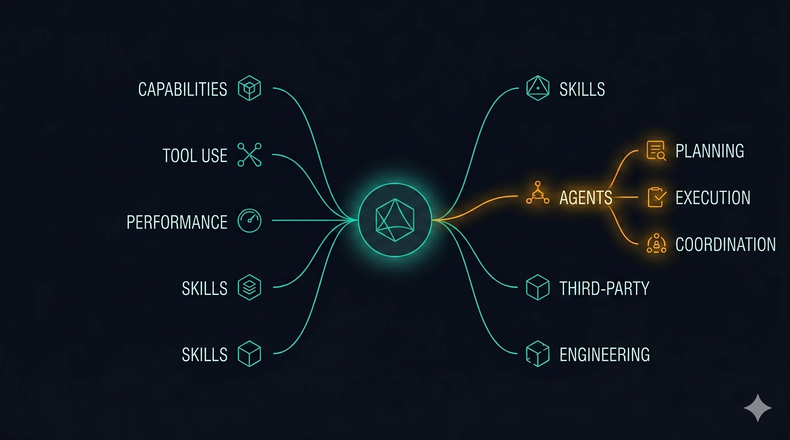
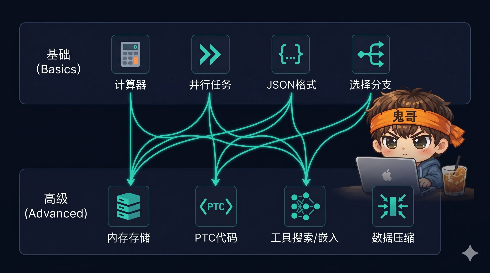
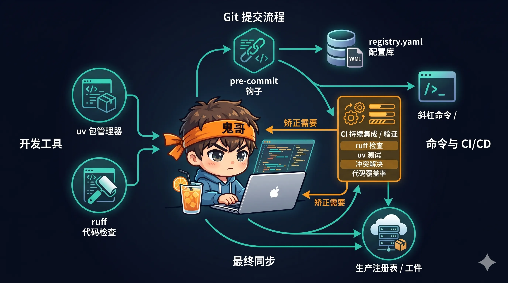
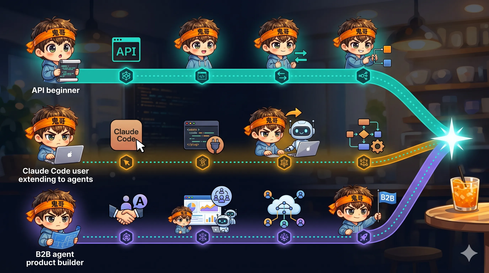

最近 AI 的发展真的是日行千里。

每天打开手机开源社区、翻公众号、过一遍 GitHub Trending——新模型、新工具、新系统、新应用，再加上无数业内高人分享的实践经验，内容浩如烟海，**百家争鸣，百家齐放**。

说实话，我自己看着都眼花缭乱。有时候晚上躺下想到"今天又没来得及看那几篇论文、那几个新项目"，连睡觉都觉得是在浪费学习时间。

这种状态持续久了，人是会焦虑的。鬼哥每天拼命学习, 拼命实践, 都快忘了自己还是个吉他手, 也得花时间练琴了.

但前阵子我沉下心来，花了一段时间认真翻了一遍 Anthropic 官方的这份 [claude-cookbooks](https://github.com/anthropics/claude-cookbooks)——翻完之后我反倒松了一口气。

这份仓库里的内容，**积累了 Anthropic 工程师过去三年对 AI 工程化的思考**。覆盖面非常全：从 API 最基础的用法，到 Prompt Caching 的成本优化，到 Tool Use 的各种进阶模式，再到 Agent SDK、Managed Agents、Skills 这些最近才成型的产品形态——几乎把"怎么用好 Claude 做一个能上生产的 AI 应用"这件事，从头到尾挨个讲了一遍。

宝藏是真的多，内容也真的多。想用一两篇文章讲清楚根本不现实。

所以我决定先写这一篇——**给这份指南做一个大致的梳理，整理出一份索引地图。** 后面每个具体话题，再单独开长文展开。

也建议你把这份 cookbook 当作一份**可以反复查、反复学的学习地图**：不需要一次读完，但值得在接下来几个月里反复回来翻。

---

你打开 [anthropics/claude-cookbooks](https://github.com/anthropics/claude-cookbooks) 的 README，看到的大概是十几条链接——分类、RAG、摘要、几个 tool use 示例、一篇 prompt caching。

如果你只看 README，会以为这就是一份写了两年没人管的老项目。

但你往目录里翻一下就会发现——**这份仓库里塞着接近一百篇 notebook，README 里能看到的，大概只占三分之一。**

被 README 藏起来的另一半，恰恰是这两年 Anthropic 官方重点推进的东西：Claude Agent SDK 教程、Managed Agents 的 CMA 系列、Skills 技能包、Tool Use 的进阶玩法、Extended Thinking 和 Tool Search 的新模式……这些内容散落在 `claude_agent_sdk/`、`managed_agents/`、`skills/`、`patterns/agents/` 这些 README 完全没提的目录下。


这篇文章做的事很简单：**把这份 repo 按主题重新整理成一张可以反复查的索引地图。** 每个模块一句话定位、列出具体 notebook 文件名、说清楚什么时候该看它——后面想逐篇深入的时候，翻这一页就知道从哪下手。

不做深度拆解，只做导航。真正的"为什么要这么设计"那种长文，留给后面每个主题单开一篇来写。

---

## 一、先把这份 repo 的定位搞清楚

在往下看之前，先明确一件事：**claude-cookbooks 不是文档的补充，而是可跑的工程示例库。**

Anthropic 官方的内容资源现在大致分成三层：

| 资源 | 角色 | 面向 |
|---|---|---|
| [docs.claude.com](https://docs.claude.com) | 权威文档 | 查 API 参数、模型特性 |
| [anthropics/courses](https://github.com/anthropics/courses) | 入门课程 | 第一次接触 API 的开发者 |
| [anthropics/claude-cookbooks](https://github.com/anthropics/claude-cookbooks) | 工程菜谱 | 已经会调 API、想把某个具体场景做好的人 |

Cookbook 是"可执行的最佳实践"：每个 notebook 就是一个最小可跑的场景，装完依赖、填上 API key 就能复现。它的价值不在于"教你 Claude 是什么"，而在于"别人做过这件事，代码给你抄走"。

换句话说，文档告诉你**某个 API 参数是什么意思**，cookbook 告诉你**在真实场景里这个参数应该怎么配、还要和哪几件事配合用**。这两者是互补的——文档适合查细节，cookbook 适合找套路。

这也解释了为什么它的更新节奏跟着 Anthropic 的产品线走——**每出一个新产品或新能力，这里就会多一个目录**。Claude Agent SDK 发布之后有了 `claude_agent_sdk/`，Managed Agents 发布之后有了 `managed_agents/`，Skills 功能上线之后有了 `skills/`。所以它也是观察 Anthropic 官方工程重点转向的一个风向标。

一个小提醒：README 里的链接还是旧的 `anthropic-cookbook` 仓库路径（目录名对，仓库名已改成 `claude-cookbooks`）。clone 的时候用新名字，跟着链接点进去会被 GitHub 自动重定向，不影响看内容，但会让你怀疑自己是不是 clone 错了库。

---

## 二、一张总览图：20 多个目录怎么归类

仓库里大大小小二十多个目录，我按"使用场景"把它们重新归了一下组：

| 大类 | 涉及目录 | 解决的问题 |
|---|---|---|
| **基础能力** | `capabilities/` `multimodal/` `extended_thinking/` | Claude API 开箱即用能做的事 |
| **Tool Use** | `tool_use/` | 让模型调用外部工具 |
| **性能与成本** | `misc/`（caching/batch 部分） `observability/` | Prompt caching、批处理、用量监控 |
| **Agent 三条路径** | `patterns/agents/` `claude_agent_sdk/` `managed_agents/` | 从模式→SDK→托管运行时的递进 |
| **Skills 技能包** | `skills/` | 打包专业能力给 Claude 调用 |
| **第三方集成** | `third_party/` | Pinecone / Voyage / Mongo / Wolfram 等八家 |
| **评估与微调** | `tool_evaluation/` `finetuning/` `misc/building_evals.ipynb` | Prompt eval、工具 eval、Bedrock 微调 |
| **工程实践（meta）** | 整个仓库的组织方式 | uv / ruff / registry / slash commands |



接下来按这个骨架一层层往里翻。

---

## 三、基础能力层：Claude API 开箱即用能做什么

### 3.1 `capabilities/` — 经典的 NLP 任务

这是整个 cookbook 里最"传统"的一块，也是大部分教程会从这里开始的原因——这些任务不依赖任何高级特性，一个 API key 就能跑：

- **`classification/`** — 文本分类。几个 prompt 模式对比，从 zero-shot 到 few-shot 到带 chain-of-thought 的长 prompt。
- **`summarization/`** — 摘要。包括长文分块摘要、多文档合并摘要、以及"按角色视角写摘要"这种进阶玩法。
- **`retrieval_augmented_generation/`** — RAG。从最基础的"向量检索 + 拼 prompt"到带 rerank、混合检索的几种设计。
- **`contextual-embeddings/`** — 这是比较新的一篇，讲 Anthropic 自己提出的"给每个 chunk 加一段上下文描述再 embed"的做法，在某些场景上能显著提升召回。
- **`text_to_sql/`** — 自然语言转 SQL，包括 schema 注入、错误恢复、结果校验。
- **`knowledge_graph/`** — 用 Claude 从文本抽取三元组、构建图谱。

如果你是刚开始用 Claude API 做项目，这块是"背景知识"——不是每篇都要精读，但至少扫一遍标题，知道什么场景能在这里找到参考实现。

`contextual-embeddings/` 这篇值得单独提一下。传统 RAG 的 embedding 过程是直接把 chunk 扔进 embedding 模型，但很多 chunk 脱离上下文后其实没法检索——比如一段"它在第三季度增长了 12%"，没有"哪家公司 / 哪个产品"的上下文，embedding 向量就很泛。Anthropic 的做法是先用 Claude 给每个 chunk 生成一段上下文描述（"这段来自 XXX 公司 2024 Q3 财报的营收章节"），再和原文拼在一起去 embed。实测在有些场景上能把召回率提升 35% 以上，代价是 embedding 阶段的 prompt caching 必须做好，不然成本会飙。

### 3.2 `multimodal/` — 视觉能力

Claude 的 vision 能力现在已经是基础配置，这个目录把"怎么用好它"讲了一圈：

- **`getting_started_with_vision.ipynb`** — 入门。base64 编码、URL 传图、多图一起传的几种姿势。
- **`best_practices_for_vision.ipynb`** — 最佳实践。图片放在 prompt 的哪个位置、多图之间怎么编号、什么时候该先 OCR 再喂文字。
- **`reading_charts_graphs_powerpoints.ipynb`** — 图表解读。财报柱状图、流程图、PPT 截图的实战。
- **`how_to_transcribe_text.ipynb`** — 表单/手写稿 OCR。
- **`crop_tool.ipynb`** — 让 Claude 自己决定"先裁图再看细节"的分步处理。
- **`using_sub_agents.ipynb`** — 用 Haiku 做前置视觉处理，Opus 做最终决策的 sub-agent 模式。

### 3.3 `extended_thinking/` — 让模型"想得更久"

Extended Thinking 是 Claude 4 系列引入的能力，让模型在给出答案前先做一段内部推理：

- **`extended_thinking.ipynb`** — 基础用法。怎么打开、thinking budget 怎么设、拿到的 thinking block 长什么样。
- **`extended_thinking_with_tool_use.ipynb`** — 和 tool use 结合。这个组合比较微妙——model 在 tool call 之间保留 thinking context 的方式跟普通对话不一样，这一篇讲清楚了边界。

---

## 四、Tool Use 专题：整个 cookbook 最密的一块

`tool_use/` 目录是更新最频繁、内容也最厚的一块。里面的 notebook 粗粗可以分成"基础用法"和"进阶玩法"两层：

**基础几篇，先过一遍：**

- `calculator_tool.ipynb` — 第一次接触 tool use 必看，一个最简单的计算器示例。
- `tool_choice.ipynb` — `auto` / `any` / `tool`（强制某个具体工具）三种模式的区别。
- `parallel_tools.ipynb` — 一次响应里并发调多个工具。
- `extracting_structured_json.ipynb` — 用 tool use 强制返回结构化 JSON，比裸 prompt 稳定得多。
- `tool_use_with_pydantic.ipynb` — 直接用 Pydantic 模型定义 tool schema。
- `customer_service_agent.ipynb` — 经典的客服机器人综合示例。

**进阶部分，每篇都是一个独立课题：**

- **`memory_cookbook.ipynb` + `memory_tool.py`** — Claude 的 memory tool，让模型能读写自己的记忆文件。
- **`programmatic_tool_calling_ptc.ipynb`** — PTC（Programmatic Tool Calling）。让 Claude 生成一段小代码来决定怎么调用一组工具，而不是一个个手动编排。
- **`automatic-context-compaction.ipynb`** — 自动上下文压缩。长对话里如何在触发上限前让模型自己"总结前面然后丢掉"。这一篇和我之前写过的 [Session 管理文章](https://luoli523.github.io/p/claude-code-session-management/) 其实是同一套思路的底层实现。
- **`tool_search_with_embeddings.ipynb` + `tool_search_alternate_approaches.ipynb`** — 工具太多塞不进 prompt 的时候怎么办。用 embedding 召回最相关的工具再喂给模型。
- **`vision_with_tools.ipynb`** — 把 vision 输入和 tool use 混在一起用的注意事项。
- **`threat_intel_enrichment_agent.ipynb`** — 威胁情报富化 Agent，一个比较完整的垂直场景实战。
- **`context_engineering/`** 子目录 — 专门讲上下文工程的一组 notebook，是相对独立的小专题。

这个目录是我个人会反复回来查的。基本上做任何一个需要"让模型调用外部能力"的项目，都能在这里找到至少一个相近的参考实现。

**特别想点名 PTC 和 Tool Search 这两篇。** PTC（Programmatic Tool Calling）解决的是"工具编排逻辑比工具本身还复杂"的场景——比如你有 10 个工具需要按特定顺序调用并做中间结果处理，与其让模型一轮一轮 tool call，不如让它一次性生成一段编排代码，由你在沙箱里执行。这种做法在复杂工作流里能把 round-trip 次数从十几轮压到两三轮，延迟和成本都是数量级的改善。

Tool Search 解决的是另一类问题：**工具数量多到塞不进 prompt**。一个大型 Agent 系统可能挂了几百个 MCP 工具，全部塞进去既超 token 又污染模型判断。用 embedding 预先对工具做语义索引，按用户 query 召回 top-K 工具再喂给模型，是目前比较成熟的解法。这一篇讲清楚了实现细节和几种 trade-off。



---

## 五、性能与成本优化

做 Demo 的时候钱和速度都不敏感，但一旦到线上，**成本和延迟立刻就会成为第一优先级问题。** 这块内容散落在几个目录里，我挑出来单独放一节：

- **`misc/prompt_caching.ipynb`** — Prompt caching 的基础用法。配合我之前那篇 [Prompt Caching 深度拆解](https://luoli523.github.io/p/llm-prompt-caching-explained/) 一起看效果最好：那篇讲"为什么要这么做"和底层 KV cache 原理，这篇告诉你"具体几行代码怎么写"。
- **`misc/speculative_prompt_caching.ipynb`** — 推测式缓存。不等用户发消息，提前把可能的下一轮 prompt 预热进缓存。在某些低延迟场景下能把首 token 延迟打下去很多。
- **`misc/batch_processing.ipynb`** — Message Batches API。离线批处理的价格是实时请求的 50%，跑评测、做回填数据时能省很多。
- **`misc/session_memory_compaction.ipynb`** — 会话记忆压缩。和 tool use 里的 automatic-context-compaction 是配套关系，一个讲工具侧，一个讲消息侧。
- **`observability/usage_cost_api.ipynb`** — Usage & Cost API。用来做团队用量看板、成本归因报表。
- **`misc/using_citations.ipynb`** — Citations 功能。让 Claude 在回答里标注"这句话来自文档的哪一段"，做 RAG 产品时非常有用。
- **`misc/sampling_past_max_tokens.ipynb`** — 当输出被 max_tokens 截断时怎么优雅续写。

这几篇单独看每一个都不长，但组合起来基本就是一个"线上项目优化清单"。上线前对着这张清单过一遍，能省下不少成本和踩坑时间。

有一个非常容易被忽略的组合用法：**prompt caching + batch processing**。Batch API 本身就打 5 折，再加上 caching 命中的部分又打 1 折左右，叠加下来做离线大规模推理时的成本可以比天真实现低 85% 以上。如果你在做评估、数据标注、回填历史数据这类离线任务，这个组合的经济性优势非常大，但大多数人做 MVP 时根本不会想到要用它。

---

## 六、Agent 的三条进阶路径

这是整个 cookbook 里我认为**最值得花时间的一块**，也是 README 最没讲清楚的一块。

Anthropic 把"怎么构建 Agent"拆成了三个层次递进的目录：

```
patterns/agents/      ← 模式层：概念和套路（轻量）
claude_agent_sdk/     ← SDK 层：用 Agent SDK 自己组装（中等）
managed_agents/       ← 托管层：用 Managed Agents 托管运行时（重型）
```

**从左到右是"自由度递减、工程量递减"的关系。** 哪一层适合你，取决于你要做的系统规模和运行需求。


### 6.1 模式层 `patterns/agents/` — 先把套路搞清楚

这个目录对应的是 Anthropic 那篇著名博客 [*Building Effective Agents*](https://www.anthropic.com/research/building-effective-agents) 里提的几种基础模式的**可运行版本**：

- **`basic_workflows.ipynb`** — Prompt chaining / Routing / Parallelization 三种基础工作流模式。
- **`evaluator_optimizer.ipynb`** — 评估者-优化者模式。一个 Agent 输出、另一个 Agent 打分并反馈，循环到满足条件为止。
- **`orchestrator_workers.ipynb`** — 编排者-工人模式。主 Agent 拆任务，子 Agent 并发执行。

这三篇是"概念打底"。哪怕你最后不用 Agent SDK，看一遍这三个模式，再去评估任何第三方 Agent 框架的设计，心里都会有一把尺子。

### 6.2 SDK 层 `claude_agent_sdk/` — 官方的 Agent 教程

这是 Anthropic 最近重点推进的一块，基于 [claude-agent-sdk-python](https://github.com/anthropics/claude-agent-sdk-python)，六篇 notebook 是一条渐进式的教学路径：

| # | 文件 | 学到什么 |
|---|---|---|
| 00 | `00_The_one_liner_research_agent.ipynb` | 一行 `query()` 起一个研究 Agent，理解异步迭代和基础概念 |
| 01 | `01_The_chief_of_staff_agent.ipynb` | CEO 助理 Agent——Memory、Output Styles、Plan Mode、Slash Commands、Hooks、子 Agent 编排全家桶 |
| 02 | `02_The_observability_agent.ipynb` | 可观测性 Agent，需要 GitHub Token + Docker |
| 03 | `03_The_site_reliability_agent.ipynb` | SRE Agent，处理告警和事故 |
| 04 | `04_migrating_from_openai_agents_sdk.ipynb` | 从 OpenAI Agents SDK 迁移过来的映射指南——**有存量代码的团队重点看这篇** |
| 05 | `05_Building_a_session_browser.ipynb` | Session 浏览器 demo，可视化 Agent 会话 |

这一条路径的隐含逻辑是："你如果已经在用 Claude Code，那 Claude Code 背后的 Agent 内核就是 Agent SDK，你可以用同样的工具链做任何 Agent 应用，而不只是软件开发"。

01 这篇 Chief of Staff 我单独推荐——它是整个教程里**最接近"生产级 Agent 到底长什么样"的那篇**。里面把持久化记忆（CLAUDE.md 机制）、输出风格切换（给 CEO 发邮件 vs 给团队发内部备忘是两种语气）、Plan Mode（复杂任务先产出方案再执行）、Slash Commands（把高频操作做成可复用快捷方式）、Hooks（每次工具调用都自动写审计日志）、Subagent 编排（法务/财务/战略三个专项 Agent 分工协作）这一整套都串起来了。看完之后你会意识到，**"Agent" 这个概念背后其实是一组工程约束的组合**，单独拎出任何一个都不够，组合起来才是真正可以上生产的东西。

### 6.3 托管层 `managed_agents/` — Claude Managed Agents (CMA)

Managed Agents 是 Anthropic 相对较新的一个产品形态：**服务端托管的 Agent 运行时**，带沙箱、会话持久化、文件状态保留，你只要定义 Agent 和环境，剩下的交给托管服务。

这个目录分成两组：

**三个应用型示例**（适合先看，建立直觉）：

- `data_analyst_agent.ipynb` — CSV 进、HTML 分析报告出的数据分析 Agent。
- `slack_data_bot.ipynb` — 把上面那个分析 Agent 包成 Slack Bot。
- `sre_incident_responder.ipynb` — 告警→调查→PR→人审→合并的完整 SRE 流程。

**六个教程型 notebook**（以 `CMA_` 开头，建议按顺序读）：

| Notebook | 主题 |
|---|---|
| `CMA_iterate_fix_failing_tests.ipynb` | 入门。引入 agent / environment / session、文件挂载、流式事件循环 |
| `CMA_orchestrate_issue_to_pr.ipynb` | issue → 修复 → PR → CI → 人审 → 合并的完整编排 |
| `CMA_explore_unfamiliar_codebase.ipynb` | 在陌生代码库里探索，含"过期文档陷阱"演示 |
| `CMA_gate_human_in_the_loop.ipynb` | 人类审批关卡，用自定义工具的 `decide()` / `escalate()` 模式 |
| `CMA_prompt_versioning_and_rollback.ipynb` | **提示词版本化与回滚**——生产 Agent 的脆弱环节，中文圈讲得很少 |
| `CMA_operate_in_production.ipynb` | 生产部署：MCP 工具集、vault 存 per-user 凭证、webhook idle 模式 |

这一组是目前 cookbook 里**最贴近"企业级 Agent 运营"的内容**。如果你在做 B 端 Agent 产品，哪怕不用 Managed Agents，也强烈建议看一遍 prompt versioning 和 operate in production 这两篇——它们把"Agent 上线之后你还要做哪些事"讲得最清楚。

稍微展开一下 `CMA_prompt_versioning_and_rollback.ipynb` 为什么特别值得看：传统软件工程里代码改动有 Git、有 CI、有灰度发布，但 **prompt 的改动目前很多团队还靠 Excel 或 Notion 维护**。Prompt 不是代码但比代码更脆弱——同一个字改一下，模型行为可能完全变样。这篇 notebook 给出的答案是把 prompt 也纳入版本化体系：服务端存版本、每个 session 可以绑定到特定版本、用标注过的测试集做版本对比、发现回归可以按 session ID 批量回滚。这套工作流不依赖 Managed Agents 本身也能借鉴——核心思路是**把 prompt 当成一等公民的配置来治理**。

---

## 七、Skills 技能包

`skills/` 目录对应的是 Claude 的 Skills 功能——**打包好的"专业能力"**，Claude 在需要的时候自动发现并加载。

核心理念是 **Progressive Disclosure**：技能定义不在每轮对话里都加载，只在模型判断"这个任务需要 Excel 能力"时才把 Excel skill 拉进来，从而节省 token。

这个目录下有三篇 notebook：

- `notebooks/01_skills_introduction.ipynb` — 基础：加 beta header、创建第一个 Excel/PPT/PDF。
- `notebooks/02_skills_financial_applications.ipynb` — 金融场景：投资组合报告、多格式工作流（CSV → Excel → PPT → PDF）。
- `notebooks/03_skills_custom_development.ipynb` — 自定义 skill 开发：金融比率计算器、品牌指南 skill。

Skills 这个功能对应的是你在 Claude.ai 里看到的"Claude 帮你直接生成 Excel/PPT"那个能力。如果你想做类似的"让 Claude 产出真正可用的办公文档"的产品，这是唯一的官方路径。

Progressive Disclosure 这个机制值得单独理解一下。传统做法里，你要给模型扩展能力，通常是把所有工具定义、system prompt、知识都塞进每一轮对话——结果是**你挂的能力越多，token 成本越高，而且大部分 token 根本用不上**。Skills 的思路是把能力拆成有元数据的"技能包"，只在模型判断当前任务需要时才动态加载对应的代码和指令，本质上是一种 **lazy loading + capability routing**。这个设计思路在做大型 Agent 平台时非常关键，哪怕你不用 Skills 产品本身，理解它的机制对你设计自己的能力注入系统也有参考价值。

---

## 八、第三方集成一览

`third_party/` 下有八家集成，都是最小可跑的对接示例：

| 目录 | 角色 | 典型场景 |
|---|---|---|
| `Pinecone/` | 向量数据库 | RAG 召回 |
| `VoyageAI/` | Embedding 模型 | RAG、语义搜索 |
| `MongoDB/` | 文档数据库 + 向量搜索 | 一体化 RAG 后端 |
| `LlamaIndex/` | RAG 框架 | 和 Claude 一起用的完整 pipeline |
| `Wikipedia/` | 知识源 | 实时查询百科做事实补充 |
| `WolframAlpha/` | 计算/数学 | 精确数值计算、公式求解 |
| `Deepgram/` | 语音转文字 | 音频输入场景 |
| `ElevenLabs/` | 文字转语音 | 语音输出场景 |

这块适合按需查阅——你项目里用到哪家就去看哪篇，不需要通读。

---

## 九、评估与微调

这两块相对偏"工程化"，但一旦你开始做严肃点的 AI 产品就绕不过去：

- **`misc/building_evals.ipynb`** — 自动化评估。用 Claude 当 judge 给自己的 prompt 打分。
- **`misc/generate_test_cases.ipynb`** — 用 Claude 生成测试用例来做对抗性评估。
- **`tool_evaluation/tool_evaluation.ipynb`** — 工具级评估。Agent 系统里每个 tool 调用是否正确、参数是否合理的专项评估。
- **`misc/metaprompt.ipynb`** — Metaprompt：让 Claude 帮你写/优化 prompt。
- **`misc/building_moderation_filter.ipynb`** — 用 Claude 搭内容审核过滤器。
- **`finetuning/finetuning_on_bedrock.ipynb`** — 在 AWS Bedrock 上微调 Claude，附 `datasets/` 示例数据。

微调这块目前官方只出了 Bedrock 路径的教程，直接从 Anthropic API 做 fine-tuning 目前还不是公开能力。

---

## 十、仓库工程实践：这本身就是一份"怎么管理 Notebook 项目"的样板

这一节是给另一类读者的——**那些在自己团队里也要维护大量 notebook / 示例代码的工程师。**

claude-cookbooks 这个 repo 本身的组织方式，其实是一份挺成熟的范本：

- **用 `uv` 做包管理**。有 `uv.lock` 和 `uv.toml`，`uv sync --all-extras` 一键把所有依赖装齐。相比 `pip install -r requirements.txt`，速度快一个数量级，也更容易复现。
- **`ruff` 做 lint 和 format**。行长 100、双引号。Notebook 里放宽了 E402（中间 import）、F811（重定义）、N803/N806（变量命名），这几条放宽对 notebook 写作很实用——Jupyter 里本来就会有大量这种"不优雅但可读"的写法。
- **`pre-commit` + `Makefile` + `tox`**。`make check` / `make fix` / `make test` 三条命令覆盖日常。
- **`registry.yaml` + `authors.yaml`**。每篇 notebook 在 `registry.yaml` 里登记标题、路径、作者、分类，方便后续站点化检索。这是一个很聪明的做法——**内容和元数据分离**，让 notebook 集合可以被当成一个可查询的数据库来对待。
- **`.claude/` 目录 + 自定义 slash commands**。`/notebook-review`（检查 notebook 质量）、`/model-check`（校验模型 ID 是不是用了非推荐的日期版本）、`/link-review`（检查死链）。这几个 slash command 既给人用，也给 CI 用。
- **`lychee.toml`**。专门的死链检查配置，比自己手写正则靠谱。
- **`CLAUDE.md` 里写死模型 ID 规范**。明确规定**永远用非日期别名**（如 `claude-sonnet-4-6`）而不是 `claude-sonnet-4-6-20250514`。这种小约定写在 CLAUDE.md 里，让 Claude Code 或其他 Agent 在写示例代码时不会跑偏。



这些细节如果你自己维护过一个 notebook 集合，应该能立刻 get 到它们的价值。我之前维护过几套内部示例代码，最大的痛点就是**时间一长没人管，示例里的 API 调用方式和模型名全都过时了**。claude-cookbooks 用 CI + slash command + 自动化校验把这件事从"靠人自觉"变成"靠流程保证"，是很值得抄的做法。

另一个细节是 `registry.yaml` 里每篇 notebook 都登记了分类标签和作者。这看起来只是一个 meta 索引文件，但它背后其实是一个**内容运营思路**：让示例集合既能被人读，也能被机器查询。未来如果要做一个"按类目筛选的交互式站点"或者"根据用户目标推荐 notebook 的 Agent"，`registry.yaml` 就是现成的数据源。把内容和元数据分开，永远比把元数据硬编码进 README 要更灵活。

---

## 十一、我接下来会按什么顺序往里钻

最后给自己留一份阅读路线图，也供参考：

**如果你是第一次用 Claude API：**

1. `misc/prompt_caching.ipynb` — 先把成本大头的底子打好
2. `tool_use/calculator_tool.ipynb` + `tool_choice.ipynb` — Tool use 基础
3. `capabilities/retrieval_augmented_generation/` — 如果你要做 RAG
4. `multimodal/getting_started_with_vision.ipynb` — 如果涉及图像

**如果你已经在用 Claude Code，想扩展到自定义 Agent：**

1. `patterns/agents/` 三篇 — 先把概念过一遍
2. `claude_agent_sdk/00` → `01` → `04` — 沿着教程走
3. `tool_use/memory_cookbook.ipynb` + `automatic-context-compaction.ipynb` — 长会话 Agent 必备
4. `managed_agents/CMA_operate_in_production.ipynb` — 想上线再看这篇

**如果你在做 B 端 Agent 产品：**

1. `managed_agents/` 全套六篇 CMA 教程
2. `tool_evaluation/tool_evaluation.ipynb` + `misc/building_evals.ipynb` — 评估不能缺
3. `observability/usage_cost_api.ipynb` — 成本监控
4. `managed_agents/CMA_prompt_versioning_and_rollback.ipynb` — 运营侧



---

## 结尾：这只是起点

写到这里回头看，这份 cookbook 里随便挑一个模块展开，都够单独写一篇长文：

- Agent SDK 的六篇 notebook 值得一篇一篇拆，特别是 Chief of Staff 那篇里塞了一整套生产级 Agent 该有的能力
- Managed Agents 这个新产品形态本身就值得一篇"它和 Agent SDK 到底什么区别"的分析
- Tool Use 里的 PTC、Tool Search with Embeddings、Memory Tool 每一个单拿出来都能写一篇技术拆解
- Skills 的 Progressive Disclosure 机制和它对 token 经济的影响，是个完整的专题
- `patterns/agents/` 对应的那三种设计模式，配合实际项目经验聊一聊会很有意思

这些我都打算一篇一篇写。这份导航文章就当是书签——**以后每完成一篇深度拆解，就回来把对应的链接加上**，让这里慢慢长成一张真正可用的学习路线图。

如果你也在看这份 cookbook，欢迎告诉我你最关心哪个模块，我排序的时候可以参考一下。

---

## 参考资料

- [anthropics/claude-cookbooks](https://github.com/anthropics/claude-cookbooks) — 本文索引的主体
- [anthropics/claude-agent-sdk-python](https://github.com/anthropics/claude-agent-sdk-python) — Agent SDK 本体
- [anthropics/courses](https://github.com/anthropics/courses) — 如果你还在更早的阶段，先看这个
- [Building Effective Agents](https://www.anthropic.com/research/building-effective-agents) — Anthropic 官方 Agent 设计方法论
- [Equipping agents for the real world with Skills](https://www.anthropic.com/engineering/equipping-agents-for-the-real-world-with-agent-skills) — Skills 的设计理念
