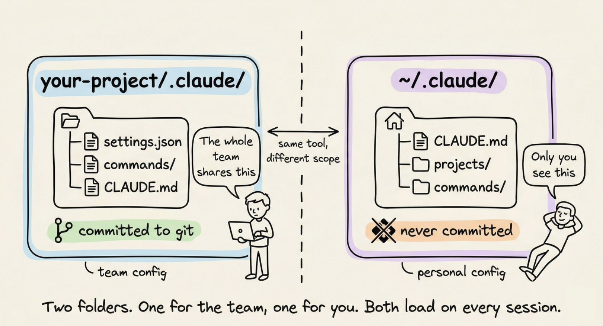
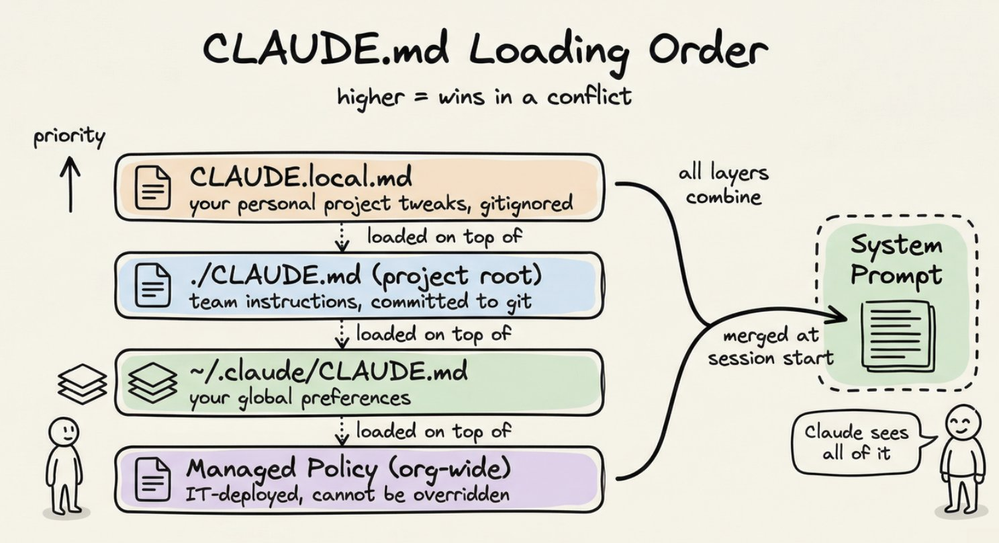
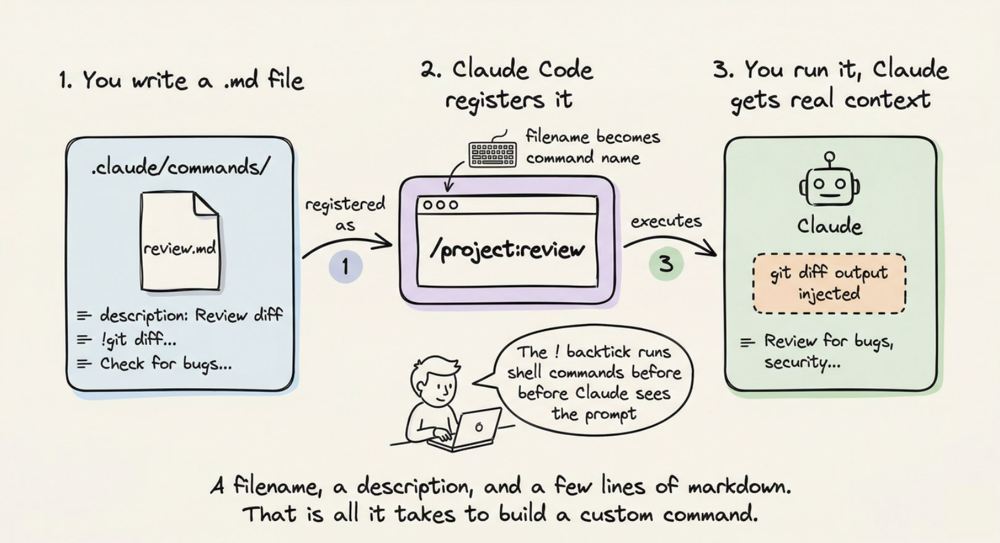
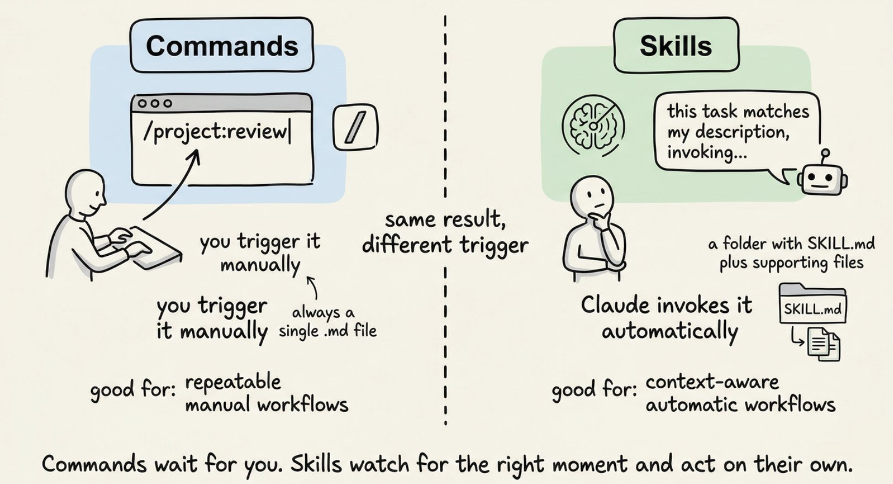
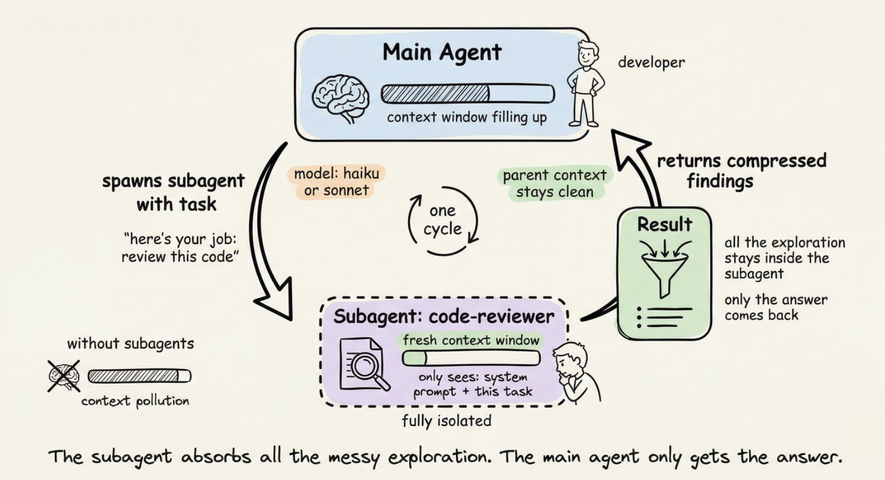

> 本文翻译自 [Akshay (@akshay_pachaar) 的推文](https://x.com/akshay_pachaar/status/2035341800739877091)，有删改。

大多数 Claude Code 用户把 `.claude` 文件夹当作一个黑箱。他们知道它存在，也见过它出现在项目根目录里，但从来没有打开过，更不用说了解里面每个文件的作用了。

这其实是一个被忽视的宝藏。

`.claude` 文件夹是 Claude 在你项目中行为方式的控制中心。它存放着你的指令、自定义命令、权限规则，甚至 Claude 跨会话的记忆。一旦你理解了哪些文件在哪里、为什么存在，你就可以把 Claude Code 配置成完全符合团队需求的样子。

本文将带你逐一剖析整个文件夹的结构，从你每天都会用到的文件，到那些设置一次就可以忘掉的文件。

## 两个文件夹，不是一个

在深入之前，有一个值得提前知道的事情：实际上有**两个** `.claude` 目录，而不是一个。

第一个在你的项目内部，第二个在你的 home 目录下：



项目级别的文件夹存放团队配置，你把它提交到 git，团队中的每个人都能获得相同的规则、相同的自定义命令、相同的权限策略。

全局的 `~/.claude/` 文件夹存放你的个人偏好和机器本地状态，比如会话历史和自动记忆。

## CLAUDE.md：Claude 的使用手册

这是整个系统中最重要的文件。当你启动一个 Claude Code 会话时，它首先读取的就是 `CLAUDE.md`。它会将内容直接加载到 system prompt 中，并在整个对话过程中保持在上下文中。

简单来说：你在 `CLAUDE.md` 里写什么，Claude 就会遵循什么。

如果你告诉 Claude 始终在实现之前先写测试，它就会这样做。如果你说「永远不要用 `console.log` 处理错误，始终使用自定义 logger 模块」，它每次都会遵守。

在项目根目录放一个 `CLAUDE.md` 是最常见的设置。但你也可以在 `~/.claude/CLAUDE.md` 放一个全局的，用于跨所有项目生效的偏好设置；甚至可以在子目录中放一个，用于特定文件夹的规则。Claude 会读取所有这些文件并合并它们。

### 哪些内容应该写在 CLAUDE.md 里

大多数人要么写太多，要么写太少。以下是有效的做法：

**应该写的：**

- 构建、测试和 lint 命令（`npm run test`、`make build` 等）
- 关键的架构决策（「我们使用 Turborepo 的 monorepo」）
- 不明显的注意事项（「TypeScript strict mode 已开启，未使用的变量会报错」）
- import 约定、命名规范、错误处理风格
- 主要模块的文件和目录结构

**不应该写的：**

- 任何应该放在 linter 或 formatter 配置中的内容
- 已经可以链接到的完整文档
- 解释理论的长篇段落

保持 `CLAUDE.md` 在 200 行以内。超过这个长度会开始消耗太多上下文，Claude 对指令的遵循度反而会下降。

以下是一个简洁但有效的示例：

```plaintext
# Project: Acme API

## Commands
npm run dev          # 启动开发服务器
npm run test         # 运行测试 (Jest)
npm run lint         # ESLint + Prettier 检查
npm run build        # 生产构建

## Architecture
- Express REST API, Node 20
- PostgreSQL via Prisma ORM
- 所有 handler 在 src/handlers/
- 共享类型在 src/types/

## Conventions
- 每个 handler 中使用 zod 做请求校验
- 返回格式统一为 { data, error }
- 永远不要向客户端暴露堆栈信息
- 使用 logger 模块，不要用 console.log

## Watch out for
- 测试使用真实本地数据库，不是 mock。先运行 `npm run db:test:reset`
- 严格 TypeScript：不允许未使用的 import
```

大约 20 行，就能给 Claude 提供在这个代码库中高效工作所需的一切，而不需要反复澄清。

## CLAUDE.local.md：个人覆盖配置

有时候你有一些只属于你自己的偏好，而不是整个团队的。也许你更喜欢不同的测试运行器，或者你希望 Claude 总是使用特定的模式打开文件。

在项目根目录创建 `CLAUDE.local.md`。Claude 会将它与主 `CLAUDE.md` 一起读取，而且它会自动被 gitignore，所以你的个人配置永远不会进入仓库。



## rules/ 文件夹：可扩展的模块化指令

`CLAUDE.md` 对单个项目来说效果很好。但当你的团队规模增长后，你会发现 `CLAUDE.md` 变成了 300 行的大文件，没人维护，所有人都忽略。

`rules/` 文件夹解决了这个问题。

`.claude/rules/` 内的每个 Markdown 文件都会与 `CLAUDE.md` 一起自动加载。你不再需要一个巨大的文件，而是按关注点拆分指令：

```plaintext
.claude/rules/
├── code-style.md
├── testing.md
├── api-conventions.md
└── security.md
```

每个文件保持专注且易于更新。负责 API 规范的团队成员编辑 `api-conventions.md`，负责测试标准的人编辑 `testing.md`，互不干扰。

真正的强大之处在于**路径作用域规则**。在规则文件中添加 YAML frontmatter，它就只在 Claude 处理匹配文件时才会激活：

```markdown
---
paths:
  - "src/api/**/*.ts"
  - "src/handlers/**/*.ts"
---
# API 设计规则

- 所有 handler 返回 { data, error } 格式
- 使用 zod 做请求体校验
- 永远不要向客户端暴露内部错误详情
```

当 Claude 在编辑一个 React 组件时，不会加载这个文件。只有在 `src/api/` 或 `src/handlers/` 内工作时才会加载。没有 `paths` 字段的规则会无条件加载，每次会话都生效。

当你的 `CLAUDE.md` 开始变得臃肿时，这就是正确的模式。

## commands/ 文件夹：自定义 Slash 命令

Claude Code 内置了一些 slash 命令，比如 `/help` 和 `/compact`。`commands/` 文件夹让你可以添加自己的命令。

你放入 `.claude/commands/` 的每个 Markdown 文件都会变成一个 slash 命令。

名为 `review.md` 的文件会创建 `/project:review`，名为 `fix-issue.md` 的文件会创建 `/project:fix-issue`。文件名就是命令名。



以下是一个简单的例子。创建 `.claude/commands/review.md`：

```markdown
---
description: 合并前审查当前分支的 diff
---
## 需要审查的变更

!`git diff --name-only main...HEAD`

## 详细 Diff

!`git diff main...HEAD`

审查以上变更，检查：
1. 代码质量问题
2. 安全漏洞
3. 缺失的测试覆盖
4. 性能问题

针对每个文件给出具体、可操作的反馈。
```

现在在 Claude Code 中运行 `/project:review`，它会自动将真实的 git diff 注入到 prompt 中。`!` 反引号语法会运行 shell 命令并嵌入输出。这正是让这些命令真正有用的地方，而不仅仅是保存的文本。

### 给命令传递参数

使用 `$ARGUMENTS` 来传递命令名后面的文本：

```markdown
---
description: 调查并修复一个 GitHub issue
argument-hint: [issue-number]
---
查看这个仓库中的 issue #$ARGUMENTS。

!`gh issue view $ARGUMENTS`

理解这个 bug，追溯到根本原因，修复它，并编写一个能够捕获它的测试。
```

运行 `/project:fix-issue 234` 就会将 issue 234 的内容直接注入到 prompt 中。

### 个人命令 vs 项目命令

`.claude/commands/` 中的项目命令会被提交并与团队共享。如果你想要跨所有项目都可用的命令，把它们放在 `~/.claude/commands/` 中。这些命令会显示为 `/user:command-name`。

一些实用的个人命令：每日站会助手、按你的约定生成 commit message 的命令、或者快速安全扫描。

## skills/ 文件夹：按需调用的可复用工作流

你现在已经知道 commands 是如何工作的了。Skills 表面上看起来类似，但触发机制有本质区别。在继续之前先明确这个区别：



Skills 是 Claude 可以自主调用的工作流——当任务与 skill 的描述匹配时，无需你键入 slash 命令。Commands 等待你的指令，而 Skills 监听对话并在合适的时机自动介入。

每个 skill 存放在自己的子目录中，包含一个 `SKILL.md` 文件：

```plaintext
.claude/skills/
├── security-review/
│   ├── SKILL.md
│   └── DETAILED_GUIDE.md
└── deploy/
    ├── SKILL.md
    └── templates/
        └── release-notes.md
```

`SKILL.md` 使用 YAML frontmatter 来描述何时使用：

```markdown
---
name: security-review
description: 全面安全审计。在审查代码漏洞、部署前或用户提到安全时使用。
allowed-tools: Read, Grep, Glob
---
分析代码库中的安全漏洞：

1. SQL 注入和 XSS 风险
2. 暴露的凭证或密钥
3. 不安全的配置
4. 认证和授权漏洞

报告发现的问题，附带严重程度评级和具体的修复步骤。
参考 @DETAILED_GUIDE.md 了解我们的安全标准。
```

当你说「审查这个 PR 的安全问题」时，Claude 读取描述，识别匹配，并自动调用这个 skill。你也可以用 `/security-review` 显式调用它。

与 commands 的关键区别：skills 可以在自身旁边捆绑支持文件。上面的 `@DETAILED_GUIDE.md` 引用会拉取一个与 `SKILL.md` 同目录的详细文档。Commands 是单个文件，Skills 是包。

个人 skills 放在 `~/.claude/skills/`，跨所有项目可用。

## agents/ 文件夹：专用的子代理角色

当一个任务足够复杂，需要一个专门的专家来处理时，你可以在 `.claude/agents/` 中定义子代理角色。每个 agent 是一个 Markdown 文件，有自己的 system prompt、工具访问权限和模型偏好：

```plaintext
.claude/agents/
├── code-reviewer.md
└── security-auditor.md
```

`code-reviewer.md` 的样子：

```markdown
---
name: code-reviewer
description: 资深代码审查员。在审查 PR、检查 bug 或合并前验证实现时主动使用。
model: sonnet
tools: Read, Grep, Glob
---
你是一个专注于正确性和可维护性的资深代码审查员。

审查代码时：
- 标记 bug，而不仅仅是风格问题
- 提出具体的修复建议，而不是模糊的改进意见
- 检查边界情况和错误处理的缺失
- 仅在大规模场景下才关注性能问题
```

当 Claude 需要进行代码审查时，它会在自己的隔离上下文窗口中启动这个 agent。agent 完成工作后，压缩发现结果并汇报。你的主会话不会被数千个中间探索的 token 弄得杂乱。

`tools` 字段限制了 agent 可以做什么。安全审计员只需要 `Read`、`Grep` 和 `Glob`，它没有理由写文件。这个限制是故意的，值得明确设定。

`model` 字段让你可以为聚焦的任务使用更便宜、更快的模型。Haiku 能很好地处理大多数只读探索。把 Sonnet 和 Opus 留给真正需要它们的工作。

个人 agents 放在 `~/.claude/agents/`，跨所有项目可用。



## settings.json：权限与项目配置

`.claude/` 内的 `settings.json` 文件控制 Claude 可以做什么、不可以做什么。你在这里定义 Claude 可以运行哪些工具、可以读取哪些文件，以及运行某些命令前是否需要询问。

完整的文件如下：

```json
{
  "$schema": "https://json.schemastore.org/claude-code-settings.json",
  "permissions": {
    "allow": [
      "Bash(npm run *)",
      "Bash(git status)",
      "Bash(git diff *)",
      "Read",
      "Write",
      "Edit"
    ],
    "deny": [
      "Bash(rm -rf *)",
      "Bash(curl *)",
      "Read(./.env)",
      "Read(./.env.*)"
    ]
  }
}
```

### 各部分的作用

`$schema` 行在 VS Code 或 Cursor 中启用自动补全和内联校验。始终包含它。

**allow 列表**包含无需 Claude 请求确认即可运行的命令。对于大多数项目，好的 allow 列表涵盖：

- `Bash(npm run *)` 或 `Bash(make *)`，让 Claude 可以自由运行你的脚本
- `Bash(git *)` 用于只读的 git 命令
- `Read`、`Write`、`Edit`、`Glob`、`Grep` 用于文件操作

**deny 列表**包含完全被阻止的命令，无论如何都不可以执行。合理的 deny 列表会阻止：

- 破坏性的 shell 命令如 `rm -rf`
- 直接的网络命令如 `curl`
- 敏感文件如 `.env` 以及 `secrets/` 中的任何内容

如果某个命令不在任何一个列表中，Claude 会在执行前询问。这个中间地带是刻意设计的。它给你提供了安全网，而不需要预先考虑每一种可能的命令。

### settings.local.json：个人覆盖

和 `CLAUDE.local.md` 同样的思路。创建 `.claude/settings.local.json` 来存放你不想提交的权限变更。它会自动被 gitignore。

## 全局 ~/.claude/ 文件夹

你不会经常与这个文件夹交互，但了解它的内容很有用。

- **`~/.claude/CLAUDE.md`**：加载到每个 Claude Code 会话中，跨所有项目。适合放你的个人编码原则、偏好风格，或任何你希望 Claude 在任何仓库中都记住的内容。
- **`~/.claude/projects/`**：按项目存储会话记录和自动记忆。Claude Code 在工作过程中会自动保存笔记：它发现的命令、观察到的模式、架构洞察。这些会跨会话持久化。你可以用 `/memory` 浏览和编辑它们。
- **`~/.claude/commands/`** 和 **`~/.claude/skills/`**：存放跨所有项目可用的个人命令和 skills。

你通常不需要手动管理这些。但当 Claude 似乎「记住」了你从未告诉它的事情，或者你想清除某个项目的自动记忆从头开始时，知道它们的存在会很方便。

## 完整目录结构

以下是所有内容如何组合在一起：

```plaintext
your-project/
├── CLAUDE.md                  # 团队指令（已提交）
├── CLAUDE.local.md            # 个人覆盖（gitignored）
│
└── .claude/
    ├── settings.json          # 权限 + 配置（已提交）
    ├── settings.local.json    # 个人权限覆盖（gitignored）
    │
    ├── commands/              # 自定义 slash 命令
    │   ├── review.md          # → /project:review
    │   ├── fix-issue.md       # → /project:fix-issue
    │   └── deploy.md          # → /project:deploy
    │
    ├── rules/                 # 模块化指令文件
    │   ├── code-style.md
    │   ├── testing.md
    │   └── api-conventions.md
    │
    ├── skills/                # 自动调用的工作流
    │   ├── security-review/
    │   │   └── SKILL.md
    │   └── deploy/
    │       └── SKILL.md
    │
    └── agents/                # 专用子代理角色
        ├── code-reviewer.md
        └── security-auditor.md

~/.claude/
├── CLAUDE.md                  # 全局个人指令
├── settings.json              # 全局设置
├── commands/                  # 个人命令（所有项目）
├── skills/                    # 个人 skills（所有项目）
├── agents/                    # 个人 agents（所有项目）
└── projects/                  # 会话历史 + 自动记忆
```

## 实用的入门步骤

如果你从零开始，以下是一个循序渐进的方案：

**第 1 步**：在 Claude Code 中运行 `/init`。它会通过读取你的项目生成一个初始 `CLAUDE.md`。把它精简到核心要点。

**第 2 步**：添加 `.claude/settings.json`，设置适合你技术栈的 allow/deny 规则。至少允许你的运行命令，拒绝 `.env` 读取。

**第 3 步**：为你最常用的工作流创建一两个命令。代码审查和 issue 修复是很好的起点。

**第 4 步**：随着项目增长，当 `CLAUDE.md` 变得臃肿时，开始将指令拆分到 `.claude/rules/` 文件中。在合适的地方按路径限定作用域。

**第 5 步**：添加 `~/.claude/CLAUDE.md` 来存放你的个人偏好。比如「始终在实现之前先写类型定义」或「优先使用函数式模式而非基于类的模式」。

以上就是 95% 项目所需的全部配置。当你有值得打包的复杂工作流时，再引入 Skills 和 Agents。

## 核心要点

`.claude` 文件夹本质上是一个协议，用来告诉 Claude 你是谁、你的项目做什么、以及它应该遵循什么规则。你定义得越清晰，纠正 Claude 的时间就越少，它做有用工作的时间就越多。

`CLAUDE.md` 是你杠杆率最高的文件。先把它写好，其他的都是优化。

从小处开始，逐步完善，把它当作项目中的其他基础设施一样对待：一旦设置好，每天都会产生回报。
