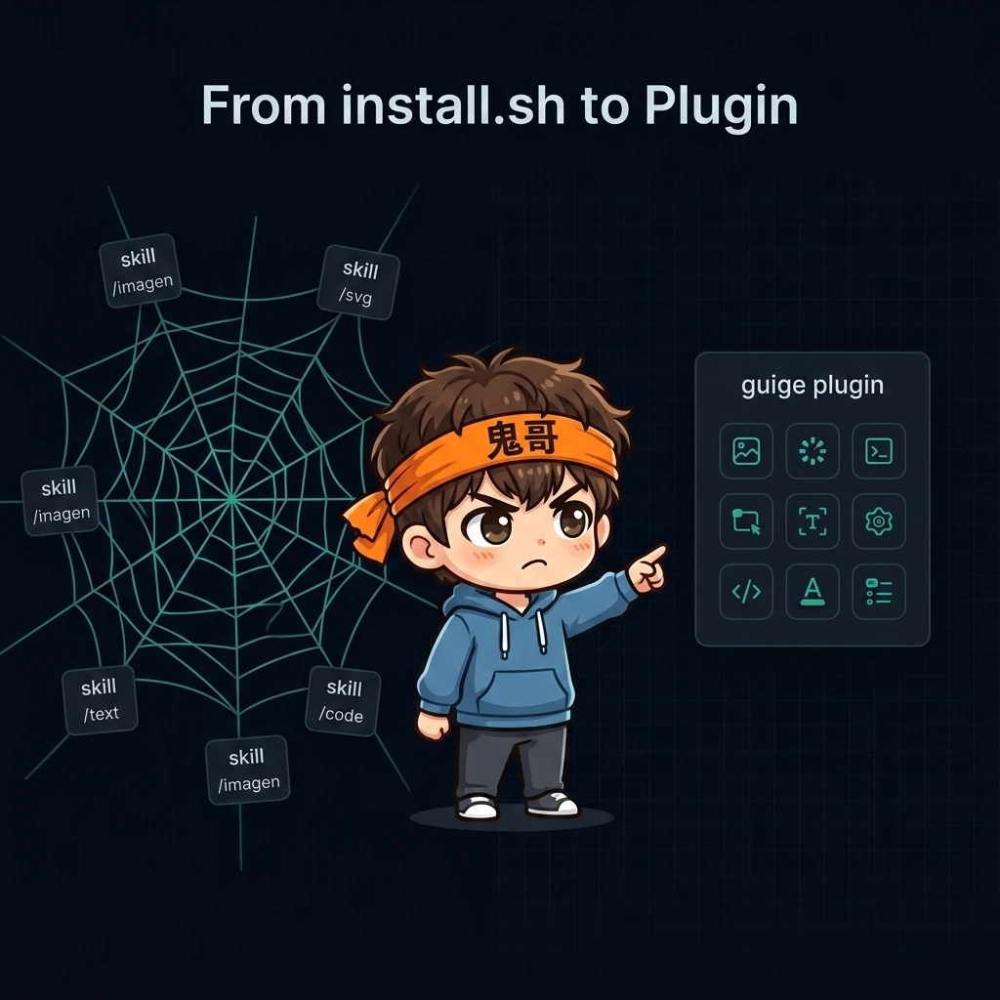
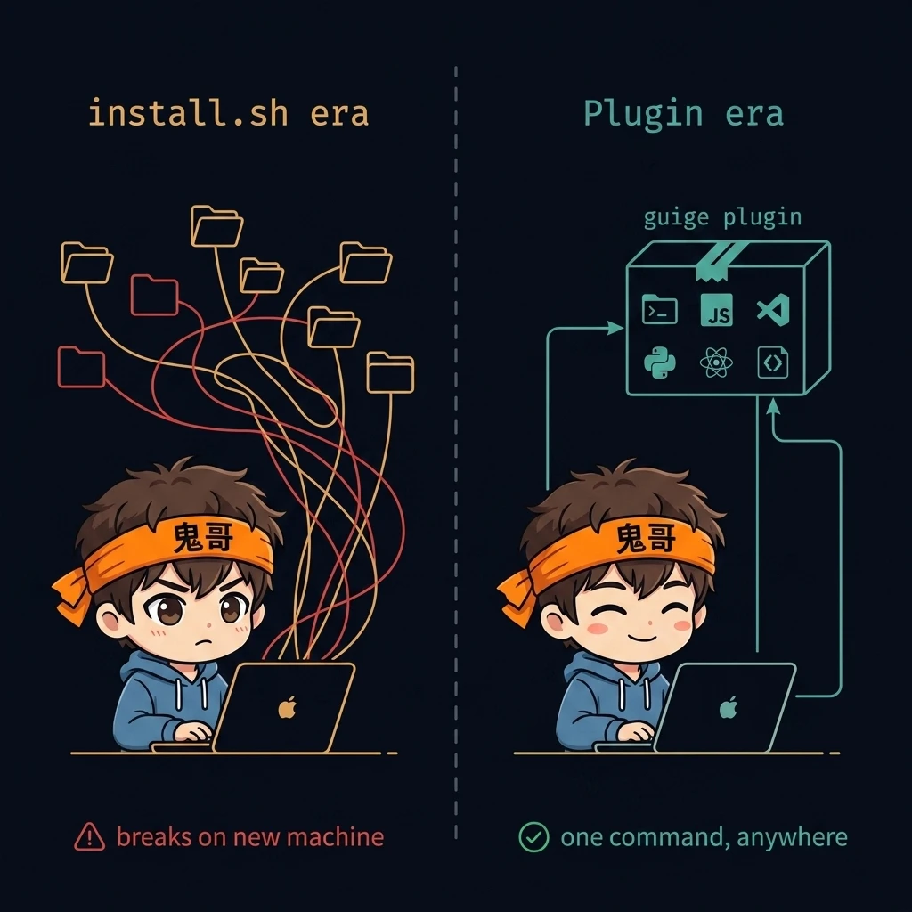
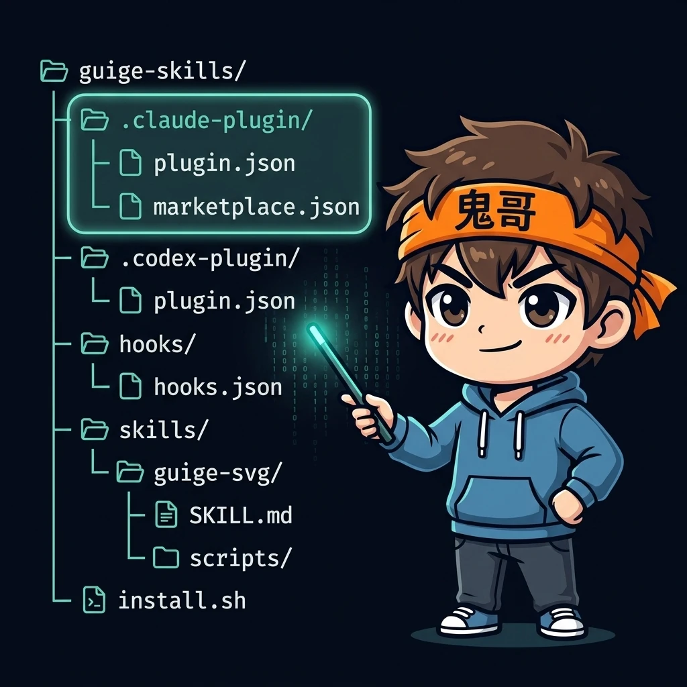
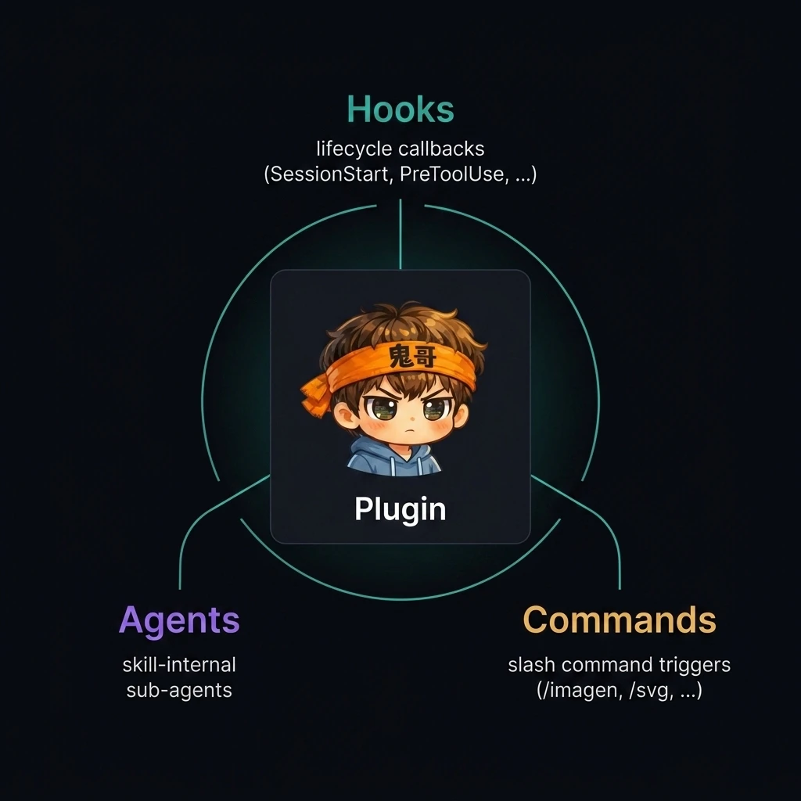
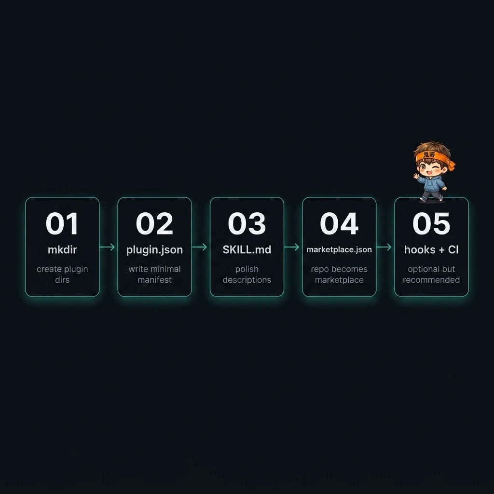

> 13 个 skill、3 套平台、1 个 hook、若干个 agent —— 没有 plugin 之前，我用 80 行 bash + symlink 撑着；用了 plugin 之后，只剩一行 `/plugin install`。

这不是一篇"plugin 是什么"的百科文，而是一份**从 symlink 撑场子，到三套 manifest 同步、CI 校验、hook 注册全套打通**的迁移记录。

如果你也写了几个 skill 还在用 `cp` 或者 `ln -s` 凑合，这篇是给你的。



---

## 一、Symlink 撑了三个月

第一个 skill `guige-imagen` 写完那天，我对着空的 `~/.claude/skills/` 发了 5 分钟呆 —— 这个东西到底怎么"装"上去？

翻文档之后才发现答案简单到让人想笑：**把目录 `cp` 过去就行**。Claude Code 启动的时候扫一遍 `~/.claude/skills/`，每个子目录里有 `SKILL.md` 的就是一个 skill。

但 `cp` 是单向的 —— 我每次改完源码都要重新 `cp` 一次。于是很自然地换成 `ln -s`。

skill 写到第五个的时候，我开了个 `install.sh`：

```bash
# install.sh （节选）
for skill in "$SKILLS_ROOT"/*/; do
    name="$(basename "$skill")"
    for target in "${TARGET_DIRS[@]}"; do
        target="$(expand_path "$target")"
        mkdir -p "$target"
        ln -snf "$skill" "$target/$name"
    done
done
```

短短十几行，外加 `--dry-run / --cleanup / --target` 几个选项，配合 `GUIGE_SKILLS_TARGETS` 环境变量，撑住了三个月的本地开发。

然后我开始踩坑。

**坑一：换机器**。买了新 Mac，clone 仓库，跑 `install.sh`，启动 Claude Code —— 一切看似正常，直到调用 `guige-imagen` 才发现 `OPENAI_API_KEY` 没配，`rclone` 没装，`yt-dlp` 也没装。install.sh 只管 symlink，对依赖一无所知。

**坑二：分享**。朋友说"你那个生信息图的 skill 给我玩玩呗"。

> 你 clone 一下 repo，然后 `chmod +x install.sh`，然后看一下 `--target` 默认值对不对，然后...

朋友放弃了。

**坑三：多平台**。Codex 出 plugin 体系的时候，我得加一个 target；之后 Anthropic Code 的 marketplace 出来，又得加一个。每多一个客户端，install.sh 就要改一遍，文档就要更一遍。

直到我在某个深夜读到 Claude Code 的 marketplace 文档：

> A plugin is a self-contained directory that bundles skills, hooks, commands, and agents into a single distributable unit.

那一瞬间我意识到 —— **plugin 不是替代 install.sh，而是把 install.sh 干的活直接下沉到客户端里**。



---

## 二、Plugin 到底是什么

不写百科式定义，三句话讲清：

1. **Plugin 是一个标准化的目录契约**。客户端按 schema 加载 `.claude-plugin/plugin.json`，自动发现内部的 skills、hooks、commands、agents。
2. **它把"分发"和"加载"解耦**。skill 的源码和资源不动，新增的只是几个 manifest 文件。
3. **它让仓库既是 plugin 也是 marketplace**。`.claude-plugin/marketplace.json` 让任何 GitHub repo 都能被 `/plugin marketplace add` 一键吃进去，不再需要 README 教别人 clone + chmod + symlink。

为了后面少绕弯路，先把几个术语对齐：

| 概念 | 是什么 | 在 guige-skills 里对应什么 |
|---|---|---|
| Plugin | 可分发的单元 | 整个 repo |
| Manifest | plugin 的"身份证" | `.claude-plugin/plugin.json` |
| Marketplace | 发现层（谁有哪些 plugin） | `.claude-plugin/marketplace.json` |
| Skill | 能力单元（一个 workflow） | `skills/guige-*/SKILL.md` |
| Hook | 生命周期回调 | `hooks/hooks.json` |
| Command | slash command 触发入口 | `/imagen`、`/blog-post` 等 |
| Agent | skill 内部的子任务 | `skills/<name>/agents/*.yaml` |

记住一条主线：**plugin 是个壳，skill 是它的灵魂，hooks/commands/agents 是它的手脚**。

---

## 三、guige-skills 的目录解剖

这是全文密度最高的一节。先把目录树摊开：

```text
guige-skills/
├── .claude-plugin/
│   ├── plugin.json          ← Claude Code plugin manifest
│   └── marketplace.json     ← 让 repo 自己变 marketplace
├── .codex-plugin/
│   └── plugin.json          ← Codex 专属配置
├── .agents/plugins/
│   └── marketplace.json     ← Anthropic Code marketplace
├── hooks/
│   ├── hooks.json           ← 注册生命周期钩子
│   └── session-start.sh     ← SessionStart 时打印 skill 速查
├── skills/                  ← 13 个 skill 全在这
│   └── guige-svg/
│       ├── SKILL.md
│       ├── scripts/         ← Python 渲染器
│       ├── agents/          ← skill 内子 agent (YAML)
│       ├── assets/
│       └── references/      ← skill 私有文档
├── references/              ← 跨 skill 共享（占位）
├── install.sh               ← 旧时代兼容入口，仍保留
├── CLAUDE.md                ← 项目约定，给人也给 AI 看
└── README.md
```



下面逐节展开。

### 3.1 `.claude-plugin/plugin.json` —— 身份证

整个 plugin 的"入口文件"。Claude Code 加载 plugin 的时候，第一眼看的就是它：

```json
{
  "name": "guige",
  "version": "0.1.0",
  "description": "Gui Ge skill set — image generation, infographics, slides, SVG diagrams, video download, X/Twitter conversion, Google Drive upload, and WeChat publishing.",
  "author": { "name": "Gui Ge", "url": "https://github.com/luoli523" },
  "homepage": "https://github.com/luoli523/guige-skills",
  "license": "MIT",
  "skills": "./skills/"
}
```

关键字段：

- **`name`** —— 用户在 `/plugin install` 时看到的标识，必须**三套 manifest 同步**（下文展开）
- **`skills`** —— 指向 skill 目录的相对路径。客户端会扫描这个目录的子目录，每个含 `SKILL.md` 的就是一个 skill
- **`version`** —— 发版控制点。CI 会校验三套 manifest 的版本号一致，避免发版漂移

### 3.2 `.claude-plugin/marketplace.json` —— 自己当自己的市场

光有 plugin manifest 还不够，客户端怎么"发现"你这个 plugin？两种路径：

1. 你把 plugin 提交到一个**公共 marketplace**（比如 Anthropic 的官方 marketplace）
2. 你**让自己的 repo 就是一个 marketplace**

guige-skills 选了第二种：

```json
{
  "name": "guige-skills",
  "owner": { "name": "Gui Ge", "url": "https://github.com/luoli523" },
  "metadata": {
    "description": "鬼哥个人 Claude Code skills 集合...",
    "version": "0.1.0"
  },
  "plugins": [
    {
      "name": "guige",
      "description": "Gui Ge skill set — ...",
      "source": {
        "source": "github",
        "repo": "luoli523/guige-skills"
      }
    }
  ]
}
```

`source.repo: "luoli523/guige-skills"` 是核心 —— 它告诉客户端"这个 marketplace 里的 plugin 就住在 GitHub 的这个 repo 里"。

别人现在只要两行命令：

```bash
/plugin marketplace add luoli523/guige-skills
/plugin install guige@guige-skills
```

就能把 13 个 skill 一次性装上。原本 install.sh 那套 clone + chmod + 调环境变量的剧本，彻底退役。

### 3.3 三套 manifest 的 fan-out

打开 guige-skills 你会看到三个看起来差不多的目录：`.claude-plugin/`、`.codex-plugin/`、`.agents/`。

为什么不写一套？因为不同客户端的 schema 长得**像但不同**：

- `.claude-plugin/plugin.json` —— Claude Code 的标准格式
- `.codex-plugin/plugin.json` —— Codex 用相似 schema 但有 `interface`、`capabilities`、`defaultPrompt` 等独有字段
- `.agents/plugins/marketplace.json` —— Anthropic Code 用 `policy/category` 模型，schema 风格完全不同

guige-skills 的策略是：

**强制不变量**：`name` 和 `version` 必须三套一致。客户端识别 plugin 靠的就是 `name`，不一致会导致加载报错且非常难定位。

**允许漂移**：`description` 可以按平台调整文案 —— Claude Code 用户和 Codex 用户的语境不同，给一样的描述反而别扭。

这一致性怎么保证？靠 CI。`scripts/validate.py` 在每个 PR 上跑，校验三套 manifest 的 `name/version` 一致，再校验每个 skill 都有 `SKILL.md` 且 frontmatter 完整。这个细节在 commit `1ca80b9` 里加上的，自从加了之后版本号再没出过岔子。

### 3.4 `hooks/` —— 会话级回调

hooks 是 plugin 最有意思的部分之一。它让 plugin 不再只是"能力的集合"，而是"能主动介入用户工作流"的存在。

guige-skills 现在只挂了一个 SessionStart hook：

```json
{
  "hooks": {
    "SessionStart": [
      {
        "hooks": [
          {
            "type": "command",
            "command": "bash ${CLAUDE_PLUGIN_ROOT}/hooks/session-start.sh"
          }
        ]
      }
    ]
  }
}
```

对应的 shell 脚本就是一段 heredoc：

```bash
#!/usr/bin/env bash
cat <<'EOF'
🎨 guige skills available — 触发关键词速查:
  /imagen              图片生成 (OpenAI / Google API)
  /infographic         鬼哥风格信息图
  /hand-write-pic      一页式手绘知识卡
  /disassembly-diagram 拆解图 / 爆炸图 / 剖面图
  /svg                 可编辑 SVG 图表
  /slides              图片式幻灯片 (PPTX / PDF)
  /picbook             儿童科普绘本
  /blog-post           写 Hugo 博客文章
  ...
EOF
```

效果是 —— 每次开新会话，用户立刻看到这份 skill 速查清单。

两个技术点必须讲：

**`${CLAUDE_PLUGIN_ROOT}` 是 plugin 的魔法变量**。它指向 plugin 安装后的根目录，取代你想硬编码的 `$HOME/projects/guige-skills`。如果你写过 install.sh 你就知道，路径硬编码是所有便携性问题的根源 —— plugin 把这个问题彻底消灭了。

**SessionStart 是"发现率"的低成本放大器**。skill 写得再好，用户记不住关键词也白搭。开会话就糊脸一份速查，关键词记不住也能扫到。

除了 SessionStart，hooks 还支持 `PreToolUse / PostToolUse / Stop / UserPromptSubmit / Notification` 等多个生命周期事件。每个都能挂载脚本，能做的事情远比"打印速查"多得多 —— 这部分我打算下一篇专门讲，包括我加过 PreToolUse 拦 `rm` 又删掉的踩坑过程。

### 3.5 `skills/<name>/` —— 能力单元

skill 是 plugin 的灵魂。结构上每个 skill 就一个目录，必含 `SKILL.md`。拿 `guige-svg` 举例：

```text
skills/guige-svg/
├── SKILL.md                    ← 必需，含 frontmatter
├── scripts/                    ← Python 渲染脚本
├── agents/                     ← skill 内部子 agent (YAML)
└── references/                 ← skill 私有文档/示例
```

`SKILL.md` 的 frontmatter 是 skill 的"出生证明"：

```yaml
---
name: guige-svg
description: Generate clean editable SVG diagrams and visual schedules from
  structured content. Use when the user asks for SVG output, architecture
  diagrams, flowcharts, timelines, matrices, comparison tables, visual
  schedules, or a deterministic alternative to image generation.
---
```

注意 `description` —— 它不是"给人看的简介"，**它是给 AI 看的触发指令**。AI 在判断"要不要调用这个 skill"时，比对的就是用户输入和这段 description 的语义匹配度。

所以写 description 有个反直觉的原则：**列触发场景比写功能描述更重要**。对比一下：

❌ 反例：「Generate SVG diagrams.」（功能描述）
- AI 看完一脸懵：用户说"画个流程图"算不算 SVG diagram？

✅ 正例：guige-svg 的写法
- 列出了 architecture diagrams / flowcharts / timelines / matrices 等具体类型
- 列出了 "deterministic alternative to image generation" 这种**反向触发条件**（当用户嫌图片生成不稳定时）
- AI 能在多个候选 skill 之间精准选中它

最后讲一条边界，是 guige-skills 在 CLAUDE.md 里写死的：

> skill 之间不复制粘贴内容；共享资源放顶层 `references/`。skill 间通过明确 CLI 接口调用，不读对方私有目录。

比如 `guige-blog-post` 要上传到 Drive，它不直接读 `guige-drive-upload/scripts/` —— 它调用 `guige-drive-upload` 这个 CLI 接口。这条边界感是 skill 数量能从 5 个长到 13 个**而不互相打架**的前提。

---

## 四、Hooks / Agents / Commands —— 三大扩展点速览

把 plugin 真正变强的，是这三个机制。这一节先各给一个最小用例，下篇细讲。



### Hooks —— 把脚本挂到生命周期

**是什么**：把任意脚本注册到客户端的生命周期事件上（SessionStart、PreToolUse、PostToolUse、Stop、UserPromptSubmit 等）。

**guige-skills 用例**：SessionStart 打印 skill 速查清单（上一节已展示）。

**何时该用**：当你想做的不是"提供一个能力"而是"在某个时刻自动介入"。例如：会话开始时注入项目上下文、工具调用前做安全检查、agent 完成后自动 commit。

> 下一篇专讲 hooks：为什么我给所有会话都加了 SessionStart 提示、又为什么删掉了 PreToolUse 的 `rm` guard、以及 hooks 在 plugin 场景下真正适合干什么。

### Agents —— skill 内部的子任务

**是什么**：在 `skills/<name>/agents/` 下放 YAML 文件，定义一个**专门角色**的子 agent，让 skill 内部能 fan-out 出复杂流程。

**guige-skills 用例**：`guige-svg` 有一个 spec-writer agent，专门把用户的自然语言需求转成 SVG 渲染器能消费的 JSON spec。skill 的主流程是"接收需求 → fan out 给 spec-writer → 拿到 spec → Python 脚本渲染 → 输出 SVG"。

**何时该用**：当单个 skill 流程复杂、需要"角色分工"时。比如要先 research、再 outline、再 draft，三个阶段需要不同的注意力配置。

### Commands —— slash command 触发入口

**是什么**：用户在 Claude Code 里输入 `/<name>` 时唤起的能力。Commands 不是单独的目录 —— **它由 skill 的 `name` 字段自动生成**。`name: guige-imagen` → 触发词 `/imagen`（前缀 `guige-` 会被剥掉）。

**guige-skills 用例**：`/imagen`、`/blog-post`、`/svg`、`/picbook` 等十几个。

**何时该用**：默认就用。任何 skill 都应该假定用户可能用 slash command 唤起它，所以 `name` 要短、要好记。

---

## 五、5 步迁移：从 skill 散件到 plugin

读到这里你可能已经在想"我自己那堆 skill 怎么迁"。给一份可直接抄的 5 步起手式。



### Step 1：建目录

```bash
mkdir -p .claude-plugin skills hooks
```

如果你的 skill 已经在某个目录下了，把它们整体挪到 `skills/`。

### Step 2：写最小 plugin.json

`.claude-plugin/plugin.json` 的最小可用版本：

```json
{
  "name": "your-plugin-name",
  "version": "0.1.0",
  "description": "What this plugin does.",
  "skills": "./skills/"
}
```

`name` 是后面所有同步约束的"源头"，想清楚再写。kebab-case，简短。

### Step 3：检查每个 SKILL.md 的 description

这是迁移过程中**最容易被忽略但最影响效果**的一步。

打开每个 `skills/<name>/SKILL.md`，对照下面这份检查表：

- [ ] frontmatter 是否包含 `name` 和 `description` 两个必填字段？
- [ ] `description` 是否列出了具体的触发场景？（不要只写"做什么"，要写"什么时候用"）
- [ ] 是否列出了关键词的多种表达方式？中文别名、英文别名、同义词？
- [ ] 是否写明了**反触发条件**？比如"当用户需要 X 时**不要**用这个 skill，应该用 Y"？

guige-skills 里 description 平均 80-150 字。别心疼字数 —— **这段话是你能给 AI 留下的唯一指令**，写得短了就等于不存在。

### Step 4：加 marketplace.json，让 repo 变市场

`.claude-plugin/marketplace.json`：

```json
{
  "name": "your-marketplace-name",
  "owner": { "name": "Your Name", "url": "https://github.com/you" },
  "metadata": { "version": "0.1.0" },
  "plugins": [
    {
      "name": "your-plugin-name",
      "description": "What this plugin does.",
      "source": { "source": "github", "repo": "you/your-repo" }
    }
  ]
}
```

注意 `plugins[].name` 要和 `plugin.json` 里的 `name` **完全一致**。

提交、push、完事。别人现在能 `/plugin marketplace add you/your-repo`，再 `/plugin install your-plugin-name@your-marketplace-name` 直接用。

### Step 5：（可选但强烈推荐）加 hooks + CI 校验

**SessionStart hook 的最小版本**：

`hooks/hooks.json`：

```json
{
  "hooks": {
    "SessionStart": [
      {
        "hooks": [
          { "type": "command", "command": "bash ${CLAUDE_PLUGIN_ROOT}/hooks/welcome.sh" }
        ]
      }
    ]
  }
}
```

`hooks/welcome.sh`：

```bash
#!/usr/bin/env bash
echo "🔌 your-plugin loaded — try /skill-1, /skill-2, /skill-3"
```

就这么 5 行，但效果立竿见影。

**CI 校验**：写一个 `scripts/validate.py`，校验：

1. 三套 manifest（如果你做了多平台）的 `name` 和 `version` 一致
2. `skills/` 下每个目录都有 `SKILL.md`
3. 每个 `SKILL.md` 的 frontmatter 含 `name` + `description`
4. 每个 `name` 唯一（避免重名冲突）

挂到 GitHub Actions 上，PR 时自动跑。一次配置永久受益。

---

### 我踩过的坑（一句话一条）

- 路径千万**别**硬编码 —— 全部用 `${CLAUDE_PLUGIN_ROOT}`
- 三套 manifest 的 `name` 不一致 → 客户端加载报错，且报错信息极度不友好
- `description` 写得太抽象 → AI 永远不会触发你的 skill，等于不存在
- skill 之间**互相 import** 私有目录 → 一次重构所有 skill 陪葬
- 把生成物（图片、PDF）放到 skill 目录下 → `git status` 永远是脏的，记得加 `.gitignore`

---

## 六、Takeaway

**Skill 解决"能力"问题，Plugin 解决"分发"问题。**

如果你现在已经写了 3 个以上 skill，今天就花半小时迁移 —— 换来的是 `/plugin install` 一行命令、CI 校验、多平台分发，以及永远不用再解释「你先 clone 一下，然后 chmod，然后...」。

guige-skills 这一路走来，从 5 个 skill + 80 行 bash，到现在 13 个 skill + 三套 plugin manifest + CI 校验 + hooks 注入，**真正难的不是写 skill，是把它们组织成一个可以被别人一行命令吃下去的产物**。Plugin 就是那个"产物"的标准答案。

---

**下一篇：Hooks 深度玩法**。我会写为什么所有会话都该加 SessionStart 提示、PreToolUse 拦 `rm` 这种 guard 为什么我加了又删、UserPromptSubmit 能不能做"输入预处理"、以及 hooks 在 plugin 化场景里真正适合干什么。

---

## 参考资料

- [guige-skills 仓库](https://github.com/luoli523/guige-skills)
- [Claude Code Plugin 官方文档](https://docs.claude.com/en/docs/claude-code/plugins)
- [Anthropic Plugin Marketplaces](https://docs.claude.com/en/docs/claude-code/plugin-marketplaces)
