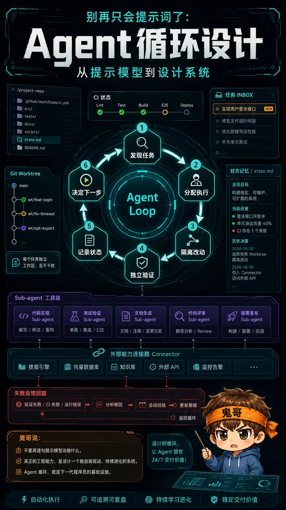
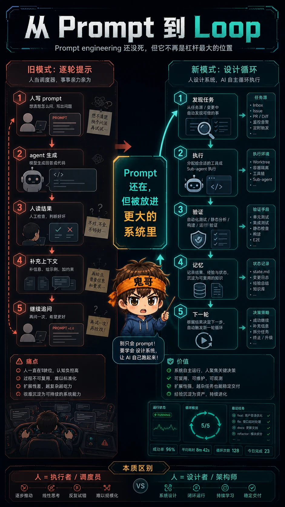
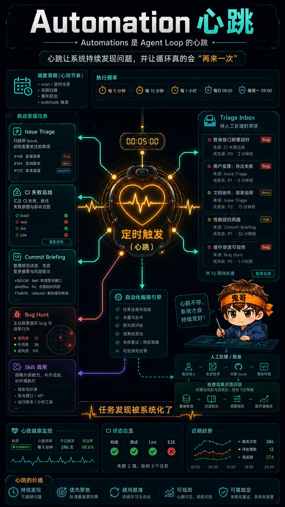
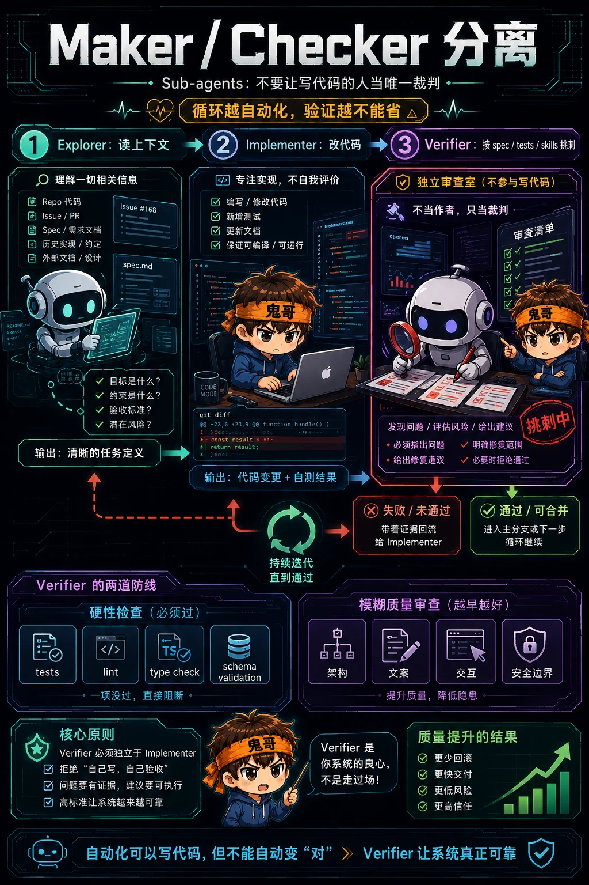
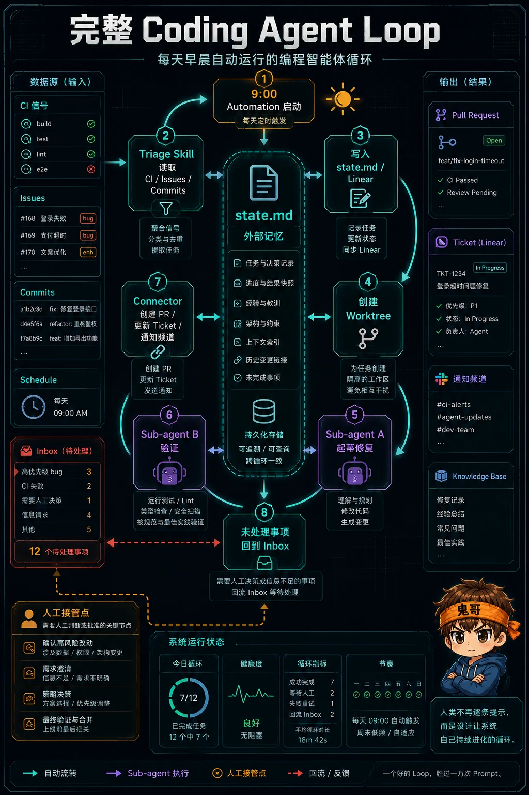

你以为 AI 编程的下一步是“写出更好的 prompt”？可能错了。

Addy Osmani 最近在 X 上写了一篇长文：[Loop Engineering](https://x.com/addyosmani/status/2064127981161959567)。他的判断很直接：**你不应该再只是提示 coding agent，而应该设计会提示 agent 的循环。**

这句话听起来像一句漂亮口号，但背后其实是 AI 编程工作流的重心迁移：从“人坐在驾驶位，一轮一轮指挥模型”，变成“人设计一个小系统，让它发现任务、分配任务、验证结果、记录状态，然后继续下一轮”。



---

## Prompt engineering 还没死，但它不再是杠杆最大的位置

过去两年，我们跟 coding agent 协作，大概是这个姿势：

```text
我写 prompt
  -> agent 生成代码
  -> 我读结果
  -> 我补充上下文
  -> agent 再改
  -> 我再验
```

这当然有效。到今天为止，**直接提示 agent 依然是最高性价比的日常操作**。

但它有个天花板：你始终是循环里的调度器。任务从哪里来、下一步做什么、做完怎么验、失败怎么记、明天怎么接着跑，全都靠你脑子里那条线牵着。

Addy 说的 loop engineering，本质上是把这条线从你的脑子里拿出来，做成外部系统：

```text
发现任务 -> 分配执行 -> 隔离改动 -> 独立验证 -> 记录状态 -> 决定下一步
```

Prompt 还是存在，但它被放回了一个更大的机器里。**你不再只是写一句话让 agent 干活，而是在设计 agent 干活的方式。**



---

## 一个 Agent loop 至少需要五个零件

Addy 把这个循环拆成五个核心零件，再加一个外部记忆层。

| 零件 | 作用 | 没有它会怎样 |
|---|---|---|
| Automations | 定时发现任务、触发运行 | 每次都要人手动想起要检查什么 |
| Worktrees | 让多个 agent 并行但互不踩文件 | 并发一开，代码库变事故现场 |
| Skills | 固化项目知识和工作约定 | 每次会话都从零猜你的项目习惯 |
| Plugins / Connectors | 接入真实工具和数据源 | agent 只能在文件系统里自言自语 |
| Sub-agents | 拆分执行者和验证者 | 写代码的人顺手给自己打满分 |
| Memory | 记录已做、待做、失败和下一步 | 模型每轮都忘，循环无法延续 |

这几个词看起来像产品功能列表，但组合起来才是重点。

单独看，automation 只是定时任务；worktree 只是 Git 技巧；skill 只是文档；connector 只是 MCP；sub-agent 只是多开一个模型。

但放在一起，它们变成了一种新的工作单元：**不是一个 agent，而是一条可以重复运行的工程流水线。**

---

## Automations 是心跳：它让循环真的会“再来一次”

循环和一次性任务最大的区别，不是复杂度，而是有没有心跳。

没有 automation，你只是今天心血来潮跑了一次 agent。  
有 automation，它明天还会来，后天还会来，出事时会把结果丢进你的 inbox。

Addy 举的例子很具体：

- 每天做 issue triage
- 总结 CI 失败
- 写 commit briefing
- 找出最近引入的 bug
- 定时运行某个 skill，而不是粘贴一大坨 prompt

这里的关键不是“自动化很酷”，而是**任务发现被系统化了**。

很多工程工作其实死在第一步：不是没人会修，而是没人持续看。CI 偶尔红一次、issue 堆一点、依赖慢慢旧一点、代码质量每天滑一点。人类对这种缓慢腐蚀很迟钝，循环不会。



---

## Worktrees 是并行的刹车系统

只要你让多个 agent 同时改同一个 repo，最先坏掉的通常不是模型能力，而是文件冲突。

两个 agent 同时改同一个文件，本质上和两个工程师同时改同一段代码一样：不是不能做，而是你必须有隔离边界。

Git worktree 的价值就在这里。每个 agent 在自己的 checkout、自己的 branch 里工作，改动不会直接踩到另一个 agent 的现场。

这让并行从“看起来很爽”变成“至少机械上可控”。

但别高兴太早。worktree 解决的是文件层面的碰撞，不解决人的 review 带宽。

你可以同时开 5 个 agent，但如果你只能认真 review 1 个 PR，那么系统吞吐量的瓶颈仍然是你。**并行不是免费午餐，它只是把瓶颈从执行转移到判断。**

---

## Skills 是意图的缓存

我越来越觉得，skill 最被低估的地方不是“复用提示词”，而是它把项目里的隐性规则变成了显性资产。

每个成熟项目都有一堆口头约定：

- 这个目录不能乱动
- 这个测试必须先跑
- 这个 API 不能破坏兼容性
- 这类 UI 不能做成营销页
- 我们上次踩过这个坑，所以现在不这么写

如果这些东西只存在于人的脑子里，agent 每次进来都会重新猜一遍。猜对了叫聪明，猜错了叫事故。

Skill 的意义是把这些判断写在外部，让 agent 每次运行都能读到。

这也是 loop engineering 里很关键的一点：**循环要长期跑，就不能每次都重新理解世界。** 它需要一套可积累、可维护、可版本化的项目知识。

---

## Connectors 让循环碰到真实世界

一个只能看本地文件的 agent，能做的事很有限。

真正有用的 loop 往往要碰到真实系统：

- GitHub issue 和 PR
- Linear / Jira ticket
- Slack / 飞书通知
- CI 日志
- 数据库查询
- 线上监控
- staging API

这就是 connector 的位置。MCP 这类协议的价值，不只是“让 agent 多几个工具”，而是让 loop 能把状态从真实工作流里拿进来，再把结果写回去。

差别很大：

| 普通 agent | Loop + connectors |
|---|---|
| “我建议你这样改” | 直接开 PR |
| “这个 issue 可能相关” | 自动链接 ticket |
| “CI 好像失败了” | 读取日志、定位原因、发修复分支 |
| “你可以通知团队” | CI 绿了以后发 Slack |

前者是助手，后者更像一个后台工作人员。

---

## Sub-agents：不要让写代码的人当唯一裁判

在无人值守循环里，最危险的一句话是：**“看起来完成了。”**

模型很擅长把自己刚刚做的事解释得很合理。它写了代码，它也知道自己想表达什么，所以它很容易忽略读者、测试、边界条件和真实需求。

所以 loop 里最值得花 token 的地方，往往是 maker / checker 分离：

```text
Explorer 负责读上下文
Implementer 负责改代码
Verifier 负责按 spec 和测试挑刺
```

Verifier 不一定总是另一个大模型。能用确定性检查的地方，应该优先用测试、lint、type check、schema validation。

但只要涉及模糊质量，比如架构是否过度、文案是否误导、交互是否符合用户习惯，一个独立的 sub-agent 就很值钱。

**循环越自动化，验证越不能省。** 因为你不在现场时，错误也会自动化。



---

## Memory 是循环的脊柱

Addy 在文里提到一个看起来很朴素、但非常重要的东西：外部记忆。

它可以是一个 Markdown 文件，也可以是 Linear board，甚至是一个很普通的状态表。关键是它必须活在单次对话之外。

原因很简单：模型会忘，repo 不会；聊天会结束，文件还在。

一个长期运行的 loop 至少要记住：

- 昨天发现了什么
- 哪些任务已经尝试过
- 哪些方案失败了
- 哪些检查通过了
- 哪些问题需要人类决策
- 下一轮应该从哪里继续

没有这个状态文件，所谓 loop 只是每天重复失忆。  
有了它，agent 才能在多次运行之间接力。

这也是我觉得很多 AI 自动化项目跑不久的原因：大家拼命优化 prompt，却没有给系统一个可靠的记忆脊柱。

---

## 一个真实 loop 可以长什么样

把这些零件拼起来，一个早晨自动运行的 coding loop 大概长这样：

```text
每天 9:00 automation 启动
  -> 调用 triage skill
  -> 读取昨天 CI、issues、recent commits
  -> 把发现写入 state.md 或 Linear
  -> 对值得处理的问题创建 worktree
  -> sub-agent A 起草修复
  -> sub-agent B 按项目 skill 和测试验证
  -> connector 创建 PR / 更新 ticket / 通知频道
  -> 未处理事项回到 triage inbox
```

你实际设计的是一条小型生产线。

最有意思的是，人类的工作没有消失，而是换了位置。你不再逐步提示每个 agent，而是在设计：

- 哪些任务值得自动发现
- 哪些检查必须硬性通过
- 哪些情况要中断给人
- 哪些状态要写下来
- 哪些权限不能交出去

这不是“少干活”那么简单。它更像从写脚本的人，变成设计操作系统的人。



---

## Loop Engineering 的风险：你会更快地失控

Addy 的文章里有个很重要的提醒：这东西还早，而且 token 成本、质量下降、slop 都是真问题。

我会把风险拆成三类。

第一，**验证风险**。  
没有可靠 verifier 的 loop，只是在自动制造自信的错误。

第二，**理解债务**。  
loop 帮你产出越快，如果你不读、不理解、不复盘，你和代码库之间的距离就会越拉越大。

第三，**认知投降**。  
最舒服的姿势是“让它跑吧”。但如果你只是为了逃避判断而设计 loop，它会把你的懒惰放大成系统性风险。

这就是 loop engineering 比 prompt engineering 更难的地方：prompt 错了，通常只坏一次；loop 错了，会重复坏。

---

## Takeaway：先设计循环，再让 agent 跑

我觉得 Addy 这篇长文最值得带走的，不是某个工具功能，而是一种工作顺序：

1. 先定义循环要解决什么问题。
2. 再决定它如何发现任务。
3. 给每个执行单元分配隔离环境。
4. 把项目知识写成 skill。
5. 用 connector 接入真实工具。
6. 用 verifier 或 sub-agent 检查结果。
7. 把状态写到对话之外。
8. 最后才是：让 agent 开始跑。

换句话说，**不要一上来就问“我该怎么 prompt 它”。先问：这个循环的输入、状态、验证、退出条件和人工接管点在哪里？**

Loop engineering 不是把工程师拿掉。恰恰相反，它要求工程师更像工程师：少一点临场催促，多一点系统设计；少一点“帮我改一下”，多一点“这条生产线为什么可信”。

Build the loop. Stay the engineer.

---

## 参考资料

- Addy Osmani: [Loop Engineering](https://x.com/addyosmani/status/2064127981161959567)
- 鬼哥：[Loop Engineering：Agent 不是跑一次，而是活在循环里](/p/loop-engineering-stack/)
- 鬼哥：[别再调教模型了：聪明人都在设计循环](/p/designing-agent-loops/)
- 鬼哥：[Harness Engineering：当模型够强，系统设计成为胜负手](/p/harness-engineering/)

