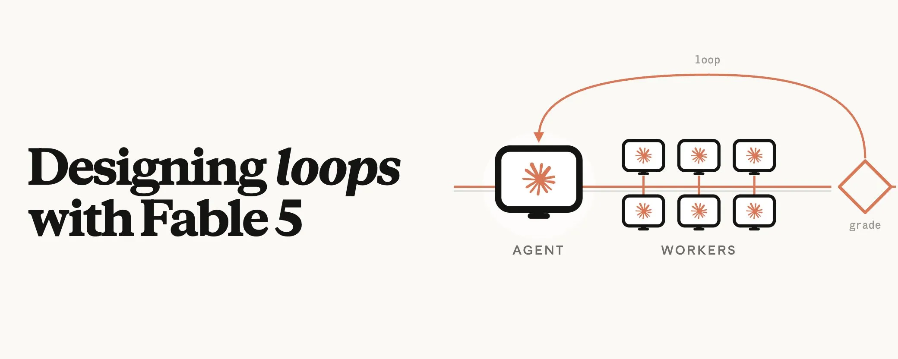
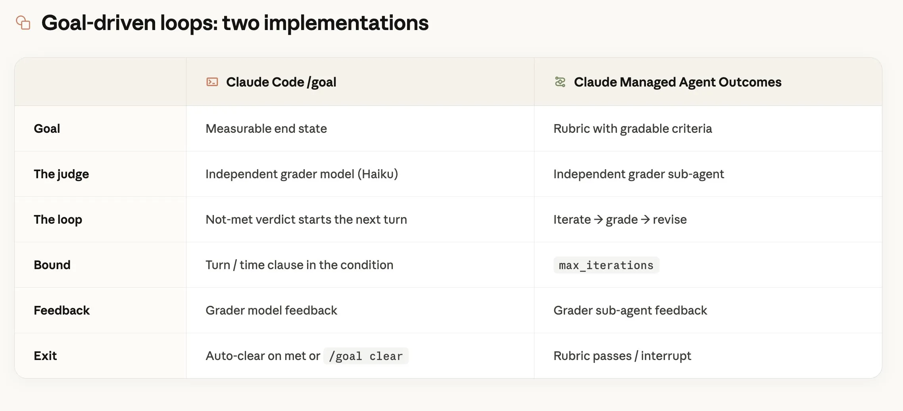
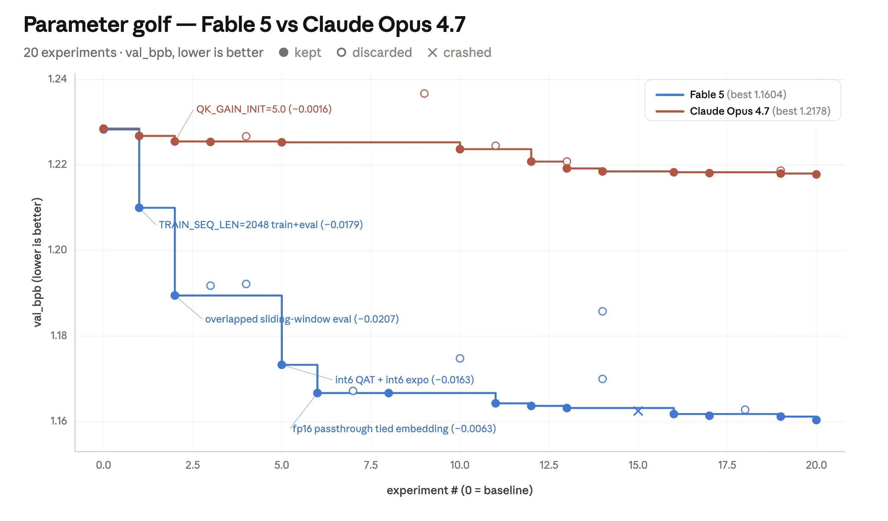
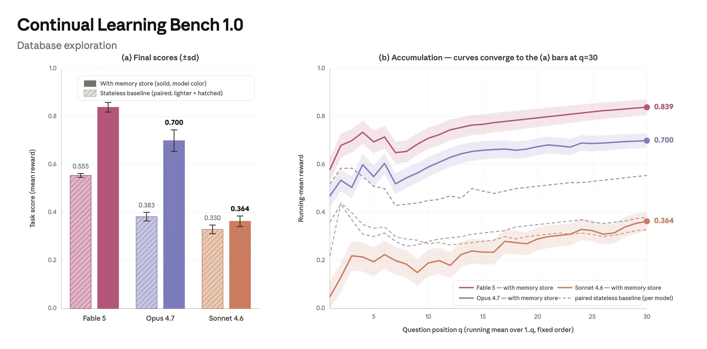

Anthropic 的工程师 Boris Cherny 有一句话被反复引用：**「我的工作就是写循环（My job is to write loops）。」**

这句话第一次听像段子，听第二遍你会发现它在描述一个范式转移。过去我们用大模型，本能是去「调教」它——改 prompt、加 few-shot、写一长串「你必须……你不能……」的规则。但当模型本身已经足够强，真正决定产出质量的，往往不再是你怎么*指挥*它，而是你给它套了一个什么样的**循环**。

Anthropic 的 Lance Martin 最近分享了他用新一代 Claude 模型（内部代号 Fable 5，Mythos 级别）做实验的两个心得。两个都不是 prompt 技巧，而是关于怎么**设计循环**。下面我把它整理成中文，并加上我自己的一些体感。

---

## 为什么是「循环」，而不是「prompt」

先说清楚这个范式差在哪。

传统用法是**一次性**的：你写一个尽可能完美的 prompt，模型吐一个答案，好不好全看这一发。这本质上是在赌模型的「直觉」。

循环用法是**迭代式**的：你不再追求一发命中，而是给模型套一个「跑 → 拿反馈 → 自我纠正 → 再跑」的环，让它在一个评判标准（goal 或 rubric）上不断爬坡，直到达标才停。

| | 一次性 prompt | 设计循环 |
|---|---|---|
| 你优化的对象 | prompt 本身 | 环境与反馈信号 |
| 模型的角色 | 一次输出 | 反复试错、自我修正 |
| 决定质量的关键 | 你的措辞 | 评判标准设计得好不好 |
| 适合的任务 | 简单、确定性强 | 长程、可验证、能爬坡 |

Claude Code 里的 `/goal` 和 Claude Managed Agents（CMA）里的 Outcomes，就是把这套通用配方变成了你能直接用的原语。**它们的本质都是：给环境注入一个反馈信号，让模型自己跟这个信号死磕。**

---

## 第一招：自我纠正循环

新模型一个被反复验证的特性是——**它特别擅长在循环里自我纠正**。一个设计良好的 goal 或 rubric，相当于给 Claude 运行的环境加了一个反馈源：它跑一轮、通过 goal/rubric 收集反馈、修正自己，然后继续，直到标准被满足。

这里有一个**最容易被忽略、却最关键的点：谁来当裁判。**

直觉上你可能觉得，让模型自己检查自己的输出不就行了？但 Anthropic 的实验反复发现，**模型在「自我批判」上是有系统性缺陷的**——它很难客观地挑自己输出的毛病（Prithvi Rajasekaran 在 Anthropic 工程博客里专门写过这个现象）。

解法是：**用一个独立的 verifier 子 agent 来打分，而不是让主 agent 自我批判。** 因为打分是在一个**独立的上下文窗口**里完成的，不受主 agent 思路的污染，效果明显更好。CMA 的 Outcomes 就是帮你自动 spawn 一个 grader 子 agent 来做这件事。

下面这张表把两种实现方式拆得很清楚——无论是 Claude Code 的 `/goal` 还是 CMA 的 Outcomes，骨架都是一样的五件套：目标、裁判、循环、边界、退出条件。

注意「裁判（The judge）」这一行：`/goal` 用一个独立的 grader 模型（Haiku），CMA 用一个独立的 grader 子 agent——**两者都刻意把评判放到了主流程之外。** 这不是实现细节，这是这套方法能 work 的核心原因。

### Parameter Golf：一个能跑 8 小时的玩具实验

Lance 用了一个开源的 ML 工程挑战 **Parameter Golf** 来测试：在 8 张 H100 上、10 分钟内，训练出一个能塞进 16MB 的最强模型。

这个挑战很像 Karpathy 的 autoresearch 项目——它考验的不是模型会不会写代码，而是一个 agent 能不能**像研究员一样工作**：改训练代码（一个 `train_gpt.py` 文件）、启动训练、轮询日志、读分数、然后决定下一个实验做什么。这是一个典型的长程、可验证、能爬坡的任务，正好是循环的主场。

他给了一个有 9 条可检查标准的 rubric（比如「跑一个 baseline」「跑 20 个实验」），让 Parameter Golf 最多跑 8 小时，由 Outcomes 的 grader 确认所有标准都满足后才允许 Claude 停手。结果：

**Fable 5 把训练 pipeline 优化了约 6 倍于 Opus 4.7。** 但比这个数字更有意思的是两个模型的**实验风格差异**：

- **Fable 5** 敢下「结构性」的大注（比如改架构：`TRAIN_SEQ_LEN=2048` 带来 −0.0179、overlapped sliding-window eval 带来 −0.0207），而且有韧性——它甚至顶着一次量化回退继续推，最后拿到了最大的一次提升。
- **Opus 4.7** 第一个实验拿了个小赢，然后**几乎所有后续实验都在复制同一个模板**：调一个标量、测一下、有正收益就留下。稳，但天花板低。

看图里那条蓝线（Fable 5）是怎么一个台阶一个台阶往下砸的，红线（Opus 4.7）则基本是平的——这就是「敢赌结构性改动」和「只敢调标量」的区别。**循环给了模型试错的空间，而更强的模型会用这个空间去下更大的注。**

---

## 第二招：记忆——跨会话的外层循环

如果说自我纠正是**单次会话内**的内层循环，那记忆就是**跨会话**的外层循环：Claude 在一次会话里把经验写进记忆，这些记忆能在未来的会话里被取回。

Lance 用 Continual Learning Bench 1.0 里的一个任务来测：给 agent 一个 SQL 数据库，让它回答一连串问题。**每个问题是一个独立的 agent 会话**，会话之间靠记忆来传递经验。他用 CMA 的记忆功能给每个 agent 挂载一个可跨会话共享的文件系统。

他观察到，**有效使用记忆是有梯度的**，从低到高是这么一条进阶链：

1. **失败（fail）**：做错了，把它记下来
2. **调查（investigate）**：在继续之前，搞清楚为什么错
3. **验证（verify）**：把诊断变成一个被核实过的事实
4. **提炼（distill）**：把验证结果升华成一条通用规则
5. **查阅（consult）**：下次直接读这条规则，而不是重新推导一遍

三个模型卡在了不同的台阶上，差距非常直观：

| 模型 | 卡在哪一步 | 表现 |
|---|---|---|
| **Sonnet 4.6** | 第 1 步（失败） | 记忆只是一堆失败笔记和没验证的猜测（「也许是 prc 不是 prc_usd？」），几乎不回头查阅。得分 0.330，跟无记忆的 baseline 几乎没差 |
| **Opus 4.7** | 第 3 步（验证） | 会建带不确定标记的 schema 参考（「可能是以分为单位？待验证」），但验证覆盖率低，只有 7–33%（中位数约 17%）。得分 0.700 |
| **Fable 5** | 走完全程 | 最强的几次运行里验证覆盖率高达 73%（30 题里验证了 22 题），并能把学到的东西提炼成通用规则，反哺未来任务。得分 0.839 |

看右边那张收敛曲线特别有感觉：**带记忆的实线和无记忆的虚线，差距随着问题数累积越拉越大。** 记忆不是「记下来」就完事了，关键在于你的 agent 能不能走完「失败 → 调查 → 验证 → 提炼 → 查阅」这条链。**Sonnet 4.6 停在记笔记，Fable 5 在建知识库——这就是 0.330 和 0.839 的差距。**

一个实操提醒：如果你的模型只走到第 1 步（像 Sonnet 4.6 那样），你需要给它**针对具体任务的记忆指令**来往上推。记忆这东西，模型越弱越需要你手把手教它怎么用。

---

## 我的体感：这其实是在重新分配「智能」

整理完这两个实验，我自己最大的感受是：**Agent 工程正在从「怎么问」转向「怎么搭环境」。**

过去一年我自己用 Claude Code 的体验也印证了这点。早期我花大量时间打磨 prompt，恨不得把每一步都写死。但模型一强，这套做法的边际收益就崩了——你写的规则越细，反而越限制它。真正让产出质变的，是另外两件事：

- **给它一个可验证的目标**，然后闭嘴让它自己跑。`/goal` 这类原语的价值就在这——你定义「什么叫做完了」，剩下的交给循环。
- **让它管理自己的上下文**，包括往记忆里写、从记忆里读。你不需要每次都把背景重新喂一遍。

Lance 那句话我很认同：**与其直接 prompt 和 steer 模型，不如设计循环，让模型自己根据环境反馈做自我纠正（比如 `/goal` 或 Outcomes），并管理自己的上下文（比如记忆）。**

换个角度说，你作为工程师的「智能」，正在从「写在 prompt 里」迁移到「写在循环结构里」。前者是一次性的指令，后者是可复利的系统。

---

## Takeaway：下次构建 Agent，先问自己四个问题

如果你也想用循环的思路构建 agent，把下面四个问题贴在显示器上：

1. **目标可验证吗？** 能不能写出一个 rubric / goal，让一个独立的裁判明确判断「做完了没有」？如果不能，先把任务拆到能验证为止。
2. **裁判独立吗？** 千万别让主 agent 自我批判。用一个独立的 grader 模型或子 agent，在干净的上下文里打分。
3. **循环有边界吗？** `max_iterations`、时间上限、退出条件——别让它无限跑。
4. **记忆走完链路了吗？** 检查你的 agent 是停在「记笔记」，还是真的在「失败 → 调查 → 验证 → 提炼 → 查阅」。停在第一步的记忆约等于没有。

想上手的话，可以直接问最新版的 Claude Code——它能用内置的 `/claude-api` skill 告诉你 Fable 5 的 prompting 最佳实践、`/goal`、Claude Managed Agents 这些 API 特性怎么用。

说到底，**写 prompt 是在赌一次直觉，设计循环是在搭一套能自我改进的系统。** 模型越强，后者的回报越高。

---

## 参考资料

- 原推文：[Lance Martin (@RLanceMartin) — Designing loops with Fable 5](https://x.com/RLanceMartin/status/2064397389189071163)
- Parameter Golf：开源 ML 工程挑战（16MB 模型，10 分钟，8×H100）
- Continual Learning Bench 1.0：跨会话记忆基准
