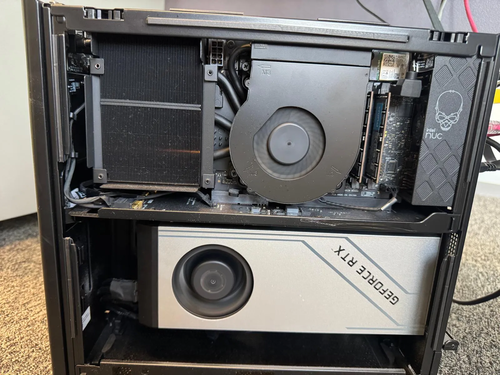
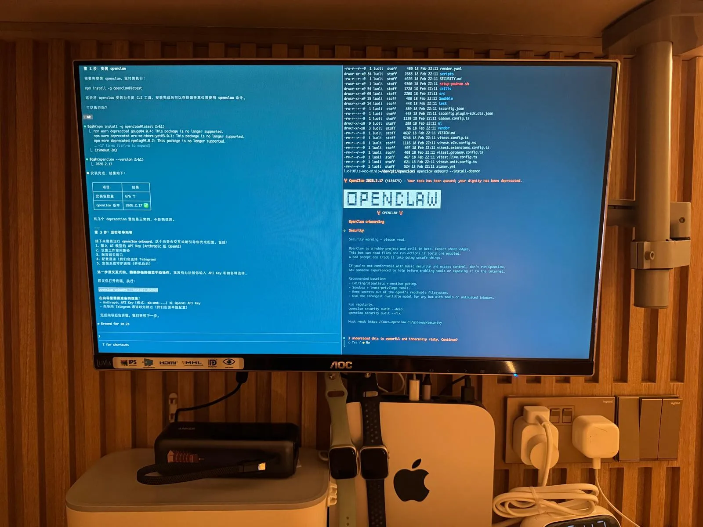
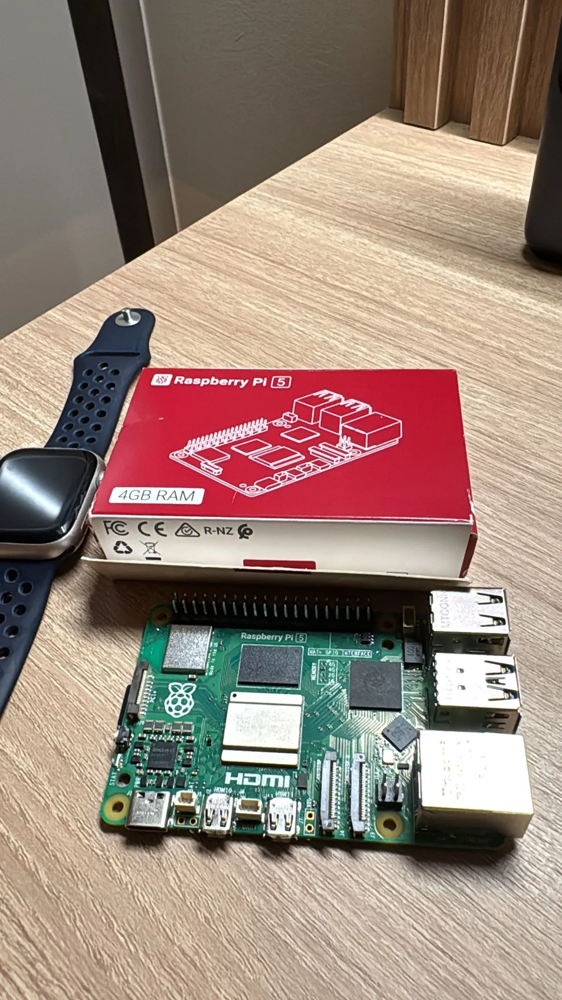
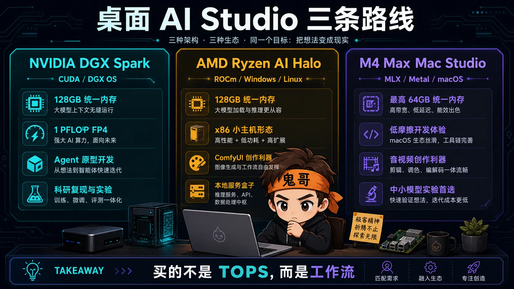
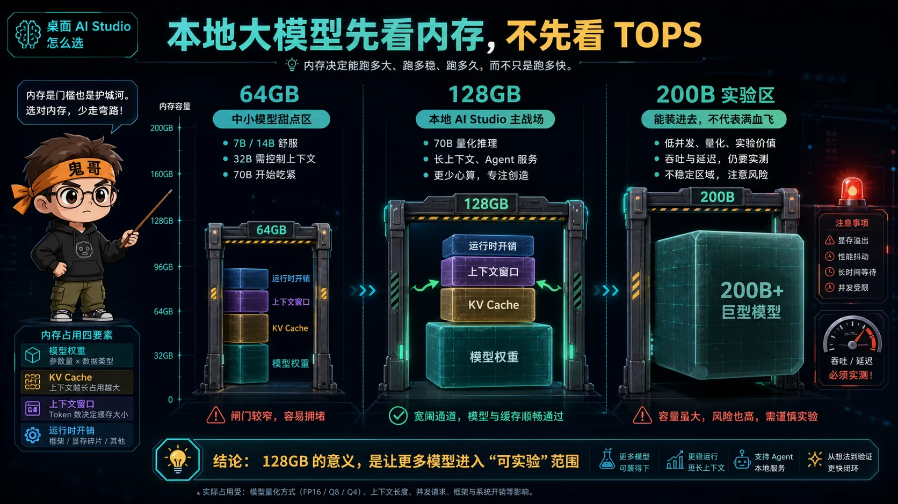
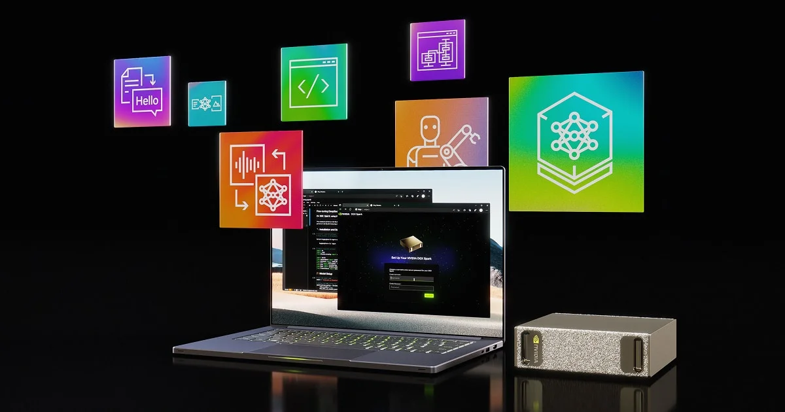
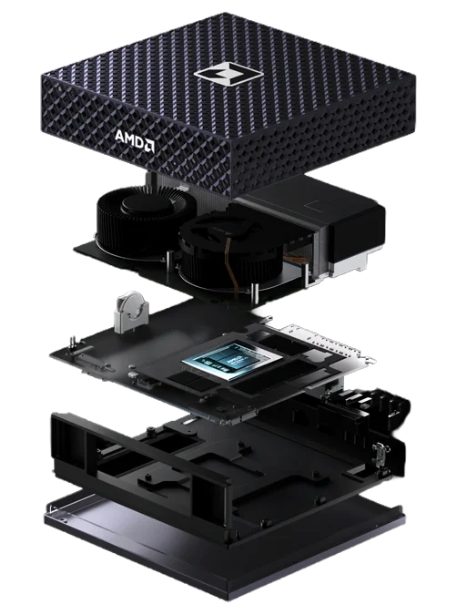
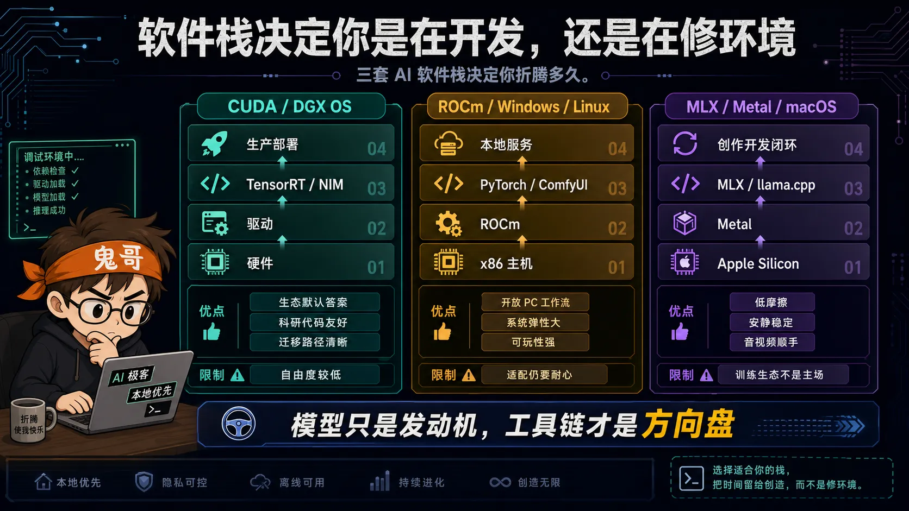
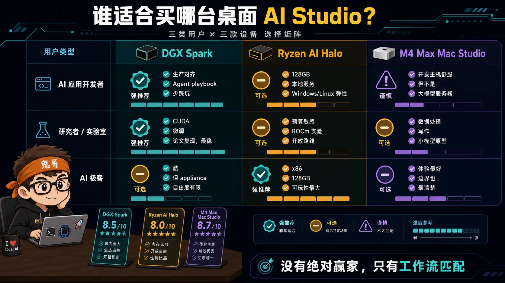

买桌面 AI 机器，最容易被一个数字骗：TOPS、TFLOPS、PFLOPS，听起来都像能把模型原地起飞。现实是，AI 开发者真正卡住的往往不是峰值算力，而是 **内存够不够、软件栈顺不顺、模型能不能跑、跑起来以后能不能折腾**。

鬼哥最近就被这个问题挠得有点坐不住。

我桌上现在已经有三台风格完全不同的本地 AI 设备：一台 **M4 Max Mac Studio/Mac mini 形态的 Apple Silicon 小主机**，平时负责写代码、跑轻量本地模型、剪音视频、做各种 AI 开发实验；一台自己组的 **GeForce RTX 4090 台式机**，专门拿来折腾 Ollama、本地模型推理、Agent 接入和性能测试；还有一块 **Raspberry Pi 5 小卡**，更多是拿来提醒自己：边缘 AI 不是 PPT，它最后真的要落到这些又小又抠门的设备上。

4090 那台机器我之前专门写过一篇实测：[《一张 4090 跑 Gemma4 26B：用 Ollama 搭本地 AI 开发环境实测》](/p/ollama-local-dev/)。结果挺有意思：Gemma4 26B 在那台机器上持续输出大约 **160 tokens/s**，模型加载后显存占用约 **24.5GB**，长输出功耗能到 **260W+**。这已经不是“本地模型能不能跑”的问题，而是“本地模型怎么接进真实开发工作流”的问题。

Mac 这边则完全是另一种体验：它不一定是大模型推理冠军，但它安静、稳定、顺手。写博客、跑 Claude/Codex、剪视频、处理图片、做前端 demo、顺手跑个 llama.cpp 或 MLX 模型，整个工作流几乎没有摩擦。缺点也很诚实：一碰到大模型、CUDA-only 项目、训练脚本复现，它就会提醒你“这里不是我的主场”。

树莓派更像一个现实锚点。它告诉我：AI 硬件不是只有“越大越好”这一条路。很多时候你真正想要的是低功耗、常开、便宜、可部署，而不是一个会把房间变暖的模型发动机。

所以，当 NVIDIA DGX Spark 和 AMD Ryzen AI Halo 相继把“桌面级个人 AI 工作站”摆上台面时，我第一反应不是“哇，又来了两台神机”，而是：**它们到底能不能补上我现有三台设备各自的短板？**

更麻烦的是，Apple 这边我还在翘首以盼，眼泪汪汪地等 M5 Mac mini/Mac Studio 更新。于是这篇文章就变成了一次很现实的调研：不是纯参数表，也不是厂商发布会复读，而是从一个极客的桌面出发，看看 DGX Spark、Ryzen AI Halo 和 M4 Max Mac Studio 到底分别适合谁。

NVIDIA DGX Spark、AMD Ryzen AI Halo、M4 Max Mac Studio，表面上都叫桌面级 AI Studio。其实它们不是三台同类机器，而是三种路线：

- **NVIDIA**：把数据中心 AI 栈压到桌面，核心卖点是 CUDA 生态和 DGX 软件体验。
- **AMD**：用 x86 APU + ROCm + Windows/Linux 抢本地 AI 开发者，核心卖点是开放 PC 工作流和 128GB 统一内存。
- **Apple**：把成熟创作工作站顺手变成 AI 开发机，核心卖点是安静、省心、macOS 体验，但不是大模型怪兽。

---

## 先看规格，但别被规格牵着走

为了避免玄学，先把官方能确认的硬指标摆出来。这里的重点不是谁的数字最大，而是这些数字分别服务什么场景。

| 机器 | 核心芯片 | 统一内存 | 内存带宽 | AI/图形算力口径 | 系统 | 典型定位 |
|---|---|---:|---:|---|---|---|
| **NVIDIA DGX Spark** | GB10 Grace Blackwell | 128GB LPDDR5x | 273GB/s | 最高 1 PFLOP FP4 | DGX OS | 本地 Agent、LLM 推理、CUDA 原型 |
| **AMD Ryzen AI Halo** | Ryzen AI Max+ 395 | 128GB LPDDR5x | 官方页面未列 | 60 FP16 TFLOPS GPU + 50 TOPS NPU | Windows 或 Linux | ROCm、本地 LLM、ComfyUI、PC AI 开发 |
| **M4 Max Mac Studio** | M4 Max | 36GB，最高 64GB | 410GB/s，最高 546GB/s | 40 核 GPU + 16 核 Neural Engine | macOS | 开发主机、创作工作流、中小模型实验 |

如果只看表格，你可能会得出一个很粗暴的结论：DGX Spark 和 Ryzen AI Halo 是本地大模型机器，M4 Max Mac Studio 是“顺便跑 AI”的工作站。

这个结论大体没错，但还不够精确。

更准确的说法是：

> **DGX Spark 买的是 NVIDIA AI 栈，Ryzen AI Halo 买的是大内存 PC 路线，M4 Max Mac Studio 买的是低摩擦开发体验。**

这三句话比任何 TOPS 数字都重要。

---

## 第一层分水岭：本地大模型先看内存

本地 LLM 的第一堵墙不是算力，是内存。

一个 70B 模型即使用 4-bit 量化，权重也常常要三四十 GB，再加上 KV cache、上下文、运行时开销、并发请求，很快就会把 64GB 机器逼到墙角。到了 120B、200B 这种级别，128GB 统一内存才开始有“能把东西装进去”的讨论资格。

这就是 DGX Spark 和 Ryzen AI Halo 的共同点：它们都把 **128GB 统一内存** 放到了桌面小机器里。

NVIDIA 官方给 DGX Spark 的定位很明确：128GB coherent unified system memory，可以在桌面运行最高 200B 参数模型的开发和测试工作，也可以微调最高 70B 参数模型。这个说法要谨慎理解：它不是承诺任何 200B 模型都能满血高吞吐跑，而是在告诉你，**内存容量已经足够让这类模型进入本地实验范围**。

AMD 的路线更像“PC 阵营的反击”。Ryzen AI Halo 开发平台同样是 128GB LPDDR5x 统一内存，并且官方强调 Windows 或 Linux 双系统、完整 ROCm 支持。对很多极客来说，这比 DGX OS 更有吸引力：你可以把它当本地 AI 服务器，也可以把它当一台能跑 Windows 软件的高端小主机。

M4 Max Mac Studio 的问题就在这里。M4 Max 版本最高 64GB 统一内存，带宽最高 546GB/s，带宽很漂亮，但容量不在一个级别。对于 7B、14B、32B 量化模型，它可以玩得很舒服；但如果你的目标是长期折腾 70B 以上模型，64GB 会让你不停做取舍。

一个极客版判断：

| 场景 | 64GB Mac Studio | 128GB DGX Spark / Ryzen AI Halo |
|---|---|---|
| 7B/14B 本地助手 | 很舒服 | 轻松 |
| 32B 量化模型 | 可用，需控制上下文 | 更从容 |
| 70B 量化推理 | 能折腾，但容易受限 | 进入主战场 |
| 70B 微调/LoRA | 不适合作为主力 | DGX Spark 更对口 |
| 120B/200B 实验 | 基本不是甜点区 | 有实验价值 |

所以，如果你关心的是“我能不能在桌面上把更大的模型塞进去”，答案很直接：**128GB 机器先赢一半。**

这也是我看 DGX Spark 和 Ryzen AI Halo 会心痒的原因。4090 台式机的推理速度很香，但显存墙是真实存在的；Mac 的统一内存体验很顺，但 M4 Max 的上限又不够“放肆”。128GB 统一内存的吸引力，不是参数洁癖，而是它允许你少做很多“这个模型能不能塞进去”的心算。

---

## 第二层分水岭：软件栈决定你折腾多久

AI 硬件最残酷的地方在于：跑分截图很好看，环境配置很难看。

同样是本地 AI Studio，三家的软件体验差异非常大。

### DGX Spark：CUDA 是护城河，也是笼子

DGX Spark 最大的优势不是 1 PFLOP FP4，而是 **NVIDIA AI 软件栈默认站在你这边**。

CUDA、TensorRT、NIM、NVIDIA AI Enterprise、DGX OS、开发者论坛、官方 playbook，这些东西加起来，意味着你遇到问题时更容易找到“前人已经踩过的坑”。如果你的工作流最后要上 NVIDIA 数据中心或云 GPU，DGX Spark 的意义就更明显：它是一台桌面上的原型机。

我在 4090 上折腾 Ollama、Codex、Claude Code 和 Hermes 时，最大的感受就是：**模型速度只是第一层，工具链稳定性才是第二层**。同一个本地模型，Claude Code 能顺利读文件，Codex 在某些 Linux sandbox 环境里会被权限卡住。这个体验会让人更理解 DGX Spark 的价值：它卖的不是“我也有一颗 GPU”，而是尽量把硬件、驱动、框架、playbook 和支持路径绑成一套。

它的限制也同样清楚：DGX Spark 官方规格写的是 DGX OS。你不是在买一台泛用 PC，而是在买一台 NVIDIA 定义好的 AI appliance。对于研究者和企业开发者，这是省心；对于喜欢乱装系统、乱插外设、乱改内核的极客，这可能会有点憋。

### Ryzen AI Halo：ROCm 的机会，也是变量

AMD 的牌面是：Windows/Linux + ROCm + 128GB 内存 + x86。

这很诱人。你可以在 Linux 上跑模型，在 Windows 上跑创作和开发工具，还能享受普通 PC 生态的弹性。AMD 页面还直接把自己和 DGX Spark 对比，脚注里写到：测试使用预生产 Ryzen AI Halo、128GB LPDDR5x、Linux OS，对比 DGX Spark，并列出 AMD Ryzen AI Halo $3999、DGX Spark $4699 的零售价。

但 ROCm 仍然是变量。它比前几年成熟太多，很多 PyTorch 和推理框架已经能跑，但 AI 生态的默认答案依然常常是 CUDA。你要有心理准备：同一个模型，同一个项目，NVIDIA 用户可能 `pip install` 后直接跑，AMD 用户可能要查 issue、换 wheel、等适配。

这不是说 AMD 不值得买，而是它更适合 **愿意换性能/价格/开放性，但能接受折腾成本的人**。

### Mac Studio：最舒服，但不是最开放

Apple 的 AI 开发体验很奇特：它不是最强的，但往往是最顺的。

如果你的日常是写代码、跑中小模型、做 demo、剪视频、处理图片、调 UI、用 MLX 或 llama.cpp 跑本地模型，Mac Studio 会非常舒服。它安静、省电、系统稳定、开发工具成熟，而且 M4 Max 的 CPU/GPU/媒体引擎组合对创作者非常友好。

这也是我现在离不开 Mac 的原因。很多 AI 项目不是一天 24 小时都在跑模型，大量时间其实是在写胶水代码、改提示词、整理素材、剪一段 demo 视频、处理博客图片、部署网页、调试工具链。这个阶段 Mac 的低摩擦体验非常强：你不会因为驱动、风噪、电源、桌面空间这些小事分心。

问题是，一旦你进入主流深度学习训练、CUDA-only 项目、复杂推理优化、企业级 GPU 部署对齐，macOS 就会露出边界。Metal、MLX、Core ML 都很好，但它们不是 AI 研究社区的默认地面。

如果用一句话概括：

| 软件栈 | 最舒服的用户 | 最痛的地方 |
|---|---|---|
| **CUDA / DGX OS** | 想和 NVIDIA 生产环境对齐的人 | 泛用 PC 自由度低 |
| **ROCm / Windows / Linux** | 喜欢开放硬件和 PC 工作流的人 | 生态适配仍需耐心 |
| **MLX / Metal / macOS** | 需要一台安静全能开发主机的人 | 大模型和训练生态不是主场 |

---

## 第三层分水岭：你到底要跑什么

“AI 开发者”这个词太宽了。写 RAG 应用、做模型微调、玩 ComfyUI、跑机器人仿真、做科研复现实验，根本不是一类需求。

下面按真实工作流拆。

### 1. 本地 LLM 推理和 Agent 开发

如果你要做的是本地 Agent、RAG、长上下文代码助手、私有知识库问答，DGX Spark 和 Ryzen AI Halo 明显更像主力机器。

DGX Spark 的优势是 NVIDIA 官方已经把“本地自主 Agent”写进产品定位。它有 128GB 内存、NVIDIA 软件栈和面向 Agentic workload 的 playbook。你想做的是“本地先跑，未来迁到 NVIDIA 云或数据中心”，DGX Spark 的路径更直。

Ryzen AI Halo 的优势是自由度和价格。AMD 官方把它定位成 AI developer platform，而且支持 Windows/Linux。你可以把它放在桌上当小服务器，也可以 SSH 进去跑服务，还可以接普通 PC 工作流。对独立开发者和极客来说，这种弹性很香。

Mac Studio 不是不能做 Agent。相反，很多开发者会更喜欢在 macOS 上写代码、调工具、跑本地小模型。只是当 Agent 需要更大模型、更长上下文、更高并发时，M4 Max 的 64GB 上限会让它更像“开发控制台”，而不是“模型发动机”。

我的实际分工大概是这样：Mac 负责“人机交互”和日常开发，4090 负责“重推理”和性能测试。如果本地模型要长期作为服务跑，我更愿意让它待在一台可以 SSH、可以监控、可以随时重启的盒子里，而不是占着我的主力开发桌面。按这个逻辑，Ryzen AI Halo 这种 128GB 小盒子会非常诱人；DGX Spark 则更像“如果我要认真走 NVIDIA Agent 路线，就别自己东拼西凑了”。

### 2. 微调、LoRA 和科研复现

这一类需求更偏向 DGX Spark。

NVIDIA 官方直接写了 Fine-Tuning：用 128GB 统一内存微调最高 70B 参数模型。这里最关键的不是一句营销文案，而是它背后的现实：大量训练、微调、量化、推理优化工具默认优先支持 CUDA。

Ryzen AI Halo 也能做一部分微调和实验，尤其是 ROCm 支持越来越完整之后。但如果你是研究者，目标是快速复现论文、跑开源训练脚本、少改代码，CUDA 仍然是阻力最小的路线。

Mac Studio 适合做算法原型、数据处理、小模型实验、MLX 生态尝鲜，但不适合作为“我要复现各种 GitHub 训练项目”的唯一主机。你当然可以折腾，但很多时候不是硬件不行，是生态把你绕远了。

### 3. ComfyUI、图像生成和多模态玩法

这个场景 AMD 反而很有看点。

AMD 页面把 ComfyUI、Visual Studio Code、Python 等预装/同步工具放进 Ryzen AI Halo 的开发者体验里，并且官方测试脚注覆盖了 Stable Diffusion XL、Flux、Qwen Image、Wan 等图像和视频相关工作负载。这里要注意：厂商自测不能当第三方基准，但至少说明 AMD 非常清楚它要争夺哪类用户。

NVIDIA 当然也强，尤其是各种 CUDA 优化的图像生成工具链仍然更成熟。DGX Spark 的问题不是能力，而是“值不值”：如果你的主要玩法是 ComfyUI 和图片生成，买 DGX Spark 可能有点像为了煎蛋买实验室设备。

Mac Studio 的优势在创作闭环：图片、视频、剪辑、设计、开发都在一台安静机器上完成。它不一定是生成速度冠军，但它可能是最不打断创作流的机器。

我自己的感受是：音视频和内容生产这类任务，**峰值性能不是唯一指标，工作流连续性更重要**。一段视频从素材整理、脚本、配音、剪辑、封面、发布，中间会不断在浏览器、编辑器、终端、设计工具之间切换。Mac 在这里很舒服。4090 更像一个加速器：当你明确知道要批量生成、批量推理、批量转码时，把任务扔给它；但日常创作的主控台，我还是更愿意放在 Mac 上。

### 4. 机器人、边缘 AI 和硬件项目

这类场景 DGX Spark 的 NVIDIA 生态优势最明显。

NVIDIA 官方明确提到 Isaac、Metropolis、Holoscan 等边缘应用框架。你如果做机器人、视觉检测、边缘推理、智能摄像头原型，NVIDIA 从桌面到 Jetson 到数据中心的生态连贯性很强。

AMD Ryzen AI Halo 也能做边缘 AI 原型，但它更像“高性能 PC 盒子”。Mac Studio 则适合作为开发主机和可视化工作站，而不是硬件生态中心。

树莓派 5 在这里给我的提醒很直接：边缘设备上最稀缺的不是“能不能跑一个模型 demo”，而是功耗、散热、常开稳定性、部署维护和成本。桌面 AI Studio 如果只是跑分强，未必能帮助你真正理解边缘场景；但如果它能让你快速训练、量化、测试，再把结果下放到小设备，那才是完整链路。

---

## 价格可以看，但别只看价格

按 AMD 官方脚注，2026 年 5 月测试口径里，Ryzen AI Halo 零售价为 **$3999**，DGX Spark 零售价为 **$4699**。Apple 的 M4 Max Mac Studio 官方规格页能确认配置，但价格会随芯片、内存、存储和地区变化，实际应以 Apple 配置页为准。

但这篇文章不建议把价格当第一决策因子。

原因很简单：对 AI 开发者来说，真正贵的不是多花几百美元，而是 **买回来以后三个月都在和驱动、依赖、模型格式、内存限制较劲**。

更合理的价格问题应该这样问：

| 你真正购买的是 | 应该问的问题 |
|---|---|
| DGX Spark | 我是否需要 CUDA/DGX/NVIDIA 生产环境一致性？ |
| Ryzen AI Halo | 我是否愿意用折腾成本换 128GB、x86 和 Windows/Linux 弹性？ |
| M4 Max Mac Studio | 我是否更需要一台舒服的主力开发/创作机，而不是最大模型机器？ |

如果答案是“我要少踩坑，跟 NVIDIA 生产栈对齐”，DGX Spark 的溢价有意义。

如果答案是“我要一台能跑大模型、能装 Windows/Linux、还能当 PC 用的极客盒子”，Ryzen AI Halo 更有吸引力。

如果答案是“我每天要写代码、剪视频、做产品 demo，偶尔跑本地模型”，Mac Studio 可能才是最理性的选择。

---

## 三类人怎么选

### AI 应用开发者

你关心的是 RAG、Agent、私有知识库、本地 API、开发效率。

我的排序：

1. **Ryzen AI Halo**：如果你愿意折腾 ROCm，它的 128GB 内存和 Windows/Linux 弹性很适合做本地 AI 服务盒子。
2. **DGX Spark**：如果你的应用未来要上 NVIDIA GPU，或者你需要 CUDA/NIM/DGX playbook，优先选它。
3. **M4 Max Mac Studio**：适合作为开发主机，不适合作为大模型主力推理服务器。

鬼哥经验：如果你的开发工作流已经像我一样被 Mac 绑住，不一定要把“主力开发机”和“本地模型服务器”合并成一台。更舒服的架构反而是：Mac 负责写代码和调产品，旁边放一台 128GB AI 小盒子长期跑模型服务。

### 研究者和实验室

你关心的是论文复现、微调、训练脚本兼容、长期维护。

我的排序：

1. **DGX Spark**：CUDA 生态仍然是研究代码的默认路径，少改代码就是生产力。
2. **Ryzen AI Halo**：适合预算敏感、愿意参与 ROCm 生态、需要 Windows/Linux 弹性的团队。
3. **M4 Max Mac Studio**：适合数据处理、写作、可视化、小模型原型，不建议作为唯一 AI 计算节点。

### AI 极客

你关心的是可玩性、模型规模、系统自由度、折腾空间。

我的排序反而会变：

1. **Ryzen AI Halo**：x86、128GB、Windows/Linux、ROCm，能折腾的面最大。
2. **DGX Spark**：如果你想玩 NVIDIA 最新桌面 AI appliance，它很酷，但自由度不一定最高。
3. **M4 Max Mac Studio**：体验最好，折腾空间相对最小；适合“我要做东西”，不适合“我要拆机器边界”。

这里我会额外加一句：如果你已经有 4090 台式机，Ryzen AI Halo 和 DGX Spark 不一定是“性能升级”，更可能是“形态升级”。它们吸引人的地方是小、安静、统一内存、可常开，而不是一定能在所有任务里打爆一张高端独显。

---

## 我的最终判断

如果你把这三台机器都叫“桌面 AI Studio”，会看花眼；如果你把它们看成三条路线，选择就清楚了。

**DGX Spark 是桌面版 NVIDIA AI 路线。** 它适合研究者、企业开发者、Agent 原型团队，以及任何未来要迁移到 NVIDIA 云或数据中心的人。它不是最自由的机器，但它最像一条铺好的路。

**Ryzen AI Halo 是 PC 阵营的本地 AI 路线。** 它适合极客、独立开发者、小团队和愿意赌 ROCm 继续成熟的人。它的吸引力不只是便宜几百美元，而是 128GB 统一内存加 Windows/Linux 弹性。

**M4 Max Mac Studio 是创作和开发主机路线。** 它适合已经在 Apple 生态里、重视安静稳定、需要代码/视频/图像/产品 demo 一体化的人。它可以跑 AI，但不要把它想象成 DGX Spark 或 Ryzen AI Halo 的同类竞品。

至于我自己，如果现在必须下单，我大概率不会把 Mac 替换掉。Mac 仍然是我的主力创作和开发桌面；4090 台式机会继续承担重推理和测试；树莓派继续做边缘实验。真正让我心痒的是：**能不能在这三者之外，再加一台 128GB、低功耗、可常开的本地模型盒子**。DGX Spark 和 Ryzen AI Halo 的竞争，正好打在这个空位上。

但我也会继续等 Apple 的 M5 Mac mini/Mac Studio。不是因为我相信 Apple 会突然变成 CUDA 平替，而是因为 Apple 如果把统一内存容量、NPU/Metal/MLX 生态和桌面小主机形态继续往前推，它仍然可能成为最舒服的“AI 开发主控台”。

一句话版：

| 如果你最在意 | 选 |
|---|---|
| CUDA、微调、科研复现、NVIDIA 生产环境对齐 | **DGX Spark** |
| 128GB、大模型、本地服务、Windows/Linux、极客可玩性 | **Ryzen AI Halo** |
| macOS、安静稳定、开发创作一体、中小模型实验 | **M4 Max Mac Studio** |

本地 AI 的下一阶段，拼的不是谁喊出更大的 TOPS，而是谁能让开发者在桌面上更快完成一个闭环：**模型能装进去，工具能跑起来，结果能用出去。**

如果只买一台，我会先问自己一个很土但很有效的问题：

> 这台机器买回来以后，我是每天用它做东西，还是每天用它证明它能跑东西？

前者买工作流，后者买玩具。两者都没错，但别买错。

---

## 参考资料

- [NVIDIA DGX Spark 官方页面](https://www.nvidia.com/en-us/products/workstations/dgx-spark/)
- [AMD Ryzen AI Halo 官方页面](https://www.amd.com/en/products/processors/desktops/ryzen/ryzen-ai-halo.html)
- [Apple Mac Studio 技术规格](https://www.apple.com/mac-studio/specs/)
- [Apple Mac Studio 购买配置页](https://www.apple.com/shop/buy-mac/mac-studio)
- [鬼哥：一张 4090 跑 Gemma4 26B：用 Ollama 搭本地 AI 开发环境实测](/p/ollama-local-dev/)
- 图片来源：NVIDIA DGX Spark 官方页面、AMD Ryzen AI Halo 官方页面
