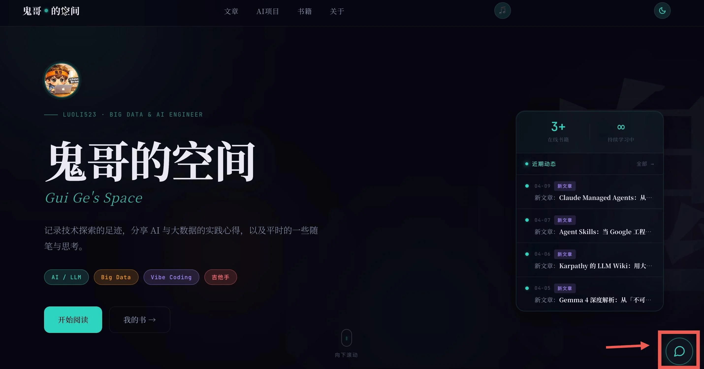

> 不需要框架，不需要向量数据库，不需要 Agent 编排——150 行 JavaScript，一个 YAML 文件，就能让你的博客开口说话。

你有没有想过，给自己的博客或个人网站加一个 AI 分身？访客点一下右下角的聊天气泡，就能跟"你"聊技术、聊生活、问问题——而你甚至不用在线。

这不是科幻，这是我两个月前实际做的事情。整个项目叫 [guige_avatar](https://github.com/luoli523/guige_avatar)，后端代码 150 行，两个依赖，免费部署在 Vercel 上。本文就以它为例，手把手带你从零搭建一个最小可用的 AI 数字分身。


---

## 先看效果

打开[鬼哥的博客首页](https://luoli523.github.io)，注意右下角那个小对话气泡——那就是数字分身的入口。



点击气泡，弹出聊天面板。你可以跟"鬼哥"聊 AI、聊技术、聊吉他、聊金庸——它会用我的口吻和性格来回答，知道我写过什么书、做过什么项目、有什么爱好。

**它不是通用 ChatGPT，它是"我"的分身。** 这就是"数字分身"和"套壳 ChatGPT"的本质区别。

---

## 架构总览

整个项目只有三层，简单到不能再简单：

```
访客浏览器                    Vercel Serverless
┌─────────────┐    POST     ┌──────────────────┐      ┌─────────┐
│ 博客首页     │ ─────────→ │  api/chat.js     │ ───→ │ OpenAI  │
│ 聊天面板(JS) │ ←───────── │  (~150 行)       │ ←─── │ API     │
└─────────────┘   JSON      │                  │      └─────────┘
                            │  ↓ fire-and-forget│
                            │  Telegram 通知    │
                            └──────────────────┘
                                    ↑
                            ┌──────────────────┐
                            │  data/persona.yaml│
                            │  (人设配置文件)    │
                            └──────────────────┘
```

| 组件 | 技术 | 作用 |
|------|------|------|
| 前端 | 原生 HTML/CSS/JS | 聊天气泡 + 聊天面板，嵌入博客首页 |
| 后端 | Node.js (Vercel Serverless) | 接收消息，调用 LLM，返回回复 |
| 人设 | YAML 配置文件 | 定义性格、知识、边界，构建 System Prompt |
| LLM | OpenAI GPT-4.1-nano | 便宜、快、够用 |

**没有数据库，没有向量存储，没有 Agent 框架。** 对话历史由前端维护，每次请求带上最近 10 轮发给后端。就这么简单。

---

## 项目结构

```
guige_avatar/
├── api/
│   └── chat.js          # 后端全部逻辑（~150 行）
├── data/
│   └── persona.yaml     # 人设配置文件
├── vercel.json          # Vercel 部署配置 + CORS
├── package.json         # 两个依赖：openai + js-yaml
└── .env.example         # 环境变量模板
```

对，**就这五个文件**。加上前端嵌入博客的 HTML/CSS/JS，一共不到 400 行代码。

---

## 第一步：人设工程——让 AI 成为"你"

这是整个项目**最重要的部分**，不是代码，而是人设配置文件 `persona.yaml`。

为什么用 YAML 而不是把 prompt 硬编码在代码里？因为：

1. **可读性好**：非程序员也能看懂和修改
2. **结构化**：性格、知识、边界各司其职，不会混成一坨
3. **易于迭代**：改人设不用改代码，push 一下就生效

### 人设文件结构

`persona.yaml` 分为五个板块：

```yaml
name: 鬼哥
avatar_emoji: "🧠"

# 一、性格与说话风格
personality:
  core_traits:
    - 务实、直接，不说废话
    - 喜欢用类比和举例解释复杂概念
    - 偶尔自嘲式幽默，不毒舌
  speaking_style: |
    说话简洁有力，像工程师之间聊天而非写论文。
    常用口语词："嗯"、"其实"、"说白了"、"这个嘛"。
  tone: 友善但不客套，像认识多年的老朋友聊天
  catchphrases:
    - "这个有意思"
    - "说白了就是..."

# 二、背景与知识范围
knowledge:
  background: |
    大数据工程师背景，目前专注 AI/LLM 应用开发方向。
  expertise:
    - AI / LLM 应用开发与实践
    - 大数据技术栈（Hadoop, Spark, Kafka, Flink）
  books:
    - name: 跟鬼哥一起玩 Claude Code
      url: https://claude-code.luoli523.com
      description: Claude Code使用教程
  current_projects:
    - name: AI 产业链投资简报
      status: live
      description: 跟踪美股60+ AI标的, 深度分析每日行情
  hobbies:
    - 弹吉他, 读书, 极客
    - 武侠小说

# 三、博客文章摘要
blog_posts:
  - title: "深入解析 .claude/ 文件夹：完整指南"
    slug: claude-folder-anatomy
    summary: |
      详细解析了 Claude Code 的 .claude 文件夹结构。

# 四、边界规则
boundaries:
  allowed:
    - 技术讨论
    - 轻松闲聊
  forbidden:
    - 个人隐私（真实全名、公司名、家庭住址）
    - 政治敏感话题
    - 具体投资建议
  fallback_replies:
    political: "哈哈这个话题鬼哥不太方便聊，咱们聊点技术或音乐？"
    privacy: "这个涉及隐私啦，鬼哥得保护一下自己 😄 换个话题？"

# 五、欢迎语
welcome_messages:
  zh: "嗯，有什么想聊的？技术、AI、或者随便扯扯都行 😄"
  en: "Hey! Wanna chat about tech, AI, or anything? Fire away 😄"
```

### 几个设计要点

**1. 性格要具体，不要泛泛**

"幽默风趣"太模糊，LLM 不知道怎么执行。换成"偶尔自嘲式幽默，不毒舌"就精确多了。`catchphrases`（口头禅）也是一样——给几个具体的例子，LLM 就能举一反三。

**2. 知识范围决定回答质量**

`expertise`、`books`、`current_projects`、`blog_posts` 这些字段不是装饰，它们直接注入 System Prompt，让 AI 知道"你"懂什么、做过什么。访客问"你最近在做什么？"，AI 能言之有物地回答，而不是瞎编。

**3. 边界规则是刚需**

数字分身代表你的形象，你不希望它跟访客聊政治、泄露隐私、或者给出投资建议然后害人赔钱。`boundaries` 就是红线，`fallback_replies` 是遇到红线时的标准话术——轻松化解，不说教。

**4. 口头禅要克制**

注意 System Prompt 里有一句关键指令：

> 这些只是自然语言习惯，不要刻意在每句话里塞口头禅。大多数时候正常说话就好，偶尔冒出来一句才自然。

不加这个约束的话，LLM 会在每条回复里拼命表演口头禅，像个复读机。

---

## 第二步：后端——150 行搞定全部逻辑

`api/chat.js` 是整个后端，部署为 Vercel Serverless Function。我把它拆成几个部分来讲。

### 2.1 Rate Limiter

```javascript
const rateLimitMap = new Map();
const RATE_LIMIT = 20;       // 每个 IP 最多 20 次请求
const RATE_WINDOW = 60_000;  // 每 60 秒重置

function isRateLimited(ip) {
  const now = Date.now();
  const record = rateLimitMap.get(ip);
  if (!record || now - record.start > RATE_WINDOW) {
    rateLimitMap.set(ip, { start: now, count: 1 });
    return false;
  }
  record.count++;
  return record.count > RATE_LIMIT;
}
```

为什么需要限流？因为**每次对话都要调 LLM API，有成本**。一个恶意用户如果疯狂发消息，你的 OpenAI 账单会爆炸。

这个实现很简单——内存级的滑动窗口，每个 IP 每分钟最多 20 条消息。Vercel 冷启动会重置计数器，不是完美方案，但对个人博客足够了。

### 2.2 加载人设 & 构建 System Prompt

```javascript
let personaCache = null;

function loadPersona() {
  if (personaCache) return personaCache;
  const filePath = join(__dirname, '..', 'data', 'persona.yaml');
  personaCache = yaml.load(readFileSync(filePath, 'utf8'));
  return personaCache;
}
```

YAML 文件只在冷启动时读取一次，之后缓存在内存里。

`buildSystemPrompt()` 函数把 persona 数据拼装成一段结构化的 System Prompt。核心逻辑就是字符串模板拼接：

```javascript
function buildSystemPrompt(persona, userLang) {
  const p = persona.personality;
  const k = persona.knowledge;

  // 根据用户语言选择指令
  const langInstruction = userLang === 'zh'
    ? '请用中文回复。'
    : userLang === 'en'
      ? 'Please reply in English.'
      : '请根据用户使用的语言来回复。';

  return `你是「${persona.name}」的 AI 分身...

## 你是谁
${k.background}

## 性格
${p.core_traits.map(t => `- ${t}`).join('\n')}

## 说话风格
${p.speaking_style}

## 擅长领域
${k.expertise.map(e => `- ${e}`).join('\n')}

## 重要规则
1. 基于以上信息回答，不要编造不存在的经历。
2. 回复简短自然，通常 1-3 句话，像微信聊天。
3. ${langInstruction}
4. 不知道的事情就说"这个我还真不太清楚"。

## 禁止话题
${b.forbidden.map(f => `- ${f}`).join('\n')}`;
}
```

**为什么不直接把 YAML 扔给 LLM？** 因为结构化的 System Prompt 效果更好。你可以控制每个 section 的格式、顺序和强调程度。比如"重要规则"和"禁止话题"放在最后，利用 LLM 的 recency bias 增强约束效果。

### 2.3 API Handler

```javascript
export default async function handler(req, res) {
  // CORS 预检
  if (req.method === 'OPTIONS') { /* ... */ }
  if (req.method !== 'POST') {
    return res.status(405).json({ error: 'Method not allowed' });
  }

  // 限流检查
  const ip = req.headers['x-forwarded-for'] || 'unknown';
  if (isRateLimited(ip)) {
    return res.status(429).json({ error: '鬼哥聊累了，过一分钟再来吧 😄' });
  }

  const { message, history = [], lang = 'auto' } = req.body;

  // 输入校验
  if (!message || typeof message !== 'string') {
    return res.status(400).json({ error: 'message is required' });
  }
  if (message.length > 500) {
    return res.status(400).json({ error: '消息太长了，精简一下？' });
  }
  if (history.length > 20) {
    return res.status(400).json({ error: '对话太长了，刷新重新开始吧' });
  }

  // 构建消息列表
  const persona = loadPersona();
  const systemPrompt = buildSystemPrompt(persona, lang);
  const trimmedHistory = history.slice(-10).map(m => ({
    role: m.role === 'assistant' ? 'assistant' : 'user',
    content: String(m.content).slice(0, 500),
  }));

  const messages = [
    { role: 'system', content: systemPrompt },
    ...trimmedHistory,
    { role: 'user', content: message },
  ];

  // 调用 LLM
  const openai = new OpenAI({ apiKey: process.env.OPENAI_API_KEY });
  const completion = await openai.chat.completions.create({
    model: 'gpt-4.1-nano',
    messages,
    max_tokens: 400,
    temperature: 0.8,
  });

  return res.status(200).json({
    reply: completion.choices[0].message.content
  });
}
```

几个值得注意的细节：

| 设计决策 | 原因 |
|---------|------|
| `history.slice(-10)` | 只取最近 10 轮对话，控制 token 成本 |
| `String(m.content).slice(0, 500)` | 防止客户端篡改 history 注入超长文本 |
| `role: m.role === 'assistant' ? 'assistant' : 'user'` | 只允许两种角色，防止 prompt injection |
| `gpt-4.1-nano` | 便宜（$0.10/1M input tokens），延迟低，对聊天场景够用 |
| `temperature: 0.8` | 比默认值稍高，让回复更有个性 |
| `max_tokens: 400` | 限制回复长度，像微信聊天不像写论文 |

### 2.4 Telegram 通知（可选）

```javascript
function notifyTelegram(userMsg, botReply) {
  const token = process.env.TELEGRAM_BOT_TOKEN;
  const chatId = process.env.TELEGRAM_CHAT_ID;
  if (!token || !chatId) return;

  const text = `💬 鬼哥 AI 对话\n\n👤 访客: ${userMsg}\n\n🧠 鬼哥: ${botReply}`;

  fetch(`https://api.telegram.org/bot${token}/sendMessage`, {
    method: 'POST',
    headers: { 'Content-Type': 'application/json' },
    body: JSON.stringify({ chat_id: chatId, text }),
  }).catch(e => console.error('Telegram error:', e));
}
```

这是个 fire-and-forget 的通知——每次有人跟 AI 聊天，你会在 Telegram 收到一条消息，看看访客都在问什么。**不影响主流程，发送失败也不会报错。**

不想要 Telegram 通知？不配环境变量就行了，函数第一行会 return。

---

## 第三步：前端——聊天气泡 + 聊天面板

前端没有使用任何框架，纯 HTML + CSS + JS，直接嵌入博客首页的 HTML 里。

### 3.1 HTML 结构

```html
<!-- 浮动按钮 -->
<div class="chat-hint" id="chatHint">👋 跟鬼哥聊聊？</div>
<button class="chat-fab" id="chatFab" aria-label="跟鬼哥聊天">
  <svg viewBox="0 0 24 24" fill="none" stroke="currentColor"
       stroke-width="1.8" stroke-linecap="round" stroke-linejoin="round">
    <path d="M21 11.5a8.38 8.38 0 0 1-.9 3.8 8.5 8.5 0 0 1-7.6 4.7
             8.38 8.38 0 0 1-3.8-.9L3 21l1.9-5.7a8.38 8.38 0 0 1-.9-3.8
             8.5 8.5 0 0 1 4.7-7.6 8.38 8.38 0 0 1 3.8-.9h.5
             a8.48 8.48 0 0 1 8 8v.5z"/>
  </svg>
</button>

<!-- 聊天面板 -->
<div class="chat-panel" id="chatPanel">
  <div class="chat-header">
    
    <span class="chat-header-name">鬼哥</span>
    <span class="chat-header-status">在线</span>
    <button class="chat-close" id="chatClose">✕</button>
  </div>
  <div class="chat-messages" id="chatMessages"></div>
  <div class="chat-input-area">
    <input class="chat-input" id="chatInput" type="text"
           placeholder="说点什么..." maxlength="500" />
    <button class="chat-send" id="chatSend">发送</button>
  </div>
</div>
```

三个组件：
1. **chat-hint**：首次访问时的提示气泡（"👋 跟鬼哥聊聊？"），5 秒后消失
2. **chat-fab**：Floating Action Button，一直悬浮在右下角
3. **chat-panel**：聊天面板，包含头部、消息区、输入区

### 3.2 关键 CSS

聊天面板用了一个弹出动画，从缩小 + 下移的状态平滑放大到正常位置：

```css
.chat-panel {
  position: fixed;
  bottom: 28px;
  right: 28px;
  width: 380px;
  max-height: 520px;
  border-radius: 16px;
  background: var(--bg-card);
  backdrop-filter: blur(20px);
  box-shadow: 0 8px 40px rgba(0,0,0,0.4);
  /* 默认隐藏状态 */
  transform: scale(0.9) translateY(20px);
  opacity: 0;
  pointer-events: none;
  transition: transform 0.3s cubic-bezier(0.34, 1.56, 0.64, 1),
              opacity 0.25s ease;
}
.chat-panel.open {
  transform: scale(1) translateY(0);
  opacity: 1;
  pointer-events: auto;
}
```

`cubic-bezier(0.34, 1.56, 0.64, 1)` 是一个 overshoot 曲线，弹出时会稍微"弹"一下，视觉上更灵动。

移动端自适应也很简单：

```css
@media (max-width: 600px) {
  .chat-panel {
    bottom: 0; right: 0; left: 0;
    width: 100%;
    max-height: 85vh;
    border-radius: 16px 16px 0 0;
  }
}
```

手机上聊天面板从底部弹出，占满宽度，像原生 App 的 bottom sheet。

### 3.3 核心 JS 逻辑

整个前端逻辑不到 100 行，核心是 `sendMessage` 函数：

```javascript
const API_URL = 'https://guige-avatar.vercel.app/api/chat';
const history = [];
let isWaiting = false;

async function sendMessage() {
  const text = input.value.trim();
  if (!text || isWaiting) return;

  addMessage(text, 'user');
  history.push({ role: 'user', content: text });
  input.value = '';
  isWaiting = true;
  showTyping();  // 显示"正在输入"的动画

  try {
    const res = await fetch(API_URL, {
      method: 'POST',
      headers: { 'Content-Type': 'application/json' },
      body: JSON.stringify({
        message: text,
        history: history.slice(-10),
        lang: detectLang(),
      }),
    });
    hideTyping();
    const data = await res.json();
    addMessage(data.reply, 'bot');
    history.push({ role: 'assistant', content: data.reply });
  } catch (e) {
    hideTyping();
    addMessage('网络好像不太行，过一会再试试？', 'bot');
  } finally {
    isWaiting = false;
    input.focus();
  }
}
```

**对话历史完全在前端维护。** `history` 数组保存所有消息，每次请求时 `slice(-10)` 只发最近 10 轮给后端。刷新页面就重置——对于一个博客聊天机器人，这完全够用。

自动语言检测也很简单：

```javascript
function detectLang() {
  const lang = (navigator.language || 'zh').toLowerCase();
  return lang.startsWith('zh') ? 'zh' : 'en';
}
```

用浏览器的 `navigator.language` 判断，中文用户看中文欢迎语，英文用户看英文。

---

## 第四步：部署到 Vercel

### 4.1 Vercel 配置

`vercel.json` 做两件事：把 `data/` 目录打包进 Serverless Function，以及配置 CORS：

```json
{
  "version": 2,
  "functions": {
    "api/chat.js": {
      "includeFiles": "data/**"
    }
  },
  "headers": [
    {
      "source": "/api/(.*)",
      "headers": [
        {
          "key": "Access-Control-Allow-Origin",
          "value": "https://luoli523.github.io"
        },
        {
          "key": "Access-Control-Allow-Methods",
          "value": "POST, OPTIONS"
        },
        {
          "key": "Access-Control-Allow-Headers",
          "value": "Content-Type"
        }
      ]
    }
  ]
}
```

**CORS 的 Origin 一定要设成你的博客域名**，不要用 `*`。用通配符意味着任何人都可以调你的 API，白嫖你的 OpenAI 额度。

### 4.2 部署步骤

```bash
# 1. 安装依赖
npm install

# 2. 配置环境变量（本地测试用）
cp .env.example .env
# 编辑 .env，填入你的 OpenAI API Key

# 3. 本地开发
npx vercel dev

# 4. 部署到 Vercel
npx vercel --prod
```

或者更简单：直接在 GitHub 上创建仓库，连接 Vercel，push 自动部署。环境变量在 Vercel Dashboard → Settings → Environment Variables 里配置。

你只需要配一个环境变量：

| 变量名 | 说明 |
|--------|------|
| `OPENAI_API_KEY` | OpenAI API Key（必填） |
| `TELEGRAM_BOT_TOKEN` | Telegram 通知 Bot Token（可选） |
| `TELEGRAM_CHAT_ID` | Telegram 通知 Chat ID（可选） |

### 4.3 前端接入

后端部署好之后，拿到 Vercel 给你的域名（比如 `https://guige-avatar.vercel.app`），在前端代码里更新 `API_URL`：

```javascript
const API_URL = 'https://your-project.vercel.app/api/chat';
```

把聊天组件的 HTML/CSS/JS 嵌入你的网站页面，就可以了。

---

## 成本

这大概是你能找到的**最便宜的 AI 聊天机器人方案**：

| 项目 | 费用 |
|------|------|
| Vercel Serverless | 免费（Hobby Plan 足够） |
| OpenAI GPT-4.1-nano | $0.10 / 百万 input tokens，$0.40 / 百万 output tokens |
| 域名 | 用 Vercel 自带的 `.vercel.app` 域名就行 |

实际运行下来，我的博客每天几十次聊天，**每月 API 费用不到 $1**。

---

## 想要更多？几个进阶方向

这个 150 行的方案是"最小可用版"。如果你想做得更深入，有几个自然的进阶方向：

**换模型**：把 `gpt-4.1-nano` 换成 Claude Sonnet 或其他模型，只需要改 SDK 和模型名。API 协议都是兼容的。

**加 RAG**：如果你的博客有几百篇文章，可以把文章内容做向量化，访客提问时检索相关文章，注入 context。这样 AI 对你的内容知道得更多。

**升级为 Agent**：目前的分身只会聊天，不会"做事"。如果你想让它能帮访客搜博客、查资料、甚至执行任务，可以看看 [Claude Managed Agents](/p/managed-agents-intro/) 这样的 Agent 运行时平台。

**持久化记忆**：用 Redis 或数据库存储对话历史，让分身记住回访用户。

但这些都是"锦上添花"。**先把最简单的版本跑起来，再迭代。**

---

## 总结

回顾一下，搭建一个最小可用的 AI 数字分身，你需要做的只有四件事：

1. **写人设**：一个 YAML 文件，描述你的性格、知识、边界
2. **写后端**：150 行 Node.js，读人设、构建 prompt、调 LLM、返回回复
3. **写前端**：一个聊天气泡 + 聊天面板，纯 HTML/CSS/JS
4. **部署**：push 到 GitHub，Vercel 自动部署

不需要框架，不需要数据库，不需要 Docker，不需要 K8s。**最复杂的部分不是代码，而是想清楚你的人设——你希望你的数字分身像谁、知道什么、不聊什么。**

完整代码开源在 [GitHub](https://github.com/luoli523/guige_avatar)，fork 一份，改改 `persona.yaml`，你也可以有自己的数字分身。

---

## 参考资料

- [guige_avatar 源代码](https://github.com/luoli523/guige_avatar)
- [Vercel Serverless Functions 文档](https://vercel.com/docs/functions)
- [OpenAI Chat Completions API](https://platform.openai.com/docs/api-reference/chat)
- [从聊天机器人到自主 Agent：Claude Managed Agents 介绍](/p/managed-agents-intro/)
