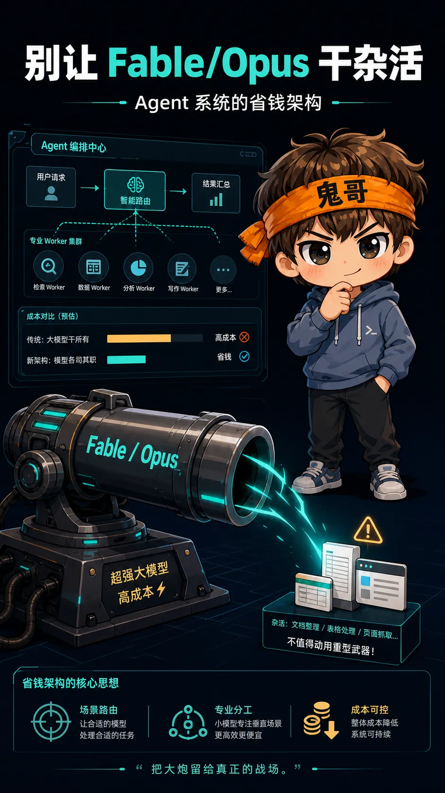
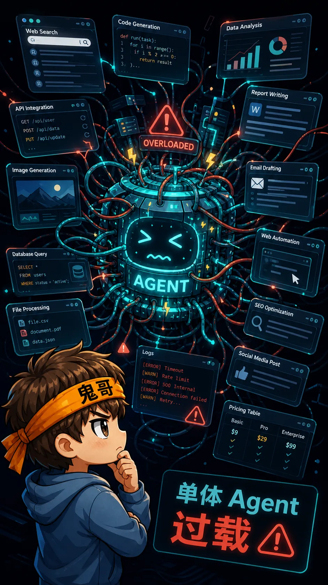
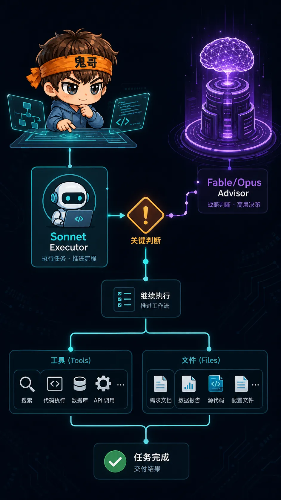
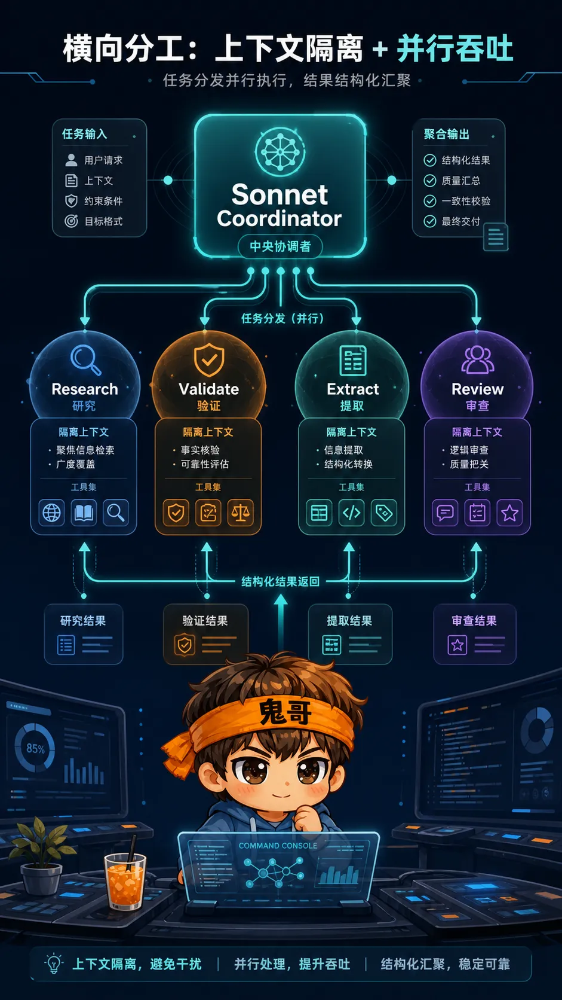
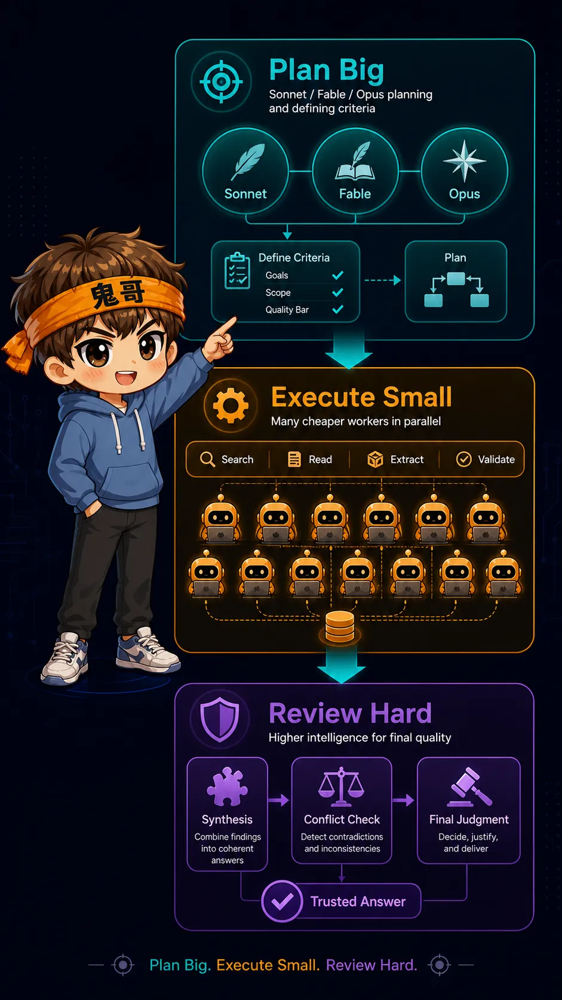

你开发 Agent 的时候，是不是也干过这种事：

不管任务大还是小，先把 Fable/Opus 请出来，一路从查网页、搬数据、整理表格，撸到最后写报告。

鬼哥以前也经常这么干。刚开始是图省事，也确实希望结果尽量好。至于更深层的原因，大概是经验不足，手艺还菜，这句不要外传。

直到后来看到 API 账单，整个人就清醒了。

开法拉利去跑货拉拉，当然快。但快归快，油钱是真的遭不住。

用 Fable/Opus 去读网页、搬资料、整理表格，也有点像拿炮弹打苍蝇。不是打不中，而是太贵、太吵，还容易把桌子一起掀了。

所以我最近翻了几篇 Anthropic 关于 Advisor Tool、Managed Agents 和 multi-agent workflow 的技术文章，发现它们表面上是在讲 Claude 的新能力，底层其实在讲一件更工程化的事：

> **Agent 系统的成本，不只取决于你用了哪个模型，更取决于你有没有把任务拆对。**



这篇文章不做文档复读。我们直接把它抽象成一套可复用的 Agent 省钱架构。

---

## 先看一个调研任务：拿 Opus 打苍蝇是怎么发生的

假设你要做一个知识调研：

> 对比 10 个 AI 编程工具的 Agent 架构、定价、上下文管理、工具调用能力，并给出选型建议。

很多人的第一反应是：直接丢给 Fable/Opus。

```text
Fable/Opus 单体 Agent：
搜索网页 -> 阅读文档 -> 抽取事实 -> 整理表格 -> 对比分析 -> 写最终报告
```

这当然能做。

但你仔细看一下任务链条，会发现里面大量步骤其实不需要顶级推理能力：

| 步骤 | 需要什么能力 | 是否值得用 Fable/Opus |
|---|---|---|
| 搜索官网和文档 | 覆盖率、耐心、工具调用 | 不太值 |
| 读取定价页 | 信息抽取 | 不太值 |
| 整理上下文长度、工具能力 | 结构化归纳 | 不太值 |
| 交叉验证来源 | 仔细、可重复 | 通常不需要 |
| 判断适合什么团队 | 产品判断、架构取舍 | 值 |
| 识别长期风险 | 深度推理、经验迁移 | 值 |

也就是说，**80% 的 token 可能烧在“搬信息”上，但真正需要 Fable/Opus 的，是最后 20% 的判断。**

更合理的拆法应该是这样：

```text
Sonnet coordinator：
  设计调研维度，拆分任务，规定输出格式，验收结果

Haiku / cheaper workers：
  并行搜索、读取网页、抽取事实、保留来源

Sonnet executor：
  合并结构化结果，发现冲突，要求补查

Fable/Opus advisor：
  在最终选型、风险分析、架构判断时介入
```



这不是为了“少用好模型”，而是为了**把好模型用在刀刃上**。

Fable/Opus 应该像会议室里最后拍板的专家，而不是从早到晚跑腿打印材料的人。

---

## Advisor Tool：Sonnet 干活，Fable/Opus 把关

第一种实现手段，是 Advisor Tool。

它的模式很简单：

```text
Sonnet executor
  -> 遇到复杂判断
  -> 调用 Fable/Opus advisor
  -> Sonnet 继续执行
```

这像什么？

像一个靠谱的项目经理在推进日常工作，遇到架构选型、安全边界、产品取舍这种“错了会很贵”的节点，再把资深专家叫进来。

Advisor 不是另一个执行员，也不是全程陪跑的老板。它更像**关键决策时被请进会议室的人**。

适合它的任务有几类：

- Sonnet 能稳定推进，但中间有少数非显然设计决策
- 任务链很长，全程用 Fable/Opus 成本过高
- 需要在关键节点做风险审查、策略纠偏、方案选择
- coding agent、computer use、多步研究这类“执行量大、判断点少”的任务

反过来，不适合的场景也很明确：

- 单轮问答
- 每一步都需要强推理
- 任务太小，advisor 调用成本超过收益
- executor 还没收集上下文，就急着问 advisor



这里最重要的实践不是“能不能调用更强模型”，而是**什么时候调用**。

我的判断标准是：

> 如果这个决策错了，后面会产生大量返工，就值得问 Fable/Opus；如果只是搬资料、改格式、补字段，交给 Sonnet 或更便宜的模型就够了。

Advisor Tool 的价值，正在于它把模型能力做了纵向分层：

| 角色 | 适合模型 | 主要职责 |
|---|---|---|
| Executor | Sonnet | 推进任务、调用工具、落地修改 |
| Advisor | Fable/Opus | 复杂判断、风险提示、策略纠偏 |
| User | 人 | 目标定义、偏好确认、最终接受 |

一句话总结：

> **Sonnet 负责把车开起来，Fable/Opus 负责在岔路口提醒你别开进沟里。**

---

## Managed Agents：把一个大任务拆成一支小队

第二种实现手段，是 Managed Agents。

Advisor 是纵向升级，Managed Agents 是横向分工。

它的基本结构是：

```text
Sonnet coordinator
  -> research worker A
  -> research worker B
  -> validation worker C
  -> review worker D
  -> coordinator 综合结果
```

每个 worker 有自己的上下文、工具和任务边界。它不需要知道全局目标的所有细节，只要把自己那一小块做好。

这件事非常关键。

很多单体 Agent 的失败，不是因为模型笨，而是因为上下文被污染了：

- 读了太多网页，噪音进入上下文
- 工具输出太长，关键信息被淹没
- 前面一个错误判断影响后面所有步骤
- 权限全开，风险边界变大
- 最后模型已经分不清哪些是事实，哪些是推测

Managed Agents 的价值，不是“模型数量变多所以更聪明”，而是三件事：

| 价值 | 解释 |
|---|---|
| 上下文隔离 | 每个 worker 只看自己需要看的材料 |
| 并行吞吐 | 多个资料源、多份文件、多条事实可以同时处理 |
| 权限隔离 | 调研 worker 不一定需要写文件，代码 worker 不一定需要外网 |



回到前面的 AI 编程工具调研案例。

你可以让每个 worker 只负责两个工具：

```text
Worker A：调研 Cursor、Windsurf
Worker B：调研 Claude Code、Codex
Worker C：调研 Devin、OpenHands
Worker D：调研 Replit Agent、Gemini CLI
Worker E：交叉检查定价和上下文窗口
```

每个 worker 的输出必须结构化，比如：

```text
工具名称：
官方链接：
Agent 架构：
上下文管理：
工具调用能力：
定价：
适合人群：
不确定点：
引用来源：
```

这样 coordinator 拿到的不是一堆网页碎片，而是一组可比较的事实卡片。

这就是多 Agent 的正确姿势：**worker 负责吞吐，coordinator 负责验收，不要让最终答案变成 worker 摘要的简单拼接。**

---

## Plan Big, Execute Small：真正值得偷走的范式

第三篇 cookbook 里最值得记住的，不是那个具体案例，而是它背后的范式：

```text
Plan Big：
  Sonnet / Fable / Opus 制定计划、定义维度、设计验收标准

Execute Small：
  Haiku / cheaper workers 并行搜索、读取、抽取、验证

Review Hard：
  Sonnet 汇总冲突，Fable/Opus 做最终判断或策略建议
```

翻译成人话就是：

> **大模型负责问题定义，小模型负责信息吞吐，强模型负责判断和验收。**

这套模式特别适合几类任务：

- 多网页知识调研
- 多文件代码库扫描
- 多产品竞品分析
- 多事实交叉验证
- 长文档消化和结构化摘要
- “先查很多东西，再做少数关键判断”的工作流

它为什么有效？

因为很多复杂任务的成本结构并不均匀。

你以为最难的是“写最终报告”，其实最费 token 的往往是：

- 把 20 个网页读完
- 从文档里抠出字段
- 对齐不同来源的说法
- 反复检查链接和引用
- 整理成统一格式

这些事情需要耐心、覆盖率和结构化输出，但不一定需要 Fable/Opus 级别的判断力。



不过，多 Agent 也不是银弹。

最容易踩的坑有四个：

| 坑 | 结果 |
|---|---|
| 拆得太碎 | 调度成本超过收益 |
| worker 输出太自由 | coordinator 难以比较和验收 |
| coordinator 只拼接 | 错误会被包装成“综合结论” |
| 关键证据不保留 | 最终判断无法追溯 |

所以，Plan Big, Execute Small 不是“把任务随便丢给一堆小模型”，而是要先设计好三件事：

1. **拆分边界**：每个 worker 负责什么，不负责什么。
2. **输出格式**：worker 必须交付什么字段、证据和不确定性。
3. **验收标准**：coordinator 如何发现冲突、追问缺口、决定是否升级给 Fable/Opus。

---

## 怎么选架构：别先问模型，先问任务

很多人在设计 Agent 系统时，第一句就是：

> 我该用 Sonnet，还是直接上 Opus？

这个问题问早了。

更好的顺序是：

1. 这个任务里，哪些步骤只是读取、搜索、抽取？
2. 哪些节点需要真正的判断？
3. 哪些子任务可以并行？
4. worker 的输出如何验收？
5. 如果判断错了，返工成本高不高？
6. Fable/Opus 应该在哪些位置介入，才最值？

你可以用这张表快速判断：

| 任务类型 | 推荐方案 |
|---|---|
| 单轮问答 | 直接 Sonnet 或 Fable/Opus |
| 普通工具执行 + 少数复杂判断 | Sonnet executor + Fable/Opus advisor |
| 大量网页、文件、事实调研 | Sonnet coordinator + cheaper workers |
| 高价值研究报告 | Sonnet coordinator + workers + Fable/Opus final review |
| 代码库大规模扫描 | Coordinator + specialized workers |
| 每一步都需要深推理 | 直接 Fable/Opus，少拆 |
| 小任务 | 不要多 Agent，调度成本不值 |

这里的关键不是“多 Agent 一定比单 Agent 好”，而是：

> **当任务可以拆、证据可以结构化、验收标准可以定义时，多 Agent 才有意义。**

如果任务本身是连续推理，比如数学证明、复杂算法设计、哲学论证，你硬拆成一堆 worker，反而可能把思路打碎。

---

## 真正的省钱架构：让每个模型做它最值钱的事

回到开头那个比喻。

Fable/Opus 当然可以读网页、搬资料、整理表格。就像炮弹当然可以打苍蝇。

问题是：**你为什么要这么打？**

好的 Agent 系统，不是把所有事情都交给最强模型，而是把任务拆成三层：

| 层级 | 职责 | 典型模型 |
|---|---|---|
| 吞吐层 | 搜索、读取、抽取、初步整理 | Haiku / cheaper workers |
| 执行层 | 调度、工具调用、合并、落地 | Sonnet |
| 判断层 | 架构取舍、风险分析、最终审查 | Fable/Opus |

最后留下一个很实用的判断：

> 如果一个步骤没有明显的判断成本，就不要默认交给最贵的模型。  
> 如果一个决策会影响后面大量工作，就不要吝啬请 Fable/Opus 把关。

这才是 Agent 系统真正的省钱架构。

不是不用强模型，而是让强模型出现在它最值钱的位置。

---

## 参考资料

- [Anthropic Docs: Advisor tool](https://platform.claude.com/docs/en/agents-and-tools/tool-use/advisor-tool)
- [Anthropic Docs: Multi-agent sessions](https://platform.claude.com/docs/en/managed-agents/multi-agent)
- [Anthropic Cookbook: CMA_plan_big_execute_small.ipynb](https://github.com/anthropics/claude-cookbooks/blob/main/managed_agents/CMA_plan_big_execute_small.ipynb)
