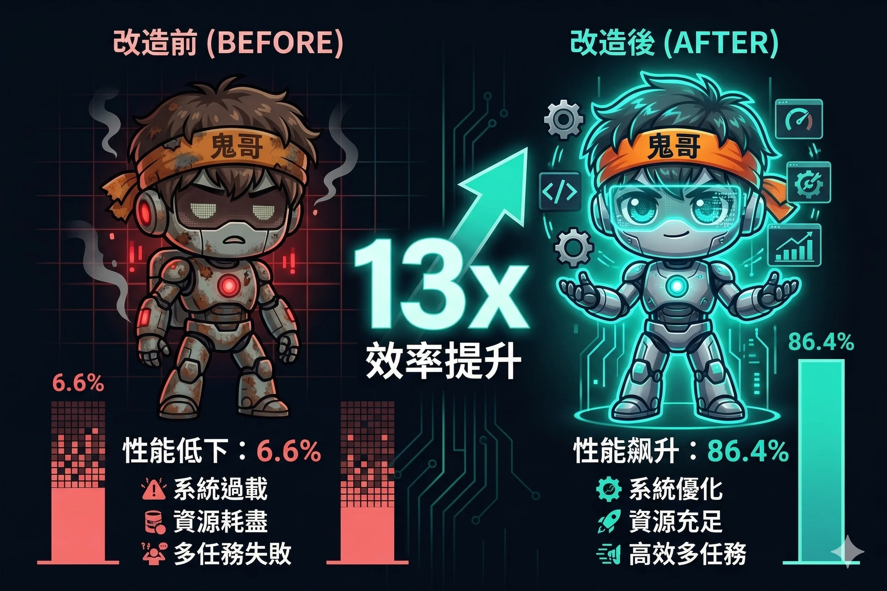
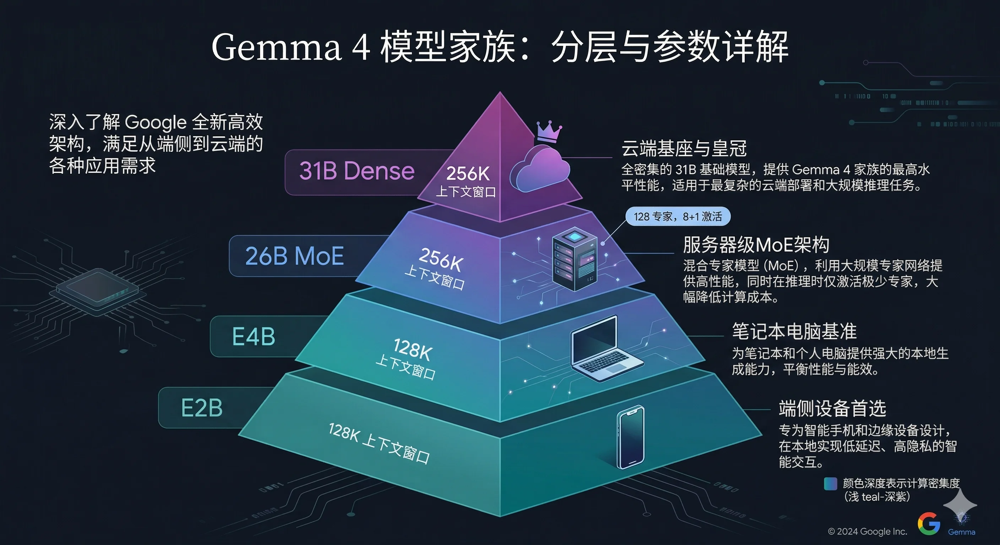
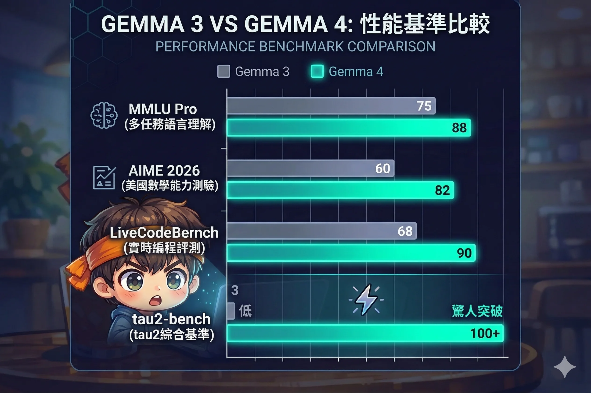
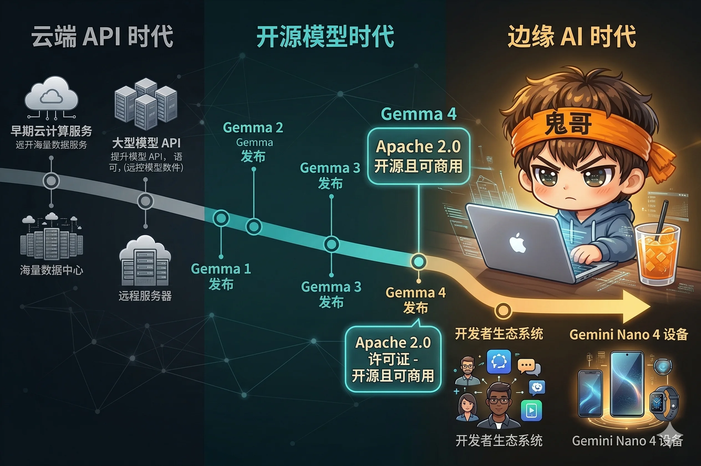

> tau2-bench 从 6.6% 到 86.4%。一个数字，一代模型，从"玩具"到"生产级"。

Google 这次终于想通了，把 Gemma 4 换成了 Apache 2.0 协议——翻译成人话就是：**随便用，商用也行，不用给 Google 交保护费。**

鬼哥看完技术文档后，脑子里瞬间蹦出了五六个"这个能搞"的想法，手指已经开始不自觉地敲桌子了。本着"先吹牛再干活"的优良传统，我决定先把分析文章写了，然后用业余时间（就是那些本该用来睡觉的时间）挨个撸几个 demo 出来。

至于能不能撸完……关注我就知道了。反正 flag 先立在这里，倒了再说。

---

## 一个数字说明一切

2026 年 4 月 2 日，Google 发布了 Gemma 4。

如果你只看一个数字，看这个：**tau2-bench（衡量模型自主完成多步骤任务的能力）从上一代的 6.6% 飙升到 86.4%，单代提升超过 13 倍。**

这不是某项指标的例行提升。6.6% 意味着模型在 Agentic 任务中几乎不可用——每 15 次尝试只能成功 1 次。86.4% 意味着它可以可靠地自主执行复杂工作流。这是从"实验室玩具"到"生产级工具"的质变。

Gemma 4 基于 Gemini 3 的研究成果构建，在许可证上做了一个重大决定：**从自定义许可证切换到 Apache 2.0**。这意味着任何企业、任何开发者都可以直接商用，无需和 Google 谈判。在 Meta 的 Llama 系列仍使用限制性许可证的背景下，这是一步有力的棋。



---

## 模型家族全景：四种规格，一套架构

Gemma 4 不是一个模型，而是一个**家族**。四种规格覆盖从手机到服务器的全部场景：

| 模型 | 参数量 | 上下文窗口 | 目标部署环境 | Arena AI 排名 |
|------|--------|-----------|------------|--------------|
| **31B Dense** | 31B | 256K | 服务器/云端 | 开源第 3 |
| **26B MoE** | 26B (激活 ~4B) | 256K | 工作站/高端笔记本 | 开源第 6 |
| **E4B** | ~4B | 128K | 笔记本/T4 GPU | - |
| **E2B** | ~2B | 128K | 手机/IoT/Raspberry Pi | - |

几个值得注意的设计选择：

**"E" 代表 Effective**。E4B 不是"4B 参数模型"，而是"等效 4B 性能的模型"。Google 在命名上刻意淡化参数量，强调实际效能——这反映了一个行业趋势：参数量不再是核心卖点，效率才是。

**26B MoE 是最有意思的一个**。它有 128 个小型专家网络，每个 token 只激活 8 个专家加 1 个共享的"always-on"专家。结果是：26B 的知识容量，4B 的推理速度，接近 31B Dense 的质量。这是"用架构换效率"的教科书级实现。

**E2B 支持音频输入**。在 2B 级别的模型上原生支持语音识别和跨语言翻译，这在之前是不可想象的。这让完全离线的手机端语音助手成为可能。



---

## 架构革新：三个关键设计决策

Gemma 4 的性能跃迁不是靠简单堆参数，而是来自三个精巧的架构设计。

### 1. 混合注意力：局部与全局的交替舞步

传统 Transformer 的注意力机制让每个 token 都"看到"所有其他 token。这在长上下文场景下计算成本爆炸。Gemma 4 的解法很优雅：

- **局部滑动窗口注意力层**：每个 token 只关注周围 512-1024 个 token，处理局部语义
- **全局全上下文注意力层**：每个 token 关注完整上下文，捕获长距离依赖
- 两种层**交替堆叠**，最后一层强制为全局层

效果：轻量模型的速度 + 长上下文任务的深度理解。你不需要在"快"和"聪明"之间选一个。

### 2. 双 RoPE 位置编码策略

位置编码决定了模型"理解位置关系"的能力。Gemma 4 根据注意力层类型使用不同的 RoPE 变体：

- **滑动窗口层**：标准 RoPE（局部位置信息已经足够精确）
- **全局层**：Proportional RoPE（在超长距离上仍能保持位置感知质量）

这个看似微小的区分，是 256K 上下文窗口不"退化"的关键。很多模型声称支持长上下文，但实际上在超过 32K 之后质量急剧下降。Gemma 4 通过分层设计绕过了这个问题。

### 3. MoE 的"以小搏大"哲学

26B MoE 模型的专家设计值得细看：

- **128 个小型专家**（不是传统的 8-16 个大专家）
- 每个 token **激活 8 个**，外加 **1 个共享的 always-on 专家**
- 共享专家处理通用语义，激活专家处理特定领域知识

为什么选择"多而小"而不是"少而大"？更多专家意味着更细的专业化粒度。想象一下：8 个全科医生 vs 128 个专科医生中挑 8 个——后者在特定问题上的精度会高得多。而共享专家则确保基础能力不会因为过度专业化而丢失。


---

## 基准对决：Gemma 3 vs Gemma 4

数字不说谎。以下是 Gemma 4 在核心基准上的表现：

### 31B Dense 模型

| 基准 | 测量内容 | Gemma 4 得分 |
|------|---------|-------------|
| MMLU Pro | 通用知识与推理 | 85.2% |
| AIME 2026 | 数学竞赛题 | 89.2% |
| tau2-bench | Agentic 任务自主完成 | 86.4% (上代 6.6%) |

### 26B MoE 模型（以 ~4B 的速度运行）

| 基准 | 得分 |
|------|------|
| AIME 2026 | 88.3% |
| LiveCodeBench | 77.1% |
| GPQA Diamond (研究生级科学推理) | 82.3% |

### 小模型也不弱

| 基准 | E4B | E2B |
|------|-----|-----|
| AIME 2026 | 42.5% | 37.5% |
| LiveCodeBench | 52.0% | 44.0% |

几个值得玩味的对比：

**26B MoE vs 31B Dense**：在 AIME 2026 上，MoE 拿到 88.3%，仅比 Dense 的 89.2% 低不到 1 个百分点。但 MoE 的推理速度是 Dense 的好几倍。对于绝大多数应用场景，MoE 都是更优选择。

**E4B 的性价比**：一个能在 T4 GPU（约 $0.35/小时）上运行的模型，在 LiveCodeBench 上拿到 52%——这已经超过了一年前很多云端大模型的水平。

**tau2-bench 的代际飞跃**：从 6.6% 到 86.4%，这不是渐进提升，是质变。之前开源模型在 Agent 场景中几乎是装饰品，现在它们可以真正干活了。



---

## 五个有趣的实际应用

架构和基准只是开始。真正让人兴奋的是 Gemma 4 打开的应用可能性。

### 应用一：离线法律合同分析师

**场景**：律师事务所需要 AI 辅助审查合同，但客户数据绝对不能上传到任何云端。

**方案**：在事务所内网服务器上部署 Gemma 4 26B MoE 模型。律师拍摄或扫描合同 → Gemma 4 的视觉能力直接解析文档图片 → 提取关键条款（违约金、竞业限制、知识产权归属）→ 用 Function Calling 调用内部案例数据库比对历史判例 → 生成结构化风险评估报告。

**为什么现在可行**：
- 视觉能力原生支持文档 OCR、表格解析
- Function Calling 从训练阶段内置，不是指令微调的"权宜之计"
- 26B MoE 以 4B 速度推理，单卡就能跑
- Apache 2.0 许可证，商用零障碍

**有趣之处**：一年前，这种应用需要 GPT-4 级别的云端模型 + 一套复杂的数据脱敏管道。现在，一台配 RTX 4090 的工作站就能完成全部工作，数据始终不出内网。

### 应用二：手机端实时语音翻译器

**场景**：出国旅行，对方说日语/阿拉伯语/泰语，你需要即时理解。

**方案**：Gemma 4 E2B 运行在手机本地。打开 App → 对方说话 → E2B 的原生音频输入能力直接处理语音 → 跨语言翻译 → 屏幕显示中文翻译文本。全程离线，无需网络。

**性能数据**：
- Qualcomm Dragonwing IQ8 NPU 上：3,700 prefill / 31 decode tokens/s
- 支持 140+ 语言

**有趣之处**：Google Translate 也能做这件事，但它需要网络。在地铁里、在信号差的乡村、在出国时没买当地流量的情况下，一个完全离线且支持 140+ 语言的翻译器，才是真正的"随身翻译"。而这个模型只有 2B 参数。

### 应用三：产线边缘质检 Agent

**场景**：电子元器件工厂需要对 PCB 板进行实时视觉质检。

**方案**：NVIDIA Jetson Orin Nano 部署 Gemma 4 E4B。高速相机拍摄 PCB 板 → E4B 视觉模型实时检测焊点虚焊、元件偏移、短路等缺陷 → 检测到问题时通过 Function Calling 触发分拣机械臂 → 异常数据本地存储用于质量追溯。

**为什么比传统方案更好**：
- 传统视觉质检依赖预设规则，遇到新型缺陷需要重新编程
- Gemma 4 可以用自然语言描述缺陷："焊点面积不足"、"电容倾斜超过 15 度"
- 支持多步推理：不只是"检测"，还能"判断严重程度"和"建议处理方式"

**有趣之处**：这本质上是给每条产线配了一个"有经验的质检工程师"。传统 CV 方案只能说"这里有异常"，Gemma 4 能说"U23 芯片第 4 脚虚焊，建议回流焊复检，严重度 Medium"。

### 应用四：个人代码审查 Agent

**场景**：独立开发者或小团队没有专职 reviewer，需要 AI 辅助代码审查。

**方案**：本地运行 Gemma 4 26B MoE。git hook 在 commit 时触发 → Agent 读取 diff → 调用 linter/type checker 等工具 → 检查安全漏洞（SQL 注入、XSS 等）→ 查阅项目的 CONTRIBUTING.md 了解编码规范 → 生成结构化审查意见（JSON 格式），包含文件路径、行号、问题描述、修复建议和严重等级。

**Agentic 工作流示意**：
```
[读取 diff] → [思考：这段代码在做什么？] → [调用 eslint]
→ [思考：eslint 报了 3 个问题，但其中 1 个是 false positive]
→ [调用 grep 检查是否有类似模式] → [生成结构化审查报告]
```

**有趣之处**：tau2-bench 86.4% 的意义在这里体现——Agent 需要自主决定"接下来调用什么工具"，而不是按预设脚本执行。一个能可靠完成 5-6 步决策链的 Agent，才是真正有用的 reviewer，而不只是一个高级 linter。

### 应用五：会议手写笔记 → 结构化文档

**场景**：开会时习惯手写笔记，但事后需要整理成电子文档分享给团队。

**方案**：用手机拍摄手写笔记（可以是多页、混合图表和文字）→ Gemma 4 E4B 在本地处理 → 识别手写文字（支持中英混排）→ 理解笔记的逻辑结构（标题、要点、子项、箭头表示的关系）→ 输出结构化 Markdown 文档，包含层级标题、待办清单、关键决策高亮。

**为什么不是普通 OCR**：
- 普通 OCR 只做字符识别，不理解结构
- Gemma 4 理解"箭头"表示因果关系、"圈起来的"表示重点、"问号"表示待确认
- 128K 上下文窗口支持一次性处理十几页笔记
- 支持手写中文识别（Gemma 4 原生支持 140+ 语言）

**有趣之处**：这个应用看起来简单，但它戳中了一个真实痛点。很多人（尤其是高管和研究者）仍然偏好手写笔记——但手写笔记的最大问题是"写完就忘"。一个能在手机上 3 秒内把手写草稿变成可搜索、可分享的结构化文档的工具，真的会改变记笔记这件事的体验。


---

## 开源 AI 的分水岭时刻

Gemma 4 的发布不只是"又一个开源模型"。它标志着几个趋势的交汇：

**Apache 2.0 改变了游戏规则。** Meta 的 Llama 系列使用自定义许可证，对月活超过 7 亿的应用有限制。Google 选择 Apache 2.0 等于说：不管你是初创公司还是大厂，拿去用，不收钱，不设限。这会加速企业采用开源模型的步伐。

**边缘 AI 从愿景变成现实。** 一年前，"在手机上运行大模型"还是一个需要大量妥协的概念验证。现在，Gemma 4 E2B 在手机上做语音识别、图像理解、多语言翻译，且性能数据令人信服。AI 应用的成本结构和隐私模型正在被重写。

**Agent 从"能跑"变成"能用"。** tau2-bench 13 倍的提升意味着：开源模型在 Agentic 场景首次具备生产级可靠性。之前你只能把 Agent 当辅助工具（最终还是人拍板），现在你可以开始设计"Agent 自主完成，人做最终审核"的工作流了。

**生态闭环正在形成。** Google 明确表示：为 Gemma 4 写的代码将自动适配后续的 Gemini Nano 4 设备。这意味着今天基于 Gemma 4 开发的应用，未来可以无缝迁移到 Google 的系统级 AI 芯片上。开发者投入不会浪费。

---

回到开头那个数字：6.6% → 86.4%。

这不只是一个基准分数的提升。它代表了一种可能性的转变：**开源 AI 模型不再只是云端闭源模型的低配替代品，而是在特定场景（边缘部署、数据隐私、离线运行、商业自由度）下的更优选择。**

当最好的开源模型在关键指标上接近甚至追平闭源模型，同时在部署灵活性和商业许可上全面领先——这才是真正的分水岭。


