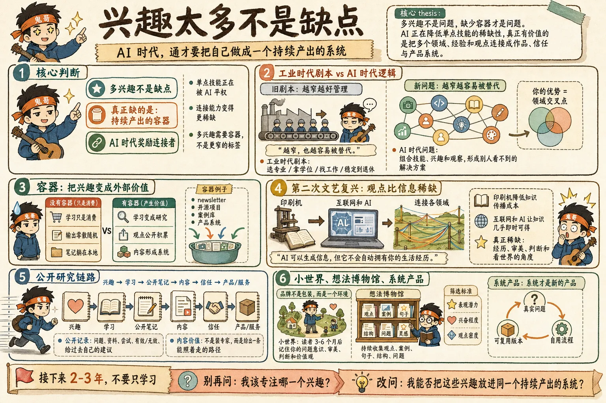
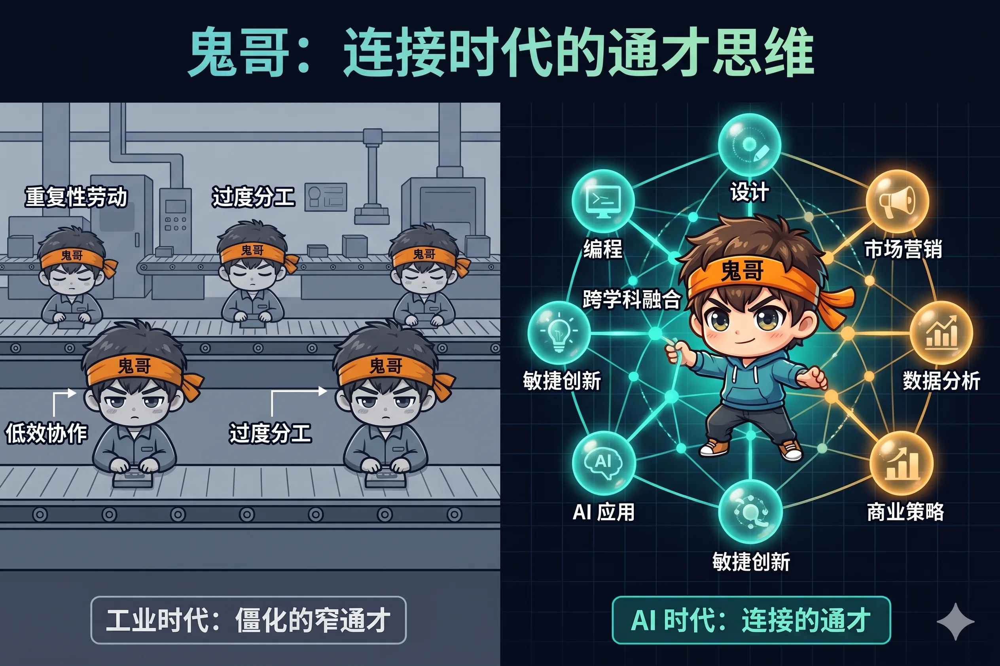
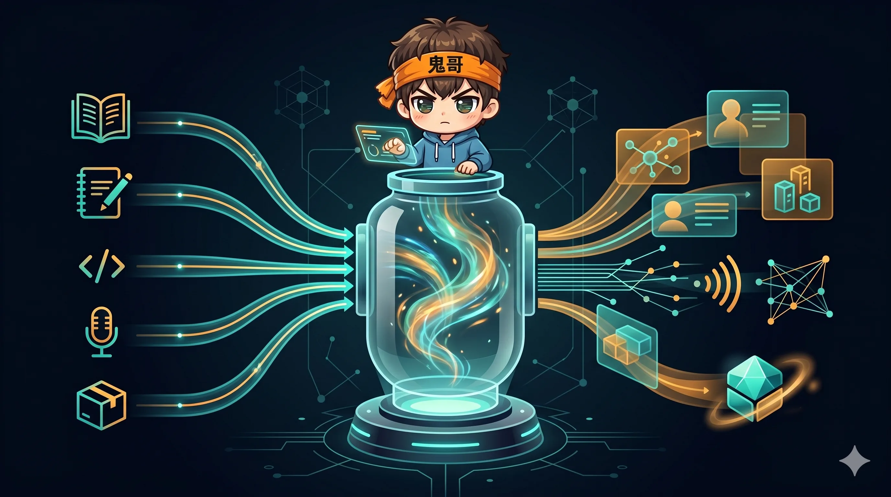
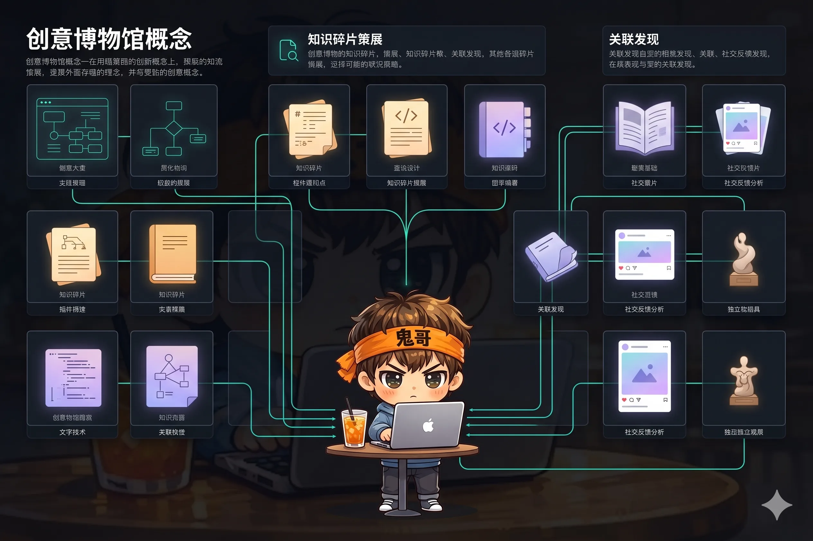
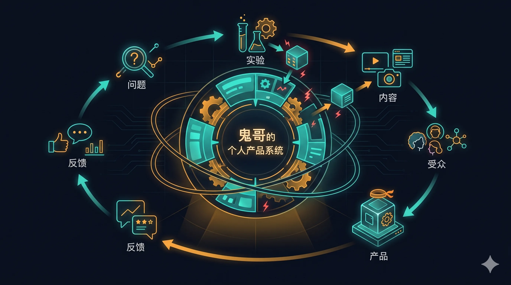

如果你兴趣很多，别急着骂自己“注意力不集中”。**在 AI 时代，兴趣太多可能不是 bug，而是你还没找到运行它们的系统。**

过去社会喜欢把人压成一个标签：前端工程师、设计师、销售、产品经理、老师、会计。越窄越“专业”，越窄越好管理。但今天的问题是：**越窄，也越容易被替代。**

先补一笔背景：Dan Koe 是英文创作者经济圈里很有代表性的“一人公司”写作者。他是《The Art of Focus》的作者，也是 AI 知识管理产品 Eden 的共同创始人，长期围绕写作、个人品牌、数字产品、AI 工具和 one-person business 输出。更重要的是，他不是站在岸上讲“兴趣变现”的观察者，而是把 newsletter、社交内容、课程产品和软件业务串成一套内容飞轮的人。

Dan Koe 最近那篇 X Article《If you have multiple interests, do not waste the next 2-3 years》讲的就是这件事：多兴趣不是弱点，真正的问题是你缺少一个“容器”，把兴趣变成作品、信任、产品和收入。



---

## 一、工业时代喜欢专家，AI 时代奖励连接者

现代社会对“专业化”的迷恋，来自工业时代。

流水线最喜欢什么人？喜欢每个人只做一道工序。你不需要理解全局，不需要判断，不需要创造，只要准时、服从、稳定输出。学校训练这种人，公司使用这种人，管理系统也最容易评估这种人。

问题是，流水线逻辑一旦套到人生上，就会变成一套很窄的剧本：

| 工业时代剧本 | 隐含假设 |
|---|---|
| 选一个专业 | 你一生只需要一个方向 |
| 拿一个学位 | 学校替你定义什么有价值 |
| 找一份工作 | 公司替你分配问题 |
| 稳定到退休 | 世界变化不会太快 |

这套剧本在过去还能凑合跑，因为知识传播慢、组织规模大、岗位边界清晰。但现在不一样了。

AI 正在把“单点技能”的价格打下来。写代码、写文案、做图、整理资料、生成方案，这些过去需要专门训练的技能，正在变成人人可调用的能力。

所以问题不再是“你会不会某个技能”，而是：

**你能不能把多个技能、多个兴趣、多个领域的观察，组合成别人看不到的解决方案。**



---

## 二、兴趣多的人，缺的不是专注，是容器

很多兴趣广泛的人都有一个共同困境：一直学习，但生活没有改变。

教程看了很多，书单收藏了很多，工具研究了很多，笔记写了很多。每隔一段时间就发现一个新方向，然后兴奋三天、沉默两周、换下一个坑。

外人说这是“闪亮物体综合征”。但 Dan Koe 的判断更有意思：这未必说明你没救，可能只是说明你还没有一个能承载兴趣的容器。

什么是容器？

它不是一个更精确的 niche，也不是一个更漂亮的个人简介，而是一套能把兴趣转化成外部价值的结构。

| 没有容器 | 有容器 |
|---|---|
| 学习只是消费 | 学习变成研究 |
| 兴趣只是逃避工作 | 兴趣变成工作材料 |
| 笔记躺在本地 | 观点公开积累 |
| 输出零散随机 | 内容形成系统 |
| 只有自我满足 | 能帮别人解决问题 |

一个写作者的容器可能是 newsletter。一个程序员的容器可能是开源项目。一个设计师的容器可能是案例库。一个创业者的容器可能是产品系统。

**兴趣不是最终形态，容器才是。**

没有容器，兴趣再多也是消耗注意力；有了容器，兴趣会变成持续生产的燃料。

---

## 三、第二次文艺复兴：观点比信息更稀缺

Dan Koe 把当下称为“第二次文艺复兴”。

第一次文艺复兴为什么会发生？一个关键原因是印刷机降低了知识传播成本。书不再只能靠手抄，思想传播速度变快，普通人第一次有机会在一生中接触多个领域。

于是出现了达芬奇、米开朗基罗这类跨学科人物。他们不是只会一件事的人，而是在艺术、工程、解剖、建筑、诗歌之间来回穿梭。

今天，互联网和 AI 做了类似的事情，只是速度更夸张。

知识已经不稀缺。你想学销售、心理学、设计、编程、健身、哲学、商业模型，几乎都能马上开始。真正稀缺的是你自己的视角。

一个懂心理学的设计师，理解用户行为的方式不一样。一个懂哲学的销售，理解说服的方式不一样。一个懂健身又懂商业的人，做健康产品时看见的问题也不一样。

**你的优势不一定在某一个领域有多深，而在这些领域的交叉点。**

AI 可以生成信息，但它不会自动拥有你的生活经历。它可以帮你推演，但前提是你得告诉它从哪个角度看世界。


---

## 四、把学习变成公开研究，把研究变成信任

多兴趣者最容易卡在一个地方：他以为自己要先“学成”，才能开始输出。

这通常是错的。

如果你一直等到自己足够专业才开始，最后很可能永远不开始。更好的路径是：**把学习本身变成公开研究。**

你本来就在读书、试工具、拆案例、做项目。现在只是多做一步：把你正在理解的东西，用别人能看懂的方式讲出来。

这个过程可以形成一条很清晰的链路：

```
兴趣 -> 学习 -> 公开笔记 -> 内容 -> 信任 -> 产品/服务
```

这不是让你装成专家。恰恰相反，它要求你诚实地呈现自己的探索过程：

1. 我遇到了什么问题？
2. 我看了哪些资料？
3. 我试了什么方法？
4. 哪些有效，哪些没用？
5. 我现在会怎么建议过去的自己？

这类内容为什么有价值？因为大多数人不缺答案，缺的是一条能照着走的路径。

你解决自己的问题，再把路径公开出来，就可能帮到过去的你，也帮到一群处在类似阶段的人。



---

## 五、别急着做“个人品牌”，先做一个小世界

很多人一听“个人品牌”，脑子里立刻冒出头像、简介、定位语、视觉风格。

这些东西有用，但不是核心。

真正的品牌，是别人关注你三到六个月之后，脑子里留下的整体印象：你在关心什么问题，你反复强调什么价值，你的审美是什么，你怎么判断世界，你想把别人带到哪里。

换句话说，品牌不是包装，而是一个环境。

你要创建的是一个“小世界”：别人进入之后，能感受到一套稳定的故事、观点和问题意识。

这就要求你先把自己的故事梳理清楚：

| 问题 | 用途 |
|---|---|
| 我从哪里来？ | 找到叙事起点 |
| 我经历过哪些低谷？ | 找到真实张力 |
| 我学过哪些东西？ | 找到能力来源 |
| 哪些经验真正改变了我？ | 找到可分享的方法 |
| 我想帮助哪种过去的自己？ | 找到内容和产品方向 |

你不需要天天讲自己。但你讲的东西，最好都能回到同一个世界观里。

做久了，品牌自然会出现。不是你声明出来的，而是读者在长期接触中感受到的。

---

## 六、内容不是信息搬运，而是观点密度

互联网已经不缺内容。AI 出来之后，更不缺。

未来真正有价值的内容，不是“我也总结了十条原则”，而是你能不能把高信号观点聚到一起，再用自己的语言、经历和判断重新组织。

Dan Koe 提了一个很实用的做法：建立“想法博物馆”。

它可以很简单，就是一个长期笔记库。看到让你兴奋的观点、案例、句子、结构、问题，就立刻记下来。工具不重要，习惯才重要。

你可以按三个标准筛选想法：

| 标准 | 说明 |
|---|---|
| 表现潜力 | 这个想法别人会不会关心 |
| 兴奋程度 | 你自己是否真的想写 |
| 观点密度 | 它是否能延展出更多问题 |

真正厉害的创作者，脑子里通常都有 5-10 个反复打磨的核心观点。他们会用不同例子、不同结构、不同场景反复讲这些观点。

所以写作训练不只是“多写”，还包括：**同一个观点，用 100 种结构表达。**

比如“清醒的人更快乐”这个观点，可以写成观察：

> 我发现快乐的人都有一个共同点：他们非常在意自己的精神清晰度。

也可以写成清单：

```markdown
快乐的人通常更清醒：
- 他们会休息
- 他们减少干扰
- 他们只追一个关键目标

所以他们不是更幸运，而是更少被噪音劫持。
```

同一个观点，不同结构，影响力完全不同。



---

## 七、系统才是新的产品

最后一层，是产品。

Dan Koe 的判断是：我们正在进入“系统经济”。人们不只是想要一个答案，而是想要**你的解决方案**。

为什么？

因为答案到处都是，但一个被真实问题打磨过的系统很少。系统意味着：它不是空泛建议，而是一套你亲自走过、测试过、修正过的流程。

比如写作课很多，但如果你能证明自己有一套方法，可以每天两小时完成主要内容生产，把 newsletter、博客、社交媒体、视频、产品推广串成一个循环，那它就不只是知识，而是系统。

系统产品通常来自三个步骤：

1. 你遇到一个真实问题
2. 你为自己设计一套解决流程
3. 你把流程整理成别人也能用的版本

这就是为什么多兴趣者不一定要一开始就“卖课”或“做产品”。你可以先把自己的问题解决过程记录下来。等路径稳定、结果可见，再把它产品化。



---

## 结尾：接下来 2-3 年，不要只学习

如果你兴趣很多，接下来最重要的不是再找一个“终极定位”，而是开始搭一个容器。

回顾一下，路径其实很清楚：

1. 承认多兴趣不是缺点，它是你的连接优势。
2. 停止只消费信息，把学习变成公开研究。
3. 建立想法博物馆，持续积累高密度观点。
4. 用内容让别人看见你的问题意识和成长路径。
5. 从自己的真实问题里提炼系统，再把系统变成产品。

别再问“我到底应该专注哪一个兴趣”。更好的问题是：

**我能不能把这些兴趣，放进同一个持续产出的系统里？**

如果答案是能，那你不是不专注。你只是终于找到了一个足够大的容器。

---

## 参考资料

- Dan Koe: [Official Website](https://thedankoe.com/)
- Dan Koe: [If you have multiple interests, do not waste the next 2-3 years](https://x.com/thedankoe/status/2010042119121957316)
- Dan Koe Letters: [The Dan Koe Newsletter](https://letters.thedankoe.com/)
