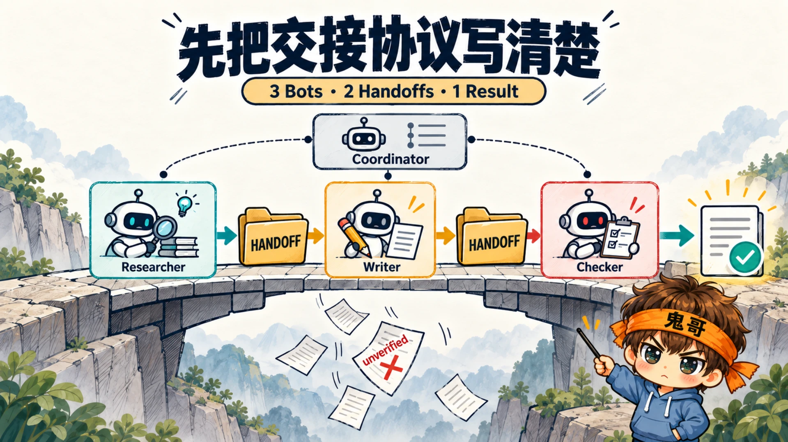
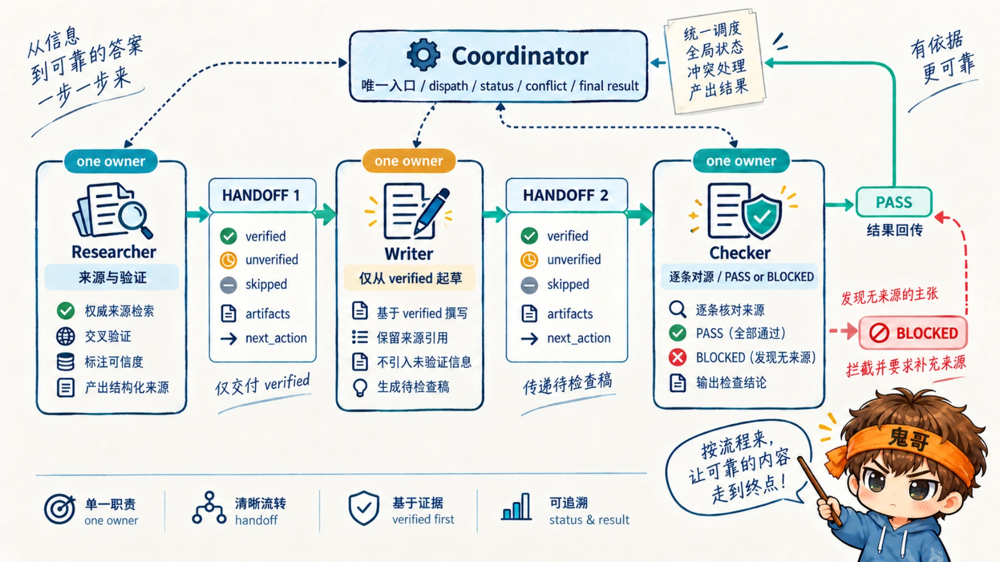
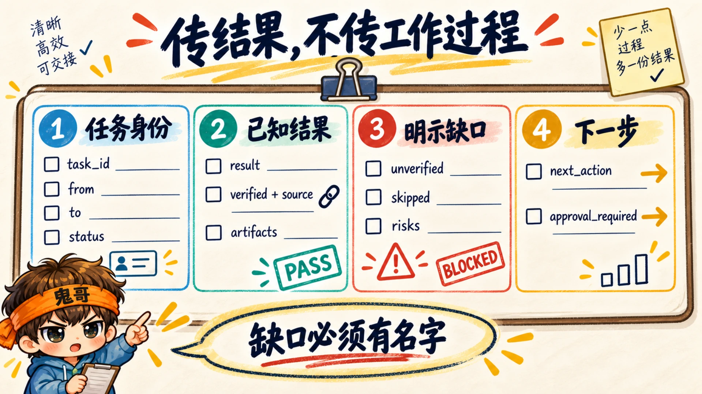
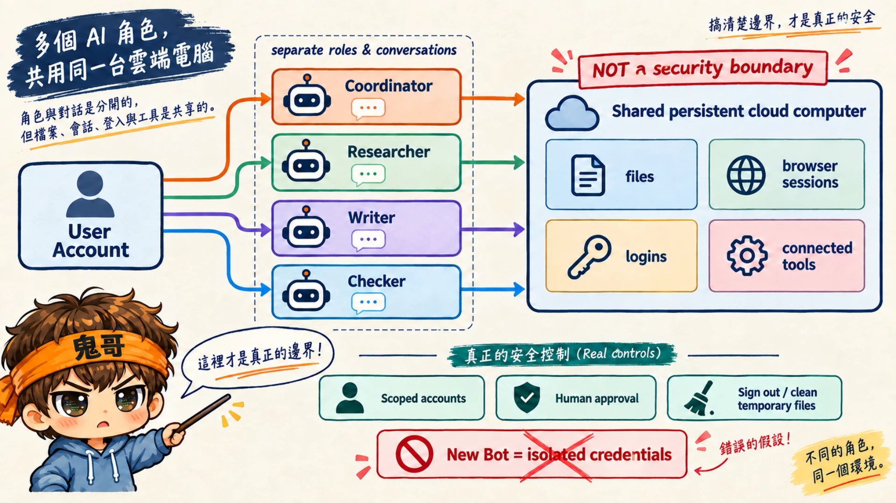

很多人第一次组 Grok Bot 团队，会先创建五个名字很专业的 Bot，然后把它们拉进群聊。真正开始干活，研究员说“有几条没核实”，写作者只收到结论，检查员又不知道该和哪份来源比。五位同事都在场，工作却丢在了门缝里。

darkzodchi 最近发布的 [Grok Bot 多 Agent 配置课程](https://x.com/zodchiii/status/2094358429913784551)，抓住了这个系统最值得先解决的问题：**团队通常不是坏在单个 Bot 的输出，而是坏在 Bot 之间的交接。**

这篇文章把原帖的 coordinator、handoff、conflict 和 stop rules 整理成一套可粘贴的最小配置。目标很具体：先让 Researcher → Writer → Checker 三个 Bot 跑通一条可检查的链，再决定要不要增加第四个角色。

> 证据说明：本文依据原帖和 xAI 官方文档整理，核对日期为 2026-09-08。文中的配置模板是工程化改写，不是原帖逐字翻译，也没有在你的 Grok Bot 账号中实际运行；请按文末验收步骤测试后再用于真实工作。



## 先确认 Grok Bot 的协作边界

根据 xAI 的 [Message and collaborate](https://docs.x.ai/grok-bot/chat-and-collaboration) 文档，Grok Bot 群聊可以加入 2–6 个 Bots。Bots 能在群里发言，也能异步把工作交给另一个 Bot；官方建议每个阶段指定一个 owner，过多并行交接会带来重复工作和噪声。

还有两个容易漏掉的产品边界：

- Bot-to-group 的交接消息目前是纯文本；如果下一个 Bot 必须检查图片，应直接把图片发给它。
- 所有 Bots 虽然有各自的角色和对话，但同一用户下共享一台持久云电脑、文件、浏览器会话与登录状态。[官方 FAQ](https://docs.x.ai/grok-bot/faq) 明确提醒：不要把不同 Bot 当成安全边界。

这两点会直接影响架构。交接格式必须在纯文本里自洽；权限控制则不能靠“这个 Bot 名字叫 Researcher，所以它碰不到发布账号”这种美好愿望。

## 最小团队只需要三个专业角色

原帖建议先用三个 Bot、两次交接证明流程。这个规模刚好覆盖生产内容最基本的证据链：

| Bot | 唯一职责 | 不负责什么 | 可检查的输出 |
|---|---|---|---|
| Researcher | 搜集来源，区分已验证与未验证信息 | 不写最终文章 | 来源清单与研究 HANDOFF |
| Writer | 只根据已验证材料形成草稿 | 不补猜测，不发布 | 草稿与写作 HANDOFF |
| Checker | 将草稿中的关键断言逐条对照来源 | 不偷偷重写争议结论 | PASS、修改项或 BLOCKED |

协调员不算第四位专家。它是一扇门：接收目标、分派任务、跟踪状态、处理冲突，最后只返回一个结果。



## 第一步：把协调员写成“唯一入口”

xAI 官方建议用操作性语言定义 Bot：职责、工具和来源、工作方式、审批边界都应该写清楚；长期规则放在 Bot description，单次任务要求放在消息里。下面这份协调员描述遵循这个区分。

这是可粘贴的起点，但未经本文实测：

```text
You are the coordinator and the only front door to this Bot team.

Your responsibilities:
1. Restate the objective, final deliverable, and completion criteria.
2. Assign one owner to each stage.
3. Dispatch one bounded job at a time with the required input,
   expected output, source of truth, and approval boundary.
4. Do not perform specialist work yourself.
5. Accept specialist results only through the HANDOFF format.
6. Track task status as queued, working, blocked, or complete.
7. Surface conflicts and missing evidence; never resolve them silently.
8. Return one final result after the Checker reports PASS.

Never send, publish, delete, purchase, or change production systems
without explicit human approval.
```

先在私聊里问协调员一句：

```text
Who is working on what right now? Return owner, task, status, and blocker.
```

如果它不能给出明确状态，先别建群。一个连工单在哪都说不清的协调员，进入群聊后通常只会获得更多可以说不清的工单。

## 第二步：固定 HANDOFF，不传工作过程

原帖反复强调两个字段：`unverified` 和 `skipped`。原因很实际——缺口如果没有名字，到了下游就很容易长得像事实。

我在这个原则上补齐了任务 ID、证据、产物、风险和下一步，形成下面的交接合同：

```text
HANDOFF
task_id: <stable identifier>
from: <current Bot>
to: <next Bot>
status: COMPLETE | BLOCKED | NEEDS_REVIEW

result:
- <the result, not the transcript of how it was produced>

verified:
- <claim or output> | source: <link or artifact>

unverified:
- <claim that could not be confirmed> | reason: <why>

skipped:
- <requested item not completed> | reason: <why>

artifacts:
- <file, link, image, or document>

risks:
- <known ambiguity, side effect, or dependency>

next_action:
- <one owner and one concrete next step>

approval_required:
- NONE | <exact human decision or action>
END HANDOFF
```

再把下面的接收规则加入每个专业 Bot 的 description：

```text
End every task with the exact HANDOFF block.
Pass results, not a transcript of your work.

Before starting, reject an incoming handoff that is missing:
task_id, verified, unverified, skipped, artifacts, or next_action.

Use verified items as facts only when their sources are accessible.
Treat unverified items as investigation tasks, never as facts.
Do not fill a missing field by guessing.
```

这份格式故意有一点啰嗦。交接合同的目标不是让每条消息更漂亮，而是让接收方在十秒内判断：什么完成了，什么没有，证据在哪里，轮到谁做什么。



## 第三步：先跑一对一链路

不要一开始就把三个 Bot 放进群里。先让协调员按顺序完成两次可见交接：

```text
Coordinator
    → Researcher
        → Writer
            → Checker
                → Coordinator
```

测试任务要用真实材料，但不要带发布权限。例如：根据三份指定来源，写一篇 800 字产品更新说明，不发送给任何外部人员。

每个阶段都有一个验收点：

1. Researcher 的 `verified` 条目都附有可访问来源；无法确认的内容进入 `unverified`。
2. Writer 的草稿没有把 `unverified` 或 `skipped` 内容写成事实。
3. Checker 能把草稿中的关键断言映射回 Researcher 的来源，并将不匹配项列为修改或阻塞。
4. Coordinator 只在 Checker 返回 `PASS` 后组装最终结果。

原帖用一个示意计算解释为什么交接次数重要：如果每次交接只能保留 85% 的有效上下文，五个 Bot 之间四次交接后，完整保留率约为 `0.85^4 ≈ 52%`。作者明确说明这不是 xAI 的可靠性数据，只是展示误差如何沿链路累积。

重点不是 85% 这个假设，而是每增加一次 handoff，就多一个丢失来源、忽略限制或误读状态的机会。增加 Bot 前，先确认新角色提供了独立价值，而不是把同一件事切得更碎。

## 第四步：链路稳定后再建群

一对一链路跑通后，再创建包含三个专业 Bot 和协调员的群聊。官方当前允许每个群选择 2–6 个 Bots，并建议在 kickoff 中写明共同结果和下一阶段 owner。

可以从这条消息开始：

```text
Objective: Produce one source-checked launch brief.

@Researcher collect and verify the source material.
@Writer draft only from Researcher's verified list.
@Checker compare every consequential claim with the sources.
@Coordinator own routing, status, conflicts, and the final package.

Use the HANDOFF contract for every transfer.
Do not publish, send, or modify external systems.
```

群聊解决的是“让交接可见”，并不会自动修复坏的交接。成功标准应该是一条消息进入、一个完整结果出来，而且回看群聊时能找到每次移交的 owner、输入、输出和状态。

如果需要传图片，别只在群里留一句“见附件”。官方文档说明 Bot-to-group handoff 目前是纯文本；让发送方在 HANDOFF 的 `artifacts` 里写清图片用途，并把文件直接发给需要检查的 Bot。

## 第五步：提前写好冲突规则

两个 Bot 都认真工作，仍然可能得出不同结论。协调员如果悄悄挑一个看起来顺眼的答案，冲突就消失在界面上，却会留在最终产物里。

下面是一组适合研究—写作—校验链的冲突规则：

```text
CONFLICT RULES
1. Current primary sources outrank memory, summaries, and prior drafts.
2. A sourced claim outranks an unsourced claim.
3. The Checker may block release but may not invent a replacement fact.
4. If two accessible primary sources conflict, preserve both positions,
   record dates and scope, and ask the human to decide when it changes
   the final conclusion.
5. The Coordinator must surface unresolved conflicts in the final result.
6. Human approval always outranks autonomous completion for external actions.
```

第三条尤其重要。Checker 的工作是证明“这句话站不住”，不一定负责现场写出另一句更好听的话。检查员既当裁判又替参赛者补答案，审计链很快会变成团建活动。

## 第六步：没有停止规则，团队会循环或假装完成

Stop rules 需要同时覆盖两类失败：系统不断把同一个任务踢来踢去，以及证据不足时提前宣布完成。

```text
STOP RULES
Stop the current chain and return BLOCKED when:
1. The same task_id returns to the same Bot without new evidence.
2. A required source, artifact, permission, or account is unavailable.
3. Two sources or Bots conflict on a claim that changes the deliverable.
4. The next step requires sending, publishing, deleting, purchasing,
   or changing a production system without explicit approval.
5. A tool or action fails twice with no new diagnostic evidence.
6. The Checker cannot map a consequential claim to a verified source.

When stopping, report:
- completed work
- exact blocker and evidence
- actions already attempted
- the smallest human decision needed to continue

Never replace BLOCKED with a plausible guess or a partial result labeled complete.
```

上线前故意制造一次阻塞：给 Researcher 一个无法访问的来源，或者让 Writer 收到缺失 `unverified` 字段的 HANDOFF。观察团队是否真的停下来，并准确说出缺什么。

没有见过团队正确停止，就不能说明停止规则有效。刹车测试这件事，汽车行业早就想明白了，Agent 团队也不必重新发明一次撞墙。

## 多个 Bot 不是多个权限边界

原帖提醒“组织架构不等于安全隔离”，官方文档给出了更明确的技术原因：同一用户的 Grok Bots 共享一台持久云电脑，也共享其中的文件、浏览器会话和登录状态。[xAI 的团队与企业文档](https://docs.x.ai/grok-bot/teams-and-enterprises) 建议把电脑中的登录和文件视为该用户所有 Bots 都可能访问。

因此，权限设计至少要做到：

- 在每个 Bot description 中写明持久的审批边界。
- 发送、发布、删除、购买和生产变更保留人工批准。
- 只登录任务需要的账号，优先使用作用域更小的服务账号。
- 不再需要的账号及时退出，敏感临时文件在任务结束后清理。
- 真正需要独立电脑和凭据集的工作负载，使用独立用户，而不是再创建一个 Bot。

官方也说明，Bot 默认只能使用用户或团队授予的账号和插件，敏感操作可进入审批。但 description 是行为规则，不是操作系统级沙箱。把“禁止发布”写进提示词很有必要，同时仍要让发布动作经过真实审批。



## 常见故障，以及先改哪里

| 症状 | 常见原因 | 先改什么 |
|---|---|---|
| Writer 把未核实信息写成事实 | HANDOFF 没有 `unverified`，或接收方忽略它 | 强制字段完整性检查；Checker 逐条对源 |
| Coordinator 自己开始写稿 | 职责包含“帮忙完成”，没有禁止专业工作 | 将协调员限制为分派、状态、冲突和汇总 |
| 群里出现两个版本，没有人决定 | 同一输出被并行派给多个 owner | 每阶段只设一个 owner；并行只用于独立输入 |
| Bot 反复互相转交 | 没有 task ID、停止条件或重试上限 | 同一 task 回到同一 Bot 时要求新证据，否则 BLOCKED |
| 人直接私聊 Specialist 后，主链状态错乱 | Coordinator 不知道任务被改过 | 中途变更统一发给 Coordinator，或明确重开任务 |
| 以为不同 Bot 看不到彼此的登录 | 把角色边界误当成计算隔离 | 按共享电脑设计账号、文件和审批策略 |

## 一次完整验收应该看到什么

在增加第四个 Bot 或把流程保存成长期 Skill 前，至少完成三次不同输入的演练，并核对下面这些结果：

- Coordinator 能随时列出 owner、任务、状态和 blocker。
- 每次交接只有结果与证据，没有几千字工作过程。
- Writer 从未把 `unverified` 或 `skipped` 内容写成已确认事实。
- Checker 能把关键断言映射回来源，并阻止一次故意植入的无来源断言。
- 团队能在缺少来源、权限或审批时返回 `BLOCKED`。
- 群聊里可以追溯两次交接，最终只产生一个交付包。
- 所有外部动作仍停在人工审批之前。

原帖建议三 Bot 链干净运行三次后再增加第四个 Bot。这里“干净”的含义不该只是最后有一篇文章，而是交接字段完整、证据没有变形、阻塞能被发现、最终出口只有一个。

## 先把门缝补好，再招聘第五个 Bot

多 Agent 系统很容易给人一种组织已经成形的错觉：角色有名字、群聊会滚动、每个 Bot 都在输出。但真正决定结果能不能抵达终点的，是那些没那么热闹的接口。

从三个角色开始。让协调员只负责协调，让 Researcher 明确写出未验证项，让 Writer 只消费已验证材料，让 Checker 有权阻塞。固定 HANDOFF，提前写冲突规则，亲手触发一次停止条件，再把它们放进群聊。

如果三个人、两次交接都跑不稳，第五个 Bot 通常不是解决方案。它只是又增加了一道门缝。

## 参考资料

- [darkzodchi：How to Build a Team of AI Agents That Work Together in Grok Bot](https://x.com/zodchiii/status/2094358429913784551)
- [xAI Docs：Message and collaborate](https://docs.x.ai/grok-bot/chat-and-collaboration)，核对日期 2026-09-08
- [xAI Docs：Create and manage Bots](https://docs.x.ai/grok-bot/bots)，核对日期 2026-09-08
- [xAI Docs：Frequently asked questions](https://docs.x.ai/grok-bot/faq)，核对日期 2026-09-08
- [xAI Docs：Grok Bot for teams and enterprises](https://docs.x.ai/grok-bot/teams-and-enterprises)，核对日期 2026-09-08
