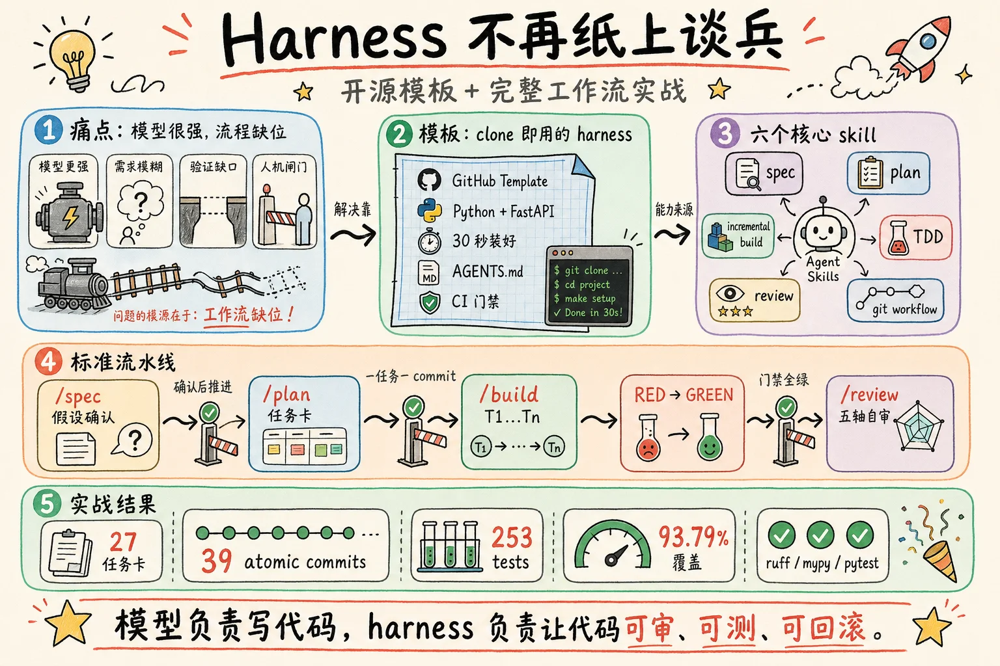
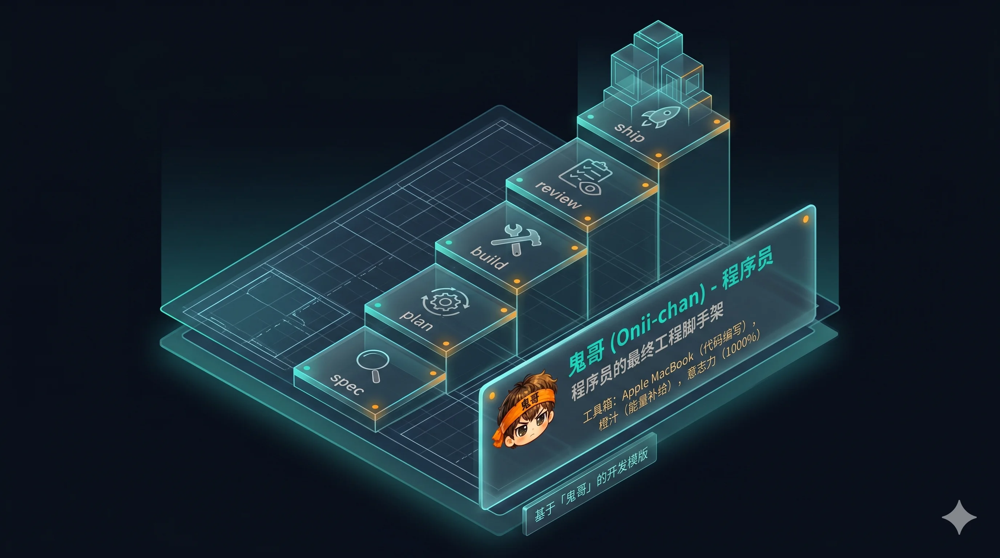
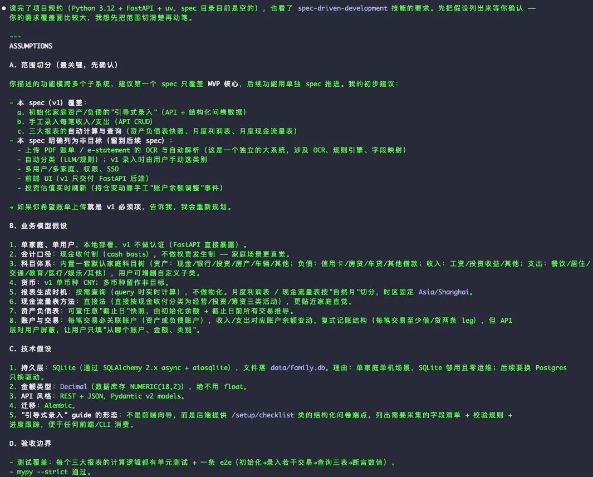
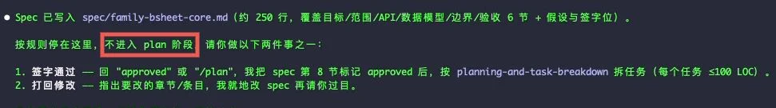
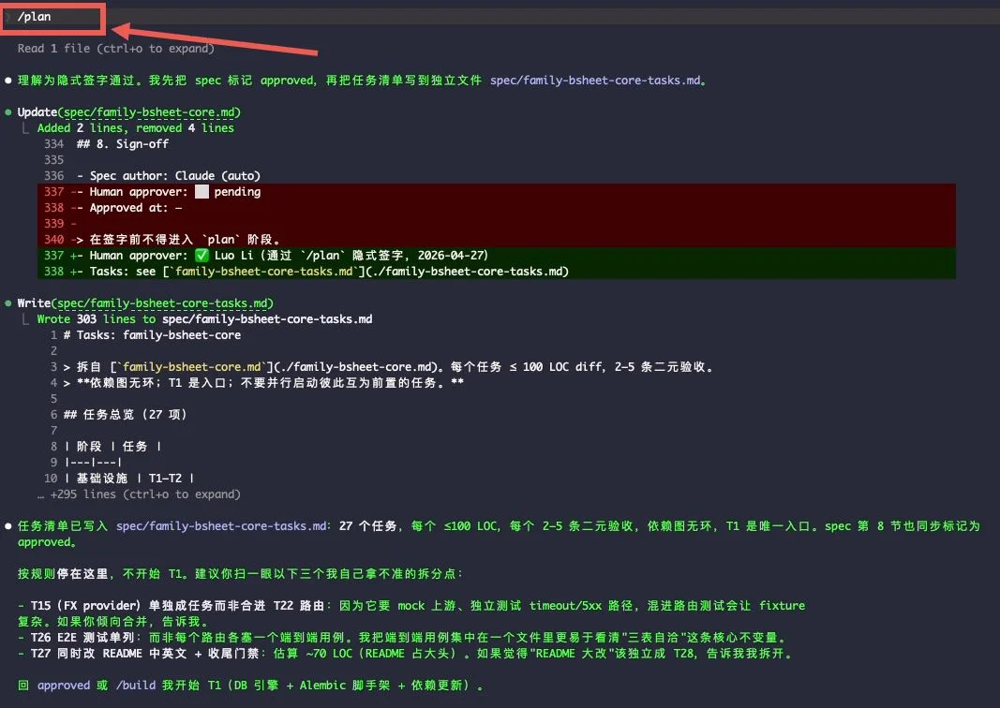
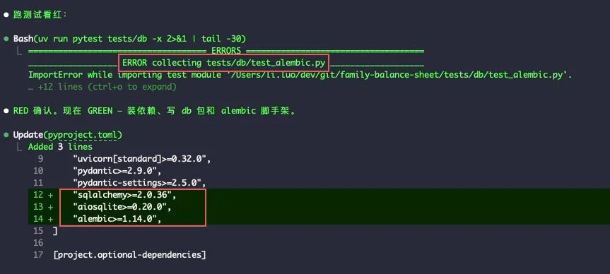
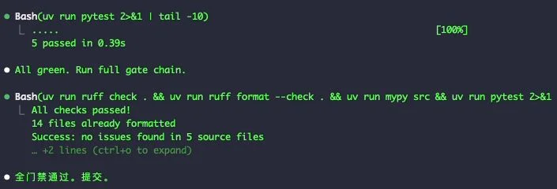
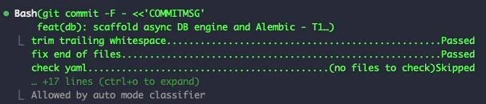
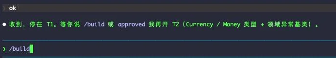

> 模型已经够强了。**接下来卡你的不是模型，是工作流。**

Codex-5.5、Claude Opus 4.7、Gemini 3、Grok 4 这一代模型出来之后，"AI 写代码"的天花板被肉眼可见地抬高了一格。一句模糊的需求扔进去，500 行能跑的代码就出来了。

但稍微跑过几个真项目你就会发现：模型再强，也只能解决"写代码"这一段；从需求到上线之间的所有事情——怎么拆需求、怎么管上下文、怎么验证、什么时候让人接管——需要一套系统化的运行规范。

**这就是 harness 要解决的问题。**

最近半年，[Anthropic、OpenAI、Google DeepMind、Stripe 一波接一波地讲 Harness Engineering](https://luoli523.github.io/p/harness-engineering/)；[Addy Osmani 把 Google 14 年工程文化压缩成 19 个 agent skill 开源放出来](https://luoli523.github.io/p/agent-skills-analysis/)；社区里"工作流第一、模型第二"几乎成了共识。**理论分析和最佳实践讨论已经够多了。**

但你打开 GitHub 想找一个能 clone 就用的脚手架，会发现极少。要么是 SaaS 公司的工作流截图（看不到代码），要么是某个 README 里散落的 `CLAUDE.md`（缺工具链衔接），要么是单个 skill 文件（没串成完整流水线）。**理论已经足够，缺的是开箱即用的脚手架。**

于是鬼哥我做了两件事：

1. 整理出一个 GitHub Template：[**`luoli523/harness-project-template`**](https://github.com/luoli523/harness-project-template) —— Python + FastAPI 起步，clone 即用，30 秒装好。
2. 用它从 0 跑了一个真实 v1 示例项目（多币种财务账本），**39 个 atomic commit、253 个测试、93.79% 覆盖**，从 SPEC 到 SHIP 一步没跳。

下面分两部分：先看模板长什么样、怎么用；再看那个 v1 项目是怎么从一句需求一步一步落到 39 个 commit 的，全程截图。



---

## 一、template：长什么样、怎么用

### 目录结构

```
harness-project-template/
├── .agent/prompts/      # 工具无关的 prompt 模板
├── .agents/skills/      # 6 个核心 skill（Claude Code + Codex 自动发现）
├── .claude/             # Claude Code 专属：slash commands + permissions
├── .github/workflows/   # CI 跑同一组门禁（ruff + mypy + pytest）
├── AGENTS.md            # 项目规约（所有 agent 必读）
├── CLAUDE.md            # 指向 AGENTS.md
├── src/<your_pkg>/      # FastAPI 脚手架（一个 /health 端点 + async 测试）
├── tests/
└── scripts/init-template.sh  # 一键改名 + sync + 装 hooks
```

事实来源在 `AGENTS.md` + `.agents/skills/`，工具特定入口（slash command）只是包装。**换 IDE 不用重新教 agent**，这是设计上的关键。

### 6 个核心 skill

这 6 个 skill 不是我自己造的——它们摘选自 Google 资深工程师 [Addy Osmani](https://addyosmani.com/) 开源的 [**`addyosmani/agent-skills`**](https://github.com/addyosmani/agent-skills) 项目（详细解读见 [Agent Skills：当 Google 工程文化遇上 AI 编程代理](https://luoli523.github.io/p/agent-skills-analysis/)）。Addy 把 Google 14 年工程文化压缩成 19 个 agent-executable skill，每个都是一份带"反合理化表"的 markdown 工作流。我没把 19 个全塞进模板，只放每个项目里**最小化能把项目跑起来**的 6 个：

| Skill | 何时调用 | 核心约束 |
|---|---|---|
| `spec-driven-development` | 新功能起步 | 先列假设清单 → 用户确认 → 写 spec |
| `planning-and-task-breakdown` | spec 通过后 | 拆成 ≤100 LOC 任务，每任务 2-5 条二元验收 |
| `incremental-implementation` | 单任务实现 | RED → GREEN → REFACTOR → atomic commit |
| `test-driven-development` | 任何业务逻辑 | 先写失败测试，看红，再写实现 |
| `code-review-and-quality` | 自审时 | 五轴顺序：correctness → readability → architecture → security → performance |
| `git-workflow-and-versioning` | 提交时 | 一任务一 commit，message 引用 spec |

剩下 13 个（staged rollout、deprecation migration、incident response 等）按需加，不在最小集合里。

### 三步起步

```bash
# 1. 拉模板（GitHub UI 用 "Use this template" 也行）
gh repo create my-service --template luoli523/harness-project-template --private --clone
cd my-service

# 2. 一键改名 + sync + 装 hooks + 跑门禁
./scripts/init-template.sh my_service

# 3. 启动开发服务器，验证脚手架已绿
uv run uvicorn my_service.main:app --reload
```

### 标准使用顺序

之后任何新功能都走这个流程：

```
/spec <feature>            # → 假设清单 → 你确认 → spec/<feature>.md
/plan spec/<feature>.md    # → 拆成 ≤100 LOC 任务清单
/build spec/<feature>.md T1   # 一次一个任务，TDD + atomic commit
/build spec/<feature>.md T2
... (重复直到 T_n)
/review                    # 五轴自审，找 bug 修 bug
```

每个 slash command 包装一个 skill，跨工具一致。换到 Codex CLI 用 `$spec-driven-development`、换到 Cursor 直接打开 `.agents/skills/<name>/SKILL.md` 让 agent 跟着读。

---

## 二、实战：从一句需求到 39 个 commit



光看模板不够说服力。下面是我用它跑一个真实 v1（多币种财务账本）的完整过程，截图为证。

### Step 1: `/spec` —— 一句话需求 → 假设清单

我扔进去的需求是这样：

> 我想做一个财务记账系统，自动按月生成资产负债表、利润表、现金流量表。日常货币是 SGD，CNY 消费、USD 投资、HKD 资产。

注意 AI 没有立即开始写 spec。skill 强制它**先列出所有它正打算做的隐含假设**，让我逐条确认：



四大类：**A. 范围切分（最关键，先确认）、B. 业务模型假设、C. 技术假设、D. 验收边界**。每条都是一个具体决定（"v1 不做权责发生制"、"HKD 折算并入而不单独成列"、"持久层用 SQLite"），等你 ✓。

这一步的真实价值：**它把需求里所有模糊的地方拽到表面**。你看到"v1 不做权责发生制"才会反应过来"等下，那利息预提怎么算？"——这才是真正要决定的事。

我逐条回 OK 之后，AI 才动手写 `spec/<feature>.md`。spec 写完，AI 主动停下：



> "按规则停在这里，**不进入 plan 阶段**。请做以下两件事之一：1. 签字通过——回 approved 或 /plan，或 2. 打回修改..."

**这就是 gated workflow 的实物体现**：闸门写在 skill 里，AI 自己执行。它不会越权，也不会替你决定 spec 通过没。

### Step 2: `/plan` —— 切成 27 个任务卡

spec 签字之后，`/plan` 命令把它拆成任务清单：



每个任务：≤100 LOC 估算、2-5 条二元验收清单、列出 blocker、依赖图无环。底部 AI 还会标注它**自己拿不准的拆分点**，建议我"扫一眼"——这种"主动暴露不确定性"也是 skill 引导出来的。

最终这个项目切成 27 个任务，覆盖基础设施 → 数据模型 → 纯函数业务逻辑 → 仓储 → 报表引擎 → HTTP 路由 → 横切错误处理 → E2E + 收尾。

### Step 3: `/build T1, T2, ... T27` —— 每任务一个 TDD 红绿循环

`/build T1` 开始第一个任务。RED 阶段——先写失败测试，跑红：



GREEN 阶段——装依赖、写实现、跑测试转绿、跑全门禁：



`ruff check` ✅、`ruff format --check` ✅、`mypy --strict` ✅、`pytest` ✅ —— 四道门禁全过才算 GREEN。

最后 atomic commit，pre-commit hooks 再过一遍，commit message 引用 spec + task ID：



**关键**：单任务做完，AI 自动停下，等下一个 `/build T2` 或 `approved`：



> "T1 完成，停在这里。等你说 /build 或 approved 我再开 T2..."

**不会顺手做下一个任务**，不会"图省事一次写完几个"。每个任务一个独立 commit、独立的 RED→GREEN→commit 循环。这种粒度对未来 git bisect 找 bug、git revert 回滚都是无可替代的。

T1 → T27 重复 27 次。

### Step 4: `/review` —— 五轴自审

27 个任务全做完后，`/review` 走五轴自审（correctness → readability → architecture → security → performance），找出了 5 个真 bug + 2 个 spec 漂移。每个发现拆成独立 fix commit + 测试，又是 7 个 commit。

### 最终交付

**39 个 atomic commit、253 个测试、93.79% 覆盖**。`ruff + ruff format + mypy --strict + pytest` 四道门禁全程绿。

从一句需求到能跑的 v1，全程留痕、可审计、可回滚。每个设计抉择有 spec 锚点；每个 commit 可独立 revert；每个 bug 修复有测试。**短期看慢一点，长期少欠一笔技术债。**

---

## 三、Takeaway：现在去 clone

理论文章已经读够多了。这一周我把工作流物化成模板 + 用它跑通一个真实项目，证明这套不是镜中水月。

**仓库地址**：[**`luoli523/harness-project-template`**](https://github.com/luoli523/harness-project-template) —— Python + FastAPI 起步，30 秒装好，欢迎试用。

**这套模板我会持续维护**：

- 你用它跑了项目、发现 skill 该改进、想加新 skill —— 提 issue 或 PR
- 你跑出来的项目踩了模板没覆盖的坑 —— 提 issue，我把教训沉淀回模板
- 你想要不同技术栈的类似脚手架（Go、Rust、TypeScript）—— 留言说明诉求，我考虑分仓维护

模型还会变强、context window 还会变大，但**让模型按工作流出活**这个能力不会自动到来。希望这个仓库帮你省掉前两天的摸索成本。

---

## 参考链接

- 上篇 1：[Harness Engineering：当模型够强，系统设计成为胜负手](https://luoli523.github.io/p/harness-engineering/)
- 上篇 2：[Agent Skills：当 Google 工程文化遇上 AI 编程代理](https://luoli523.github.io/p/agent-skills-analysis/)
- 模板仓库：[`luoli523/harness-project-template`](https://github.com/luoli523/harness-project-template)
- 原始 skills 项目：[`addyosmani/agent-skills`](https://github.com/addyosmani/agent-skills)
