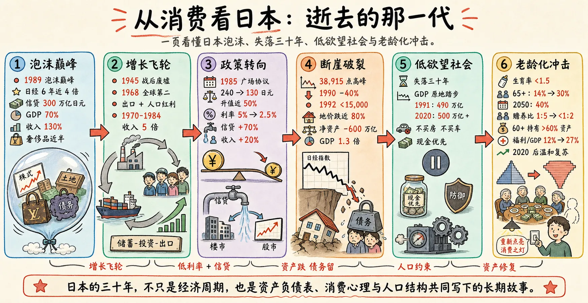
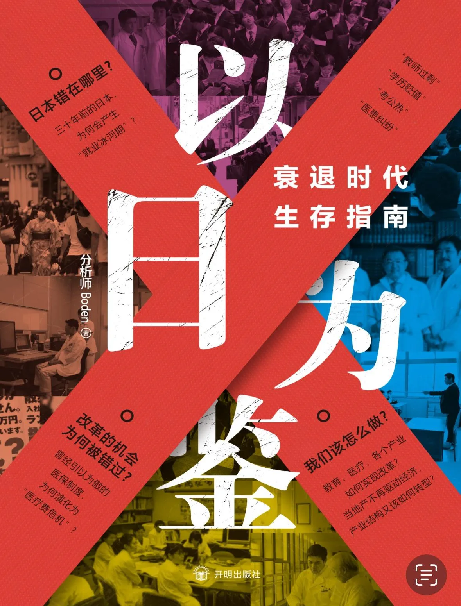
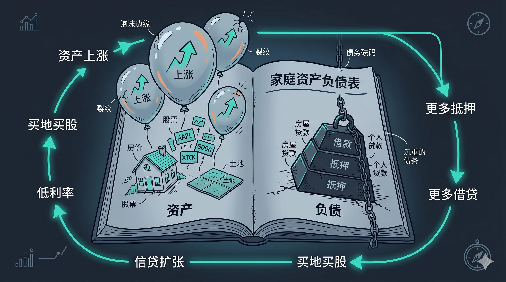
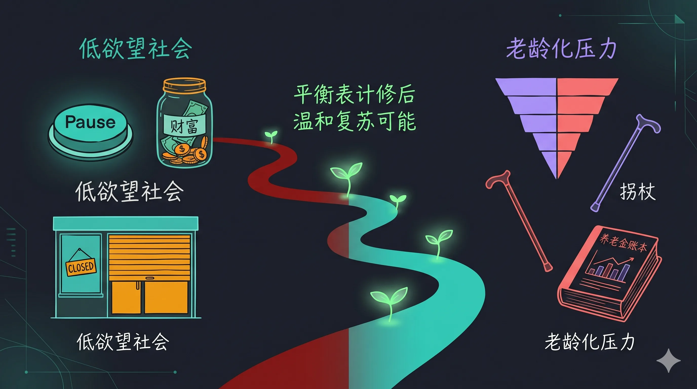

很多人以为日本的问题是“老龄化”。但读完《以日为鉴》后，我更强烈的感受是：**老龄化只是结果之一，真正可怕的是，一个社会在资产泡沫破裂后，连“想要更好生活”的冲动都被慢慢磨掉了。**

这篇文章不是对《以日为鉴》的逐章书摘，而是一次读后总结：我想把书里最有警示意味的主线，和“从消费看日本”的那条线索放在一起，重新理解日本的三十年。



---

## 1. 以日为鉴，不是为了嘲笑日本

“日本失落三十年”这个说法太常见了，常见到它已经有点像一个标签。

但标签最危险的地方，是它会让人误以为自己已经理解了问题。好像只要说出“泡沫破裂”“少子化”“老龄化”“低欲望社会”，日本的故事就讲完了。

《以日为鉴》真正值得读的地方，不在于它告诉我们日本哪里错了，而在于它提醒我们：**一个国家的衰退，往往不是从某一天突然开始的，而是从很多看起来正确的选择慢慢累积出来的。**

日本的泡沫不是从荒唐开始的。

它是从成功开始的。



---

## 2. 泡沫最迷人的地方，是它长在真实成功之上

1945 年，日本站在战后废墟上。城市破碎，产业崩塌，社会士气低落。

但随后几十年，日本走出了一条极其漂亮的增长曲线：美国冷战战略下的扶持、朝鲜战争带来的订单、出口导向的产业政策、低国防开支释放出的财政空间，再加上人口红利。

到 1968 年，日本已经成为全球第二大经济体。

1970 年到 1984 年，日本人均收入翻了 5 倍。

这不是骗局。这是真实增长。

问题在于，真实增长会给人一种危险的信念：**过去一直对，不代表未来也会一直对；但人在上升周期里，很难相信自己会错。**

日本泡沫最迷人的地方就在这里。它不是凭空吹出来的，而是建立在战后四十年成功经验之上。

当一个社会连续几十年都在向上，人们自然会相信：

| 当时的信念 | 后来的现实 |
|---|---|
| 土地永远稀缺 | 土地也会跌到卖不掉 |
| 股市只是短期调整 | 日经从高点断崖式下跌 |
| 借钱买资产是理性选择 | 债务不会跟着资产一起消失 |
| 日本模式会继续胜利 | 外需、汇率、人口都会反向作用 |

这也是《以日为鉴》最值得警惕的地方：**最危险的风险，往往不是发生在失败之后，而是发生在成功被过度外推之后。**

---

## 3. 资产上涨，会把债务伪装成财富

1985 年，《广场协议》签署。日元对美元从 240 升到 130，升值近 50%。

对出口型经济体来说，这几乎是一次剧烈地震。日本制造业突然发现，自己的产品在海外不再那么便宜了。订单、工厂、就业，全部开始承压。

为了避免经济硬着陆，日本选择了宽松。

1986 到 1987 年，日本央行把贴现率从 5% 降到 2.5%。信贷闸门打开，资金像水一样涌出来。

但这些钱并没有主要流回制造业，而是流向了土地和股票。

于是，一个经典循环启动了：

```text
低利率
  ↓
信贷扩张
  ↓
买地买股
  ↓
资产上涨
  ↓
抵押品变贵
  ↓
能借更多钱
  ↓
继续买资产
```

1985 到 1989 年，日本家庭平均收入只增长了 20%，但家庭信贷余额暴增 70%。

到 1989 年，日本家庭信贷余额突破 300 万亿日元，接近 GDP 的 70%，约等于可支配收入的 130%。

这就是资产泡沫最会骗人的地方：**资产在涨的时候，债务看起来不像债务，而像通往财富的门票。**

人们不是不知道自己在借钱。

他们只是相信，资产涨得更快。

---

## 4. 泡沫破裂后，最难修复的不是价格，而是心理

1989 年 12 月 29 日，日经指数收在 38,915 点，站上历史巅峰。

然后就是断崖。

1990 年，日经一年内蒸发超过 40%。到 1992 年，只剩不到 15,000 点。

房地产的反应更慢，但也更残酷。1991 年全国地价见顶，随后十年连续下挫，东京核心住宅用地跌去将近 80%。

这里有一个特别关键的概念：**资产负债表衰退**。

普通衰退里，人们可能只是收入减少、消费谨慎。但资产负债表衰退不一样：

| 项目 | 泡沫时期 | 破裂之后 |
|---|---|---|
| 房子 | 抵押品 | 卖不掉的负担 |
| 股票 | 财富幻觉 | 净资产缩水 |
| 债务 | 可以滚动 | 必须偿还 |
| 现金 | 低效率资产 | 安全感来源 |
| 消费 | 未来更好的证明 | 能省就省 |

到 1992 年，日本家庭净资产缩水约 600 万亿日元，约为当时 GDP 的 1.3 倍。

但债务不会因为资产下跌而自动消失。

于是家庭开始还债，企业开始收缩投资，银行开始谨慎放贷。整个社会不再追求扩张，而是进入一种长期防御姿态。

这就是我读《以日为鉴》时最有冲击感的一点：**日本的三十年，不只是在等经济复苏，而是在慢慢修一张被泡沫撕裂的资产负债表。**



---

## 5. 低欲望社会，不是“不上进”这么简单

很多人讲日本低欲望社会，会讲到那些熟悉的词：

- 不买房
- 不买车
- 不结婚
- 不生子
- 不换工作
- 不追求升职

这些现象当然重要，但如果只把它理解成“年轻人不努力”，就太浅了。

低欲望社会背后，是一代人的风险偏好被重塑了。

当你看到父母那一代在资产泡沫里受伤，当你从小生活在工资停滞、物价通缩、企业收缩的环境里，你很难自然地产生“明年会更好”的信念。

1991 年，日本 GDP 约为 490 万亿日元。到 2020 年，它仍在 500 万亿出头徘徊。

三十年，几乎原地踏步。

同期美国 GDP 增长约 3 倍，中国增长超过 20 倍。

所以低欲望并不只是个人选择，它也是宏观环境长期反馈出来的行为结果。

政策可以把利率降到零，可以发消费券，可以量化宽松，但如果一个社会的默认行为变成了“先还债、先存钱、先求稳”，钱就很难真正流动起来。

**经济政策能改变利率，但很难修复一代人的风险偏好。**

---

## 6. 老龄化让低欲望从心理问题变成结构问题

如果说泡沫破裂改变的是人的心理，那么老龄化改变的是整个社会的物理结构。

日本从 1990 年起就进入长期低生育率状态，生育率长期低于 1.5。

1994 年，日本 65 岁以上人口占比超过 14%，进入老龄化社会。

2025 年，这个数字达到 30%。

到 2050 年，可能达到 40%。

这意味着什么？

它不只是“老人多了”。它意味着消费、投资、创新的底层动力都在变化。

年轻人消费更多，借贷意愿更强，也更愿意尝试新东西。老年人更重视稳定，更少冒险，也更少大规模消费。

日本 60 岁以上人口掌握超过 60% 的金融资产，但他们的消费倾向是全社会最低的。

也就是说，钱还在，但它不太流动了。

与此同时，社会福利总支出占 GDP 的比重，从过去的 12% 升到现在的 27%。赡养压力、财政压力、医疗压力，都会压在更少的工作人口身上。

这时，低欲望就不只是心理创伤，而变成了一种结构结果。



---

## 7. 那日本还有没有希望？

有意思的是，2020 年后，日本似乎又出现了一点微弱变化。

居民收入开始正向增长，经济出现温和通胀，资产价格也有一定修复。

这不代表日本要重新起飞。

但它至少说明一件事：**资产负债表修复到一定程度后，社会行为是可能慢慢变化的。**

过去三十年，日本人在还债。家庭修复资产负债表，企业修复资产负债表，银行修复资产负债表，国家也在用财政转移支付维持社会稳定。

这是一场非常漫长、非常痛苦，但也非常现实的修复。

更微妙的是，人口下降也可能带来一种再分配效应。蛋糕没有变大，甚至小了一点，但桌上的人少了，年轻一代也许能继承前一代用三十年还债积累下来的资产。

这不是乐观预测，只是一个值得观察的变量。

---

## 8. 真正的提醒：不要等三件事同时转向

读《以日为鉴》，我最大的 takeaway 不是“不要变成日本”。

这句话太轻了。

真正的提醒是：**不要等资产负债表、消费心理和人口结构同时转向之后，才发现增长不是想重启就能重启的。**

日本的问题不是单点故障，而是三个系统互相咬合：

```text
资产泡沫破裂
  ↓
资产负债表受损
  ↓
家庭与企业长期还债
  ↓
消费和投资意愿下降
  ↓
低欲望社会成型
  ↓
生育率下行、老龄化加速
  ↓
消费、创新、财政继续承压
```

这也是为什么日本值得“以日为鉴”。

它不是一个失败样本。恰恰相反，日本在很长时间里维持住了社会稳定、公共秩序和基本生活质量。

但也正因为如此，它的故事更值得认真看。

如果一个国家在如此努力维持稳定的情况下，仍然被资产负债表、低欲望和老龄化拖住了三十年，那么后来者最该学习的，不只是怎么避免泡沫。

还包括怎么在增长还没消失之前，保护人们对未来的信心。

**经济最深层的燃料，不是货币，不是土地，也不是股票。是人们相信明天值得多做一点、多买一点、多试一次。**

一旦这种信念消失，修复它，可能真的需要一代人。

---

## 参考资料

- 《以日为鉴》，Boden 著，开明出版社
- Evelyn趣消费：《【深度】从消费看日本: 逝去的那一代》
- Richard C. Koo, *The Holy Grail of Macroeconomics: Lessons from Japan's Great Recession*
- 日本统计局及公开人口结构资料
