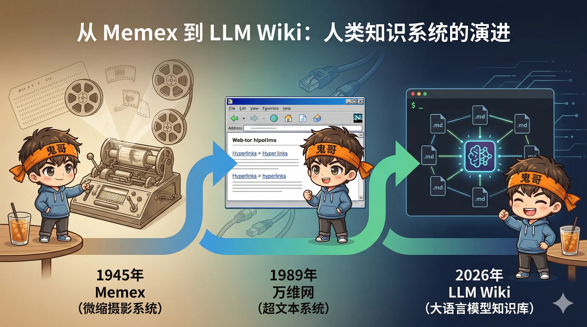
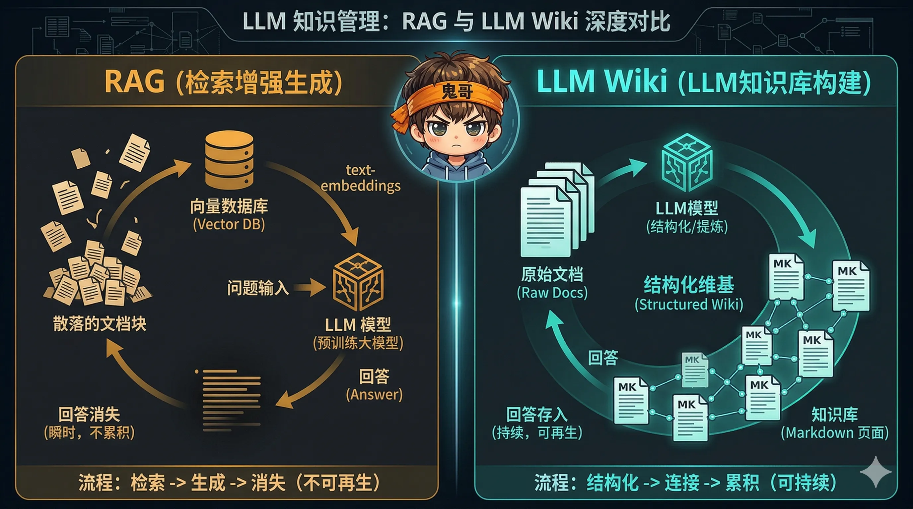
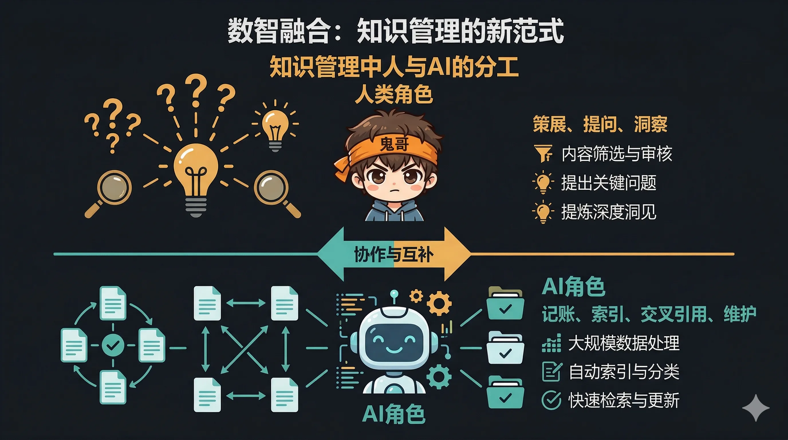
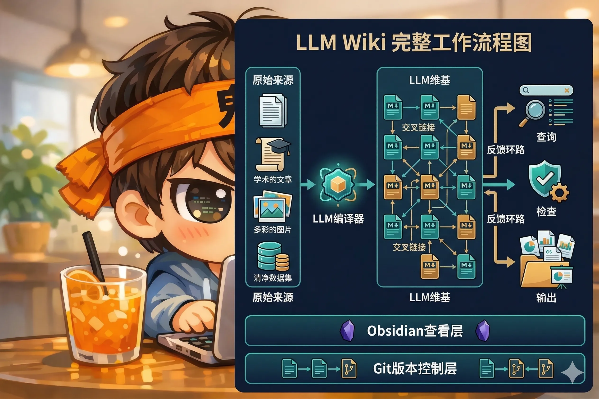

> "我最近大部分的 token 消耗，不再是在操作代码，而是在操作知识。"  —— Andrej Karpathy, 2026.04.03

2026 年 4 月 3 日，Karpathy 发了一条推文，描述了他最近用 LLM 构建个人知识库的工作流。第二天，他把这个想法整理成了一个 [GitHub Gist](https://gist.github.com/karpathy/442a6bf555914893e9891c11519de94f)，并提出了一个有趣的理念：**在 LLM Agent 时代，分享 idea 比分享代码更有价值——你把 idea 交给自己的 Agent，它会为你定制和构建一切。**

这条推文迅速引爆了技术社区。但在热度之下，Karpathy 真正提出的东西值得我们认真拆解：一种**用 LLM 编译知识（而非检索知识）**的全新范式。

本文将系统性地拆解这套思维体系——从它的历史渊源到技术架构，从与 RAG 的本质区别到社区的尖锐争论，最后给出可落地的实践路径。

---

## 一、从 1945 年说起：Bush 的 Memex 构想

要理解 Karpathy 在做什么，我们需要先回到 81 年前。

1945 年 7 月，Vannevar Bush 在《The Atlantic》发表了一篇名为 *"As We May Think"* 的文章，提出了 **Memex**（memory + index 的合成词）——一台桌面大小的设备，能存储一个人所有的书籍、记录和通信，并以"极快的速度和灵活性"供人检索。

Memex 最独特的设计是**关联路径（Associative Trails）**：用户可以在任意文档之间创建链式连接，模拟人类联想式思维，而非传统的层级索引。用户可以给这些路径加批注、创建分支，然后分享给同事。

这个构想直接影响了后来的一系列技术发明：

- **Douglas Engelbart**（1945）读到这篇文章后开始研究，最终发明了鼠标、文字处理器和超链接
- **Ted Nelson**（1965）明确引用 Memex，创造了"超文本"（Hypertext）这个概念
- **Tim Berners-Lee**（1989）在此基础上构建了万维网
- **DARPA**（2014）直接以 Memex 命名了一个研究项目

但 Bush 的构想有一个致命缺陷：**维护成本**。谁来持续更新这些关联路径？谁来在新文档加入时更新所有相关的交叉引用？谁来标注新旧信息之间的矛盾？

答案在 81 年后到来：**LLM。**

> Bush 的 Memex 构想其实比万维网更接近 Karpathy 的方案——Web 是公开的、混乱的、弱链接的；Memex 是私人的、策展的、富链接的。



---

## 二、核心洞察：编译知识，而非检索知识

### RAG 的根本问题

目前大多数人使用 LLM 处理文档的方式是 **RAG（Retrieval-Augmented Generation）**：上传文件 → 切块建索引 → 查询时检索相关片段 → 生成回答。

Karpathy 一针见血地指出了 RAG 的本质问题：

> **"LLM 每次查询都从零重新发现知识。什么都不积累。"**

这就像一个图书管理员，每次有人来问问题，他都要从头翻阅所有的书，找到相关段落，拼凑出一个答案。下次同样的人来问相关的问题，他又从头来一遍——完全不记得上次的工作。

RAG 的具体局限：

| 维度 | RAG 的问题 |
|------|-----------|
| **知识综合** | 只检索扁平文档，不在文档间创建关联和综合 |
| **复利效应** | 答案每次重新推导，知识不累积 |
| **检索噪声** | 基于嵌入的检索容易出现语义/词汇不匹配的静默失败 |
| **基础设施** | 需要向量数据库、嵌入模型、分块策略等一整套基建 |
| **上下文窗口** | 即使 2M token 也只能装约 300-400 页，一份财报就可能耗尽 |

### 知识编译：一种新范式

Karpathy 的替代方案是：**不要只在查询时检索原始文档，而是让 LLM 增量地构建和维护一个持久的 Wiki。**

当添加新资料时，LLM 不仅仅是索引它。它会：

1. **阅读**全文并提取关键信息
2. **整合**到现有的 wiki 知识体系中
3. **更新**相关的实体页面
4. **修正**已有的摘要
5. **标注**新旧信息之间的矛盾
6. **强化**跨文档的综合分析

**知识编译一次，持续维护，而非每次查询都重新推导。**

一个形象的比喻：

- **RAG** = 一个有超快叉车的巨型仓库——什么都能找到，但不能解释货物之间的关系
- **LLM Wiki** = 一个有专职图书管理员的策展图书馆——管理员不断写新的综述来描述和关联旧有的藏书

### 关键区别：Wiki 是一个持续复利的知识制品

交叉引用真实存在，矛盾被标注，综合分析反映了所有已读内容。**Wiki 随着每一个新来源和每一次提问而变得更丰富。**



---

## 三、三层架构

Karpathy 在 Gist 中明确定义了三层架构：

```
┌─────────────────────────────────────────┐
│           The Schema（配置层）            │
│  CLAUDE.md / AGENTS.md                  │
│  定义 wiki 结构、惯例、工作流             │
├─────────────────────────────────────────┤
│           The Wiki（知识层）              │
│  LLM 生成和维护的 .md 文件               │
│  摘要 / 实体页 / 概念页 / 综述 / 索引     │
├─────────────────────────────────────────┤
│        Raw Sources（原始资料层）           │
│  不可变的策展文档                         │
│  文章 / 论文 / 图片 / 数据集 / 代码库     │
└─────────────────────────────────────────┘
```

### 第一层：Raw Sources（原始资料）

这是**不可变的事实来源**。文章、论文、图片、数据文件——只进不改。所有的原始材料都保存在 `raw/` 目录中。

采集工具：
- **Obsidian Web Clipper** 浏览器扩展：一键将网页文章转为 markdown
- 配合 Obsidian 快捷键将相关图片下载到本地，方便 LLM 直接引用
- 手动放入的论文 PDF、数据集等

### 第二层：The Wiki（知识层）

这是 LLM 生成和维护的核心层——一组结构化的、互相链接的 markdown 文件。包括：

- **摘要页**：每个原始资料的关键要点提炼
- **实体页**：人物、组织、技术的专属页面
- **概念页**：抽象概念的解释和关联
- **综述页**：跨多个来源的主题综合分析
- **索引文件**：全局目录和导航

**关键原则：人类几乎不直接编辑 wiki，这是 LLM 的领地。** 你负责策展来源、提出问题、引导方向；LLM 负责所有的簿记工作。

### 第三层：The Schema（配置层）

一个配置文档（如 `CLAUDE.md` 或 `AGENTS.md`），定义：

- Wiki 的目录结构和命名规范
- 页面的模板格式
- 摄入新资料时的工作流程
- 质检的标准和流程

这个配置层将 LLM 从通用聊天机器人转变为**结构化的知识维护者**。

---

## 四、三大核心操作

### 操作一：Ingest（摄入）

当你往 `raw/` 目录放入新资料时：

1. LLM 阅读原始资料
2. 与你讨论关键要点
3. 写摘要页，放入 wiki
4. 更新 `index.md`（全局目录）
5. 遍历已有的 wiki 页面，更新所有相关的实体页和概念页
6. 在 `log.md` 中追加操作记录

一次摄入可能会触及 **10-15 个 wiki 页面**——这正是 LLM 维护的核心价值：人类不可能每加入一份资料就手动更新十几个页面，但 LLM 可以。

### 操作二：Query（查询）

当你向 LLM 提问时：

1. LLM 首先读取 `index.md` 了解知识库全局结构
2. 根据问题定位相关的 wiki 页面
3. 阅读相关页面，综合回答，**附上引用来源**
4. **如果答案质量足够好，将其作为新页面归档到 wiki 中**

最后一点至关重要——你的探索和提问不是一次性的消耗，而是**持续增值的投资**。每一次高质量的问答都会回流到知识库中，让它在下一次查询时更加丰富。

Karpathy 的研究 wiki 在单个主题上已经增长到 **~100 篇文章、~40 万词**。令人惊讶的是，在这个规模下，他发现**不需要花哨的 RAG——LLM 自动维护的索引文件和简要摘要，已经足够让它找到所有重要的相关数据**。

### 操作三：Lint（质检）

定期对 wiki 进行"健康检查"：

- **矛盾检测**：不同页面之间的数据冲突
- **过时标注**：可能已经不准确的断言
- **孤立页面**：没有任何入链的页面
- **缺失引用**：应该存在但缺失的交叉引用
- **数据空白**：知识库中缺失的重要概念
- **新文章建议**：基于已有数据，发现值得深入探索的新方向

LLM 擅长的不只是回答问题，还包括**提出问题**。Lint 操作让知识库自我进化。

---

## 五、关键基础设施：索引与日志

### index.md —— 知识的目录

这是 LLM 回答问题时**首先读取的文件**：

- 以类别组织的全局目录
- 每个页面附有链接、简要摘要和元数据
- 每次 Ingest 后自动更新

```markdown
## 机器学习

- [Transformer 架构](concepts/transformer.md) — 自注意力机制的核心原理及变体
- [LoRA 微调](concepts/lora.md) — 低秩适应的参数高效微调方法
- [MoE 架构](concepts/moe.md) — 混合专家模型的路由策略和效率权衡

## 论文摘要

- [Attention Is All You Need](summaries/attention-paper.md) — Transformer 原始论文要点
- [LoRA Paper](summaries/lora-paper.md) — 低秩适应方法的理论基础
```

### log.md —— 操作的时间线

一个**只追加（append-only）**的时间记录：

```markdown
## [2026-04-01] ingest | Attention Is All You Need
添加 Transformer 原始论文。新建概念页：transformer.md, self-attention.md。
更新：index.md, nlp-overview.md

## [2026-04-02] query | MoE vs Dense 的效率权衡
回答了关于 MoE 架构的查询，综合了 3 篇论文的观点。
输出归档为：analysis/moe-vs-dense.md

## [2026-04-03] lint | 健康检查
发现 2 个矛盾（transformer.md 与 attention-paper.md 的参数数量不一致），
标注 3 个孤立页面，建议新文章：positional-encoding.md
```

这个日志有两个作用：一是让你追踪知识库的演化历程，二是其一致的格式使得程序化解析成为可能。

---

## 六、工具生态

### Obsidian：知识的可视化前端

Karpathy 使用 Obsidian 作为**阅读和导航界面**——不是用来写（写是 LLM 的事），而是用来**看**：

- **Graph View**：以图谱形式展示所有文章的互链关系，一眼看到知识结构
- **实时渲染**：LLM 在后台编辑 markdown 文件时，Obsidian 实时更新显示
- **反向链接面板**：查看哪些页面引用了当前页面
- **Dataview 插件**：查询 YAML frontmatter，生成动态表格

### Marp：从知识到演示

[Marp](https://marp.app/) 是一个基于 markdown 的幻灯片工具。你可以让 LLM 从 wiki 中提取内容，直接生成演示文稿——知识到输出的转化链路极短。

### QMD：本地搜索引擎

当知识库规模增大时，需要更精确的搜索。[QMD](https://github.com/tobi/qmd) 是 Shopify 创始人 Tobi Lutke 开发的本地 markdown 搜索引擎：

- **`qmd search`**：BM25 全文关键词搜索（快速，无需模型）
- **`qmd vsearch`**：语义向量搜索（找概念相关但无关键词重叠的内容）
- **`qmd query`**：混合搜索 + LLM 重排序（最高质量）

所有处理在本地运行，支持 MCP Server 协议，可直接被 Claude Code 等 Agent 调用。

号称能实现 **95%+ 的 token 节省**——哲学是：与其把整个知识库塞进上下文窗口，不如精确搜索后只传递相关内容。

### Git：时间机器

整个 wiki 就是一个 git 仓库。每一次 Ingest、Query、Lint 都产生可追踪的 diff。你可以：

- 用 `git log` 追踪知识的演化
- 用 `git blame` 追溯每一行的来源
- 用 `git diff` 查看每次操作的具体变更
- 随时回滚到任意历史状态

**纯文本 + Git = 可移植、有版本控制、工具无关、面向未来。文件比应用活得更久。**

---

## 七、为什么这套方法真的有效

Karpathy 给出了一个简洁有力的解释：

> **"维护知识库的枯燥部分不是阅读或思考——而是簿记。"**

更新交叉引用、保持摘要最新、标注矛盾、维护一致性——这些工作是人类放弃维护 wiki 的根本原因。企业内部的 Confluence 为什么总是过时？个人的 Notion 笔记为什么半年后就成了废墟？因为**维护成本太高**。

LLM 解决了这个问题：

- **不会厌倦**：更新 15 个页面的交叉引用对 LLM 来说和更新 1 个一样轻松
- **不会遗忘**：每次 Ingest 都会检查所有相关页面
- **成本趋近于零**：维护的边际成本几乎可以忽略
- **无限耐心**：Lint 操作需要 N×N 的比较？没问题

人类负责有创造力的部分：**选择什么值得读、提出什么问题、决定往什么方向深入。** LLM 负责一切机械性的簿记工作。

---

## 八、社区的尖锐争论

这条推文引发了激烈的讨论。支持者和批评者都提出了有价值的观点。

### 支持方

**"每家企业都有一个 raw/ 目录，但没人编译过它。这就是产品。"** —— 创业者 Vamshi Reddy 一语道破了商业潜力。

**"这样你拥有记忆；在现有的平台部署中，拥有记忆的是平台。"** —— TeMPOraL 指出了数据主权的关键优势。所有数据都是本地 markdown 文件，不依赖任何平台。

### 批评方：思考的摩擦力

最有哲学深度的批评来自知识管理社区。

Extended Brain 的一篇分析文章直接指出了**"思考的摩擦力"**问题：Niklas Luhmann 的 Zettelkasten（卡片盒笔记法）之所以有效，是因为**手动用自己的话重写想法**这个动作本身就是思考的机制。当你写到一半写不下去的时候，那个卡壳的瞬间恰恰暴露了你理解上的空白——这种**有价值的阻力**，是 LLM 生成的综合分析无法替代的。

Hacker News 的 qaadika 也提出了类似观点：

> **"正是在做这些事情的过程中，新想法才会涌现……我的许多洞见都来自于偶然看到一条笔记紧接着另一条笔记。"**

### 批评方：幻觉污染

另一个实际的担忧：LLM 在生成 wiki 内容时可能引入幻觉，而这些幻觉会被后续的查询当作事实引用，形成**幻觉的复利效应**——不是知识在复利增长，而是错误在复利增长。

jdthedisciple 在 HN 上说：**"我宁愿每次都引用原始文档，而不是一个我可能没时间去核实的 LLM 生成的 wiki。"**

### 我的看法：两者不矛盾

这两种批评都有道理，但并不意味着 LLM Wiki 模式无价值。关键是找到正确的分工：

- **LLM 负责基础设施和地图**：索引、交叉引用、摘要、矛盾标注
- **人类负责综合和思考**：基于 LLM 的地图，做出自己的判断和创造
- **溯源机制不可省略**：每一个 wiki 断言都应该能追溯到 `raw/` 中的原始来源

社区中一些成熟的实现已经在解决这些问题：基于内容 hash 的新鲜度验证、propositions 级别的来源追踪、AI 生成内容和人类编写内容的明确标记等。



---

## 九、社区实践中沉淀的高级模式

Gist 的评论区和 HN 讨论中，实践者们贡献了不少有价值的改进模式：

### 1. 分类后再提取

不同类型的文档需要不同的处理策略——报告和信件的提取方式完全不同。先分类，再用对应的模板提取。

### 2. Token 预算分级

为索引设计四级上下文策略：

| 级别 | 内容 | 用途 |
|-----|------|------|
| L0 | 页面标题列表 | 快速概览 |
| L1 | 标题 + 一句话摘要 | 定位相关页面 |
| L2 | 完整摘要 | 深入了解 |
| L3 | 全文 | 精确引用 |

LLM 根据查询复杂度选择合适的级别，避免要么读太少要么烧光上下文。

### 3. 类型化模板

使用基于实体类型的页面结构（人物模板、技术模板、论文模板），而非通用模板。这比自由格式能更好地维护一致性。

### 4. 决策记录

不只记录"知识变了什么"，还记录"为什么变"。当 wiki 页面被修改时，同时生成 decision record 记录推理过程和被否决的替代方案。

### 5. 隐私分层

敏感内容用本地模型（如 Ollama）处理，通用内容用云端模型（如 Claude）。这让机构级部署成为可能。

### 6. 规模瓶颈感知

纯 markdown 方案在 **~500 个文档** 以内表现良好。超过这个规模，考虑引入 SQLite 存储元数据，或使用 QMD 等搜索工具辅助定位。

---

## 十、未来方向：从上下文到权重

Karpathy 在推文中提到了一个意味深长的方向：

> **"当知识库足够大时，自然会想到合成数据生成 + 微调，让 LLM 把数据'知道'在权重里，而非仅靠上下文窗口。"**

这描述了一条完整的知识管道：

```
原始资料 → LLM 编译为 wiki → wiki 作为高质量训练数据 → 微调领域专用模型
```

一个维护良好的 wiki 本身就是**高质量的合成训练数据**——它结构化、有引用、有交叉验证、不断被 lint。这可能是通往个人化、领域化 LLM 的最自然路径。

加上上下文窗口的指数级增长（GPT-3 的 2K → Gemini 2.0 Pro 的 2M，**1000 倍增长**），"把整个 wiki 加载到单次上下文"的方式在当前规模下完全可行，无需向量数据库。

---

## 十一、动手实践：从零构建你的 LLM Wiki

理论说完了，下面是可执行、可落地、可见成效的实践路径。

### 阶段一：最小可行 Wiki（第 1-2 天）

**目标**：跑通完整的 Ingest → Query 循环，感受知识编译的效果。

**具体步骤**：

1. **创建项目目录结构**

```bash
mkdir -p my-wiki/{raw,wiki,wiki/summaries,wiki/concepts}
cd my-wiki
git init
```

2. **编写 Schema 文件**

创建 `CLAUDE.md`（如果用 Claude Code）或等效的系统提示：

```markdown
# Wiki Schema

## 结构
- raw/: 原始资料，只读
- wiki/index.md: 全局目录，按类别组织
- wiki/log.md: 操作日志，只追加
- wiki/summaries/: 每个原始资料的摘要
- wiki/concepts/: 概念页面

## Ingest 工作流
当我说"ingest <文件>"时：
1. 阅读 raw/ 中的指定文件
2. 在 wiki/summaries/ 创建摘要页
3. 识别关键概念，创建或更新 wiki/concepts/ 中的概念页
4. 更新 wiki/index.md
5. 在 wiki/log.md 追加记录

## 页面格式
每个 .md 文件开头包含 YAML frontmatter：
- title, date, sources, related
```

3. **采集 3-5 篇你感兴趣领域的文章到 `raw/`**

可以用 Obsidian Web Clipper，也可以手动复制粘贴为 markdown。

4. **逐个 Ingest**

在 Claude Code（或你选择的 LLM Agent）中：

```
ingest raw/article-1.md
```

观察 LLM 如何创建摘要、识别概念、更新索引。

5. **提一个需要跨文档综合的问题**

```
这几篇文章在 XX 主题上有什么共识和分歧？
```

**预期成果**：3-5 篇原始资料 → 3-5 个摘要页 + 若干概念页 + 1 个索引 + 1 个日志。你会直观感受到"编译"和"检索"的区别。

### 阶段二：建立 Obsidian 工作流（第 3-5 天）

**目标**：让知识库可视化，建立高效的采集通道。

**具体步骤**：

1. **用 Obsidian 打开 wiki 目录**

- 安装 Obsidian，将 `my-wiki/` 作为 Vault 打开
- 打开 Graph View，观察页面互链的图谱

2. **安装关键插件**

| 插件 | 用途 |
|-----|------|
| Obsidian Web Clipper | 一键采集网页到 `raw/` |
| Dataview | 动态查询 frontmatter 数据 |
| Marp Slides | 将 wiki 内容转为幻灯片 |

3. **建立采集习惯**

- 浏览到有价值的文章 → Web Clipper 保存到 `raw/`
- 下载相关图片到本地（Obsidian 快捷键）
- 定期（每天或每周）批量 Ingest

4. **开始提问和归档**

- 每次查询后评估答案质量
- 好的答案让 LLM 归档为新 wiki 页面

**预期成果**：原始资料增长到 10-20 篇，wiki 开始呈现有意义的图谱结构。

### 阶段三：引入 Lint 和工具链（第 2-3 周）

**目标**：让知识库自我进化，提升数据完整性。

**具体步骤**：

1. **运行第一次 Lint**

```
对整个 wiki 做一次健康检查：
- 找出页面之间的矛盾
- 标注可能过时的断言
- 列出缺失交叉引用的孤立页面
- 建议值得新增的概念页
```

2. **安装 QMD**（可选，当规模超过 50 篇时建议引入）

```bash
npm install -g @tobilu/qmd
qmd index wiki/
qmd search "你的查询"
```

3. **建立定期维护节奏**

- 每周一次 Lint
- 每次 Lint 后根据建议执行 2-3 个改进
- 追踪 `log.md` 的增长趋势

**预期成果**：wiki 开始自我修复和自我增强。你会发现 LLM 建议的新方向经常出乎意料地有价值。

### 阶段四：输出和复用（第 4 周+）

**目标**：让知识库产出实际价值。

**具体场景**：

- **写报告**：让 LLM 基于 wiki 生成特定主题的分析报告
- **做演示**：用 Marp 格式输出幻灯片
- **生成可视化**：让 LLM 用 matplotlib 生成数据图表
- **回答复杂问题**：wiki 越大，能回答的问题越复杂
- **发现盲区**：通过 Lint 发现你知识体系中的空白

每一次输出都可以考虑归档回 wiki，形成正向循环。

### 进阶方向

当你的 wiki 稳定运行一个月以上，可以考虑：

- **多主题 Wiki**：为不同研究方向建立独立的 wiki
- **MCP 集成**：将 wiki 搜索暴露为 MCP Server，让其他 Agent 也能查询
- **自定义 CLI 工具**：基于你的特定需求开发辅助脚本
- **微调实验**：将 wiki 内容转化为 QA 对，微调一个领域专用的小模型

---

## 十二、总结

Karpathy 提出的不是一个工具，而是一个**设计模式**：

1. **人类策展，LLM 编译**——人负责选择、提问、思考；LLM 负责簿记、索引、维护
2. **编译优于检索**——知识编译一次、持续更新，而非每次查询都从零推导
3. **复利效应**——每一次 Ingest 和 Query 都让知识库变得更丰富
4. **维护成本趋零**——LLM 解决了 Bush 1945 年就发现的维护问题
5. **纯文本哲学**——Markdown + Git，可移植、有版本、面向未来

从 1945 年 Vannevar Bush 的 Memex 构想，到 2026 年 Karpathy 的 LLM Wiki 实践，人类花了 81 年找到了解决个人知识管理维护难题的方案。答案是：**把维护交给不会厌倦的 LLM，把思考留给自己。**



---

## 参考资料

- [Karpathy 原始推文](https://x.com/karpathy/status/2039805659525644595)（2026.04.03）
- [Karpathy GitHub Gist: LLM Wiki](https://gist.github.com/karpathy/442a6bf555914893e9891c11519de94f)（2026.04.04）
- [Hacker News 讨论](https://news.ycombinator.com/item?id=47640875)
- [Vannevar Bush, "As We May Think", The Atlantic, 1945](https://www.w3.org/History/1945/vbush/vbush.shtml)
- [QMD - Local Markdown Search Engine](https://github.com/tobi/qmd)
- [Extended Brain: "The Wiki That Writes Itself"](https://extendedbrain.substack.com/p/the-wiki-that-writes-itself)
- [A-MEM: Agentic Memory for LLM Agents (arXiv:2502.12110)](https://arxiv.org/abs/2502.12110)
- [Awesome LLM Knowledge Bases](https://github.com/SingggggYee/awesome-llm-knowledge-bases)
