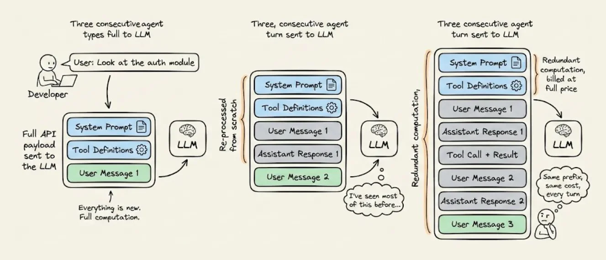
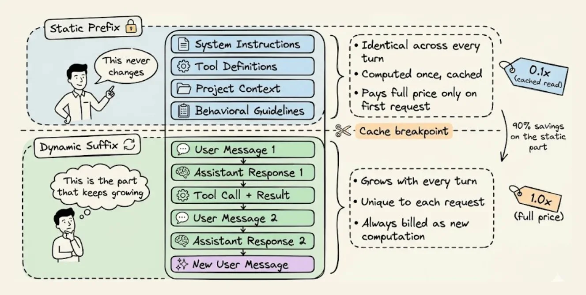
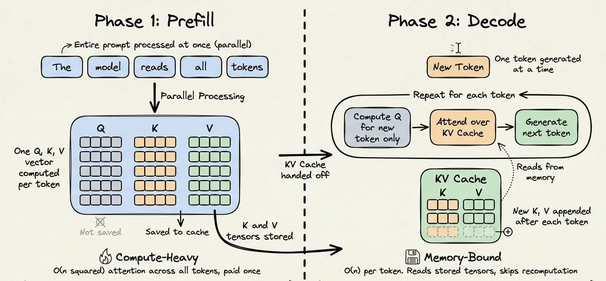
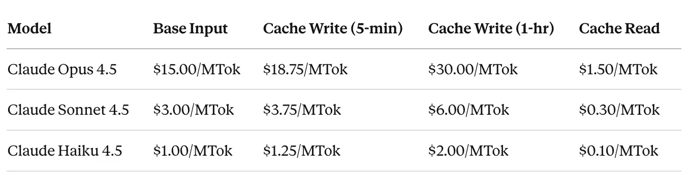
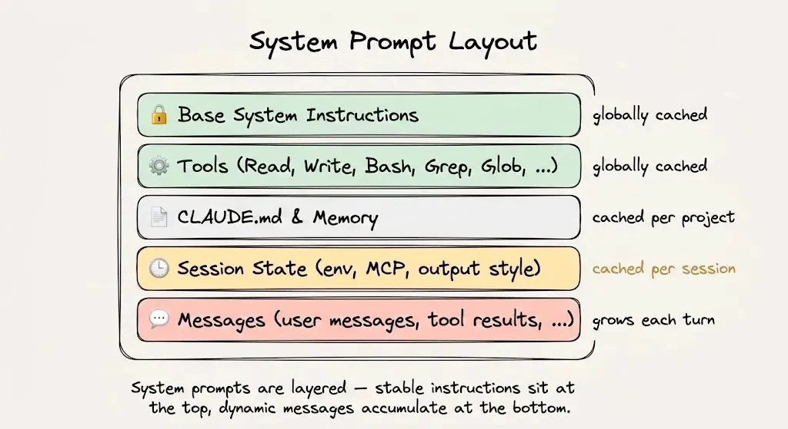
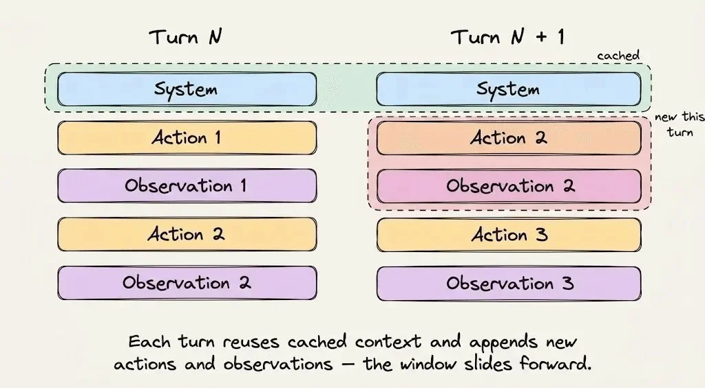
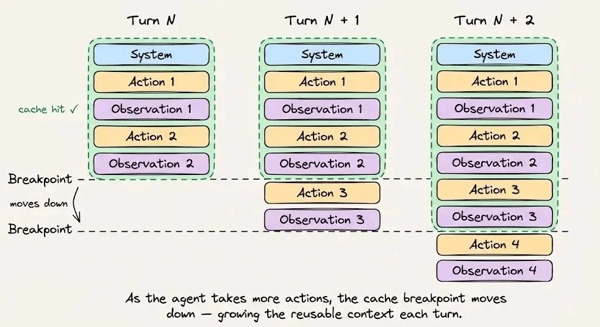
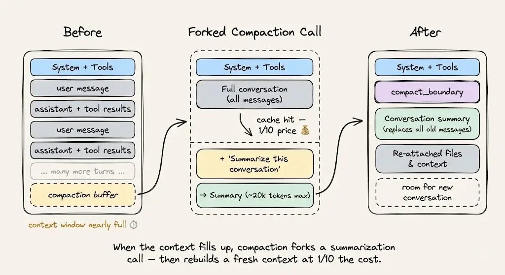

你有没有想过这样一个问题：

当你跟 Claude Code 对话了 30 分钟，中间来回几十个 tool call 之后，**每一次它要回复你，都会把前面所有的对话历史重新发一遍给模型。**

System prompt、tool schema、CLAUDE.md 里的项目约定、三轮之前已经处理过的那些文件内容——**全部重新读、重新算、重新计费。**

这不是 bug，是 LLM API 的工作方式。对于长会话的 Agent 来说，这种"重复计算"往往是你 AI 基础设施账单里**最贵的一项**。

举个数：一个 2 万 token 的 system prompt，跑 50 轮对话，那就是 **100 万 token 的纯冗余计算**，全部按输入价格计费，产生零新价值。而这笔开销会在每个用户、每个 session 上复利叠加。

解决办法是 **Prompt Caching**。但要真正把它用好，你得先搞清楚底下到底发生了什么。

这篇文章来自 [Avi Chawla 的一篇推文](https://x.com/_avichawla/status/2044670188998803855)，作者把 Claude 如何做到 **92% 缓存命中率**这件事讲得非常透彻。我把它翻译整理出来，并加入了一些自己使用 Claude Code 过程中的观察。

---

## 一、静态上下文 vs 动态上下文

要优化一个 prompt，你得先理清楚：**哪些是会变的，哪些是不变的。**

每一次 Agent 的请求，其实都由两个**本质上完全不同**的部分组成：

| | 内容 | 特征 |
|---|---|---|
| **静态前缀** | system 指令、tool 定义、项目上下文、行为规范 | 每轮都一样，永远不变 |
| **动态后缀** | 用户消息、模型回复、tool 输出、终端观察 | 每轮都在增长 |

**这个划分，就是 prompt caching 能成立的前提。**

推理基础设施会把静态前缀对应的数学状态（也就是 KV tensor）存下来，让后续发送**完全相同前缀**的请求可以直接跳过计算，从内存里读出来。

一旦你把这件事想通，后面所有的架构决策，都会变得非常显然。

---

## 二、KV Cache 到底在缓存什么

要理解为什么缓存这么有效，得先看 Transformer 处理你的 prompt 时到底做了什么。

LLM 推理有两个阶段：

- **Prefill 阶段**：处理你输入的整个 prompt。在所有 token 上跑一轮密集矩阵乘法，构建模型的内部表示。这个阶段是 **compute-bound**（算力瓶颈），非常贵。
- **Decode 阶段**：一个 token 一个 token 地生成。每次把新 token 追加到序列里，预测下一个。这个阶段是 **memory-bound**（显存瓶颈），因为大部分工作是在读历史状态。

在 prefill 阶段，Transformer 会为**每一个 token** 计算三个向量：**Query、Key、Value**。Attention 机制用它们来决定每个 token 跟其他 token 的关系。

关键在于：**一个 token 的 Key 和 Value 只依赖于它前面的那些 token。一旦算出来，就永远不会变。**

<video src="kv-attention.mp4" autoplay loop muted playsinline style="width:100%;max-width:100%;border-radius:8px;"></video>

没有缓存的情况下，这些 Key 和 Value tensor 在每次请求结束后就被丢掉了，下次请求要从头再算一遍。对于 2 万 token 的前缀，那就是 2 万 token 的 attention 计算——完全没必要重复。

**KV Cache** 的做法是：把这些 tensor 持久化在推理服务器上，用 token 序列的**加密哈希**做索引。当新请求进来、前缀完全一致时，哈希命中，tensor 直接从内存里加载，这段 prefill 计算**整个跳过**。

这把每生成一个 token 的计算复杂度从 **O(n²)** 降到 **O(n)**。对于一个重复使用 50 轮的 2 万 token 前缀，省下的算力是非常可观的。

---

## 三、经济账

定价结构才是让这个架构决策**真正有分量**的地方。

- **Cache Read**：0.1x 的基础输入价格——也就是**九折优惠，打完一折**。
- **Cache Write**：1.25x 的基础价格——存 KV tensor 要加收 25% 溢价。
- **Extended 1-hour Caching**：2.0x 的价格。

下面是 Claude 各模型的具体价格：

**但这笔账只有在缓存命中率够高的时候才划算。**

生产环境里最好的例子，就是 Claude Code。

---

## 四、Claude Code 的 30 分钟实录

Claude Code 的整个架构设计，都围绕一个目标展开：**让缓存一直保持热的（keep the cache hot）。**

下面这段是一次真实的 30 分钟编码会话从**计费视角**看起来是什么样的：

> **第 0 分钟**：Claude Code 加载 system prompt、tool 定义、项目 CLAUDE.md 文件。这个载荷**超过 2 万 token**，而且每个 token 都是新的，这是**整场会话里最贵的一刻**。但这笔钱你只付一次。
>
> **第 1-5 分钟**：你开始下指令，Claude Code 派出 Explore Subagent 在代码库里游走，打开文件、跑 grep 命令。所有这些都被追加到动态后缀里。但那 2 万 token 的静态前缀现在是在**以 $0.30/MTok 的缓存价读取**，而不是 $3.00/MTok。
>
> **第 6-15 分钟**：Plan Subagent 收到的是一份**摘要版简报**，而不是原始结果——因为把原始输出塞进来只会让动态后缀没必要地膨胀。它产出一份实现计划，你批准后，Claude Code 开始改代码。每一轮都在从缓存里读静态前缀，**命中率飙过 90%**，而且每次访问都会重置 TTL、让缓存保持温热。
>
> **第 16-25 分钟**：你提出修改，意味着更多 tool call、更多终端输出、动态后缀里堆积更多上下文。到这时，整场会话已经处理了**几十万 token**，但每一轮都在从缓存读那 2 万 token 的地基。
>
> **第 28 分钟**：你在终端敲 `/cost`。**不带缓存**的话，Sonnet 4.5 的定价下 200 万 token 要花 **$6.00**。带上 92% 效率的缓存，其中 184 万 token 是 cache read，总成本降到 **$1.15**——**单次任务减少 81%**。

这就是一个**热缓存**应该长的样子：为静态地基付一次钱，然后免费读取任意多次。动态尾部是唯一会被持续计费的部分。

**鬼哥的使用体感**：我平时重度用 Claude Code，每次敲 `/cost` 都会注意一下 `cache_read_input_tokens` 这一栏——动辄占到整个输入量的 90% 以上，这个数字非常直观地告诉你**缓存是不是在工作**。如果哪天命中率突然掉下去，基本就是提示你：你可能刚刚做了什么破坏缓存的事——比如中途换模型、或者手抖改了某个 subagent 的定义。

---

## 五、哈希缓存的脆弱性

关于 prompt caching，最反直觉的一点是：

> **"1 + 2 = 3" 可以命中缓存，但 "2 + 1" 就是一次 miss。**

推理基础设施是**从头开始**对整个 token 序列做哈希。只要序列里任何东西变了，哪怕只是两个元素的顺序——哈希就变了，**整个前缀都要按全价重算**。

这不是什么实现细节，**这是 Claude Code 所有工程决策背后最核心的约束。**

下面是生产环境里真实出现过的、破坏缓存的几个例子：

- 在 system prompt 里注入了一个**时间戳**——每次请求都生成一个独一无二的哈希。
- 一个 JSON 序列化器**对 tool schema 的 key 排序不稳定**——前缀直接作废。
- 一个 AgentTool 的参数在会话中途被**动态修改**——2 万 token 的缓存全部报废。

从这里可以推出**三条铁律**：

1. **不要在会话中途修改 tool。** Tool 定义是缓存前缀的一部分，加一个、删一个，都会让下游所有东西失效。
2. **永远不要在会话中途切换模型。** 缓存是按模型绑定的，意味着切到便宜模型继续对话，要重建整个缓存——省的钱可能还抵不上重建成本。
3. **永远不要通过修改前缀来更新状态。** Claude Code 的做法是：把提醒标签追加到**下一条用户消息**里，而不是去编辑 system prompt——前缀永远不动。

**鬼哥补充一条**：你在写自定义 Agent 的时候，**注意 Python dict 序列化成 JSON 时的 key 顺序**。Python 3.7+ 的 dict 是有序的，但如果你的 tool schema 有一部分来自合并多个 dict 或者来自数据库查询，顺序可能每次都不一样。这种隐性的不确定性，是最容易让你整夜找不到原因的 cache miss 来源。

---

## 六、应用到你自己的 Agent

不管你是直接用 Claude Code，还是从头搭自己的 Agent，规则都是一样的。

**按这个顺序组织你的 prompt**：

1. **System 指令和行为规范**放在最上面。会话期间不要改。
2. **Tool 定义一次性全部加载完毕。**不要中途增减。
3. **检索到的上下文和参考文档**接下来。会话期间保持稳定。
4. **对话历史和 tool 输出**放最下面。这才是你的动态后缀。

如果你用的是 Anthropic API 的 **auto-caching**，缓存断点会随着对话增长自动推进。如果不用 auto-caching，你得**手动管理 token 边界**——边界错了一个位置，就意味着完全错过缓存。

对于**上下文压缩**（当你快接近上下文上限时），要用**"缓存安全的分叉"**这种做法：保留同样的 system prompt、tool、对话历史，然后把压缩指令作为一条**新消息追加**在后面。缓存前缀得以复用，真正要被计费的新 token 只有压缩指令本身。

**验证缓存是否在工作**，盯死 API 响应里这三个字段：

| 字段 | 含义 |
|---|---|
| `cache_creation_input_tokens` | **写入缓存**的 token 数 |
| `cache_read_input_tokens` | **从缓存读取**的 token 数 |
| `input_tokens` | **没走缓存**、按全价计费的 token 数 |

**缓存命中率** = `cache_read_input_tokens / (cache_read_input_tokens + cache_creation_input_tokens)`

把它当成你的**可用率（uptime）指标**来盯。命中率掉下去，就是警报。

---

## 七、Takeaways

**Prompt Caching 不是一个你打开开关就能用的特性，而是一种必须贯穿到架构层面的纪律。**

核心思想其实简单到一句话：**把静态内容放最上面，动态内容从下面长。** 基础设施会对前缀做哈希、存储 KV tensor、然后在你每一次读取时给你**九折**。

但**纪律藏在所有细节里**：

- 不要往 system prompt 里注入时间戳
- 不要打乱 tool 定义的顺序
- 不要在会话中途切换模型
- 不要在缓存断点上游去修改任何东西

Claude Code 在生产规模上演示了这套纪律的效果：**92% 的缓存命中率，81% 的成本削减**。

如果你正在搭 Agent 却没有围绕 prompt caching 做设计，**你就是在把大部分利润留在桌上。**

---

## 参考资料

- 原文推文：[Prompt caching in LLMs, clearly explained - @_avichawla](https://x.com/_avichawla/status/2044670188998803855)
- Anthropic Prompt Caching 文档：[Prompt caching - Anthropic Docs](https://docs.anthropic.com/en/docs/build-with-claude/prompt-caching)
