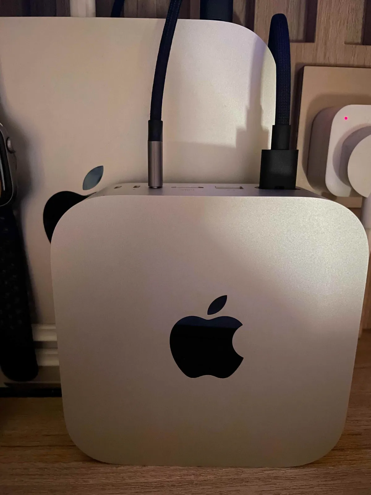
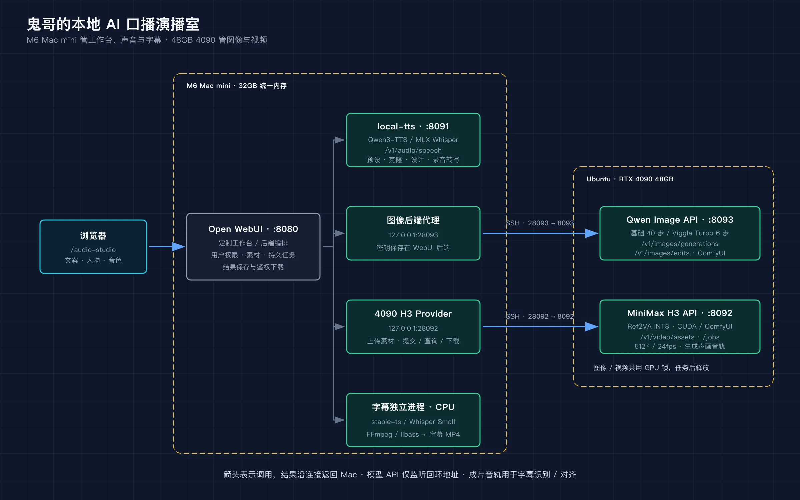

做一个 AI 口播视频，最容易上头的时刻，是人物第一次开口。最容易冷静下来的时刻，是你想改一句文案，再生成一遍。

鬼哥之前做了一套真人口播的 skill：给它人物照片、声音样本和文案，让 MiniMax 克隆声音、生成配音，再交给 HeyGen 做照片驱动的口播视频。先看短预览，满意了再出正式版，素材、任务和成品都能留档。

流程顺了，另一个问题也顺着来了：创作很少一遍就满意。文案要改，语气要调，照片要换，预览看完又想试另一版。让 agent 来回编排会消耗 token，语音和视频服务还有各自的计费方式。**省下了操作时间，试错仍然要付钱。**

鬼哥看了看桌上的 M6 Mac mini，又看了看自己的 4090：东西都买了，总得让它们多干点活。于是有了这间本地 AI 演播室——Qwen 管声音和人物图，MiniMax H3 管声画视频，Open WebUI 把它们接到同一个页面，字幕最后在 Mac 上收尾。

先看结果。下面是 Diana 介绍 DI CLI 的带字幕口播，约 12 秒，视频由 4090 上的 H3 生成。

<video controls playsinline preload="none" poster="diana-poster.webp" style="width:100%;max-width:512px;height:auto;border-radius:12px;">
  <source src="diana-talk.mp4" type="video/mp4">
  你的浏览器不支持内嵌视频，可以<a href="diana-talk.mp4">下载 Diana 口播视频</a>观看。
</video>

[下载 Diana 口播视频](diana-talk.mp4)

这回再想让她换一句台词，本地生成链路不用先看云端 API 余额。当然，机器、电费和折腾时间都有成本；这里的“免费”，说的是不再为每次本地推理付云端调用费。模型许可也得另看，尤其不能把免费试验直接理解成无条件商用。

## 两台机器，终于不用挤同一张床

在[之前那篇 Mac mini 工作站文章](/p/mac-mini-ai-workstation/)里，鬼哥已经让 32G 的小盒子能聊天、能画图了。麻烦是两个大模型留在内存里不走，最后只好安排它们轮流上场。

现在要加配音和视频，继续把所有活塞给 Mac，排队就更长了。这次分工干脆一点：Mac mini 留在桌面上当工作台，做语音和字幕；图像、视频这些重活，交给 Ubuntu 上的 4090。



Mac 上的主角是 Open WebUI 和独立的 `local-tts` 服务。Open WebUI 保存音色、人物、文案和任务记录，调用模型的动作发生在它的后端。`local-tts` 用 MLX / Metal 跑 Qwen3-TTS，也提供本地 Whisper 转写。字幕另有独立环境，走 CPU，把统一内存和 GPU 的余量留给语音。


4090 那边跑两个服务：Qwen-Image-2.1 图像 API，和 MiniMax H3 视频 API。底下各有自己的推理环境，避免把语音、图像、视频的 Python 依赖煮成一锅粥。

先说个容易看漏的规格：鬼哥这张卡是 **48GB 显存的 4090**，主机有 64GB 内存。普通 24GB 4090 能不能照搬，得按模型、量化和工作流重新算，不能只认“4090”这三个数字。

这样一分，Mac 不用为了画一张人物图先把自己的声音服务挤走；4090 也不用承担网页、音色库和字幕编辑。哪台机器擅长哪件事，就让它干哪件事。

## `/audio-studio`：名字还是音频，里面已经能拍视频了

浏览器打开 `http://localhost:8080/audio-studio`，进入的是“视频语音工作台”。这里是鬼哥在本地 Open WebUI 源码上扩展的页面，装一个上游原版不会自动长出这些功能。

当前导航有音色库、人物库、生成播报、生成视频，管理员还会看到生成图像。把它们放在一起，是因为做 Diana 这样的角色，最常重复使用的其实是她的脸和声音。

**音色库先解决“谁来说”。** 可以用 Serena 等九种预设音色，也可以上传录音，或用麦克风录制。参考录音支持 1–120 秒，参考原文可选；不想手工抄，就调用本地 Whisper 识别，再校对。音色可以命名、试听、编辑和删除，替换录音会留下新版本，已经排队的任务仍能找到自己那一份素材。

还有个更好玩的入口：文字设计音色。比如描述“年轻女性，声音温暖，普通话清晰，说话自然，像在向朋友介绍一个新工具”，先让 VoiceDesign 生成一段试听。满意了，命名并保存成音色；后面的播报再拿这段录音去克隆。设计声音这一步有随机性，保存满意的样本，比每次重新许愿更适合养一个长期角色。

**人物库保存“谁出镜”。** 上传人物图片，给角色起名，还可以绑定默认音色。下次选 Diana，不用重新在文件夹里找头像，也不用重新想她该用哪个声音。图像生成是独立入口，出图后仍需把选中的图保存到人物库；这里没有假装一张图出来就自动变成角色。

**生成播报负责先把台词说顺。** 输入文案、选择音色和语速，后台排队生成，完成后试听、下载 MP3/WAV。结果会留在历史里，还能直接拿去做视频。声音不满意，先在这一步改；没必要每换一个停顿，就让视频模型再忙一轮。

**生成视频把人和声音合起来。** 可以选已有播报，也可以在视频页直接输入文本、先生成配音。页面分别提供本机 H3（Mac）、4090 H3，以及配置后可用的 HeyGen。走这篇文章的本地路线，就选 4090 H3；HeyGen 仍属于云端付费路线。任务有进度和结果，成片能播放、改名、下载，完成后接着处理字幕。

管理员还可以显式把音频或视频发到 Telegram。那是分享出口，生成本身不需要 Telegram；需要把素材留在本地，下载 MP4 就够了。

## Qwen 给 Diana 找声音，也给她换衣服

用户习惯叫它“qwen-voice”，这套部署里实际用的是 [Qwen3-TTS](https://github.com/QwenLM/Qwen3-TTS)，声音服务独立监听 `127.0.0.1:8091`。

三个模型各有一个用场。CustomVoice 提供预设音色；Base 用参考录音克隆声音；VoiceDesign 按文字描述设计新声音。Mac 端采用 1.7B 的 MLX 8bit 版本。克隆时，声音风格主要来自参考录音，不能把给预设音色用的风格指令当成万能旋钮。

它对外提供熟悉的 OpenAI 风格接口：`POST /v1/audio/speech` 返回 MP3 或 WAV，`GET /v1/audio/voices` 列出音色，`POST /v1/audio/transcriptions` 识别参考录音。Open WebUI 的音频引擎填“OpenAI”，只是选了接口格式；真正开口的是 Mac 上的 Qwen。

想单独验证声音服务，不必先打开工作台：

```bash
curl --fail-with-body http://127.0.0.1:8091/v1/audio/speech \
  -H 'Content-Type: application/json' \
  -d '{"model":"qwen3-tts","input":"你好，欢迎来到鬼哥的本地 AI 演播室。","voice":"Serena","lang_code":"chinese","response_format":"mp3"}' \
  --output narration.mp3
```

这个服务返回完整音频文件，不支持 `stream=true`。长文会按句分段再拼接；语速参数是生成后的 FFmpeg 调速，跟让模型换一种表演节奏是两回事。

人物图则交给 4090 上的 Qwen-Image-2.1。工作台的“生成图像”提供两种模式：默认 Viggle Turbo 六步，或者基础版四十步。没参考图时按提示词生图；传一张参考图，就能做换背景、换衣服这样的编辑，结果可以下载原图。

在[前一篇四组实测](/p/qwen-image-turbo/)里，同一台机器的人像和海报工作流，六步版约 10 秒，基础版约 38 秒；人物编辑约 12 秒和 42 秒。加上运行时启动，Turbo 的总时间约 15–17 秒。这些是那次固定配置的记录，工作台还要经过连接和保存，不能直接当成每次点击的承诺。

对角色创作来说，快一点的意义很具体：你更愿意试三套衣服、两个背景，再选适合这次台词的那张。图像编辑仍可能改变局部细节和取景，选人物图时得看脸，也得看构图。Diana 不会因为有了人物库，就自动获得每一帧都不变的身份证。

## H3 收到配音后，会重新生成声画

人物和配音都有了，终于轮到视频模型。

这里用的是 [MiniMax H3 的 Ref2VA](https://huggingface.co/MiniMaxAI/MiniMax-H3)，在 4090 上通过 ComfyUI 的 CUDA 运行时推理。部署采用裁剪后的 INT8 主模型、INT8 文本编码器与视频 VAE，以及 FP32 音频 VAE。整套权重下载约 51.5GB，跟“显存里同时要放多少”不是同一个数。

有个区别会直接影响你怎么看成片：**H3 会根据参考人物和音频生成自己的声画音轨。** 它不是给一份完全不动的 WAV 配上嘴形。参考配音在引导它，输出的声音、时长和细节仍可能变化，所以工作台保留模型实际生成的结果，不偷偷把原配音换回去。

这也是字幕必须听最终视频的原因。按输入 WAV 的时间轴贴字幕，遇到 H3 改了停顿，字就可能比嘴先到。

当前这套本地封装先收窄到 512×512、24fps、单段参考音频 2–15 秒，默认十二步，可选八步或二十步。官方模型的能力范围更宽，但鬼哥工作台还没有把官方整套高分辨率流程搬进来。

部署时留过一份短样片记录：约 4.1 秒的参考音频、十二步，在这台 4090 上一次成功任务的全流程约 86 秒，输出约 4.49 秒。它说明这条 CUDA 路线已经实际出片，不能拿来按比例保证一分钟视频的耗时。前面的 Diana 约十二秒成片，也是已有结果；这篇没有另外给她编一个生成速度。

长片开关目前关闭。服务已经有按停顿切段、保留已完成片段、继续失败任务的机制，但片段之间的人物姿态和声音衔接还需要验证。先把一段短口播做顺，比急着把它叫作全天候直播间踏实。

## 一张图，看清谁在调用谁

模型名字多了以后，最容易混淆的是“它到底跑在哪”。下面这张图按当前服务连接来画，箭头表示调用关系；右边的结果最终返回 Mac 保存。



[打开可放大的 SVG 架构图](diagram/service-architecture.svg)

浏览器只访问 Open WebUI。登录、素材归属、任务历史和下载由 WebUI 后端管理，浏览器不会直接去访问无用户鉴权的模型服务。

| 工作台要做的事 | Mac 后端访问的地址 | 真正干活的位置与接口 |
|---|---|---|
| 预设配音、克隆与声音设计 | `127.0.0.1:8091` | Mac local-tts：`/v1/audio/speech` |
| 音色管理、录音转写 | `127.0.0.1:8091` | Mac local-tts：`/v1/audio/voices`、`/v1/audio/transcriptions` |
| Qwen 生图、参考图编辑 | `127.0.0.1:28093` | SSH 转发到 4090 的 `8093`：`/v1/images/generations`、`/v1/images/edits` |
| H3 素材与视频任务 | `127.0.0.1:28092` | SSH 转发到 4090 的 `8092`：`/v1/video/assets`、`/v1/video/jobs` |
| 字幕识别、对齐与烧录 | WebUI 内部调用独立进程 | Mac CPU：stable-ts / Whisper + FFmpeg / libass |

两条隧道让后端像访问本机一样访问远端 API。远端服务继续只监听回环地址，Mac 本地转发口也绑定回环；图像 API 另外有 Bearer 密钥，由 WebUI 后端保存。当前机器用 launchd 保持隧道并自动重连。

如果已经装好了远端服务，手工连接的核心就是这两条：

```bash
# 两条命令分别在独立终端运行；把 user@4090-host 换成自己的 SSH 目标
ssh -NT -o ExitOnForwardFailure=yes -o ServerAliveInterval=30 \
  -L 127.0.0.1:28092:127.0.0.1:8092 user@4090-host

ssh -NT -o ExitOnForwardFailure=yes -o ServerAliveInterval=30 \
  -L 127.0.0.1:28093:127.0.0.1:8093 user@4090-host
```

它们只是连接方式，还不是把两台空白机器装好的全部命令。当前环境是一步步部署、修复、接通的，全新 Mac / Ubuntu 从 checkout 到整条链路一键可用，还没有完整验收。

视频 API 用持久任务：先上传人物图和音频取得素材 ID，再创建任务，拿任务 ID 查询进度，完成后取 MP4。取消和重试也围绕这个 ID，断开隧道不等于远端任务已经停了，连接恢复后可以继续查。

图像 API 目前是同步请求，没有同样的长队列和取消能力。它与 H3 共用 GPU 锁，约十五秒仍拿不到 GPU 会提示忙，留给用户稍后重试。生成结束，独立运行时退出，把显存还出来。

这一点跟最初那台 32G Mac 的经验呼应上了：服务可以同时开着，大模型没必要同时赖在 GPU 里。做图和拍视频按顺序接力，48GB 也有自己的座位表。

## 最后一公里：让字幕跟上 Diana 的嘴

口播有画面、有声音了，手机上看的人却未必会开声音。字幕得跟上。

这里有两套容易叫混的 Whisper。`local-tts` 里的 MLX Whisper 用来识别音色参考录音；成片字幕则放在 Open WebUI 的独立 Python 环境，用 [stable-ts](https://github.com/jianfch/stable-ts) 配合本地 Whisper Small，当前走 CPU 四线程。

完整视频有对应完整文案时，使用强制对齐：拿文字去最终音轨里找时间位置。截短预览或缺少文案时走 ASR，从实际音轨重新识别，避免把整篇台词硬塞进十几秒的预览。两种方式都可能出错，尤其是产品名、英文缩写和模型没有严格照读的地方，最后还是要看着成片校一次。

新视频完成后会自动生成并烧录字幕，成功后卡片默认播放、下载字幕版。要改文字和时间，可以打开编辑器，逐句定位、拆分、合并；字号、颜色、上下位置、边距和底框也能调整。保存以后重新烧录，才得到这版字幕对应的 MP4。字幕失败可以单独重试，不必再跑一遍 H3。

SRT、VTT、ASS 都能导出；想拿去剪辑软件继续做，用字幕文件；想直接发给朋友，用 FFmpeg / libass 烧好的视频。原片另保留一份，不会被字幕覆盖。

中文还有一个朴素的坑：系统里有字体，不代表 libass 真选中了它。此前成片出现过汉字方框，最终在 Mac 上显式加载 Heiti SC 才修好。模型说得再流利，字幕变成口口口，也像主持人忘了带提词器。

## 从一段短口播开始，把试错留给自己

拿 Diana 这样的角色来走这条链路，我会先选好人物图和声音，试听一小段台词。声音顺了，再送到 4090 H3；成片回来检查嘴形、人物和实际音轨，然后校字幕、下载。想换背景，就去图像页改；想换一句话，先重新配音。每一步都有自己的产物，出了问题能回到那一步。

文案可以自己写，也可以让本地聊天模型帮忙。现有 Open WebUI / Ollama 的聊天路线能继续用，但 Audio Studio 目前仍需要你输入文案、选择素材和提交任务，尚未做到“给一个主题，自动拍完整支视频”。这里的端到端，是从文案、人物图走到带字幕成片，而不是把所有创作判断都省掉。

还有一笔账要分清：Qwen-Image-2.1 和 Turbo 适配器有研究用途的许可条件，H3 用社区许可。自己的研究试验与收费交付是两回事，做商业内容前得逐项读模型条款；人物肖像和声音也要有相应授权。

对鬼哥来说，这套系统目前最有价值的，是能反复试。角色库里放好一个 Diana，今天介绍工具，明天换个背景、换一段台词，不用每次从上传素材和充值开始。短片能力已经能用，更长的视频、连续的角色表演，留着往后磨。

当初做 skill，是想让口播少一点手工操作。现在把后端搬回自己的机器，是想让“再试一版”少一点犹豫。

桌上的 Mac mini 接文案，4090 开始干活，Diana 再开口。鬼哥这次要看的，是她有没有把话说好。

## 参考资料

- [鬼哥：32G 的 M6 Mac mini，怎么同时养活聊天和画图两个大模型](/p/mac-mini-ai-workstation/)
- [鬼哥：Qwen Image 40 步对上 Viggle Turbo 6 步，4090 上的四组实测](/p/qwen-image-turbo/)
- [Open WebUI 项目](https://github.com/open-webui/open-webui)（本文工作台为本地定制扩展）
- [Qwen3-TTS 官方代码与模型用法](https://github.com/QwenLM/Qwen3-TTS)
- [MLX Audio](https://github.com/Blaizzy/mlx-audio)
- [Qwen-Image-2.1 模型卡与许可](https://huggingface.co/Qwen/Qwen-Image-2.1)
- [Viggle Qwen Image Turbo 适配器](https://huggingface.co/Viggle/Qwen-Image-2.1-viggle-turbo)
- [MiniMax H3 模型卡、Ref2VA 与社区许可](https://huggingface.co/MiniMaxAI/MiniMax-H3)
- [ComfyUI](https://github.com/comfyanonymous/ComfyUI)
- [stable-ts：转写与强制对齐](https://github.com/jianfch/stable-ts)
- [FFmpeg 字幕滤镜](https://ffmpeg.org/ffmpeg-filters.html#subtitles-1)
