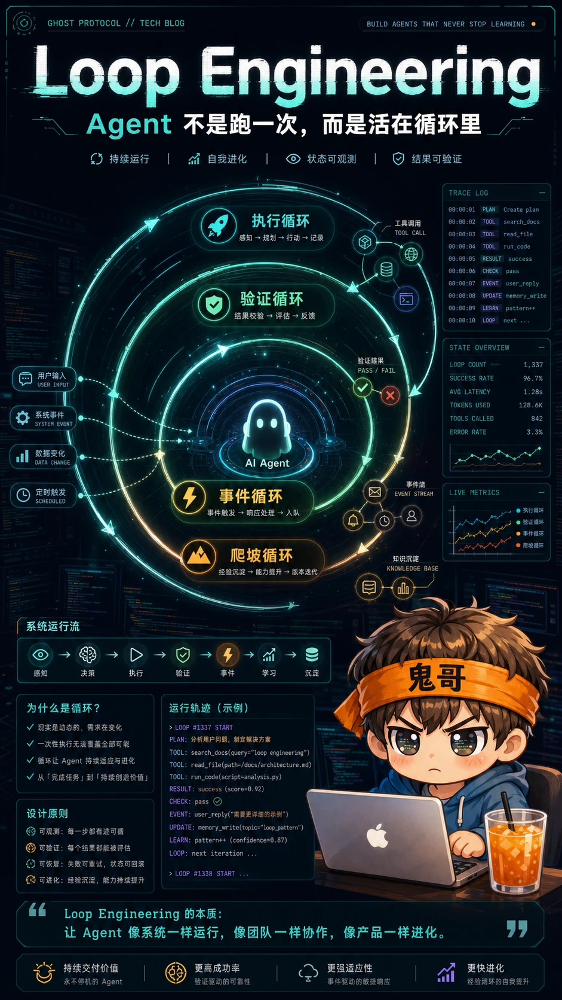
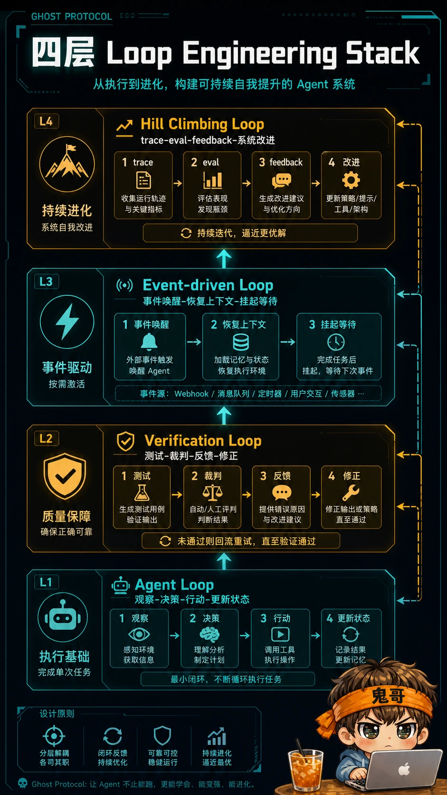
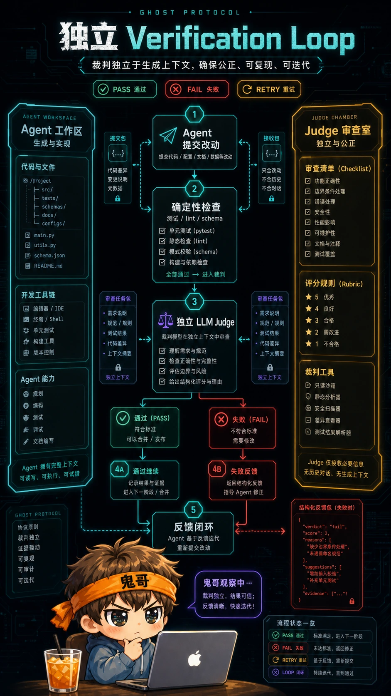
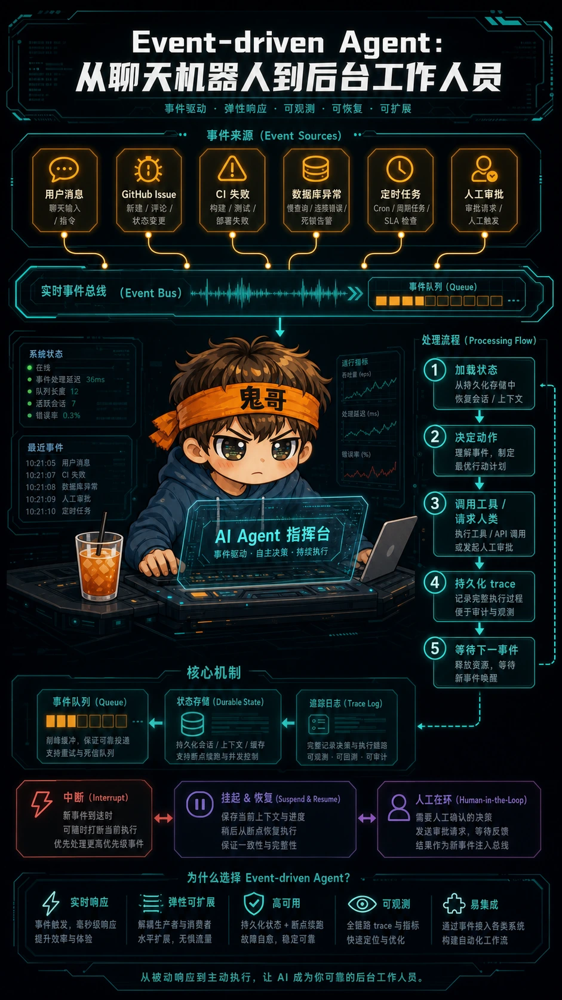
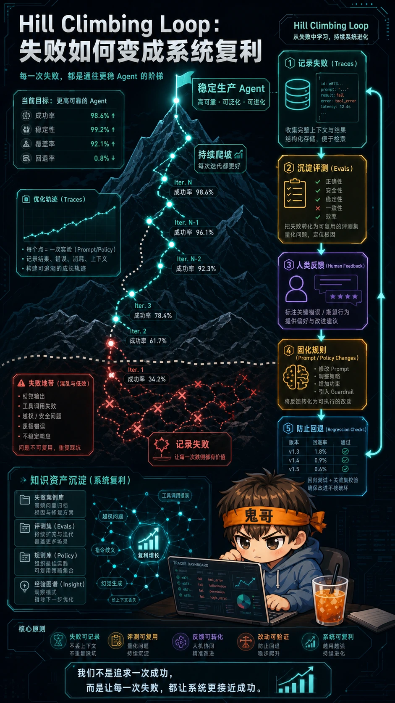

最近一段时间，AI 开发讨论里有一个越来越热的词：`Loop Engineering`。

它把很多 AI 开发者过去两年跟 coding agent 协作沉淀下来的经验，逐渐聚集到一个共识上：**你不应该再只是提示 coding agent，而应该设计会提示 agent 的循环。**

鬼哥这篇引用 LangChain 团队的技术文章 [The Art of Loop Engineering](https://www.langchain.com/blog/the-art-of-loop-engineering)，来拆一下这个正在升温的工程话题。后面还有一篇来自 Google、同样围绕 Loop Engineering 的文章，更偏时间维度和落地实践，也值得期待。

过去两年，我们跟 coding agent 协作，大概是这个姿势：

```text
我写 prompt
  -> agent 生成代码
  -> 我读结果
  -> 我补充上下文
  -> agent 再改
  -> 我再验
```

这当然有效。到今天为止，**直接提示 agent 依然是最高性价比的日常操作**。

但它有个天花板：你始终是循环里的调度器。任务从哪里来、下一步做什么、做完怎么验、失败怎么记、明天怎么接着跑，全都靠你脑子里那条线牵着。

Loop Engineering，本质上是把这条线从你的脑子里拿出来，做成外部系统：

```text
发现任务 -> 分配执行 -> 隔离改动 -> 独立验证 -> 记录状态 -> 决定下一步
```

Prompt 还是存在，但它被放回了一个更大的机器里。**你不再只是写一句话让 agent 干活，而是在设计 agent 干活的方式。**

一个 Agent 最危险的幻觉，不是编错代码，而是**跑完一遍就以为自己完成了任务**。LangChain 这篇文章把 Agent 系统的核心能力拆成四层循环：agent loop、verification loop、event-driven loop、hill climbing loop。这个拆法很朴素，但对做过真实 Agent 工程的人来说，几乎每一层都踩过坑。



---

## 为什么我觉得这篇文章值得单独拎出来

我前面写过两篇相关的东西：[《别再调教模型了：聪明人都在设计循环》](/p/designing-agent-loops/) 和 [《Harness Engineering：当模型够强，系统设计成为胜负手》](/p/harness-engineering/)。

那两篇的核心判断是：模型越强，工程师越不该把精力只花在 prompt 上，而应该设计模型工作的系统。

LangChain 这篇文章往前推了一步：它没有只说“要做系统”，而是把系统拆成了一个更可操作的结构：

| 层级 | 它解决的问题 | 典型失败模式 |
|---|---|---|
| Agent loop | 模型如何一步步调用工具完成任务 | 一次输出就收工，没计划、没状态 |
| Verification loop | 怎么知道这一步真的对了 | 自我感觉良好，错了也继续往下跑 |
| Event-driven loop | Agent 怎么响应外部世界变化 | 只能同步问答，无法长期驻留 |
| Hill climbing loop | 系统怎么越跑越好 | 每次失败都是一次性事故，没有积累 |

这四层合起来，其实就是 Agent 从 demo 走向生产的路线图。



---

## 第一层：Agent loop，不是聊天，是“观察-行动-再观察”

最基础的一层是 agent loop。

很多人第一次做 Agent，会把它理解成“LLM + tools”：模型看一眼任务，决定调用哪个工具，拿到结果，再继续生成。这当然没错，但还不够。

真正的 agent loop 至少要包含四件事：

```text
observe -> decide -> act -> update state -> observe again
```

也就是说，Agent 不是在“回答问题”，而是在一个不断变化的状态里行动。它每调用一次工具，世界就变了一点：文件被改了，网页打开了，数据库返回了新结果，用户可能又插了一句话。下一步动作必须基于新的状态，而不是基于最开始那段 prompt。

我自己用 Claude Code / Codex 做开发时，最明显的分水岭就是这里。弱 Agent 像一个“高级补全器”：你给它一个任务，它生成一坨代码，然后等你验尸。强一点的 Agent 会自己读文件、跑测试、看错误、再改，整个过程已经是一个小型闭环。

但只靠这一层还不够。因为 Agent loop 解决的是“会不会动”，不是“动得对不对”。

---

## 第二层：Verification loop，裁判必须独立

Agent 最容易犯的错，不是不会做，而是**做错了还解释得很合理**。

所以第二层是 verification loop：每一轮行动之后，系统要有一个明确的验证环节，判断结果是否满足标准。如果不满足，就把反馈送回 Agent，让它修正，而不是直接把错误带到下一步。

这跟我在本地折腾模型、写自动化脚本的体感完全一致：**没有 verifier 的 Agent，越勤奋越危险。** 它会非常积极地把错误扩散到更多文件、更深的状态里。

一个实用的 verification loop 可以长这样：

```text
agent proposes change
        |
        v
run deterministic checks
        |
        v
LLM judge reviews ambiguous quality
        |
        v
pass -> continue
fail -> send structured feedback back to agent
```

这里有两个关键点。

第一，能用确定性检查的地方，别让 LLM 当裁判。测试、类型检查、lint、SQL 校验、schema validation，这些都应该是硬规则。

第二，必须用 LLM 判断的地方，也尽量让它成为**独立裁判**。不要让生成答案的同一个上下文顺手给自己打分。模型自评经常带着自己的思路滤镜，看不到真正的问题。



---

## 第三层：Event-driven loop，让 Agent 从“工具”变成“服务”

前两层解决的是一次任务内部的闭环。第三层 event-driven loop，解决的是更生产级的问题：Agent 怎么在真实世界里长期运行？

现实系统不是你问一句它答一句。真实系统里会发生各种事件：

- 用户发来新消息
- GitHub 出现新 issue
- CI 失败
- 数据库里多了一条异常记录
- 定时任务触发
- 人类审批通过或驳回

一个 event-driven Agent 不应该只是被动等待 prompt，而应该能被事件唤醒，读取上下文，恢复状态，执行下一步，然后再次挂起。

这也是 LangGraph 这类框架一直强调 state、durability、interrupt/resume 的原因。没有这些能力，Agent 只能做“同步聊天机器人”；有了这些能力，Agent 才能接近“后台工作人员”。

我觉得这一层对 AI 开发者特别重要，因为很多 Agent 项目死在这里：demo 里看起来很聪明，接到生产事件之后就不知道自己是谁、之前做过什么、现在该从哪一步继续。

一个更像生产系统的 Agent，应该长这样：

```text
event arrives
    -> load thread / task state
    -> decide next action
    -> call tools or ask human
    -> persist state and trace
    -> wait for next event
```



---

## 第四层：Hill climbing loop，真正的复利在系统之外

最外层，也是最容易被忽略的一层，是 hill climbing loop。

前三层让 Agent 能跑、能验、能响应事件。第四层要回答的问题是：**这个系统跑了一百次之后，有没有变得更好？**

如果每次失败都只是“这次模型没发挥好”，那你永远在原地打补丁。Hill climbing loop 要做的是把失败变成可积累的工程资产：

- traces：记录 Agent 每一步为什么这么做
- evals：把失败案例沉淀成可重复评测
- feedback：把人类纠错变成结构化信号
- prompt / policy changes：把经验固化到系统行为里
- regression checks：防止修好一个场景又弄坏另一个场景

这也是为什么我越来越觉得 LangSmith、OpenTelemetry、eval harness 这些东西不是“上线后再补”的配套工具，而是 Agent 工程的主干。

没有 trace，你不知道它为什么失败；没有 eval，你不知道改动是否真的变好；没有反馈闭环，你只是每天给同一个坑换名字。



---

## Human oversight 不是“最后点一下确认”

LangChain 文章里还有一个横跨四层的点：human oversight。

很多系统把 human-in-the-loop 做成一个很浅的审批按钮：Agent 生成结果，人类点 approve 或 reject。这个当然有用，但太窄了。

更好的 human oversight 应该分布在不同层级：

| 位置 | 人类做什么 | 价值 |
|---|---|---|
| Agent loop | 在关键工具调用前确认 | 防止不可逆操作 |
| Verification loop | 对模糊质量给判断 | 弥补自动评测盲区 |
| Event-driven loop | 在异常分支里接管 | 避免系统卡死或误操作 |
| Hill climbing loop | 标注失败、调整 rubric | 让系统长期进化 |

换句话说，人类不是 Agent 的“老板”，而是整个循环系统里的高价值传感器和调参者。

---

## 对 AI 开发者的实操建议

如果你正在做 Agent，不要一上来就问“该用哪个模型”。

先把你的系统画成四层循环，然后逐层检查：

1. **Agent loop**：它是否真的会观察状态、调用工具、更新状态、继续行动？
2. **Verification loop**：每一步有没有可执行的验收标准？能不能自动跑？
3. **Event-driven loop**：它能不能从外部事件恢复上下文，而不是每次从零开始？
4. **Hill climbing loop**：失败案例有没有沉淀成 trace、eval、规则或测试？

如果这四层里有一层是空的，你的 Agent 很可能还停留在 demo 阶段。

更直接一点：**别再只调 prompt 了，把 prompt 放回循环里看。** Prompt 是 Agent 的一部分，但不是 Agent 系统本身。真正决定可靠性的，是状态、验证、事件、观测和反馈如何组成闭环。

---

## Takeaway：下次设计 Agent，先画循环

我会把 LangChain 这篇文章的核心压缩成一句话：

**Agent 工程不是让模型更聪明，而是让系统在每一次行动之后都能变得更确定。**

下一次你要做一个 Agent，不妨先别打开代码编辑器。先画四个圈：

- 这个 Agent 怎么行动？
- 它怎么验证自己没有跑偏？
- 它怎么响应真实世界的事件？
- 它怎么从失败里长期爬坡？

四个圈画清楚，再选模型、写 prompt、接工具。顺序反了，你大概率会得到一个很会说话、但不能放心托付的 demo。

---

## 参考资料

- LangChain: [The Art of Loop Engineering](https://www.langchain.com/blog/the-art-of-loop-engineering)
- 鬼哥：[别再调教模型了：聪明人都在设计循环](/p/designing-agent-loops/)
- 鬼哥：[Harness Engineering：当模型够强，系统设计成为胜负手](/p/harness-engineering/)
