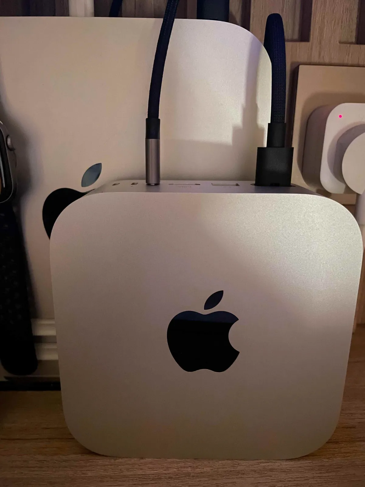
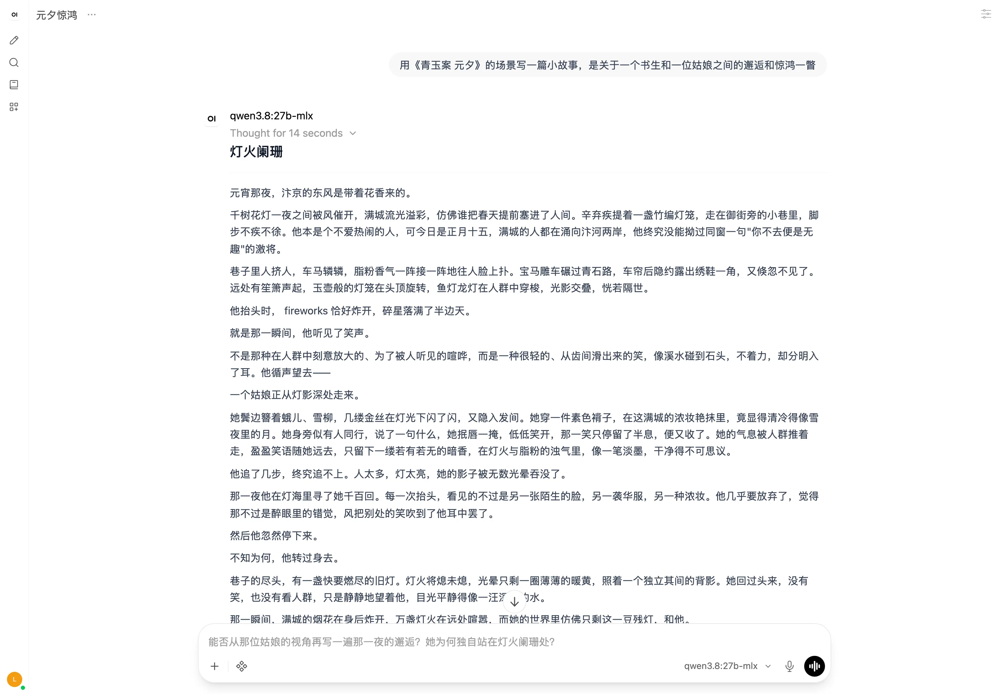
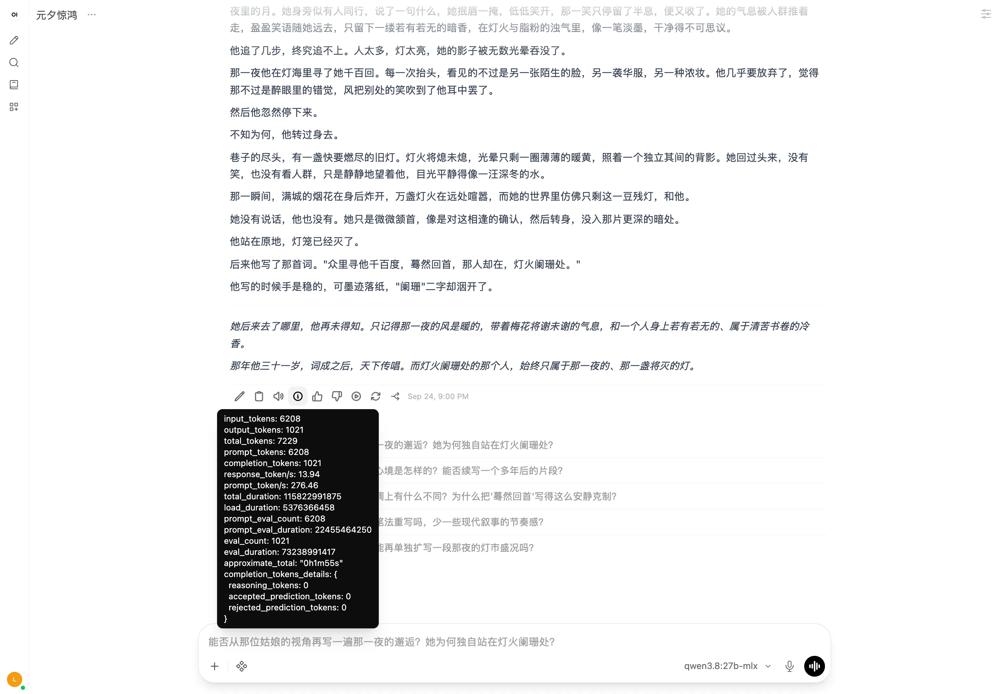
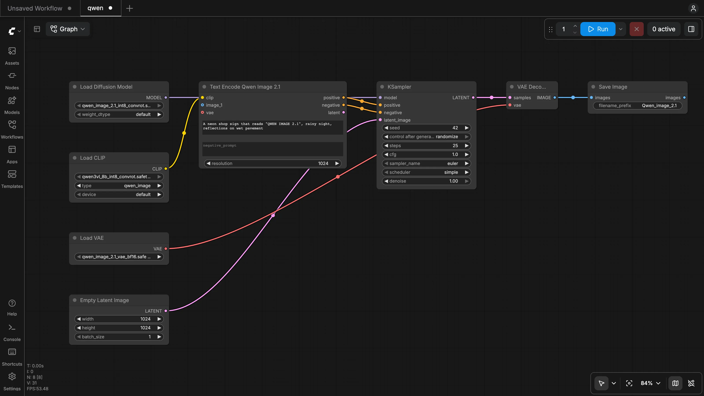
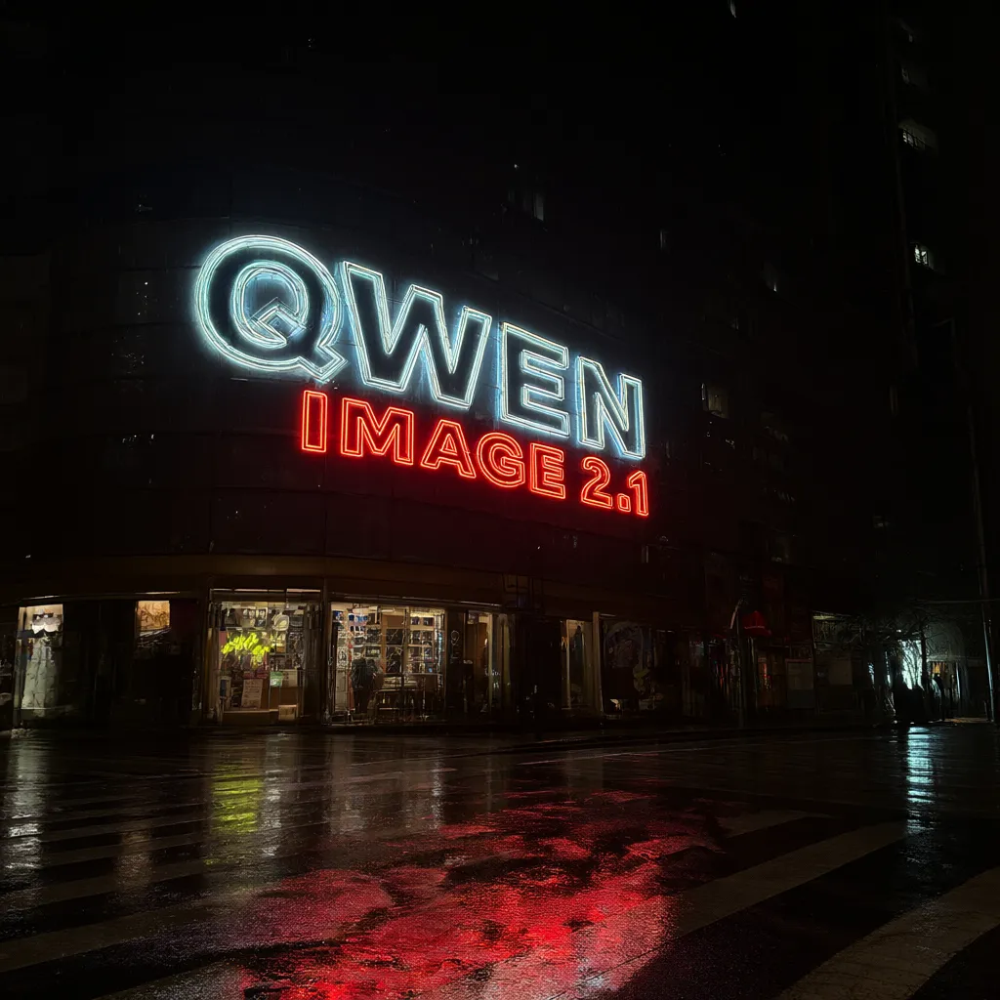
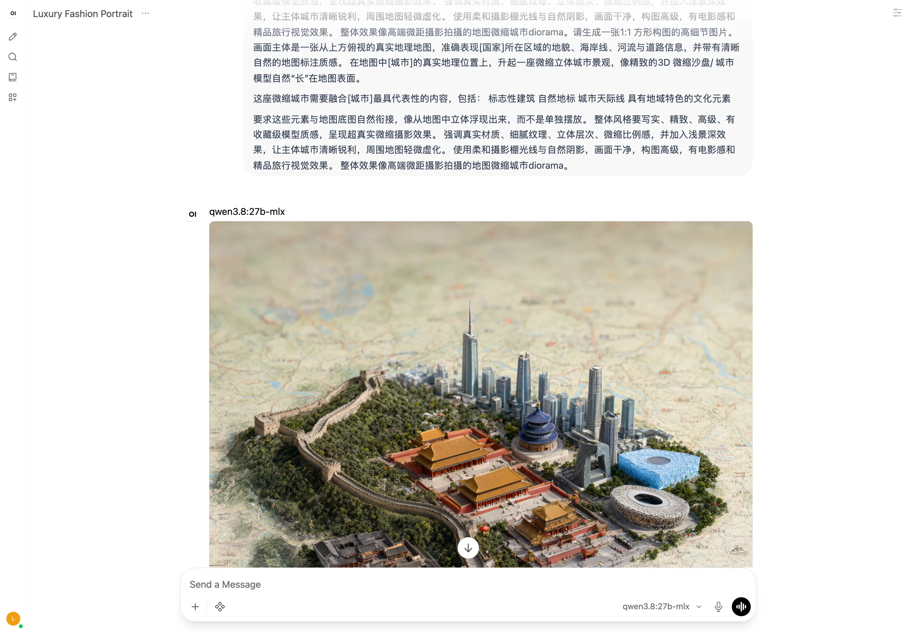
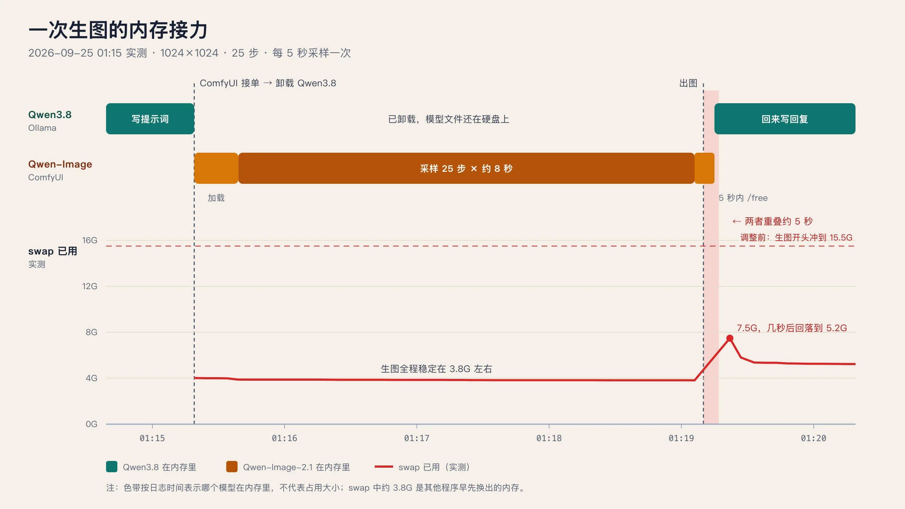
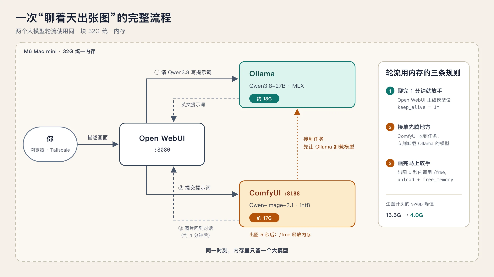

新 Mac mini 让人等了快两年。8 月 25 日，苹果终于[发布了新款](https://www.apple.com/newsroom/2026/08/apple-unveils-a-more-powerful-mac-mini-featuring-the-all-new-m6-and-m5-pro/)，入门款是苹果第一颗 2nm 芯片 M6，高配款是 M5 Pro。

鬼哥盯着 M5 Pro 看了很久。64G 内存，带宽快了将近一倍，拿来跑本地大模型确实香。可顶配要 3199 美元，折合两万多人民币。鬼哥掐指一算：这得是多少碗米粉。

最后下单的是 M6、32G 那一款。为了它，鬼哥省了好几个月早餐的米粉加一个蛋。



倒也不全是穷。鬼哥的主力工作，写代码、查资料、改长文，都是靠 Claude 和 Codex 的订阅在云端完成的。本地模型对鬼哥来说还是探索：看看它在写作、内容创作、日常开发里到底能帮上多少忙。为一个还在摸索的爱好，把早餐钱全搭进去，不太划算。

问题就来了：32G 这个"够用的下限"，能不能撑起一台私人 AI 工作站？不连云、不花 API 费，能陪鬼哥写东西，也能按一句话画出一张像样的图。

鬼哥决定从写作和内容创作开始试。折腾了两个晚上，答案是能。不过真正难的地方，跟一开始想的不一样。

## 先让它开口：一行命令的 Open WebUI

机器上原本就装着 Ollama，拉好了 Qwen3.8 的 27B 模型。缺的是一个像样的聊天界面。

[Open WebUI](https://github.com/open-webui/open-webui) 基本就是一个自己托管的 ChatGPT 网页版，对话历史、多用户、知识库、联网搜索一应俱全，还能接各种模型。鬼哥原以为要跟 Python 环境搏斗一晚上，结果官方包用 `uv` 一行就能跑：

```bash
DATA_DIR=~/.open-webui uvx --python 3.11 open-webui@latest serve
```

指定 Python 3.11，是因为 Open WebUI 只认 3.11 到 3.12，而鬼哥系统里的 Python 已经 3.14 了，太新，人家不要。浏览器打开 `localhost:8080`，第一个注册的账号自动当管理员。它会自己找到本机 11434 端口上的 Ollama，下拉框里直接就有 `qwen3.8`。

第一题鬼哥出得有点刁：用辛弃疾《青玉案·元夕》的场景，写一篇书生和姑娘惊鸿一瞥的小故事。



它写了一千来字，题目叫《灯火阑珊》。开头是"元宵那夜，汴京的东风是带着花香来的"，结尾有一句鬼哥挺喜欢：

> 他写的时候手是稳的，可墨迹落纸，"阑珊"二字却洇开了。

一台比饭盒大不了多少的盒子，能写到这个份上，鬼哥是有点意外的。当然也有翻车的地方：写到烟花炸开那句，它突然冒出一个 "fireworks"。辛弃疾要是看到自己的元宵节里放的是洋烟花，大概也会洇开。

Open WebUI 在每条回复下面记了速度：这篇生成了 1021 个 token，每秒约 14 个；读入提示词每秒约 276 个 token。从回车到写完，不到两分钟。



模型在内存里占 18G 左右，是 27.8B 参数、nvfp4 量化的 MLX 版本。其他几段对话里，生成速度大多在每秒 14 到 20 个 token 之间，比鬼哥读小说的速度快。

还有个意外之喜：Open WebUI 默认监听所有网卡，所以装了 Tailscale 的其他设备，用 `http://mac-mini的机器名:8080` 就能直接访问。桌上这台 Mac mini，从此成了随身 AI 的后端。

## 想让它画画，先撞上一堵 33G 的墙

会写字了，自然想让它会画画。鬼哥看中的是 [Qwen-Image-2.1](https://huggingface.co/Qwen/Qwen-Image-2.1)：7B 参数的图像生成模型，文字渲染是出了名的强，还支持图片编辑和透明背景。

打开模型页，算了一下账：

| 组件 | 官方 BF16 大小 |
|---|---:|
| 文本编码器（Qwen3-VL-8B） | 17.5 GB |
| 图像生成模型（7B DiT） | 14.2 GB |
| VAE | 1.4 GB |
| 合计 | **33.1 GB** |

鬼哥的机器是 32G。差了 1G，就像米粉钱差一块，老板也不会给你加蛋。

这里得先说清楚 Mac 的内存是怎么回事。PC 上，显卡有自己的显存，显存不够时可以把模型"卸载到内存"。Mac 的 CPU 和 GPU 共用同一块统一内存，所谓卸载到内存，就是把东西从左边口袋放进右边口袋，总重量一克没少。何况 macOS 默认也不会把全部内存都分给 GPU。所以官方示例里的 `enable_model_cpu_offload()`，在这台机器上帮不了什么忙。

解法是量化。ComfyUI 官方整理了一套 [int8 版本](https://huggingface.co/Comfy-Org/Qwen-Image-2.1)：图像模型 7.3G，文本编码器 9.4G，VAE 0.7G，一共 17.3G，差不多瘦身一半。

接下来要挑一个生图工具。Mac 上最省事的是 Draw Things，原生 App，对 Apple 芯片做了深度优化。但鬼哥想要的是在 Open WebUI 里聊着天就能出图，这条路只有 [ComfyUI](https://github.com/comfyanonymous/ComfyUI) 走得通：它自带 API，Open WebUI 支持把它当生图后端。ComfyUI 的界面是一块节点画布，加载模型、编码提示词、采样、解码、保存，每一步一个方块，用线连起来。第一次看像在拆电视机，看熟了发现什么都能拆开调。



安装本身不复杂：克隆仓库，用 `uv` 建一个 Python 3.13 环境，装 PyTorch nightly（Mac 上靠它的 MPS 后端调用 GPU），再把三个模型文件放进对应的文件夹。更省心的是，ComfyUI 自带的模板里已经有 Qwen-Image-2.1 的文生图工作流，用的正是这套 int8 文件，推荐参数是 25 步、CFG 1、euler 采样器。鬼哥照着它写了一份 API 格式的工作流，自己测试用，也给 Open WebUI 用。

## 第一张图：招牌上的字，一个都没错

测试提示词是模型卡上的例子：雨夜里一块霓虹招牌，写着 "QWEN IMAGE 2.1"，湿漉漉的路面有倒影。



1024×1024、25 步，用了 222 秒，每步大约 8 秒。够鬼哥下楼嗦半碗粉。

慢是真慢，但看到图的那一刻，鬼哥原谅它了。"QWEN" 是冷白色的霓虹管，"IMAGE 2.1" 是红色，字母一个没错，连 2 和 1 中间的小数点都在。地面上红灯的倒影、斑马线、远处橱窗里的灯，都像雨夜里手机随手一拍。几年前，本地生图模型写字还像鬼画符。

接入 Open WebUI 之后，鬼哥又画了几张。最喜欢的是这张北京微缩沙盘：长城沿着山脊蜿蜒，故宫、天坛、鸟巢、水立方、央视大楼挤在同一块地图上，浅景深把周围的地图虚化掉，很像旅行杂志的内页。




它也有露怯的时候。让它画一页插画师的手绘设定稿，人物的造型、表情、比例都很有样子，页面上那些手写批注却全是天书。它擅长的是提示词里点名要写的大字；画面里顺手添的小字，基本就是装饰花纹。


还有一张时装人像，左下角冒出来一个谁也没要求的"签名"，看着还挺像那么回事。鬼哥第一反应是在负面提示词里写上"不要水印"，查了参数才发现写了也白写：这套工作流的 CFG 是 1，负面提示词根本不起作用。想去掉签名，得把 "no text, no watermark, no signature" 这类要求直接写进正面提示词。官方模板的示例提示词，结尾就是一长串 "no text, no letters, no logos, no watermark"，看来官方早就防着它这一手。


## 两个大模型，挤不进同一块内存

聊天和生图各自都能跑了，鬼哥在 Open WebUI 的图像设置里填上 ComfyUI 的地址，上传工作流，把提示词、尺寸、步数、种子分别对应到工作流里的节点。然后在聊天框里打开生图开关，直接用中文描述想要的画面。

流程是这样的：Qwen3.8 先把你的描述扩写成一段详细的英文提示词，交给 ComfyUI；四分钟后，图片出现在对话里，Qwen3.8 再补一句说明。

第一次端到端跑通，图出来了，鬼哥顺手看了一眼系统状态，笑容凝固了：swap 已用从 4G 涨到了 14G，交换空间上限才 15G。

原因不复杂，但事先没想到：两边都舍不得放下模型。Ollama 默认会把模型在内存里留 5 分钟，方便你接着聊；ComfyUI 出完图，也会把模型留着，方便画下一张。Qwen3.8 刚写完提示词，占着 18G 不走，ComfyUI 紧接着又要加载将近 17G 的生图模型。两个加起来超过 32G，macOS 只能把内存往 SSD 上的 swap 里硬塞。

两个胖子挤一张单人床，谁也睡不好。这次速度倒没怎么掉，但每生成一张图，SSD 上就要写进去十来 G 的 swap。swap 一旦用满，轻则卡顿，重则进程被系统请出去。

**在 32G 的统一内存上，两个大模型不能同时在内存里，只能轮流用。**如果当初买的是 64G 的 M5 Pro，这一节大概可以直接跳过。可谁让鬼哥省下的只是米粉钱，那就只能让它们学会排队。一共三处调整。

第一处，让 Ollama 早点放手。鬼哥先用 `launchctl setenv OLLAMA_KEEP_ALIVE 1m` 把全局保留时间改成 1 分钟，然后就以为万事大吉了。后来查进程的环境变量才发现，Ollama 一直没重启，这个设置根本没生效。真正起作用的，是在 Open WebUI 里给 qwen3.8 设的 `keep_alive = 1m`。这个设置存在 Open WebUI 的数据库里，电脑重启也不会丢。

第二处，ComfyUI 一接到任务，就立刻请 Ollama 让位。Qwen3.8 的提示词已经写完、交到 ComfyUI 手里了，这一步它没事可干，占着位置纯属浪费。鬼哥在 ComfyUI 的起停脚本里加了一个后台循环：发现队列从空变成有任务，就查一下 Ollama 当前加载了哪些模型，挨个发一个 `keep_alive: 0` 的请求。这只是把模型请出内存，文件还在硬盘上。

第三处，ComfyUI 出完图，5 秒内收拾走人。这里 Mac 又有个特别的地方：ComfyUI 的 `/free` 接口，只带 `unload_models` 参数的话，模型只是从"显存"挪到"内存"，在 Mac 上又是左口袋换右口袋。必须同时带上 `free_memory`，把节点缓存也清掉，内存才会真正还回来。实测，出完图后 ComfyUI 的内存占用从 9.8G 降到了 0.6G。

第一处调整之后，鬼哥每改一步就盯一次生图，每 5 秒记一次 swap。三次记录放在一起看：

| | 只把 keep_alive 改成 1 分钟 | 再加上生图开始时卸载 Ollama | 再加上出图后 5 秒释放 |
|---|---:|---:|---:|
| 生图开始时 swap 峰值 | 15.5 GB | 3.7 GB | 4.0 GB |
| 生图过程中 swap | 约 5 GB | 3.7 GB | 3.8 GB |
| 出图后 swap 峰值 | — | 12.0 GB | 7.5 GB，几秒后回落 |
| 1024 图耗时 | 243 秒 | 234 秒 | 235 秒 |

最后那 3.8G 是其他程序早先换出去的内存，一直留在 swap 里，跟这套工作站无关。出图后那几秒的小峰值，是 Qwen3.8 急着回来写回复，ComfyUI 还没来得及收拾完，两边在门口撞了一下。内存压力不大，鬼哥决定不跟它计较。



## 现在这台工作站长什么样

整理下来，一次"聊着天出张图"的完整过程是这样的：



1. 鬼哥在 Open WebUI 里用中文说想要什么画面；
2. Qwen3.8-27B 把它写成详细的英文提示词；
3. ComfyUI 接到任务，先请 Ollama 把 Qwen3.8 卸载掉，再加载 Qwen-Image-2.1 的 int8 模型；
4. 大约 4 分钟后出图，图片回到对话里；
5. ComfyUI 5 秒内释放模型，Qwen3.8 重新加载，补一句说明。

有几件事最好提前知道。速度上，一张 1024 的图要 4 分钟左右；官方默认的 2048 尺寸像素是它的 4 倍，按比例估算要十几分钟，这个鬼哥还没试，怕等到饿。许可上，Qwen-Image-2.1 用的是 Qwen Research License，个人研究和玩没问题，商用要先读条款。至于 Open WebUI 本身，0.11.4 版本新建对话时生成标题会报一个 `KeyError`，对话只是没有自动标题，其他功能都正常，等上游修就好。

它不会比云端服务快，也不会比云端的旗舰模型聪明。但写故事、改文章、画张配图这类日常活，它都能在鬼哥的桌上完成：数据不出门，不按次计费，断网也能用。深夜想到一个画面，不用先去看 API 余额，这一点比预想的更让人舒服。何况这台机器是用早餐钱换的，每多画一张图，那几个月的蛋就吃得更值一点。

回到那个元夕故事。那天夜里，书生在灯海里寻了那个姑娘千百回，最后在一盏快燃尽的旧灯下找到了她。这台 Mac mini 上的两个大模型，比那两个人好安排：一个写完提示词就退场，一个画完图也退场，同一时刻，内存里只留一个。

32G 统一内存能同时装下的大模型，其实只有一个。它能当私人 AI 工作站，靠的是让两个模型轮流用这块内存。

*这篇文章的封面，也是这台 Mac mini 上的 Qwen-Image-2.1 画的：1344×768，大约 8 分钟。*

---

## 附：关键配置速查

**Open WebUI 图像设置**（管理员面板 → 设置 → 图像）

| 设置项 | 值 |
|---|---|
| 引擎 | ComfyUI |
| Base URL | `http://127.0.0.1:8188` |
| 默认模型 | `qwen_image_2.1_int8_convrot.safetensors` |
| 尺寸 / 步数 | `1024x1024` / `25` |
| 节点映射 | prompt → 文本编码节点的 `prompt`；width/height → EmptyLatentImage；steps/seed → KSampler；model → UNETLoader 的 `unet_name` |

**模型文件**（来自 `Comfy-Org/Qwen-Image-2.1`）

```text
models/diffusion_models/qwen_image_2.1_int8_convrot.safetensors   7.3 GB
models/text_encoders/qwen3vl_8b_int8_convrot.safetensors          9.4 GB
models/vae/qwen_image_2.1_vae_bf16.safetensors                    0.7 GB
```

**让两个模型轮流用内存的核心逻辑**（ComfyUI 起停脚本里的后台循环）

```bash
# 队列从空闲变成有任务：卸载 Ollama 里所有已加载的模型
for name in $(curl -s localhost:11434/api/ps | grep -o '"name":"[^"]*"' | cut -d'"' -f4); do
  curl -s localhost:11434/api/generate -d "{\"model\": \"$name\", \"keep_alive\": 0}" >/dev/null
done

# 队列空闲 5 秒：卸载 ComfyUI 的模型并清掉缓存（Mac 上两个参数缺一不可）
curl -s localhost:8188/free -H 'Content-Type: application/json' \
  -d '{"unload_models": true, "free_memory": true}'
```

## 参考资料

- [Apple Newsroom：新款 Mac mini，搭载 M6 和 M5 Pro](https://www.apple.com/newsroom/2026/08/apple-unveils-a-more-powerful-mac-mini-featuring-the-all-new-m6-and-m5-pro/)
- [MacRumors：M6 vs. M5 Pro Mac mini 选购指南](https://www.macrumors.com/guide/m6-vs-m5-pro-mac-mini/)
- [Open WebUI](https://github.com/open-webui/open-webui)
- [Qwen-Image-2.1 模型卡](https://huggingface.co/Qwen/Qwen-Image-2.1)
- [Comfy-Org/Qwen-Image-2.1 量化权重](https://huggingface.co/Comfy-Org/Qwen-Image-2.1)
- [ComfyUI](https://github.com/comfyanonymous/ComfyUI)
- [Ollama FAQ：如何控制模型在内存中的保留时间](https://github.com/ollama/ollama/blob/main/docs/faq.md)
