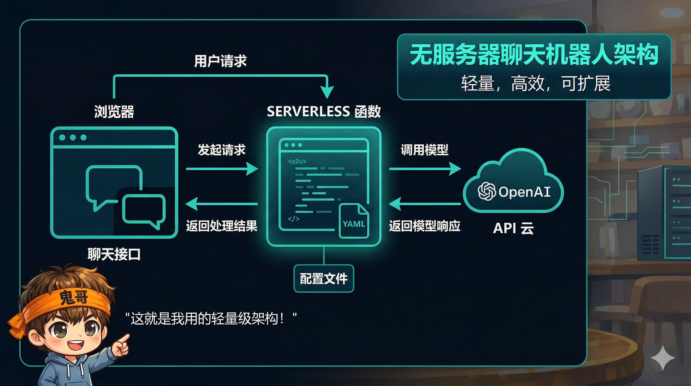
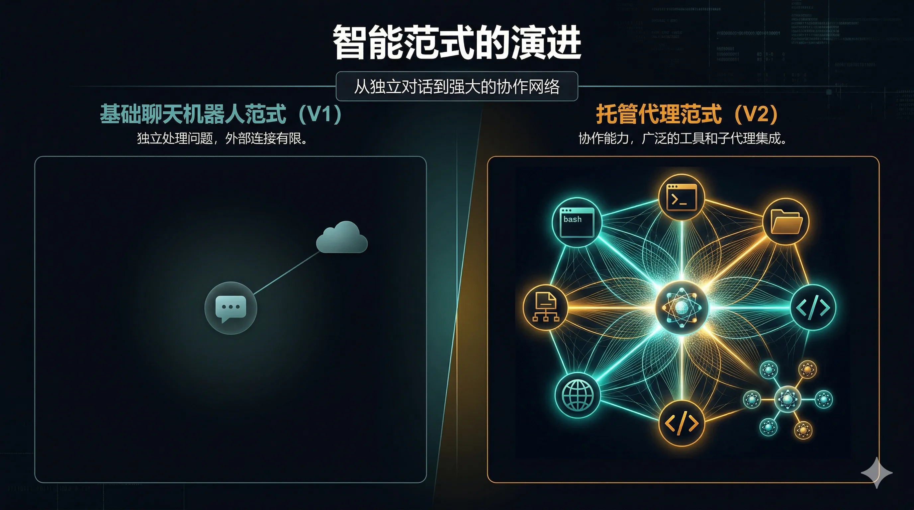
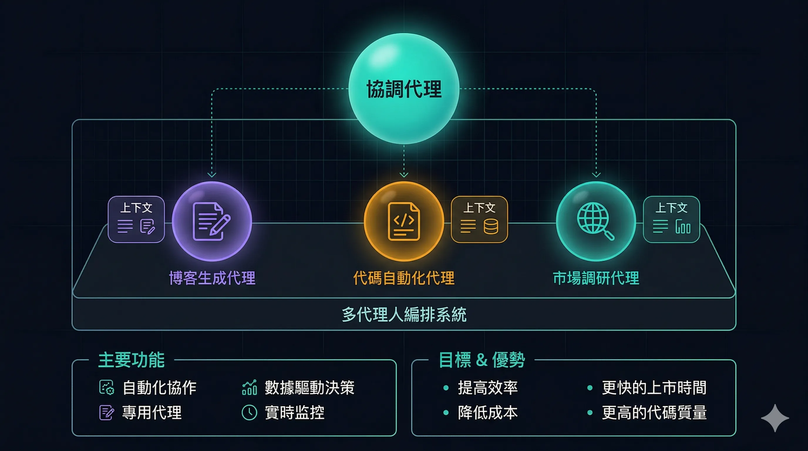
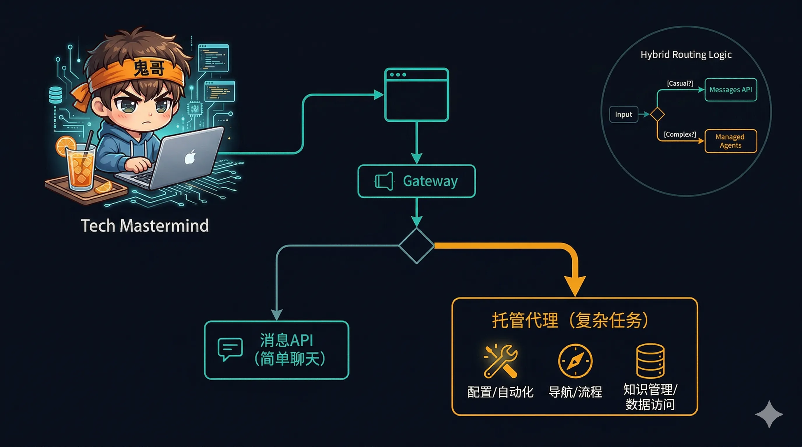

> 150 行代码就能造一个"数字分身"，但它只会聊天，不会做事。
>
> 如果它能帮你写代码、搜资料、跑脚本呢？

两个月前，我给博客做了一个 AI 数字分身——[guige_avatar](https://github.com/luoli523/guige_avatar)。访客点击右下角的聊天按钮，就能和"鬼哥"的 AI 分身聊技术、聊 AI、聊生活。

整个后端只有 **150 行 JavaScript**，部署在 Vercel 上，用的是 OpenAI 的 GPT-4.1-nano。它很轻量，也确实能用——但说实话，它**只是一个穿了马甲的 Chat Completion API**。

2026 年 4 月，Anthropic 推出了 [Claude Managed Agents](https://platform.claude.com/docs/en/managed-agents/overview)——一个托管式的 Agent 运行时平台。看完文档后我意识到：**如果用 Managed Agents 重构鬼哥分身，它能从一个只会聊天的机器人，进化成一个真正能做事的自主 Agent。**

本文就以这个真实案例为主线，带你理解 Managed Agents 到底是什么、能做什么、以及什么时候该用它。


---

## 一、手搓版：guige_avatar 架构剖析

先看看现在的数字分身长什么样。

### 1.1 整体架构

```
访客浏览器                    Vercel Serverless
┌─────────────┐    POST     ┌──────────────────┐      ┌─────────┐
│ 博客首页     │ ─────────→ │  api/chat.js     │ ───→ │ OpenAI  │
│ 聊天面板(JS) │ ←───────── │  (~150 行)       │ ←─── │ API     │
└─────────────┘   JSON      │                  │      └─────────┘
                            │  ↓ fire-and-forget│
                            │  Telegram 通知    │
                            └──────────────────┘
                                    ↑
                            data/persona.yaml
                            (人设 YAML ~200行)
```

### 1.2 核心代码：就这么简单

后端的核心逻辑可以浓缩成这几步：

```javascript
// 1. 加载人设 YAML → 构建 system prompt
const persona = yaml.load(fs.readFileSync('data/persona.yaml'));
const systemPrompt = buildSystemPrompt(persona);

// 2. 拼接历史（最多 10 轮）+ 当前消息
const messages = [
  { role: 'system', content: systemPrompt },
  ...history.slice(-10),
  { role: 'user', content: userMessage }
];

// 3. 一次 API 调用，返回结果
const response = await openai.chat.completions.create({
  model: 'gpt-4.1-nano',
  messages
});
```

没有 agent loop，没有工具调用，没有自主决策。**每次请求就是一次单轮 LLM 推理。**

### 1.3 人设工程：它的真正价值

guige_avatar 最精巧的部分不是代码，而是 `persona.yaml`——一个约 200 行的人设定义文件：

```yaml
personality:
  traits: ["技术极客", "偶尔幽默", "喜欢深度思考"]
  speaking_style: "口语化但有技术深度"
  
knowledge:
  expertise: ["大数据", "AI/LLM", "分布式系统"]
  current_projects: ["Claude Code 源码分析", "博客写作"]
  
boundaries:
  forbidden_topics: ["政治敏感", "个人隐私"]
  fallback: "这个话题我不太方便聊，换个有趣的话题吧？"
```

这种"人设工程"确实让对话体验很自然。但问题是——**人设再好，它也只能聊天，不能做事。**



### 1.4 手搓版的天花板

| 能力 | 状态 |
|------|------|
| 闲聊 | ✅ 流畅自然 |
| 回答技术问题 | ✅ 基于人设知识 |
| 搜索最新信息 | ❌ 无网络访问 |
| 查看博客文章 | ❌ 无文件读取 |
| 帮访客写代码 | ❌ 无代码执行 |
| 记住上次对话 | ❌ 刷新即丢失 |
| 自主完成任务 | ❌ 无 agent loop |

这就是一个典型的**聊天机器人**——能对话，但不能行动。

---

## 二、Managed Agents：它到底是什么？

### 2.1 一句话定义

**Managed Agents = Anthropic 托管的 Agent 运行时。**

你不需要自己搭 agent loop、沙箱、工具执行层。Anthropic 提供一个完整的云端容器环境，Claude 在里面自主运行 bash、读写文件、搜索网页、执行代码。

如果 Messages API 是"你调用模型，模型返回文本"，那 Managed Agents 就是"你定义 Agent，Agent 自主完成任务"。

### 2.2 与 Messages API 的定位差异

| | Messages API | Managed Agents |
|---|---|---|
| **本质** | 直接模型调用 | 预构建的 Agent 运行时 |
| **适合** | 自定义 agent loop、精细控制 | 长时间异步任务、最小化基础设施 |
| **工具执行** | 你的代码负责执行 | Anthropic 云端容器执行 |
| **类比** | 买 CPU 自己组电脑 | 买整机开箱即用 |

### 2.3 核心概念四件套

Managed Agents 的整个模型围绕四个概念：

| 概念 | 说明 | 类比 |
|------|------|------|
| **Agent** | 模型 + system prompt + 工具 + MCP servers | 一个人的"能力定义" |
| **Environment** | 云端容器模板：预装包、网络规则 | 这个人的"工作环境" |
| **Session** | 运行中的 Agent 实例，绑定 Agent + Environment | 一次具体的"工作会话" |
| **Events** | 应用与 Agent 之间的消息流（SSE） | 你和这个人之间的"对话" |

工作流程：

```
创建 Agent（一次性） → 创建 Environment（一次性）
                ↘         ↙
              创建 Session（每次任务）
                    ↓
              发送 Event（用户消息）
                    ↓
              流式接收 Agent 响应（SSE）
                    ↓
              可中途引导或中断
```

---

## 三、Case Study：数字分身 v1（手搓）vs v2（Managed Agents）

这是本文最核心的部分。我们来看，如果用 Managed Agents 重构鬼哥分身，会发生什么变化。



### 3.1 对话 → 能动手：工具能力

**v1（手搓版）**：只能基于 system prompt 中的静态知识回答。

```
访客：你最近写了什么文章？
鬼哥分身：我最近在写 Agent Skills 和 Gemma 4 的分析文章...
（这是 persona.yaml 里预写的，不是实时查的）
```

**v2（Managed Agents 版）**：有完整的工具链。

```
访客：你最近写了什么文章？
鬼哥分身：[使用 bash] ls content/post/ | tail -5
         [使用 read] 读取最近 5 篇文章的 frontmatter
         我最近写了这些文章：
         1. Agent Skills 深度解析（4月7日）
         2. Gemma 4 深度分析（4月5日）
         3. Karpathy 的 LLM Wiki（4月2日）
         ...每篇都有链接，要看哪篇？
```

Managed Agents 的内置工具：

| 工具 | 能力 | 数字分身的用途 |
|------|------|-------------|
| **Bash** | 执行 shell 命令 | 列出文章、统计数据 |
| **Read / Write / Edit** | 文件读写 | 查看博客内容、生成草稿 |
| **Glob / Grep** | 文件搜索 | 搜索特定话题的文章 |
| **Web Search / Fetch** | 网络搜索 | 查最新技术动态 |

### 3.2 内存级历史 → 持久化会话

**v1**：对话历史存在前端 JavaScript 内存中，刷新页面就没了。

```javascript
// v1：前端维护历史，刷新即丢失
let history = [];  // 🔥 页面刷新 = 失忆
```

**v2**：Session 天然持久化，Event 历史服务端保存。

```python
# v2：Session 持久化，随时可恢复
session = client.beta.sessions.create(
    agent=avatar_agent.id,
    environment_id=env.id,
    title="访客 A 的对话"
)
# 下次访问，用同一个 session_id 继续
# 完整的对话历史都在服务端
```

更关键的是，Managed Agents 有 **Memory（研究预览阶段）**——跨会话的长期记忆。这意味着鬼哥分身可以记住："上次这个访客问过 Spark 调优，他应该是做大数据的。"

### 3.3 单轮推理 → 多步 Agent Loop

这是最本质的差异。

**v1**：一问一答，没有中间推理步骤。

```
用户消息 → LLM 生成回复 → 返回
```

**v2**：Agent 可以自主规划多步执行。

```
用户消息 → Claude 思考 → 调用工具 A → 分析结果 
         → 调用工具 B → 综合判断 → 生成回复 → 返回
```

比如访客问"帮我分析一下你这个博客的技术栈"：

- v1：只能背 persona.yaml 里预写的答案
- v2：`grep -r "hugo" config/` → `cat themes/hugo-theme-stack/...` → `ls layouts/` → 基于实际代码给出准确分析

### 3.4 无沙盒 → 云端容器

**v1**：代码在 Vercel Serverless Function 里跑，只有 150ms 的冷启动预算，不能装额外的包。

**v2**：完整的云端容器。

```python
environment = client.beta.environments.create(
    name="guige-avatar-env",
    config={
        "type": "cloud",
        "networking": {"type": "unrestricted"},
        # 可以预装任何包
        # Python, Node.js, Go, Hugo...
    },
)
```

容器意味着：
- 可以预装 Hugo 来本地构建预览
- 可以跑 Python 脚本分析数据
- 可以 git clone 仓库来读取最新代码
- 网络不受限，可以访问外部 API

### 3.5 单 Agent → 多 Agent 编排

**v1**：一个 function 处理所有事情。

**v2**：可以按职责拆分为多个专精 Agent。

```python
# 主 Agent：鬼哥分身（对话协调者）
avatar = client.beta.agents.create(
    name="鬼哥分身",
    model="claude-sonnet-4-6",
    system="你是鬼哥的数字分身...",
    tools=[{"type": "agent_toolset_20260401"}],
    callable_agents=[
        {"type": "agent", "id": blog_agent.id, ...},
        {"type": "agent", "id": code_agent.id, ...},
    ]
)

# Sub-Agent 1：博客助手（搜索和推荐文章）
blog_agent = client.beta.agents.create(
    name="博客助手",
    model="claude-haiku-4-5",  # 用小模型节省成本
    system="你负责搜索和推荐鬼哥的博客文章...",
    tools=[{"type": "agent_toolset_20260401"}],
)

# Sub-Agent 2：代码助手（分析代码、写 demo）
code_agent = client.beta.agents.create(
    name="代码助手",
    model="claude-sonnet-4-6",
    system="你负责帮访客分析代码和写 demo...",
    tools=[{"type": "agent_toolset_20260401"}],
)
```

当访客问文章相关的问题时，主 Agent 委托给博客助手；问代码问题时，委托给代码助手。**各司其职，成本可控。**



---

## 四、完整对比：手搓 vs 托管

| 维度 | v1 手搓版 | v2 Managed Agents |
|------|----------|-------------------|
| **本质** | Chat Completion 包装器 | 自主 Agent 平台 |
| **Agent Loop** | 无，单轮 request-response | 有，多步推理 + 工具调用循环 |
| **工具能力** | 无 | Bash、文件操作、Web 搜索、MCP |
| **代码执行** | 不可能 | 云端容器沙盒 |
| **对话记忆** | 前端内存，刷新丢失 | 服务端持久化 Session |
| **长期记忆** | 无 | Memory（研究预览） |
| **多 Agent** | 不可能 | Coordinator + Sub-agents |
| **后端代码** | ~150 行 JS | ~50 行 Python（SDK 调用） |
| **基础设施** | Vercel function（自己维护） | Anthropic 全托管 |
| **模型** | GPT-4.1-nano（OpenAI） | Claude Sonnet/Haiku（Anthropic） |
| **成本** | API 调用费 + Vercel 免费层 | API 调用费 + Session 运行费 |
| **开发周期** | 1 天 | 1 天（SDK 很简洁） |
| **适合场景** | 轻量级人设聊天 | 需要工具和自主性的场景 |

---

## 五、SDK 实战：5 分钟跑通 Managed Agents

### 5.1 安装

```bash
pip install anthropic
export ANTHROPIC_API_KEY="your-key"
```

### 5.2 创建 Agent + Environment + Session

```python
from anthropic import Anthropic

client = Anthropic()

# 1. 创建 Agent
agent = client.beta.agents.create(
    name="鬼哥分身 v2",
    model="claude-sonnet-4-6",
    system="""你是鬼哥（luoli523）的数字分身。
    
性格：技术极客，偶尔幽默，喜欢深度思考。
擅长：大数据、AI/LLM、分布式系统、Claude Code。
说话风格：口语化但有技术深度，喜欢用类比解释复杂概念。

你可以使用工具来查看博客文章、搜索信息、执行代码。
当访客问到你不确定的事情时，先搜索再回答，不要编造。""",
    tools=[
        {"type": "agent_toolset_20260401"},
    ],
)

# 2. 创建 Environment
environment = client.beta.environments.create(
    name="avatar-env",
    config={
        "type": "cloud",
        "networking": {"type": "unrestricted"},
    },
)

# 3. 创建 Session
session = client.beta.sessions.create(
    agent=agent.id,
    environment_id=environment.id,
    title="访客对话",
)

print(f"Agent: {agent.id}")
print(f"Environment: {environment.id}")
print(f"Session: {session.id}")
```

### 5.3 发消息 + 流式接收

```python
with client.beta.sessions.events.stream(session.id) as stream:
    # 发送用户消息
    client.beta.sessions.events.send(
        session.id,
        events=[{
            "type": "user.message",
            "content": [{
                "type": "text",
                "text": "帮我看看你博客最近写了什么文章"
            }],
        }],
    )

    # 流式处理响应
    for event in stream:
        match event.type:
            case "agent.message":
                for block in event.content:
                    print(block.text, end="")
            case "agent.tool_use":
                print(f"\n[🔧 使用工具: {event.name}]")
            case "session.status_idle":
                print("\n\n✅ 完成")
                break
```

输出可能长这样：

```
让我看看最近的文章...
[🔧 使用工具: bash]
[🔧 使用工具: read]

最近写了这几篇：
1. **Agent Skills 深度解析**（4月7日）— 拆解 Addy Osmani 的 19 个 AI Agent skill
2. **Gemma 4 深度分析**（4月5日）— Google 开源模型的架构和应用
3. **Karpathy 的 LLM Wiki**（4月2日）— 从零理解 LLM 的百科全书

要看哪篇的详细内容？

✅ 完成
```

### 5.4 TypeScript 版本

```typescript
import Anthropic from "@anthropic-ai/sdk";

const client = new Anthropic();

// 创建 Agent
const agent = await client.beta.agents.create({
  name: "鬼哥分身 v2",
  model: "claude-sonnet-4-6",
  system: "你是鬼哥的数字分身...",
  tools: [{ type: "agent_toolset_20260401" }],
});

// 创建 Environment
const env = await client.beta.environments.create({
  name: "avatar-env",
  config: { type: "cloud", networking: { type: "unrestricted" } },
});

// 创建 Session
const session = await client.beta.sessions.create({
  agent: agent.id,
  environment_id: env.id,
});

// 发消息 + 流式响应
const stream = await client.beta.sessions.events.stream(session.id);

await client.beta.sessions.events.send(session.id, {
  events: [{
    type: "user.message",
    content: [{ type: "text", text: "你最近在研究什么？" }],
  }],
});

for await (const event of stream) {
  if (event.type === "agent.message") {
    for (const block of event.content) {
      process.stdout.write(block.text);
    }
  } else if (event.type === "agent.tool_use") {
    console.log(`\n[🔧 ${event.name}]`);
  } else if (event.type === "session.status_idle") {
    console.log("\n\n✅ Done");
    break;
  }
}
```

---

## 六、工具配置：精细控制

默认的 `agent_toolset_20260401` 启用全部工具。但你也可以按需开关：

```python
# 只开 bash 和文件操作，关掉网络
agent = client.beta.agents.create(
    name="安全受限的分身",
    model="claude-sonnet-4-6",
    tools=[{
        "type": "agent_toolset_20260401",
        "default_config": {"enabled": False},
        "configs": [
            {"name": "bash", "enabled": True},
            {"name": "read", "enabled": True},
            {"name": "glob", "enabled": True},
            {"name": "grep", "enabled": True},
            # web_fetch 和 web_search 保持关闭
        ]
    }],
)
```

还支持**自定义工具**——你定义接口，Claude 决定何时调用，你的代码执行后把结果返回：

```python
agent = client.beta.agents.create(
    name="带自定义工具的分身",
    model="claude-sonnet-4-6",
    tools=[
        {"type": "agent_toolset_20260401"},
        {
            "type": "custom",
            "name": "get_blog_stats",
            "description": "获取博客的访问统计数据",
            "input_schema": {
                "type": "object",
                "properties": {
                    "period": {
                        "type": "string",
                        "description": "统计周期：today, week, month"
                    }
                },
                "required": ["period"]
            }
        }
    ],
)
```

---

## 七、手搓 vs 托管：什么时候用哪个？

这两种方案不是非此即彼的关系，而是**不同复杂度和需求下的最优选择**。

### 用手搓版（Messages API / 自建）

- **需求简单**：纯聊天，不需要工具调用
- **成本敏感**：Vercel 免费层 + 便宜的小模型就够了
- **完全控制**：你需要自定义每一个细节
- **已有基础设施**：你的团队已经有成熟的 agent 框架
- **离线场景**：需要本地部署

### 用 Managed Agents

- **需要工具能力**：Agent 需要执行代码、搜索网页、读写文件
- **长时间任务**：任务可能运行几分钟甚至几小时
- **零基础设施**：不想自己维护沙盒和 agent loop
- **多 Agent 编排**：任务需要多个专精 Agent 协作
- **持久化会话**：需要跨请求保持上下文和文件状态

### 混合方案：最佳实践

实际上，鬼哥分身最可能的进化路径是**混合方案**：

```
访客消息
    ↓
前端（博客首页）
    ↓
轻量网关（Vercel / Cloudflare Worker）
    ├── 简单闲聊 → 直接 Messages API（省钱）
    └── 复杂任务 → 转发到 Managed Agents Session
```

简单问答（"你是谁？""你喜欢什么？"）走便宜的 Messages API；需要搜索、执行代码、多步推理的任务走 Managed Agents。**按需升级，不浪费。**



---

## 八、Beta 注意事项

Managed Agents 目前是 **Beta 状态**（`managed-agents-2026-04-01`），几个关键信息：

- **所有 API 账户默认可用**，无需单独申请
- SDK 自动设置 beta header，直接用就行
- **Research Preview 功能**（Outcomes、Multi-agent、Memory）需要[单独申请](https://claude.com/form/claude-managed-agents)
- Rate Limit：创建操作 60 req/min，读取操作 600 req/min
- 支持 **7 种 SDK**：Python、TypeScript、Go、Java、C#、Ruby、PHP
- 还有 CLI 工具 `ant`（Homebrew 安装）

**品牌规范提醒**：如果你在产品中集成 Managed Agents，可以用 "Claude Agent" 命名，但**不能用** "Claude Code" 或 "Claude Cowork" 的名称和视觉元素。

---

## 总结

从 guige_avatar 到 Managed Agents，本质上是从 **"调用模型生成文本"** 到 **"委托 Agent 完成任务"** 的范式转移。

| 从 | 到 |
|----|-----|
| Chat Completion | Agent Session |
| 单轮推理 | 多步 Agent Loop |
| 无工具 | Bash + 文件 + Web + 自定义 |
| 前端内存 | 服务端持久化 |
| 单一 Agent | 多 Agent 编排 |
| 自建一切 | 托管运行时 |

**Managed Agents 本质上是 "Claude Code as a Service"**——把 Claude Code 的核心能力（bash、文件操作、web 搜索、agent loop）包装成云端 API，让开发者在自己的产品中嵌入 Claude 级别的 Agent 能力。

对于鬼哥分身来说，150 行手搓版已经够用了。但当某天访客说"帮我写一个 Spark 调优的 demo"时，Managed Agents 版本会回答：

```
好的，让我帮你写一个...
[🔧 使用工具: write] 创建 spark_tuning_demo.py
[🔧 使用工具: bash] python spark_tuning_demo.py
脚本已经写好并测试通过了，关键的调优点是...
```

**从"我告诉你"到"我帮你做"——这就是一步之遥。**

---

## 参考资料

- [Claude Managed Agents 官方文档](https://platform.claude.com/docs/en/managed-agents/overview)
- [Managed Agents Quickstart](https://platform.claude.com/docs/en/managed-agents/quickstart)
- [Managed Agents 工具配置](https://platform.claude.com/docs/en/managed-agents/tools)
- [Multi-agent Sessions](https://platform.claude.com/docs/en/managed-agents/multi-agent)
- [guige_avatar 源码](https://github.com/luoli523/guige_avatar)
