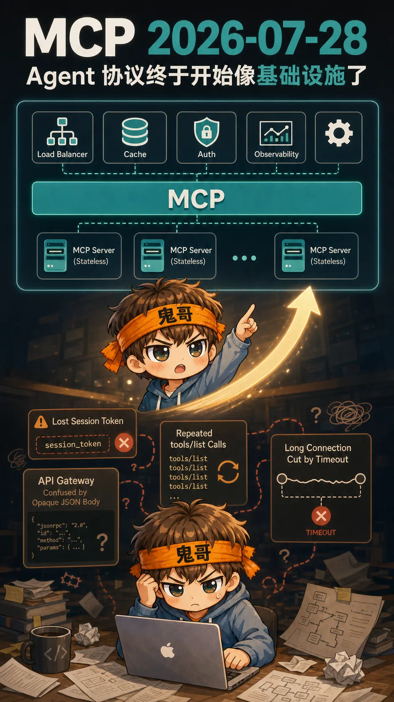
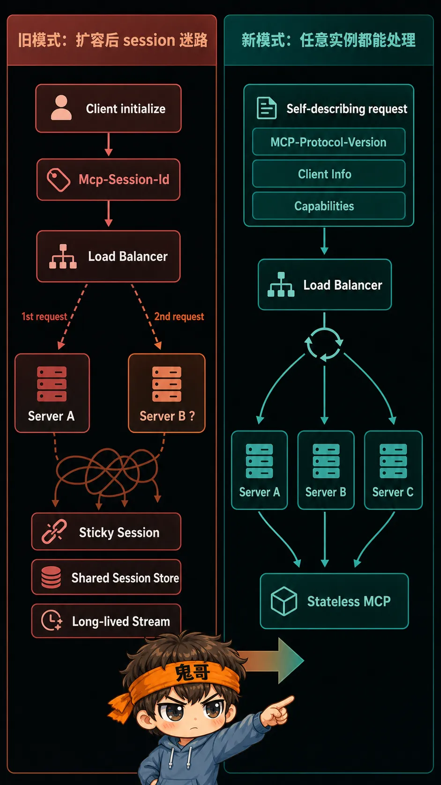
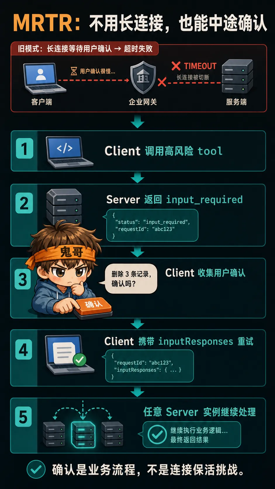
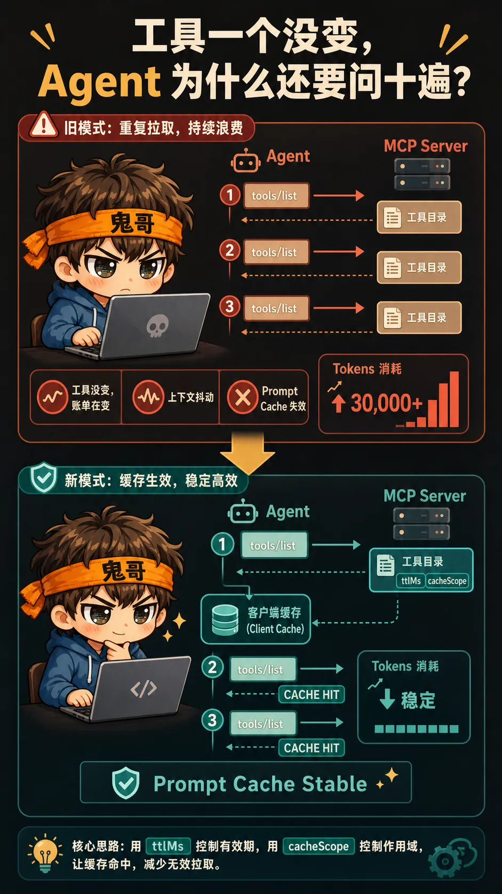
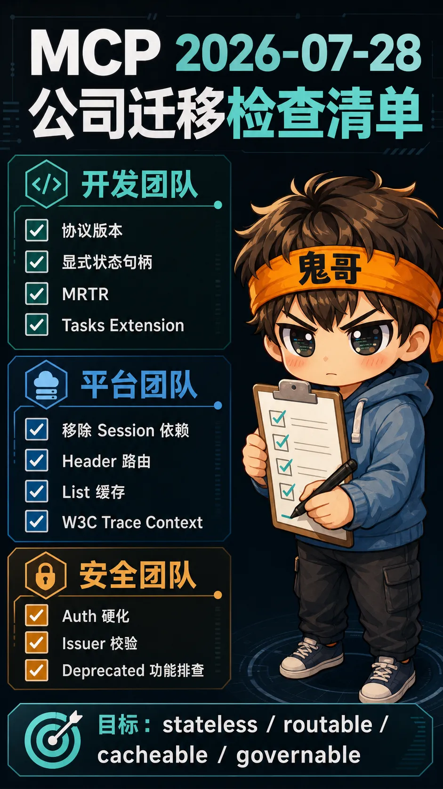

你们在公司里落地 MCP 时，是不是也碰到过这些尴尬？

本地跑得丝滑，一上 Kubernetes、扩成两个实例，session 偶尔就找不到亲妈了；网关团队问“这次到底调用了哪个工具”，你只能指着一坨 POST 里的 JSON 说“答案在里面，请自行考古”；Agent 一遍遍调用 `tools/list`，工具一个没变，token 和请求倒是烧得很稳定；高风险操作想让用户确认一下，结果业务问题还没解决，先和长连接、代理超时打了一架。

鬼哥自己做 MCP 接入和应用时，这几种场面基本都见过。

开发同学觉得协议能跑，平台同学觉得它不好扩，安全同学觉得它看不懂，运维同学觉得它需要特殊照顾。最后大家围着一条本来应该很普通的工具调用链，开出了联合国大会的气势。

如果你也经历过，恭喜，我们算是对上暗号了：

**天下开发者，苦旧 MCP 久矣。**

它不是不能用。恰恰相反，旧 MCP 特别擅长证明一件事：模型可以调用工具。

但从“模型能调用工具”，到“公司敢让模型调用生产工具”，中间隔着负载均衡、网关、缓存、鉴权、审计、超时、扩容，以及安全团队那句永恒的灵魂拷问：

> 出事了算谁的？



2026 年 7 月 28 日，官方发布了新的 Model Context Protocol 规范：`2026-07-28`。

看完这版规范，鬼哥最大的感受只有一句：

**新的 MCP，终于开始像一个基础设施协议了。**

这次不是往协议里再塞几个功能，而是把那些真正妨碍 MCP 进入公司生产环境的东西，一件件拆掉：协议核心无状态、请求可路由、列表可缓存、授权更严谨、长流程不再绑死长连接、扩展也有了正式边界。

Anthropic 官方文档提到，Tier 1 SDK 每月下载量已经接近 5 亿，TypeScript 和 Python SDK 累计下载量都超过了 10 亿。生态跑到这个规模，再拿“demo 能跑”当成功标准，就多少有点不礼貌了。

下面不照着 release note 念。鬼哥直接拿公司里碰到的场景，讲讲这次到底改掉了什么。

---

## 两个实例一扩，session 先迷路了

鬼哥在公司里接远程 MCP 时，最典型的尴尬就是：**单实例一切正常，一横向扩容，问题开始玄学。**

旧版 MCP 在远程 HTTP 场景里，客户端先 `initialize`，服务端给出 `Mcp-Session-Id`，后续请求带着这个 session 继续走。

开发环境只有一个实例，当然岁月静好。到了生产环境，前面挂上 load balancer，后面跑多个实例，请求第一次落到 Server A，第二次被分到 Server B，B 一脸茫然：

> 你谁？

接下来无非几条路：

- 配 sticky session，让同一个客户端尽量黏住同一个实例；
- 搭共享 session store，让所有实例交换记忆；
- 在服务间同步上下文；
- 祈祷扩容、重启和故障转移时别出怪事。

能做，当然都能做。但为了调用一个 tool，先给负载均衡器安排一段刻骨铭心的长期关系，这个工程成本明显不太对。

`2026-07-28` 直接砍掉了这层协议会话：

- 移除 `initialize` / `initialized` 交换；
- 移除协议层 `Mcp-Session-Id`；
- 每个请求自己携带协议版本、客户端身份和能力；
- 需要提前发现服务端能力时，可以调用可选的 `server/discover`。

```text
旧模式：
先握手 → 拿 session → 请求必须找到“熟悉你的实例”

新模式：
请求自描述 → 任意实例都能处理 → 普通 round-robin 就能跑
```



改完之后，MCP server 才真正像一个普通 HTTP 服务：实例随便扩，坏了随便换，请求落到谁家谁处理。Kubernetes、serverless、API Gateway、WAF、rate limiter 和 observability 这些现成基础设施，不用再围着 MCP 单独学一套脾气。

**一个协议如果要求负载均衡器记住你，说明它还没学会在公司里做人。**

---

## 状态可以有，但别藏在桌子底下

看到“无状态”，很多人会立刻问：那浏览器会话、代码沙箱、购物车和长任务上下文怎么办？

鬼哥在公司做这类工具时也遇到过。比如 Agent 创建了一个代码工作区，后面还要继续执行命令、读取结果。状态显然不能丢。

问题不在于“有没有状态”，而在于**状态藏在哪里**。

旧方式把关键状态藏进 transport session。客户端和模型知道“连接还在”，却不一定看得见自己正在操作哪个工作区。连接断了、实例换了，业务上下文也容易跟着失忆。

新方式更接近正常 API：

```text
create_workspace → 返回 workspace_id
run_command(workspace_id, command)
read_result(workspace_id)
```

服务端返回显式 handle，模型在后续 tool call 中把它作为参数传回来。

体验上的变化很直接：

| 以前 | 现在 |
|---|---|
| 状态依附于连接 | 状态依附于明确的业务 ID |
| 模型看不见 session 里藏了什么 | 模型能读取和传递 `workspace_id` / `task_id` |
| 断线恢复依赖原会话 | 换实例后仍可按 handle 继续 |
| 排查时先猜“会话怎么了” | 日志里直接按业务 ID 追踪 |

这不只是方便运维，也更适合 Agent 推理。模型看得见状态，才能引用状态、组合状态、接着做下一步。

**状态不是不能有，不能装神弄鬼。**

---

## 要用户点个确认，没必要拿长连接祭天

公司里的 Agent 一旦能写数据，human-in-the-loop 就绕不过去。

鬼哥碰到过的真实需求很普通：Agent 准备删除数据、修改配置、调用付费服务，执行前必须让用户确认。业务上就是一个“确定吗”，技术上却可能变成一条长时间挂着的双向流。

旧思路里，服务端执行到一半，通过打开的连接反向问客户端：

```text
准备删除 3 条记录，确认吗？
```

听起来合理，直到它穿过公司的代理、网关和超时策略。用户去倒杯水，回来点“确认”，连接已经先替他回答了：

> 不确认，我没了。

MRTR，Multi Round-Trip Requests，解决的就是这个问题。它把中途交互拆成普通的多轮 request/response：

```text
1. Client 调用 tool
2. Server 返回 input_required
3. Client 收集用户确认或补充参数
4. Client 带着 inputResponses 重试原调用
5. 任意 Server 实例继续处理
```



这样一来，删除确认、参数追问、二次授权、用户选择，都不再要求服务端死守一条连接。请求可以暂停，可以恢复，可以重试，也可以由另一个实例接着处理。

**确认是业务流程，不该是连接保活挑战。**

---

## 网关终于能看懂：你到底想干什么

鬼哥把 MCP 接进公司网关时，还有一个非常现实的问题：**所有请求看起来都差不多。**

安全团队想对删除类工具做更严格的授权，平台团队想给昂贵工具单独限流，运维想统计每个 tool 的错误率。结果网关看到的往往只是：

```text
POST /mcp
Content-Type: application/json
```

至于这是 `tools/call` 还是 `resources/read`，调用的是 `search` 还是 `delete_database`，答案埋在 JSON-RPC body 里。

过去网关看 MCP，就像保安看一群都戴着口罩、穿着同款外套的人：知道有人进来了，不知道进来的是谁。

新规范要求 Streamable HTTP 请求带上 `Mcp-Method` 和 `Mcp-Name`：

```text
Mcp-Method: tools/call
Mcp-Name: search
```

于是很多公司里的基础设施能力终于可以直接工作：

| 公司里的需求 | 改进后的体验 |
|---|---|
| 删除类 tool 单独审批 | 网关按 `Mcp-Name` 匹配策略 |
| 搜索和写入使用不同限流 | 不解析 body，header 直接分流 |
| 按方法做权限控制 | 安全层读取 `Mcp-Method` |
| 统计各 tool 成本和错误率 | 观测系统直接按 header 分桶 |
| 对高风险调用做 WAF 规则 | 请求到应用前就能拦截 |

这两个 header 看起来只是两行字符，实际上是 MCP 对企业世界的一次低头。

而这次低头，很有必要。**基础设施不怕你复杂，怕的是你什么都藏着不说。**

---

## 工具一个没变，Agent 为什么还要问十遍

鬼哥在公司跑 Agent 时，经常看到一种很浪费的行为：

```text
tools/list
tools/list
tools/list
```

Agent 每推进几步，就重新确认一次“你有哪些工具”。服务端老老实实返回同一份列表，客户端老老实实重新处理，大家都很勤奋，只有账单不太开心。

旧 MCP 对列表缓存缺少明确语义。客户端不知道这份 tool catalog 能信多久，也不知道应该按用户、租户还是全局缓存。最稳妥的办法只能是：再问一次。

新规范让 `tools/list`、`prompts/list`、`resources/list`、`resources/read` 等响应可以携带：

- `ttlMs`
- `cacheScope`

有了明确的有效期和作用域，客户端可以放心复用结果。同时，确定性的列表顺序也能让上游上下文更稳定，减少 prompt cache 因为一点无意义的顺序抖动而失效。



前后的差别，不只是少几次网络请求：

- 工具发现更快；
- token 消耗更低；
- tool catalog 在上下文里更稳定；
- 多租户缓存边界更清楚；
- 服务端不用反复回答同一道送分题。

**最贵的请求，不一定最复杂；也可能只是明知道答案没变，还要再问一遍。**

---

## 安全团队终于不只剩一句“先别上”

公司里接 MCP，真正耗时间的通常不是 tool schema，而是 authorization。

鬼哥经历过类似的拉扯：开发侧已经把工具调用跑通了，接入企业身份系统时却开始连环追问：

- 这个 token 是谁签发的？
- Agent 代表哪个用户？
- credential 能不能被拿去另一个授权服务器使用？
- desktop / CLI 的 localhost redirect 怎么处理？
- 出问题以后，能不能还原谁在什么时候调用了什么？

这些问题一个都不酷，但任何一个答不清，安全团队都可以非常合理地说：

> 很好，先别上。

`2026-07-28` 对授权做了几项关键硬化：

- 授权服务器应返回 `iss`，客户端在换 code 前必须验证，避免 authorization-server mix-up；
- DCR 增加 `application_type`，减少 desktop / CLI 的 localhost redirect 被误拒；
- client credential 与 issuer 绑定，不能跨授权服务器复用；
- Dynamic Client Registration 被弃用，方向转向 Client ID Metadata Documents；
- 企业托管授权等能力进入正式 extensions 框架。

改进后的重点，不是 OAuth 流程看起来更漂亮，而是信任关系终于更容易说清楚：谁签发、谁使用、代表谁、能用在哪、出了事怎么查。

**能调工具是 demo；知道谁以谁的名义调了什么，才是生产。**

---

## 出错以后，别再让日志各说各话

鬼哥在公司排查 Agent 调用链时，还有一种熟悉的痛苦：一次 tool call 穿过客户端、SDK、MCP server，再调用下游 API，报错后每一层都有日志，但没有一层承认彼此认识。

客户端说请求失败，MCP server 说下游超时，下游系统说自己收到过一个调用。三份日志，三个 request ID，工程师只能靠时间戳和直觉玩连连看。

新规范把 W3C Trace Context 在 `_meta` 里的传播方式正式写清楚，固定了 `traceparent`、`tracestate` 和 `baggage` 的 key。这样，一条从 Agent 发起的调用，可以穿过客户端 SDK、MCP server 和下游服务，最终在兼容 OpenTelemetry 的系统里串成同一棵 span tree。

改进前，问题是“这三条日志是不是一家人”；改进后，至少可以沿着一个 trace 看到请求在哪一层慢、在哪一层错、又是谁重试了几次。

**没有 trace 的 Agent 调用链，出了问题以后就不是排障，是刑侦。**

---

## 长任务别再假装自己是一次 tool call

鬼哥在公司做 Agent 流程时，批量处理、生成报告、扫描代码、部署环境这类任务很常见。它们可能跑几分钟，甚至更久。

硬把这种工作塞进一次 tool call，体验通常是：

```text
Client：还活着吗？
Server：在跑。
Client：跑哪了？
Server：你先别断。
网关：时间到了，我帮你们断。
```

新规范把 Tasks 从 experimental core 移到 `io.modelcontextprotocol/tasks` extension，并提供：

- poll-based `tasks/get`
- `tasks/update`
- 通过 `subscriptions/listen` 订阅通知

这意味着长任务可以有明确身份、状态和更新机制，不需要伪装成一条永远不结束的普通请求。

更重要的是，MCP 正式确立了 extensions 框架。新能力可以先在扩展中演进，成熟后再决定是否进入核心，core 则保持小而稳定。

同时，新规范给出至少 12 个月的弃用窗口。Roots、Sampling、Logging 和 legacy HTTP+SSE transport 被标记为 deprecated，但不会第二天突然断气。

这才是一个成熟协议该有的演进方式：能往前走，也不半夜掀生产系统的桌子。

**核心协议不是收纳箱。什么都往里塞，最后就只剩下“核心”两个字比较轻。**

---

## 这次升级，公司团队该检查什么

官方表示，TypeScript、Python、Go、C# 四个 Tier 1 SDK 已经支持 `2026-07-28`，Rust SDK 也有 beta 支持。

如果你在公司维护远程 MCP server，别只看完 release note 点个赞。建议直接拉开发、平台和安全团队过一遍下面这张表：

| 检查项 | 结合现有系统要问的问题 |
|---|---|
| 协议版本 | 是否支持 `2026-07-28`？旧客户端如何降级？ |
| session 依赖 | 是否依赖 `Mcp-Session-Id`、sticky session 或共享会话存储？ |
| 状态句柄 | 跨调用状态能否改成显式 `task_id` / `workspace_id`？ |
| 网关路由 | 能否利用 `Mcp-Method` / `Mcp-Name` 做限流、鉴权和观测？ |
| list 缓存 | 工具、资源和 prompt 列表能否提供稳定顺序与缓存提示？ |
| MRTR | 用户确认、补参数和二次授权能否改成 input-required / retry？ |
| Auth | issuer 校验、credential 绑定和 DCR 迁移是否有计划？ |
| 链路追踪 | `traceparent` / `tracestate` / `baggage` 能否贯穿调用链？ |
| 长任务与弃用项 | 是否应迁移到 Tasks extension？是否还依赖旧能力？ |



这一版真正拉开的，不再是谁能多暴露几个 tools，而是谁的 MCP server 能做到：

```text
stateless
routable
cacheable
observable
governable
extensible
```

过去我们评价一个 MCP server，常问的是：**它能不能用？**

接下来公司真正会问的是：**它能不能扩，能不能管，能不能查，出了事能不能解释？**

---

## 最后：MCP 开始进入真正的淘汰赛

过去一年，MCP 的第一阶段是“万物皆可接”：数据库、浏览器、GitHub、Slack、Figma、云服务、公司内部系统，先把工具接进来再说。

这个阶段很热闹，也很重要。

但工具数量决定的是 demo 看起来有多丰富，基础设施能力决定的是公司敢不敢把它留在生产环境。

`2026-07-28` 这版规范最有价值的地方，就是它终于开始正面处理那些不适合发布会截图、却每天折磨工程团队的问题：会话、扩容、路由、缓存、授权、长任务和协议演进。

所以鬼哥的判断是：

**MCP 的上半场，比的是谁接的工具多；下半场，比的是谁更像基础设施。**

Agent 要真正进入公司，不缺会调用工具的 demo。

缺的是一套能被负载均衡接住、被网关看懂、被安全系统治理、被运维团队放心扩容的协议。

苦旧 MCP 久矣。

这一次，新的 MCP 总算开始治病了。

---

## 参考资料

- [The 2026-07-28 Specification | Model Context Protocol Blog](https://blog.modelcontextprotocol.io/posts/2026-07-28/)
- [The 2026-07-28 MCP Specification Release Candidate | Model Context Protocol Blog](https://blog.modelcontextprotocol.io/posts/2026-07-28-release-candidate/)
- [Model Context Protocol Documentation](https://modelcontextprotocol.io/)
