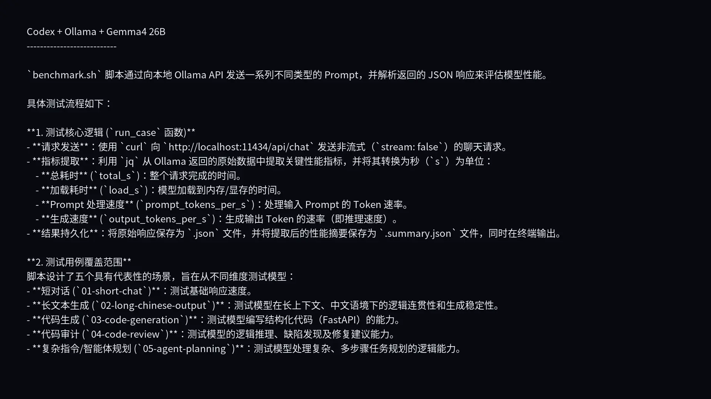
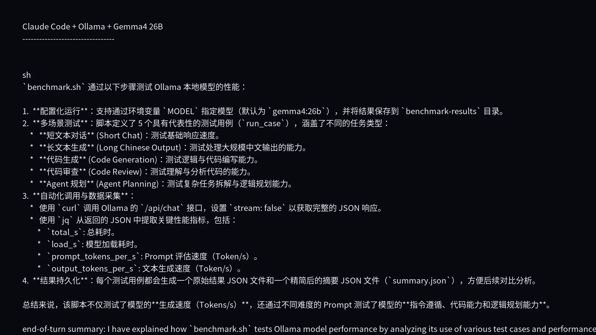
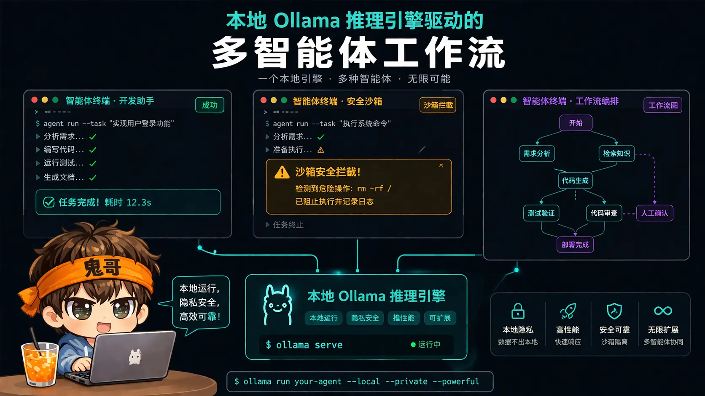
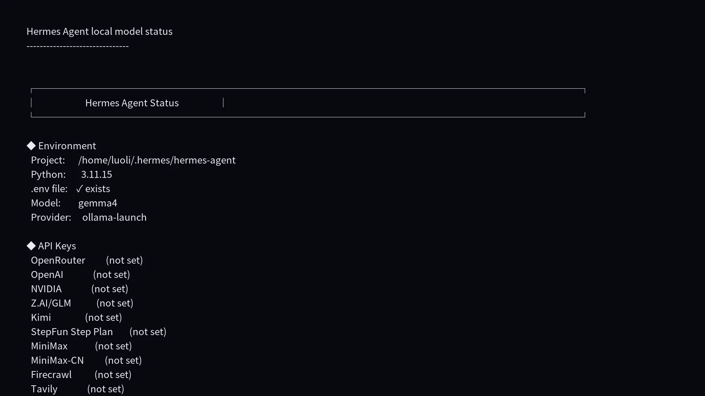
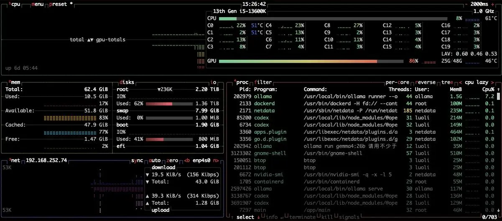
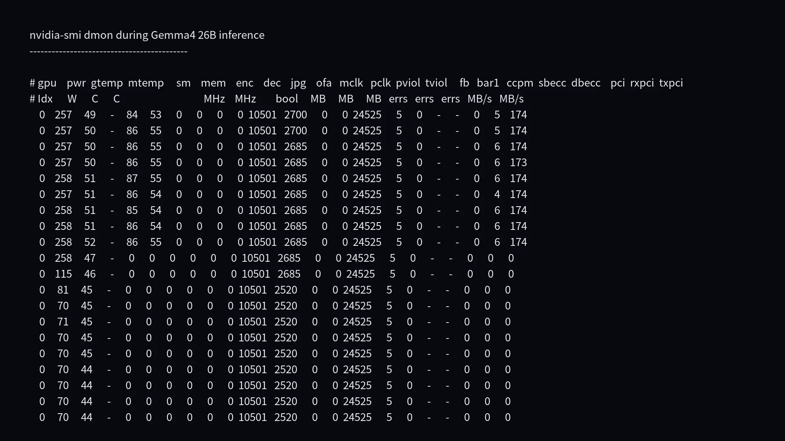

以前本地大模型像玩具：能聊天，但一进开发工作流就露怯。现在一张 4090 已经能把 **Gemma4 26B** 跑起来，还能接 Codex、Claude Code、Hermes Agent。问题只剩一个：**它到底是生产力，还是昂贵的电子暖手宝？**

这篇文章不讲玄学，直接上手：用 Ollama 部署本地模型、用 API 对话、接入开发工具，再看 RTX 4090 上的真实推理数据。


---

## 先看结论

我这台机器的实测环境：

| 项目 | 数据 |
|---|---:|
| GPU | NVIDIA GeForce RTX 4090 |
| `nvidia-smi` 显存 | 49140 MiB |
| NVIDIA Driver | 570.158.01 |
| CUDA | 12.8 |
| Ollama | 0.23.0 |
| 模型 | `gemma4:26b` |
| 模型文件大小 | 17 GB |
| Ollama 加载后显存 | 约 24.5 GB |
| 持续输出速度 | 约 160-166 tokens/s |
| 长输出功耗 | 约 260-265W |
| 长输出温度 | 54-60C |

先打补丁：我这张 4090 在 `nvidia-smi` 里显示约 **48GB 显存**，不是常见 24GB 版本。普通 24GB 4090 也可以参考这篇文章的方法，但长上下文、并发和 Agent 场景要更保守。

我的结论是：

> **本地 26B 模型已经能做日常开发副驾，但还不能无脑替代云端顶级模型。**

它适合解释私有代码、写脚本、生成小模块、做初步 code review；但复杂重构、跨仓库规划、长链路 Agent，仍然会被模型能力、上下文和工具链沙盒卡住。

---

## Ollama 解决了什么

Ollama 的价值不是让模型变聪明，而是把本地部署降到几条命令：

```bash
ollama pull gemma4:26b
ollama run gemma4:26b
```

没有 Ollama，你要处理权重格式、量化版本、CUDA、服务启动、API 适配。用 Ollama 之后，它更像一个本地模型网关：

```text
开发工具 / 脚本 / Agent
        |
        v
http://localhost:11434
        |
        v
本地 Gemma4 26B
```


查看模型：

```bash
ollama list
```

我本机输出里有：

```text
NAME             SIZE
gemma4:26b       17 GB
gemma4:e2b       7.2 GB
gemma4:latest    9.6 GB
gpt-oss:20b      13 GB
gpt-oss:120b     65 GB
```

查看运行状态：

```bash
ollama ps
```

实测加载后：

```text
NAME          SIZE     PROCESSOR    CONTEXT
gemma4:26b    25 GB    100% GPU     262144
```

这行信息很关键：`100% GPU` 说明没有明显落到 CPU，`262144` 说明上下文窗口很大，但不代表每次都应该塞满。

---

## 先直接对话

命令行对话：

```bash
ollama run gemma4:26b
```

然后直接问：

```text
用三句话解释 Ollama 是什么。
```

如果要从程序里调用，用 Ollama 原生 API：

```bash
curl http://localhost:11434/api/chat \
  -d '{
    "model": "gemma4:26b",
    "messages": [
      {"role": "user", "content": "用三句话解释 Ollama 是什么。"}
    ],
    "stream": false
  }'
```

Ollama 返回的 JSON 里有性能字段：

| 字段 | 含义 |
|---|---|
| `load_duration` | 模型加载耗时 |
| `prompt_eval_count` | 输入 token 数 |
| `prompt_eval_duration` | 输入处理耗时 |
| `eval_count` | 输出 token 数 |
| `eval_duration` | 输出生成耗时 |

核心公式：

```text
输出速度 = eval_count / eval_duration_seconds
```

这比手动掐秒表靠谱。

---

## 接入 Codex：默认沙盒失败，授权后跑通

Codex CLI 版本：

```text
codex-cli 0.128.0
```

启动方式：

```bash
codex --oss --local-provider ollama -m gemma4:26b
```

我先跑了一个只读任务：

```bash
codex exec \
  --oss \
  --local-provider ollama \
  -m gemma4:26b \
  -s read-only \
  --ephemeral \
  "请阅读当前目录的 benchmark.sh，简要说明它会如何测试 Ollama 本地模型性能，不要修改任何文件。"
```

Codex 成功识别了 Ollama provider：

```text
model: gemma4:26b
provider: ollama
sandbox: read-only
```

但默认 read-only sandbox 下，内部执行读文件命令时失败：

```text
bwrap: loopback: Failed RTM_NEWADDR: Operation not permitted
```

这个结果很有价值：**本地模型速度够，不代表 Agent 工具链一定顺。** 这次不是模型不行，而是当前 Linux 环境下 bubblewrap sandbox 权限受限。

随后我显式授权绕过 Codex 内部 sandbox，仍然使用同一个只读任务：

```bash
codex exec \
  --oss \
  --local-provider ollama \
  -m gemma4:26b \
  --dangerously-bypass-approvals-and-sandbox \
  --ephemeral \
  "请阅读当前目录的 benchmark.sh，简要说明它会如何测试 Ollama 本地模型性能，不要修改任何文件。"
```

这次跑通了。Codex 成功执行：

```bash
cat benchmark.sh
```

并总结出脚本会调用本地 Ollama `/api/chat`，保存原始 JSON，再用 `jq` 计算 `load_s`、`prompt_tokens_per_s`、`output_tokens_per_s` 等指标。换句话说，**Codex + Ollama + Gemma4 26B 是可用的，但在这台机器上需要绕过 Codex sandbox 才能读文件。**



遇到类似问题，优先检查：

- 是否在受限容器、远程桌面、特殊 sandbox 里运行
- 系统是否允许 user namespace
- Codex sandbox 模式是否过严
- 是否需要换普通终端或调整权限策略

---

## 接入 Claude Code：真实可用

Claude Code 版本：

```text
2.1.126 (Claude Code)
```

Ollama 提供了 Anthropic-compatible API，所以可以这样接：

```bash
export ANTHROPIC_AUTH_TOKEN=ollama
export ANTHROPIC_API_KEY=""
export ANTHROPIC_BASE_URL=http://localhost:11434

claude --model gemma4:26b
```

我用完整路径跑了一个非交互只读任务：

```bash
env ANTHROPIC_AUTH_TOKEN=ollama \
  ANTHROPIC_BASE_URL=http://localhost:11434 \
  ANTHROPIC_API_KEY= \
  /home/luoli/.local/bin/claude \
  -p \
  --model gemma4:26b \
  --no-session-persistence \
  --permission-mode dontAsk \
  --tools Read \
  --output-format json \
  "请阅读当前目录的 benchmark.sh，简要说明它如何测试 Ollama 本地模型性能。不要修改任何文件。"
```

结果成功：

| 指标 | 数据 |
|---|---:|
| 状态 | success |
| 总耗时 | 7889 ms |
| API 耗时 | 7824 ms |
| 轮数 | 2 |
| 输入 token | 16319 |
| 输出 token | 713 |
| permission denials | 0 |

Claude Code 正确读取了 `benchmark.sh`，并总结出脚本会用 5 个 case 调用 Ollama `/api/chat`，保存原始 JSON，再用 `jq` 提取 `total_s`、`load_s`、`prompt_tokens_per_s`、`output_tokens_per_s` 等指标。

这就是一个正面案例：**同样是 Gemma4 26B，本地模型不只会聊天，也能通过 Claude Code 的 Read 工具进入真实开发上下文。**





---

## 接入 Hermes Agent

Hermes Agent 版本：

```text
Hermes Agent v0.12.0 (2026.4.30)
```

快速启动：

```bash
ollama launch hermes
```

也可以 oneshot 测试：

```bash
hermes --provider ollama \
  -m gemma4:26b \
  -z "请用三句话说明你当前是否在通过 Ollama 本地模型运行，并给一个开发建议。"
```

我本机能跑通。再用：

```bash
hermes status
```

看到：

```text
Model:        gemma4
Provider:     ollama-launch
```

这里有个细节：模型回答里可能说自己是 custom provider，但工具状态显示 `ollama-launch`。所以验证 Agent 是否真的接入本地模型，不要只看模型自述，要看工具的 `status` 或配置。



---

## 4090 + Gemma4 26B 实测

我写了一个 benchmark 脚本：

```bash
content/post/ollama-local-dev/benchmark.sh
```

它测试 5 类任务：

| Case | 目的 |
|---|---|
| Short chat | 短对话 |
| Long Chinese output | 长中文输出 |
| Code generation | 代码生成 |
| Code review | 代码审查 |
| Agent planning | Agent 规划 |

实测结果：

| Case | 总耗时 | 输出 tokens | 输出速度 |
|---|---:|---:|---:|
| 短对话 | 4.790s | 697 | 165.93 tokens/s |
| 长中文输出 | 18.728s | 2785 | 160.84 tokens/s |
| 代码生成 | 13.337s | 1985 | 161.66 tokens/s |
| 代码审查 | 14.430s | 2143 | 161.16 tokens/s |
| Agent 规划 | 13.631s | 2028 | 161.48 tokens/s |
| 长输出监控 | 24.020s | 3554 | 159.79 tokens/s |

结论很稳定：

```text
Gemma4 26B 在这台机器上的持续输出速度约 160 tokens/s
```


---

## 显存、功耗和温度

模型加载后：

```text
GPU Memory: 24527MiB / 49140MiB
Power:      72W
Temp:       51C
Process:    /usr/local/bin/ollama
```

长输出期间用：

```bash
nvidia-smi dmon -s pucvmet -c 20
```

观察到：

| 指标 | 数据 |
|---|---:|
| 功耗 | 260-265W |
| 温度 | 54-60C |
| SM 利用率 | 82-87% |
| 显存占用 | 约 24529MB |
| 显存利用率 | 50-55% |
| 显存频率 | 10501 MHz |
| 核心频率 | 2670-2685 MHz |

这说明推理确实主要在 GPU 上跑，而且负载不低。长时间跑 Agent 时，真正要关注的不只是 tokens/s，还有散热、风噪、电费和显存被其他任务抢占。





---

## 一个容易误判的点：thinking 也算 token

第一次烟测里，我只是问：

```text
用三句话解释 Ollama 是什么。
```

但 API 返回里的 `eval_count` 到了 887，因为模型生成了不少 thinking 内容。

所以做 benchmark 时不要只看“用户看到多少字”。对推理耗时来说，模型实际生成的 token 才是成本，包括 thinking。

---

## 适合怎么用

我建议这样分工：

| 场景 | 本地 Gemma4 26B 是否适合 |
|---|---|
| 私有代码解释 | 很适合 |
| 写脚本 / 小工具 | 很适合 |
| 生成测试样例 | 适合 |
| 初步 code review | 适合 |
| 大型重构 | 谨慎 |
| 跨仓库复杂任务 | 不建议只靠本地 |
| 高风险生产改动 | 必须人工复核 |

最舒服的用法不是“让本地模型全自动开发完整系统”，而是：

```text
本地模型负责高频、低风险、隐私敏感任务；
云端强模型负责低频、高难度、强推理任务。
```


---

## Takeaway

回顾一下，搭一个能用于开发的本地 AI 环境，只需要四步：

1. 用 Ollama 拉取模型：`ollama pull gemma4:26b`
2. 用 API 或 CLI 确认模型能稳定对话
3. 把 Codex、Claude Code、Hermes 接到 `localhost:11434`
4. 用 tokens/s、显存、功耗、温度和 Agent 成功率一起评估体验

这次实测最重要的结论不是“4090 很快”，而是：

> **本地模型的下限已经很高，但上限取决于工具链。**

Claude Code 能顺利读取文件，Codex 在同一环境里被 sandbox 卡住，Hermes 能跑通但 provider 映射要核验。这才是真实的本地 AI 开发体验：模型只是发动机，方向盘、刹车和路况一样重要。

---

## 参考资料

- [Ollama Gemma4 模型页](https://www.ollama.com/library/gemma4)
- [Ollama OpenAI-compatible API 文档](https://docs.ollama.com/openai)
- [Ollama Codex 集成文档](https://docs.ollama.com/integrations/codex)
- [Ollama Claude Code 集成文档](https://docs.ollama.com/integrations/claude-code)
- [Ollama Hermes Agent 集成文档](https://docs.ollama.com/integrations/hermes)
