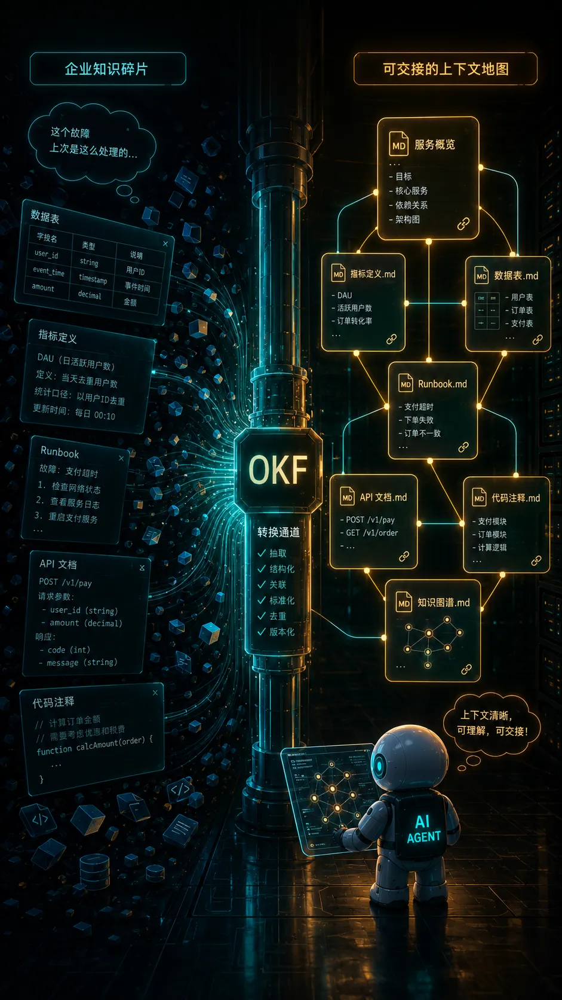
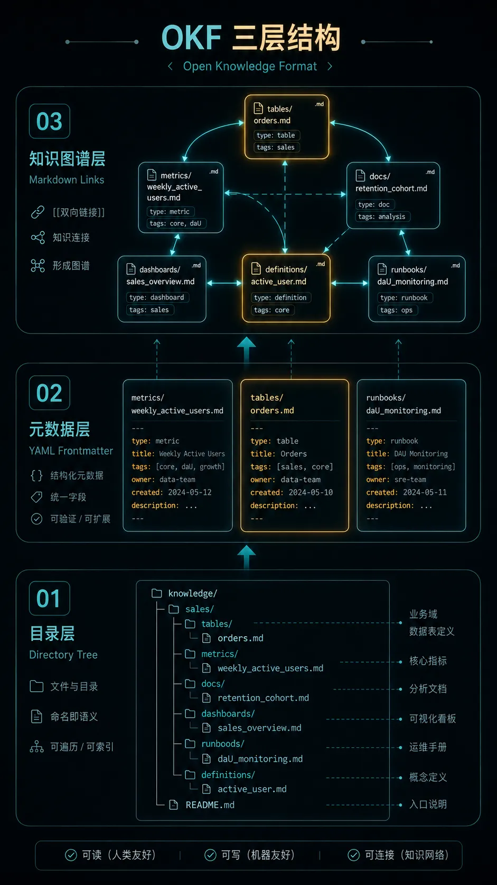
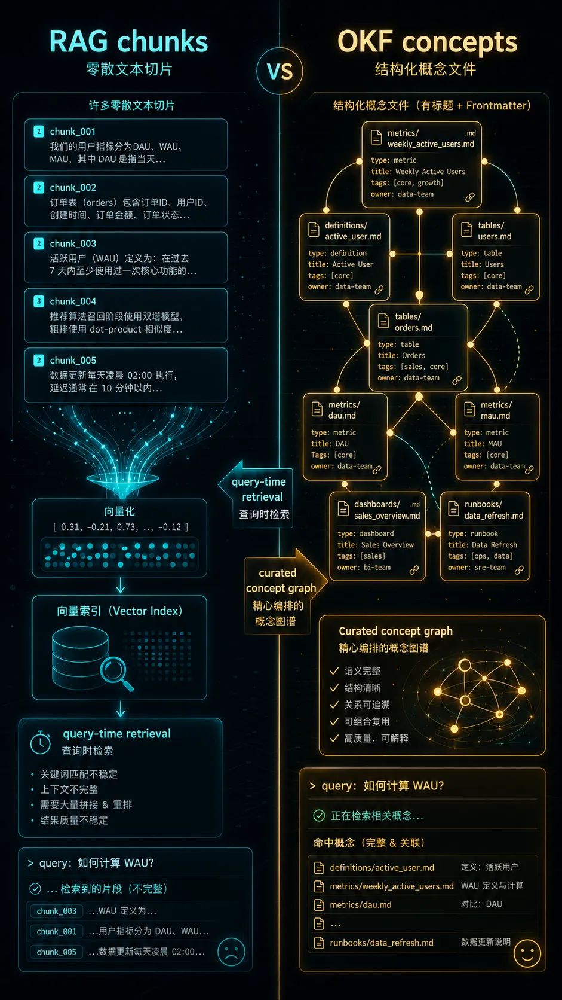
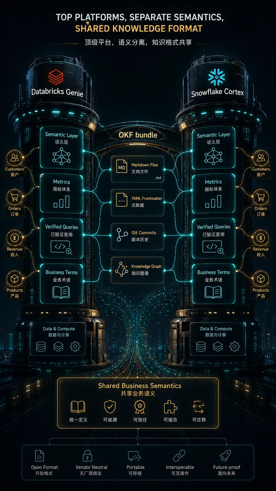
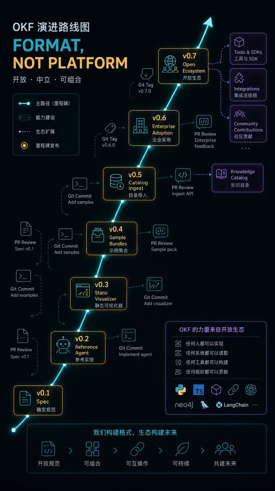

AI Agent 最怕的不是模型不够强，而是它每次开工前，都像一个刚入职的新同事：**不知道表在哪，不知道指标怎么算，也不知道谁脑子里藏着关键规则。**

Google Cloud 最近发布的 Open Knowledge Format（OKF），表面上看只是一个“Markdown + YAML frontmatter”的小规范。

但我觉得它真正值得关注的地方在于：它把 AI 时代最难交接的东西，重新变成了文件。



---

## 问题不是没有知识，而是知识没法交给 Agent

今天大多数公司的知识并不少。

表结构在数据目录里，指标定义在 BI 文档里，事故处理流程在 runbook 里，API 变更写在 release note 里，一些关键口径藏在老员工脑子里。

问题是：这些知识对人来说都已经够散了，对 AI Agent 来说更是灾难。

当一个 Agent 要回答：

```text
怎么从事件流里计算 weekly active users？
```

它可能要同时知道：

- 哪张表是事件源；
- 用户 ID 用哪个字段；
- bot 流量怎么排除；
- 时区按 UTC 还是业务地区；
- 老口径有没有废弃；
- 这个指标和看板上的 WAU 是否一致；
- 如果 join 用户表，应该走哪条路径。

这些信息往往分布在不同系统里：metadata catalog、Notion、Google Drive、代码注释、SQL 文件、Slack 历史消息，甚至某个资深工程师的记忆里。

所以，Agent 真正缺的不是“再聪明一点”。

它缺的是一份能被读取、能被链接、能被版本管理、能被不同工具交接的 **上下文资产**。

---

## OKF 是什么：不是服务，是格式

Google Cloud 对 OKF 的定义很克制。

OKF v0.1 把知识表示成一个目录，目录里是一组 Markdown 文件，每个文件都有 YAML frontmatter。它不要求新 runtime，不要求 SDK，不绑定某个云厂商，也不要求你把知识搬进一个新平台。

最小形态大概长这样：

```text
sales/
├── index.md
├── datasets/
│   ├── index.md
│   └── orders_db.md
├── tables/
│   ├── index.md
│   ├── orders.md
│   └── customers.md
└── metrics/
    ├── index.md
    └── weekly_active_users.md
```

一个概念就是一个文件。

文件路径就是这个概念的身份。

文件头部放少量可查询字段，正文放人和 Agent 都能读的解释：

```markdown
---
type: BigQuery Table
title: Orders
description: One row per completed customer order.
resource: https://console.cloud.google.com/bigquery/...
tags: [sales, revenue]
timestamp: 2026-05-28T14:30:00Z
---

# Schema

| Column | Type | Description |
|---|---|---|
| `order_id` | STRING | Globally unique order identifier. |
| `customer_id` | STRING | FK to [customers](/tables/customers.md). |

# Joins

Joined with [customers](/tables/customers.md) on `customer_id`.
```

OKF 的野心不在“文件格式很复杂”，恰恰相反，它的野心在于 **足够普通**：

| 设计选择 | 意味着什么 |
|---|---|
| Markdown | 人能读，Agent 也能读 |
| YAML frontmatter | 少量结构化字段可检索、可过滤 |
| 普通目录 | 能进 Git，能打包，能挂载，能同步 |
| Markdown 链接 | 文件之间自然形成知识图谱 |
| 最小约束 | 不强迫所有团队接受同一套知识模型 |

这就是 OKF 最有意思的地方：**它不是想成为新的知识平台，而是想成为知识平台之间的交换格式。**



---

## 为什么是 Markdown？因为 Agent 时代需要“知识即代码”

这几年很多团队都在重新发现一个模式：LLM wiki。

人类维护 wiki 很痛苦，因为我们会忘记更新链接，懒得补充引用，也不想每次改完一个文档还去同步另外 15 个文件。

但这些事情恰好是 LLM 擅长的。

它不会嫌整理 cross-reference 无聊，也不会因为要批量改十几个文件就开始摆烂。只要你给它一个清晰的文件结构、约束和审查机制，它可以把知识维护变成一个持续循环：

```text
发现新事实
  ↓
更新概念文件
  ↓
补充链接和引用
  ↓
提交 Pull Request
  ↓
人类审核
  ↓
Agent 下次直接读取更新后的上下文
```

这就是“知识即代码”的味道。

代码为什么能长期演进？不是因为代码天然比文档高级，而是因为它有一套成熟的协作机制：

- Git 记录历史；
- PR 承载讨论；
- diff 暴露变化；
- review 把关质量；
- CI 做基础校验；
- blame 能追溯责任。

OKF 想做的，是让企业知识也进入这套机制。

不是再建一个“大家都不会更新”的知识库，而是让知识文件和代码、SQL、配置、runbook 一起被管理。

---

## OKF 和 RAG 的区别：一个是切片，一个是概念

很多人第一反应会是：这不就是 RAG 吗？

不完全是。

RAG 通常做的是：把文档切 chunk，做 embedding，查询时召回相关片段，再交给模型综合。

OKF 更像是提前把知识整理成 **概念级资产**。一个表、一个指标、一个 runbook、一个 API、一个 join path，都可以是独立概念。概念之间用 Markdown 链接互相指向。

可以粗暴对比一下：

| 维度 | RAG 常见做法 | OKF 的思路 |
|---|---|---|
| 基本单位 | 文档切片 chunk | 概念 concept |
| 组织方式 | 向量索引 | 文件目录 + 链接图 |
| 语义关系 | 查询时临时召回 | 事先显式维护 |
| 可读性 | 主要给系统读 | 人和 Agent 都能读 |
| 版本管理 | 往往在索引外部 | 天然进 Git |
| 适合场景 | 大规模检索 | 稳定知识、指标、 schema、runbook |

RAG 像是让 Agent 在图书馆里临时找资料。

OKF 像是给 Agent 一本经过整理、带目录、带交叉引用、能持续更新的工作手册。

两者不是互斥关系。OKF bundle 完全可以被索引进 RAG 系统。但它的价值在于：进入索引之前，知识已经被整理成可审查、可迁移、可复用的形态。



---

## OKF 真正解决的是“上下文交接成本”

我觉得 OKF 的关键词不是 Markdown，也不是 YAML。

它的关键词是：**handoff**。

一个企业里最贵的成本，往往不是模型调用费，而是上下文交接费。

新同事入职，要问一堆人。

新 Agent 上线，要重新接一堆系统。

换一个工具，要重新导出、清洗、适配。

换一个供应商，原来的知识资产又被锁在对方的数据模型里。

OKF 试图把这些上下文从“平台内资产”变成“文件资产”。

这件事如果做成，会有几个直接变化：

| 过去 | OKF 想推动的状态 |
|---|---|
| 知识绑定在工具里 | 知识以文件存在 |
| Agent 依赖专用 SDK | Agent 直接读目录 |
| 数据目录和文档分离 | 概念文件里同时有元数据和解释 |
| 更新靠人工记忆 | 更新走 PR 和 review |
| 换工具就重做集成 | 格式是合同，工具可替换 |

这也是为什么 Google Cloud 在官方文章里反复强调：OKF 是 format，不是 platform。

如果一个格式只能在某家云、某个数据库、某个 Agent 框架里跑，那它解决不了上下文迁移问题。

---

## Databricks 和 Snowflake 都很强，但知识仍然不可复用

这里可以拿两个今天业界很强的产品来对照：Databricks Genie One 和 Snowflake Cortex Analyst。

先说清楚：这两个方向都很顶。

Databricks Genie One 的定位是面向业务团队的 AI coworker。它强调“grounded in your data”，能让业务用户提问、拿到上下文相关的答案，并进一步把洞察转成 action、agent 或 app。它背后的 Genie Ontology 被 Databricks 描述为一个持续改进、自动推断的业务术语、实体和 KPI 知识图谱，用来支撑 Genie 的回答和动作。Databricks 文档里的 Genie Spaces，也明确要求数据分析师用 Unity Catalog 数据集、示例 SQL、业务语义表达式和组织术语说明来 curate 一个 domain-specific 的问答空间。

Snowflake Cortex Analyst 也在解决同一个核心问题：业务用户用自然语言问数据问题，但数据库 schema 本身不足以告诉模型“业务到底是什么意思”。所以 Cortex Analyst 依赖 semantic model / Semantic Views，把业务实体、维度、事实、指标、表关系、verified queries 等语义信息显式建出来。Snowflake 官方文档也明确说，semantic model 是用来弥合 business users 和 database 之间的差距。

这两套东西都不是玩具。

它们代表了企业数据 AI 的一个共识：**自然语言问数想要靠谱，必须有业务语义层。**

但问题也在这里。

如果你的团队在 Databricks 里花了很多时间维护 Genie Space、Genie Ontology、Unity Catalog Semantics；同时另一个团队在 Snowflake 里维护 Semantic Views、Cortex Analyst semantic model、verified queries，那么这些业务知识很难天然复用。

不是因为 Databricks 或 Snowflake 做得不好。

恰恰相反，是因为它们都做得太完整了：语义层、权限、执行引擎、治理、Agent 体验，都和自家平台深度耦合。

于是用户会遇到一个很现实的问题：

| 业务知识 | 在 Databricks 里 | 在 Snowflake 里 | 跨平台复用 |
|---|---|---|---|
| 指标定义 | Genie / Unity Catalog 语义体系 | Semantic Views / semantic model | 需要重新映射 |
| 表关系 | Databricks 平台上下文 | Snowflake semantic layer | 不能直接通用 |
| Verified queries | Genie Space 示例和验证 | Cortex Analyst verified queries | 格式不同 |
| 业务术语 | Genie Ontology | Semantic View definitions | 各自维护 |
| Agent 行为 | Genie Agents / apps | Cortex Analyst API / apps | 体验绑定平台 |

对企业来说，选择 Databricks 或 Snowflake 当然都可以。

真正麻烦的是：**一旦业务语义被写进某个平台的私有结构里，它就很难成为企业自己的可迁移资产。**

今天你可能还在二选一。

明天你可能是多云、多仓、多团队并存；有的团队在 Databricks，有的团队在 Snowflake，有的知识还在 Obsidian、Notion、dbt repo、GitHub、Confluence 里。

这时候 OKF 的价值就出来了。

OKF 不试图取代 Databricks Genie，也不试图取代 Snowflake Cortex。它更像一个中间层协议：

```text
Databricks Genie / Unity Catalog
          ↓ export / sync
        OKF bundle
          ↑ import / consume
Snowflake Cortex / Semantic Views
```

理想情况下，企业可以把最核心的业务知识沉淀成 OKF bundle：指标定义、表关系、术语、runbook、verified query、历史变更、负责人、引用来源。

然后 Databricks 可以读它，Snowflake 可以读它，内部 Agent 可以读它，未来换一个新的数据平台也能读它。

这样，平台仍然可以竞争体验、性能、治理和执行引擎。

但业务知识本身，不再被锁死在某一个平台里。

这才是 OKF 最值得期待的地方：**它让企业有机会把“语义层”从平台能力，升级成自己的知识资产。**



---

## 它现在还很早，但方向很对

OKF 目前是 v0.1。

Google Cloud 同时发布了几个参考实现：一个 BigQuery enrichment agent，一个静态 HTML visualizer，以及 GA4、Stack Overflow、Bitcoin public dataset 等 sample bundles。Google Cloud 的 Knowledge Catalog 也已经支持 ingest OKF 并服务给自家 Agent。

这说明它已经不只是一个 PDF 规范，而是有了可跑的 producer、consumer 和样例。

但我们也要清醒：OKF 还不是事实标准。

它接下来要面对的问题不少：

- 各家 catalog 和 wiki 是否愿意导出 OKF；
- 企业内部是否愿意把知识当代码维护；
- frontmatter 字段会不会逐渐膨胀；
- 权限、隐私、敏感信息如何和文件分发兼容；
- Agent 自动更新知识时，怎样保证审查和可信度；
- 不同行业的概念模型能否在“最小约束”下保持互操作。

所以，OKF 不是答案的终点。

但它至少指出了一个很重要的方向：**Agent 的能力边界，不只取决于模型，也取决于知识能不能被规范地交给它。**



---

## 我们可以怎么用？

如果你在团队里做 AI Agent、数据平台、知识库、内部工具，我建议不要急着问“要不要全面采用 OKF”。

更实际的做法是：先挑一个小场景试。

比如：

```text
把一个核心指标做成 OKF bundle：

metrics/weekly_active_users.md
tables/events.md
tables/users.md
runbooks/data-quality-check.md
references/product-definition.md
log.md
```

然后让 Agent 基于这些文件回答问题、生成 SQL、检查口径、解释异常。

你很快就会发现：真正困难的不是写 Markdown，而是把团队脑子里的隐性知识显性化。

这也是 OKF 最有价值的地方。

它逼你回答：

- 我们的核心概念到底有哪些？
- 每个概念的权威定义在哪里？
- 哪些链接关系必须显式维护？
- 哪些知识应该进版本控制？
- 哪些更新必须经过人类 review？

这些问题，本来就是企业做 AI Agent 绕不开的问题。

OKF 只是给了一个足够朴素、足够可落地的容器。

---

## Takeaway：先别急着堆 Agent，先整理上下文

如果只记住一句话，我希望是这句：

**AI Agent 的下一场竞争，不只是模型能力，而是上下文工程。**

模型会越来越强，工具调用会越来越顺，multi-agent 框架也会越来越多。

但真正能让 Agent 在企业里稳定工作的，往往是那些看起来不性感的东西：指标定义、表关系、runbook、决策记录、历史变更、权限边界、业务口径。

OKF 的启发是：不要把这些东西继续锁在工具里、聊天记录里、某个人脑子里。

把它们变成文件。

让人能读，让 Agent 能读，让 Git 能管理，让工具能迁移。

这可能就是 AI 时代知识管理最朴素、也最关键的一步。

---

## 参考资料

- [Introducing the Open Knowledge Format, Google Cloud Blog](https://cloud.google.com/blog/products/data-analytics/how-the-open-knowledge-format-can-improve-data-sharing)
- [GoogleCloudPlatform/knowledge-catalog: Open Knowledge Format repository](https://github.com/GoogleCloudPlatform/knowledge-catalog/tree/main/okf)
- [Databricks Genie One](https://www.databricks.com/product/genie/one)
- [Databricks Genie Spaces documentation](https://docs.databricks.com/aws/en/genie/)
- [Snowflake Cortex Analyst documentation](https://docs.snowflake.com/en/user-guide/snowflake-cortex/cortex-analyst)
- [Google Cloud Introduces Open Knowledge Format, MarkTechPost](https://www.marktechpost.com/2026/06/16/google-cloud-introduces-open-knowledge-format-okf-a-vendor-neutral-markdown-spec-for-giving-ai-agents-curated-context/)
- [llm-wiki, Andrej Karpathy](https://gist.github.com/karpathy/442a6bf555914893e9891c11519de94f)
