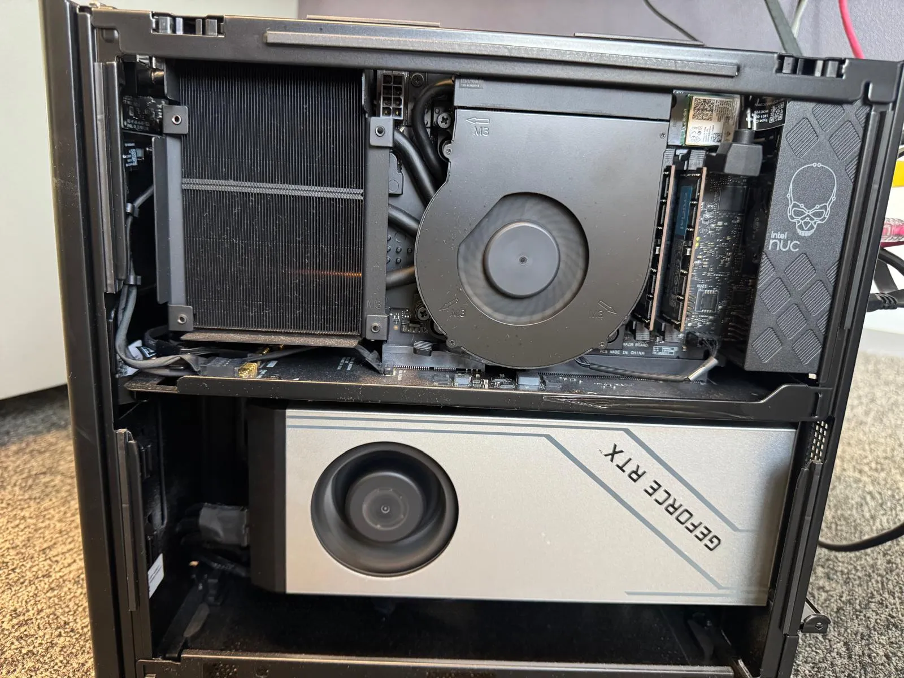
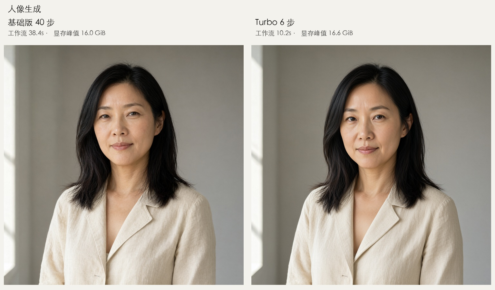
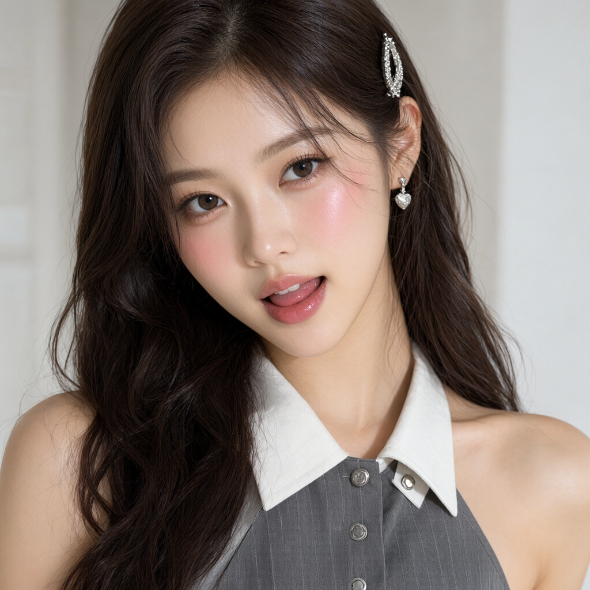
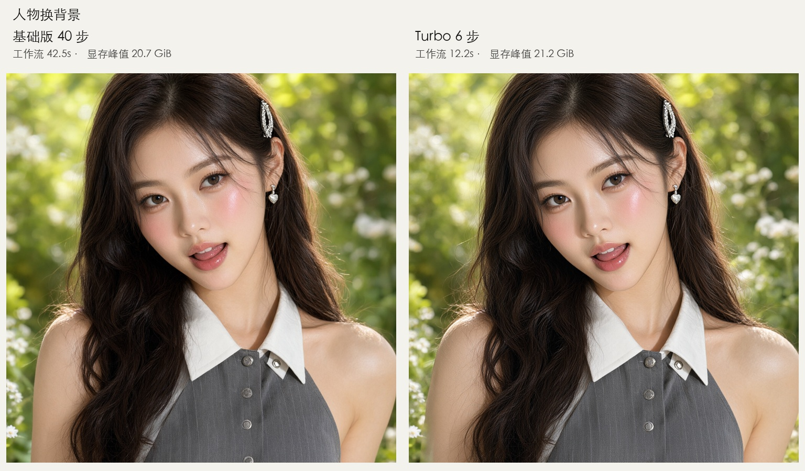
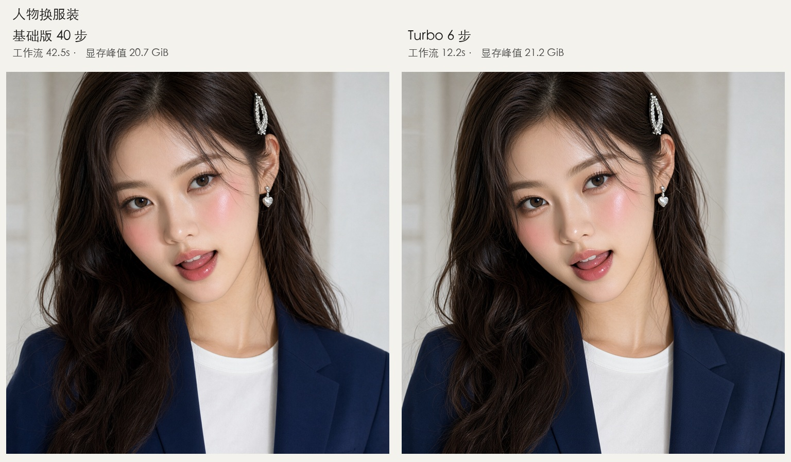

最近鬼哥在折腾一件挺有意思的事：以自己的 4090 机器为算力核心，在本地搭起一整套做口播视频的工作流和基础服务。语音生成、字幕处理、图像生成、人物口播视频，逐步接进同一个工作台，从一段文案和一张人物图，走到带声音、带字幕的视频。

先放一段已经做出来的成品：Diana 介绍 DI CLI 的口播。下面是带字幕的版本，约 12 秒，视频由 4090 上的 H3 生成。

<video controls playsinline preload="none" poster="diana-poster.webp" style="width:100%;max-width:512px;height:auto;border-radius:12px;">
  <source src="diana-talk.mp4" type="video/mp4">
  你的浏览器不支持内嵌视频，可以<a href="diana-talk.mp4">下载 Diana 口播视频</a>观看。
</video>

[下载 Diana 口播视频](diana-talk.mp4)

我想给后面自己做视频剧先铺好路。人物形象、配音、场景和口播都能在本地反复试，就不用每生成一版都去买云端额度了。机器已经在手，日常试错主要花的是电费和等待时间，改台词、换造型时也能更放得开。

当然，一段口播离一部视频剧还有距离，角色一致性、镜头衔接、表演和剪辑都要继续磨。这套基础服务先把素材生成串起来，后面才有条件一集一集往下做。

这篇先聊其中的**生图部分**。语音、字幕和视频的部署细节留待后面展开；眼下要解决的问题是：给人物换造型、做场景素材时，能不能更快拿到一张可用的图？

## 从一张咖啡海报开始

一张咖啡海报，左边画了四十步，右边只画了六步。把两张图并排放好，最先吸引我注意的，是它们都把“秋日限定 · 桂花拿铁”写对了。

左边的工作流用了 38.4 秒，右边用了 10.2 秒。杯子、拉花和叶片有变化，但如果只是想给一杯秋日咖啡做张海报，右边已经很有说服力。

这组结果让我想继续看下去：**生成快了将近四倍，省下的那些步骤，到底从画面哪里拿走了东西？**

我把 Qwen-Image-2.1 和 Viggle 的 Turbo 方案放到自己的 4090 机器上，跑了人像、中文海报、换背景、换衣服四组对比。一共八张图，先看实际效果，再决定值不值得接进本地工作台。

## 先认清这两位选手

说是“两种模型”，它们其实有很近的亲缘关系。

基础版用的是 **Qwen-Image-2.1 的 INT8 权重**，这次跑 40 步。Turbo 则在同一个基础模型上，加载 **Viggle v0.3 的六步蒸馏 LoRA，rank 128**，配合专用采样时间点运行。

可以把每一步理解成模型对画面的一次修正。蒸馏让模型学习用更少的修正走到一个可用结果。因此，要得到这次的六步效果，需要 Turbo 的适配权重和采样配置一起配合。直接把基础版的步数框改成 6，并不等于完成了这套配置。[Viggle 模型说明](https://huggingface.co/Viggle/Qwen-Image-2.1-viggle-turbo)给出了具体用法。

这轮两边都用相同提示词、seed 42、1024 × 1024 输出、CFG 1，并且关闭提示词增强。文生图用同样的文字，编辑任务用同一张参考图。每个场景各跑一次，所以这是一轮样片观察，还不足以给模型的整体能力排座次。

## 干活的还是那台 4090

这张照片之前放在[《桌面 AI Studio》](/p/desktop-ai-studio/)里。机器继续负责重推理，Mac 负责开发和整理结果。这次图像生成也交给它。

先把最容易误会的规格写在前面：**这张卡在系统里显示 49140 MiB 显存，约 48GB。** 读者如果拿普通 24GB 4090 对照，显存余量得另外算。

| 硬件 | 本次机器 |
| --- | --- |
| CPU | Intel Core i5-13600K，14 核、20 线程 |
| 系统内存 | 64GB，Linux 显示约 62 GiB |
| GPU | NVIDIA GeForce RTX 4090 |
| 显存 | `nvidia-smi` 显示 49140 MiB |

软件环境也列出来，方便以后对照：

| 软件 / 模型组件 | 本次配置 |
| --- | --- |
| 操作系统 | Ubuntu 24.04.3 LTS，x86_64 |
| NVIDIA 驱动 | 570.158.01 |
| Python | 3.12，独立虚拟环境 |
| PyTorch | 2.11.0+cu128，CUDA 12.8 运行时 |
| ComfyUI | 0.38.0，固定提交 `6b747c0428c34` |
| 主模型 | Qwen-Image-2.1，INT8 convrot |
| 文本编码器 | Qwen3-VL 8B，INT8 convrot |
| VAE | Qwen-Image-2.1，BF16 |
| Turbo 适配器 | Viggle v0.3，6-step LoRA，rank 128 |
| 注意力实现 | PyTorch SDPA；关闭可选的 kitchen INT8 attention |

主模型、文本编码器、VAE 和 LoRA 的权重文件合计约 18GB。这里的 INT8 指权重存储配置，不代表整个计算过程全部使用 INT8。

图像环境有独立的 Python 虚拟环境和 ComfyUI 副本，与现有 H3 视频服务共用 GPU 排队锁。一次图像任务结束，运行时退出并释放显存。八张图跑完后，显存占用回到了 15 MiB，H3 的健康检查也正常。

这个安排很适合我现在的用法：同一张卡轮流承担图像和视频任务，避免两个大任务一起上来争显存。

## 人像：第一处差别在脸上

第一组提示词要的是成年东亚女性、黑色齐肩发、米色亚麻外套、左侧柔和窗光，以及自然的皮肤纹理。

[基础版原尺寸图](portrait-base40.webp) · [Turbo 原尺寸图](portrait-turbo6.webp)

两张图的构图、衣服和光线都很接近。缩小看，六步版没有出现明显的结构崩坏，也没有突然换一种摄影风格。

放大脸部，差别就有了：基础版的眼周、面颊纹理更明显，Turbo 的皮肤更平滑，五官的局部形态也有细微变化。

如果用来试头像方向或看服装配色，我会愿意先用 Turbo。如果想要更有年龄感、更强调皮肤质地的人像，基础版这张更接近提示词里“自然纹理”的要求。这里的平滑是否算损失，取决于你想要什么样的照片。

这一组很能说明问题：六步没有把画面压缩成半成品，但它改变了细节的表达。

## 中文海报：这次六步没有把字写坏

开头那张海报指定了四行文字：

> 慢下来，喝杯咖啡  
> 秋日限定 · 桂花拿铁  
> 每日现磨，新鲜烘焙  
> 营业时间 09:00—21:00

[基础版原尺寸图](poster-base40.webp) · [Turbo 原尺寸图](poster-turbo6.webp)

两边都把这四行文字画得正确、可读。版式也接近：大标题、品名、咖啡主体、小字说明，各自待在该待的位置。

这比“画了一杯好看的咖啡”更让我在意。做中文配图，经常卡在最后几个字上：主体都很漂亮了，标题偏偏多一笔少一画，还得再抽一张。这一组里，六步版保住了文字，省下的等待才真正有用。

当然，四行短句还难不倒所有模型的边界。长段落、密集小字、复杂表格，这次都没跑，不能从一张咖啡海报推导出“中文随便写”。

至于杯形、拉花和叶片的差别，两边各有自己的画法，我没有看到足以让我为了这张海报坚持等待四十步的优势。

## 换背景：花园来了，人也被轻轻改了一下

后两组用的是现有工作台里的 girl-avatar。先放参考图，方便看清到底保留了什么。

第一项要求是把背景换成有阳光、虚化的花园，同时保留人物。

[基础版原尺寸图](background-base40.webp) · [Turbo 原尺寸图](background-turbo6.webp)

两边都完成了花园背景。发夹、心形耳饰、白领灰衣这些显眼特征也都留住了，乍看很适合继续拿去做人物素材。

但对着参考图看，会发现两版都稍微放宽了取景范围，展示出更多衣服和躯干，皮肤和发丝也有局部重绘。Turbo 的对比感更强一些，细节更平滑。

**“人物看起来还是她”和“人物像素完全不动”，是两种不同的要求。** 这一组满足了前者，没有做到后者。需要严格保留原片时，仍然要考虑蒙版、抠图和合成流程，不能把一句“只换背景”当成锁定按钮。

值得注意的是，基础版四十步也有这个问题。等得久一点，并没有自动换来像素级的编辑边界。

## 换衣服：六步已经能拿来试造型

最后一组，把原来的服装改成藏蓝色西装，里面穿白色圆领上衣。

[基础版原尺寸图](outfit-base40.webp) · [Turbo 原尺寸图](outfit-turbo6.webp)

两边都完成了换装，脸、表情、发型和饰品整体接近参考图。西装的领口、面料和局部阴影各有差别，皮肤与发丝同样存在重绘。

如果我要为工作台的人物试几个造型，这个结果已经足够让我继续往下做。先看看藏蓝西装是否合适，再决定换成衬衫还是针织衫，十几秒拿到一张图，会更愿意多试几次。

不过，“更愿意多试”是我的使用判断。这里没有做多 seed 的稳定性统计，也没有测试连续编辑几轮后人物会漂移多少。

## 到底省了多少时间？

四组任务的数据放在一起：

| 场景 | 基础版 40 步 | Turbo 6 步 | 工作流加速比 | 显存峰值：基础 / Turbo |
| --- | ---: | ---: | ---: | ---: |
| 人像生成 | 38.44 秒 | 10.15 秒 | 3.79× | 15.99 / 16.58 GiB |
| 中文海报 | 38.43 秒 | 10.15 秒 | 3.78× | 15.99 / 16.58 GiB |
| 人物换背景 | 42.50 秒 | 12.19 秒 | 3.49× | 20.74 / 21.21 GiB |
| 人物换服装 | 42.52 秒 | 12.18 秒 | 3.49× | 20.71 / 21.24 GiB |

这里的时间包含模型加载、文本编码、采样和 VAE 解码，是完整工作流耗时。加上独立运行时启动，基础版每张约 **43～48 秒**，Turbo 约 **15～17 秒**。如果以后改成长驻服务、复用已加载模型，还需要重新测量，不能直接拿这张表当服务延迟。

四十步变成六步，步数少了约 6.7 倍，整个流程只加速约 3.5～3.8 倍，也很好理解：读模型、理解提示词、解码图片这些工作仍然要做，少采样并不会把它们一起省掉。

另一个容易忽略的地方是显存。Turbo 在这四组里反而略高一点，最高约 21.24 GiB。它加快了生成，但没有在本轮测量中带来显存节省。

这个峰值看起来落在 24GB 以内，我也不会据此承诺普通 24GB 4090 能照搬配置稳定运行。这里用的是 48GB 卡，而且显存数据是每两秒采集一次的全卡占用，可能漏掉短暂尖峰。

## 我会怎么把它放进工作台

看完这四组图，我倾向于把 **Turbo 六步做成快速模式，基础版四十步保留作对照选项**。

人像试方向、海报试布局、人物试服装，先用六步出结果。碰到皮肤质地、细小文字或复杂编辑这些值得较真的地方，再拿基础版比较。两种配置生成的细节会不同，基础版也需要逐张判断。

目前做到的是独立命令行评估，图像 API 和 WebUI 还没有接入。这次部署复用了机器上已有的 H3 源码与 CUDA 依赖，并没有完成一台全新 Ubuntu 从 checkout 开始的一键安装验收。

下一轮真正值得加的，是更多随机种子、密集中文、多参考图和更高分辨率。它们会决定六步版能走多远。这四组样片已经回答了一个更小、也更实际的问题：它值得继续接进来试用。

回到开头那杯咖啡。如果六步已经把布局、杯子和四行字交代清楚了，我更愿意把省下的时间用来改一句标题、换一种配色。那句“慢下来，喝杯咖啡”，倒是不必让显卡也照着执行。

## 本轮参数备忘

实测日期为 2026 年 10 月 5 日。基础版使用 Euler / simple、40 步；Turbo 使用独立、未合并的 LoRA，强度 1.0，以及作者提供的六步 sigma 配置。两边均使用 INT8 主模型与文本编码器、BF16 VAE、CFG 1，关闭提示词增强。

每张图启动新进程，但没有清空操作系统文件缓存；每个场景每种配置只有一次记录，表中没有多次平均。这套 ComfyUI 配置也不等同于逐项复刻作者的 Diffusers 基准。

正文并排图用于快速浏览，图下的原尺寸链接为原始 PNG 无损转换的 WebP，适合放大看细节。主机照片复用本人此前文章中的实拍图。

## 参考资料

- [Viggle：Qwen-Image-2.1-viggle-turbo 模型与用法](https://huggingface.co/Viggle/Qwen-Image-2.1-viggle-turbo)
- [Qwen-Image-2.1 官方模型](https://huggingface.co/Qwen/Qwen-Image-2.1)
- [Comfy-Org：Qwen-Image-2.1 权重](https://huggingface.co/Comfy-Org/Qwen-Image-2.1)
- [ComfyUI 官方 Qwen Image 2.1 文生图工作流](https://github.com/Comfy-Org/workflow_templates/blob/main/templates/image_qwen_image_2_1_t2i.json)
- [鬼哥：一张 4090 跑 Gemma4 26B](/p/ollama-local-dev/)

模型页面标注 Qwen Research 许可证；商用前请另行确认对应权重与适配器的许可条件。
