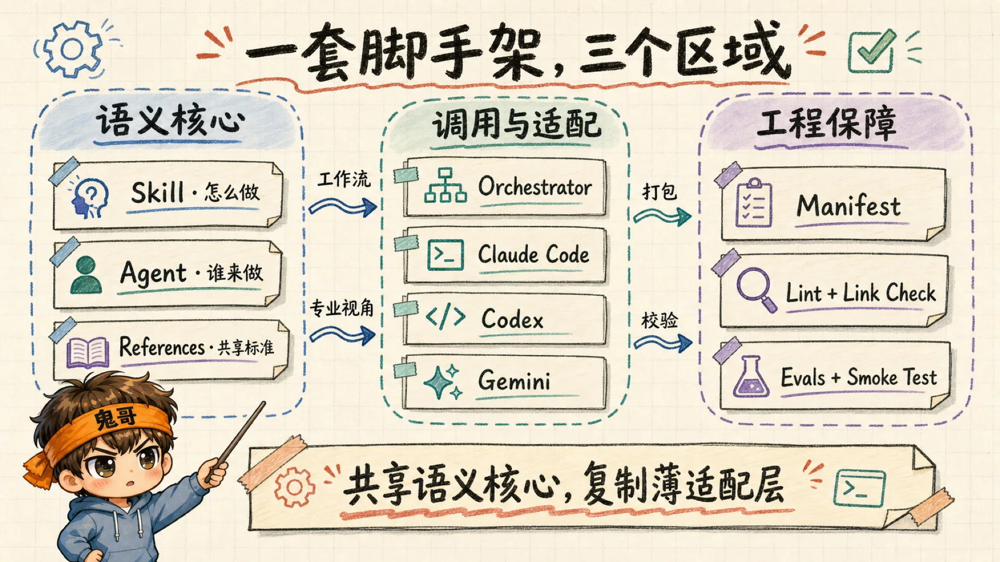
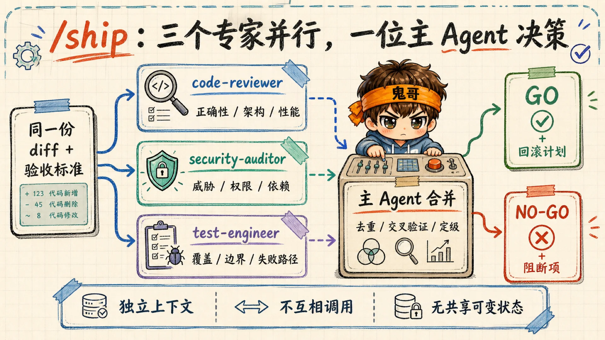

很多团队做第一套 Skill 仓库时，目录通常很快就长成这样：十几个 Markdown，名字都很专业，内容也都像模像样。真正使用两周后，问题开始出现：有的规则每轮都加载，有的永远触发不了；两个“专家”互相转述，token 花了两遍，结论反而少了一层；换到另一个 Coding Agent，又得复制一套提示词。

这不是 Prompt 写得不够好，而是项目没有分层。

我最近沿着一段关于 Claude Code sub-agents 的讨论，重新拆了一遍 Addy Osmani 的 [agent-skills](https://github.com/addyosmani/agent-skills) 项目。它最值得借鉴的，并非某一份代码评审提示词，而是把一组自然语言指令做成了工程资产：能被发现、能被调用、能被组合、能被覆盖，还能被自动检查。

这篇文章就做一件事：以它为样板，搭一套自己的 Skill + Agents 项目脚手架。

> 我以前写过 [架构拆解](/p/agent-skills-architecture/) 和 [项目参考手册](/p/agent-skills-handbook/)，重点是“这个项目为什么这样设计”。本文换一个方向：假设现在要从零建自己的仓库，第一批目录与验证门应该怎样落下去。

本文核对的是 `agent-skills` 2026 年 8 月 14 日的 `0.6.7` 版本：仓库包含 24 个 Skills、4 个 Agents 和 8 个 Claude lifecycle commands。项目仍在快速变化，具体字段与安装命令请以文末官方资料为准。

## 先分清三件事：怎么做、谁来做、何时组合

`agent-skills` 在 `docs/agents.md` 里给出了一个非常实用的三层模型：

| 层 | 回答的问题 | 例子 | 主要产物 |
|---|---|---|---|
| Skill | 怎么做 | `code-review-and-quality` | 步骤、约束、验收条件 |
| Agent / Persona | 谁来做 | `code-reviewer` | 专业视角、工具权限、输出格式 |
| Command / Orchestrator | 何时及如何组合 | `/review`、`/ship` | 确定性入口、并行编排、结果合并 |

这个区分看似是命名问题，实际决定了整个项目会不会失控。

Skill 不应该只是“你要认真检查安全问题”这种知识卡片。它更像一份可执行 SOP：什么时候触发，按什么顺序行动，哪些步骤不能跳过，最后拿什么证据证明任务完成。

Agent 也不该是“精通前后端、测试、安全、产品与运维的超级专家”。它需要一个稳定视角。例如 `security-auditor` 只负责威胁建模与漏洞审计，`test-engineer` 只负责测试策略与覆盖缺口。角色越单一，输出越容易预测，也越容易被别的流程复用。

编排入口则解决确定性问题。用户输入 `/ship`，不是让模型临场猜测该做什么，而是加载一份预先写好的编排剧本：并行启动哪些专家、分别检查什么、如何合并报告、什么条件必须判定为 NO-GO。

可以把这三层记成一句话：**Skill 是工艺，Agent 是工位，Orchestrator 是流水线。** 把三者写进同一个大 Prompt，就相当于把操作手册、岗位说明和生产调度贴在同一张纸上——不是不能运行，只是出问题时很难知道该改哪一段。



## 但别照抄三层：今天还需要“包装层”和“验证层”

如果只看概念，三层已经够清楚；如果真要做一个可发布的仓库，还差两层。

第一层是平台包装。不同 Agent Harness 的发现规则并不一致。Claude Code 能识别插件根目录的 `skills/`、`agents/`、`hooks/`，也继续兼容 `commands/`；Codex 版 `agent-skills` 则通过 `.codex-plugin/plugin.json` 指向同一份根目录 `skills/`。项目文档也明确说明：当前 Codex 集成复用的是 Skills，Claude 的 slash commands、personas 与 hooks 仍属于 Claude Code 侧能力。

第二层是验证。自然语言文件同样会出现“编译错误”：frontmatter 缺字段、目录名与 `name` 不一致、引用路径失效、多个 manifest 版本不一致、命令引用了不存在的 Skill。`agent-skills` 把这些检查放进 `scripts/` 和 `evals/`，这一步把“提示词收藏夹”与“可维护项目”真正区分开来。

因此，一套更完整的结构其实是五层：

```text
语义核心
├── skills/          # 可复用工作流：怎么做
├── agents/          # 专业执行者：谁来做
└── references/      # 多个工作流共享的检查表与标准

调用与适配
├── .claude/commands/    # Claude Code 的编排入口（兼容形式）
├── .claude-plugin/      # Claude 插件元数据与市场清单
├── .codex-plugin/       # Codex 插件清单
└── .gemini/commands/    # 其他 Harness 的薄适配

工程保障
├── scripts/         # lint、链接、版本与结构校验
├── evals/           # 触发准确率与行为评测
└── .github/workflows/   # 安装、校验与发布门禁
```

这里最重要的设计判断是：**共享的是语义核心，复制的是薄适配层。** 如果你在 Claude、Codex、Gemini 目录里各维护一份完整安全规范，三个月后一定会得到三个略有不同的“唯一真相”。

## 第一步：从最小可运行骨架开始

不要上来就造二十个 Skill。先选择一个高频、边界清楚、结果容易验证的场景，例如“发布前评审”。最小骨架只需要这些文件：

```text
my-agent-kit/
├── .claude-plugin/
│   ├── plugin.json
│   └── marketplace.json
├── skills/
│   └── code-review/
│       └── SKILL.md
├── agents/
│   └── code-reviewer.md
├── .claude/
│   └── commands/
│       └── review.md
├── scripts/
│   └── validate-skills.js
├── README.md
└── LICENSE
```

Claude Code 官方插件文档有一个容易踩中的规则：`.claude-plugin/` 里只放 `plugin.json` 等元数据；`skills/`、`agents/`、`hooks/` 必须位于插件根目录。把所有东西都塞进 `.claude-plugin/`，目录看起来很整齐，Claude Code 也会很整齐地假装没看见。

一个最小 manifest 可以这样写：

```json
{
  "name": "my-agent-kit",
  "version": "0.1.0",
  "description": "Reusable engineering workflows and specialist agents",
  "author": { "name": "Your Team" },
  "license": "MIT"
}
```

默认目录能被自动发现时，不必急着把每条路径都写进 manifest。脚手架的第一原则不是“配置齐全”，而是“每个配置都有必要”。

## 第二步：把 Skill 写成有退出条件的工作流

一个 Skill 至少需要 `name` 和 `description`：

```markdown
---
name: code-review
description: Reviews code changes for correctness, maintainability, security, and performance. Use before merging a pull request or releasing a change.
---

# Code Review

## When to use
- Before merge
- After a bug fix
- After an agent implements a feature

## Workflow
1. Read the task or spec.
2. Read tests before implementation.
3. Inspect the diff across five review axes.
4. Run the relevant verification commands.
5. Report findings by severity with file and line references.

## Verification
- [ ] Every blocker includes evidence and a concrete fix.
- [ ] Test and build status are reported.
- [ ] Uncertainty is labeled instead of guessed.
```

`description` 不是摘要，而是路由契约。Claude Code 会结合用户任务、当前上下文与 description 决定是否加载 Skill。写得太宽，Skill 会到处抢活；写得太窄，它会成为一份只有作者记得存在的文档。

`agent-skills` 的做法值得直接借鉴：description 同时写清“做什么”和“什么时候使用”，正文再写完整流程；把长清单移到 supporting files；尽量让 `SKILL.md` 保持聚焦。官方文档把这种加载方式称为按需加载：启动时主要暴露名称和描述，真正调用时再加载正文与相关资源。对于装了几十个 Skill 的环境，这不是洁癖，而是上下文预算。

我还建议给每个工作流增加两类内容：

- 失败时 Agent 最常找的借口，例如“改动很小，不需要测试”；
- 可以被外部观察的退出条件，例如测试输出、构建结果、截图或报告路径。

好的 Skill 不是让模型“更懂道理”，而是让它更难绕过流程。

## 第三步：让 Agent 只拥有一个视角

Agent 文件同样由 YAML frontmatter 和 Markdown 正文组成：

```markdown
---
name: code-reviewer
description: Senior reviewer for correctness, readability, architecture, security, and performance. Use for a focused review before merge.
tools: Read, Grep, Glob, Bash
model: sonnet
---

# Senior Code Reviewer

You review the requested change from one perspective: code quality.

## Output
- Verdict: APPROVE or REQUEST CHANGES
- Critical issues
- Required changes
- Suggestions
- Verification story

## Boundaries
- Do not implement fixes unless explicitly asked.
- Do not invoke another persona.
- State uncertainty and request evidence when needed.
```

这里有三个设计点。

第一，`description` 决定“什么时候派它上场”，正文决定“上场之后怎么工作”。不要把关键执行规则只写进 description，也不要指望正文能挽救一份含糊的 description。

第二，权限应当服从职责。一个只负责评审的 Agent 通常不需要 Edit 或 Write。限制工具不只是安全措施，也是在减少角色漂移：当手里只有锤子时什么都像钉子；当手里同时有读、写、部署和发消息工具时，评审员很快会产生创业冲动。

第三，插件提供的 Agent 和项目级 Agent 使用相同的基本定义格式，但能力范围与优先级并非完全相同。Claude Code 当前的优先级是：组织托管配置、`--agents`、项目 `.claude/agents/`、用户 `~/.claude/agents/`、插件 `agents/`。项目定义可以覆盖同名插件 Agent；而出于安全原因，插件 Agent 不支持 `hooks`、`mcpServers`、`permissionMode` 等字段。

这反而形成了一个很好的产品机制：插件给出安全的默认角色，团队在项目中覆盖它，个人还能保留自己的通用角色。脚手架不必预见所有业务，只要设计好覆盖点。

## 第四步：把编排写成“显式剧本”

单一 Agent 适合直接调用。多个 Agent 只有在任务真正独立时，才值得并行 fan-out。

`agent-skills` 的 `/ship` 是一个很好的例子：主 Agent 针对同一份 diff，同时派出 `code-reviewer`、`security-auditor` 和 `test-engineer`。三个子 Agent 互不依赖，各自在独立上下文里生成报告；等它们返回后，主 Agent 去重、提升严重级别，并输出 GO / NO-GO 与回滚方案。

```text
                       ┌─ code-reviewer ────┐
/ship → parallel fan-out├─ security-auditor ├→ main agent merge → GO / NO-GO
                       └─ test-engineer ────┘
```



这个模式成立，需要同时满足四个条件：

1. 子任务之间没有顺序依赖；
2. 不写同一份可变状态；
3. 每个 Agent 提供的是不同种类的信息；
4. 合并工作足够小，适合留在主上下文完成。

如果步骤有明确依赖，例如 `/spec → /plan → /build → /test`，不要为了显得“Agentic”而强行并行。`agent-skills` 选择让用户逐步触发生命周期命令，保留每一步之间的人类判断。流水线不是越自动越高级；错误方向跑得更快，通常只是更早抵达返工现场。

还有一个常见反模式：创建 `meta-orchestrator` Agent，职责只是判断该叫哪个 Agent。它没有领域价值，却多了一次上下文转述与信息损失。路由能写进入口 Skill，就不要再招聘一位“负责转接电话的 AI 经理”。

需要特别更新一个来自早期实践的认知：在当前 Claude Code 中，自定义 command 已并入 Skill 机制。`.claude/commands/review.md` 仍然兼容，也会生成 `/review`；但新项目更适合优先用 `skills/<name>/SKILL.md`，因为它支持 supporting files、自动触发与更完整的 frontmatter。概念上仍然需要“编排入口”，实现上未必非要保留独立 commands 层。

## 第五步：为不同平台写薄适配，不复制核心

如果目标只支持 Claude Code，到这里已经可以工作。如果希望项目同时服务 Codex、Gemini CLI 或其他 Harness，需要先接受一个现实：**Skill 的可移植性通常高于 Agent 编排的可移植性。**

`agent-skills` 当前版本就是很诚实的示范：同一份 `skills/` 被 Claude Code 与 Codex 复用；`.codex-plugin/plugin.json` 只负责告诉 Codex 到哪里发现它们。Claude 专属的 agents、slash commands 和 hooks 没有假装“一次编写，到处运行”。其他平台有自己的 command 文件与安装说明。

建议把跨平台边界写成一张能力矩阵：

| 能力 | 共享语义核心 | 平台适配 |
|---|---|---|
| 工作流步骤与验收标准 | `skills/` | 通常可直接复用 |
| 共享检查表 | `references/` | 注意安装后的相对路径 |
| Persona 正文 | `agents/` | 按 Harness 的 Agent 机制注册 |
| 并行与结果合并 | 编排意图可共享 | 工具名、并发方式需适配 |
| 安装与发现 | 无 | manifest、marketplace、命令格式 |
| hooks / MCP / 权限 | 原则可共享 | 配置 schema 基本各不相同 |

跨平台设计的目标不该是文件树完全对称，而是行为语义尽量一致。能复用 80% 的核心、允许 20% 的适配，比三套看起来相同、实际逐渐漂移的实现可靠得多。

## 第六步：把 Markdown 当代码测试

脚手架至少应有四类静态检查：

```text
结构检查：skills/<name>/SKILL.md 是否存在
Schema 检查：frontmatter、必填字段、合法字段
引用检查：相对链接、脚本与 references 是否存在
一致性检查：多个 manifest 的名称与版本是否同步
```

随后再加行为评测。每个 Skill 准备三组 case：

- 应触发：例如“帮我审查这次认证改动”；
- 不应触发：例如“解释一下这段代码做什么”；
- 边界 case：例如“只改了一行 README，需要完整发布审计吗？”

行为评测不必一开始就追求复杂分数。先记录三个结果已经很有价值：选对了哪个 Skill、有没有执行关键步骤、是否产出了要求的证据。等 case 多了，再统计触发准确率、漏执行率和不必要的 Agent 调用成本。

仓库还应提供最小安装冒烟测试：从干净环境安装插件，列出被发现的 Skills 与 Agents，调用一个最小示例，确认输出结构。很多项目的 CI 会认真检查 JSON 能否解析，却从没验证用户安装后是否真的看得到组件。这和餐厅通过了厨房验收但忘了留门，属于一种很工程化的幽默。

## 一套可以直接执行的开发顺序

如果现在开始搭自己的项目，我会按下面的顺序推进：

1. 选一个高频场景，写出输入、输出与完成标准；
2. 先实现一个 Skill，确保单独调用能稳定完成任务；
3. 当确实需要独立视角或上下文隔离时，再增加一个 Agent；
4. 只有多个独立视角需要合并时，才增加 fan-out 编排；
5. 增加 manifest 与 marketplace，把本地目录变成可安装产品；
6. 增加 lint、引用校验和安装冒烟测试；
7. 用真实失败案例补 evals，而不是凭想象扩写 Prompt；
8. 最后再做跨平台适配，并明确哪些能力无法等价迁移。

每新增一个组件，都应该能回答三个问题：它消除了哪段重复说明？它带来了哪种以前没有的专业判断？如果它失效，哪项测试会报警？三个问题都答不上来，先别加。

## 最后的检查表

发布第一版前，可以用这份清单收口：

- [ ] 每个 Skill 都写清 what + when，而非只写主题名称；
- [ ] 每个工作流都有可观察的退出条件；
- [ ] 每个 Agent 只有一个主要角色和一种输出格式；
- [ ] 只给 Agent 完成职责所需的工具；
- [ ] 编排只用于真正独立的并行任务；
- [ ] 主 Agent 负责合并，Persona 不互相转述；
- [ ] 共享内容只有一份源文件，平台目录保持轻薄；
- [ ] 项目级覆盖策略与优先级有文档说明；
- [ ] frontmatter、引用、manifest 和版本经过自动校验；
- [ ] 至少有应触发、不应触发、边界三类评测；
- [ ] 在干净环境完成过一次安装与调用冒烟测试。

回头看最开始那堆 Markdown，问题从来不在数量。真正的分界线是：它们能否形成清楚的职责边界、稳定的发现机制、可控的编排关系和可重复的验证结果。

**脚手架的价值，不是帮你更快地产生 Prompt，而是让团队可以像维护代码一样维护 Agent 的行为。**

这也是 `agent-skills` 最值得借鉴的地方：它没有试图造一个无所不能的超级 Agent，而是把经验拆成工艺、工位、入口、包装和质检。所谓 Agent 工程化，大概就是从“这段提示词挺好用”，走到“这套系统出了问题，我知道该改哪一层”。

## 参考资料

- [Claude Code：Create custom subagents](https://code.claude.com/docs/en/sub-agents)
- [Claude Code：Extend Claude with skills](https://code.claude.com/docs/en/slash-commands)
- [Claude Code：Plugins reference](https://code.claude.com/docs/en/plugins-reference)
- [addyosmani/agent-skills](https://github.com/addyosmani/agent-skills)
- [agent-skills：Agent Personas](https://github.com/addyosmani/agent-skills/blob/main/docs/agents.md)
- [agent-skills：Skill Anatomy](https://github.com/addyosmani/agent-skills/blob/main/docs/skill-anatomy.md)
- [本文起点：Sub-agents 架构与实现机制对话](https://claude.ai/share/75dd4f98-3c9a-4e68-bcff-5d417bae2535)
