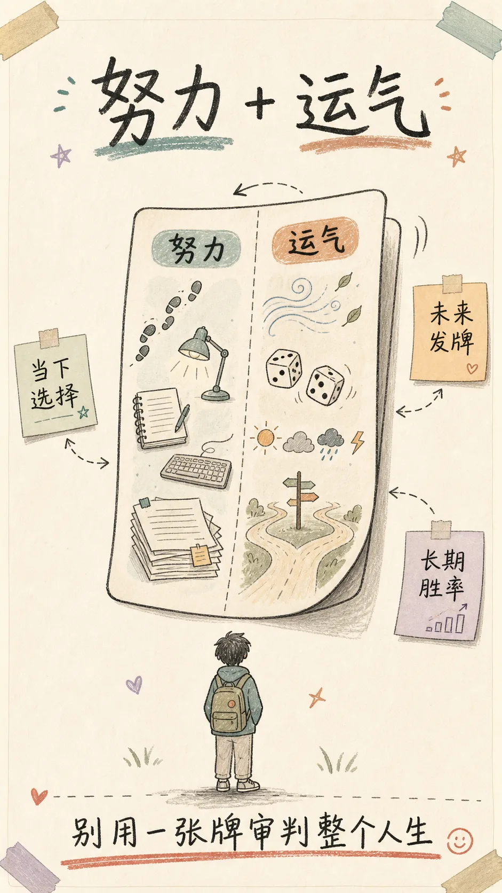
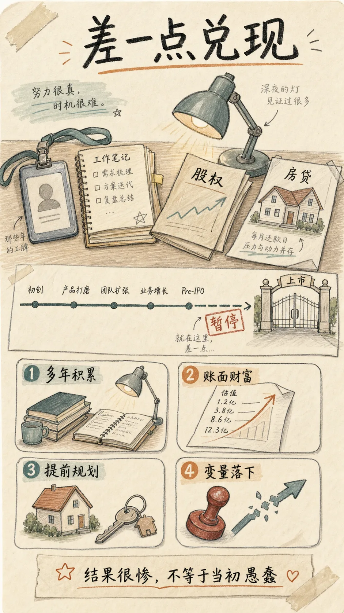
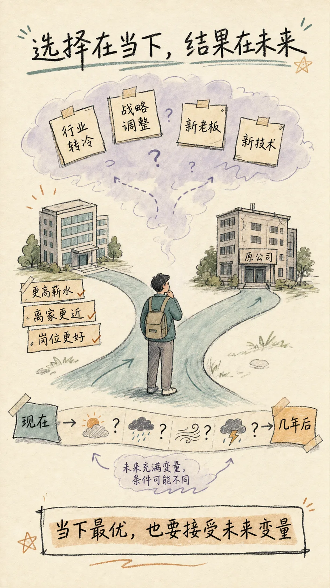
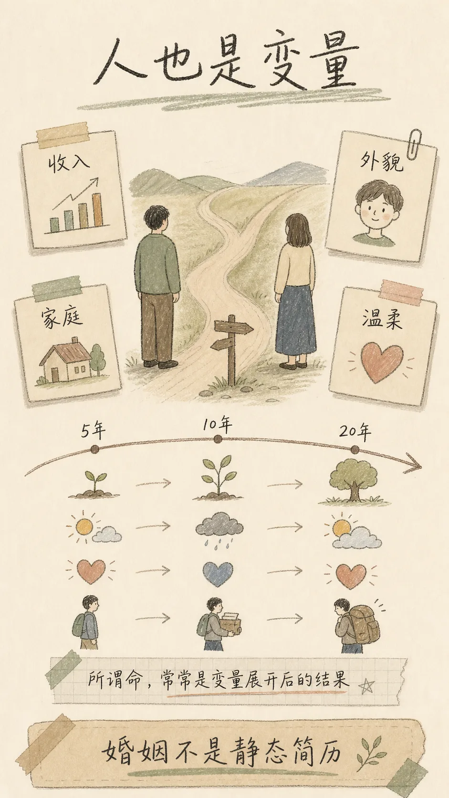
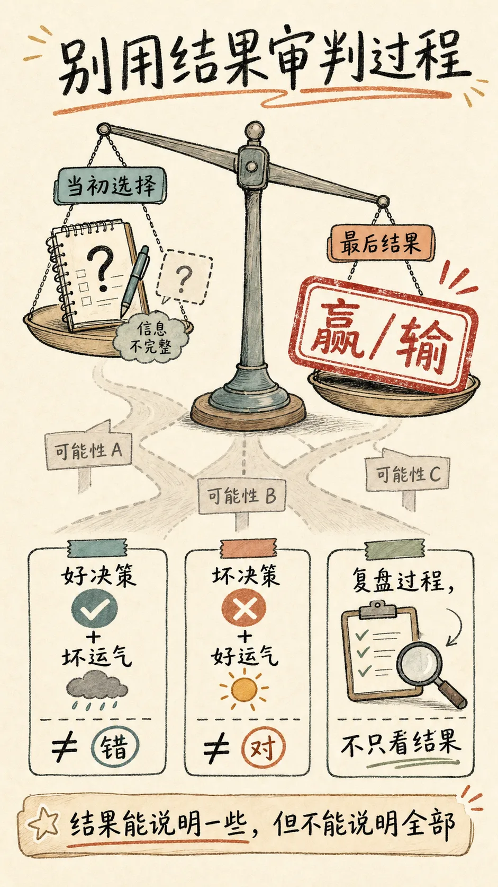

很多人喜欢在事后评价别人的人生：

他当年太贪了，她当初看错人了，那次跳槽太蠢了。

可如果你真的回到他们做选择的那一刻，你未必会比他们选得更好。



---

## 年轻时，我们太相信“选对”

年轻的时候，我很相信选择。

选对公司，选对赛道，选对伴侣，选对城市，人生就会一路向上。

后来见的人和事多了，才发现人生最残酷的地方不是你不会选，而是：**你选的时候，未来还没有发牌。**

你只能拿着当下的信息，判断一个看起来更高概率的方向。至于几年后政策怎么变，行业怎么变，公司怎么变，人怎么变，没有人能提前看到全部底牌。


> 结果只是技能和运气混在一起之后，最终翻出来的那张牌。

如果把它放到普通人的人生里，我更愿意把“技能”换成一个更朴素的词：

**人生，只是努力和运气共同作用以后，翻出的那张牌。**

这句话听起来有点凉，但我觉得它不是宿命论。它只是提醒我们：不要用一张已经翻开的牌，去羞辱一个当初认真下注的人。

---

## 第一张牌：差一点财务自由的人

我认识一些曾经在大厂工作过的人。

他们不是投机者，也不是赌徒。他们只是和很多人一样，在一个高速增长的时代里，认真工作，努力积累，把自己最好的几年放进一家公司。

他们熬过项目，熬过绩效，熬过组织调整，也拿到了一些公司股票。

在某个时刻，财富兑现看起来近在眼前。按照当时市场给出的估值，如果一切顺利上市，很多人的账面财富会发生巨大变化。不是多发一笔奖金，而是人生阶层意义上的变化。

于是，有人提前改善生活，贷款买了更大的房子，开始规划上市之后的现金流。站在今天看，你当然可以说：“太乐观了，太激进了。”

但如果你站回当时的现场，这个判断真的那么荒唐吗？

那不是凭空幻想。那是多年辛苦工作换来的股权，是公司业务增长带来的预期，是市场估值给出的信号，是周围人都能看到的路径。

他们不是在草地上捡了一张彩票。他们是靠自己的努力，终于坐到了牌桌前。

只是最后，牌没有按他们期待的方式翻开。

上市暂停，预期中的财富没有落地，债务却真实地落在身上。原本以为是人生加速器的选择，忽然变成了很重的负担。

这时候，旁观者最容易说风凉话：

```text
谁让你提前消费？
谁让你那么相信估值？
谁让你觉得财富一定会兑现？
```

这些话不能说完全没道理。但它们少了一点同理心，也少了一点对不确定性的敬畏。

因为很多人不是不知道风险，而是在当时所有信息汇总之后，认为那是一个值得承担的风险。

他们努力过，判断过，承受过压力，也付出过时间。只是运气，或者说时代和政策的合力，在那一瞬间没有站在他们一边。

**结果很惨，不代表当初的判断就一定愚蠢。**



---

## 第二张牌：跳槽以后，世界变了

换工作也是一样。

一个人拿到一个新 offer：薪水更高，离家更近，平台看起来更大，岗位听起来也更有发展空间。

如果你问十个理性的人，大多数人都会说：这当然值得考虑。

你权衡了收入、通勤、成长空间、团队背景、行业前景。你没有拍脑袋，也不是被一时情绪推着走。你只是基于当下掌握的信息，做了一个看起来更优的选择。

但未来不是静止的。

接下来几年，行业可能突然转冷，新公司战略可能调整，老板可能换人，团队文化可能和面试时完全不一样。甚至一个新技术的出现，就可能把这家公司原来的商业模式打穿。

而你离开的那家公司，反而活得好好的。

这时候，外人又会开始总结：

```text
他当初太短视了。
他只看薪水。
他没有看懂长期趋势。
```

可问题是，所谓“长期趋势”，很多时候是事后才变得清晰的。

人在做选择时，面对的是当下的信息；结果发生时，面对的却是未来的世界。

这两个世界中间隔着时间。而时间里面，藏着太多没人能提前掌握的变量。

所以现实生活不像国际象棋。国际象棋的棋盘是公开的，你的棋子、对方的棋子、所有规则都摆在那里。输了，通常可以回头找到是哪一步算错了。

但人生更像一局不完整信息的牌局。

你看得见自己手里的牌，也看得见桌面上一部分公共牌，但你看不见别人的底牌，更看不见下一张会翻出什么。

你能做的，不是保证结果一定赢，而是在信息不完整的情况下，尽量做一个更高质量的决定。

**选择发生在当下，命运却在未来开奖。**



---

## 第三张牌：婚姻里，人也是变量

择偶可能是最典型，也最让人唏嘘的一张牌。

年轻时选择伴侣，我们当然会看条件。

收入更高，发展更好，长相更出众，家庭条件更稳，情绪价值更足，这些都是真实存在的指标。没有必要假装人完全不看这些。

问题是，婚姻不是一张静态简历。

你选择的不是一个固定资产，而是一个会变化的人。你自己也会变，你们所处的环境也会变。

现在看起来温柔体贴、对你百依百顺的人，将来会不会变得冷漠无情、毫无担当？现在看起来条件一般、前途普通的人，将来会不会因为持续努力，变成一个稳定、上进、有责任感的好伴侣？

谁也不知道。

于是很多人回头看自己的婚姻，最后只能叹一句：这是命。

我现在越来越觉得，很多时候，所谓“命”，不是一个神秘力量在天上安排剧本。它只是我们对一组复杂变量的朴素命名：

```text
人会变。
环境会变。
关系会变。
欲望会变。
责任感会变。
连我们自己，也会变。
```

当这些变量在十年、二十年里慢慢展开，最后得到的结果，常常超出当初任何一个人的计算能力。

所以，不要轻易嘲笑别人“当初瞎了眼”。

很多选择，站在当时看，并没有那么离谱。只是后来翻出来的那张牌，和他以为的不一样。



---

## 结果不是努力的判决书

有这么一个一个公式：

```text
结果 = 技能 + 运气
```

放到普通人的人生里，我想把它改成：

```text
结果 = 努力 + 运气 + 时代
```

努力当然重要。

没有努力，你可能连牌桌都上不了。你进不了好公司，拿不到好机会，遇不到更大的选择，也没有资格分享时代的红利。

但努力不是兑换券。

它不能保证你一定发财，不能保证你跳槽一定成功，不能保证你选的人一生不变，不能保证你刚好站在政策、周期和时代风向都配合你的那个位置。

这也是很多人成年以后最难接受的一件事：

**我们从小被教育，只要努力就会有回报。可真实世界更准确的说法是，努力会提高你获得好结果的概率，但它不承诺每一次都兑现。**

这不是鸡汤，也不是丧气话。

它只是在提醒我们：世界并不围绕个人努力精密结算。

有些人努力了很多年，最后被一个政策转向打乱节奏；有些人只是赶上了一个风口，短短几年就获得了超出能力本身的回报。

有些人做了一个当下看起来很稳妥的选择，后来遇到行业崩塌；有些人做了一个看起来普通的选择，却刚好被时代抬了一把。

如果你只看结果，就会很容易误判人。

成功的人，未必每一步都高明。

失败的人，也未必每一步都愚蠢。

---

## 为什么我们总想找一个确定答案

人很难接受随机性。

因为承认运气，就等于承认很多事情不是完全可控的。而不可控，会带来很深的不安全感。

所以我们的大脑特别喜欢给结果找原因。

别人发财了，我们说他有眼光。

别人亏了，我们说他太贪。

别人婚姻好，我们说他会选人。

别人婚姻坏，我们说他当初看错了。

这种解释有时候是对的，但经常太粗暴。

它把一个漫长过程里的努力、时代、环境、关系、政策、性格变化、偶然事件，压缩成一句特别省事的话：

```text
他活该。
他厉害。
他命好。
他命差。
```

这就是结果偏见。

我们用最后发生的结果，倒推当初决策的质量。赢了，就觉得当初英明；输了，就觉得当初愚蠢。

但真实世界不是这么简单。

酒驾回家没出事，不代表酒驾是好决策。

绿灯正常通行被闯红灯的车撞了，也不代表绿灯通行是坏决策。

同样，一个人押中了时代，不代表他所有判断都值得学习；一个人被时代错杀，也不代表他当初就是蠢。

**结果能说明一些东西，但结果不能说明全部。**



---

## 尊重不确定性，不是认命

写到这里，很容易滑向另一个极端：既然运气这么重要，那是不是干脆躺平看命？

当然不是。

承认不确定性，不是为了否定努力，而是为了更准确地理解努力。

努力的意义，不是让你每一次都赢。

努力的意义，是让你在足够长的时间里，站到更高胜率的位置上。

一次选择可能被运气压倒。十次选择也可能充满波动。但如果一个人长期提高自己的判断质量，长期保持学习能力，长期控制风险，长期让自己靠近更好的机会，那么时间会慢慢摊薄运气的噪音。

这就是我最想表达的观点：

**尊重不确定性，但每一次都尽量提高决策质量，把可控的部分做到极致。时间最终会摊薄运气的噪音，让优势逐渐向我们倾斜。**

这句话里有两个部分，缺一不可。

只讲“不确定性”，人会变得消极，好像一切都是命。

只讲“提高决策质量”，人又会变得傲慢，好像所有结果都应该被个人负责。

成熟一点的态度，是同时承认两件事：

```text
我不能控制每一张牌怎么翻。
但我可以决定自己每一轮怎么下注。
```

---

## 人生不是只翻一张牌

人生确实像一张牌。

你努力过，判断过，选择过，等待过。最后命运把牌翻开，有时候是惊喜，有时候是闷棍。

但还好，人生不是只翻一张牌。

财富是一张，职业是一张，婚姻是一张，健康是一张，朋友是一张，时代又是一张。

一张牌输了，不等于你这个人输了。

一张牌赢了，也不等于你永远会赢。

所以，对成功，少一点自恋。

对失败，少一点自毁。

对别人，少一点事后审判。

对未来，多一点敬畏。

下次再看到一个人命运急转直下，别急着说他当初太蠢。

下次自己遇到一个不好的结果，也别急着把整个人生都否定掉。

先问几个更诚实的问题：

```text
当时我掌握了哪些信息？
哪些风险是我本来可以控制的？
哪些变量确实超出了我的能力范围？
如果再来一次，我能不能提高一点决策质量？
```

能回答这些问题的人，才是真正在复盘。

人生，只是努力和运气共同作用以后，翻出的那张牌。

但只要牌局还在继续，我们就仍然可以把下一轮，打得更好一点。

---

## 参考资料

- Daniel Kahneman: [*Thinking, Fast and Slow*](https://en.wikipedia.org/wiki/Thinking%2C_Fast_and_Slow)
- Michael Mauboussin: [*The Success Equation: Untangling Skill and Luck in Business, Sports, and Investing*](https://www.wired.com/2012/11/luck-and-skill-untangled-qa-with-michael-mauboussin/)
- Nassim Nicholas Taleb: [*Fooled by Randomness*](https://en.wikipedia.org/wiki/Fooled_by_Randomness)
