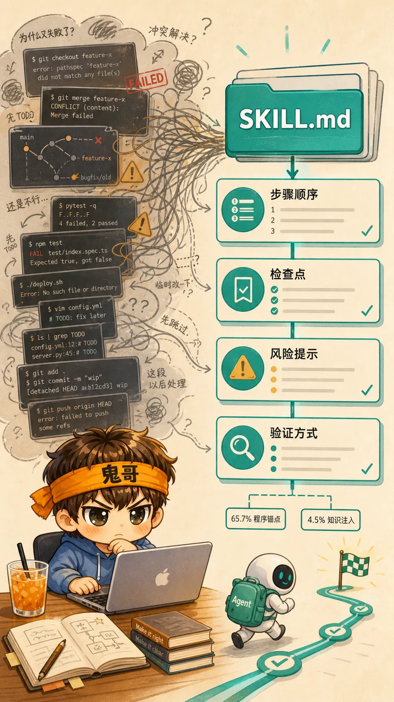
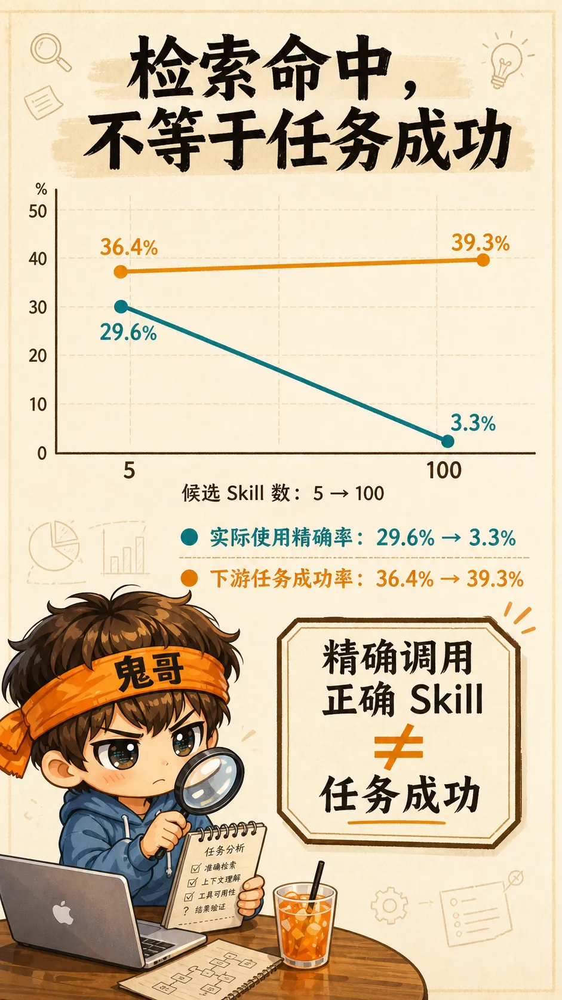

不知道大家Vibe Coding时间久了以后会不会碰到这样的问题: 学习和使用了不少有用的skill, 自己的skill库越来越丰富, 但 Skill 库越攒越多，Agent 反而偶尔开始犯一种很熟悉的病：**选择困难症。** 有些问题, 这个skill能处理, 那个也能搞定, 但又都不是完美匹配当前场景的. 导致同一个问题, 多次解决路径居然不一致, 带来的结果和周边影响也不一样.

AI跟人一样, 对一些问题有多条解决路径选择时。就跟鬼哥看到“干炒牛河、辣椒炒肉、小炒黄牛肉、湖南米粉”同时出现在菜单上，脑子就直接进入一个 `Infinity Loop` 循环, 这顿饭都没力气吃下去了。Agent 面前如果同时摆着几十份名字相近、边界暧昧的 Skill，情况大致相同，只是它不会叹气，而是更认真地读错几份文件。

鬼哥昨天读到一篇新论文 [*Demystifying Agent Skills: Why They Work—Until They Don’t*](https://arxiv.org/pdf/2608.14036) 恰好把这个问题拆开了。它问的不是“Skill 有没有用”，而是更麻烦也更有价值的问题：**它什么时候帮忙、为什么帮忙、又从哪里开始添乱？**

论文的答案很克制：Skill 确实有效，但它最主要的作用不是给 Agent 多塞一点知识，而是把过去混乱的经验压缩成一根可执行的“程序锚点”。问题也在这里：锚点一旦抛错地方，船就会稳稳地停在错误的位置。


---

## Skill 不是“经验文档”，而是经验的蒸馏

论文把同一批历史执行轨迹做成了三种版本：

| 给 Agent 的东西 | 它保留了什么 | 它容易带来的问题 |
|---|---|---|
| Raw | 什么都不注入，让 Agent 从头做 | 每次都要重新发现环境、命令和检查步骤 |
| Workflow Memory | 清洗过的历史流程 | 仍夹带失败分支、偶然细节和冗长探索 |
| Skill | 从同一批流程蒸馏出的 `SKILL.md` | 需要判断是否适用、如何适配 |

这个对照很关键。Skill 和 Workflow Memory 来自**同一批成功与失败轨迹**，所以它们的差异不能简单归因于“前者知道得更多”。

在匹配比较里，Skill 的成功率为 **61.9%**，Raw 为 **59.1%**，Workflow Memory 为 **55.9%**；Skill 相比 Workflow Memory 的增益为 **6.06 个百分点**，95% bootstrap 置信区间为 **+0.76 到 +11.36**。

更有意思的是，研究者逐条分析 Agent 轨迹后发现：Skill 有效的案例里，**65.7%** 是因为它提供了程序锚点——步骤顺序、工具调用、检查点、验证方案、常见坑；只有 **4.5%** 是因为它补充了 Agent 原本不知道的事实。

这和很多人的直觉相反。我们写 Skill 时常想“把知识写全一点”，但真正有价值的，往往是让 Agent 在关键时刻不忘记：先启动什么、再检查什么、哪种输出不算完成、踩坑后怎样退回来。

**Skill 最大的作用，不是替 Agent 多记一条知识，而是在关键步骤上少忘一件事。**



---

## 它最擅长修的，是“会做但总忘”的问题

论文里的细分结果很像所有做过 Agent 工程的人见过的事故单：

- 环境或基础设施失败：从 Raw 的 **5.3%** 降到 Skill 的 **0.2%**；
- 输出格式或 schema 不匹配：从 **7.4%** 降到 **3.2%**；
- 后台服务生命周期失败：从 **2.7%** 降到 **0.8%**。

这些不是深奥推理题。它们更多是执行纪律问题：路径没记住、服务没确认、schema 没校验、命令没按正确顺序跑。

所以一个好的 Skill，应该像一位靠谱但不啰嗦的值班同事：它不替你决定产品要不要做，却会在你准备发布前提醒“配置读了吗？”“服务起来了吗？”“返回值真符合接口吗？”

但别因此高估它。算法逻辑错误在 Skill 条件下仍有 **7.4%**，只做静态检查、没有真正运行验证的失败仍有 **11.7%**。Skill 能稳住执行，不能替人重新定义一个理解错了的问题。

---

## Skill 的反噬：它会让错误的假设更有执行力

Skill 不是自动执行的。Agent 必须先判断它是否相关，再决定跟到什么程度，还得在当前环境里修改它。

这一步一旦偷懒，Skill 就从经验变成了惯性。论文中，`skill_guidance_misapplied_or_ignored` 在 Skill 组里占 **10.0%**，而 Raw 是 **0.8%**、Workflow Memory 是 **0.4%**。

这不是说 Skill 内容一定不好。更常见的情况是：旧任务和新任务看起来像，但一个前提已经变了；Agent 拿着一份“通常正确”的流程，顺手把它套到“不再通常”的场景上。

**一个没有退出条件的 Skill，是把经验固化成偏见的最快方式。**

这也是为什么我现在更在意 Skill 里有没有下面四块，而不是它写了多少页：

```markdown
## 适用前提
- 什么输入、环境和权限下使用？

## 执行路径
- 关键步骤的顺序是什么？

## 验证标准
- 跑什么检查？什么结果才算完成？

## 退出与升级
- 哪些信号说明不适用？何时停止并转人工/换方案？
```

前面三项让它可执行，最后一项让它不会过度自信。


---

## Skill 库越大，难的不是保存，而是选择和适配

论文专门测了这个问题。候选 Skill 池从 5 个增加到 100 个时，Agent 在真实执行里实际使用 ground-truth Skill 的精确率，平均从 **29.6%** 掉到 **3.3%**。

但下游任务成功率却没有同步崩掉，只从 **36.4%** 变到 **39.3%**。原因并不神秘：Agent 可能看了多份相近 Skill；其中某份并非标注的“唯一正确答案”，却依然给了有用的操作线索。反过来，即使它选中了 ground-truth Skill，也仍可能在执行、适配或验证环节失败。

论文由此给出一个很重要的结论：**精确调用标注上的正确 Skill，既不是任务成功的充分条件，也不是必要条件。**

这对个人开发者的含义是：别只用“检索命中了没有”衡量 Skill 库。更应该问：

1. 这份 Skill 的触发条件是否能和相邻 Skill 区分开？
2. 它能否解释自己为什么适用于当前任务？
3. 它的关键步骤能否被当前环境的 verifier 验证？
4. 当它与另一份 Skill 冲突时，Agent 知不知道该降级、组合还是停下来问？

Skill 库的瓶颈从来不是存储空间，而是选择和适配能力。菜单可以很长，但“都来一份”不是一个工程策略。



---

## 失败轨迹别急着扔，它们是 Skill 的边界说明书

研究者还做了一个很实用的消融：构建 Skill 时，保留或去掉历史轨迹的“成功/失败”标记。

只有成功轨迹时，是否保留标记影响不大；一旦混入失败轨迹，结果标签就开始发挥作用。以 Gemini 在 Terminal-Bench-2 的 `3 成功 + 2 失败` 轨迹组合为例：构建 Skill 时保留 outcome labels，成功率为 **74.62%**；拿掉标签后，只有 **40.00%**。

这说明失败轨迹并不是应当删掉的脏东西。它告诉我们：哪一步看似合理却不通、什么条件一变流程就失效、最终验证为什么没有通过。

当然，失败记录原封不动地塞回上下文也不行——Workflow Memory 的 timeout/budget exhaustion 达 **10.6%**，而 Skill 为 **4.4%**。正确做法不是保存更多过程，而是把失败蒸馏成可判断的边界：**失败模式、触发条件、检查办法、替代路径。**

---

## 给个人开发者的一条 Skill 维护规则

如果你正在维护自己的 Skill 库，我建议不要从“再写一份新的”开始，而是从每次真实任务结束后的四个问题开始：

1. 这次 Agent 反复犯的，究竟是知识缺口，还是执行步骤遗漏？
2. 哪一步可以写成稳定的前提、动作和 verifier？
3. 哪个失败条件必须写进这份 Skill 的退出路径？
4. 它和已有 Skill 的边界是否足够清楚，还是只是在菜单上多加了一道相似的菜？

若答案只是“我觉得这条 Prompt 很有用”，先别急着建库。让它在几个真实任务里活下来，再把它写成 Skill。

这篇论文仍是一篇预印本，实验主要集中在终端与工具调用任务，覆盖的 Agent 框架和模型数量也有限；它不等于已经证明了所有网页 Agent 或开放式协作场景的规律。但它至少把一个常被忽略的问题说清了：Skill 的效果不是一次注入，而是一条生命周期——**蒸馏、检索、调用、适配、验证。**

回到开头那张菜单。鬼哥并不需要把所有菜从菜单上划掉；我需要的是知道今天为什么点这道、吃到一半发现不对时能不能换，以及不要把“菜单很丰富”误当成“晚饭已经解决”。

对 Agent 也是一样。

## 参考资料

- Zhiyuan Jiang et al., [*Demystifying Agent Skills: Why They Work—Until They Don’t*](https://arxiv.org/pdf/2608.14036), arXiv:2608.14036, 2026.
