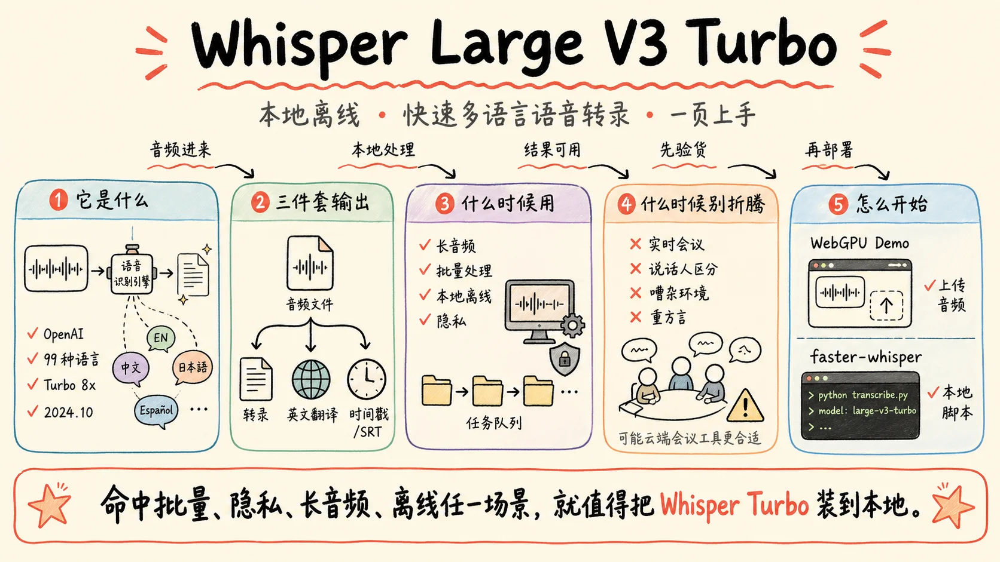
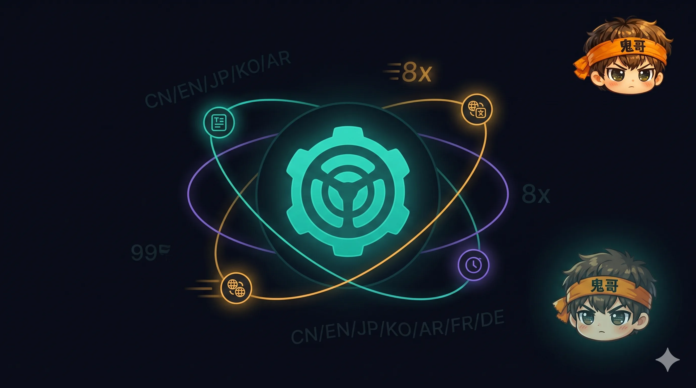
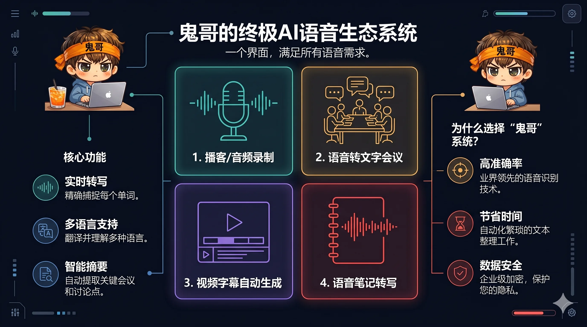
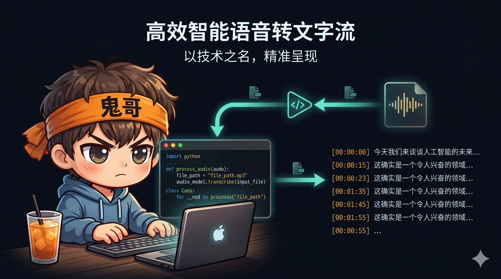

你录了 30 分钟的会议、一期播客、一段客户访谈。对方问："能给个文字版吗？"

以前你只有两个选择：**花钱**（飞书妙记按时长收费、OpenAI Whisper API 按 $0.006 每分钟扣）、**花时间**（手工转录 1 小时音频，老老实实坐 4 个小时）。

今天有第三个选择：在自己电脑上跑一个开源模型，**5 分钟出全文 + 时间戳，0 元，0 联网，0 数据外泄**。

这个模型叫 **Whisper Large V3 Turbo**，是 OpenAI 在 2024 年 10 月开源的。它不是新东西，但很多人没意识到它已经强到这种程度——也没意识到上手有多简单。



---

## Whisper Large V3 Turbo 到底是什么

一句话：**OpenAI 开源的、能听懂 99 种语言的语音识别模型，加速版**。

拆开看三件事：

**① 它来自 OpenAI 的开源家族。**
Whisper 系列从 2022 年就开始迭代，一直是开源届语音识别的事实标准。Large V3 是 2023 年底的旗舰版，质量最好但速度偏慢。**Turbo** 是 OpenAI 在 2024 年 10 月端出的"快进版"——同样的识别质量，**速度快了大约 8 倍**。它怎么做到的不是这篇文章的重点（一句话：把负责生成文字的那部分模型砍小了），重点是它**真的就是又快又准**。

**② 它的语言覆盖范围是离谱的。**
99 种语言。中文、英文、日文、韩文、法语、德语、西班牙语、阿拉伯语、印地语、葡萄牙语...... 几乎你能想到的主流语言都覆盖了，而且**中英文混读不在话下**——你那种"这个 feature 我们 Q3 ship 一下"的会议口语，它能正常出文字。

**③ 它能输出三件套。**

- **转录**：把音频原样转成文字
- **翻译**：把任何语言的音频翻译成英文（注意：只能翻成英文，反过来不行）
- **时间戳**：每一段文字都精确到秒，可以直接生成 SRT 字幕



---

## 它适合什么场景，不适合什么场景

先说**强项**：

- **长音频转录**。1 小时音频，普通 GPU 跑约 2-4 分钟，纯 CPU 也就 10-20 分钟。批量处理几十个文件睡一觉起来都好了。
- **多语言**。99 种语言一个模型搞定，不用为每种语言换一个工具。
- **要时间戳的场景**。播客 show notes、视频字幕、采访逐字稿，时间戳省掉你后期对齐的功夫。
- **隐私敏感场景**。法律咨询、医疗对话、内部会议、合同谈判——只要不出本地硬盘，怎么转都安心。
- **批量任务**。一个脚本处理一整个文件夹，不用一个个上传到云端等结果。

再说**短板**（别带着不切实际的期待去试）：

- **极嘈杂环境**。路边、菜市场、地铁里录的音，识别率会肉眼可见地下降。
- **超低延迟实时同传**。Whisper 设计上是"段落级"的识别，不是给同声传译那种 200ms 内吐字用的。
- **重方言**。粤语日常对话还能用，但潮汕话、温州话、闽南语就别难为它了。
- **强口音英语**。印度英语、苏格兰英语效果会打折——不是不能用，是别期待 100% 准确。

---

## 和飞书妙记、通义听悟、OpenAI API 比，到底差在哪

很多人会问：飞书妙记不挺好用吗，为啥还要折腾本地部署？

我做了张对比表，你看完就知道**它们不是替代关系，是互补的**：

| | **Whisper Turbo（本地）** | **飞书妙记** | **通义听悟** | **OpenAI Whisper API** |
|---|---|---|---|---|
| **价格** | 免费 | ~0.06 元/分钟 | ~0.05 元/分钟 | $0.006/分钟（约 0.04 元） |
| **数据隐私** | ✅ 完全本地 | ❌ 上传云端 | ❌ 上传云端 | ❌ 上传云端 |
| **离线能力** | ✅ 可离线 | ❌ 必须联网 | ❌ 必须联网 | ❌ 必须联网 |
| **中文质量** | 优秀 | 优秀 | 优秀 | 优秀 |
| **多语言数量** | 99 种 | ~10 种 | ~15 种 | 99 种（同 Whisper） |
| **实时转录** | 一般 | ✅ 强项 | ✅ 强项 | ❌ 不支持 |
| **说话人区分** | 需额外工具 | ✅ 内置 | ✅ 内置 | ❌ 不支持 |
| **上手难度** | 中（需装环境） | 极低 | 极低 | 低 |
| **杀手场景** | 批量、隐私、长音频 | 实时会议、团队协作 | 实时会议 | 应用集成 |

**翻译成大白话**：

- **会议**用飞书妙记 / 通义听悟，因为人家有实时转录 + 说话人区分 + 团队协作。
- **批量处理一堆历史录音**用 Whisper Turbo，免费、隐私、速度还快。
- **做产品集成**（比如你在搭一个语音笔记 App）用 OpenAI API，省心。
- **数据不能出公司 / 不能上云**只有 Whisper Turbo 这一条路。



---

## 上手实操 ①：零配置，浏览器里跑一遍

最快的体验路径：**直接在浏览器里跑**。不用装 Python、不用配 GPU、不用申请 API Key。

打开这个 Hugging Face Space：

> **https://huggingface.co/spaces/webml-community/whisper-large-v3-turbo-webgpu**

操作三步：

1. **第一次打开会下载约 800MB 的模型**（之后浏览器缓存，再开秒进）
2. **上传一段音频文件**，或者直接用麦克风录一段
3. **等它处理完，文字就出来了**

要求：用 Chrome 或 Edge（要支持 WebGPU），最好有独立显卡。如果只是想感受一下识别质量，找一段你自己的播客录音或者会议片段扔进去——亲自看一遍中文识别率，比看任何 benchmark 数据都直观。


这条路适合：**先验货再决定要不要本地部署**。或者偶尔有个小文件需要转一下，不想装环境。

---

## 上手实操 ②：本地一键跑（faster-whisper）

确认效果 OK 之后，下一步是把它装到自己电脑上。

我推荐 **faster-whisper** 这个库——它是 Whisper 的一个加速实现，**比官方 whisper 库还快 4 倍左右**，API 又简单。装一次，以后所有音频都能本地处理。

**安装**：

```bash
pip install faster-whisper
```

**最小可用代码**（保存为 `transcribe.py`）：

```python
from faster_whisper import WhisperModel

# 模型选择：tiny / base / small / medium / large-v3 / large-v3-turbo
# 第一次跑会自动下载，约 1.6GB，缓存到本地
model = WhisperModel(
    "large-v3-turbo",
    device="cuda",           # 没有 GPU 的话改成 "cpu"
    compute_type="float16",  # CPU 用户改成 "int8"
)

# 开转
segments, info = model.transcribe(
    "meeting.mp3",
    beam_size=5,
    language="zh",  # 不写会自动检测，写明能加速且更准
)

print(f"检测到语言：{info.language}（置信度 {info.language_probability:.2f}）")

# segments 是个生成器，按需取出
for seg in segments:
    print(f"[{seg.start:.2f}s -> {seg.end:.2f}s] {seg.text}")
```

跑起来长这样：

```
检测到语言：zh（置信度 0.99）
[0.00s -> 3.20s] 大家好,今天我们来讨论第三季度的产品规划
[3.20s -> 6.80s] 首先看一下市场反馈数据
[6.80s -> 11.50s] 第二点是我们的竞品分析,Q2 我们漏了几个关键信号
......
```

**几个常见的下一步**：

- **想要 SRT 字幕文件**？把 `segments` 循环里的 `start/end/text` 按 SRT 格式拼出来写文件就行，30 行代码搞定。
- **想给视频自动加字幕**？`ffmpeg` 抽音频 → faster-whisper 转录 → 输出 SRT → `ffmpeg` 烧录回视频，全程脚本化。
- **想要识别说话人**（"这句是 A 说的，那句是 B 说的"）？搭配 `pyannote.audio`，Whisper 负责识别，pyannote 负责区分说话人。
- **Mac M 系列芯片**？可以试试 `mlx-whisper`，专门给 Apple Silicon 优化，更快。



第一次跑会卡在下载模型那一步（1.6GB 不算小），后续就秒启动了。如果下载慢，记得设个 Hugging Face 镜像源。

---

## Takeaway

回顾一下，Whisper Large V3 Turbo 这事就三句话：

1. **它是什么**：OpenAI 开源的语音识别模型，99 种语言通吃，识别质量已经达到了"日常工作可用"的水平，速度比上一代快 8 倍。
2. **什么时候用它**：批量长音频、需要隐私、要时间戳、要离线——这四种场景任何一种命中，就值得装。
3. **什么时候别折腾**：实时会议转录用飞书妙记 / 通义听悟，偶尔几分钟的小文件用免费云服务，做产品集成用 OpenAI API。

下一步只做两件事：

- 先点开 [在线 demo](https://huggingface.co/spaces/webml-community/whisper-large-v3-turbo-webgpu) 用你自己的录音试一遍——30 秒就能判断它对你的口音、行业术语适不适用。
- 如果觉得行，`pip install faster-whisper`，把上面那段代码存成 `transcribe.py`，下次再有音频要转，**自己说了算**。

---

## 参考资料

- [Whisper Large V3 Turbo — OpenAI 官方仓库](https://huggingface.co/openai/whisper-large-v3-turbo)
- [ONNX 社区版（适合浏览器/WebGPU）](https://huggingface.co/onnx-community/whisper-large-v3-turbo)
- [faster-whisper — SYSTRAN/CTranslate2 实现](https://github.com/SYSTRAN/faster-whisper)
- [浏览器在线 Demo（WebGPU）](https://huggingface.co/spaces/webml-community/whisper-large-v3-turbo-webgpu)
- [pyannote.audio — 说话人区分](https://github.com/pyannote/pyannote-audio)
- [mlx-whisper — Apple Silicon 优化版](https://github.com/ml-explore/mlx-examples/tree/main/whisper)
