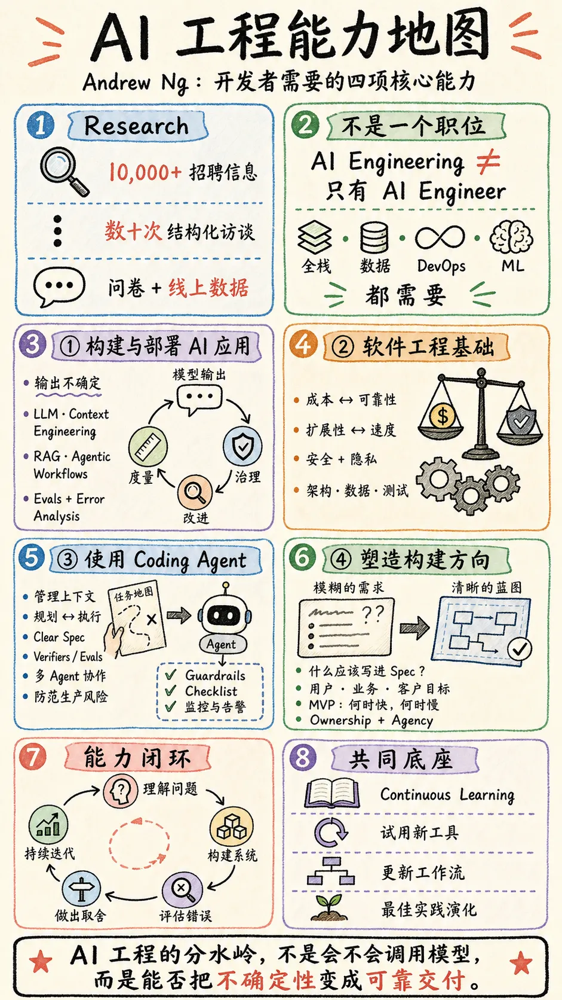
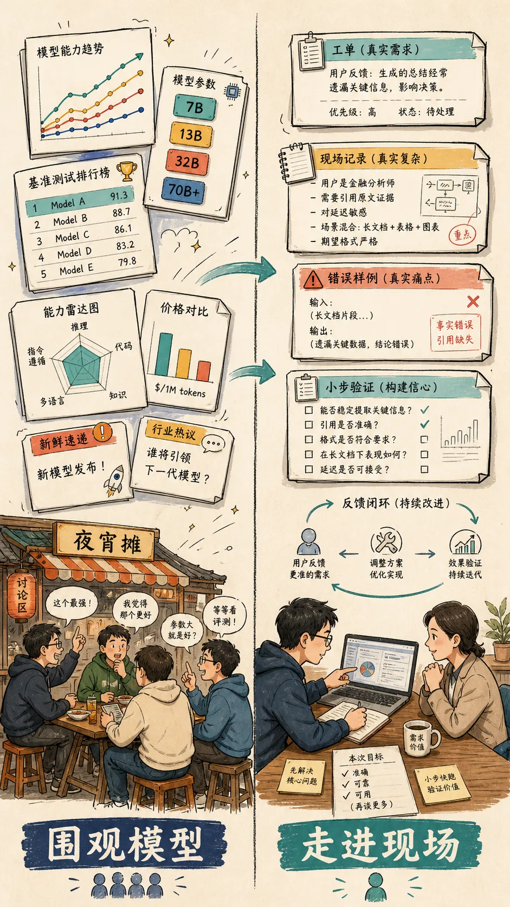
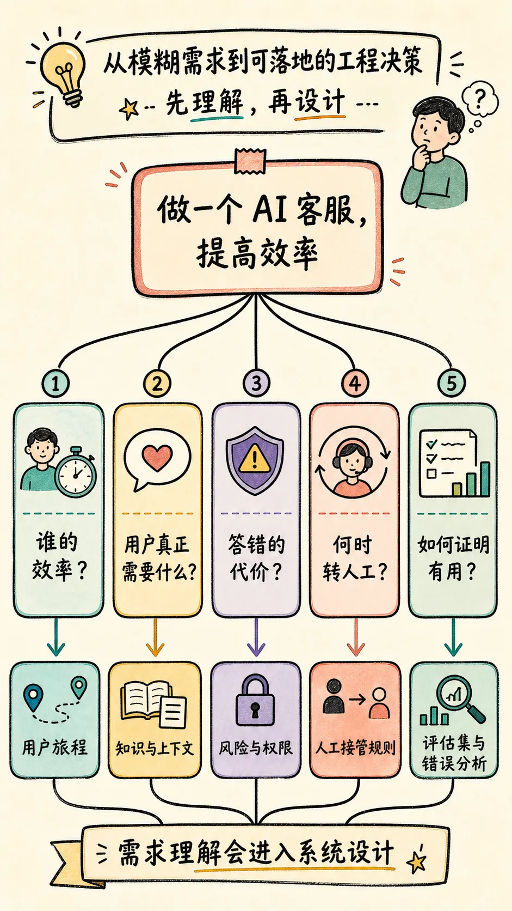
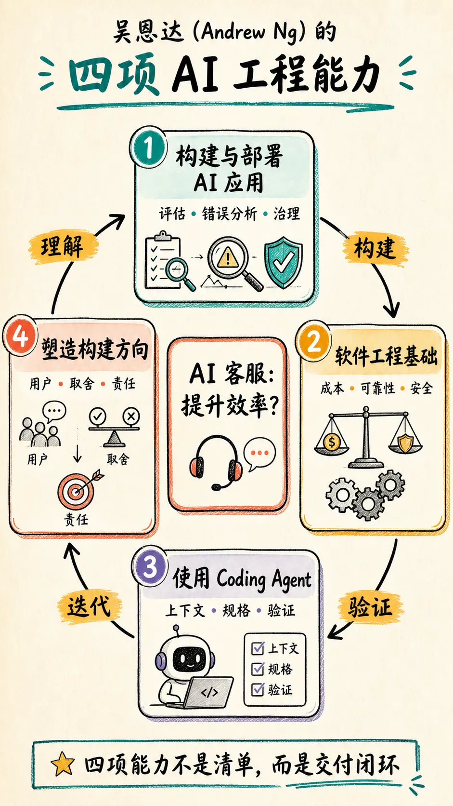
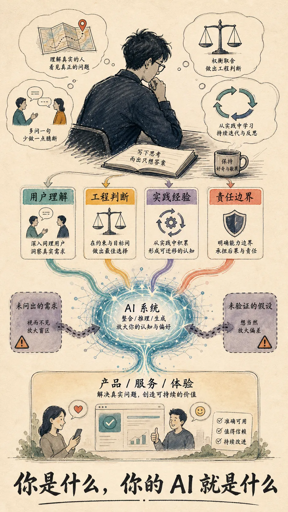

Andrew Ng 最近发布了 *The AI Engineering Skills Map*。

我原以为，它大概又会列出一串要学的新名词：模型、Agent、RAG、MCP、评估……毕竟这两年 AI 圈最不缺的，就是下一批必须学会的工具。

但读完后，真正让我停下来的不是某个工具，而是其中一项能力：**Shaping the build。**

当 AI 越来越擅长“按规格把东西做出来”，工程师更重要的工作，反而变成了决定：**究竟什么值得被做出来。**

---

## 我们太擅长围观模型，太少真正走进现场

这两年，AI 圈最不缺的，是围绕模型的热闹。

又一家机构发布了新模型，参数多大，跑分涨了多少，在哪个 benchmark 超过了谁。我们很容易花半天时间讨论它的能力边界，仿佛坐在路边摊上，也能把国际局势分析得头头是道。

信息当然重要。模型进步也确实会改变工程方案。我自己也在关注、在试用、在学习各种 AI Coding 工具、harness 和 Skill。

但读完 Andrew 的文章，我开始反问：这些信息最后有多少变成了我真正做过的东西？我有没有拿一个真实问题去试过、撞过墙、做过评估、承担过一次“它答错了怎么办”的后果？

鬼哥一直有个很朴素的判断：

> **上过一天战场的普通士兵，强过训练过一年、却从未见过敌人眼中杀气的特种部队。**

放到 AI 开发上，这不是鼓吹粗糙上线，而是说：一次真实实践里遇到的脏数据、用户误解、预算约束、模型幻觉和责任边界，比十篇模型评测更能逼着人长出工程判断。

---

## 一句“做个 AI 客服”，其实还没有开始定义问题

假设有人对你说：

> “我们做一个 AI 客服，提高客服效率吧。”

这句话看起来已经足够清楚。于是很自然的下一步是：选一个模型，接知识库，做一个聊天窗口，必要时再加个 RAG 和转人工按钮。

这些都没错。但这其实是把一个**尚未被理解的问题**，过早翻译成了一个技术方案。

更值得先问的是：

- “效率”到底是谁的效率？是用户更快得到答案，还是客服少处理一些重复问题？
- 用户来找客服时，真的只需要一个事实答案吗？还是需要确认、安抚、解释，甚至需要一个愿意负责的人？
- 如果它答错了一次，错的是退款金额、物流状态，还是医疗、金融、账户安全这类高风险问题？
- 哪些问题可以自动处理，哪些必须立刻转给人？

这些问题会直接改变知识库怎么建、工具权限开多大、评估集怎么选、何时升级人工、界面如何表达不确定性，以及为了可靠性愿意付出多少成本。

所谓“理解用户”“理解人性”，不是产品课上的漂亮话。它会一行一行地进入你的系统设计。

---

## Andrew 的四项能力，恰好解释了差别从哪里开始

Andrew 的团队基于 10,000 多条招聘信息、专家与招聘方访谈、问卷及其他在线数据，归纳出四项最重要的 AI Engineering 能力。对我来说，它们不是一张“待学名词表”，而是一张让那句 AI 客服需求显影的地图。

### 1. 构建与部署 AI 应用：把“不确定”当作系统属性

传统软件大多是确定性的：同样的输入，通常得到同样的输出。AI 应用不是。你给 LLM 一段上下文，不会完全知道它下一次会怎么回答；你训练一个模型，也无法保证它面对新样本时的判断。

所以 AI 客服的关键从来不是“它能不能回答”，而是：**它会怎样答错，我们如何发现、衡量并纠正它。**

这就是为什么 Andrew 特别强调 disciplined evals 和 error analysis loops。没有评估和错误分析，所谓优化常常只是换一个 Prompt、换一个模型，然后凭感觉说“似乎好一些”。

### 2. 软件工程基础：AI 不会替你做取舍

一个客服系统不仅有模型，还有并发、延迟、缓存、数据权限、审计、成本、可用性和隐私。

如果客户上传的订单截图被送进第三方模型，数据如何处理？如果一个工具调用错了退款接口，如何避免不可逆操作？如果高峰期响应慢了 3 秒，用户会等待还是转人工？

这些没有标准答案，只有取舍。**工程基础的价值，不是让人比 Agent 多写几行代码，而是让人看见 Agent 看不见、也不会主动替你承担的代价。**

### 3. 使用 Coding Agent：不是让它替你思考，而是让它进入闭环

Coding Agent 能很快搭出客服界面、接好 API、补齐测试的表面结构。它也可能在没有足够上下文时，做出一个看起来合理、实则危险的默认选择。

会用 Agent，远不止会写一段 Prompt。它意味着你知道该给什么上下文，什么时候先规划，什么时候直接执行；更意味着你能给它清晰的 verifier：哪些回答算正确，哪些调用绝不能发生，哪些失败必须自动暴露。

Agent 是执行的杠杆。**没有规格、边界和验证，它放大的往往只是含糊。**

### 4. Shaping the build：最难的工作在代码之前

前三项能力让系统能被可靠地做出来；第四项追问的是：它该不该这样被做出来？

当 Agent 越来越擅长交付一份明确的 spec，工程师的价值正从“把 spec 写成代码”，逐渐前移到“参与决定 spec 应该写什么”。

回到 AI 客服：也许真正的问题不是客服打字太慢，而是退款规则本身让用户反复追问；也许用户要的不是一个更会说话的机器人，而是一个能告诉他“这件事已经由谁、在什么时候处理”的确定性。

如果没有走到用户面前，没有理解业务目标和人的感受，再强的模型也只会把错误的问题实现得更快。

---

## 持续学习，不是追完每一条模型新闻

Andrew 在最后还提到了一项贯穿所有能力的底层心态：**Continuous Learning。**

这句话看起来最不“技术”，却可能是最难的一项。

因为 AI 变化太快了。模型在变，Coding Agent 的能力边界在变，工具的最佳实践也在变。两个月前还需要手工拆解的步骤，今天可能已经可以交给 Agent；今天看起来可靠的工作流，下一次模型升级后又可能需要重新设计。

所以，持续学习当然包括关注新模型、试用新工具、阅读好文章。但如果它只停在这些地方，我们又会回到开头那种“围观模型”的热闹里。

我更愿意把它理解成一种**把真实反馈不断写回自己脑中的能力**：

1. 用一个真实问题做出最小可用的尝试；
2. 看它在真实用户、真实数据和真实约束下怎样失败；
3. 分析失败到底来自模型、上下文、流程、工程设计，还是自己一开始就理解错了需求；
4. 把得到的判断更新进下一次的规格、提示、评估和系统边界；
5. 再去尝试新的模型和工具，而不是把“新”本身当成收获。

这才是一种会越用越强的学习循环。

比如 AI 客服上线后，发现用户不断追问“我的退款到底什么时候到账”。这未必说明模型不够聪明。它也许暴露的是：系统没有接到订单状态、退款流程对用户不透明、客服话术没有说清责任人，或者我们一开始就把“效率”误解成了“少回复几句”。

一次这样的失败，往往比知道某个新模型多了几个 benchmark 分数更有价值。前者会改变你下一次怎么理解问题；后者未必会。

持续学习因此不是把知识库存得越来越满，而是让自己的判断在一次次真实交付中变得更准。**它让工具进步不只发生在屏幕上，也发生在使用工具的人身上。**

---

## AI 提高了效率，但没有取消人的认知边界

这也是我从这张技能地图里读到的、更私人一点的理解。

AI 确实让我们以前所未有的速度做出页面、功能、原型，甚至一个像模像样的产品。它降低了表达想法的成本，也放大了动手实践的机会。

但它没有自动给我们产品判断，没有自动补齐软件工程的基本功，也不会替我们理解需求背后那个焦虑、愤怒、着急或无助的人。

你给 AI 的不只是 Prompt。你给它的还有：你对用户的理解、你识别风险的能力、你知道哪些地方该慢下来、以及你愿意对什么结果负责。

当然，反过来也成立：你没有看见的约束、没有问出的需求、没有验证的假设，也都会被它更快地编码进产品。

**你是什么，你的 AI 就是什么。**

---

## 每次让 AI 开工前，先问自己五个问题

如果这篇文章只留下一件可以立刻执行的事，我希望是下面这五问：

1. 用户说出的需求，背后真正想解决的是什么？
2. AI 答错或做错一次，谁承担什么后果？
3. 我用什么真实样本和标准，判断它真的有用？
4. 哪些决策可以交给 AI，哪些必须由人负责？
5. 我现在给 AI 的上下文，是否已经暴露了自己的认知盲区？

AI Coding 最好的时代，或许不是每个人都能更快地生成代码的时代。

而是每个愿意走进真实问题、持续校准自己判断的人，都能把自己的能力更大规模地交付给世界的时代。

---

## 参考资料

- Andrew Ng, *The AI Engineering Skills Map*
